<div align="center">

# 🖧 Enterprise IP Addressing, Subnetting, VLSM & CIDR Optimization

**Lab 01 — Cisco Networking Lab Portfolio**

Right-Sizing a Single /20 Block Across 3 Buildings and 3 WAN Links (Cisco Packet Tracer)


A single allocated `/20` block is carved with VLSM into three right-sized building subnets and three point-to-point WAN links, wired into a triangular 3-router topology in Packet Tracer, and routed end-to-end with OSPF (Area 0). Every stage is backed by a screenshot. One ping test gap and one masked misconfiguration are called out below rather than hidden.

</div>

---

## 📑 Table of Contents

1. [At a Glance](#at-a-glance)
2. [Project Background](#project-background)
3. [Tools & Technologies](#tools-technologies)
4. [Environment](#environment)
6. [Topology](#topology)
7. [Design Scenario & VLSM Math](#design-scenario)
8. [VLSM Allocation Table](#vlsm-allocation-table)
9. [Module 1 — Build the Topology](#module-1)
10. [Module 2 — Router Interface Configuration](#module-2)
11. [Module 3 — OSPF Routing](#module-3)
12. [Module 4 — End Device Configuration](#module-4)
13. [Module 5 — Verification & Save](#module-5)
14. [Coverage Snapshot](#coverage-snapshot)
15. [Command Summary](#command-summary)
16. [Challenges & Fixes](#challenges-fixes)
17. [Scope & Limitations](#scope-limitations)
18. [What I Learned](#what-i-learned)
19. [Skills Demonstrated](#skills-demonstrated)
20. [Screenshot Index](#screenshot-index)
21. [Repo Structure](#repo-structure)

---

<a id="at-a-glance"></a>
## 📊 At a Glance

| 🖧 Allocated Block | 🏢 Buildings | 🔗 WAN Links | 📡 Routing | 🖼️ Screenshots | 💰 Cost |
|:---:|:---:|:---:|:---:|:---:|:---:|
| **172.16.0.0/20** | **3** | **3** | **OSPF Area 0** | **13** | **Free (Packet Tracer)** |

---

<a id="project-background"></a>
## 📖 Project Background

Enterprise IP planning starts with one allocated block and a list of buildings that need very different numbers of hosts. VLSM lets each subnet be sized to what it actually needs instead of handing every site the same block, and OSPF then stitches the sized-down pieces back into one routed network.

- **Module 1 — Build the Topology:** Wire 3 routers, 3 switches and 3 PCs into a triangular campus layout.
- **Module 2 — Router Interface Configuration:** Assign the VLSM-derived addresses to each router's LAN and WAN interfaces.
- **Module 3 — OSPF Routing:** Advertise every subnet into Area 0 so the three buildings can reach each other.
- **Module 4 — End Device Configuration:** Give each PC a static IP, mask and gateway matching its building's subnet.
- **Module 5 — Verification & Save:** Ping across buildings, check the OSPF routing table, and save the configs.

> [!NOTE]
> This is a Packet Tracer simulation, not physical hardware. Command output referenced in a step is what the corresponding screenshot shows; anything not shown in a screenshot is marked 📝.

---

<a id="tools-technologies"></a>
## 🛠️ Tools & Technologies

| Tool | Purpose |
|------|---------|
| Cisco Packet Tracer | Network simulation |
| Router 2911 x3 | HQ-R1, HQ-R2, HQ-R3 — one per building, interconnected via WAN links |
| Switch 2960 x3 | Building-level switching |
| VLSM | Right-sizing each subnet to actual host need, no waste |
| OSPF (Area 0) | Dynamic routing between buildings and WAN links |

---

<a id="environment"></a>
## 🖧 Environment

| Item | Value |
|---|---|
| **Simulator** | Cisco Packet Tracer |
| **Allocated Block** | `172.16.0.0/20` (4,096 addresses) |
| **Routers** | 3× Cisco 2911 — HQ-R1, HQ-R2, HQ-R3 |
| **Switches** | 3× Cisco 2960 — one per building |
| **End Devices** | 3× PC — PC-A, PC-B, PC-C |
| **Routing Protocol** | OSPF, process ID 10, Area 0 |
| **Layout** | Triangular — every router has one LAN link (its building) and two WAN links (to the other two routers) |

---

<a id="topology"></a>
## 🗺️ Topology

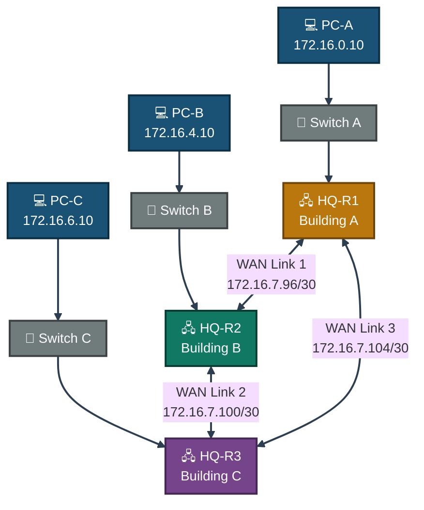
<p align="center"><em>Every router carries one LAN subnet (its building) and two /30 WAN links, forming a routed triangle with OSPF Area 0 running over all six links.</em></p>

---

<a id="design-scenario"></a>
## 🏢 Design Scenario & VLSM Math

Allocated block: **172.16.0.0/20** (4,096 total addresses)

| Building/Link | Hosts Needed | Scaled To | Prefix |
|---|---|---|---|
| Building A — Core Operations | 1,000 | 1,024 (2¹⁰) | /22 |
| Building B — Engineering & Dev | 500 | 512 (2⁹) | /23 |
| Building C — Sales & Admin | 250 | 256 (2⁸) | /24 |
| WAN Links (×3) | 2 each | 4 each (2²) | /30 |

Each site is rounded up to the next power of two so the mask lines up on a clean boundary, then the blocks are packed largest-first with no gaps between them — the standard VLSM allocation order.

---

<a id="vlsm-allocation-table"></a>
## 📊 VLSM Allocation Table

| Network | Subnet | Mask | Usable Range |
|---|---|---|---|
| Building A | 172.16.0.0/22 | 255.255.252.0 | 172.16.0.1 – 172.16.3.254 |
| Building B | 172.16.4.0/23 | 255.255.254.0 | 172.16.4.1 – 172.16.5.254 |
| Building C | 172.16.6.0/24 | 255.255.255.0 | 172.16.6.1 – 172.16.6.254 |
| WAN Link 1 (R1–R2) | 172.16.7.96/30 | 255.255.255.252 | 172.16.7.97 – 172.16.7.98 |
| WAN Link 2 (R2–R3) | 172.16.7.100/30 | 255.255.255.252 | 172.16.7.101 – 172.16.7.102 |
| WAN Link 3 (R3–R1) | 172.16.7.104/30 | 255.255.255.252 | 172.16.7.105 – 172.16.7.106 |

> **Gap in the design:** Buildings A/B/C are packed contiguously with zero gaps (172.16.0.0 → 172.16.6.255). `172.16.7.0` – `172.16.7.95` sits unused before the WAN links start — reclaimable space in a tighter design.

---

<a id="module-1"></a>
## 🔵 Module 1 — Build the Topology

**Objective:** Wire 3 routers, 3 switches and 3 PCs into the triangular campus layout.

### Step 1 — Deploy and Wire the Topology ✅

Deploy 3 routers (HQ-R1, HQ-R2, HQ-R3) in a triangular structure, each connected down to its own switch and one PC. No CLI commands — physical/logical wiring in the Packet Tracer GUI.

<p align="center">
  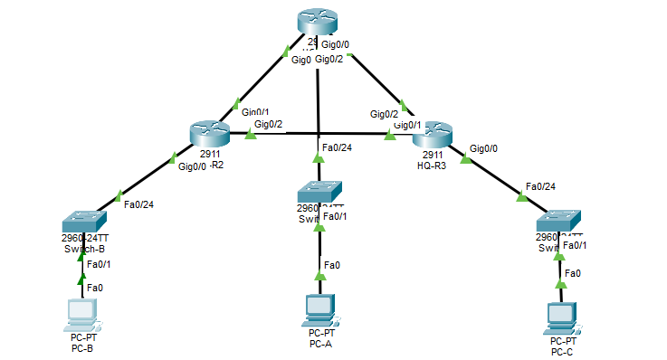<br>
  <em>Exhibit 1 — Full topology: HQ-R1/R2/R3 interconnected in a triangle, each with a switch and PC below it</em>
</p>

---

<a id="module-2"></a>
## 🟢 Module 2 — Router Interface Configuration

**Objective:** Assign every VLSM-derived address to its LAN or WAN interface on all three routers.

### Step 2 — Configure HQ-R1 Interfaces ✅

```
HQ-R1(config)# hostname HQ-R1
HQ-R1(config)# interface GigabitEthernet0/0
HQ-R1(config-if)# ip address 172.16.0.1 255.255.252.0
HQ-R1(config-if)# no shutdown
HQ-R1(config-if)# exit
HQ-R1(config)# interface GigabitEthernet0/1
HQ-R1(config-if)# ip address 172.16.7.97 255.255.255.252
HQ-R1(config-if)# no shutdown
HQ-R1(config-if)# exit
HQ-R1(config)# interface GigabitEthernet0/2
HQ-R1(config-if)# ip address 172.16.7.106 255.255.255.252
HQ-R1(config-if)# no shutdown
HQ-R1(config-if)# end
```

<p align="center">
  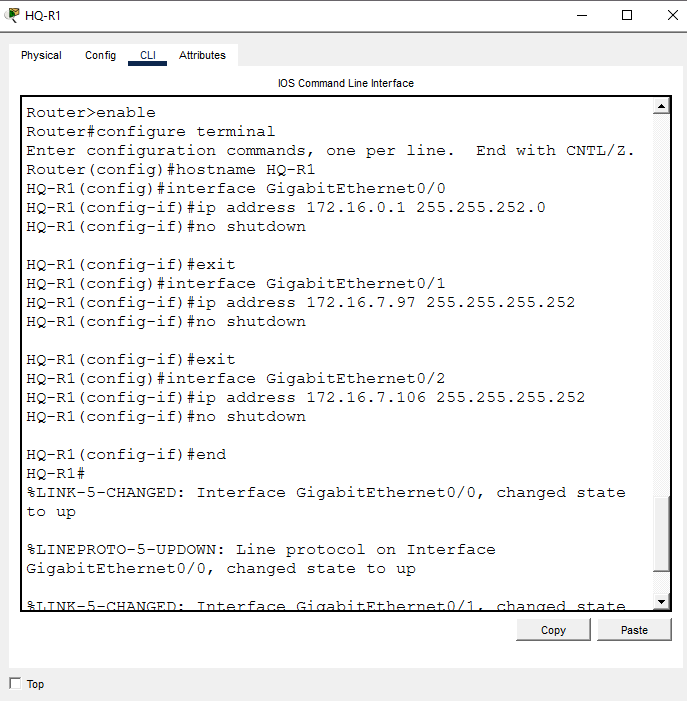<br>
  <em>Exhibit 2 — HQ-R1: Gi0/0 on Building A (172.16.0.1/22), Gi0/1 on WAN Link 1 (172.16.7.97/30), Gi0/2 on WAN Link 3 (172.16.7.106/30)</em>
</p>

### Step 3 — Configure HQ-R2 Interfaces ✅

```
HQ-R2(config)# hostname HQ-R2
HQ-R2(config)# interface GigabitEthernet0/0
HQ-R2(config-if)# ip address 172.16.4.1 255.255.254.0
HQ-R2(config-if)# no shutdown
HQ-R2(config-if)# exit
HQ-R2(config)# interface GigabitEthernet0/1
HQ-R2(config-if)# ip address 172.16.7.98 255.255.255.252
HQ-R2(config-if)# no shutdown
HQ-R2(config-if)# exit
HQ-R2(config)# interface GigabitEthernet0/2
HQ-R2(config-if)# ip address 172.16.7.101 255.255.255.252
HQ-R2(config-if)# no shutdown
HQ-R2(config-if)# end
```

<p align="center">
  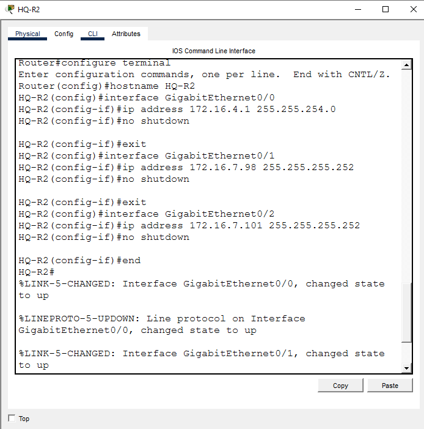<br>
  <em>Exhibit 3 — HQ-R2: Gi0/0 on Building B (172.16.4.1/23), Gi0/1 on WAN Link 1 (172.16.7.98/30), Gi0/2 on WAN Link 2 (172.16.7.101/30)</em>
</p>

### Step 4 — Configure HQ-R3 Interfaces ✅

```
HQ-R3(config)# hostname HQ-R3
HQ-R3(config)# interface GigabitEthernet0/0
HQ-R3(config-if)# ip address 172.16.6.1 255.255.255.0
HQ-R3(config-if)# no shutdown
HQ-R3(config-if)# exit
HQ-R3(config)# interface GigabitEthernet0/1
HQ-R3(config-if)# ip address 172.16.7.102 255.255.255.252
HQ-R3(config-if)# no shutdown
HQ-R3(config-if)# exit
HQ-R3(config)# interface GigabitEthernet0/2
HQ-R3(config-if)# ip address 172.16.7.105 255.255.255.252
HQ-R3(config-if)# no shutdown
HQ-R3(config-if)# end
```

<p align="center">
  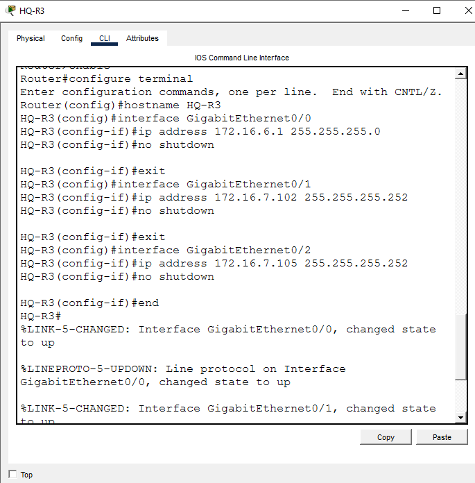<br>
  <em>Exhibit 4 — HQ-R3: Gi0/0 on Building C (172.16.6.1/24), Gi0/1 on WAN Link 2 (172.16.7.102/30), Gi0/2 on WAN Link 3 (172.16.7.105/30)</em>
</p>

---

<a id="module-3"></a>
## 🟣 Module 3 — OSPF Routing

**Objective:** Advertise every LAN and WAN subnet into OSPF Area 0 so all three buildings can reach each other.

### Step 5 — HQ-R1 OSPF Routing ✅

```
HQ-R1(config)# router ospf 10
HQ-R1(config-router)# network 172.16.0.0 0.0.3.255 area 0
HQ-R1(config-router)# network 172.16.7.96 0.0.0.3 area 0
HQ-R1(config-router)# network 172.16.7.104 0.0.0.3 area 0
HQ-R1(config-router)# end
```

<p align="center">
  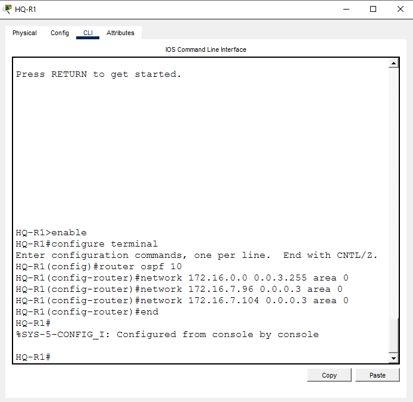<br>
  <em>Exhibit 5 — HQ-R1 OSPF process 10: Building A network plus both WAN links to R2 and R3 advertised into Area 0</em>
</p>

### Step 6 — HQ-R2 OSPF Routing ✅

```
HQ-R2(config)# router ospf 10
HQ-R2(config-router)# network 172.16.4.0 0.0.1.255 area 0
HQ-R2(config-router)# network 172.16.7.96 0.0.0.3 area 0
HQ-R2(config-router)# network 172.16.7.100 0.0.0.3 area 0
HQ-R2(config-router)# end
```

<p align="center">
  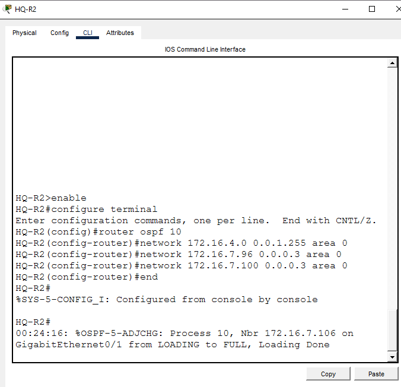<br>
  <em>Exhibit 6 — HQ-R2 OSPF process 10: Building B network plus both WAN links to R1 and R3 advertised into Area 0</em>
</p>

### Step 7 — HQ-R3 OSPF Routing ✅

```
HQ-R3(config)# router ospf 10
HQ-R3(config-router)# network 172.16.6.0 0.0.0.255 area 0
HQ-R3(config-router)# network 172.16.7.100 0.0.0.3 area 0
HQ-R3(config-router)# network 172.16.7.104 0.0.0.3 area 0
HQ-R3(config-router)# end
```

<p align="center">
  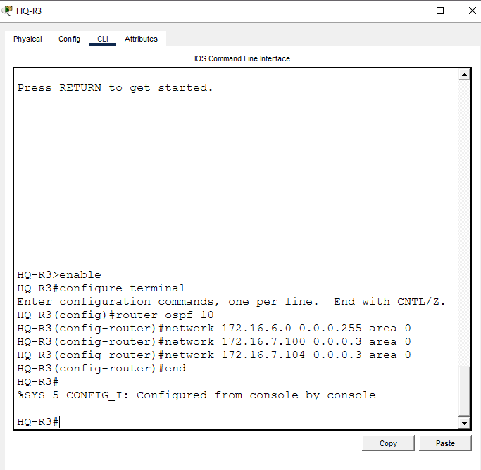<br>
  <em>Exhibit 7 — HQ-R3 OSPF process 10: Building C network plus both WAN links to R1 and R2 advertised into Area 0</em>
</p>

---

<a id="module-4"></a>
## 🟠 Module 4 — End Device Configuration

**Objective:** Give each PC a static IP, mask and gateway matching its building's subnet.

### Step 8 — PC-A Static IP ✅

| Field | Value |
|---|---|
| IP Address | 172.16.0.10 |
| Subnet Mask | 255.255.252.0 |
| Default Gateway | 172.16.0.1 |

<p align="center">
  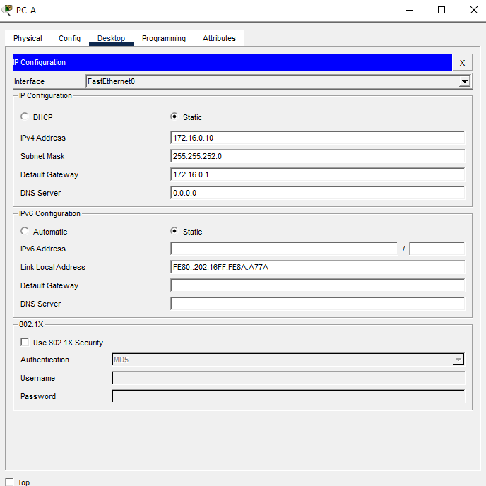<br>
  <em>Exhibit 8 — PC-A static IP config, gateway pointing to HQ-R1</em>
</p>

### Step 9 — PC-B Static IP ✅

| Field | Value |
|---|---|
| IP Address | 172.16.4.10 |
| Subnet Mask | 255.255.254.0 |
| Default Gateway | 172.16.4.1 |

<p align="center">
  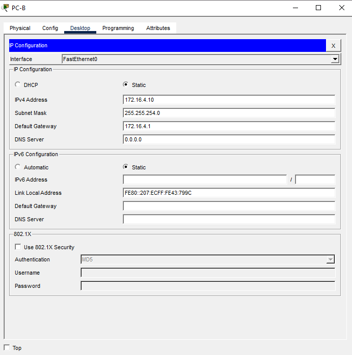<br>
  <em>Exhibit 9 — PC-B static IP config, gateway pointing to HQ-R2</em>
</p>

### Step 10 — PC-C Static IP ✅

| Field | Value |
|---|---|
| IP Address | 172.16.6.10 |
| Subnet Mask | 255.255.255.0 |
| Default Gateway | 172.16.6.1 |

<p align="center">
  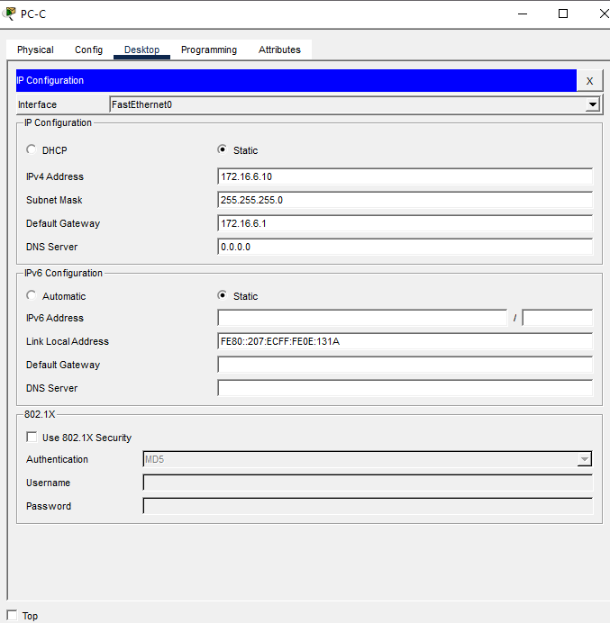<br>
  <em>Exhibit 10 — PC-C static IP config, gateway pointing to HQ-R3</em>
</p>

---

<a id="module-5"></a>
## 🔴 Module 5 — Verification & Save

**Objective:** Confirm cross-campus reachability, check what OSPF actually learned, and persist the configs.

### Step 11 — Cross-Campus Ping Verification ⚠️

```
PC-A> ping 172.16.4.10
PC-A> ping 172.16.6.10
```

<p align="center">
  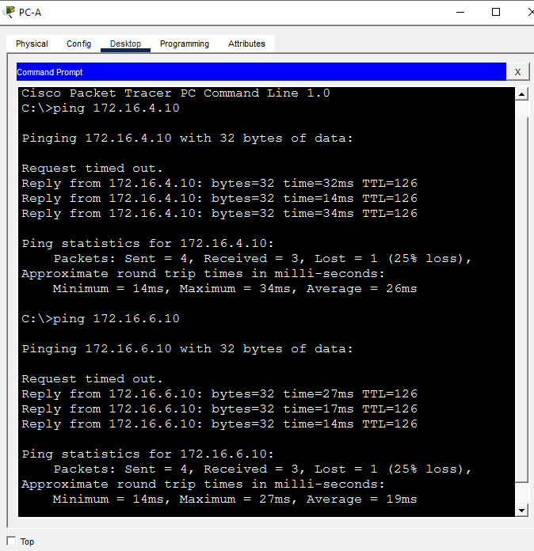<br>
  <em>Exhibit 11 — PC-A successfully pings PC-B (172.16.4.10) and PC-C (172.16.6.10)</em>
</p>

> **Gap to close:** this only verifies A→B and A→C. It doesn't confirm B→C reachability. For a complete full-mesh test, also run `PC-B> ping 172.16.6.10`.

### Step 12 — Routing Table Verification ✅

```
HQ-R1# show ip route ospf
HQ-R2# show ip route ospf
HQ-R3# show ip route ospf
```

<p align="center">
  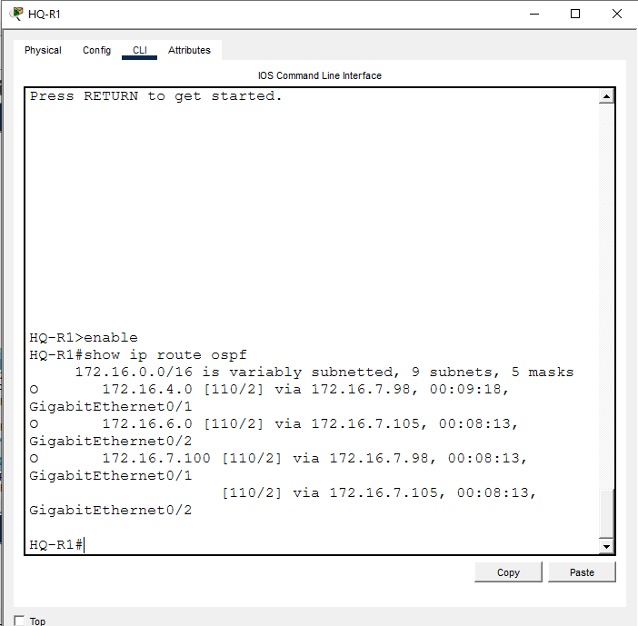<br>
  <em>Exhibit 12 — Each router's OSPF-learned routes to the other buildings' subnets</em>
</p>

### Step 13 — Save Configuration ✅

```
HQ-R1# copy running-config startup-config
HQ-R2# copy running-config startup-config
HQ-R3# copy running-config startup-config
```

<p align="center">
  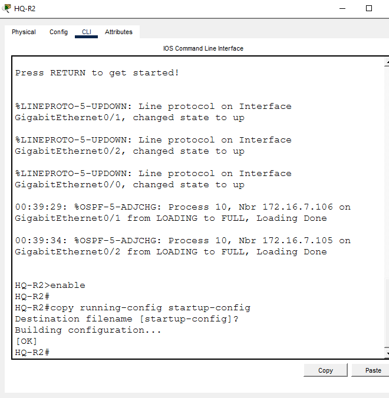<br>
  <em>Exhibit 13 — Running config saved to startup config on all three routers</em>
</p>

### 🗺️ Verification Coverage


<p align="center"><em>Only the two pings from Exhibit 11 are shown. B↔C is inferred from the OSPF routing table (Exhibit 12), not from a direct ping.</em></p>

---

<a id="coverage-snapshot"></a>
## 🌟 Coverage Snapshot

| 🛡️ Layer | ✅ Status | 📌 Detail |
|---|---|---|
| Topology | Live | 3 routers, 3 switches, 3 PCs wired in a triangle (Exhibit 1) |
| Router interfaces | Configured | All 9 router interfaces (3 LAN + 6 WAN-facing) addressed and up (Exhibits 2–4) |
| OSPF | Live | All 3 routers advertising into Area 0 (Exhibits 5–7) |
| End devices | Configured | All 3 PCs statically addressed with correct gateways (Exhibits 8–10) |
| Reachability | Partly proven | A→B and A→C pings shown; B→C never directly pinged |
| Config persistence | Proven | `copy running-config startup-config` run on all 3 routers (Exhibit 13) |

---

<a id="command-summary"></a>
## 📟 Command Summary

| Command | Purpose |
|---------|---------|
| `ip address <ip> <mask>` | Assign IP to interface |
| `router ospf <process-id>` | Enable OSPF routing process |
| `network <ip> <wildcard> area <id>` | Advertise a network into OSPF area |
| `show ip route ospf` | View OSPF-learned routes |
| `copy running-config startup-config` | Save configuration |

---

<a id="challenges-fixes"></a>
## ⚠️ Challenges & Fixes

| ❌ Challenge | ✅ Fix |
|---|---|
| PC-C was configured with subnet mask 255.255.0.0 (/16) instead of 255.255.255.0 (/24). Pings to PC-C still succeeded, which masked the error at first. | Confirmed the router's default Proxy ARP was answering on PC-C's behalf, which is why connectivity worked despite the wrong mask. Corrected PC-C's mask to 255.255.255.0 and re-verified. |

---

<a id="scope-limitations"></a>
## 🚧 Scope & Limitations

- **Simulation only:** Built and verified in Cisco Packet Tracer, not on physical hardware.
- **Incomplete ping matrix:** Only PC-A→PC-B and PC-A→PC-C were pinged. PC-B→PC-C reachability rests on the OSPF routing table, not a direct ping.
- **Unused address space:** `172.16.7.0`–`172.16.7.95` sits unallocated between Building C and the WAN links — reclaimable in a tighter design.
- **Masked misconfiguration risk:** Proxy ARP let a wrong subnet mask on PC-C go unnoticed by ping testing alone (see Challenges & Fixes).
- **Single OSPF area:** Everything runs in Area 0; no multi-area design, authentication, or route summarization was configured.

These gaps are called out here instead of hidden, so the results show what was actually verified.

---

<a id="what-i-learned"></a>
## 🧠 What I Learned

- **VLSM means sizing to need, not habit.** Rounding each building up to the next power of two and packing largest-first avoided wasting the block, at the cost of one small unused gap before the WAN links.
- **A ping success does not confirm a config is correct.** Proxy ARP on the router can mask a wrong subnet mask on an end device — the actual interface config has to be checked, not just connectivity.
- **OSPF advertises per-interface, not per-router.** Each router's `network` statements only need to cover its own directly connected subnets; OSPF handles propagating routes to the rest of the topology.
- **Verification needs a full matrix, not a sample.** Two pings from one PC don't prove every path works — B↔C should have been tested directly, not just inferred from the routing table.

---

<a id="skills-demonstrated"></a>
## 🛠️ Skills Demonstrated

- Designing a VLSM addressing scheme from a single allocated CIDR block
- Right-sizing subnets to host count with zero-gap contiguous allocation
- Configuring router interfaces (LAN and point-to-point WAN) in Cisco IOS
- Enabling and verifying OSPF (single area) across a multi-router topology
- Statically addressing end devices with correct mask and gateway
- Diagnosing a masked misconfiguration hidden by Proxy ARP
- Separating proven results from untested assumptions in lab documentation

---

<a id="screenshot-index"></a>
## 🖼️ Screenshot Index

| # | File | Shows |
|:---:|---|---|
| 1 | `01-vlsm-topology.PNG` | Full topology |
| 2 | `02-hq-r1-config.PNG` | HQ-R1 interface configuration |
| 3 | `03-hq-r2-config.PNG` | HQ-R2 interface configuration |
| 4 | `04-hq-r3-config.PNG` | HQ-R3 interface configuration |
| 5 | `05-hq-r1-ospf.PNG` | HQ-R1 OSPF configuration |
| 6 | `06-hq-r2-ospf.PNG` | HQ-R2 OSPF configuration |
| 7 | `07-hq-r3-ospf.PNG` | HQ-R3 OSPF configuration |
| 8 | `08-pca-ip.PNG` | PC-A static IP configuration |
| 9 | `09-pcb-ip.PNG` | PC-B static IP configuration |
| 10 | `10-pcc-ip.PNG` | PC-C static IP configuration |
| 11 | `11-ping-results.PNG` | Cross-campus ping results |
| 12 | `12-routing-table.PNG` | OSPF routing table on all 3 routers |
| 13 | `13-save-config.PNG` | Saved running config to startup config |

---

<a id="repo-structure"></a>
## 📁 Repo Structure

```text
01-Enterprise-ip-addressing-vlsm-cidr/
|-- README.md
|-- Lab3_Enterprise_IP_Addressing_VLSM.pkt
`-- screenshots/
    |-- 01-vlsm-topology.PNG
    |-- 02-hq-r1-config.PNG
    |-- 03-hq-r2-config.PNG
    |-- 04-hq-r3-config.PNG
    |-- 05-hq-r1-ospf.PNG
    |-- 06-hq-r2-ospf.PNG
    |-- 07-hq-r3-ospf.PNG
    |-- 08-pca-ip.PNG
    |-- 09-pcb-ip.PNG
    |-- 10-pcc-ip.PNG
    |-- 11-ping-results.PNG
    |-- 12-routing-table.PNG
    `-- 13-save-config.PNG
```

<div align="center">

🖧 **[Cisco Packet Tracer](https://www.netacad.com/courses/packet-tracer)** · 📡 **[OSPF Overview](https://www.cisco.com/c/en/us/tech/ip/routing-protocols/index.html)** · 📚 **[VLSM Explained](https://www.cisco.com/c/en/us/support/docs/ip/routing-information-protocol-rip/13788-3.html)**

</div>
