<div align="center">

# 🏢 Enterprise Network VLAN & Inter-VLAN Routing

**Lab 03 — Cisco Networking Lab Portfolio**

Two-Switch Enterprise Network: VLANs, VTP, InterVLAN Routing, DHCP, SSH, Port Security & ACLs (Cisco Packet Tracer)


A two-switch enterprise network with three VLANs synchronized over VTP, InterVLAN routing through router subinterfaces, per-VLAN DHCP, a dedicated Management VLAN reachable over SSH, hardened switch ports, and an ACL that blocks one direction of inter-VLAN traffic while leaving the other open. Every stage is backed by a screenshot, and the ACL test shows both the block and the traffic it deliberately leaves open.

</div>

---

## 📑 Table of Contents

1. [At a Glance](#at-a-glance)
2. [Project Background](#project-background)
3. [Tools & Technologies](#tools-technologies)
4. [Environment](#environment)
5. [Topology](#topology)
6. [VLAN Design](#vlan-design)
7. [PC IP Configuration](#pc-ip-configuration)
8. [Module 1 — Build the Topology](#module-1)
9. [Module 2 — VTP Configuration](#module-2)
10. [Module 3 — VLAN Ports & Trunks](#module-3)
11. [Module 4 — Port Hardening & Security](#module-4)
12. [Module 5 — Management VLAN & SSH](#module-5)
13. [Module 6 — InterVLAN Routing & DHCP](#module-6)
14. [Module 7 — ACL Configuration & Testing](#module-7)
15. [Module 8 — Final Verification & Save](#module-8)
16. [Coverage Snapshot](#coverage-snapshot)
17. [Command Summary](#command-summary)
18. [Challenges & Fixes](#challenges-fixes)
19. [Scope & Limitations](#scope-limitations)
20. [What I Learned](#what-i-learned)
21. [Skills Demonstrated](#skills-demonstrated)
22. [Screenshot Index](#screenshot-index)
23. [Repo Structure](#repo-structure)

---

<a id="at-a-glance"></a>
## 📊 At a Glance

<div align="center">

| 🧩 VLANs | 🖧 Switches | 🔀 Routing | 🔒 Security Layers | 🖼️ Screenshots | 🧱 Steps |
|:---:|:---:|:---:|:---:|:---:|:---:|
| **3** | **2 (VTP synced)** | **Router-on-a-Stick** | **4** | **21** | **21** |

</div>

---

<a id="project-background"></a>
## 📖 Project Background

This lab builds a small enterprise network end to end: three departments segmented into VLANs across two switches, kept in sync with VTP instead of configured twice, routed between by a single router's subinterfaces, addressed automatically by per-VLAN DHCP, and locked down with a management VLAN, SSH access, port security, BPDU Guard and an ACL.

| Module | Focus |
|---|---|
| 🔵 **Module 1 — Build the Topology** | Wire 1 router, 2 switches, 4 PCs and an admin PC |
| 🟢 **Module 2 — VTP Configuration** | Switch1 as VTP server, Switch2 as VTP client |
| 🟣 **Module 3 — VLAN Ports & Trunks** | Assign access ports and allowed-VLAN trunks on both switches |
| 🟠 **Module 4 — Port Hardening & Security** | Shut unused ports, enable port security, PortFast and BPDU Guard |
| 🔴 **Module 5 — Management VLAN & SSH** | VLAN 99 SVIs on both switches, SSH v2 for remote management |
| 🟤 **Module 6 — InterVLAN Routing & DHCP** | Router subinterfaces per VLAN, DHCP pools for VLAN 10 and 20 |
| ⚫ **Module 7 — ACL Configuration & Testing** | Block VLAN 20 → VLAN 10, confirm VLAN 10 → VLAN 20 still works |
| 🟡 **Module 8 — Final Verification & Save** | SSH test, full `show` verification, save to startup-config |

> [!NOTE]
> This is a Packet Tracer simulation, not physical hardware. Command output referenced in a step is what the corresponding screenshot shows; anything not shown in a screenshot is marked 📝.

---

<a id="tools-technologies"></a>
## 🛠️ Tools & Technologies

| Tool | Purpose |
|------|---------|
| 🖥️ Cisco Packet Tracer | Network simulation |
| 🚪 Router 2911 | InterVLAN routing via subinterfaces |
| 🔀 Switch 2960 x2 | VLAN switching, VTP, port security |
| 🔗 VTP | VLAN synchronization across switches |
| 📖 DHCP | Automatic IP assignment per VLAN |
| 🔐 SSH v2 | Secure remote management |
| 🛡️ ACLs | Inter-VLAN traffic filtering |
| 🔒 Port Security | MAC-based access control |
| 🌳 BPDU Guard | STP loop prevention |

---

<a id="environment"></a>
## 🖧 Environment


**Devices:** 1 Router (2911) · 2 Switches (2960) · 4 PCs · 1 Admin PC (for SSH management)

**PCs to Switches**

| PC | Switch | Port |
|----|--------|------|
| PC0 | Switch1 | Fa0/1 |
| PC1 | Switch1 | Fa0/2 |
| PC2 | Switch2 | Fa0/1 |
| PC3 | Switch2 | Fa0/2 |
| Admin PC | Switch1 | Fa0/3 |

**Switch to Switch**

| From | To | Cable |
|------|----|-------|
| Switch1 Fa0/24 | Switch2 Fa0/24 | Copper Cross-Over |

**Router to Switches**

| Router Interface | Switch | Switch Port | Cable |
|-----------------|--------|-------------|-------|
| G0/0 | Switch1 | Fa0/23 | Copper Straight-Through |
| G0/1 | Switch2 | Fa0/23 | Copper Straight-Through |

---

<a id="topology"></a>
## 🗺️ Topology

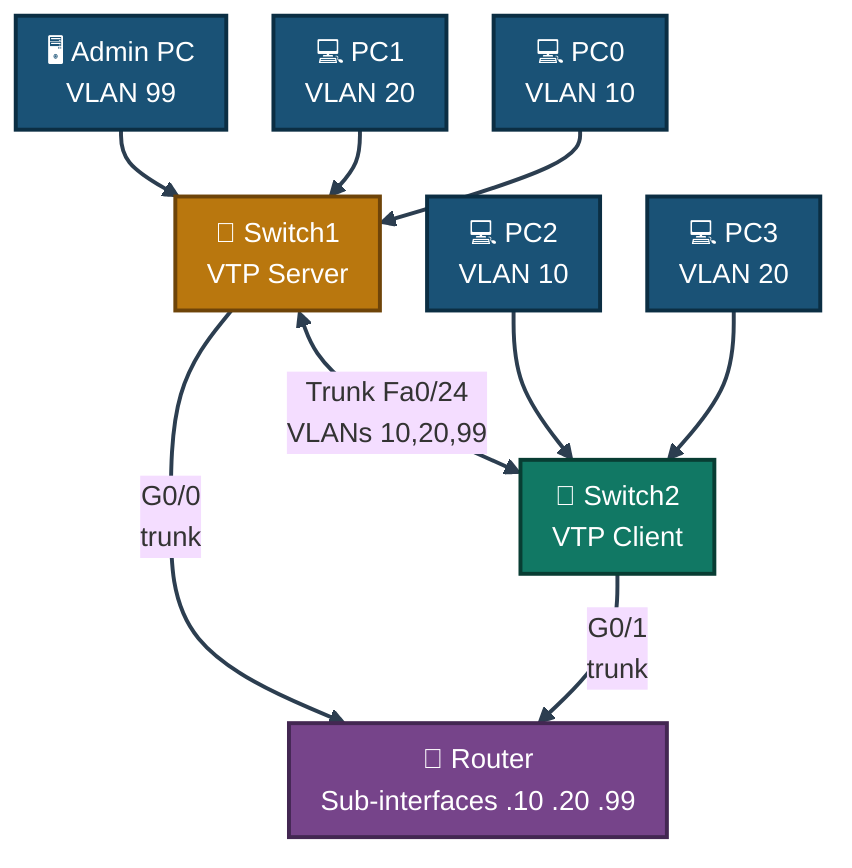
<p align="center"><em>Switch1 is the VTP server and pushes VLANs to Switch2 automatically. Both switches trunk up to the router, which routes between VLANs 10, 20 and 99 through subinterfaces.</em></p>

---

<a id="vlan-design"></a>
## 🗂️ VLAN Design

| VLAN | Name | Network | Gateway |
|------|------|---------|---------|
| 🟠 VLAN 10 | Sales | 192.168.10.0/24 | 192.168.10.1 |
| 🟢 VLAN 20 | IT | 192.168.20.0/24 | 192.168.20.1 |
| 🔴 VLAN 99 | Management | 192.168.99.0/24 | 192.168.99.1 |

---

<a id="pc-ip-configuration"></a>
## 💻 PC IP Configuration

| PC | VLAN | IP | Mask | Gateway |
|----|------|----|------|---------|
| PC0 | 10 | DHCP | auto | auto |
| PC1 | 20 | DHCP | auto | auto |
| PC2 | 10 | DHCP | auto | auto |
| PC3 | 20 | DHCP | auto | auto |
| Admin PC | 99 | 192.168.99.10 | 255.255.255.0 | 192.168.99.1 |

---

<a id="module-1"></a>
## 🔵 Module 1 — Build the Topology

**Objective:** Wire 1 router, 2 switches, 4 PCs and an admin PC exactly per the Environment tables.

### Step 1 — Build the Topology ✅

Set up all devices and connect cables exactly as shown above. No CLI commands in this step — this is a physical/logical wiring step done in the Packet Tracer GUI.

<p align="center">
  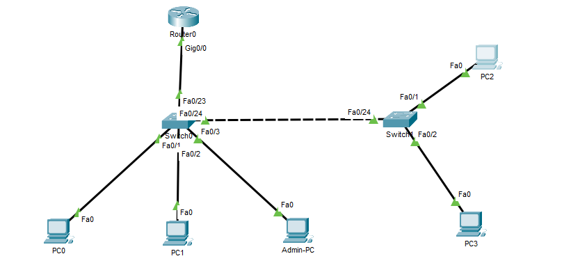<br>
  <em>Exhibit 1 — Full topology: 2 switches trunked together and to the router, 4 PCs plus one admin PC</em>
</p>

---

<a id="module-2"></a>
## 🟢 Module 2 — VTP Configuration

**Objective:** Make Switch1 the VTP server and Switch2 a VTP client so VLANs only need to be created once.

### Step 2 — Configure VTP on Switch1 (Server) ✅

```
Switch1(config)# vtp mode server
Switch1(config)# vtp domain LABNET
Switch1(config)# vtp version 2
Switch1(config)# end
Switch1# show vtp status
```

<p align="center">
  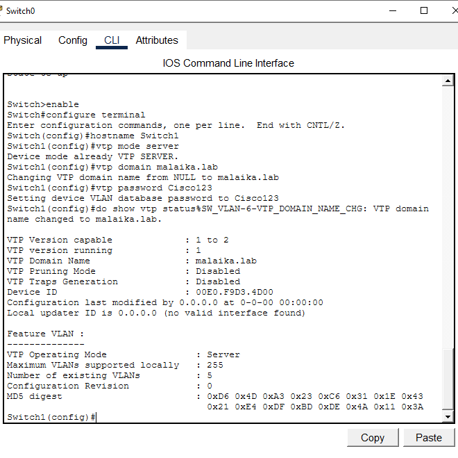<br>
  <em>Exhibit 2 — Switch1 set to VTP server mode, domain LABNET, VTP version 2</em>
</p>

### Step 3 — Configure VTP on Switch2 (Client) ✅

```
Switch2(config)# vtp mode client
Switch2(config)# vtp domain LABNET
Switch2(config)# end
Switch2# show vtp status
```

<p align="center">
  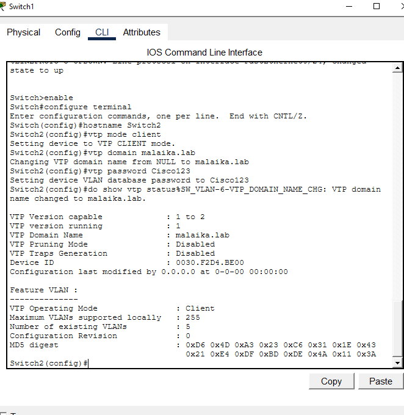<br>
  <em>Exhibit 3 — Switch2 set to VTP client mode, joined to domain LABNET</em>
</p>

### Step 4 — Create VLANs on Switch1 Only ✅

```
Switch1(config)# vlan 10
Switch1(config-vlan)# name Sales
Switch1(config-vlan)# exit
Switch1(config)# vlan 20
Switch1(config-vlan)# name IT
Switch1(config-vlan)# exit
Switch1(config)# vlan 99
Switch1(config-vlan)# name Management
Switch1(config-vlan)# exit
```

<p align="center">
  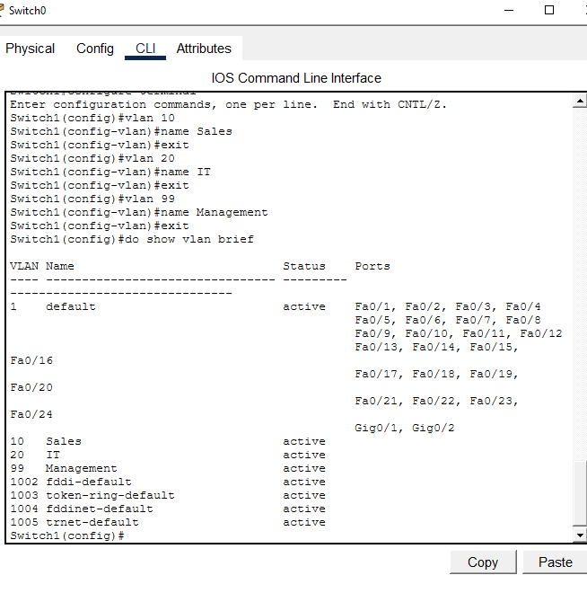<br>
  <em>Exhibit 4 — VLANs 10 (Sales), 20 (IT) and 99 (Management) created on Switch1</em>
</p>

### Step 5 — Verify VLAN Sync ✅

```
Switch2# show vlan brief
Switch2# show vtp status
```

<p align="center">
  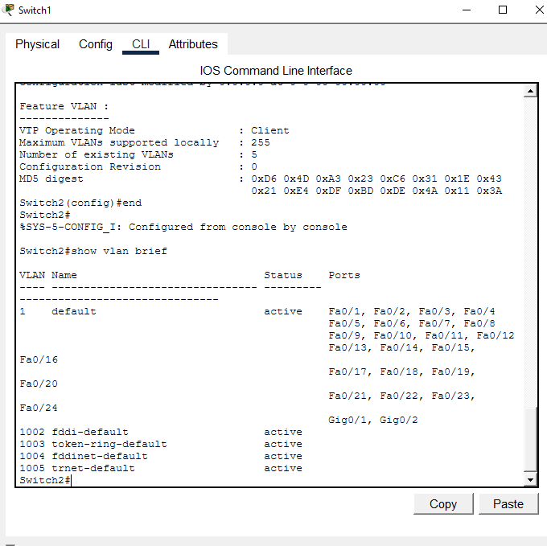<br>
  <em>Exhibit 5 — All three VLANs now appear on Switch2 without being created there directly</em>
</p>

---

<a id="module-3"></a>
## 🟣 Module 3 — VLAN Ports & Trunks

**Objective:** Assign access ports to the right VLANs on both switches and trunk the allowed VLANs between them.

### Step 6 — Configure Switch1 Ports ✅

```
Switch1(config)# interface fa0/1
Switch1(config-if)# switchport mode access
Switch1(config-if)# switchport access vlan 10
Switch1(config-if)# exit
Switch1(config)# interface fa0/2
Switch1(config-if)# switchport mode access
Switch1(config-if)# switchport access vlan 20
Switch1(config-if)# exit
Switch1(config)# interface fa0/3
Switch1(config-if)# switchport mode access
Switch1(config-if)# switchport access vlan 99
Switch1(config-if)# exit
Switch1(config)# interface fa0/23
Switch1(config-if)# switchport mode trunk
Switch1(config-if)# switchport trunk allowed vlan 10,20,99
Switch1(config-if)# exit
Switch1(config)# interface fa0/24
Switch1(config-if)# switchport mode trunk
Switch1(config-if)# switchport trunk allowed vlan 10,20,99
```

<p align="center">
  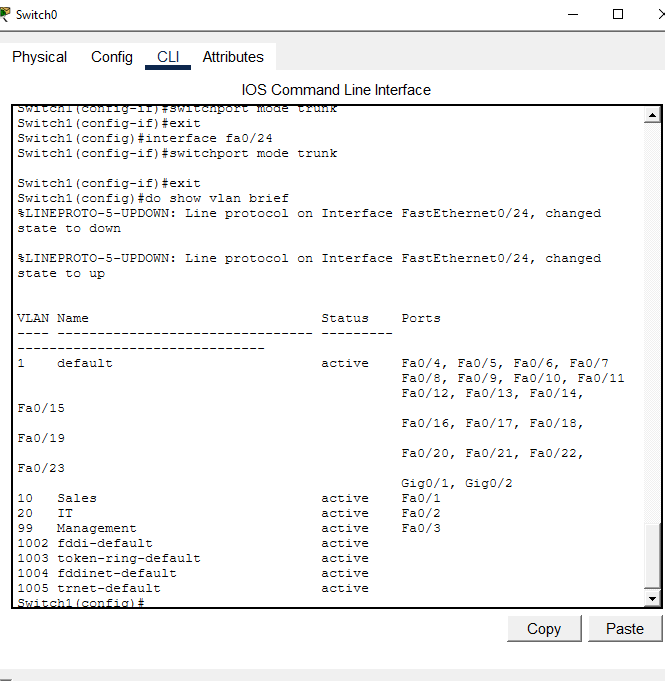<br>
  <em>Exhibit 6 — Switch1: Fa0/1–3 as access ports for VLANs 10/20/99, Fa0/23 and Fa0/24 as trunks</em>
</p>

### Step 7 — Configure Switch2 Ports ✅

```
Switch2(config)# interface fa0/1
Switch2(config-if)# switchport mode access
Switch2(config-if)# switchport access vlan 10
Switch2(config-if)# exit
Switch2(config)# interface fa0/2
Switch2(config-if)# switchport mode access
Switch2(config-if)# switchport access vlan 20
Switch2(config-if)# exit
Switch2(config)# interface fa0/23
Switch2(config-if)# switchport mode trunk
Switch2(config-if)# switchport trunk allowed vlan 10,20,99
Switch2(config-if)# exit
Switch2(config)# interface fa0/24
Switch2(config-if)# switchport mode trunk
Switch2(config-if)# switchport trunk allowed vlan 10,20,99
```

<p align="center">
  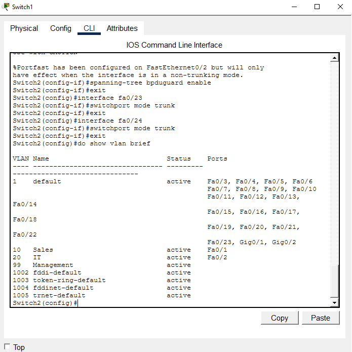<br>
  <em>Exhibit 7 — Switch2: Fa0/1–2 as access ports for VLANs 10/20, Fa0/23 and Fa0/24 as trunks</em>
</p>

---

<a id="module-4"></a>
## 🟠 Module 4 — Port Hardening & Security

**Objective:** Shut down unused ports and lock the active access ports down to one known MAC address each.

### Step 8 — Unused Ports Security ✅

```
Switch1(config)# interface range fa0/4-22
Switch1(config-if-range)# shutdown
Switch1(config-if-range)# exit

Switch2(config)# interface range fa0/3-22
Switch2(config-if-range)# shutdown
```

<p align="center">
  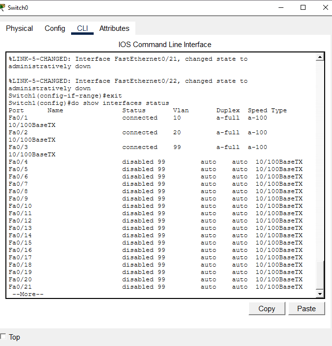<br>
  <em>Exhibit 8 — All unused switch ports administratively shut down on both switches</em>
</p>

### Step 9 — Port Security ✅

```
Switch1(config)# interface fa0/1
Switch1(config-if)# switchport port-security
Switch1(config-if)# switchport port-security maximum 1
Switch1(config-if)# switchport port-security mac-address sticky
Switch1(config-if)# switchport port-security violation shutdown
Switch1(config-if)# spanning-tree portfast
Switch1(config-if)# spanning-tree bpduguard enable
Switch1(config-if)# exit
```

> 📝 The same block was repeated for Fa0/2 and Fa0/3 on Switch1, and for Fa0/1 and Fa0/2 on Switch2 — not each individually screenshotted.

<p align="center">
  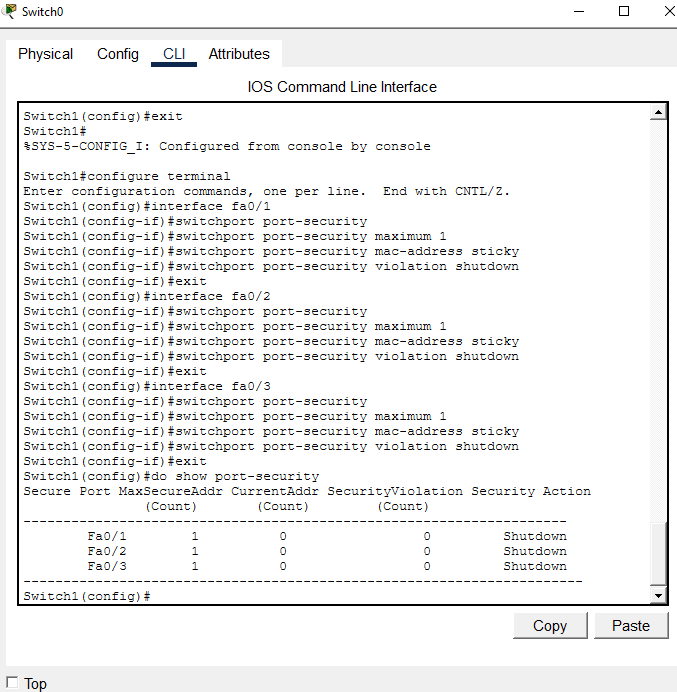<br>
  <em>Exhibit 9 — Port security enabled: max 1 MAC (sticky), violation action shutdown, PortFast and BPDU Guard on</em>
</p>

---

<a id="module-5"></a>
## 🔴 Module 5 — Management VLAN & SSH

**Objective:** Give both switches a management IP on VLAN 99 and enable SSH v2 for remote access instead of console-only management.

### Step 10 — Management VLAN ✅

```
Switch1(config)# interface vlan 99
Switch1(config-if)# ip address 192.168.99.2 255.255.255.0
Switch1(config-if)# no shutdown
Switch1(config-if)# exit
Switch1(config)# ip default-gateway 192.168.99.1

Switch2(config)# interface vlan 99
Switch2(config-if)# ip address 192.168.99.3 255.255.255.0
Switch2(config-if)# no shutdown
Switch2(config-if)# exit
Switch2(config)# ip default-gateway 192.168.99.1
```

<p align="center">
  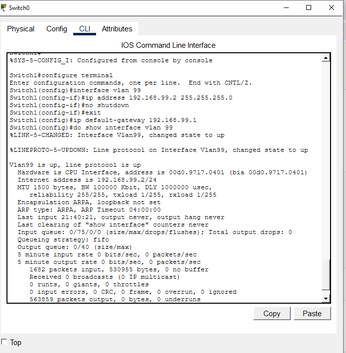<br>
  <em>Exhibit 10 — Switch1 at 192.168.99.2 and Switch2 at 192.168.99.3, both with the VLAN 99 default gateway set</em>
</p>

### Step 11 — SSH on Switches ✅

```
Switch1(config)# ip domain-name lab.local
Switch1(config)# crypto key generate rsa
   (key size: 1024)
Switch1(config)# username admin secret Cisco12345
Switch1(config)# line vty 0 15
Switch1(config-line)# login local
Switch1(config-line)# transport input ssh
Switch1(config-line)# exit
Switch1(config)# ip ssh version 2
```

> 📝 The same block was repeated on Switch2 with its own hostname.

<p align="center">
  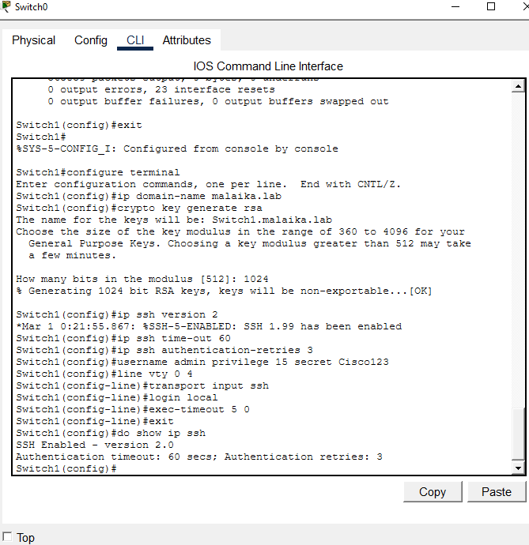<br>
  <em>Exhibit 11 — Domain name set, 1024-bit RSA key generated, local login and SSH v2 enabled on the VTY lines</em>
</p>

---

<a id="module-6"></a>
## 🟤 Module 6 — InterVLAN Routing & DHCP

**Objective:** Route between VLANs with router subinterfaces and hand out addresses automatically to VLAN 10 and VLAN 20.

### Step 12 — Router Configuration ✅

```
Router(config)# interface g0/0
Router(config-if)# no shutdown
Router(config-if)# exit

Router(config)# interface g0/0.10
Router(config-subif)# encapsulation dot1Q 10
Router(config-subif)# ip address 192.168.10.1 255.255.255.0
Router(config-subif)# exit

Router(config)# interface g0/0.20
Router(config-subif)# encapsulation dot1Q 20
Router(config-subif)# ip address 192.168.20.1 255.255.255.0
Router(config-subif)# exit

Router(config)# interface g0/0.99
Router(config-subif)# encapsulation dot1Q 99
Router(config-subif)# ip address 192.168.99.1 255.255.255.0
Router(config-subif)# exit
```

<p align="center">
  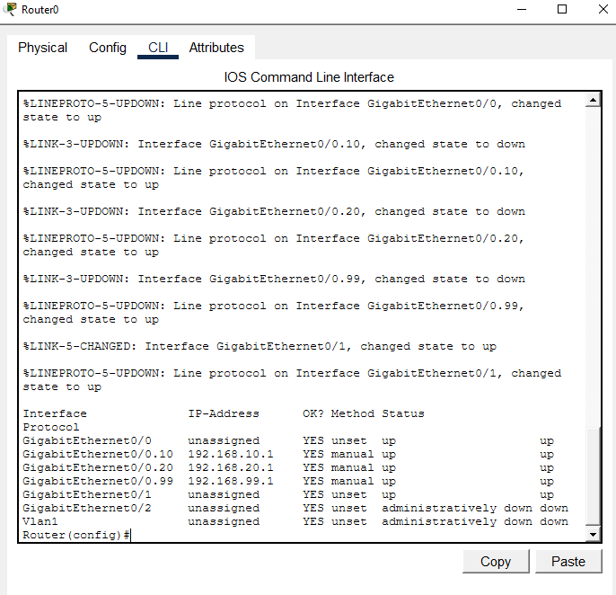<br>
  <em>Exhibit 12 — G0/0 with three dot1Q subinterfaces, one per VLAN, each holding that VLAN's gateway address</em>
</p>

### Step 13 — DHCP Pools ✅

```
Router(config)# ip dhcp excluded-address 192.168.10.1 192.168.10.10
Router(config)# ip dhcp excluded-address 192.168.20.1 192.168.20.10

Router(config)# ip dhcp pool SALES_VLAN10
Router(dhcp-config)# network 192.168.10.0 255.255.255.0
Router(dhcp-config)# default-router 192.168.10.1
Router(dhcp-config)# dns-server 8.8.8.8
Router(dhcp-config)# exit

Router(config)# ip dhcp pool IT_VLAN20
Router(dhcp-config)# network 192.168.20.0 255.255.255.0
Router(dhcp-config)# default-router 192.168.20.1
Router(dhcp-config)# dns-server 8.8.8.8
Router(dhcp-config)# exit
```

<p align="center">
  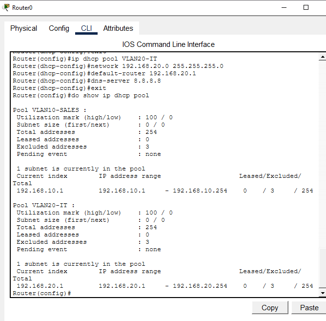<br>
  <em>Exhibit 13 — DHCP pools SALES_VLAN10 and IT_VLAN20, with the first 10 addresses of each subnet excluded</em>
</p>

### Step 14 — PC DHCP ✅

```
PC0> ipconfig /release
PC0> ipconfig /renew
PC0> ipconfig
```

<p align="center">
  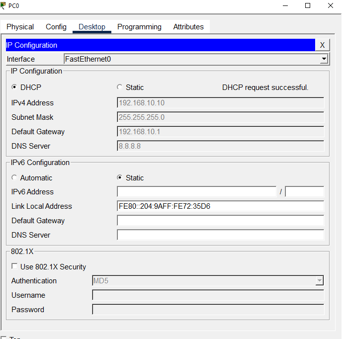<br>
  <em>Exhibit 14 — PC0 receives an address from the VLAN 10 pool after release/renew</em>
</p>

### Step 15 — DHCP Binding ✅

```
Router# show ip dhcp binding
```

<p align="center">
  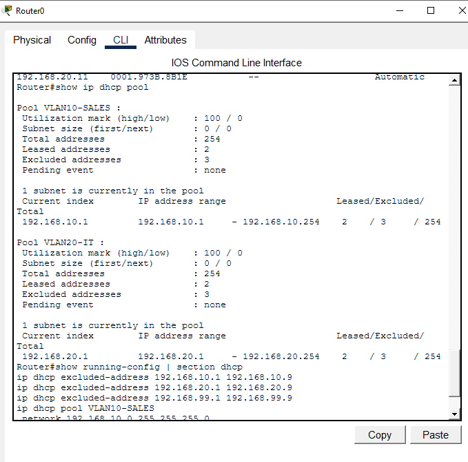<br>
  <em>Exhibit 15 — Router's binding table confirms active leases for VLAN 10 and VLAN 20 clients</em>
</p>

---

<a id="module-7"></a>
## ⚫ Module 7 — ACL Configuration & Testing

**Objective:** Confirm free inter-VLAN routing first, then block one direction of traffic with an ACL and prove the block only affects that direction.

### Step 16 — Pre-ACL Ping Test ✅

```
PC0> ping 192.168.20.1
PC1> ping 192.168.10.1
PC0> ping 192.168.99.10
```

<p align="center">
  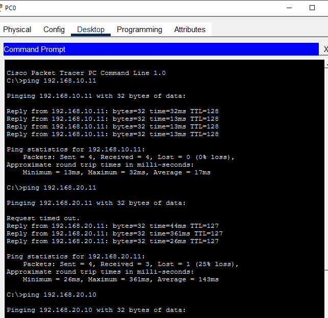<br>
  <em>Exhibit 16 — All three pings succeed before any ACL is applied — routing works in every direction</em>
</p>

### Step 17 — ACL Configuration ✅

```
Router(config)# access-list 110 deny ip 192.168.20.0 0.0.0.255 192.168.10.0 0.0.0.255
Router(config)# access-list 110 permit ip any any

Router(config)# interface g0/0.10
Router(config-subif)# ip access-group 110 in
```

<p align="center">
  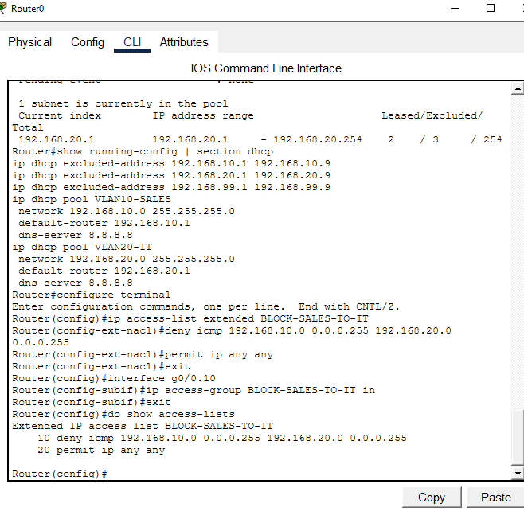<br>
  <em>Exhibit 17 — Extended ACL 110 denies VLAN 20 → VLAN 10, permits everything else, applied inbound on Gi0/0.10</em>
</p>

### Step 18 — ACL Test ✅

```
PC1> ping 192.168.10.1
   (Request timed out — VLAN 20 to VLAN 10 is blocked)

PC0> ping 192.168.20.1
   (Reply received — VLAN 10 to VLAN 20 is still permitted)
```

<p align="center">
  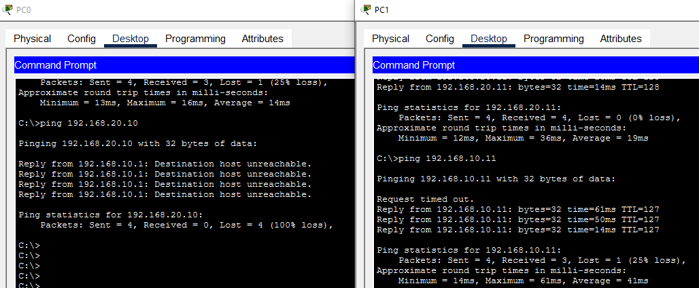<br>
  <em>Exhibit 18 — VLAN 20 → VLAN 10 now blocked, while VLAN 10 → VLAN 20 still passes, exactly as the ACL was written</em>
</p>

---

<a id="module-8"></a>
## 🟡 Module 8 — Final Verification & Save

**Objective:** Confirm SSH access works, check every layer with `show` commands, and save the configuration.

### Step 19 — SSH Test ✅

```
AdminPC> ssh -l admin 192.168.99.2
AdminPC> ssh -l admin 192.168.99.3
```

<p align="center">
  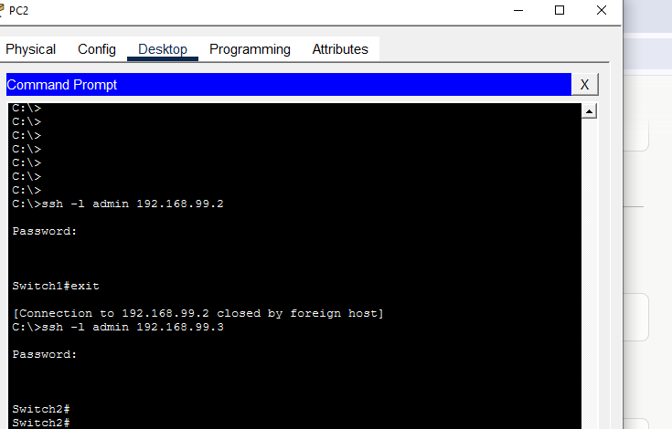<br>
  <em>Exhibit 19 — Admin PC successfully opens an SSH session to both Switch1 and Switch2</em>
</p>

### Step 20 — Final Verification ✅

```
Switch1# show vlan brief
Switch2# show vlan brief
Router# show ip interface brief
Router# show ip route
Router# show access-lists
```

<p align="center">
  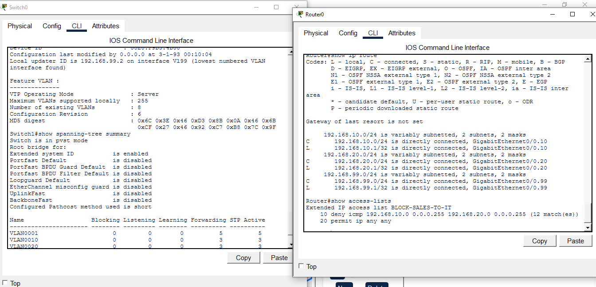<br>
  <em>Exhibit 20 — VLANs consistent on both switches, all subinterfaces up, routes present, ACL 110 active</em>
</p>

### Step 21 — Save Configuration ✅

```
Switch1# copy running-config startup-config
Switch2# copy running-config startup-config
Router# copy running-config startup-config
```

<p align="center">
  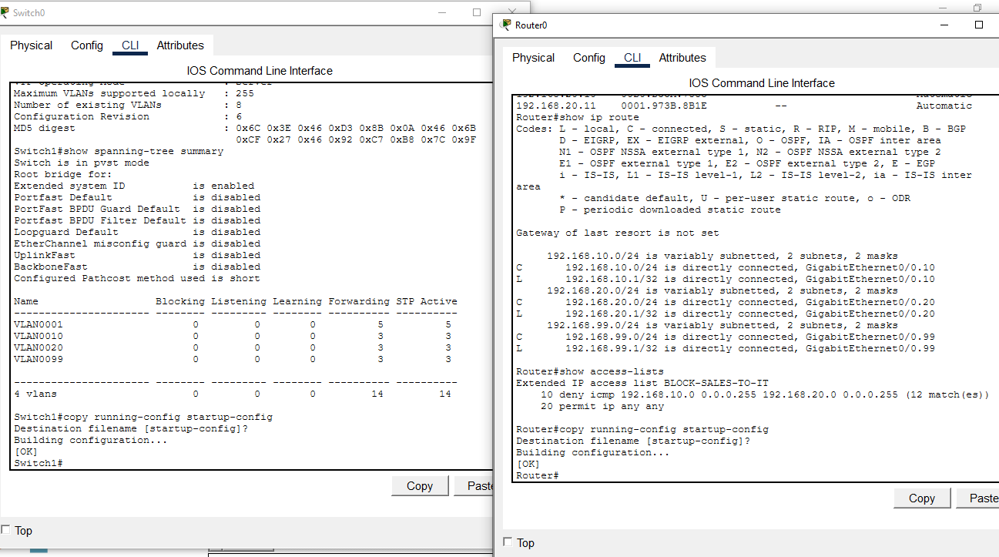<br>
  <em>Exhibit 21 — Running config saved to startup config on both switches and the router</em>
</p>

### 🗺️ Traffic Flow After Hardening

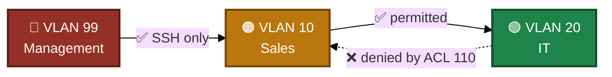
<p align="center"><em>The ACL is one-directional by design: Sales can still reach IT, but IT cannot initiate traffic into Sales.</em></p>

---

<a id="coverage-snapshot"></a>
## 🌟 Coverage Snapshot

| 🛡️ Layer | ✅ Status | 📌 Detail |
|---|---|---|
| Topology | Live | 2 switches, 1 router, 5 end devices wired (Exhibit 1) |
| VTP | Live | Switch1 server, Switch2 client, VLANs synced without re-creating them (Exhibits 2–5) |
| VLANs & trunks | Configured | Access ports and allowed-VLAN trunks set on both switches (Exhibits 6–7) |
| Port hardening | Configured | Unused ports shut, port security + PortFast + BPDU Guard on active ports (Exhibits 8–9) |
| Management & SSH | Live | VLAN 99 SVIs reachable, SSH v2 tested from Admin PC (Exhibits 10–11, 19) |
| InterVLAN routing & DHCP | Live | Subinterfaces up, DHCP leases confirmed in the binding table (Exhibits 12–15) |
| ACL | Proven | Pre/post test shows exactly one direction blocked, the other still open (Exhibits 16–18) |
| Config persistence | Proven | Saved on both switches and the router (Exhibit 21) |

---

<a id="command-summary"></a>
## 📟 Command Summary

| Command | Purpose |
|---------|---------|
| `vtp mode server/client` | Set VTP role |
| `vtp domain` | Set VTP domain |
| `vlan 10` | Create VLAN |
| `switchport mode access/trunk` | Set port mode |
| `switchport access vlan 10` | Assign port to VLAN |
| `spanning-tree portfast` | Enable PortFast |
| `spanning-tree bpduguard enable` | Enable BPDU Guard |
| `switchport port-security` | Enable port security |
| `interface vlan 99` | Create management SVI |
| `ip default-gateway` | Set switch gateway |
| `crypto key generate rsa` | Generate SSH keys |
| `ip ssh version 2` | Enable SSH v2 |
| `encapsulation dot1Q` | Tag subinterface |
| `ip dhcp pool` | Create DHCP pool |
| `ip dhcp excluded-address` | Reserve IPs |
| `access-list 110 deny` | Create ACL rule |
| `ip access-group 110 in` | Apply ACL |
| `copy running-config startup-config` | Save config |

---

<a id="challenges-fixes"></a>
## ⚠️ Challenges & Fixes

| ❌ Challenge | ✅ Solution |
|---|---|
| VLANs not syncing to Switch2 | Verified VTP domain name matched exactly on both switches |
| PCs not getting a DHCP IP | Checked the excluded address range against the DHCP pool's network statement |
| SSH not connecting | Confirmed RSA key size 1024+ and SSH v2 enabled |
| ACL blocking the wrong traffic | Reviewed wildcard masks and the `ip access-group` direction (in/out) |
| Trunk port not passing VLANs | Verified the allowed-VLAN list on the trunk interface |

---

<a id="scope-limitations"></a>
## 🚧 Scope & Limitations

- **Simulation only:** Built and verified in Cisco Packet Tracer, not on physical hardware.
- **Repeated blocks not individually screenshotted:** Port security (Step 9) and SSH (Step 11) were configured identically on multiple ports/switches, but only one instance of each is captured — the rest are noted, not shown.
- **One-directional ACL:** ACL 110 only blocks VLAN 20 → VLAN 10. VLAN 10 → VLAN 20 and all traffic to/from Management (VLAN 99) remain open.
- **Weak-by-lab-standard SSH key:** RSA key size used is 1024 bits, adequate for the lab but below what would be used in production.
- **No redundancy:** A single trunk link connects the two switches and a single uplink connects each switch to the router — no EtherChannel or STP redundancy path was built.

These limits are stated so the lab is read as a demonstration of the concepts, not a production security design.

---

<a id="what-i-learned"></a>
## 🧠 What I Learned

- **VTP saves repetition, but only within its blast radius.** Creating VLANs once on the server and having them appear on the client works well — but it also means a domain-name mismatch silently breaks the whole sync, which is exactly what happened during testing.
- **DHCP pools and excluded addresses have to agree.** A pool's `network` statement defines the whole subnet; the excluded range just carves out what the pool won't hand out — get either wrong and clients don't lease.
- **ACL direction and wildcard mask are the two places test failures actually come from.** Both were double-checked against the lab's actual traffic pattern before the block behaved as intended.
- **Hardening is cumulative, not a single step.** Shutting unused ports, sticky MACs, BPDU Guard, SSH-only management and an ACL each close a different gap — none of them alone would have been enough.

---

<a id="skills-demonstrated"></a>
## 🛠️ Skills Demonstrated

- Configuring VTP server/client roles and verifying VLAN synchronization
- Assigning access ports and building allowed-VLAN trunks across two switches
- Hardening switch ports: unused-port shutdown, port security, PortFast, BPDU Guard
- Building a management VLAN with SVIs and enabling SSH v2 for remote access
- Configuring Router-on-a-Stick InterVLAN routing with dot1Q subinterfaces
- Deploying per-VLAN DHCP pools with excluded address ranges
- Writing and applying an extended ACL, then proving its exact scope with before/after tests
- Verifying an entire multi-layer configuration with `show` commands before saving

---

<a id="screenshot-index"></a>
## 🖼️ Screenshot Index

| # | File | Shows |
|:---:|---|---|
| 1 | `01-topology.PNG` | Full topology |
| 2 | `02-vtp-server.png` | Switch1 VTP server config |
| 3 | `03-vtp-client.png` | Switch2 VTP client config |
| 4 | `04-vlans-created.png` | VLANs created on Switch1 |
| 5 | `05-vtp-sync.png` | VLAN sync confirmed on Switch2 |
| 6 | `06-switch1-ports.png` | Switch1 access + trunk ports |
| 7 | `07-switch2-ports.png` | Switch2 access + trunk ports |
| 8 | `08-unused-ports.png` | Unused ports shut down |
| 9 | `09-port-security.png` | Port security, PortFast, BPDU Guard |
| 10 | `10-mgmt-vlan.png` | Management VLAN SVIs |
| 11 | `11-ssh-switches.png` | SSH v2 enabled on switches |
| 12 | `12-router-config.png` | Router subinterface configuration |
| 13 | `13-dhcp-pools.png` | DHCP pool configuration |
| 14 | `14-pc-dhcp.png` | PC0 DHCP lease |
| 15 | `15-dhcp-binding.png` | Router DHCP binding table |
| 16 | `16-pre-acl-ping.png` | Pre-ACL connectivity test |
| 17 | `17-acl-config.png` | ACL 110 configuration |
| 18 | `18-acl-test.png` | ACL test — blocked and permitted traffic |
| 19 | `19-ssh-test.png` | SSH session test from Admin PC |
| 20 | `20-final-verify.png` | Final `show` verification |
| 21 | `21-save-config.png` | Saved running config to startup config |

---

<a id="repo-structure"></a>
## 📁 Repo Structure

```text
03-Enterprise-network-vlan-intervlan-routing/
|-- README.md
|-- enterprise-network-vlan-intervlan-routing.pkt
`-- screenshots/
    |-- 01-topology.PNG
    |-- 02-vtp-server.png
    |-- 03-vtp-client.png
    |-- 04-vlans-created.png
    |-- 05-vtp-sync.png
    |-- 06-switch1-ports.png
    |-- 07-switch2-ports.png
    |-- 08-unused-ports.png
    |-- 09-port-security.png
    |-- 10-mgmt-vlan.png
    |-- 11-ssh-switches.png
    |-- 12-router-config.png
    |-- 13-dhcp-pools.png
    |-- 14-pc-dhcp.png
    |-- 15-dhcp-binding.png
    |-- 16-pre-acl-ping.png
    |-- 17-acl-config.png
    |-- 18-acl-test.png
    |-- 19-ssh-test.png
    |-- 20-final-verify.png
    `-- 21-save-config.png
```

<div align="center">

🔀 **[VTP Explained](https://www.cisco.com/c/en/us/support/docs/lan-switching/vtp/98154-vtp-faq.html)** · 🔐 **[Configuring SSH on IOS](https://www.cisco.com/c/en/us/support/docs/security-vpn/secure-shell-ssh/4145-ssh.html)** · 🛡️ **[ACL Overview](https://www.cisco.com/c/en/us/support/docs/ip/access-lists/26448-ACLsamples.html)**

</div>
