<div align="center">

# 🏢 Enterprise Network VLAN & Inter-VLAN Routing — Troubleshooting

**Lab 04 — Cisco Networking Lab Portfolio**

Hierarchical Enterprise LAN Fault Diagnosis: Trunk/Native VLAN Mismatch, Disabled SVI, and Missing Static Routes (Cisco Packet Tracer)


A pre-built three-tier enterprise LAN — two access switches, one Layer 3 core switch, one edge router — was shipped with three deliberate faults: a trunk/native VLAN mismatch between the core and an access switch, a shut-down SVI silently disabling one VLAN's gateway, and missing default/return routes breaking reachability past the core. Each fault is diagnosed from `show` command output and CDP log evidence, then repaired and re-verified end to end.

</div>

---

## 📑 Table of Contents

1. [At a Glance](#at-a-glance)
2. [Project Background](#project-background)
3. [Tools & Technologies](#tools-technologies)
4. [Environment](#environment)
5. [Topology](#topology)
6. [VLAN Design](#vlan-design)
7. [PC IP Configuration](#pc-ip-configuration)
8. [Module 1 — Build the Topology](#module-1)
9. [Module 2 — Core Switch Base Configuration](#module-2)
10. [Module 3 — Activate the Edge Router](#module-3)
11. [Module 4 — Access Switch Config & Trunk Mismatch](#module-4)
12. [Module 5 — Repair the Trunk Mismatch](#module-5)
13. [Module 6 — Default Route Repair](#module-6)
14. [Module 7 — Return Routes & SVI Fix](#module-7)
15. [Module 8 — Final Verification](#module-8)
16. [Coverage Snapshot](#coverage-snapshot)
17. [Command Summary](#command-summary)
18. [Challenges & Fixes](#challenges-fixes)
19. [Scope & Limitations](#scope-limitations)
20. [What I Learned](#what-i-learned)
21. [Skills Demonstrated](#skills-demonstrated)
22. [Screenshot Index](#screenshot-index)
23. [Repo Structure](#repo-structure)

---

<a id="at-a-glance"></a>
## 📊 At a Glance

<div align="center">

| 🧩 VLANs | 🖧 Switches | 🔀 Routing | 🐛 Faults Diagnosed | 🖼️ Screenshots | 🧱 Steps |
|:---:|:---:|:---:|:---:|:---:|:---:|
| **2** | **3 (1 core, 2 access)** | **SVI + Static** | **3** | **13** | **8** |

</div>

---

<a id="project-background"></a>
## 📖 Project Background

This lab starts from a pre-built hierarchical LAN rather than a blank topology: two access-layer switches feeding a Layer 3 core switch that routes between VLANs via SVIs, with the core connected to an edge router over a routed point-to-point link. The network shipped broken in three independent ways, and the job was to find each fault from command-line evidence — not from a fault list — and fix it without breaking what already worked.

| Module | Focus |
|---|---|
| 🔵 **Module 1 — Build the Topology** | Wire 1 router, 1 core switch, 2 access switches and 2 PCs |
| 🟢 **Module 2 — Core Switch Base Configuration** | Create VLANs 10/20, build SVIs, route the uplink to the router |
| 🟣 **Module 3 — Activate the Edge Router** | Bring up the routed link facing the core switch |
| 🟠 **Module 4 — Access Switch Config & Trunk Mismatch** | Configure access ports and uplinks; surface a native VLAN mismatch |
| 🔴 **Module 5 — Repair the Trunk Mismatch** | Correct the core switch's trunk encapsulation and mode |
| 🟤 **Module 6 — Default Route Repair** | Add a missing gateway of last resort on the core switch |
| ⚫ **Module 7 — Return Routes & SVI Fix** | Add router-side return routes and re-enable a shut-down SVI |
| 🟡 **Module 8 — Final Verification** | Confirm full end-to-end reachability from both PCs |

> [!NOTE]
> This is a Packet Tracer simulation, not physical hardware. Command output referenced in a step is what the corresponding screenshot shows or what was verified live from the saved `.pkt` file.

---

<a id="tools-technologies"></a>
## 🛠️ Tools & Technologies

| Tool | Purpose |
|------|---------|
| 🖥️ Cisco Packet Tracer | Network simulation |
| 🚪 Router 2911 (HQ-Edge-R1) | Edge gateway, static routing |
| 🔀 Switch 3560-24PS (Core-SW01) | Inter-VLAN routing via SVIs, core distribution |
| 🔀 Switch 2960-24TT x2 (Access-SW02, Access-SW03) | Access-layer VLAN switching |
| 🔗 802.1Q Trunking | VLAN tagging between switches |
| 📖 Static Routing | Default route + explicit return routes |

---

<a id="environment"></a>
## 🖧 Environment


**Devices:** 1 Router (2911, HQ-Edge-R1) · 1 Core Switch (3560-24PS, Core-SW01) · 2 Access Switches (2960-24TT, Access-SW02 & Access-SW03) · 2 PCs

**PCs to Access Switches**

| PC | Switch | Port |
|----|--------|------|
| PC0 | Access-SW02 | Fa0/1 |
| PC1 | Access-SW03 | Fa0/1 |

**Access Switches to Core Switch**

| From | To | Link Type |
|------|----|-----------|
| Access-SW02 Gi0/2 | Core-SW01 Fa0/24 | 802.1Q Trunk |
| Access-SW03 Gi0/1 | Core-SW01 Gi0/1 | 802.1Q Trunk |

**Core Switch to Router**

| Core-SW01 Port | Router Port | Link |
|-----------------|--------------|------|
| G0/2 (routed, no switchport) | HQ-Edge-R1 G0/1 | Point-to-point /30 |

---

<a id="topology"></a>
## 🗺️ Topology

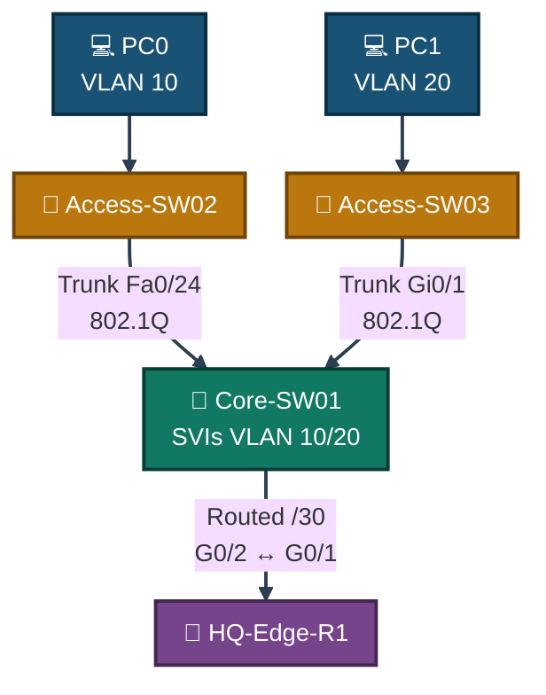
<p align="center"><em>Core-SW01 owns the VLAN 10/20 SVIs and routes between them, then reaches the outside world through a routed point-to-point link to HQ-Edge-R1.</em></p>

---

<a id="vlan-design"></a>
## 🗂️ VLAN Design

| VLAN | Name | Network | Gateway (SVI on Core-SW01) |
|------|------|---------|------------------------------|
| 🟠 VLAN 10 | Engineering | 10.1.10.0/24 | 10.1.10.1 |
| 🟢 VLAN 20 | Operations | 10.1.20.0/24 | 10.1.20.1 |
| ⚫ — | Core ↔ Router link | 10.1.99.0/30 | n/a (point-to-point) |

---

<a id="pc-ip-configuration"></a>
## 💻 PC IP Configuration

| PC | VLAN | IP | Mask | Gateway |
|----|------|----|------|---------|
| PC0 | 10 | 10.1.10.10 | 255.255.255.0 | 10.1.10.1 |
| PC1 | 20 | 10.1.20.10 | 255.255.255.0 | 10.1.20.1 |

<p align="center">
  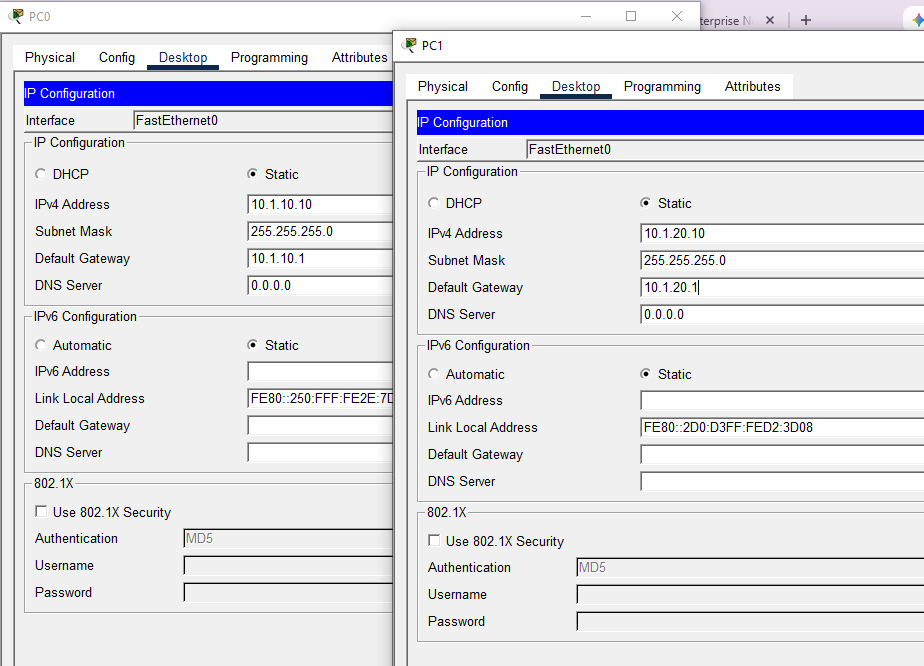<br>
  <em>Exhibit — PC0 and PC1 addressed with static IPs on their respective VLANs</em>
</p>

---

<a id="module-1"></a>
## 🔵 Module 1 — Build the Topology

**Objective:** Wire 1 router, 1 core switch, 2 access switches and 2 PCs exactly per the Environment tables.

### Step 1 — Build the Topology ✅

Devices placed and cabled per the layout above. No CLI commands in this step — this is a physical/logical wiring step done in the Packet Tracer GUI.

<p align="center">
  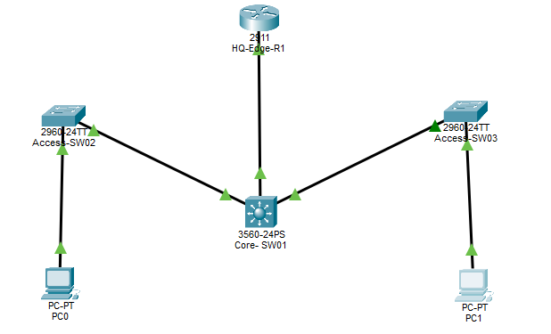<br>
  <em>Exhibit 1 — Full topology: two access switches trunked into a Layer 3 core switch, routed uplink to the edge router</em>
</p>

---

<a id="module-2"></a>
## 🟢 Module 2 — Core Switch Base Configuration

**Objective:** Create VLANs 10 and 20 on Core-SW01, build their SVIs, and route the uplink to the edge router.

### Step 2 — Base Configuration of Core-SW01 ✅

```
Switch#configure terminal
Switch(config)#hostname Core-SW01
Core-SW01(config)#vlan 10
Core-SW01(config-vlan)#name Engineering
Core-SW01(config)#vlan 20
Core-SW01(config-vlan)#name Operations
Core-SW01(config)#exit
Core-SW01(config)#ip routing
Core-SW01(config)#interface vlan 10
Core-SW01(config-if)#ip address 10.1.10.1 255.255.255.0
Core-SW01(config-if)#no shutdown
Core-SW01(config)#interface vlan 20
Core-SW01(config-if)#ip address 10.1.20.1 255.255.255.0
Core-SW01(config-if)#no shutdown
Core-SW01(config)#interface GigabitEthernet0/2
Core-SW01(config-if)#no switchport
Core-SW01(config-if)#ip address 10.1.99.2 255.255.255.252
Core-SW01(config-if)#no shutdown
```

> ⚠️ **Bug found here:** the VLAN 10 SVI was initially left as `shutdown` instead of `no shutdown`, silently disabling PC0's gateway. This surfaced only in Step 7 and was corrected there.

<p align="center">
  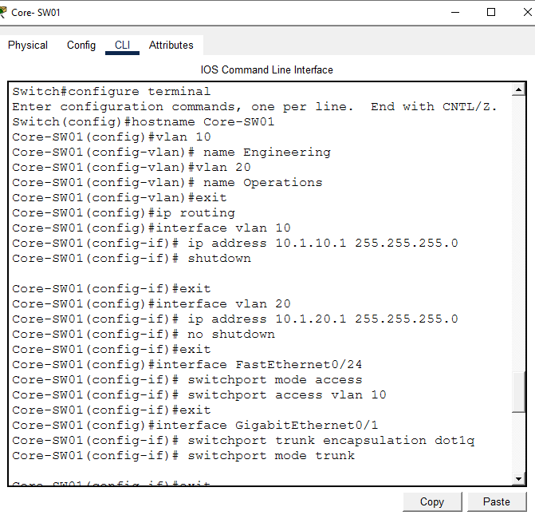<br>
  <em>Exhibit 2 — VLANs 10/20 created, SVIs built, and G0/2 converted to a routed Layer 3 port</em>
</p>

---

<a id="module-3"></a>
## 🟣 Module 3 — Activate the Edge Router

**Objective:** Bring up HQ-Edge-R1's routed link facing Core-SW01.

### Step 3 — Activating the Edge Router (HQ-Edge-R1) ✅

```
Router>enable
Router#configure terminal
Router(config)#hostname HQ-Edge-R1
HQ-Edge-R1(config)#interface GigabitEthernet0/1
HQ-Edge-R1(config-if)#ip address 10.1.99.1 255.255.255.252
HQ-Edge-R1(config-if)#no shutdown
```

**System response:**
```
%LINK-5-CHANGED: Interface GigabitEthernet0/1, changed state to up
%LINEPROTO-5-UPDOWN: Line protocol on Interface GigabitEthernet0/1, changed state to up
```

<p align="center">
  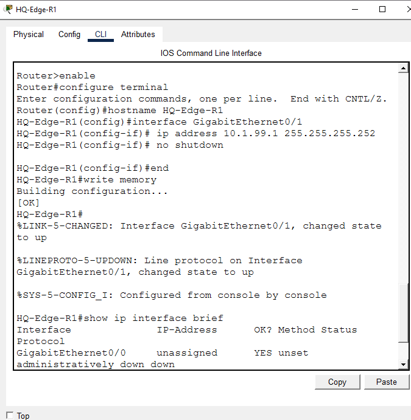<br>
  <em>Exhibit 3 — HQ-Edge-R1's gateway-facing interface addressed and brought up</em>
</p>

---

<a id="module-4"></a>
## 🟠 Module 4 — Access Switch Config & Trunk Mismatch

**Objective:** Configure the access switches' ports and uplinks, and capture the fault this surfaces on the core.

### Step 4 — Access Switch Configuration & Trunk Mismatch ✅

```
Access-SW02(config)#vlan 10
Access-SW02(config-vlan)#name Engineering
Access-SW02(config)#interface FastEthernet0/1
Access-SW02(config-if)#switchport mode access
Access-SW02(config-if)#switchport access vlan 10
Access-SW02(config)#interface GigabitEthernet0/2
Access-SW02(config-if)#switchport mode trunk
```

The moment Access-SW02's uplink became a trunk, Core-SW01 logged:
```
%CDP-4-NATIVE_VLAN_MISMATCH: Native VLAN mismatch discovered on FastEthernet0/24 (10),
with Switch GigabitEthernet0/2 (1).
```

**Cause:** Core-SW01's Fa0/24 was still in static access mode (VLAN 10) while Access-SW02's Gi0/2 was a trunk — a Layer 2 mode mismatch that blocked PC0's traffic.

<p align="center">
  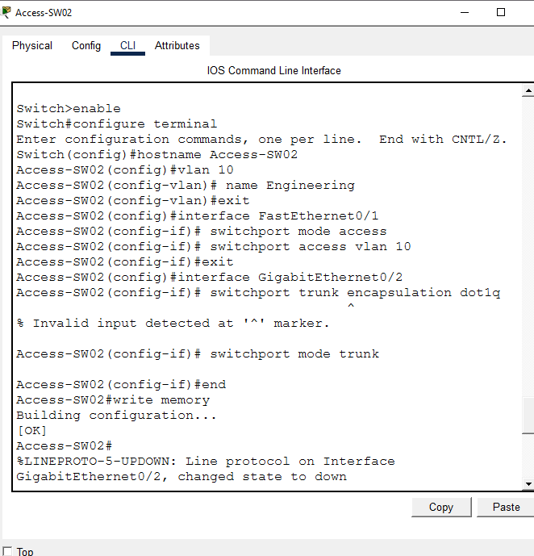<br>
  <em>Exhibit 4 — Access-SW02's access port and trunk uplink configured</em>
</p>
<p align="center">
  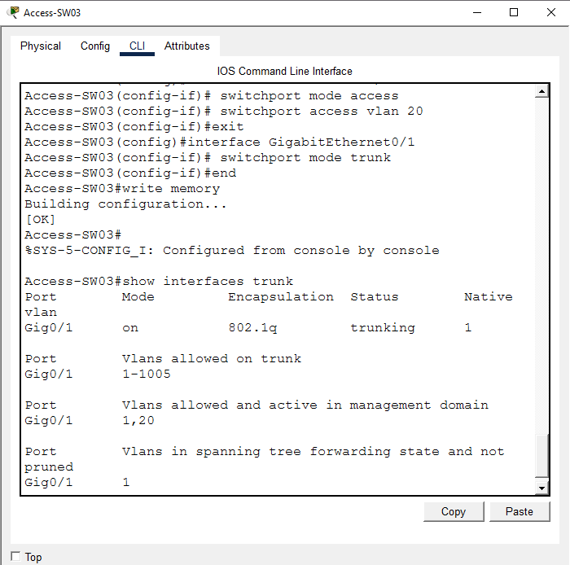<br>
  <em>Exhibit 5 — Access-SW03 configured identically for VLAN 20</em>
</p>

---

<a id="module-5"></a>
## 🔴 Module 5 — Repair the Trunk Mismatch

**Objective:** Correct Core-SW01's Fa0/24 to trunk mode with matching encapsulation, and confirm both uplinks trunk cleanly.

### Step 5 — Repairing the Core-SW01 Trunk Mismatch ✅

```
Core-SW01(config)#interface FastEthernet0/24
Core-SW01(config-if)#switchport trunk encapsulation dot1q
Core-SW01(config-if)#switchport mode trunk
Core-SW01(config-if)#end
Core-SW01#write memory
```

Verification after the fix — both uplinks now trunking correctly:
```
Core-SW01#show interfaces trunk
Port      Mode   Encapsulation  Status      Native vlan
Fa0/24    on     802.1q         trunking    1
Gig0/1    on     802.1q         trunking    1
```

<p align="center">
  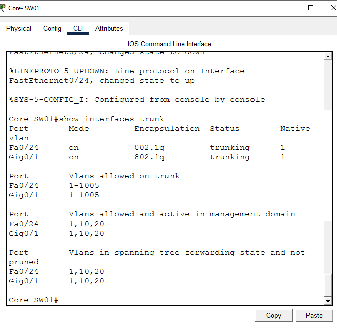<br>
  <em>Exhibit 6 — Both core uplinks confirmed trunking with matching native VLAN</em>
</p>

---

<a id="module-6"></a>
## 🟤 Module 6 — Default Route Repair

**Objective:** Diagnose and fix a missing gateway of last resort on Core-SW01 blocking traffic past the local VLANs.

### Step 6 — Core-SW01 Default Route (Gateway of Last Resort) ✅

After fixing the trunk, PC0 still couldn't reach beyond its own VLAN. `show ip route` on Core-SW01 showed no default path:
```
Gateway of last resort is not set
```

Fix applied directly on **Core-SW01**:
```
Core-SW01(config)#ip route 0.0.0.0 0.0.0.0 10.1.99.1
```

Confirmed afterward:
```
Core-SW01#show ip route
Gateway of last resort is 10.1.99.1 to network 0.0.0.0
C    10.1.10.0/24 is directly connected, Vlan10
C    10.1.20.0/24 is directly connected, Vlan20
C    10.1.99.0/30 is directly connected, GigabitEthernet0/2
S*   0.0.0.0/0 [1/0] via 10.1.99.1
```

> 📝 Verified live from the saved `.pkt` file's Core-SW01 CLI — not individually screenshotted.

---

<a id="module-7"></a>
## ⚫ Module 7 — Return Routes & SVI Fix

**Objective:** Add HQ-Edge-R1's missing return routes and re-enable Core-SW01's shut-down VLAN 10 SVI.

### Step 7 — HQ-Edge-R1 Return Routes & VLAN 10 SVI Fix ✅

Two remaining issues blocked end-to-end reachability:

1. **HQ-Edge-R1 had no route back** to either LAN subnet — pings from the LAN reached the router but replies were dropped.
2. **Core-SW01's VLAN 10 SVI was still shut down** (carried over from Step 2), so PC0 had no live gateway even after Layer 2/3 elsewhere was fixed.

Fixes applied:
```
! On HQ-Edge-R1
HQ-Edge-R1(config)#ip route 10.1.10.0 255.255.255.0 10.1.99.2
HQ-Edge-R1(config)#ip route 10.1.20.0 255.255.255.0 10.1.99.2

! On Core-SW01
Core-SW01(config)#interface vlan 10
Core-SW01(config-if)#no shutdown
```

<p align="center">
  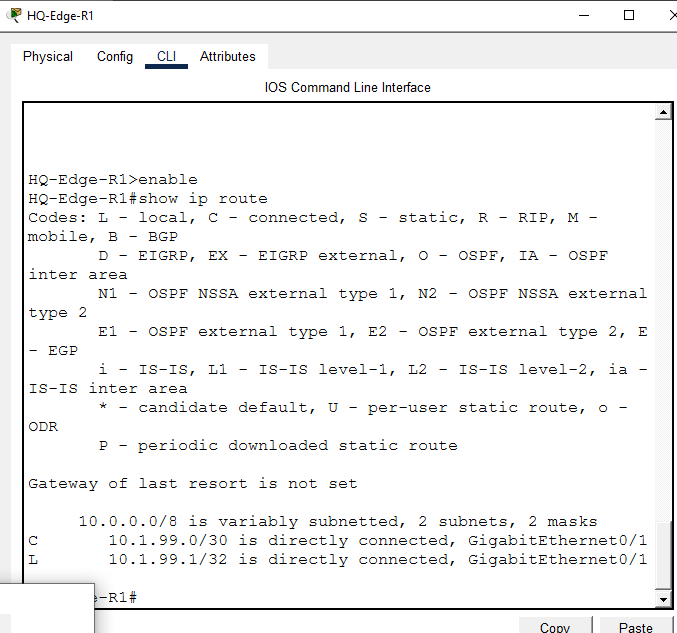<br>
  <em>Exhibit 7 — HQ-Edge-R1 before the fix, with no return routes to either LAN subnet</em>
</p>
<p align="center">
  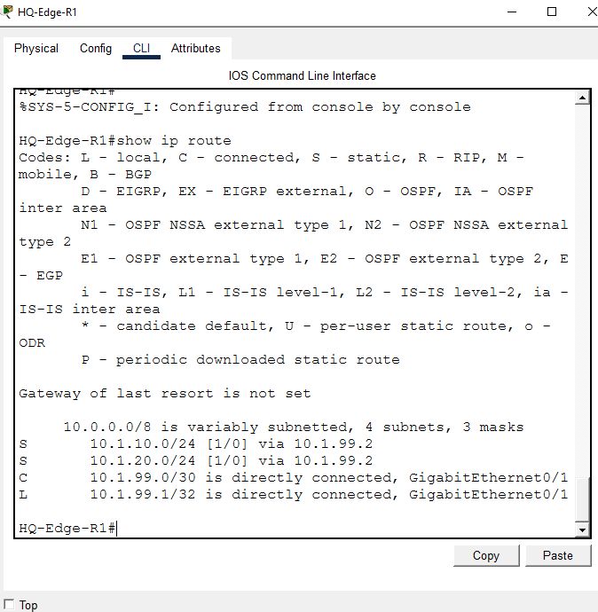<br>
  <em>Exhibit 8 — HQ-Edge-R1 after the fix, with explicit return routes to VLAN 10 and VLAN 20</em>
</p>

---

<a id="module-8"></a>
## 🟡 Module 8 — Final Verification

**Objective:** Confirm full end-to-end reachability from both PCs to their gateways and to the router.

### Step 8 — Final Verification ✅

```
PC0> ping 10.1.10.1        → 0% loss
PC1> ping 10.1.20.1        → 0% loss
PC0> ping 10.1.99.1        → 0% loss (after initial ARP timeout)
PC1> ping 10.1.99.1        → 0% loss
```

<p align="center">
  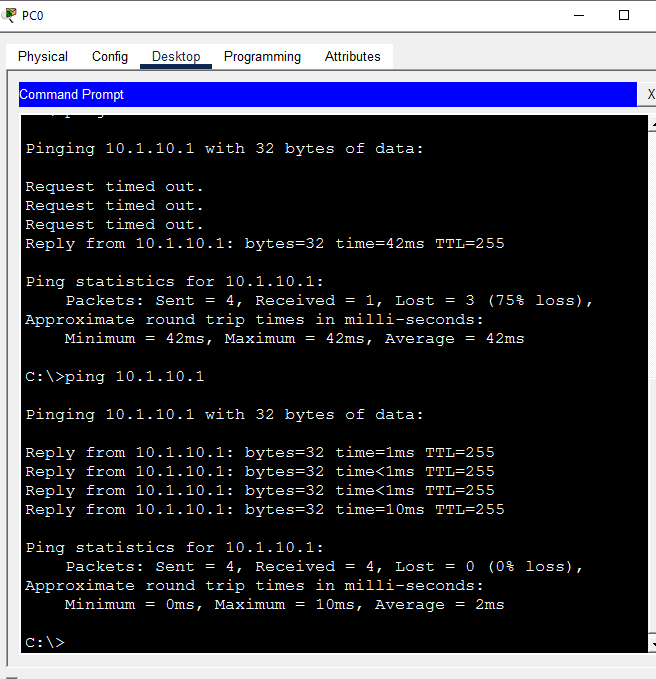<br>
  <em>Exhibit 9 — PC0 successfully pings its VLAN 10 gateway</em>
</p>
<p align="center">
  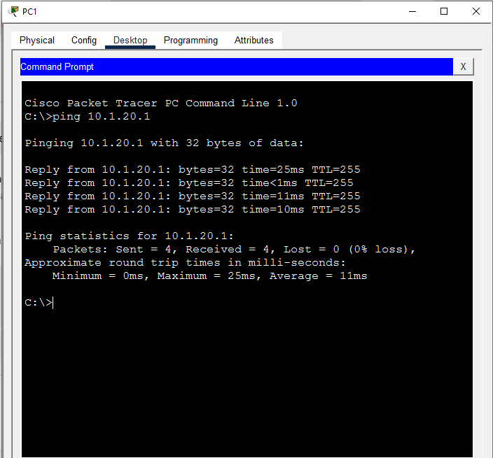<br>
  <em>Exhibit 10 — PC1 successfully pings its VLAN 20 gateway</em>
</p>
<p align="center">
  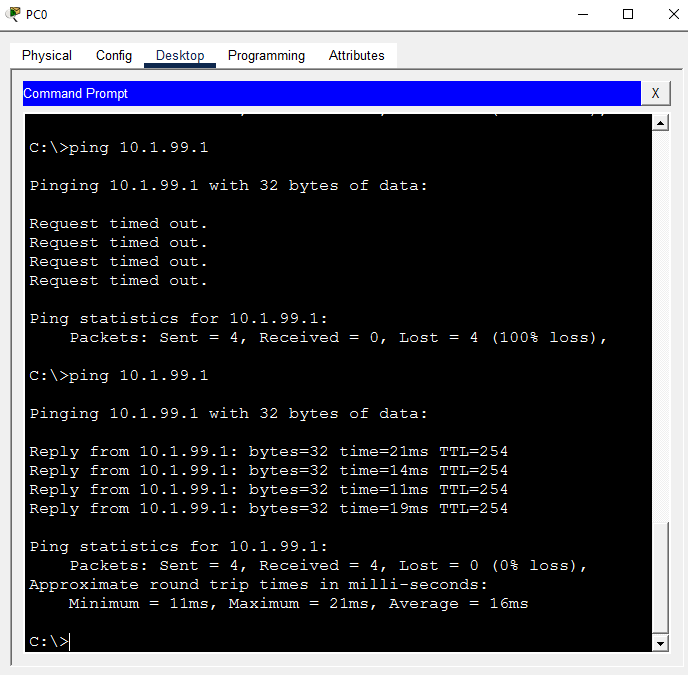<br>
  <em>Exhibit 11 — PC0 reaches the edge router across the full path</em>
</p>
<p align="center">
  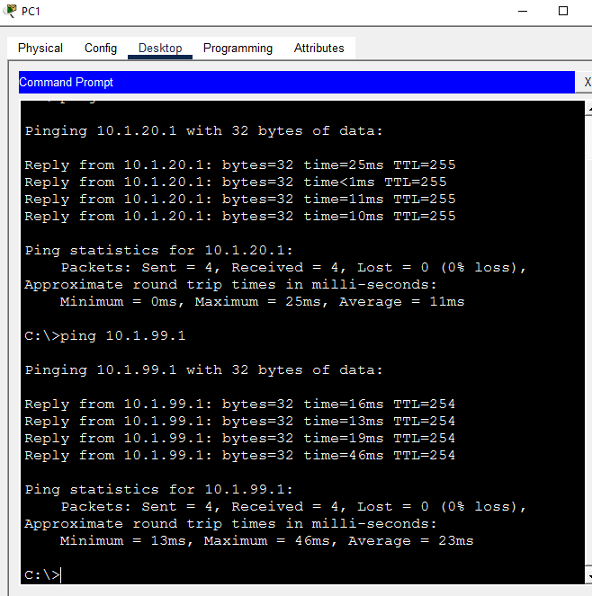<br>
  <em>Exhibit 12 — PC1 reaches the edge router across the full path</em>
</p>

### 🗺️ Fault Chain, Resolved

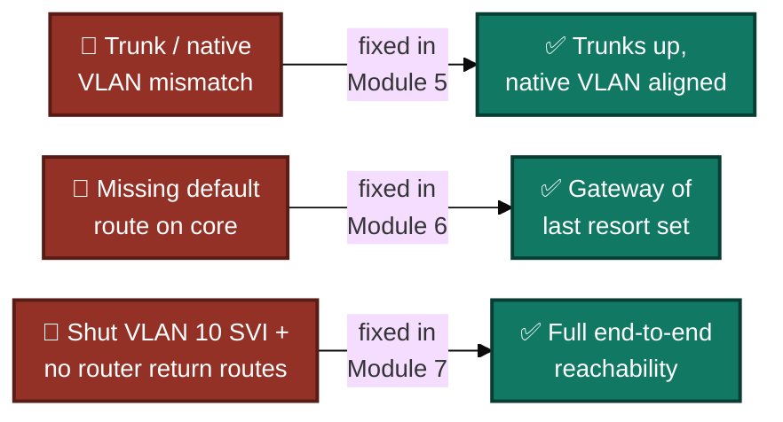
<p align="center"><em>Three independent faults, each caught by a different diagnostic command, resolved one layer at a time.</em></p>

---

<a id="coverage-snapshot"></a>
## 🌟 Coverage Snapshot

| 🛡️ Layer | ✅ Status | 📌 Detail |
|---|---|---|
| Topology | Live | 1 core, 2 access switches, 1 router, 2 PCs wired (Exhibit 1) |
| Core SVIs & routed uplink | Configured, then repaired | VLAN 10 SVI shipped shut down; corrected in Module 7 (Exhibits 2, 7–8) |
| Edge router link | Live | HQ-Edge-R1's G0/1 addressed and up (Exhibit 3) |
| Access ports & trunks | Diagnosed, then repaired | Native VLAN mismatch on Core-SW01 Fa0/24 caught via CDP log, fixed in Module 5 (Exhibits 4–6) |
| Default routing | Repaired | Core-SW01 had no gateway of last resort; added in Module 6 |
| Return routing | Repaired | HQ-Edge-R1 had no route back to either LAN subnet; added in Module 7 (Exhibits 7–8) |
| End-to-end reachability | Proven | Both PCs ping their gateway and the router with 0% loss (Exhibits 9–12) |

---

<a id="command-summary"></a>
## 📟 Command Summary

| Command | Purpose |
|---------|---------|
| `vlan 10` / `name Engineering` | Create and name VLAN |
| `ip routing` | Enable Layer 3 routing on the core switch |
| `interface vlan 10` / `ip address ...` | Create inter-VLAN routing SVI |
| `no shutdown` (on SVI) | Activate the VLAN gateway interface |
| `no switchport` | Convert a switch port to a routed Layer 3 port |
| `switchport mode access` / `switchport access vlan` | Assign access port to VLAN |
| `switchport trunk encapsulation dot1q` / `switchport mode trunk` | Configure 802.1Q trunk |
| `ip route 0.0.0.0 0.0.0.0 <next-hop>` | Set gateway of last resort |
| `ip route <network> <mask> <next-hop>` | Add a specific return/static route |
| `show ip route` | Verify routing table and default route |
| `show interfaces trunk` | Verify trunk status, native VLAN, allowed VLANs |
| `write memory` | Save running-config to startup-config |

---

<a id="challenges-fixes"></a>
## ⚠️ Challenges & Fixes

| ❌ Challenge | 🔍 Root Cause | ✅ Solution |
|---|---|---|
| `%CDP-4-NATIVE_VLAN_MISMATCH` on Core-SW01 | Core-SW01 Fa0/24 was access mode while Access-SW02 Gi0/2 was trunk mode | Set Fa0/24 to `switchport mode trunk` with dot1q encapsulation |
| PC0 couldn't reach beyond its local VLAN | No default route on Core-SW01 ("Gateway of last resort is not set") | Added `ip route 0.0.0.0 0.0.0.0 10.1.99.1` on Core-SW01 |
| Ping to router timed out even after the core fix | HQ-Edge-R1 had no return route to 10.1.10.0/24 or 10.1.20.0/24 | Added explicit static routes on HQ-Edge-R1 via 10.1.99.2 |
| PC0 still couldn't reach its own gateway | Core-SW01's VLAN 10 SVI was left `shutdown` from initial config | Issued `no shutdown` on `interface vlan 10` |

---

<a id="scope-limitations"></a>
## 🚧 Scope & Limitations

- **Simulation only:** Built and verified in Cisco Packet Tracer, not on physical hardware.
- **Pre-seeded faults, not organic failures:** The three bugs (trunk mismatch, shut SVI, missing routes) were intentionally built into the starting topology for diagnostic practice, not discovered from a live production incident.
- **No ACLs or security hardening in this lab:** Unlike the prior VLAN build, this lab isolates Layer 2/3 fault-finding and does not layer on port security, SSH, or traffic filtering.
- **No redundancy:** A single trunk per access switch and a single routed link to the edge router — no EtherChannel or a secondary path was built or tested.
- **One core switch as single point of failure:** All inter-VLAN routing depends on Core-SW01; no HSRP/VRRP or dual-core design was in scope.

These limits are stated so the lab is read as a demonstration of structured fault diagnosis, not a production-hardened design.

---

<a id="what-i-learned"></a>
## 🧠 What I Learned

- **CDP error logs point straight at Layer 2 mismatches.** The `NATIVE_VLAN_MISMATCH` message named the exact port and native VLAN on each side, turning a "why can't PC0 talk to anything" problem into a two-line fix.
- **`show ip route` tells you whether a fault is Layer 2 or Layer 3.** Once the trunk was fixed and PC0 still couldn't leave its VLAN, the missing "Gateway of last resort" line ruled out switching entirely and pointed at routing.
- **Reachability faults can hide in both directions at once.** Even after the core had a working default route, pings to the router still failed until HQ-Edge-R1 had explicit return routes — a reminder to check both legs of a path, not just the forward one.
- **A single overlooked `no shutdown` can masquerade as a routing problem.** The shut-down VLAN 10 SVI wasn't caught until the other two faults were already fixed, which is exactly why isolating one variable at a time matters.

---

<a id="skills-demonstrated"></a>
## 🛠️ Skills Demonstrated

- Diagnosing a Layer 2 trunk/native VLAN mismatch from CDP log output and `show interfaces trunk`
- Building and troubleshooting SVIs for inter-VLAN routing on a Layer 3 switch
- Converting a switch port to a routed Layer 3 interface with `no switchport`
- Reading `show ip route` to distinguish a missing default route from a missing return route
- Writing and verifying static routes on both a core switch and an edge router
- Isolating a multi-layer fault chain one variable at a time instead of assuming a single root cause
- Verifying an end-to-end fix with systematic ping testing from both end-user VLANs

---

<a id="screenshot-index"></a>
## 🖼️ Screenshot Index

| # | File | Shows |
|:---:|---|---|
| 1 | `01-topology-troubleshooting.PNG` | Full topology |
| 2 | `02-coresw-config.PNG` | Core-SW01 base config: VLANs, SVIs, routed uplink |
| 3 | `04-hq-r1-config.PNG` | HQ-Edge-R1 interface activation |
| 4 | `05-access2-config.PNG` | Access-SW02 access + trunk config |
| 5 | `06-access3-config.PNG` | Access-SW03 access + trunk config |
| 6 | `07-pc-provisioning.PNG` | PC0/PC1 static IP provisioning |
| 7 | `08-coresw-trunks-fixed.PNG` | Core-SW01 trunks confirmed after mismatch fix |
| 8 | `09-pc0-ping-success.PNG` | PC0 → VLAN 10 gateway ping success |
| 9 | `10-pc1-ping-success.PNG` | PC1 → VLAN 20 gateway ping success |
| 10 | `11-router-routes-broken.PNG` | HQ-Edge-R1 before return routes were added |
| 11 | `12-router-routes-fixed.PNG` | HQ-Edge-R1 after return routes were added |
| 12 | `13-pc0-to-router-success.PNG` | PC0 → router full-path ping success |
| 13 | `14-pc1-to-router-success.PNG` | PC1 → router full-path ping success |

---

<a id="repo-structure"></a>
## 📁 Repo Structure

```text
04-Enterprise-network-vlan-intervlan-routing-troubleshooting/
|-- README.md
|-- Lab04_Network_Troubleshooting.pkt
`-- screenshots/
    |-- 01-topology-troubleshooting.PNG
    |-- 02-coresw-config.PNG
    |-- 04-hq-r1-config.PNG
    |-- 05-access2-config.PNG
    |-- 06-access3-config.PNG
    |-- 07-pc-provisioning.PNG
    |-- 08-coresw-trunks-fixed.PNG
    |-- 09-pc0-ping-success.PNG
    |-- 10-pc1-ping-success.PNG
    |-- 11-router-routes-broken.PNG
    |-- 12-router-routes-fixed.PNG
    |-- 13-pc0-to-router-success.PNG
    `-- 14-pc1-to-router-success.PNG
```

<div align="center">

🔀 **[Understanding Native VLAN Mismatch](https://www.cisco.com/c/en/us/support/docs/lan-switching/8021q/17056-741-4.html)** · 🚪 **[Configuring Inter-VLAN Routing with SVIs](https://www.cisco.com/c/en/us/support/docs/lan-switching/inter-vlan-routing/41860-howto-L3-intervlanrouting.html)** · 🛣️ **[Static Routing Configuration Guide](https://www.cisco.com/c/en/us/support/docs/ip/routing-information-protocol-rip/13788-3.html)**

</div>
