<div align="center">

# 🌐 Routing Protocols — Static, RIP v2, OSPF & EIGRP

**Lab 05 — Cisco Networking Lab Portfolio**

Multi-Router Enterprise Topology: Migrating Between Static Routing, RIP v2, OSPF and EIGRP (Cisco Packet Tracer)


A three-router enterprise topology configured and re-configured four separate times: first with manual static routes, then migrated in turn to RIP v2, OSPF and EIGRP — verifying the routing table and re-testing end-to-end connectivity after every migration, so each protocol's behavior, convergence and route-table signature (S, R, O, D) can be compared directly on the same network.

</div>

---

## 📑 Table of Contents

1. [At a Glance](#at-a-glance)
2. [Project Background](#project-background)
3. [Tools & Technologies](#tools-technologies)
4. [Protocol Comparison](#protocol-comparison)
5. [Environment](#environment)
6. [Topology](#topology)
7. [IP Addressing](#ip-addressing)
8. [PC IP Configuration](#pc-ip-configuration)
9. [Module 1 — Build the Topology](#module-1)
10. [Module 2 — IP Addressing on All Routers](#module-2)
11. [Module 3 — Static Routing](#module-3)
12. [Module 4 — RIP v2 Migration](#module-4)
13. [Module 5 — OSPF Migration](#module-5)
14. [Module 6 — EIGRP Migration](#module-6)
15. [Coverage Snapshot](#coverage-snapshot)
16. [Command Summary](#command-summary)
17. [Challenges & Fixes](#challenges-fixes)
18. [Scope & Limitations](#scope-limitations)
19. [What I Learned](#what-i-learned)
20. [Skills Demonstrated](#skills-demonstrated)
21. [Screenshot Index](#screenshot-index)
22. [Repo Structure](#repo-structure)

---

<a id="at-a-glance"></a>
## 📊 At a Glance

<div align="center">

| 🛣️ Protocols | 🚪 Routers | 🔀 Switches | 🔁 Migrations | 🖼️ Screenshots | 🧱 Steps |
|:---:|:---:|:---:|:---:|:---:|:---:|
| **4** | **3** | **3** | **3** | **14** | **10** |

</div>

---

<a id="project-background"></a>
## 📖 Project Background

This lab holds the topology constant — three routers, three LANs, two WAN links — and swaps the routing protocol underneath it four times, so each protocol's configuration, convergence behavior and routing-table signature can be observed and ping-tested against the exact same network rather than four different ones.

| Module | Focus |
|---|---|
| 🔵 **Module 1 — Build the Topology** | Wire 3 routers, 3 switches and 3 PCs |
| 🟢 **Module 2 — IP Addressing** | Address every router interface and disable DNS lookup |
| 🟣 **Module 3 — Static Routing** | Manually route between all three LANs, verify with ping |
| 🟠 **Module 4 — RIP v2 Migration** | Replace static routes with RIP v2, verify convergence |
| 🔴 **Module 5 — OSPF Migration** | Replace RIP with single-area OSPF, verify neighbor adjacency |
| 🟤 **Module 6 — EIGRP Migration** | Replace OSPF with EIGRP, verify neighbor adjacency |

> [!NOTE]
> This is a Packet Tracer simulation, not physical hardware. Each protocol is fully removed before the next is configured — the topology and IP addressing never change between migrations.

---

<a id="tools-technologies"></a>
## 🛠️ Tools & Technologies

| Tool | Purpose |
|------|---------|
| 🖥️ Cisco Packet Tracer | Network simulation |
| 🚪 Router 2811 x3 | Multi-protocol routing (R1, R2, R3) |
| 🔀 Switch 2960-24TT x3 | LAN switching (SW1, SW2, SW3) |
| 🛣️ Static Routing | Manual route configuration |
| 🔁 RIP v2 | Distance-vector legacy protocol |
| 🧬 EIGRP | Cisco hybrid enterprise protocol |
| 🌐 OSPF | Industry-standard link-state protocol |

---

<a id="protocol-comparison"></a>
## 📊 Protocol Comparison

| Protocol | Type | AD | Metric | Real World Use |
|----------|------|----|--------|----------------|
| 🟣 Static | Manual | 1 | None | Small networks, default routes |
| 🟠 RIP v2 | Distance Vector | 120 | Hop count | Legacy networks only |
| 🟤 EIGRP | Hybrid | 90 | Bandwidth + Delay | Cisco enterprise |
| 🔴 OSPF | Link State | 110 | Cost (bandwidth) | Industry standard |

---

<a id="environment"></a>
## 🖧 Environment


**Devices:** 3 Routers (2811: R1, R2, R3) · 3 Switches (2960-24TT: SW1, SW2, SW3) · 3 PCs

**Physical Connections**

| From | Interface | To | Interface | Cable |
|------|-----------|----|-----------|-------|
| PC1 | Fa0 | SW1 | Fa0/1 | Straight-Through |
| SW1 | Fa0/24 | R1 | G0/0 | Straight-Through |
| PC2 | Fa0 | SW2 | Fa0/2 | Straight-Through |
| SW2 | Fa0/24 | R2 | G0/0 | Straight-Through |
| PC3 | Fa0 | SW3 | Fa0/3 | Straight-Through |
| SW3 | Fa0/24 | R3 | G0/0 | Straight-Through |
| R1 | G0/1 | R2 | G0/1 | Cross-Over |
| R2 | G0/2 | R3 | G0/1 | Cross-Over |

---

<a id="topology"></a>
## 🗺️ Topology

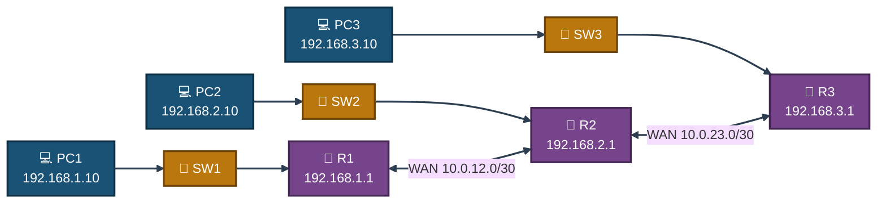
<p align="center"><em>R2 sits in the middle of a linear chain, giving every protocol a genuine multi-hop path to converge across between LAN 1 and LAN 3.</em></p>

---

<a id="ip-addressing"></a>
## 🌐 IP Addressing

| Device | Interface | IP Address | Subnet Mask | Description |
|--------|-----------|------------|-------------|-------------|
| R1 | G0/0 | 192.168.1.1 | 255.255.255.0 | LAN 1 Gateway |
| R1 | G0/1 | 10.0.12.1 | 255.255.255.252 | WAN Link to R2 |
| R2 | G0/0 | 192.168.2.1 | 255.255.255.0 | LAN 2 Gateway |
| R2 | G0/1 | 10.0.12.2 | 255.255.255.252 | WAN Link to R1 |
| R2 | G0/2 | 10.0.23.1 | 255.255.255.252 | WAN Link to R3 |
| R3 | G0/0 | 192.168.3.1 | 255.255.255.0 | LAN 3 Gateway |
| R3 | G0/1 | 10.0.23.2 | 255.255.255.252 | WAN Link to R2 |

---

<a id="pc-ip-configuration"></a>
## 💻 PC IP Configuration

| PC | IP Address | Subnet Mask | Gateway |
|----|------------|-------------|---------|
| PC1 | 192.168.1.10 | 255.255.255.0 | 192.168.1.1 |
| PC2 | 192.168.2.10 | 255.255.255.0 | 192.168.2.1 |
| PC3 | 192.168.3.10 | 255.255.255.0 | 192.168.3.1 |

---

<a id="module-1"></a>
## 🏗️ Module 1 — Build the Topology

**Objective:** Wire 3 routers, 3 switches and 3 PCs exactly per the Environment tables.

### Step 1 — Build the Topology ✅

No CLI commands in this step — physical/logical wiring done in the Packet Tracer GUI (place devices, connect cables per the tables above).

<p align="center">
  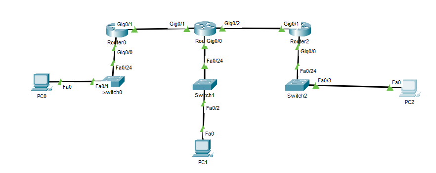<br>
  <em>Exhibit 1 — Full topology: three router/switch/PC LANs chained across two WAN links</em>
</p>

---

<a id="module-2"></a>
## 🌐 Module 2 — IP Addressing on All Routers

**Objective:** Address every LAN and WAN interface on R1, R2 and R3, and confirm each shows up/up.

### Step 2 — Configure IP Addressing on All Routers ✅

```
Router(config)# hostname R1
R1(config)# no ip domain-lookup
R1(config)# interface g0/0
R1(config-if)# ip address 192.168.1.1 255.255.255.0
R1(config-if)# no shutdown
R1(config-if)# exit
R1(config)# interface g0/1
R1(config-if)# ip address 10.0.12.1 255.255.255.252
R1(config-if)# no shutdown

Router(config)# hostname R2
R2(config)# no ip domain-lookup
R2(config)# interface g0/0
R2(config-if)# ip address 192.168.2.1 255.255.255.0
R2(config-if)# no shutdown
R2(config-if)# exit
R2(config)# interface g0/1
R2(config-if)# ip address 10.0.12.2 255.255.255.252
R2(config-if)# no shutdown
R2(config-if)# exit
R2(config)# interface g0/2
R2(config-if)# ip address 10.0.23.1 255.255.255.252
R2(config-if)# no shutdown

Router(config)# hostname R3
R3(config)# no ip domain-lookup
R3(config)# interface g0/0
R3(config-if)# ip address 192.168.3.1 255.255.255.0
R3(config-if)# no shutdown
R3(config-if)# exit
R3(config)# interface g0/1
R3(config-if)# ip address 10.0.23.2 255.255.255.252
R3(config-if)# no shutdown
```

<p align="center">
  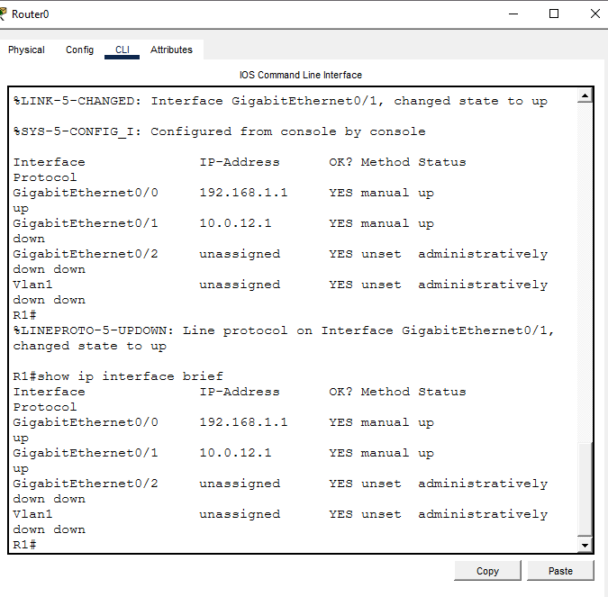<br>
  <em>Exhibit 2 — R1's LAN and WAN interfaces confirmed up/up via <code>show ip interface brief</code></em>
</p>
<p align="center">
  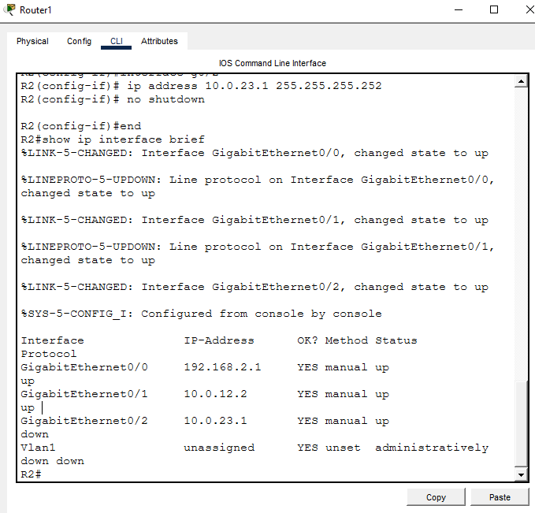<br>
  <em>Exhibit 3 — R2's LAN and dual WAN interfaces confirmed up/up</em>
</p>
<p align="center">
  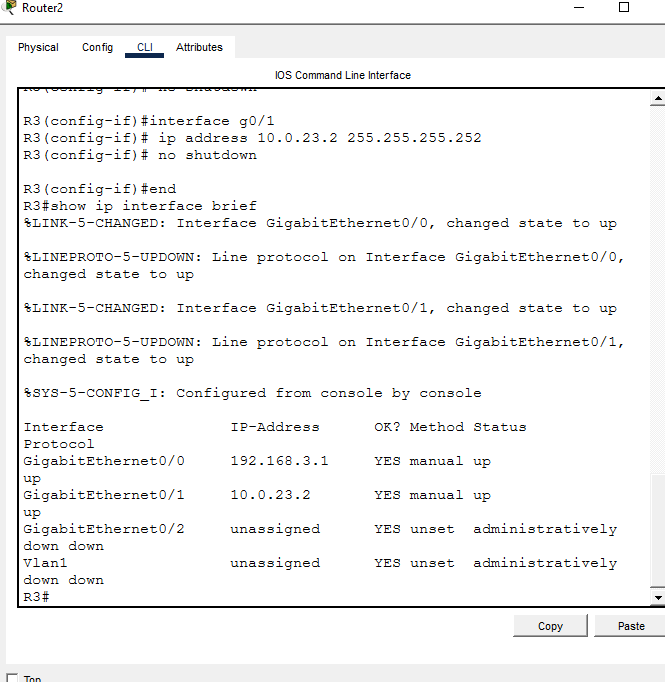<br>
  <em>Exhibit 4 — R3's LAN and WAN interfaces confirmed up/up</em>
</p>

---

<a id="module-3"></a>
## 🛣️ Module 3 — Static Routing

**Objective:** Manually route all three LANs to each other and confirm end-to-end reachability.

### Step 3 — Configure Static Routes ✅

```
R1(config)# ip route 192.168.2.0 255.255.255.0 10.0.12.2
R1(config)# ip route 192.168.3.0 255.255.255.0 10.0.12.2

R2(config)# ip route 192.168.1.0 255.255.255.0 10.0.12.1
R2(config)# ip route 192.168.3.0 255.255.255.0 10.0.23.2

R3(config)# ip route 192.168.1.0 255.255.255.0 10.0.23.1
R3(config)# ip route 192.168.2.0 255.255.255.0 10.0.23.1
```

<p align="center">
  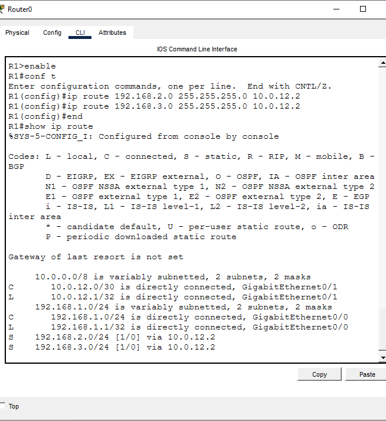<br>
  <em>Exhibit 5 — R1's routing table showing S routes to LAN 2 and LAN 3</em>
</p>

### Step 4 — Test Static Connectivity ✅

```
R1# show ip route
PC1> ping 192.168.3.10
```

<p align="center">
  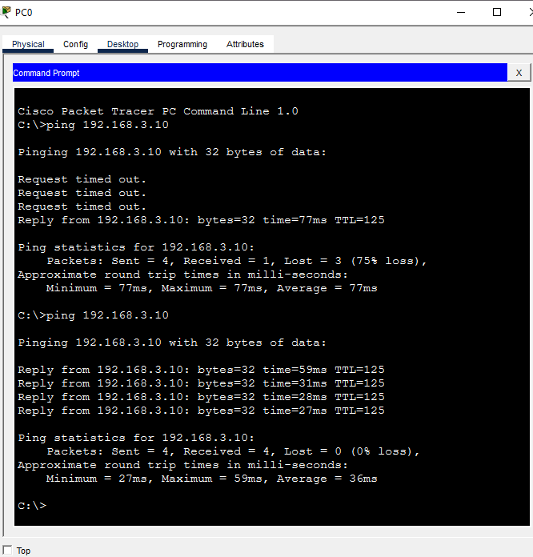<br>
  <em>Exhibit 6 — PC1 successfully pings PC3 across two static-routed hops</em>
</p>

---

<a id="module-4"></a>
## 🔁 Module 4 — RIP v2 Migration

**Objective:** Remove the static routes and replace them with RIP v2 across all three routers.

### Step 5 — Migrate to RIP v2 ✅

```
R1(config)# no ip route 192.168.2.0 255.255.255.0 10.0.12.2
R1(config)# no ip route 192.168.3.0 255.255.255.0 10.0.12.2
R1(config)# router rip
R1(config-router)# version 2
R1(config-router)# no auto-summary
R1(config-router)# network 192.168.1.0
R1(config-router)# network 10.0.12.0

R2(config)# no ip route 192.168.1.0 255.255.255.0 10.0.12.1
R2(config)# no ip route 192.168.3.0 255.255.255.0 10.0.23.2
R2(config)# router rip
R2(config-router)# version 2
R2(config-router)# no auto-summary
R2(config-router)# network 192.168.2.0
R2(config-router)# network 10.0.12.0
R2(config-router)# network 10.0.23.0

R3(config)# no ip route 192.168.1.0 255.255.255.0 10.0.23.1
R3(config)# no ip route 192.168.2.0 255.255.255.0 10.0.23.1
R3(config)# router rip
R3(config-router)# version 2
R3(config-router)# no auto-summary
R3(config-router)# network 192.168.3.0
R3(config-router)# network 10.0.23.0
```

<p align="center">
  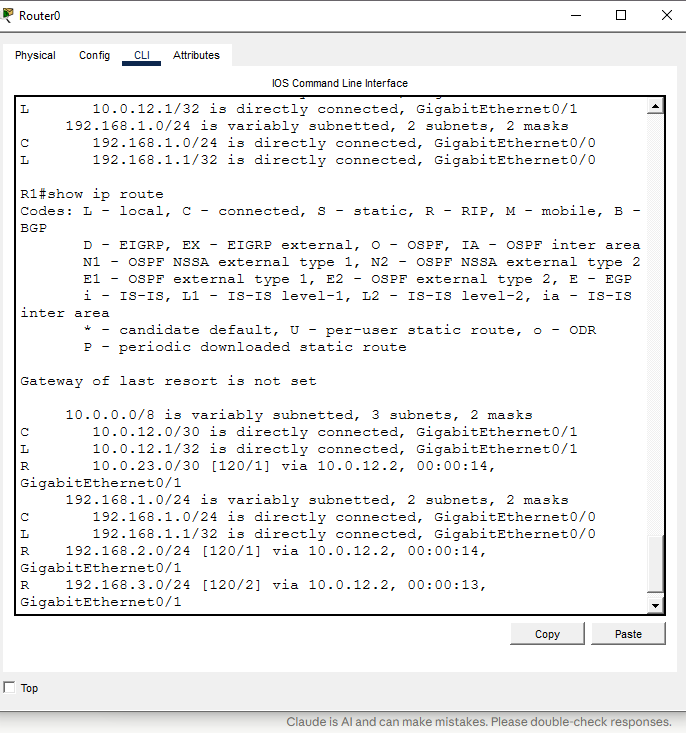<br>
  <em>Exhibit 7 — R1's routing table now showing R (RIP) routes in place of the removed static entries</em>
</p>

### Step 6 — Test RIP Connectivity ✅

```
R1# show ip route
PC1> ping 192.168.3.10
```

<p align="center">
  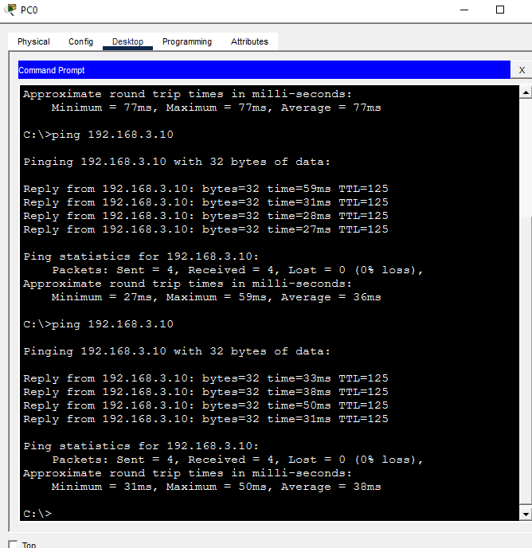<br>
  <em>Exhibit 8 — PC1 to PC3 reachability confirmed under RIP v2</em>
</p>

---

<a id="module-5"></a>
## 🔗 Module 5 — OSPF Migration

**Objective:** Remove RIP and replace it with single-area OSPF, verifying full neighbor adjacency.

### Step 7 — Migrate to OSPF ✅

```
R1(config)# no router rip
R1(config)# router ospf 1
R1(config-router)# network 192.168.1.0 0.0.0.255 area 0
R1(config-router)# network 10.0.12.0 0.0.0.3 area 0

R2(config)# no router rip
R2(config)# router ospf 1
R2(config-router)# network 192.168.2.0 0.0.0.255 area 0
R2(config-router)# network 10.0.12.0 0.0.0.3 area 0
R2(config-router)# network 10.0.23.0 0.0.0.3 area 0

R3(config)# no router rip
R3(config)# router ospf 1
R3(config-router)# network 192.168.3.0 0.0.0.255 area 0
R3(config-router)# network 10.0.23.0 0.0.0.3 area 0
```

<p align="center">
  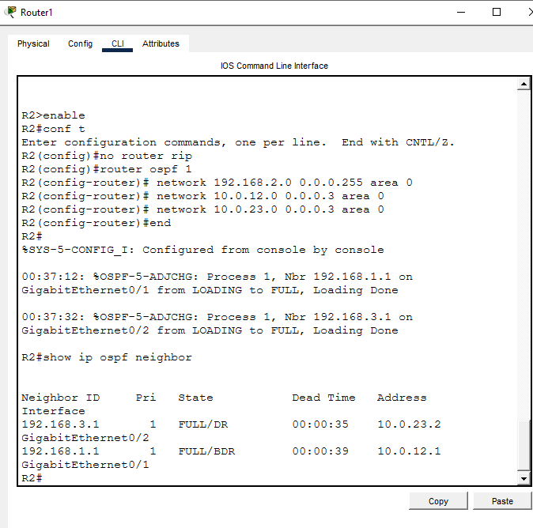<br>
  <em>Exhibit 9 — R2 shows FULL-state OSPF adjacency with both R1 and R3</em>
</p>
<p align="center">
  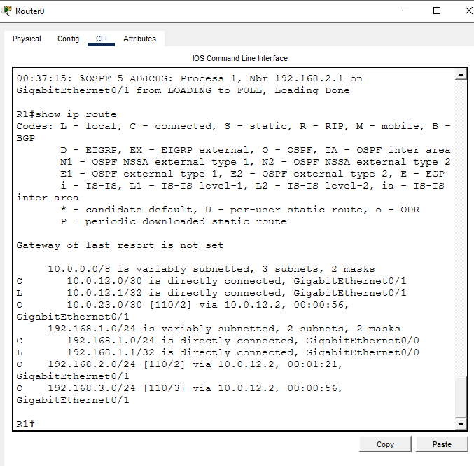<br>
  <em>Exhibit 10 — R1's routing table now showing O (OSPF) routes to LAN 2 and LAN 3</em>
</p>

### Step 8 — Test OSPF Connectivity ✅

```
R2# show ip ospf neighbor
R1# show ip route
PC1> ping 192.168.3.10
```

<p align="center">
  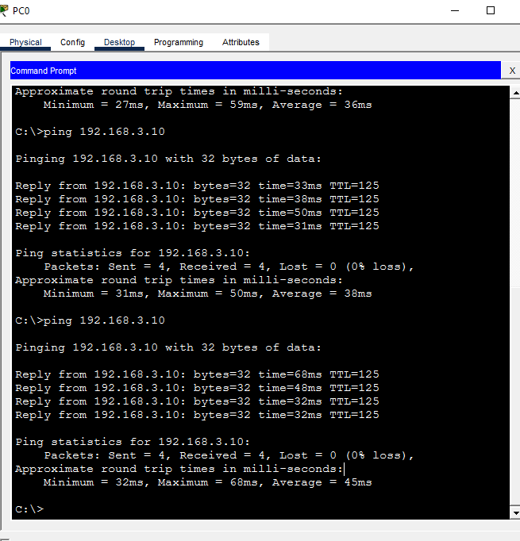<br>
  <em>Exhibit 11 — PC1 to PC3 reachability confirmed under OSPF</em>
</p>

---

<a id="module-6"></a>
## 🧬 Module 6 — EIGRP Migration

**Objective:** Remove OSPF and replace it with EIGRP AS 100, verifying full neighbor adjacency.

### Step 9 — Migrate to EIGRP ✅

```
R1(config)# no router ospf 1
R1(config)# router eigrp 100
R1(config-router)# network 192.168.1.0 0.0.0.255
R1(config-router)# network 10.0.12.0 0.0.0.3
R1(config-router)# no auto-summary

R2(config)# no router ospf 1
R2(config)# router eigrp 100
R2(config-router)# network 192.168.2.0 0.0.0.255
R2(config-router)# network 10.0.12.0 0.0.0.3
R2(config-router)# network 10.0.23.0 0.0.0.3
R2(config-router)# no auto-summary

R3(config)# no router ospf 1
R3(config)# router eigrp 100
R3(config-router)# network 192.168.3.0 0.0.0.255
R3(config-router)# network 10.0.23.0 0.0.0.3
R3(config-router)# no auto-summary
```

<p align="center">
  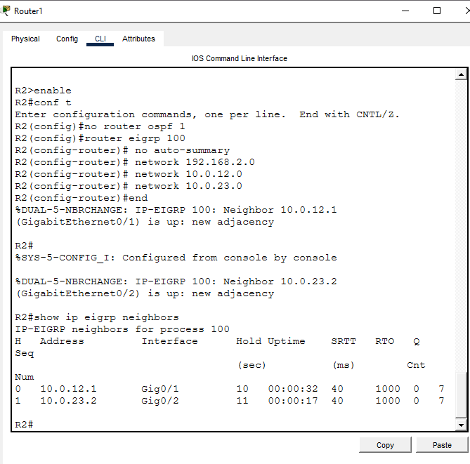<br>
  <em>Exhibit 12 — R2 confirms EIGRP neighbor adjacency with both R1 and R3</em>
</p>
<p align="center">
  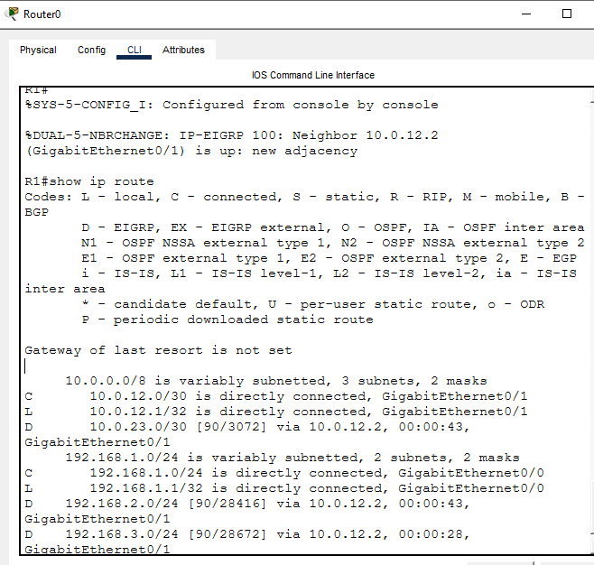<br>
  <em>Exhibit 13 — R1's routing table now showing D (EIGRP) routes to LAN 2 and LAN 3</em>
</p>

### Step 10 — Test EIGRP Connectivity ✅

```
R2# show ip eigrp neighbors
R1# show ip route
PC1> ping 192.168.3.10
```

<p align="center">
  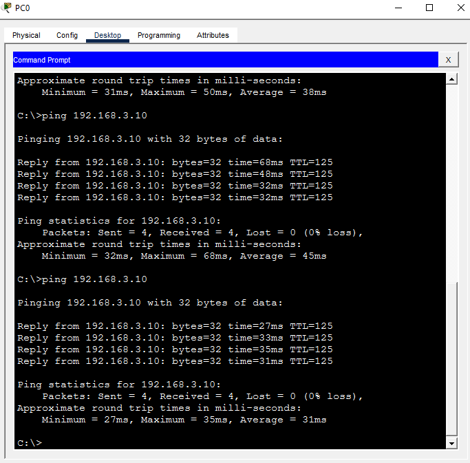<br>
  <em>Exhibit 14 — PC1 to PC3 reachability confirmed under EIGRP, closing out all four protocols</em>
</p>

### 🗺️ Protocol Migration Path

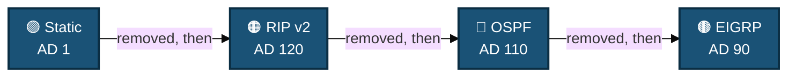
<p align="center"><em>Each protocol was fully removed before the next was configured — the topology and PC addressing never changed across all four migrations.</em></p>

---

<a id="coverage-snapshot"></a>
## 🌟 Coverage Snapshot

| 🛡️ Layer | ✅ Status | 📌 Detail |
|---|---|---|
| Topology | Live | 3 routers, 3 switches, 3 PCs wired across 2 WAN links (Exhibit 1) |
| IP addressing | Live | All router LAN/WAN interfaces up/up (Exhibits 2–4) |
| Static routing | Proven | Manual routes on all 3 routers, PC1↔PC3 ping success (Exhibits 5–6) |
| RIP v2 | Proven | Static routes removed, RIP routes converge, PC1↔PC3 ping success (Exhibits 7–8) |
| OSPF | Proven | Full-state neighbor adjacency, PC1↔PC3 ping success (Exhibits 9–11) |
| EIGRP | Proven | Neighbor adjacency confirmed, PC1↔PC3 ping success (Exhibits 12–14) |

---

<a id="command-summary"></a>
## 📟 Command Summary

| Command | Purpose |
|---------|---------|
| `hostname R1` | Set router hostname |
| `no ip domain-lookup` | Disable DNS lookup |
| `ip address x.x.x.x x.x.x.x` | Assign IP to interface |
| `no shutdown` | Enable interface |
| `ip route` | Configure static route |
| `no ip route` | Remove static route |
| `router rip` / `version 2` | Enable RIP v2 |
| `no auto-summary` | Disable auto summarization |
| `router eigrp 100` | Enable EIGRP AS 100 |
| `show ip eigrp neighbors` | Verify EIGRP neighbors |
| `router ospf 1` | Enable OSPF process 1 |
| `network x.x.x.x area 0` | Add network to OSPF area 0 |
| `show ip route` | View full routing table |
| `show ip ospf neighbor` | Verify OSPF neighbors |
| `show ip interface brief` | Verify interface status |
| `copy running-config startup-config` | Save configuration |

---

<a id="challenges-fixes"></a>
## ⚠️ Challenges & Fixes

| ❌ Challenge | ✅ Solution |
|---|---|
| G0/1 on R1 showing up/down initially | Normal — the far side wasn't configured yet; resolved once R2 was configured |
| Wrong IP configured on R1 G0/1 (10.0.0.1 instead of 10.0.12.1) | Used `no ip address` then reassigned the correct IP 10.0.12.1 |
| First ping timing out after static routing | ARP resolution on the first ping is normal; the second ping was 4/4 success |
| R routes not appearing immediately after enabling RIP on R1 | RIP needs every router configured before routes propagate; routes appeared once R2 and R3 were configured |
| PC IPs not configured — ping failing | Set IP, subnet and gateway manually on each PC via Desktop → IP Configuration |

---

<a id="scope-limitations"></a>
## 🚧 Scope & Limitations

- **Simulation only:** Built and verified in Cisco Packet Tracer, not on physical hardware.
- **Single area / single AS:** OSPF ran entirely in area 0 and EIGRP entirely in AS 100 — no multi-area OSPF or route redistribution between protocols was tested.
- **Sequential, not simultaneous, protocols:** Each protocol was fully removed before the next was configured; the lab does not cover redistribution or two protocols coexisting on the same router.
- **No route summarization or filtering:** `no auto-summary` was set for RIP and EIGRP, but no manual summarization, route maps, or distribute lists were configured.
- **No redundancy:** A single linear chain (R1–R2–R3) with one path between any two LANs — no dual-homed links or protocol convergence-under-failure testing.

These limits are stated so the lab is read as a protocol-comparison exercise, not a production routing design.

---

<a id="what-i-learned"></a>
## 🧠 What I Learned

- **Administrative distance decides who wins, not who's "better."** Watching the same destination move from an `S` static route to `R`, then `O`, then `D` on the exact same topology made the AD hierarchy (1 → 90 → 110 → 120) concrete rather than a table to memorize.
- **RIP needs the whole network configured before it converges.** Routes didn't appear on R1 until R2 and R3 also had RIP enabled — a reminder that distance-vector convergence depends on every neighbor advertising, not just the local router.
- **OSPF and EIGRP both expose neighbor state directly.** `show ip ospf neighbor` and `show ip eigrp neighbors` let me confirm adjacency before ever checking the routing table, which narrows down whether a problem is at the neighbor or the route-advertisement level.
- **The first ping after any routing change is not a reliable test.** ARP resolution delay caused a false failure more than once; the real test is the second ping.

---

<a id="skills-demonstrated"></a>
## 🛠️ Skills Demonstrated

- Addressing and verifying router LAN/WAN interfaces across a multi-hop topology
- Configuring and removing static routes cleanly during a protocol migration
- Configuring RIP v2 with `no auto-summary` and verifying convergence via the routing table
- Configuring single-area OSPF and verifying FULL-state neighbor adjacency
- Configuring EIGRP AS 100 and verifying neighbor adjacency
- Reading routing table codes (S, R, O, D) to confirm which protocol is currently active
- Diagnosing ARP-resolution false failures and IP-misconfiguration issues during migration

---

<a id="screenshot-index"></a>
## 🖼️ Screenshot Index

| # | File | Shows |
|:---:|---|---|
| 1 | `01-routing-topology.PNG` | Full topology after wiring |
| 2 | `SS2-R1-interfaces.png` | `show ip interface brief` — R1 up/up |
| 3 | `SS3-R2-interfaces.png` | `show ip interface brief` — R2 up/up |
| 4 | `SS4-R3-interfaces.png` | `show ip interface brief` — R3 up/up |
| 5 | `SS5-static-R1-route.png` | `show ip route` — S routes visible on R1 |
| 6 | `SS6-static-ping.png` | PC1 → PC3 ping, 4/4 success under static routing |
| 7 | `SS7-rip-R1-route.png` | `show ip route` — R routes visible on R1 |
| 8 | `SS8-rip-ping.png` | PC1 → PC3 ping, 4/4 success under RIP v2 |
| 9 | `SS9-ospf-R2-neighbors.png` | `show ip ospf neighbor` — FULL state on R2 |
| 10 | `SS10-ospf-R1-route.png` | `show ip route` — O routes visible on R1 |
| 11 | `SS11-ospf-ping.png` | PC1 → PC3 ping, 4/4 success under OSPF |
| 12 | `SS12-eigrp-R2-neighbors.png` | `show ip eigrp neighbors` — R2 |
| 13 | `SS13-eigrp-R1-route.png` | `show ip route` — D routes visible on R1 |
| 14 | `SS14-eigrp-ping.png` | PC1 → PC3 ping, 4/4 success under EIGRP |

---

<a id="repo-structure"></a>
## 📁 Repo Structure

```text
05-routing-protocols-static-rip-ospf-eigrp/
|-- README.md
`-- screenshots/
    |-- 01-routing-topology.PNG
    |-- SS2-R1-interfaces.png
    |-- SS3-R2-interfaces.png
    |-- SS4-R3-interfaces.png
    |-- SS5-static-R1-route.png
    |-- SS6-static-ping.png
    |-- SS7-rip-R1-route.png
    |-- SS8-rip-ping.png
    |-- SS9-ospf-R2-neighbors.png
    |-- SS10-ospf-R1-route.png
    |-- SS11-ospf-ping.png
    |-- SS12-eigrp-R2-neighbors.png
    |-- SS13-eigrp-R1-route.png
    `-- SS14-eigrp-ping.png
```

<div align="center">

🛣️ **[RIP Version 2 Overview](https://www.cisco.com/c/en/us/support/docs/ip/routing-information-protocol-rip/13788-3.html)** · 🌐 **[OSPF Design Guide](https://www.cisco.com/c/en/us/support/docs/ip/open-shortest-path-first-ospf/7039-1.html)** · 🧬 **[EIGRP Overview](https://www.cisco.com/c/en/us/support/docs/ip/enhanced-interior-gateway-routing-protocol-eigrp/16406-eigrp-toc.html)**

</div>
