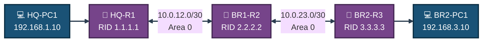
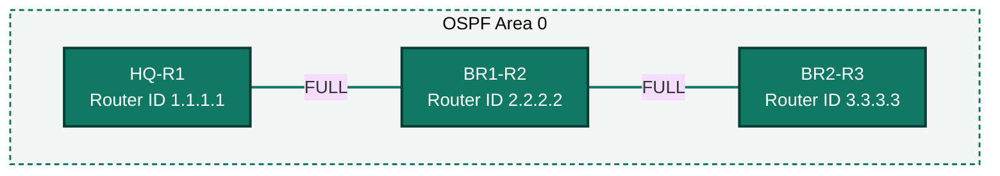

<div align="center">

# 🌐 Enterprise Network OSPF Single-Area Routing

**Lab 06 — Cisco Networking Lab Portfolio**

Three-Router Backbone: OSPF Area 0 Neighbor Adjacency, Route Advertisement & End-to-End Connectivity (Cisco Packet Tracer)


-005EB8?style=for-the-badge)


A three-router backbone — HQ-R1, BR1-R2 and BR2-R3 — running OSPF entirely inside Area 0. Every router gets a manually assigned Router ID, advertises its networks with the correct wildcard mask, and forms FULL neighbor adjacency with the routers on either side, ending with two PCs on opposite ends of the backbone pinging each other across the full OSPF-learned path.

</div>

---

## 📑 Table of Contents

1. [At a Glance](#at-a-glance)
2. [Project Background](#project-background)
3. [Tools & Technologies](#tools-technologies)
4. [Environment](#environment)
5. [Topology](#topology)
6. [OSPF Design](#ospf-design)
7. [IP Addressing Table](#ip-addressing-table)
8. [PC IP Configuration](#pc-ip-configuration)
9. [Module 1 — Build the Topology](#module-1)
10. [Module 2 — Router Configuration & OSPF](#module-2)
11. [Module 3 — OSPF Neighbor Verification](#module-3)
12. [Module 4 — Route Table Verification](#module-4)
13. [Module 5 — PC Provisioning](#module-5)
14. [Module 6 — End-to-End Verification](#module-6)
15. [Coverage Snapshot](#coverage-snapshot)
16. [Command Summary](#command-summary)
17. [Challenges & Fixes](#challenges-fixes)
18. [Scope & Limitations](#scope-limitations)
19. [What I Learned](#what-i-learned)
20. [Skills Demonstrated](#skills-demonstrated)
21. [Screenshot Index](#screenshot-index)
22. [Repo Structure](#repo-structure)

---

<a id="at-a-glance"></a>
## 📊 At a Glance

<div align="center">

| 🌐 Routers | 🔁 OSPF Areas | 🖧 PCs | 🔗 Neighbor Adjacencies | 🖼️ Screenshots | 🧱 Steps |
|:---:|:---:|:---:|:---:|:---:|:---:|
| **3** | **1 (Area 0)** | **2** | **2** | **10** | **10** |

</div>

---

<a id="project-background"></a>
## 📖 Project Background

This lab builds a linear three-router OSPF backbone from scratch: each router is addressed, given a manual Router ID, and advertised into Area 0 one at a time, with neighbor adjacency and the routing table checked after every router comes online. Two PCs are added last, one on each end of the backbone, to prove the OSPF-learned path actually carries traffic.

| Module | Focus |
|---|---|
| 🏗️ **Module 1 — Build the Topology** | Wire 3 routers and lay out HQ-R1 → BR1-R2 → BR2-R3 |
| ⚙️ **Module 2 — Router Configuration & OSPF** | Address every interface and enable OSPF Area 0 on all three routers |
| 🔗 **Module 3 — OSPF Neighbor Verification** | Confirm FULL adjacency on HQ-R1, BR1-R2 and BR2-R3 |
| 📋 **Module 4 — Route Table Verification** | Confirm BR2-R3 has learned the HQ-R1 LAN via OSPF |
| 💻 **Module 5 — PC Provisioning** | Add HQ-PC1 and BR2-PC1, assign static IPs |
| ✅ **Module 6 — End-to-End Verification** | Ping HQ-PC1 to BR2-PC1 across the full backbone |

> [!NOTE]
> This is a Packet Tracer simulation, not physical hardware. Command output referenced in a step is what the corresponding screenshot shows.

---

<a id="tools-technologies"></a>
## 🛠️ Tools & Technologies

| Tool | Purpose |
|------|---------|
| 🖥️ Cisco Packet Tracer | Network simulation |
| 🚪 Router 1941 x3 | OSPF routing, IP addressing (HQ-R1, BR1-R2, BR2-R3) |
| 🌐 OSPF Process 1 | Dynamic routing protocol, single Area 0 |
| 💻 PC x2 | End-to-end connectivity testing |

---

<a id="environment"></a>
## 🖧 Environment


**Devices:** 3 Routers (1941: HQ-R1, BR1-R2, BR2-R3) · 2 PCs (HQ-PC1, BR2-PC1)

**Router to Router**

| From | Interface | To | Interface | Cable |
|------|-----------|-----|-----------|-------|
| HQ-R1 | Gi0/0 | BR1-R2 | Gi0/0 | Copper Straight-Through |
| BR1-R2 | Gi0/1 | BR2-R3 | Gi0/0 | Copper Straight-Through |

**PCs to Routers**

| PC | Router | Router Interface | Cable |
|----|--------|-------------------|-------|
| HQ-PC1 | HQ-R1 | Gi0/1 | Copper Straight-Through |
| BR2-PC1 | BR2-R3 | Gi0/1 | Copper Straight-Through |

---

<a id="topology"></a>
## 🗺️ Topology


<p align="center"><em>BR1-R2 sits in the middle of the backbone, giving OSPF two adjacencies to form and two hops for HQ-PC1's traffic to cross before reaching BR2-PC1.</em></p>

---

<a id="ospf-design"></a>
## 🔁 OSPF Design

| Parameter | Value |
|-----------|-------|
| Process ID | 1 |
| Area | 0 (Backbone) |
| HQ-R1 Router ID | 1.1.1.1 |
| BR1-R2 Router ID | 2.2.2.2 |
| BR2-R3 Router ID | 3.3.3.3 |

---

<a id="ip-addressing-table"></a>
## 🗂️ IP Addressing Table

| Device | Interface | IP Address | Subnet Mask | Purpose |
|--------|-----------|-----------|-------------|---------|
| HQ-R1 | Gi0/0 | 10.0.12.1 | 255.255.255.252 | Link to BR1-R2 |
| HQ-R1 | Gi0/1 | 192.168.1.1 | 255.255.255.0 | HQ LAN Gateway |
| BR1-R2 | Gi0/0 | 10.0.12.2 | 255.255.255.252 | Link to HQ-R1 |
| BR1-R2 | Gi0/1 | 10.0.23.1 | 255.255.255.252 | Link to BR2-R3 |
| BR2-R3 | Gi0/0 | 10.0.23.2 | 255.255.255.252 | Link to BR1-R2 |
| BR2-R3 | Gi0/1 | 192.168.3.1 | 255.255.255.0 | BR2 LAN Gateway |

---

<a id="pc-ip-configuration"></a>
## 💻 PC IP Configuration

| PC | IP Address | Subnet Mask | Default Gateway |
|----|-----------|-------------|-----------------|
| HQ-PC1 | 192.168.1.10 | 255.255.255.0 | 192.168.1.1 |
| BR2-PC1 | 192.168.3.10 | 255.255.255.0 | 192.168.3.1 |

---

<a id="module-1"></a>
## 🏗️ Module 1 — Build the Topology

**Objective:** Wire the three routers, laying them out left to right as HQ-R1 → BR1-R2 → BR2-R3.

### Step 1 — Build the Topology ✅

Set up all devices and connect cables exactly as shown above. No CLI commands in this step — this is a physical/logical wiring step done in the Packet Tracer GUI.

<p align="center">
  <br>
  <em>Exhibit 1 — Full topology: HQ-R1, BR1-R2 and BR2-R3 wired in a straight backbone line</em>
</p>

---

<a id="module-2"></a>
## ⚙️ Module 2 — Router Configuration & OSPF

**Objective:** Address every interface and enable OSPF Area 0, with a manually assigned Router ID, on all three routers.

### Step 2 — Configure HQ-R1 ✅

```
enable
configure terminal
hostname HQ-R1
interface GigabitEthernet0/0
ip address 10.0.12.1 255.255.255.252
no shutdown
exit
interface GigabitEthernet0/1
ip address 192.168.1.1 255.255.255.0
no shutdown
exit
router ospf 1
router-id 1.1.1.1
network 10.0.12.0 0.0.0.3 area 0
network 192.168.1.0 0.0.0.255 area 0
end
write memory
```
```
show ip interface brief
```

<p align="center">
  <br>
  <em>Exhibit 2 — HQ-R1 addressed, Router ID 1.1.1.1 set, both networks advertised into Area 0</em>
</p>

### Step 3 — Configure BR1-R2 ✅

```
enable
configure terminal
hostname BR1-R2
interface GigabitEthernet0/0
ip address 10.0.12.2 255.255.255.252
no shutdown
exit
interface GigabitEthernet0/1
ip address 10.0.23.1 255.255.255.252
no shutdown
exit
router ospf 1
router-id 2.2.2.2
network 10.0.12.0 0.0.0.3 area 0
network 10.0.23.0 0.0.0.3 area 0
end
write memory
```
```
show ip interface brief
```

<p align="center">
  <br>
  <em>Exhibit 3 — BR1-R2 addressed, Router ID 2.2.2.2 set, both backbone links advertised into Area 0</em>
</p>

### Step 4 — Configure BR2-R3 ✅

```
enable
configure terminal
hostname BR2-R3
interface GigabitEthernet0/0
ip address 10.0.23.2 255.255.255.252
no shutdown
exit
interface GigabitEthernet0/1
ip address 192.168.3.1 255.255.255.0
no shutdown
exit
router ospf 1
router-id 3.3.3.3
network 10.0.23.0 0.0.0.3 area 0
network 192.168.3.0 0.0.0.255 area 0
end
write memory
```
```
show ip interface brief
```

<p align="center">
  <br>
  <em>Exhibit 4 — BR2-R3 addressed, Router ID 3.3.3.3 set, backbone link and BR2 LAN advertised into Area 0</em>
</p>

---

<a id="module-3"></a>
## 🔗 Module 3 — OSPF Neighbor Verification

**Objective:** Confirm each router has formed FULL OSPF adjacency with its backbone neighbor(s).

### Step 5 — Verify HQ-R1 OSPF Neighbor ✅

```
show ip ospf neighbor
show ip route
```

<p align="center">
  <br>
  <em>Exhibit 5 — HQ-R1 shows FULL adjacency with BR1-R2</em>
</p>

### Step 6 — Verify BR1-R2 OSPF Neighbors ✅

```
show ip ospf neighbor
```

<p align="center">
  <br>
  <em>Exhibit 6 — BR1-R2 shows FULL adjacency with both HQ-R1 and BR2-R3</em>
</p>

### Step 7 — Verify BR2-R3 OSPF Neighbor ✅

```
show ip ospf neighbor
```

<p align="center">
  <br>
  <em>Exhibit 7 — BR2-R3 shows FULL adjacency with BR1-R2</em>
</p>

---

<a id="module-4"></a>
## 📋 Module 4 — Route Table Verification

**Objective:** Confirm BR2-R3 has learned the HQ-R1 LAN network via OSPF, not just its directly connected links.

### Step 8 — Verify BR2-R3 Route Table ✅

```
show ip route
```

<p align="center">
  <br>
  <em>Exhibit 8 — BR2-R3's routing table shows an O (OSPF) route to 192.168.1.0/24 via BR1-R2</em>
</p>

---

<a id="module-5"></a>
## 💻 Module 5 — PC Provisioning

**Objective:** Add HQ-PC1 and BR2-PC1 to opposite ends of the backbone and assign their static IPs.

### Step 9 — Add PCs and Configure IPs ✅

Add HQ-PC1 to HQ-R1 Gi0/1 and BR2-PC1 to BR2-R3 Gi0/1. Assign static IPs as per the PC IP Configuration table above via PC Desktop → IP Configuration in Packet Tracer GUI — no CLI commands in this step.

<p align="center">
  <br>
  <em>Exhibit 9 — Both PCs added and addressed, one on each end of the OSPF backbone</em>
</p>

---

<a id="module-6"></a>
## ✅ Module 6 — End-to-End Verification

**Objective:** Confirm HQ-PC1 can reach BR2-PC1 across the full two-hop OSPF-learned path.

### Step 10 — End-to-End Ping Test ✅

```
ping 192.168.3.10
```

<p align="center">
  <br>
  <em>Exhibit 10 — HQ-PC1 successfully pings BR2-PC1 across the full OSPF backbone</em>
</p>

### 🗺️ Adjacency Chain


<p align="center"><em>Two FULL adjacencies span the whole backbone — no static routes, redistribution, or default routes were needed once OSPF converged.</em></p>

---

<a id="coverage-snapshot"></a>
## 🌟 Coverage Snapshot

| 🛡️ Layer | ✅ Status | 📌 Detail |
|---|---|---|
| Topology | Live | 3 routers wired in a straight backbone line (Exhibit 1) |
| Router config & OSPF | Live | All three routers addressed, Router IDs set, networks advertised into Area 0 (Exhibits 2–4) |
| Neighbor adjacency | Proven | FULL state confirmed on HQ-R1, BR1-R2 (both neighbors) and BR2-R3 (Exhibits 5–7) |
| Route learning | Proven | BR2-R3 shows an OSPF-learned route to the HQ-R1 LAN (Exhibit 8) |
| PC provisioning | Live | HQ-PC1 and BR2-PC1 added and addressed (Exhibit 9) |
| End-to-end reachability | Proven | HQ-PC1 to BR2-PC1 ping succeeds across the full backbone (Exhibit 10) |

---

<a id="command-summary"></a>
## 📟 Command Summary

| Command | Purpose |
|---------|---------|
| `router ospf 1` | Start OSPF process with ID 1 |
| `router-id 1.1.1.1` | Manually assign Router ID |
| `network x.x.x.x x.x.x.x area 0` | Advertise network into OSPF Area 0 |
| `no shutdown` | Activate interface |
| `show ip ospf neighbor` | Verify OSPF adjacency state |
| `show ip route` | Verify learned OSPF routes |
| `show ip interface brief` | Check interface status and IPs |
| `write memory` | Save configuration |
| `ping x.x.x.x` | Test end-to-end connectivity |

---

<a id="challenges-fixes"></a>
## ⚠️ Challenges & Fixes

| ❌ Challenge | ✅ Solution |
|---|---|
| Gi0/0 showing up/down on HQ-R1 | Normal — BR1-R2 wasn't configured yet; resolved once BR1-R2 was configured |
| OSPF neighbor not forming | Verified the network statements and wildcard masks matched exactly on both ends |
| Route table missing remote LAN networks | LAN interfaces were down/down with no PC connected; resolved after adding the PCs |
| Ping failing between PCs | Verified the default gateway was correctly set on both PCs |

---

<a id="scope-limitations"></a>
## 🚧 Scope & Limitations

- **Simulation only:** Built and verified in Cisco Packet Tracer, not on physical hardware.
- **Single area:** Everything runs in Area 0 — no multi-area design, ABRs, or area summarization was tested.
- **No authentication:** OSPF adjacencies were formed without MD5 or SHA authentication between neighbors.
- **No redundancy:** A single linear chain of point-to-point links — no parallel paths, so there was no opportunity to observe OSPF's cost-based path selection.
- **Manual Router IDs only:** Router IDs were explicitly set with `router-id`; the lab doesn't cover the default loopback/highest-IP selection behavior.

These limits are stated so the lab is read as a single-area OSPF fundamentals exercise, not a production backbone design.

---

<a id="what-i-learned"></a>
## 🧠 What I Learned

- **Wildcard masks are where OSPF network statements actually fail.** A `/30` link needs `0.0.0.3`, not a subnet mask — getting this wrong on either end of a link is the single most common reason an adjacency never forms.
- **`show ip ospf neighbor` is the first place to look, not the routing table.** Checking neighbor state before checking routes narrows a "no connectivity" problem down to Layer 2/adjacency versus Layer 3/advertisement immediately.
- **A down LAN interface silently blocks its own network from OSPF.** BR2-R3's LAN network didn't fully make sense as reachable until a PC was actually connected to bring Gi0/1 up.
- **Manually setting Router IDs removes an entire class of ambiguity.** Assigning 1.1.1.1 / 2.2.2.2 / 3.3.3.3 by hand made it trivial to tell, at a glance, which router owned which entry in `show ip ospf neighbor`.

---

<a id="skills-demonstrated"></a>
## 🛠️ Skills Demonstrated

- Configuring single-area OSPF across a multi-router backbone with manually assigned Router IDs
- Advertising networks into OSPF using correctly calculated wildcard masks
- Verifying FULL neighbor adjacency state with `show ip ospf neighbor`
- Reading an OSPF-populated routing table to confirm which routes were learned dynamically
- Diagnosing an adjacency failure by checking network statements and wildcard masks first
- Provisioning end-user PCs and validating end-to-end reachability across a dynamically routed backbone

---

<a id="screenshot-index"></a>
## 🖼️ Screenshot Index

| # | File | Shows |
|:---:|---|---|
| 1 | `OSPF-01-topology.PNG` | Full topology after wiring |
| 2 | `OSPF-02-hq-r1-config.PNG` | HQ-R1 interface + OSPF configuration |
| 3 | `OSPF-03-br1-r2-config.PNG` | BR1-R2 interface + OSPF configuration |
| 4 | `OSPF-04-br2-r3-config.PNG` | BR2-R3 interface + OSPF configuration |
| 5 | `OSPF-05-hq-r1-ospf-neighbor.PNG` | HQ-R1 FULL adjacency with BR1-R2 |
| 6 | `OSPF-06-br1-r2-neighbor.PNG` | BR1-R2 FULL adjacency with HQ-R1 and BR2-R3 |
| 7 | `OSPF-07-br2-r3-neighbor.PNG` | BR2-R3 FULL adjacency with BR1-R2 |
| 8 | `OSPF-08-br2-r3-route.PNG` | BR2-R3 routing table with OSPF-learned route |
| 9 | `OSPF-09-topology-with-pcs.PNG` | Topology with HQ-PC1 and BR2-PC1 added |
| 10 | `OSPF-10-ping-test.PNG` | HQ-PC1 → BR2-PC1 successful ping |

---

<a id="repo-structure"></a>
## 📁 Repo Structure

```text
06-enterprise-network-ospf-single-area-routing/
|-- README.md
|-- Lab-8_ospf_single_area.pkt
`-- screenshots/
    |-- OSPF-01-topology.PNG
    |-- OSPF-02-hq-r1-config.PNG
    |-- OSPF-03-br1-r2-config.PNG
    |-- OSPF-04-br2-r3-config.PNG
    |-- OSPF-05-hq-r1-ospf-neighbor.PNG
    |-- OSPF-06-br1-r2-neighbor.PNG
    |-- OSPF-07-br2-r3-neighbor.PNG
    |-- OSPF-08-br2-r3-route.PNG
    |-- OSPF-09-topology-with-pcs.PNG
    `-- OSPF-10-ping-test.PNG
```

<div align="center">

🌐 **[OSPF Design Guide](https://www.cisco.com/c/en/us/support/docs/ip/open-shortest-path-first-ospf/7039-1.html)** · 🔗 **[Understanding OSPF Neighbor States](https://www.cisco.com/c/en/us/support/docs/ip/open-shortest-path-first-ospf/13685-13.html)** · 🗂️ **[OSPF Wildcard Mask Calculator Reference](https://www.cisco.com/c/en/us/support/docs/ip/open-shortest-path-first-ospf/13711-52.html)**

</div>
