<div align="center">

# 🧭 Multi-Area OSPF Routing

**Lab 07 — Cisco Networking Lab Portfolio**

Three-Router Multi-Area OSPF: Area 1, Backbone Area 0, Area 2, an ABR, and Verified Inter-Area Route Propagation (Cisco Packet Tracer)


A three-router OSPF network split across three areas — Area 1, the backbone Area 0, and Area 2 — with the middle router configured as the Area Border Router. Verification goes past a simple ping: neighbor adjacency is confirmed FULL on every link, and the routing tables are read closely enough to tell plain `O` (same-area) routes apart from `O IA` (inter-area) routes, proving the area boundaries are doing what they were designed to do.

</div>

---

## 📑 Table of Contents

1. [At a Glance](#at-a-glance)
2. [Project Background](#project-background)
3. [Tools & Technologies](#tools-technologies)
4. [Environment](#environment)
5. [Topology](#topology)
6. [OSPF Area Design](#ospf-area-design)
7. [IP Addressing Plan](#ip-addressing-plan)
8. [PC IP Configuration](#pc-ip-configuration)
9. [Module 1 — Build the Topology](#module-1)
10. [Module 2 — Configure Router0 (Area 1)](#module-2)
11. [Module 3 — Configure Router1 (ABR)](#module-3)
12. [Module 4 — Configure Router2 (Area 0 & Area 2)](#module-4)
13. [Module 5 — OSPF Neighbor Verification](#module-5)
14. [Module 6 — Route Table Verification](#module-6)
15. [Module 7 — PC IP Configuration](#module-7)
16. [Module 8 — Cross-Area Connectivity Test](#module-8)
17. [Coverage Snapshot](#coverage-snapshot)
18. [Command Summary](#command-summary)
19. [Challenges & Fixes](#challenges-fixes)
20. [Scope & Limitations](#scope-limitations)
21. [What I Learned](#what-i-learned)
22. [Skills Demonstrated](#skills-demonstrated)
23. [Screenshot Index](#screenshot-index)
24. [Repo Structure](#repo-structure)

---

<a id="at-a-glance"></a>
## 📊 At a Glance

<div align="center">

| 🌐 Areas | 🚪 Routers | 🔀 Switches | 🖥️ PCs | 🔗 ABR | 🖼️ Screenshots |
|:---:|:---:|:---:|:---:|:---:|:---:|
| **3 (1, 0, 2)** | **3** | **3** | **6** | **1 (Router1)** | **15** |

</div>

---

<a id="project-background"></a>
## 📖 Project Background

This lab moves past single-area OSPF into a genuine multi-area design: Router0 sits entirely in Area 1, Router2 sits entirely in Area 2, and Router1 straddles both of them plus the backbone, acting as the network's one Area Border Router. Verification is deliberately stricter than a ping test — the routing table on every router is read closely enough to confirm OSPF is tagging routes `O` or `O IA` exactly where the area design says it should.

| Module | Focus |
|---|---|
| 🏗️ **Module 1 — Build the Topology** | Wire 3 routers, 3 switches and 6 PCs |
| ⚙️ **Module 2 — Configure Router0** | Address interfaces and advertise into Area 1 |
| 🌉 **Module 3 — Configure Router1 (ABR)** | Address interfaces spanning Area 1 and Area 0 |
| 🌐 **Module 4 — Configure Router2** | Address interfaces spanning Area 0 and Area 2 |
| 🔗 **Module 5 — OSPF Neighbor Verification** | Confirm FULL adjacency on every router |
| 📋 **Module 6 — Route Table Verification** | Confirm correct `O` vs `O IA` tagging on every router |
| 💻 **Module 7 — PC IP Configuration** | Assign static IPs to all six PCs |
| ✅ **Module 8 — Cross-Area Connectivity Test** | Ping from Area 1 to Area 2 through the ABR |

> [!NOTE]
> This is a Packet Tracer simulation, not physical hardware. Router1's own LAN (20.1.1.0/24) was deliberately placed in Area 0 rather than Area 1, since an ABR's directly attached networks still need to belong to a specific area.

---

<a id="tools-technologies"></a>
## 🛠️ Tools & Technologies

| Tool | Purpose |
|------|---------|
| 🖥️ Cisco Packet Tracer | Network simulation |
| 🚪 Router 2911 x3 | OSPF routing, area border function (Router0, Router1, Router2) |
| 🔀 Switch 2960-24TT x3 | LAN connectivity per area (Switch0, Switch1, Switch2) |
| 🌐 OSPF (single process) | Dynamic inter-area routing |

---

<a id="environment"></a>
## 🖧 Environment


**Devices:** 3 Routers (2911: Router0, Router1, Router2) · 3 Switches (2960-24TT: Switch0, Switch1, Switch2) · 6 PCs

**Connections**

| From | To | Port/Link |
|------|----|-----------|
| Router0 | Router1 | Gig0/0 ↔ Gig0/0 |
| Router1 | Router2 | Gig0/1 ↔ Gig0/2 |
| Router0 | Switch0 | Gig0/1 → Fa0/1 |
| Router1 | Switch1 | Gig0/2 → Fa0/1 |
| Router2 | Switch2 | Gig0/1 → Fa0/1 |
| Switch0 | PC3, PC0 | Fa0/2, Fa0/3 |
| Switch1 | PC1, PC4 | Fa0/2, Fa0/3 |
| Switch2 | PC5, PC2 | Fa0/2, Fa0/3 |

---

<a id="topology"></a>
## 🗺️ Topology

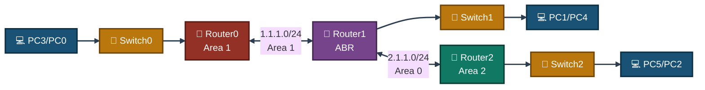
<p align="center"><em>Router1 is the only router with interfaces in two areas, making it the ABR that stitches Area 1 and Area 2 together through the Area 0 backbone.</em></p>

---

<a id="ospf-area-design"></a>
## 🌐 OSPF Area Design

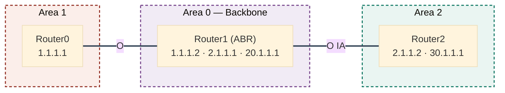
<p align="center"><em>Router1's own LAN (20.1.1.0/24) was placed in Area 0 since it sits on the ABR itself — every route that crosses an area boundary shows up as O IA rather than plain O.</em></p>

---

<a id="ip-addressing-plan"></a>
## 🗂️ IP Addressing Plan

| Device | Interface | IP Address | Area |
|--------|-----------|------------|------|
| Router0 | Gig0/0 (to Router1) | 1.1.1.1/24 | 1 |
| Router0 | Gig0/1 (to Switch0) | 10.1.1.1/24 | 1 |
| Router1 | Gig0/0 (to Router0) | 1.1.1.2/24 | 1 |
| Router1 | Gig0/1 (to Router2) | 2.1.1.1/24 | 0 |
| Router1 | Gig0/2 (to Switch1) | 20.1.1.1/24 | 0 |
| Router2 | Gig0/2 (to Router1) | 2.1.1.2/24 | 0 |
| Router2 | Gig0/1 (to Switch2) | 30.1.1.1/24 | 2 |

**Router1 is the ABR** — it is the only router with interfaces in two different areas (Area 1 and Area 0). Router0 sits entirely in Area 1. Router2 sits entirely in Area 2, connected to the backbone via Area 0.

---

<a id="pc-ip-configuration"></a>
## 💻 PC IP Configuration

| PC | IP Address | Subnet Mask | Default Gateway |
|----|------------|--------------|------------------|
| PC3 | 10.1.1.2 | 255.255.255.0 | 10.1.1.1 |
| PC0 | 10.1.1.3 | 255.255.255.0 | 10.1.1.1 |
| PC1 | 20.1.1.2 | 255.255.255.0 | 20.1.1.1 |
| PC4 | 20.1.1.3 | 255.255.255.0 | 20.1.1.1 |
| PC5 | 30.1.1.2 | 255.255.255.0 | 30.1.1.1 |
| PC2 | 30.1.1.3 | 255.255.255.0 | 30.1.1.1 |

---

<a id="module-1"></a>
## 🏗️ Module 1 — Build the Topology

**Objective:** Wire 3 routers, 3 switches and 6 PCs exactly per the Environment tables.

### Step 1 — Build Topology ✅

3 routers, 3 switches, 6 PCs wired and arranged per the connections table above. No CLI commands in this step — this is a physical/logical wiring step done in the Packet Tracer GUI.

<p align="center">
  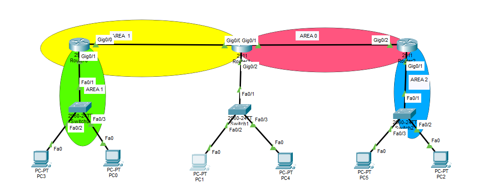<br>
  <em>Exhibit 1 — Full topology: Area 1 and Area 2 each with their own switch and PCs, joined through Router1 and the Area 0 backbone</em>
</p>

---

<a id="module-2"></a>
## ⚙️ Module 2 — Configure Router0 (Area 1)

**Objective:** Address Router0's interfaces and advertise both of its networks into Area 1.

### Step 2 — Configure Router0 (Area 1) ✅

```
interface GigabitEthernet0/0
ip address 1.1.1.1 255.255.255.0
no shutdown
exit
interface GigabitEthernet0/1
ip address 10.1.1.1 255.255.255.0
no shutdown
exit
router ospf 1
network 1.1.1.0 0.0.0.255 area 1
network 10.1.1.0 0.0.0.255 area 1
```

<p align="center">
  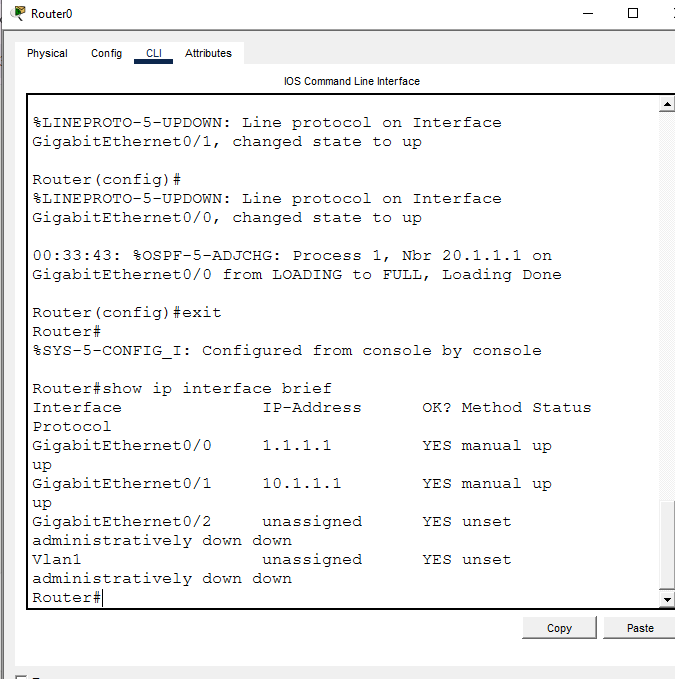<br>
  <em>Exhibit 2 — Router0's link to Router1 and its LAN interface addressed and brought up</em>
</p>
<p align="center">
  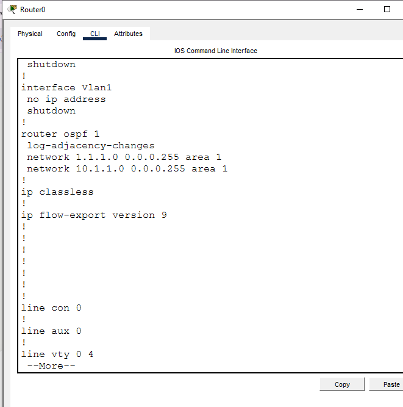<br>
  <em>Exhibit 3 — Both Router0 networks advertised into Area 1</em>
</p>

---

<a id="module-3"></a>
## 🌉 Module 3 — Configure Router1 (ABR)

**Objective:** Address all three of Router1's interfaces and split its OSPF advertisements correctly between Area 1 and Area 0.

### Step 3 — Configure Router1 (ABR — Area 1 and Area 0) ✅

```
interface GigabitEthernet0/0
ip address 1.1.1.2 255.255.255.0
no shutdown
exit
interface GigabitEthernet0/1
ip address 2.1.1.1 255.255.255.0
no shutdown
exit
interface GigabitEthernet0/2
ip address 20.1.1.1 255.255.255.0
no shutdown
exit
router ospf 1
network 1.1.1.0 0.0.0.255 area 1
network 2.1.1.0 0.0.0.255 area 0
network 20.1.1.0 0.0.0.255 area 0
```

<p align="center">
  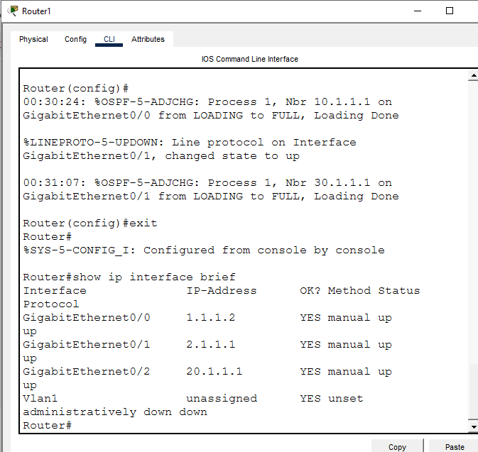<br>
  <em>Exhibit 4 — Router1's three interfaces addressed: one facing Area 1, two facing Area 0</em>
</p>
<p align="center">
  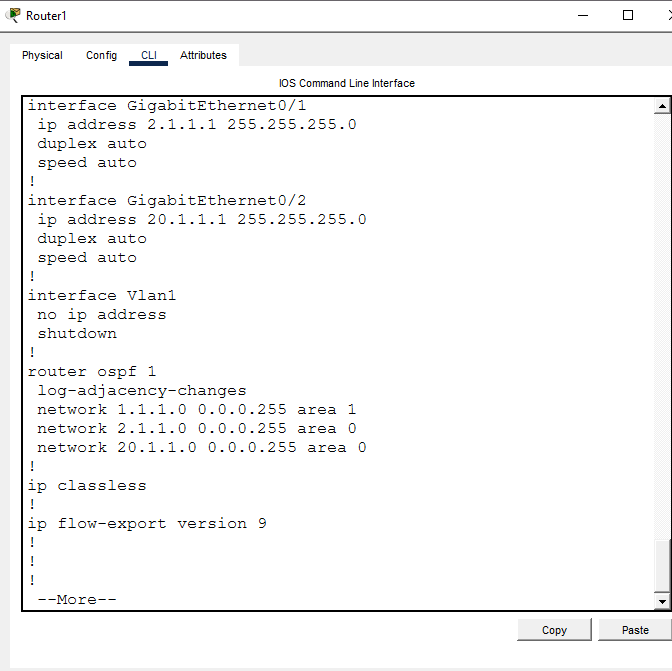<br>
  <em>Exhibit 5 — Router1's Area 1 link and its two Area 0 networks advertised correctly on the ABR</em>
</p>

---

<a id="module-4"></a>
## 🌐 Module 4 — Configure Router2 (Area 0 & Area 2)

**Objective:** Address Router2's interfaces and advertise its backbone link into Area 0 and its LAN into Area 2.

### Step 4 — Configure Router2 (Area 0 and Area 2) ✅

```
interface GigabitEthernet0/2
ip address 2.1.1.2 255.255.255.0
no shutdown
exit
interface GigabitEthernet0/1
ip address 30.1.1.1 255.255.255.0
no shutdown
exit
router ospf 1
network 2.1.1.0 0.0.0.255 area 0
network 30.1.1.0 0.0.0.255 area 2
```

<p align="center">
  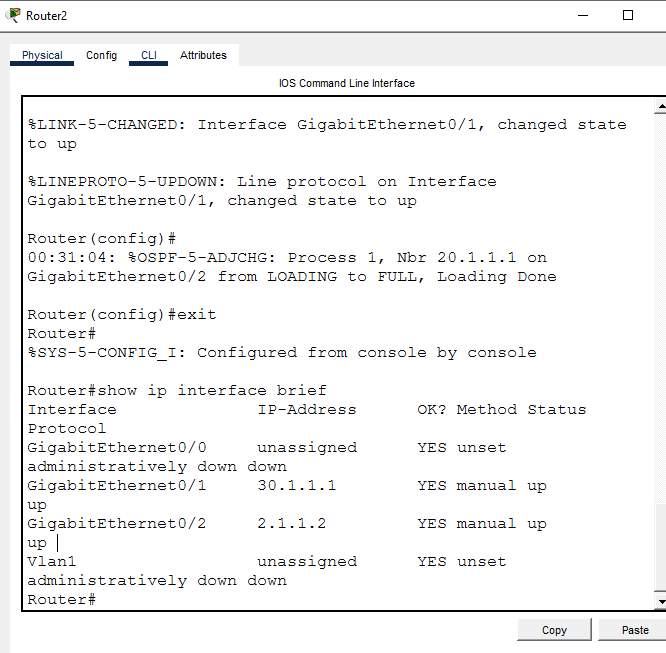<br>
  <em>Exhibit 6 — Router2's backbone link and LAN interface addressed and brought up</em>
</p>
<p align="center">
  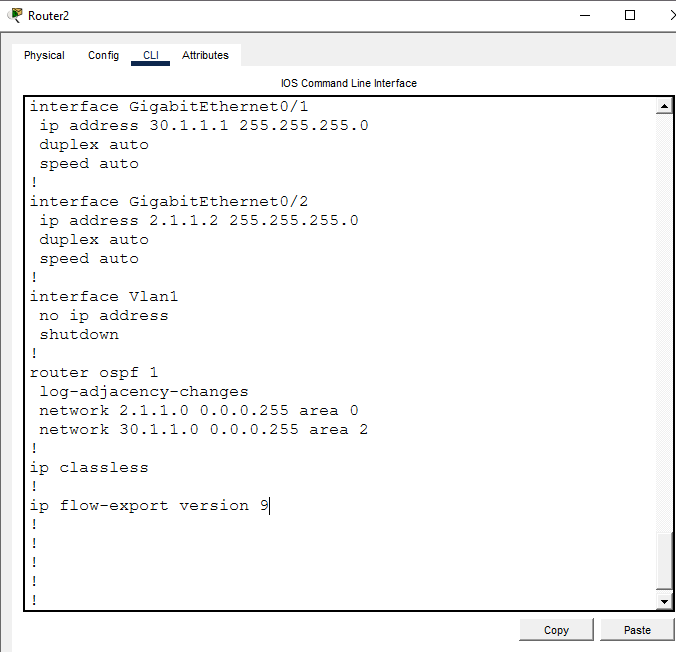<br>
  <em>Exhibit 7 — Router2's backbone network advertised into Area 0, its LAN into Area 2</em>
</p>

---

<a id="module-5"></a>
## 🔗 Module 5 — OSPF Neighbor Verification

**Objective:** Confirm every router has formed FULL OSPF adjacency across all three area boundaries.

### Step 5 — Verify OSPF Neighbor Adjacency ✅

```
show ip ospf neighbor
```

**Router0:**
```
Neighbor ID     Pri   State      Address     Interface
20.1.1.1        1     FULL/DR    1.1.1.2     GigabitEthernet0/0
```

<p align="center">
  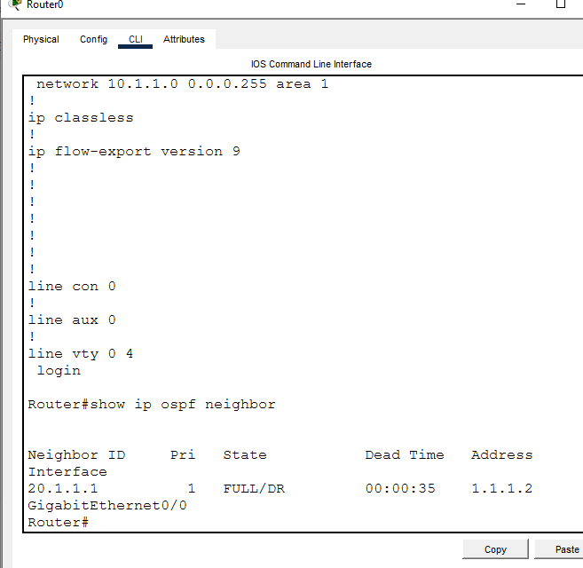<br>
  <em>Exhibit 8 — Router0 shows FULL adjacency with Router1</em>
</p>

**Router1:**
```
Neighbor ID     Pri   State        Address       Interface
10.1.1.1        1     FULL/BDR     1.1.1.1       GigabitEthernet0/0
30.1.1.1        1     FULL/DR      2.1.1.2       GigabitEthernet0/1
```

<p align="center">
  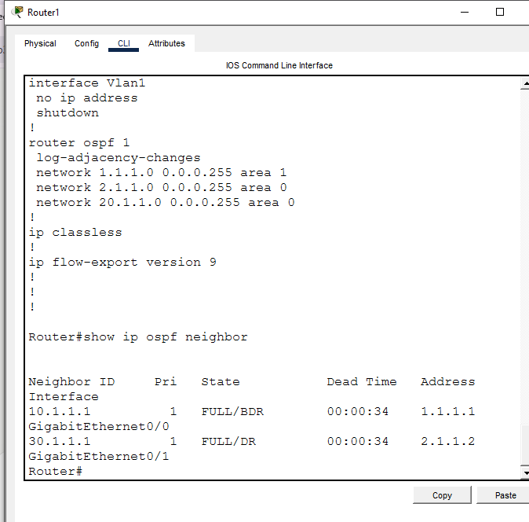<br>
  <em>Exhibit 9 — Router1 shows FULL adjacency with both Router0 and Router2</em>
</p>

**Router2:**
```
Neighbor ID     Pri   State        Address       Interface
20.1.1.1        1     FULL/BDR     2.1.1.1       GigabitEthernet0/2
```

<p align="center">
  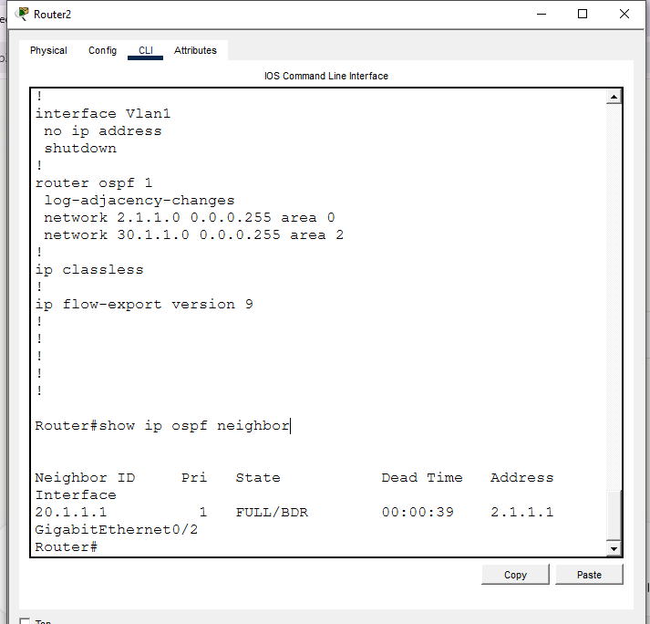<br>
  <em>Exhibit 10 — Router2 shows FULL adjacency with Router1</em>
</p>

All three routers show **FULL** state — confirms OSPF adjacency formed correctly across all links, not just Hello packets being exchanged.

---

<a id="module-6"></a>
## 📋 Module 6 — Route Table Verification

**Objective:** Confirm each router's routing table tags routes `O` or `O IA` exactly where the area design says it should.

### Step 6 — Verify Route Tables (Inter-Area Routes) ✅

```
show ip route
```

**Router0** — learns Area 0 and Area 2 networks as inter-area (`O IA`):
```
O IA  2.1.1.0/24   [110/2] via 1.1.1.2
O IA  20.1.1.0/24  [110/2] via 1.1.1.2
O IA  30.1.1.0/24  [110/3] via 1.1.1.2
```

<p align="center">
  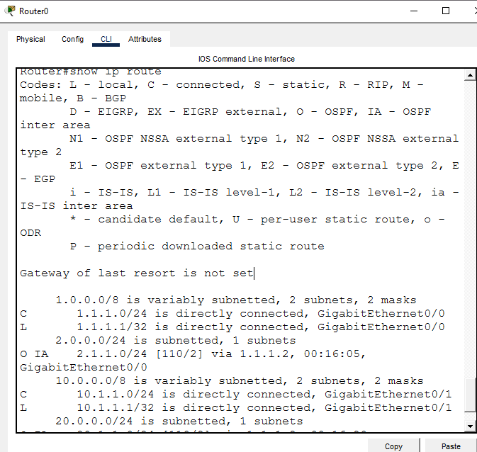<br>
  <em>Exhibit 11 — Router0's routing table showing every non-Area-1 route tagged O IA</em>
</p>

**Router1 (ABR)** — same-area route to Router0's LAN shows as plain `O`; the Area 2 route shows as `O IA`:
```
O     10.1.1.0/24  [110/2] via 1.1.1.1
O IA  30.1.1.0/24  [110/2] via 2.1.1.2
```

<p align="center">
  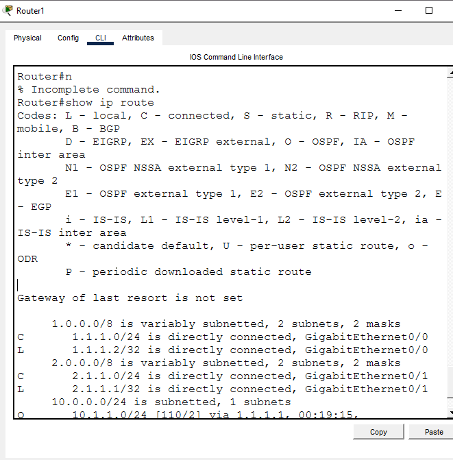<br>
  <em>Exhibit 12 — Router1's routing table distinguishing its own-area route from the inter-area one</em>
</p>

**Router2** — learns Area 1 and Router1's LAN as inter-area:
```
O IA  1.1.1.0/24   [110/2] via 2.1.1.1
O IA  10.1.1.0/24  [110/3] via 2.1.1.1
O     20.1.1.0/24  [110/2] via 2.1.1.1
```

<p align="center">
  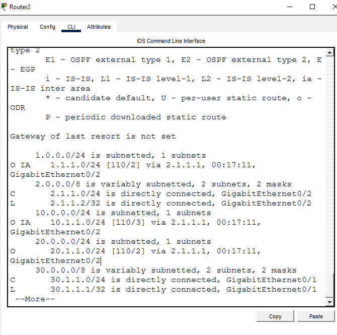<br>
  <em>Exhibit 13 — Router2's routing table showing the same O vs O IA split, mirrored from the other side of the backbone</em>
</p>

The mix of plain `O` (same-area) and `O IA` (inter-area) tags across the three tables confirms the area boundaries are working exactly as designed — not just that routes exist, but that OSPF is correctly distinguishing intra-area vs inter-area paths.

---

<a id="module-7"></a>
## 💻 Module 7 — PC IP Configuration

**Objective:** Assign static IPs to all six PCs per the PC IP Configuration table.

### Step 7 — PC IP Configuration ✅

Each PC addressed manually via Desktop → IP Configuration in Packet Tracer GUI — no CLI commands in this step.

<p align="center">
  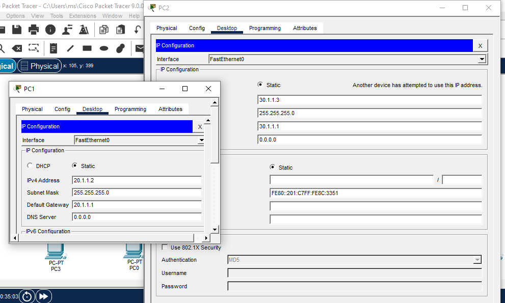<br>
  <em>Exhibit 14 — All six PCs addressed per the PC IP Configuration table</em>
</p>

---

<a id="module-8"></a>
## ✅ Module 8 — Cross-Area Connectivity Test

**Objective:** Ping from a PC in Area 1 to a PC in Area 2, proving traffic actually crosses through the ABR and the backbone.

### Step 8 — Cross-Area Ping Test ✅

```
PC0> ping 30.1.1.3
```

PC0 (Area 1) successfully reaches PC2 (Area 2) — full round trip through Router0 → Router1 (ABR) → Router2:
```
Packets: Sent = 4, Received = 4, Lost = 0 (0% loss)
Packets: Sent = 4, Received = 4, Lost = 0 (0% loss)
```

<p align="center">
  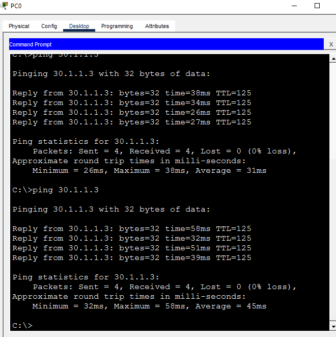<br>
  <em>Exhibit 15 — PC0 in Area 1 successfully pings PC2 in Area 2 across the full multi-area path</em>
</p>

---

<a id="coverage-snapshot"></a>
## 🌟 Coverage Snapshot

| 🛡️ Layer | ✅ Status | 📌 Detail |
|---|---|---|
| Topology | Live | 3 routers, 3 switches, 6 PCs wired across 3 areas (Exhibit 1) |
| Router0 (Area 1) | Live | Interfaces addressed, both networks advertised into Area 1 (Exhibits 2–3) |
| Router1 (ABR) | Live | Three interfaces addressed, correctly split between Area 1 and Area 0 (Exhibits 4–5) |
| Router2 (Area 0/2) | Live | Interfaces addressed, backbone link and LAN advertised correctly (Exhibits 6–7) |
| Neighbor adjacency | Proven | FULL state confirmed on all three routers (Exhibits 8–10) |
| Inter-area routing | Proven | Every router shows the correct O vs O IA tagging (Exhibits 11–13) |
| PC provisioning | Live | All six PCs addressed (Exhibit 14) |
| Cross-area reachability | Proven | PC0 (Area 1) to PC2 (Area 2) ping succeeds 4/4 (Exhibit 15) |

---

<a id="command-summary"></a>
## 📟 Command Summary

| Command | Purpose |
|---------|---------|
| `router ospf 1` | Start OSPF process |
| `network <net> <wildcard> area <id>` | Assign network to OSPF area |
| `show ip ospf neighbor` | Verify adjacency state |
| `show ip route` | Verify route propagation and area tags (O / O IA) |
| `show ip interface brief` | Verify interface IPs and up/up status |
| `ping` | End-to-end connectivity test |

---

<a id="challenges-fixes"></a>
## ⚠️ Challenges & Fixes

| ❌ Challenge | ✅ Solution |
|---|---|
| Original topology diagram left Router1's downlink network ambiguous between Area 1 and Area 0 | Decided explicitly: since Router1 is the ABR, its own LAN (20.1.1.0/24) was assigned to Area 0 (backbone) rather than left undefined |
| Initial OSPF config attempt failed with a syntax error | Cause was using `gig0/0` as an interface abbreviation, which Packet Tracer's IOS doesn't accept — fixed by using the full `GigabitEthernet0/0` name |
| PC2 and PC5 were accidentally assigned the same IP address (30.1.1.3), triggering an IP conflict warning | Identified via the conflict warning on PC2's IP Configuration screen, corrected by reassigning PC5 to 30.1.1.2 to match the original addressing plan |

---

<a id="scope-limitations"></a>
## 🚧 Scope & Limitations

- **Simulation only:** Built and verified in Cisco Packet Tracer, not on physical hardware.
- **Single ABR, no redundancy:** Router1 is the only path between Area 1/Area 2 and the backbone — no second ABR or parallel path was built.
- **No area summarization:** Each area's routes propagate individually; no `area range` summarization was configured on the ABR.
- **No authentication:** OSPF adjacencies were formed without MD5 or SHA authentication between neighbors.
- **Three areas only:** The design demonstrates the ABR concept with the minimum viable area count; it doesn't cover totally stubby areas, NSSAs, or virtual links.

These limits are stated so the lab is read as a multi-area OSPF fundamentals exercise, not a production backbone design.

---

<a id="what-i-learned"></a>
## 🧠 What I Learned

- **An ABR's own directly connected networks still need an area assignment.** Router1's LAN wasn't automatically "in between" Area 1 and Area 2 — it had to be explicitly placed in Area 0, which is what let its route show up as `O` on Router1 itself and `O IA` everywhere else.
- **`O` vs `O IA` is the real proof of correct area design, not just a route existing.** A route table full of entries doesn't confirm anything about area boundaries by itself — the tag next to each entry does.
- **A successful ping is necessary but not sufficient.** Order of verification mattered: `show ip ospf neighbor` (FULL state) first, then `show ip route` (correct O/IA tagging), and only then the ping — each step rules out a different failure mode.
- **Packet Tracer's IOS wants full interface names.** `gig0/0` failed outright; `GigabitEthernet0/0` didn't — a small syntax detail that cost real debugging time.

---

<a id="skills-demonstrated"></a>
## 🛠️ Skills Demonstrated

- Designing a multi-area OSPF network with a single Area Border Router
- Deciding which area an ABR's own directly connected networks belong to
- Advertising networks into different OSPF areas from the same router
- Verifying FULL neighbor adjacency across multiple area boundaries
- Reading and interpreting `O` vs `O IA` route tags to confirm correct inter-area behavior
- Diagnosing an IOS interface-naming syntax error and an IP address conflict between PCs
- Validating a multi-area design with a full cross-area ping test

---

<a id="screenshot-index"></a>
## 🖼️ Screenshot Index

| # | File | Shows |
|:---:|---|---|
| 1 | `01-topology-OSPF.PNG` | Full topology after wiring |
| 2 | `02-router0-interface-config.PNG` | Router0 interface addressing |
| 3 | `03-router0-ospf-config.PNG` | Router0 networks advertised into Area 1 |
| 4 | `04-router1-interface-config.PNG` | Router1 (ABR) interface addressing |
| 5 | `05-router1-ospf-config.PNG` | Router1 networks split between Area 1 and Area 0 |
| 6 | `06-router2-interface-config.PNG` | Router2 interface addressing |
| 7 | `07-router2-ospf-config.PNG` | Router2 networks advertised into Area 0 and Area 2 |
| 8 | `08-router0-ospf-neighbor.PNG` | Router0 FULL adjacency with Router1 |
| 9 | `09-router1-ospf-neighbor.PNG` | Router1 FULL adjacency with Router0 and Router2 |
| 10 | `10-router2-ospf-neighbor.PNG` | Router2 FULL adjacency with Router1 |
| 11 | `11-router0-route-table.PNG` | Router0 routing table with O IA tags |
| 12 | `12-router1-route-table.PNG` | Router1 routing table with O and O IA tags |
| 13 | `13-router2-route-table.PNG` | Router2 routing table with O IA and O tags |
| 14 | `14-pc-ip-config.PNG` | All six PCs addressed |
| 15 | `15-ping-area1-to-area2.PNG` | PC0 → PC2 cross-area ping success |

---

<a id="repo-structure"></a>
## 📁 Repo Structure

```text
07-multi-area-ospf-routing/
|-- README.md
|-- multi-area-ospf-lab.pkt
`-- screenshots/
    |-- 01-topology-OSPF.PNG
    |-- 02-router0-interface-config.PNG
    |-- 03-router0-ospf-config.PNG
    |-- 04-router1-interface-config.PNG
    |-- 05-router1-ospf-config.PNG
    |-- 06-router2-interface-config.PNG
    |-- 07-router2-ospf-config.PNG
    |-- 08-router0-ospf-neighbor.PNG
    |-- 09-router1-ospf-neighbor.PNG
    |-- 10-router2-ospf-neighbor.PNG
    |-- 11-router0-route-table.PNG
    |-- 12-router1-route-table.PNG
    |-- 13-router2-route-table.PNG
    |-- 14-pc-ip-config.PNG
    `-- 15-ping-area1-to-area2.PNG
```

<div align="center">

🌐 **[OSPF Multi-Area Design Guide](https://www.cisco.com/c/en/us/support/docs/ip/open-shortest-path-first-ospf/7039-1.html)** · 🌉 **[Understanding ABR Behavior](https://www.cisco.com/c/en/us/support/docs/ip/open-shortest-path-first-ospf/13703-8.html)** · 🔗 **[OSPF Neighbor States Explained](https://www.cisco.com/c/en/us/support/docs/ip/open-shortest-path-first-ospf/13685-13.html)**

</div>
