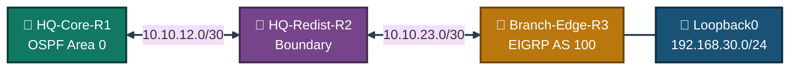
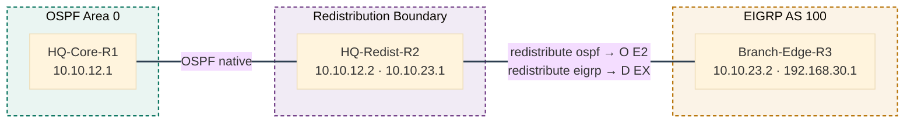
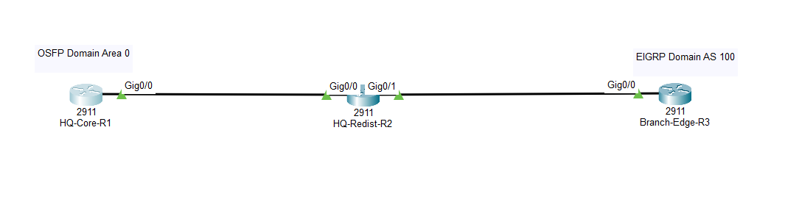
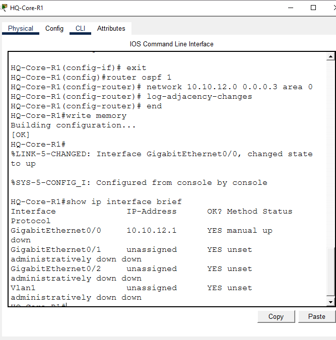
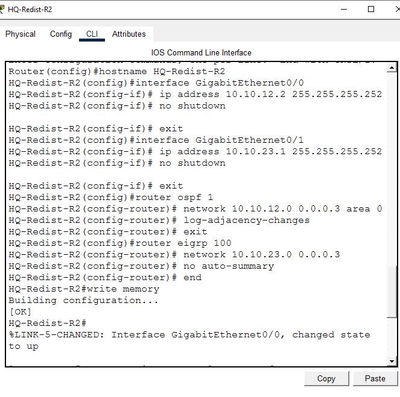
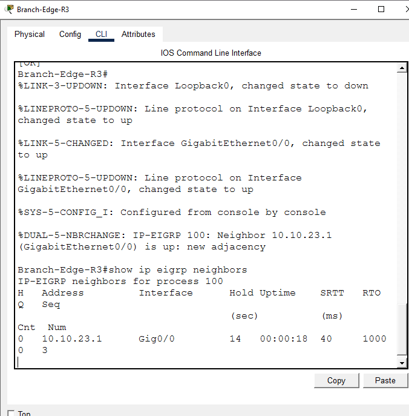
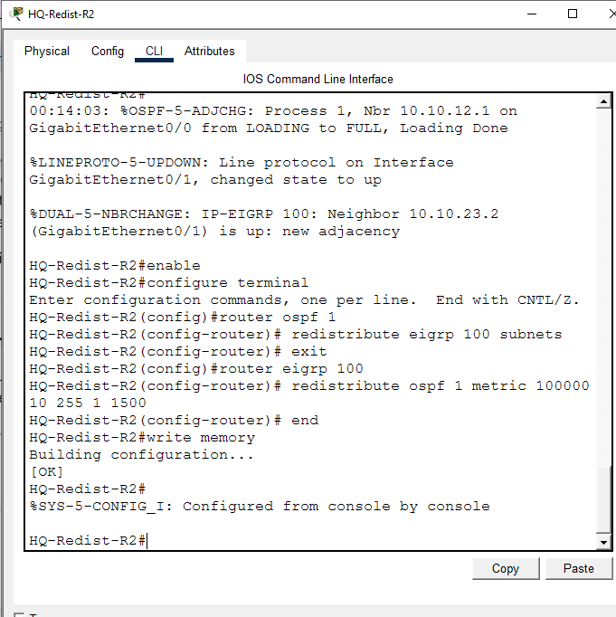
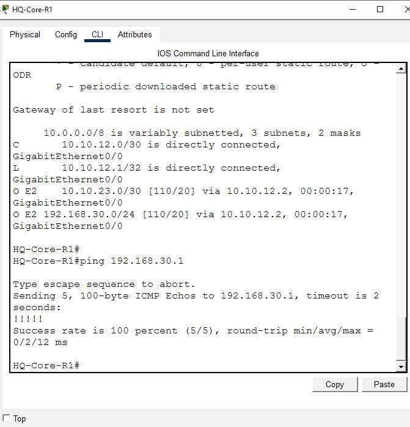

<div align="center">

# 🔁 OSPF ↔ EIGRP Route Redistribution

**Lab 08 — Cisco Networking Lab Portfolio**

Two-Domain Redistribution: OSPF Core, EIGRP Branch, a Single Boundary Router, and Verified Two-Way Route Injection (Cisco Packet Tracer)


A three-router topology bridging two entirely different routing protocols — an OSPF core and an EIGRP branch — through one router configured to run both processes and translate between them. Verification goes past a simple ping: the routing table on the far OSPF-only router is read closely enough to confirm EIGRP-originated routes are landing correctly tagged as `O E2`, proving the redistribution is real and not just adjacency.

</div>

---

## 📑 Table of Contents

1. [At a Glance](#at-a-glance)
2. [Project Background](#project-background)
3. [Tools & Technologies](#tools-technologies)
4. [Environment](#environment)
5. [Topology](#topology)
6. [Redistribution Boundary Design](#redistribution-boundary-design)
7. [IP Addressing Plan](#ip-addressing-plan)
8. [Module 1 — Build the Topology](#module-1)
9. [Module 2 — Configure HQ-Core-R1 (OSPF)](#module-2)
10. [Module 3 — Configure HQ-Redist-R2 (OSPF + EIGRP)](#module-3)
11. [Module 4 — Configure Branch-Edge-R3 (EIGRP)](#module-4)
12. [Module 5 — Two-Way Redistribution](#module-5)
13. [Module 6 — Route Table & Cross-Domain Ping Verification](#module-6)
14. [Coverage Snapshot](#coverage-snapshot)
15. [Command Summary](#command-summary)
16. [Challenges & Fixes](#challenges-fixes)
17. [Scope & Limitations](#scope-limitations)
18. [What I Learned](#what-i-learned)
19. [Skills Demonstrated](#skills-demonstrated)
20. [Screenshot Index](#screenshot-index)
21. [Repo Structure](#repo-structure)

---

<a id="at-a-glance"></a>
## 📊 At a Glance

<div align="center">

| 🌐 Domains | 🚪 Routers | 🔀 Boundary Router | 🔁 Redistribution | 🖼️ Screenshots |
|:---:|:---:|:---:|:---:|:---:|
| **2 (OSPF, EIGRP)** | **3** | **1 (HQ-Redist-R2)** | **2-way** | **6** |

</div>

---

<a id="project-background"></a>
## 📖 Project Background

This lab moves past running a single routing protocol into making two different ones talk to each other: HQ-Core-R1 sits entirely in OSPF Area 0, Branch-Edge-R3 sits entirely in EIGRP AS 100, and HQ-Redist-R2 runs both processes and redistributes between them. Verification is deliberately stricter than a ping test — the routing table on the far OSPF-only router is read closely enough to confirm EIGRP routes are tagged `O E2` exactly where the redistribution config says they should be.

| Module | Focus |
|---|---|
| 🏗️ **Module 1 — Build the Topology** | Wire 3 routers in a line: core, boundary, branch |
| ⚙️ **Module 2 — Configure HQ-Core-R1** | Address interface and advertise into OSPF Area 0 |
| 🌉 **Module 3 — Configure HQ-Redist-R2** | Address both interfaces, run OSPF and EIGRP simultaneously |
| 🌐 **Module 4 — Configure Branch-Edge-R3** | Address interface and loopback, advertise into EIGRP |
| 🔁 **Module 5 — Two-Way Redistribution** | Inject EIGRP routes into OSPF and OSPF routes into EIGRP on the boundary |
| 📋 **Module 6 — Verification** | Confirm `O E2` tagging and a successful cross-domain ping |

> [!NOTE]
> This is a Packet Tracer simulation, not physical hardware. Branch-Edge-R3's loopback (192.168.30.0/24) simulates a branch-office LAN so the redistributed route has somewhere real to point.

---

<a id="tools-technologies"></a>
## 🛠️ Tools & Technologies

| Tool | Purpose |
|------|---------|
| 🖥️ Cisco Packet Tracer | Network simulation |
| 🚪 Router 2911 x3 | HQ-Core-R1 (OSPF), HQ-Redist-R2 (boundary), Branch-Edge-R3 (EIGRP) |
| 🌐 OSPF Area 0 | Link-state routing on the core side |
| 🔁 EIGRP AS 100 | Distance-vector routing on the branch side |
| 🔀 Route Redistribution | Two-way translation between the two protocols at the boundary |

---

<a id="environment"></a>
## 🖧 Environment


**Devices:** 3 Routers (2911: HQ-Core-R1, HQ-Redist-R2, Branch-Edge-R3) · 1 simulated branch LAN (loopback)

**Connections**

| From | To | Port/Link |
|------|----|-----------|
| HQ-Core-R1 | HQ-Redist-R2 | Gig0/0 ↔ Gig0/0 |
| HQ-Redist-R2 | Branch-Edge-R3 | Gig0/1 ↔ Gig0/0 |
| Branch-Edge-R3 | Loopback0 (simulated LAN) | — |

---

<a id="topology"></a>
## 🗺️ Topology


<p align="center"><em>HQ-Redist-R2 is the only router running both protocols, making it the boundary router that translates routes between the OSPF core and the EIGRP branch.</em></p>

---

<a id="redistribution-boundary-design"></a>
## 🔁 Redistribution Boundary Design


<p align="center"><em>Routes crossing the boundary get re-tagged by protocol: EIGRP routes show up on the OSPF side as O E2, and OSPF routes show up on the EIGRP side as D EX.</em></p>

---

<a id="ip-addressing-plan"></a>
## 🗂️ IP Addressing Plan

| Link | Subnet | Device | IP |
|------|--------|--------|-----|
| HQ-Core-R1 ↔ HQ-Redist-R2 | 10.10.12.0/30 | HQ-Core-R1 G0/0 | 10.10.12.1 |
| | | HQ-Redist-R2 G0/0 | 10.10.12.2 |
| HQ-Redist-R2 ↔ Branch-Edge-R3 | 10.10.23.0/30 | HQ-Redist-R2 G0/1 | 10.10.23.1 |
| | | Branch-Edge-R3 G0/0 | 10.10.23.2 |
| Branch-Edge-R3 Loopback0 (simulated LAN) | 192.168.30.0/24 | Branch-Edge-R3 Lo0 | 192.168.30.1 |

**Routing Plan**

| Router | Protocol | Networks Advertised |
|--------|----------|----------------------|
| HQ-Core-R1 | OSPF 1, Area 0 | 10.10.12.0/30 |
| HQ-Redist-R2 | OSPF 1, Area 0 | 10.10.12.0/30 |
| HQ-Redist-R2 | EIGRP 100 | 10.10.23.0/30 |
| Branch-Edge-R3 | EIGRP 100 | 10.10.23.0/30, 192.168.30.0/24 |

**HQ-Redist-R2 is the boundary router** — it is the only router running both OSPF and EIGRP. HQ-Core-R1 sits entirely in the OSPF core. Branch-Edge-R3 sits entirely in the EIGRP branch, with a loopback simulating its own LAN.

---

<a id="module-1"></a>
## 🏗️ Module 1 — Build the Topology

**Objective:** Wire 3 routers in a line — HQ-Core-R1 — HQ-Redist-R2 — Branch-Edge-R3.

### Step 1 — Build Topology ✅

3 routers deployed and wired per the connections table above. No CLI commands in this step — this is a physical/logical wiring step done in the Packet Tracer GUI.

<p align="center">
  <br>
  <em>Exhibit 1 — Full topology: OSPF core, boundary router, and EIGRP branch wired in a line</em>
</p>

---

<a id="module-2"></a>
## ⚙️ Module 2 — Configure HQ-Core-R1 (OSPF)

**Objective:** Address HQ-Core-R1's interface and advertise its network into OSPF Area 0.

### Step 2 — Configure HQ-Core-R1 ✅

```
Router(config)# hostname HQ-Core-R1
HQ-Core-R1(config)# interface GigabitEthernet0/0
HQ-Core-R1(config-if)# description LINK_TO_HQ-REDIST-R2
HQ-Core-R1(config-if)# ip address 10.10.12.1 255.255.255.252
HQ-Core-R1(config-if)# no shutdown
HQ-Core-R1(config-if)# exit
HQ-Core-R1(config)# router ospf 1
HQ-Core-R1(config-router)# router-id 1.1.1.1
HQ-Core-R1(config-router)# network 10.10.12.0 0.0.0.3 area 0
HQ-Core-R1(config-router)# log-adjacency-changes
HQ-Core-R1(config-router)# end
HQ-Core-R1# write memory
```

> At this point, `show ip interface brief` shows G0/0's line protocol as **down** — expected, since HQ-Redist-R2 wasn't configured yet, so there was no neighbor to bring the link up with.

<p align="center">
  <br>
  <em>Exhibit 2 — HQ-Core-R1's interface addressed and its network advertised into Area 0</em>
</p>

---

<a id="module-3"></a>
## 🌉 Module 3 — Configure HQ-Redist-R2 (OSPF + EIGRP)

**Objective:** Address both of HQ-Redist-R2's interfaces and bring up OSPF on one side, EIGRP on the other.

### Step 3 — Configure HQ-Redist-R2 (Dual Interfaces + Both Protocols) ✅

```
Router(config)# hostname HQ-Redist-R2
HQ-Redist-R2(config)# interface GigabitEthernet0/0
HQ-Redist-R2(config-if)# description LINK_TO_HQ-CORE-R1
HQ-Redist-R2(config-if)# ip address 10.10.12.2 255.255.255.252
HQ-Redist-R2(config-if)# no shutdown
HQ-Redist-R2(config-if)# exit
HQ-Redist-R2(config)# interface GigabitEthernet0/1
HQ-Redist-R2(config-if)# description LINK_TO_BRANCH-EDGE-R3
HQ-Redist-R2(config-if)# ip address 10.10.23.1 255.255.255.252
HQ-Redist-R2(config-if)# no shutdown
HQ-Redist-R2(config-if)# exit
HQ-Redist-R2(config)# router ospf 1
HQ-Redist-R2(config-router)# router-id 2.2.2.2
HQ-Redist-R2(config-router)# network 10.10.12.0 0.0.0.3 area 0
HQ-Redist-R2(config-router)# log-adjacency-changes
HQ-Redist-R2(config-router)# exit
HQ-Redist-R2(config)# router eigrp 100
HQ-Redist-R2(config-router)# network 10.10.23.0 0.0.0.3
HQ-Redist-R2(config-router)# no auto-summary
HQ-Redist-R2(config-router)# end
HQ-Redist-R2# write memory
```

<p align="center">
  <br>
  <em>Exhibit 3 — HQ-Redist-R2's two interfaces addressed, running OSPF toward the core and EIGRP toward the branch</em>
</p>

---

<a id="module-4"></a>
## 🌐 Module 4 — Configure Branch-Edge-R3 (EIGRP)

**Objective:** Build the simulated branch LAN on a loopback, address the physical interface, and advertise both into EIGRP.

### Step 4 — Configure Branch-Edge-R3 (Loopback + Interface + EIGRP) ✅

```
Router(config)# hostname Branch-Edge-R3
Branch-Edge-R3(config)# interface Loopback0
Branch-Edge-R3(config-if)# description SIMULATED_BRANCH_OFFICE_LAN
Branch-Edge-R3(config-if)# ip address 192.168.30.1 255.255.255.0
Branch-Edge-R3(config-if)# exit
Branch-Edge-R3(config)# interface GigabitEthernet0/0
Branch-Edge-R3(config-if)# description LINK_TO_HQ-REDIST-R2
Branch-Edge-R3(config-if)# ip address 10.10.23.2 255.255.255.252
Branch-Edge-R3(config-if)# no shutdown
Branch-Edge-R3(config-if)# exit
Branch-Edge-R3(config)# router eigrp 100
Branch-Edge-R3(config-router)# network 10.10.23.0 0.0.0.3
Branch-Edge-R3(config-router)# network 192.168.30.0 0.0.0.255
Branch-Edge-R3(config-router)# no auto-summary
Branch-Edge-R3(config-router)# end
Branch-Edge-R3# write memory
```

EIGRP adjacency comes up immediately after, confirmed via:
```
Branch-Edge-R3# show ip eigrp neighbors
```

<p align="center">
  <br>
  <em>Exhibit 4 — Branch-Edge-R3's loopback and physical interface addressed, both advertised into EIGRP</em>
</p>

---

<a id="module-5"></a>
## 🔁 Module 5 — Two-Way Redistribution

**Objective:** On HQ-Redist-R2, inject EIGRP routes into OSPF and OSPF routes into EIGRP so each domain learns the other's networks.

### Step 5 — Two-Way Redistribution on HQ-Redist-R2 (the Boundary Router) ✅

```
HQ-Redist-R2(config)# router ospf 1
HQ-Redist-R2(config-router)# redistribute eigrp 100 subnets
HQ-Redist-R2(config-router)# exit
HQ-Redist-R2(config)# router eigrp 100
HQ-Redist-R2(config-router)# redistribute ospf 1 metric 100000 10 255 1 1500
HQ-Redist-R2(config-router)# end
HQ-Redist-R2# write memory
```

> The `subnets` keyword on the OSPF side is required — without it, only classful network-level routes get redistributed, and the actual subnets (like `10.10.23.0/30`) would be silently dropped.
>
> The EIGRP-side metric (`100000 10 255 1 1500` = bandwidth, delay, reliability, load, MTU) has to be manually seeded because OSPF routes don't carry an EIGRP-compatible metric on their own.

<p align="center">
  <br>
  <em>Exhibit 5 — Two-way redistribution configured on HQ-Redist-R2, both directions</em>
</p>

---

<a id="module-6"></a>
## 📋 Module 6 — Route Table & Cross-Domain Ping Verification

**Objective:** Confirm the far OSPF-only router learns EIGRP routes tagged `O E2`, then prove the path is actually usable with an end-to-end ping into the EIGRP branch.

### Step 6 — Verify: Routing Table + End-to-End Ping ✅

On HQ-Core-R1 (the far OSPF-only router):
```
HQ-Core-R1# show ip route
HQ-Core-R1# ping 192.168.30.1
```

Routing table shows the EIGRP-originated routes injected into OSPF as `O E2`:
```
O E2    10.10.23.0/30 [110/20] via 10.10.12.2
O E2    192.168.30.0/24 [110/20] via 10.10.12.2
```

Ping to Branch-Edge-R3's loopback (192.168.30.1) — **100% success (5/5)**, confirming the route is not just present in the table but actually usable end-to-end across both domains.

<p align="center">
  <br>
  <em>Exhibit 6 — HQ-Core-R1's routing table showing O E2 tags and a successful ping into the EIGRP branch</em>
</p>

---

<a id="coverage-snapshot"></a>
## 🌟 Coverage Snapshot

| 🛡️ Layer | ✅ Status | 📌 Detail |
|---|---|---|
| Topology | Live | 3 routers wired in a line across two domains (Exhibit 1) |
| HQ-Core-R1 (OSPF) | Live | Interface addressed, network advertised into Area 0 (Exhibit 2) |
| HQ-Redist-R2 (Boundary) | Live | Both interfaces addressed, OSPF and EIGRP running simultaneously (Exhibit 3) |
| Branch-Edge-R3 (EIGRP) | Live | Loopback and interface addressed, both advertised into EIGRP (Exhibit 4) |
| Two-way redistribution | Proven | `redistribute` configured on both processes at the boundary (Exhibit 5) |
| Inter-protocol routing | Proven | HQ-Core-R1 shows EIGRP routes correctly tagged O E2 (Exhibit 6) |
| Cross-domain reachability | Proven | HQ-Core-R1 to Branch-Edge-R3 loopback ping succeeds 5/5 (Exhibit 6) |

---

<a id="command-summary"></a>
## 📟 Command Summary

| Command | Purpose |
|---------|---------|
| `router ospf <id>` / `router eigrp <as>` | Start a routing process |
| `network <ip> <wildcard> area <id>` | Advertise a network into OSPF |
| `network <ip> <wildcard>` (EIGRP) | Advertise a network into EIGRP |
| `no auto-summary` | Prevent EIGRP from auto-summarizing at classful boundaries |
| `redistribute eigrp <as> subnets` | Inject EIGRP routes into OSPF (subnets keyword is mandatory for non-classful routes) |
| `redistribute ospf <id> metric <bw> <delay> <rel> <load> <mtu>` | Inject OSPF routes into EIGRP with a manually seeded metric |
| `show ip route` | Confirm redistributed routes appear (look for `O E2` / `D EX`) |
| `show ip ospf neighbor` / `show ip eigrp neighbors` | Confirm adjacencies formed |

---

<a id="challenges-fixes"></a>
## ⚠️ Challenges & Fixes

| ❌ Challenge | ✅ Solution |
|---|---|
| OSPF and EIGRP can't natively exchange routes — they use completely different metric systems | Configured two-way redistribution on the single boundary router (HQ-Redist-R2), seeding a manual metric on the EIGRP side since OSPF routes don't carry one EIGRP understands |
| Risk of subnetted routes being dropped during redistribution | Used the `subnets` keyword on the OSPF redistribution command — without it, only classful-boundary routes would have been passed through, silently dropping `10.10.23.0/30` |

---

<a id="scope-limitations"></a>
## 🚧 Scope & Limitations

- **Simulation only:** Built and verified in Cisco Packet Tracer, not on physical hardware.
- **Single boundary router, no redundancy:** HQ-Redist-R2 is the only path between the OSPF core and the EIGRP branch — no second boundary router or parallel path was built.
- **No route filtering:** Redistribution is done wholesale in both directions; no route-maps or distribute-lists were configured to filter which routes cross the boundary.
- **No mutual-redistribution loop protection:** Since there's only one boundary router, redistribution loops (a concern with two or more boundary routers) weren't a factor here and aren't addressed in this design.
- **Two protocols only:** The design demonstrates the redistribution concept between OSPF and EIGRP; it doesn't cover RIP, BGP, or redistribution with route tagging.

These limits are stated so the lab is read as a route-redistribution fundamentals exercise, not a production multi-boundary design.

---

<a id="what-i-learned"></a>
## 🧠 What I Learned

- **Redistribution isn't automatic in either direction.** Each routing process at the boundary router needs its own explicit `redistribute` command — configuring it under OSPF alone doesn't make EIGRP aware of anything, and vice versa.
- **EIGRP has no way to interpret OSPF's cost, so the metric has to be supplied manually.** The seed metric (bandwidth, delay, reliability, load, MTU) is a deliberate stand-in, not something EIGRP derives from OSPF automatically.
- **The `subnets` keyword matters more than it looks.** Leaving it off doesn't throw an error — it just quietly excludes subnetted routes, which is the kind of mistake that's easy to miss without actually checking the routing table afterward.
- **A route appearing in `show ip route` doesn't fully prove the path works.** The ping test across both domains is what actually confirms end-to-end forwarding, not just that the route entry exists.

---

<a id="skills-demonstrated"></a>
## 🛠️ Skills Demonstrated

- Designing a two-protocol topology with a single redistribution boundary router
- Running OSPF and EIGRP simultaneously on the same router
- Configuring two-way route redistribution between link-state and distance-vector protocols
- Manually seeding an EIGRP metric for routes redistributed from OSPF
- Reading and interpreting `O E2` route tags to confirm correct inter-protocol behavior
- Diagnosing a silent route-drop caused by a missing `subnets` keyword
- Validating a redistribution design with a full cross-domain ping test

---

<a id="screenshot-index"></a>
## 🖼️ Screenshot Index

| # | File | Shows |
|:---:|---|---|
| 1 | `01-topology-final.PNG` | Full topology after wiring |
| 2 | `02-hq-core-r1-config.PNG` | HQ-Core-R1 interface and OSPF config |
| 3 | `03-hq-redist-r2-config.PNG` | HQ-Redist-R2 dual interfaces, OSPF and EIGRP config |
| 4 | `04-branch-edge-r3-config.PNG` | Branch-Edge-R3 loopback, interface, and EIGRP config |
| 5 | `05-redistribution-verification.PNG` | Two-way redistribution configured on HQ-Redist-R2 |
| 6 | `06-verification-pings.PNG` | HQ-Core-R1 routing table (O E2 tags) and successful cross-domain ping |

---

<a id="repo-structure"></a>
## 📁 Repo Structure

```text
08-ospf-eigrp-redistribution/
|-- README.md
|-- Lab5_OSPF_EIGRP_Redistribution.pkt
`-- screenshots/
    |-- 01-topology-final.PNG
    |-- 02-hq-core-r1-config.PNG
    |-- 03-hq-redist-r2-config.PNG
    |-- 04-branch-edge-r3-config.PNG
    |-- 05-redistribution-verification.PNG
    `-- 06-verification-pings.PNG
```

<div align="center">

🔁 **[Route Redistribution Overview](https://www.cisco.com/c/en/us/support/docs/ip/enhanced-interior-gateway-routing-protocol-eigrp/8606-redist.html)** · 🌐 **[OSPF External Route Types Explained](https://www.cisco.com/c/en/us/support/docs/ip/open-shortest-path-first-ospf/7039-1.html)** · 🚪 **[EIGRP Metric Calculation](https://www.cisco.com/c/en/us/support/docs/ip/enhanced-interior-gateway-routing-protocol-eigrp/16406-eigrp-toc.html)**

</div>
