<div align="center">

# 🎭 NAT & PAT Address Translation

**Lab 09 — Cisco Networking Lab Portfolio**

Static NAT, Dynamic NAT, and PAT (Overload) on a Single Gateway Router — Private-to-Public Translation, Verified Independently for Each Mechanism (Cisco Packet Tracer)


A single gateway router (Router1) configured with all three core NAT mechanisms at once — a fixed 1-to-1 mapping for a server, a pool-based 1-to-1 mapping for one PC, and a many-to-1 port-based mapping for another — each translation verified on its own, both by ping and by reading the NAT translation table at the right moment.

</div>

---

## 📑 Table of Contents

1. [At a Glance](#at-a-glance)
2. [Project Background](#project-background)
3. [Tools & Technologies](#tools-technologies)
4. [Environment](#environment)
5. [Topology](#topology)
6. [NAT Translation Design](#nat-translation-design)
7. [IP Addressing Plan](#ip-addressing-plan)
8. [Module 1 — Build the Topology](#module-1)
9. [Module 2 — End Device IP Configuration](#module-2)
10. [Module 3 — Router1 Inside Interface](#module-3)
11. [Module 4 — Router1 Outside Interface](#module-4)
12. [Module 5 — Configure ISP Router](#module-5)
13. [Module 6 — Default Route on Router1](#module-6)
14. [Module 7 — Pre-NAT Test](#module-7)
15. [Module 8 — Static NAT (Server1)](#module-8)
16. [Module 9 — Dynamic NAT (PC1)](#module-9)
17. [Module 10 — PAT / Overload (PC2)](#module-10)
18. [Module 11 — Combined Verification](#module-11)
19. [Module 12 — Final Check & Save](#module-12)
20. [Coverage Snapshot](#coverage-snapshot)
21. [Command Summary](#command-summary)
22. [Challenges & Fixes](#challenges-fixes)
23. [Scope & Limitations](#scope-limitations)
24. [What I Learned](#what-i-learned)
25. [Skills Demonstrated](#skills-demonstrated)
26. [Screenshot Index](#screenshot-index)
27. [Repo Structure](#repo-structure)

---

<a id="at-a-glance"></a>
## 📊 At a Glance

<div align="center">

| 🔀 NAT Mechanisms | 🚪 Routers | 🔀 Switches | 🖥️ Hosts | 🖼️ Screenshots |
|:---:|:---:|:---:|:---:|:---:|
| **3 (Static, Dynamic, PAT)** | **2** | **1** | **4** | **17** |

</div>

---

<a id="project-background"></a>
## 📖 Project Background

This lab configures all three core NAT mechanisms on a single gateway router rather than one at a time in isolation: Server1 gets a fixed Static NAT mapping, PC1 gets a pool-based Dynamic NAT mapping, and PC2 gets a many-to-1 PAT/Overload mapping through the router's own outside interface. Verification is deliberately stricter than a single ping — each mechanism is confirmed both by successful traffic *and* by reading `show ip nat translations` at the right moment, since ICMP-based NAT entries expire quickly.

| Module | Focus |
|---|---|
| 🏗️ **Module 1 — Build the Topology** | Wire Router1, ISP, Switch, and four end devices |
| 💻 **Module 2 — End Device IPs** | Address PC1, PC2, Server1, and Outside-pc |
| ⚙️ **Module 3 — Router1 Inside Interface** | Mark the LAN-facing interface as NAT inside |
| 🌐 **Module 4 — Router1 Outside Interface** | Mark the WAN-facing interface as NAT outside |
| 🛰️ **Module 5 — Configure ISP Router** | Address the router simulating the outside network |
| 🧭 **Module 6 — Default Route** | Point Router1 toward the ISP for all unknown traffic |
| 🚫 **Module 7 — Pre-NAT Test** | Confirm the private LAN is unreachable from outside before NAT exists |
| 🔒 **Module 8 — Static NAT** | Fixed 1-to-1 mapping for Server1 |
| 🎲 **Module 9 — Dynamic NAT** | Pool-based 1-to-1 mapping for PC1 |
| 🔁 **Module 10 — PAT / Overload** | Many-to-1, port-based mapping for PC2 |
| 📋 **Module 11 — Combined Verification** | Read the translation table and NAT statistics together |
| 💾 **Module 12 — Final Check & Save** | Confirm interfaces/routes and save the running config |

> [!NOTE]
> This is a Packet Tracer simulation, not physical hardware. The WAN link deliberately uses a full /24 (203.0.113.0/24) rather than a /30, to leave room for the static IP, the dynamic pool, and the PAT overload address without landing any of them on a broadcast address.

---

<a id="tools-technologies"></a>
## 🛠️ Tools & Technologies

| Tool | Purpose |
|------|---------|
| 🖥️ Cisco Packet Tracer | Network simulation |
| 🚪 Router 2911 (Router1) | NAT gateway — inside/outside boundary |
| 🛰️ Router 2911 (ISP) | Simulates the public/outside network |
| 🔀 Switch 2960 | Inside LAN switching |
| 🔒 Static NAT | Fixed 1-to-1 mapping for Server1 |
| 🎲 Dynamic NAT | Pool-based 1-to-1 mapping for PC1 |
| 🔁 PAT (Overload) | Many-to-1, port-based mapping for PC2 |

---

<a id="environment"></a>
## 🖧 Environment


**Devices:** 2 Routers (2911: Router1, ISP) · 1 Switch (2960) · PC1, PC2, Server1 (inside), Outside-pc (external)

**Connections**

| From | To | Port/Link |
|------|----|-----------|
| PC1, PC2, Server1 | Switch | — |
| Switch | Router1 | Gig0/0 |
| Router1 | ISP | Gig0/1 ↔ Gig0/0 |
| ISP | Outside-pc | Gig0/1 |

---

<a id="topology"></a>
## 🗺️ Topology

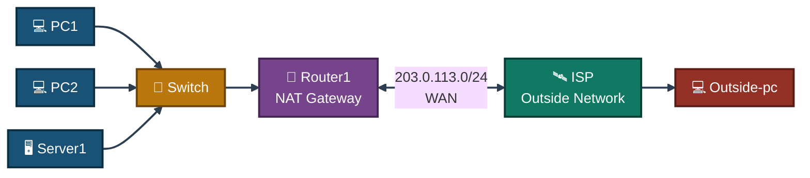
<p align="center"><em>Router1 is the sole NAT boundary — everything left of it is the private inside network, everything right of it (ISP and Outside-pc) is the public outside network.</em></p>

---

<a id="nat-translation-design"></a>
## 🔀 NAT Translation Design

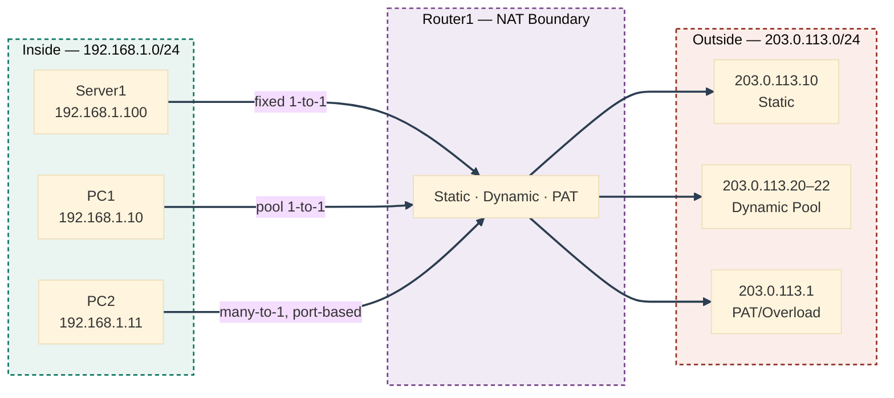
<p align="center"><em>Three inside hosts, three different translation mechanisms — a fixed address for Server1, a shared pool for PC1, and Router1's own outside interface with per-session ports for PC2.</em></p>

---

<a id="ip-addressing-plan"></a>
## 🗂️ IP Addressing Plan

**Inside LAN — 192.168.1.0/24**

| Device | IP | Mask | Gateway |
|--------|----|------|---------|
| Router1 Gig0/0 (inside) | 192.168.1.1 | 255.255.255.0 | — |
| PC1 | 192.168.1.10 | 255.255.255.0 | 192.168.1.1 |
| PC2 | 192.168.1.11 | 255.255.255.0 | 192.168.1.1 |
| Server1 | 192.168.1.100 | 255.255.255.0 | 192.168.1.1 |

**WAN Link — 203.0.113.0/24**

| Device | IP | Mask |
|--------|----|------|
| Router1 Gig0/1 (outside) | 203.0.113.1 | 255.255.255.0 |
| ISP Gig0/0 | 203.0.113.2 | 255.255.255.0 |

> [!NOTE]
> This link uses a full /24, not a /30 — this avoids the broadcast-address problem from an earlier attempt at this lab, where the static NAT public IP landed on a /30's broadcast address by mistake.

**Outside / "Internet" Segment — 198.51.100.0/24**

| Device | IP | Mask | Gateway |
|--------|----|------|---------|
| ISP Gig0/1 | 198.51.100.1 | 255.255.255.0 | — |
| Outside-pc | 198.51.100.10 | 255.255.255.0 | 198.51.100.1 |

**NAT Translation Plan**

| Type | Inside Host | Public Address | Mechanism |
|------|-------------|-----------------|-----------|
| Static NAT | Server1 (192.168.1.100) | 203.0.113.10 | Fixed 1-to-1 |
| Dynamic NAT | PC1 (192.168.1.10) | Pool: 203.0.113.20–203.0.113.22 | 1-to-1 from a pool |
| PAT / Overload | PC2 (192.168.1.11) | 203.0.113.1 (Router1's own outside IP) | Many-to-1, port-based |

---

<a id="module-1"></a>
## 🏗️ Module 1 — Build the Topology

**Objective:** Wire Router1, ISP, Switch, PC1, PC2, Server1, and Outside-pc per the connections table above.

### Step 1 — Build Topology ✅

No CLI commands — physical/logical wiring done in the Packet Tracer GUI.

<p align="center">
  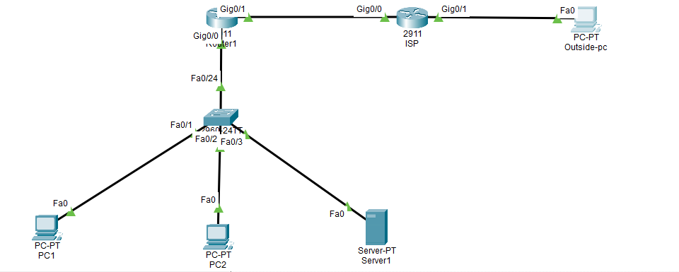<br>
  <em>Exhibit 1 — Full topology: inside LAN, Router1 gateway, ISP, and the outside segment</em>
</p>

---

<a id="module-2"></a>
## 💻 Module 2 — End Device IP Configuration

**Objective:** Address PC1, PC2, Server1, and Outside-pc per the addressing plan.

### Step 2 — Assign IPs to End Devices ✅

No CLI — done via each device's IP Configuration tab.

<p align="center">
  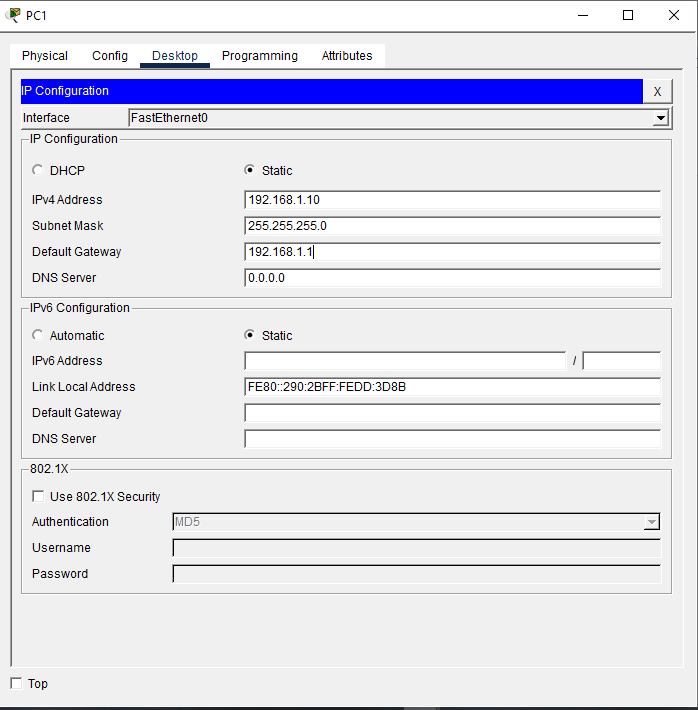<br>
  <em>Exhibit 2 — PC1, PC2, Server1, and Outside-pc addressed per the addressing plan</em>
</p>

---

<a id="module-3"></a>
## ⚙️ Module 3 — Router1 Inside Interface

**Objective:** Address Router1's LAN-facing interface and mark it as NAT inside.

### Step 3 — Configure Router1 Inside Interface ✅

```
Router> enable
Router# configure terminal
Router(config)# interface g0/0
Router(config-if)# ip address 192.168.1.1 255.255.255.0
Router(config-if)# ip nat inside
Router(config-if)# no shutdown
Router(config-if)# exit
```

<p align="center">
  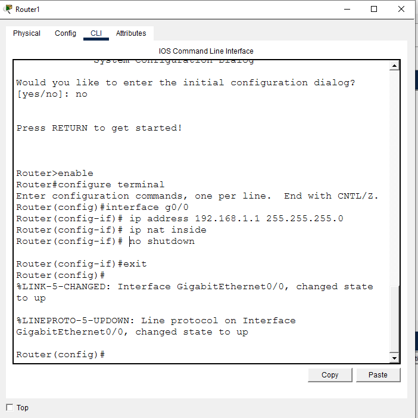<br>
  <em>Exhibit 3 — Router1's LAN-facing interface addressed and marked ip nat inside</em>
</p>

---

<a id="module-4"></a>
## 🌐 Module 4 — Router1 Outside Interface

**Objective:** Address Router1's WAN-facing interface and mark it as NAT outside.

### Step 4 — Configure Router1 Outside Interface ✅

```
Router(config)# interface g0/1
Router(config-if)# ip address 203.0.113.1 255.255.255.0
Router(config-if)# ip nat outside
Router(config-if)# no shutdown
Router(config-if)# exit
```

<p align="center">
  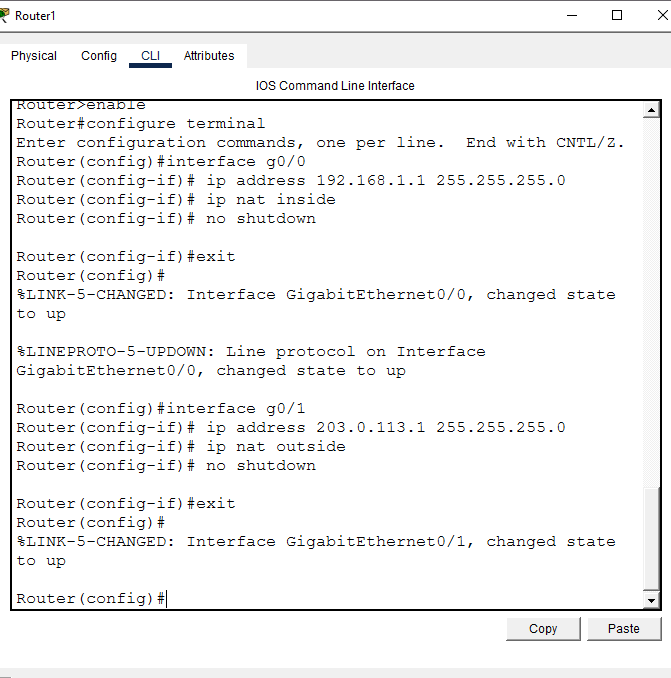<br>
  <em>Exhibit 4 — Router1's WAN-facing interface addressed and marked ip nat outside</em>
</p>

---

<a id="module-5"></a>
## 🛰️ Module 5 — Configure ISP Router

**Objective:** Address both of the ISP router's interfaces to simulate the outside network.

### Step 5 — Configure ISP Router ✅

```
Router> enable
Router# configure terminal
Router(config)# interface g0/0
Router(config-if)# ip address 203.0.113.2 255.255.255.0
Router(config-if)# no shutdown
Router(config-if)# exit
Router(config)# interface g0/1
Router(config-if)# ip address 198.51.100.1 255.255.255.0
Router(config-if)# no shutdown
Router(config-if)# exit
```

<p align="center">
  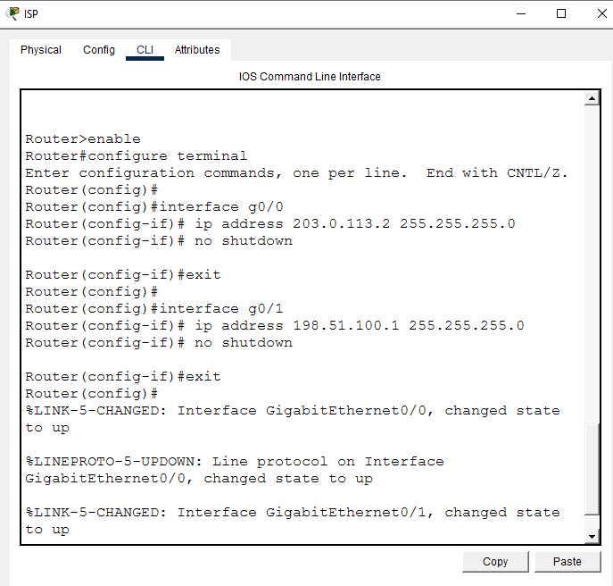<br>
  <em>Exhibit 5 — ISP router's two interfaces addressed and brought up</em>
</p>

---

<a id="module-6"></a>
## 🧭 Module 6 — Default Route on Router1

**Objective:** Point Router1 toward the ISP for all traffic with no more specific route.

### Step 6 — Default Route on Router1 ✅

```
Router(config)# ip route 0.0.0.0 0.0.0.0 203.0.113.2
Router(config)# exit
```

<p align="center">
  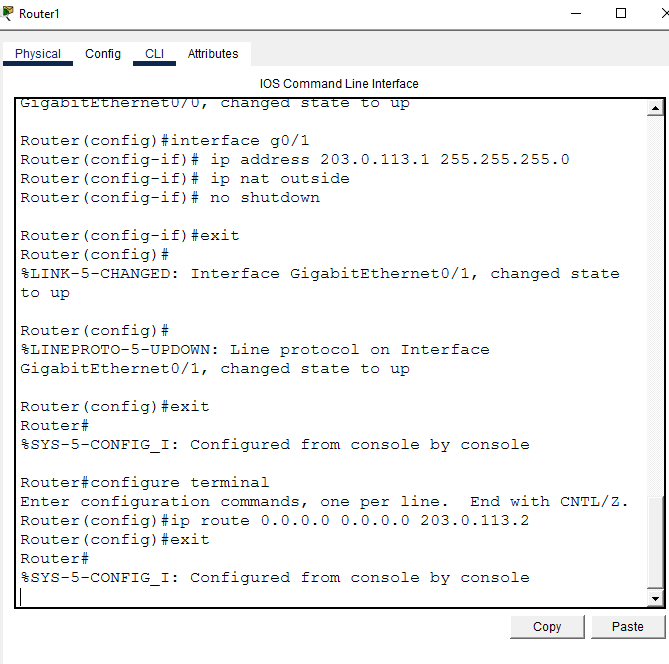<br>
  <em>Exhibit 6 — Router1's default route pointed at the ISP</em>
</p>

---

<a id="module-7"></a>
## 🚫 Module 7 — Pre-NAT Test

**Objective:** Confirm the private inside LAN is unreachable from outside before any NAT mechanism exists.

### Step 7 — Pre-NAT Test ✅

```
Outside-pc> ping 192.168.1.100
```

Result: **Destination host unreachable** (4/4) — confirms the private IP is not reachable from outside before NAT is configured.

<p align="center">
  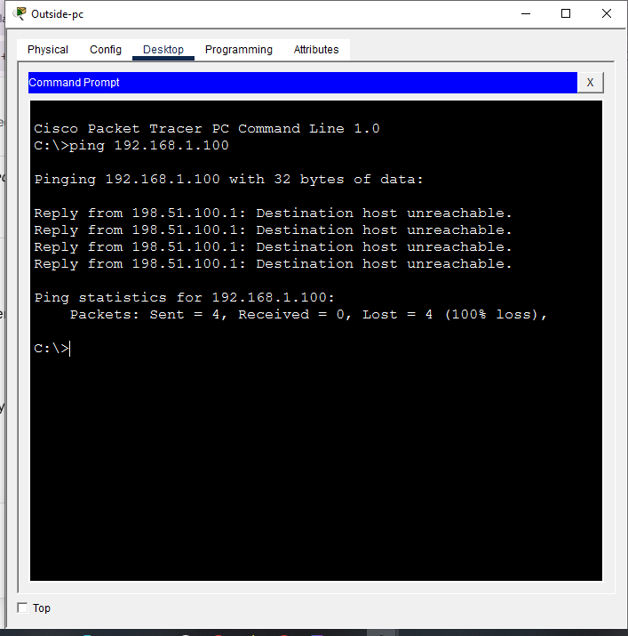<br>
  <em>Exhibit 7 — Ping to Server1's private IP fails from outside, as expected pre-NAT</em>
</p>

---

<a id="module-8"></a>
## 🔒 Module 8 — Static NAT (Server1)

**Objective:** Configure a fixed 1-to-1 mapping for Server1 and verify it from outside.

### Step 8 — Configure Static NAT ✅

```
Router# configure terminal
Router(config)# ip nat inside source static 192.168.1.100 203.0.113.10
Router(config)# exit
```

<p align="center">
  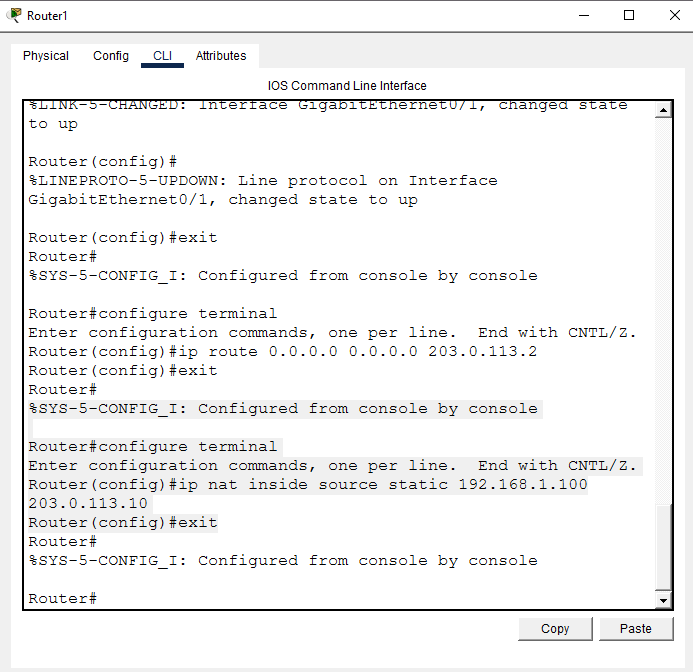<br>
  <em>Exhibit 8 — Static NAT mapping Server1's private IP to a fixed public address</em>
</p>

### Step 9 — Test Static NAT ✅

```
Outside-pc> ping 203.0.113.10
```

First attempt: 2 of 4 timed out (50% loss). Retried: 4/4 success.

<p align="center">
  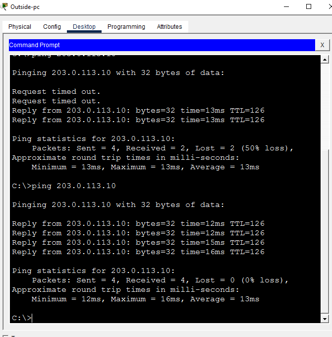<br>
  <em>Exhibit 9 — Ping to Server1's public address succeeds after a retry</em>
</p>

---

<a id="module-9"></a>
## 🎲 Module 9 — Dynamic NAT (PC1)

**Objective:** Configure a pool-based 1-to-1 mapping for PC1 and verify it via the translation table.

### Step 10 — Configure Dynamic NAT ✅

```
Router# configure terminal
Router(config)# access-list 1 permit host 192.168.1.10
Router(config)# ip nat pool NAT_POOL 203.0.113.20 203.0.113.22 netmask 255.255.255.0
Router(config)# ip nat inside source list 1 pool NAT_POOL
Router(config)# exit
```

<p align="center">
  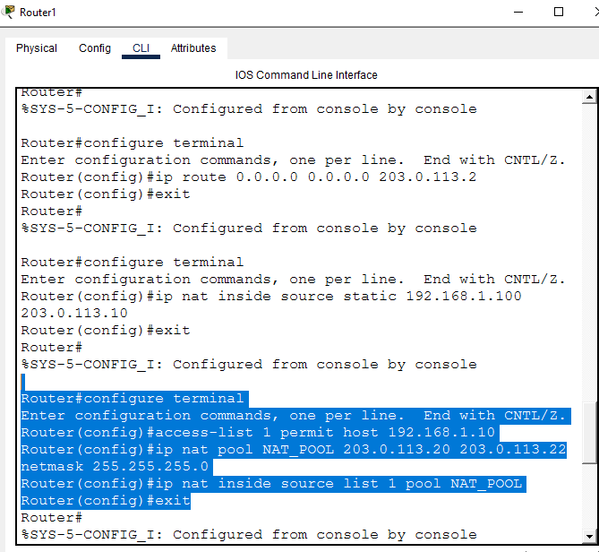<br>
  <em>Exhibit 10 — Dynamic NAT configured with an ACL matching PC1 and a 3-address pool</em>
</p>

### Step 11 — Test Dynamic NAT ✅

```
PC1> ping 198.51.100.10
Router1# show ip nat translations
```

Translation table confirms the mechanism is working:
```
icmp  203.0.113.20:1   192.168.1.10:1   198.51.100.10:1
icmp  203.0.113.20:2   192.168.1.10:2   198.51.100.10:2
...through :8
```

PC1's traffic is correctly translated through the pool address `203.0.113.20`.

> [!NOTE]
> An initial capture showed 100% ping loss with "Destination host unreachable" from the ISP — a transient blip. A retry came back clean (4/4, 0% loss), confirming both NAT translation and end-to-end connectivity are working correctly.

<p align="center">
  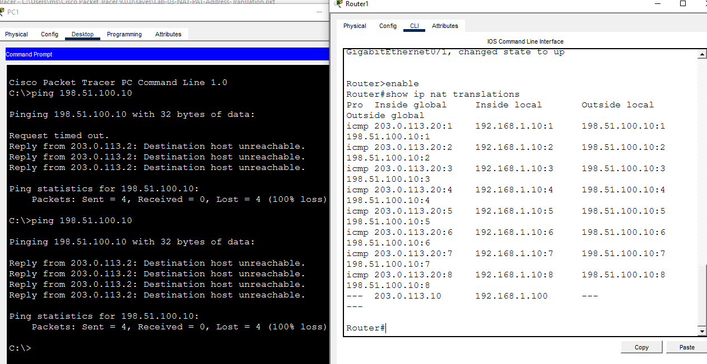<br>
  <em>Exhibit 11 — Router1's NAT translation table confirming PC1's traffic through the pool</em>
</p>

---

<a id="module-10"></a>
## 🔁 Module 10 — PAT / Overload (PC2)

**Objective:** Configure a many-to-1, port-based mapping for PC2 through Router1's own outside interface.

### Step 12 — Configure PAT / Overload ✅

```
Router# configure terminal
Router(config)# access-list 2 permit host 192.168.1.11
Router(config)# ip nat inside source list 2 interface g0/1 overload
Router(config)# exit
```

<p align="center">
  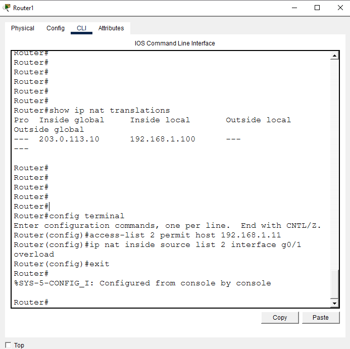<br>
  <em>Exhibit 12 — PAT/Overload configured with an ACL matching PC2, overloaded on the outside interface</em>
</p>

### Step 13 — Test PAT / Overload ✅

```
PC2> ping 198.51.100.10
Router1# show ip nat translations
```

Ping: 4/4 success. Translation table, checked immediately after, confirms PAT working correctly:
```
icmp  203.0.113.1:1   192.168.1.11:1   198.51.100.10:1
icmp  203.0.113.1:2   192.168.1.11:2   198.51.100.10:2
icmp  203.0.113.1:3   192.168.1.11:3   198.51.100.10:3
icmp  203.0.113.1:4   192.168.1.11:4   198.51.100.10:4
```

PC2's traffic is translated through Router1's own outside interface (`203.0.113.1`), with a unique port number per session — this is the defining feature of PAT/Overload, distinguishing it from Dynamic NAT.

<p align="center">
  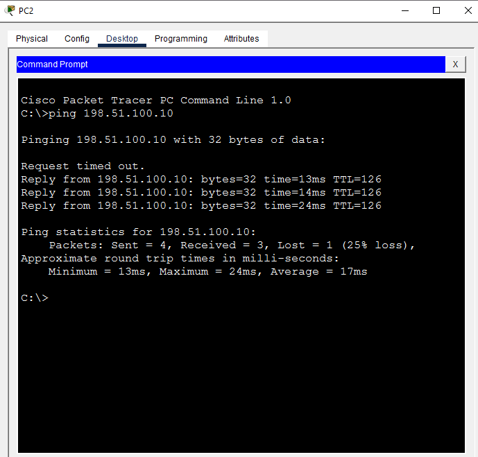<br>
  <em>Exhibit 13a — PC2's ping to Outside-pc succeeds 4/4</em>
</p>
<p align="center">
  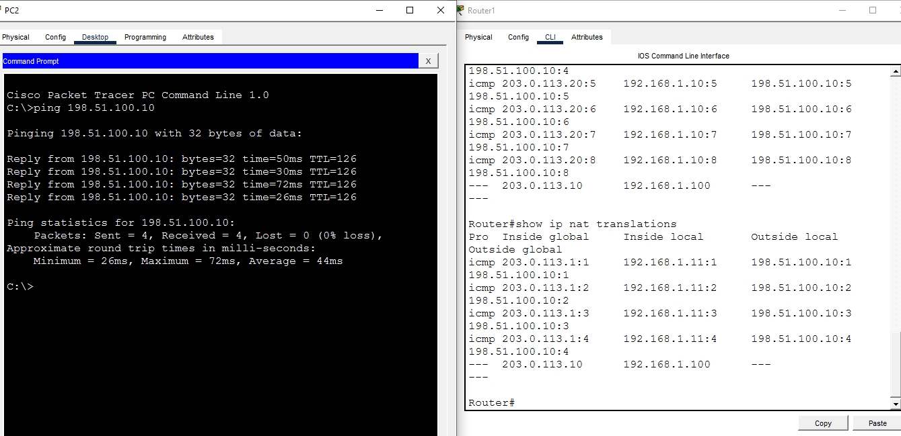<br>
  <em>Exhibit 13b — NAT translation table showing PC2's sessions sharing Router1's outside IP with distinct ports</em>
</p>

---

<a id="module-11"></a>
## 📋 Module 11 — Combined Verification

**Objective:** Read the translation table and NAT statistics together to see how the snapshot depends on timing.

### Step 14 — Verify All Translations Together ✅

```
Router1# show ip nat translations
Router1# show ip nat translations verbose
Router1# show ip nat statistics
```

- `show ip nat translations`: only the static entry present
- `show ip nat translations verbose`: rejected with "Invalid input" — Packet Tracer's simulated IOS doesn't support the `verbose` keyword
- `show ip nat statistics`: shows `Total translations: 1 (1 static, 0 dynamic, 0 extended)` and the pool at `allocated 0 (0%), refCount 0`

> [!NOTE]
> **On timing:** this snapshot was captured before the retests documented in Modules 9 and 10 — at this point, neither ICMP session was active, which is why it shows 0 dynamic/extended. It's kept here as the original verification step; the later, immediate-capture retests in Steps 11 and 13 are the ones that actually confirm Dynamic NAT and PAT are working.

<p align="center">
  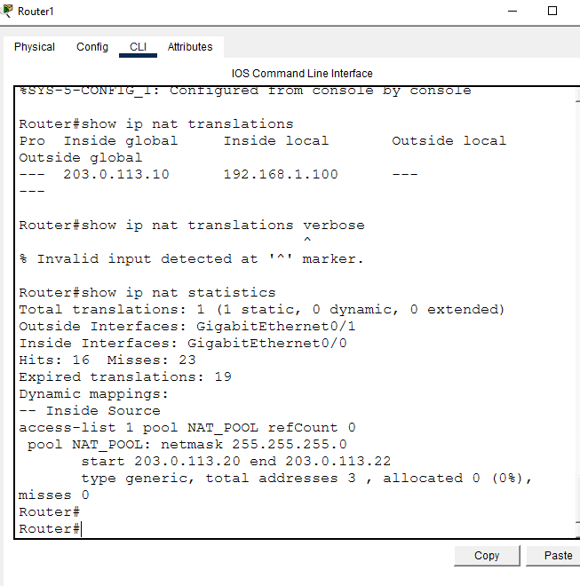<br>
  <em>Exhibit 14 — Combined translation-table and NAT-statistics snapshot</em>
</p>

---

<a id="module-12"></a>
## 💾 Module 12 — Final Check & Save

**Objective:** Confirm interfaces and routing are correct, then persist the configuration.

### Step 15 — Final Check ✅

```
Router1# show ip interface brief
Router1# show ip route
```

<p align="center">
  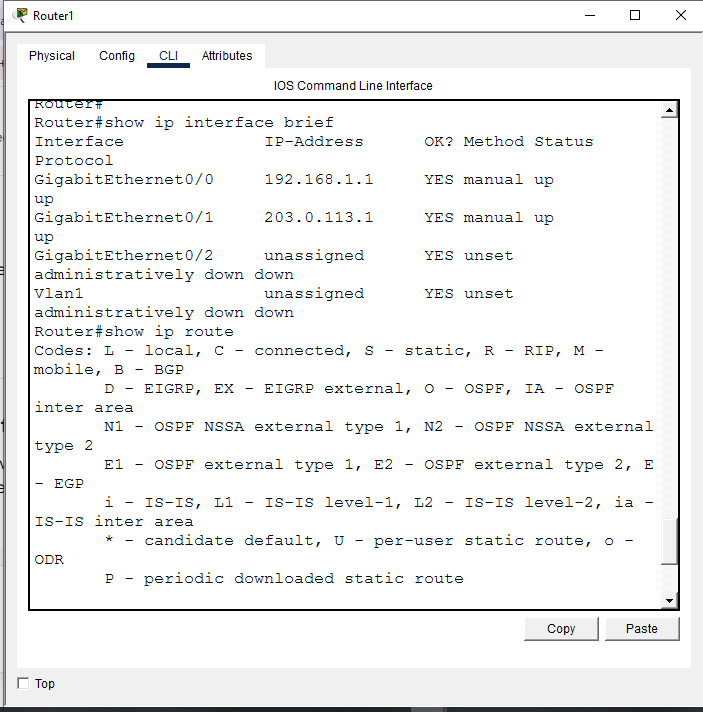<br>
  <em>Exhibit 15 — Interface and routing table state confirmed correct</em>
</p>

### Step 16 — Save Config ✅

```
Router1# copy running-config startup-config
```

<p align="center">
  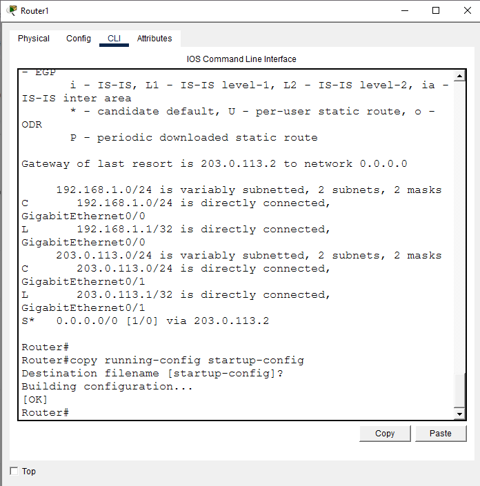<br>
  <em>Exhibit 16 — Running configuration saved to startup configuration</em>
</p>

---

<a id="coverage-snapshot"></a>
## 🌟 Coverage Snapshot

| 🛡️ Layer | ✅ Status | 📌 Detail |
|---|---|---|
| Topology | Live | Router1, ISP, Switch, and four end devices wired (Exhibit 1) |
| End device IPs | Live | PC1, PC2, Server1, Outside-pc addressed (Exhibit 2) |
| Router1 inside/outside | Live | Both interfaces addressed and marked nat inside/outside (Exhibits 3–4) |
| ISP router | Live | Both interfaces addressed to simulate the outside network (Exhibit 5) |
| Default route | Live | Router1 pointed at the ISP for unmatched traffic (Exhibit 6) |
| Pre-NAT baseline | Proven | Private IP confirmed unreachable from outside before NAT (Exhibit 7) |
| Static NAT | Proven | Server1 reachable from outside via 203.0.113.10 (Exhibits 8–9) |
| Dynamic NAT | Proven | PC1's session confirmed in the translation table via the pool (Exhibits 10–11) |
| PAT / Overload | Proven | PC2's sessions confirmed sharing Router1's outside IP with distinct ports (Exhibits 12–13) |
| Combined verification | Proven | Translation table and NAT statistics cross-checked (Exhibit 14) |
| Final state & persistence | Live | Interfaces/routes confirmed, config saved (Exhibits 15–16) |

---

<a id="command-summary"></a>
## 📟 Command Summary

| Command | Purpose |
|---------|---------|
| `ip nat inside` / `ip nat outside` | Mark NAT boundary interfaces |
| `ip nat inside source static <local> <global>` | Static 1-to-1 NAT |
| `ip nat pool <name> <start> <end> netmask <mask>` | Define a public address pool |
| `ip nat inside source list <acl> pool <name>` | Dynamic NAT using a pool |
| `ip nat inside source list <acl> interface <int> overload` | PAT/Overload using one public IP |
| `show ip nat translations` | View active NAT mappings — must be checked immediately after generating traffic, ICMP entries expire fast |
| `show ip nat statistics` | View hits/misses and pool allocation — the clearest way to confirm whether a dynamic rule has ever actually been used |

---

<a id="challenges-fixes"></a>
## ⚠️ Challenges & Fixes

| ❌ Challenge | ✅ Solution |
|---|---|
| Earlier attempt at this lab put the static NAT public IP on a /30's broadcast address | Rebuilt the WAN link as a /24, giving room for the static IP, the dynamic pool, and the PAT overload address all within one valid, non-broadcast subnet |
| Dynamic NAT and PAT pings succeeded, but the first `show ip nat translations` check came too late — the ICMP entries had already expired, showing no proof either mechanism actually fired | Retested with the ping and the translation-table check run back-to-back in the same session — both now show confirmed entries with port numbers |
| A retest ping briefly failed completely (100% loss, twice) right after Dynamic NAT was already confirmed in the table | Retried once more — came back clean, 4/4 success. Confirmed as a one-off blip rather than a real config issue |

**All three NAT mechanisms (Static, Dynamic, PAT) are fully confirmed — both translation table evidence and clean end-to-end pings.**

---

<a id="scope-limitations"></a>
## 🚧 Scope & Limitations

- **Simulation only:** Built and verified in Cisco Packet Tracer, not on physical hardware.
- **Single gateway, no redundancy:** Router1 is the only NAT boundary — no failover router or high-availability NAT was configured.
- **ICMP-only verification:** All translation-table evidence is based on ping traffic; TCP/UDP-based session verification wasn't captured separately.
- **No overlapping-address or NAT64 scenarios:** The lab covers Static, Dynamic, and PAT for a single non-overlapping address space, not overlapping NAT or IPv6 translation.
- **Small pool size:** The Dynamic NAT pool has only 3 addresses (203.0.113.20–22), enough to demonstrate the mechanism but not sized for a real multi-host deployment.

These limits are stated so the lab is read as a NAT/PAT fundamentals exercise, not a production-scale address-translation design.

---

<a id="what-i-learned"></a>
## 🧠 What I Learned

- **A successful ping doesn't tell you which NAT mechanism handled it** — only `show ip nat translations`, checked at the right moment, proves that.
- **ICMP-based NAT translations age out quickly.** If there's any gap between generating traffic and checking the table, the evidence can disappear even though the mechanism worked correctly in the moment.
- **`show ip nat statistics` is actually the most reliable verification tool for dynamic/PAT rules**, since `allocated` and `refCount` reflect real usage over time, not just a single snapshot that depends on perfect timing.
- **Subnet sizing matters even for "outside" addresses you don't control directly** — a /30 only has 2 usable host addresses, and picking the broadcast or network address breaks NAT silently (the command is accepted with no error).

---

<a id="skills-demonstrated"></a>
## 🛠️ Skills Demonstrated

- Configuring Static NAT, Dynamic NAT, and PAT/Overload on the same gateway router
- Marking NAT inside/outside boundaries and building a default route toward an ISP
- Designing a WAN subnet sized to avoid broadcast-address collisions with NAT pools
- Verifying NAT with correctly-timed translation-table and ping checks
- Distinguishing Dynamic NAT from PAT/Overload by reading per-session port numbers
- Diagnosing a subnet-sizing mistake and a translation-table timing gap
- Cross-checking `show ip nat translations` against `show ip nat statistics` for reliable verification

---

<a id="screenshot-index"></a>
## 🖼️ Screenshot Index

| # | File | Shows |
|:---:|---|---|
| 1 | `01-nat-topology.PNG` | Full topology after wiring |
| 2 | `02-end-device-ips.PNG` | PC1, PC2, Server1, Outside-pc addressed |
| 3 | `03-r1-inside-interface.PNG` | Router1 inside interface config |
| 4 | `04-r1-outside-interface.PNG` | Router1 outside interface config |
| 5 | `05-isp-router-config.PNG` | ISP router interface config |
| 6 | `06-default-route.PNG` | Router1 default route toward the ISP |
| 7 | `07-pre-nat-test.PNG` | Pre-NAT ping fails as expected |
| 8 | `08-static-nat-config.PNG` | Static NAT configuration |
| 9 | `09-static-nat-test.PNG` | Static NAT ping test |
| 10 | `10-dynamic-nat-config.PNG` | Dynamic NAT (ACL + pool) configuration |
| 11 | `11-dynamic-nat-test_b.PNG` | Dynamic NAT translation-table confirmation |
| 12 | `12-pat-config.PNG` | PAT/Overload configuration |
| 13 | `13-pat-test_a.PNG` | PAT ping result |
| 13 | `13-pat-test_b.PNG` | PAT translation-table confirmation |
| 14 | `14-nat-verification.PNG` | Combined translations + statistics snapshot |
| 15 | `15-final-check.PNG` | Interface/routing final check |
| 16 | `16-save-config.PNG` | Running config saved to startup config |

---

<a id="repo-structure"></a>
## 📁 Repo Structure

```text
09-nat-pat-address-translation/
|-- README.md
|-- Lab_NAT_PAT_Address_Translation.pkt
`-- screenshots/
    |-- 01-nat-topology.PNG
    |-- 02-end-device-ips.PNG
    |-- 03-r1-inside-interface.PNG
    |-- 04-r1-outside-interface.PNG
    |-- 05-isp-router-config.PNG
    |-- 06-default-route.PNG
    |-- 07-pre-nat-test.PNG
    |-- 08-static-nat-config.PNG
    |-- 09-static-nat-test.PNG
    |-- 10-dynamic-nat-config.PNG
    |-- 11-dynamic-nat-test_b.PNG
    |-- 12-pat-config.PNG
    |-- 13-pat-test_a.PNG
    |-- 13-pat-test_b.PNG
    |-- 14-nat-verification.PNG
    |-- 15-final-check.PNG
    `-- 16-save-config.PNG
```

<div align="center">

🔀 **[NAT Configuration Guide](https://www.cisco.com/c/en/us/support/docs/ip/network-address-translation-nat/13772-12.html)** · 🔁 **[Understanding PAT (Overload)](https://www.cisco.com/c/en/us/support/docs/ip/network-address-translation-nat/6450-natfaq.html)** · 📋 **[Verifying and Troubleshooting NAT](https://www.cisco.com/c/en/us/support/docs/ip/network-address-translation-nat/13711-51.html)**

</div>
