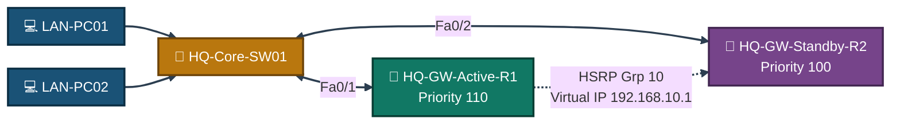
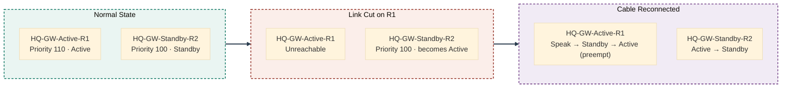
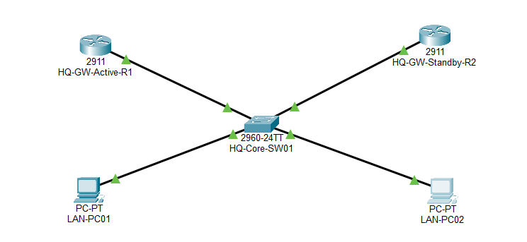
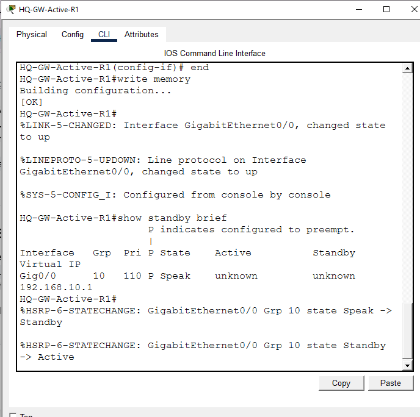
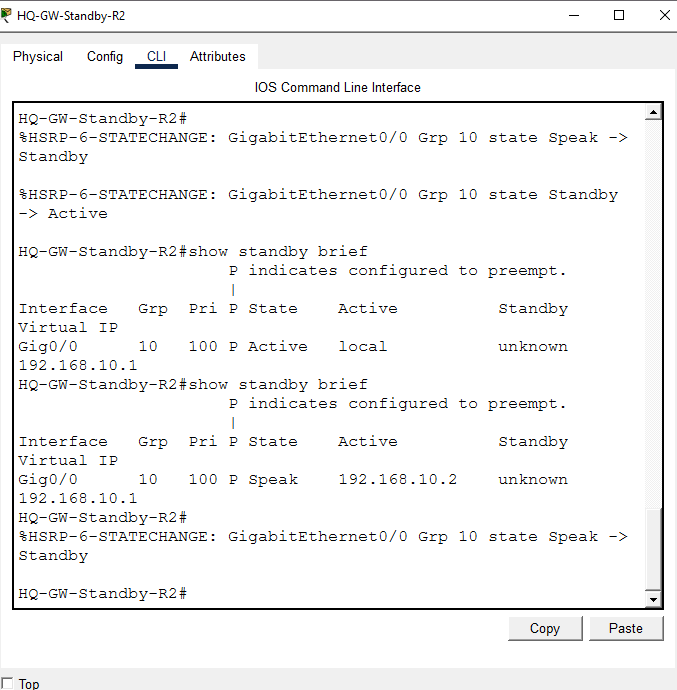
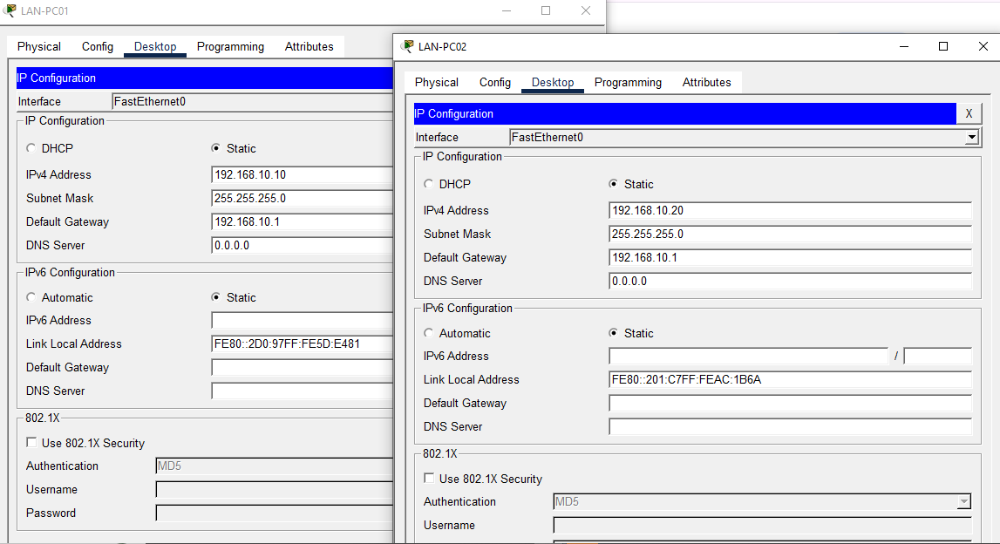
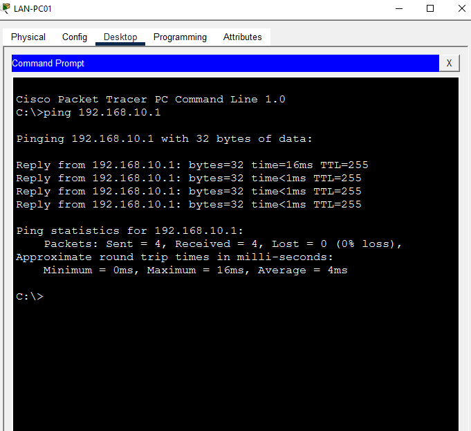
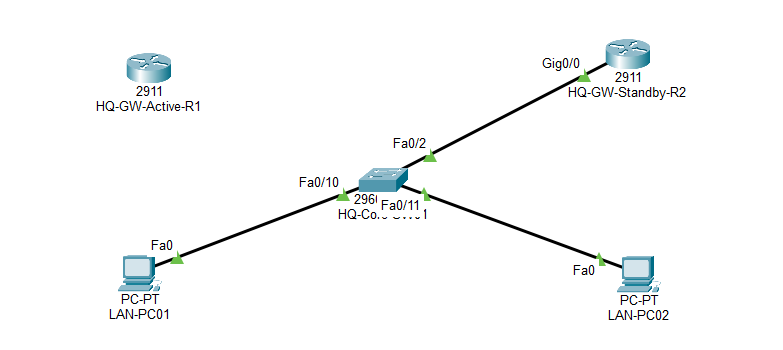
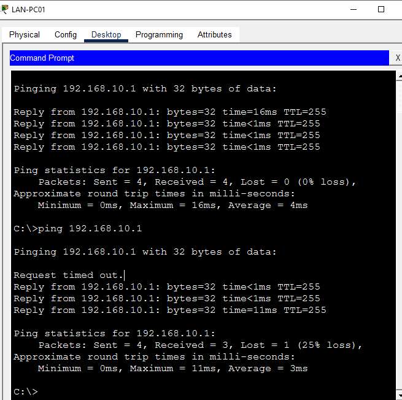
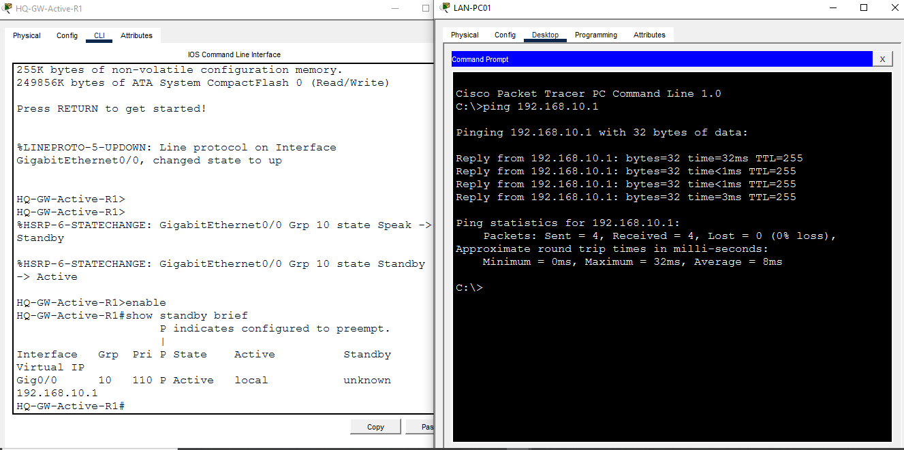

<div align="center">

# 🛡️ HSRP — Network Redundancy & Failover

**Lab 10 — Cisco Networking Lab Portfolio**

Two-Router HSRP Group Sharing One Virtual Gateway IP — Active/Standby Roles, Preemption, and a Verified Cable-Cut Failover and Restoration Test (Cisco Packet Tracer)


Two routers configured into a single HSRP group behind one shared virtual gateway IP — one preferred as Active via higher priority and `preempt`, the other as Standby. Verification goes past config review: the Active router's own link is physically cut mid-test, the Standby's takeover is confirmed with minimal packet loss, and the cable is then restored to prove the higher-priority router preempts its way back to Active rather than leaving the Standby in charge.

</div>

---

## 📑 Table of Contents

1. [At a Glance](#at-a-glance)
2. [Project Background](#project-background)
3. [Tools & Technologies](#tools-technologies)
4. [Environment](#environment)
5. [Topology](#topology)
6. [HSRP Failover Design](#hsrp-failover-design)
7. [Addressing Plan](#addressing-plan)
8. [Module 1 — Build the Topology](#module-1)
9. [Module 2 — Configure HQ-GW-Active-R1](#module-2)
10. [Module 3 — Configure HQ-GW-Standby-R2](#module-3)
11. [Module 4 — PC Static IP Configuration](#module-4)
12. [Module 5 — Baseline Connectivity Test](#module-5)
13. [Module 6 — Simulate Failure](#module-6)
14. [Module 7 — Failover Verification](#module-7)
15. [Module 8 — Restoration / Preemption Recovery Test](#module-8)
16. [Coverage Snapshot](#coverage-snapshot)
17. [Command Summary](#command-summary)
18. [Challenges & Fixes](#challenges-fixes)
19. [Scope & Limitations](#scope-limitations)
20. [What I Learned](#what-i-learned)
21. [Skills Demonstrated](#skills-demonstrated)
22. [Screenshot Index](#screenshot-index)
23. [Repo Structure](#repo-structure)

---

<a id="at-a-glance"></a>
## 📊 At a Glance

<div align="center">

| 🌐 HSRP Group | 🚪 Routers | 🔀 Switch | 🖥️ PCs | 🎯 Virtual IP | 🖼️ Screenshots |
|:---:|:---:|:---:|:---:|:---:|:---:|
| **10** | **2** | **1** | **2** | **192.168.10.1** | **8** |

</div>

---

<a id="project-background"></a>
## 📖 Project Background

This lab moves past a single-router gateway into first-hop redundancy: HQ-GW-Active-R1 and HQ-GW-Standby-R2 both sit on the same LAN, both belong to HSRP Group 10, and both point at the same virtual IP — but only one of them actually forwards traffic at any given moment. Verification is deliberately stricter than a config check — the Active router's link is physically removed, the failover is timed by ping, and the cable is reconnected afterward to confirm preemption actually hands Active status back.

| Module | Focus |
|---|---|
| 🏗️ **Module 1 — Build the Topology** | Wire 2 routers, 1 switch, and 2 PCs |
| ⚙️ **Module 2 — Configure HQ-GW-Active-R1** | Priority 110, preempt enabled |
| 🌉 **Module 3 — Configure HQ-GW-Standby-R2** | Priority 100, preempt enabled |
| 💻 **Module 4 — PC Static IP Configuration** | Point both PCs at the virtual IP as their gateway |
| 📶 **Module 5 — Baseline Connectivity Test** | Confirm normal path through the Active router |
| ✂️ **Module 6 — Simulate Failure** | Cut the Active router's link to the switch |
| 🔁 **Module 7 — Failover Verification** | Confirm the Standby takes over with minimal loss |
| ♻️ **Module 8 — Restoration / Preemption Recovery** | Reconnect the cable and confirm R1 preempts back to Active |

> [!NOTE]
> This is a Packet Tracer simulation, not physical hardware. Both PCs' default gateway is the **virtual IP** (192.168.10.1), never either router's real interface address — this is what makes the failover transparent to the end hosts.

---

<a id="tools-technologies"></a>
## 🛠️ Tools & Technologies

| Tool | Purpose |
|------|---------|
| 🖥️ Cisco Packet Tracer | Network simulation |
| 🚪 Router 2911 x2 | HQ-GW-Active-R1, HQ-GW-Standby-R2 |
| 🔀 Switch 2960 (HQ-Core-SW01) | Connects both gateways to the shared LAN |
| 🛡️ HSRP (Group 10) | Provides one virtual gateway IP backed by two physical routers |
| ♻️ Preempt | Lets the higher-priority router reclaim Active status once it's back online |

---

<a id="environment"></a>
## 🖧 Environment


**Devices:** 2 Routers (2911: HQ-GW-Active-R1 priority 110, HQ-GW-Standby-R2 priority 100) · 1 Switch (2960: HQ-Core-SW01) · 2 PCs

**Connections**

| From | To | Port |
|------|----|------|
| HQ-GW-Active-R1 Gig0/0 | HQ-Core-SW01 | Fa0/1 |
| HQ-GW-Standby-R2 Gig0/0 | HQ-Core-SW01 | Fa0/2 |
| LAN-PC01 | HQ-Core-SW01 | Fa0/10 |
| LAN-PC02 | HQ-Core-SW01 | Fa0/11 |

---

<a id="topology"></a>
## 🗺️ Topology


<p align="center"><em>Both routers sit on the same LAN and both know the virtual IP — only the Active router actually forwards traffic for it at any given moment.</em></p>

---

<a id="hsrp-failover-design"></a>
## 🛡️ HSRP Failover Design


<p align="center"><em>Priority alone doesn't decide who's Active forever — preempt is what lets R1 reclaim the role once its link is restored, rather than leaving R2 permanently in charge.</em></p>

---

<a id="addressing-plan"></a>
## 🗂️ Addressing Plan

| Device | IP | Role |
|--------|----|------|
| HQ-GW-Active-R1 Gig0/0 | 192.168.10.2 | HSRP priority 110, preempt |
| HQ-GW-Standby-R2 Gig0/0 | 192.168.10.3 | HSRP priority 100, preempt |
| **Virtual IP (shared)** | **192.168.10.1** | Used as the default gateway by both PCs |
| LAN-PC01 | 192.168.10.10 | Gateway: 192.168.10.1 |
| LAN-PC02 | 192.168.10.20 | Gateway: 192.168.10.1 |

---

<a id="module-1"></a>
## 🏗️ Module 1 — Build the Topology

**Objective:** Wire HQ-GW-Active-R1, HQ-GW-Standby-R2, HQ-Core-SW01, and both PCs per the connections table above.

### Step 1 — Build Topology ✅

No CLI commands — physical/logical wiring done in the Packet Tracer GUI.

<p align="center">
  <br>
  <em>Exhibit 1 — Full topology: both gateway routers and both PCs wired through the shared switch</em>
</p>

---

<a id="module-2"></a>
## ⚙️ Module 2 — Configure HQ-GW-Active-R1

**Objective:** Address the interface and configure HSRP Group 10 with priority 110 and preempt, so this router wins the Active role.

### Step 2 — Configure HQ-GW-Active-R1 (Priority 110) ✅

```
Router(config)# hostname HQ-GW-Active-R1
HQ-GW-Active-R1(config)# interface GigabitEthernet0/0
HQ-GW-Active-R1(config-if)# ip address 192.168.10.2 255.255.255.0
HQ-GW-Active-R1(config-if)# duplex auto
HQ-GW-Active-R1(config-if)# speed auto
HQ-GW-Active-R1(config-if)# standby 10 ip 192.168.10.1
HQ-GW-Active-R1(config-if)# standby 10 priority 110
HQ-GW-Active-R1(config-if)# standby 10 preempt
HQ-GW-Active-R1(config-if)# no shutdown
HQ-GW-Active-R1(config-if)# end
HQ-GW-Active-R1# write memory
HQ-GW-Active-R1# show standby brief
```

Confirmed: priority 110, preempt enabled (P flag), virtual IP 192.168.10.1. Final state: **Active**.

<p align="center">
  <br>
  <em>Exhibit 2 — HQ-GW-Active-R1 configured with priority 110 and preempt, confirmed Active</em>
</p>

---

<a id="module-3"></a>
## 🌉 Module 3 — Configure HQ-GW-Standby-R2

**Objective:** Address the interface and configure the same HSRP group with a lower priority, so this router defers to R1 whenever both are online.

### Step 3 — Configure HQ-GW-Standby-R2 (Priority 100) ✅

```
Router(config)# hostname HQ-GW-Standby-R2
HQ-GW-Standby-R2(config)# interface GigabitEthernet0/0
HQ-GW-Standby-R2(config-if)# ip address 192.168.10.3 255.255.255.0
HQ-GW-Standby-R2(config-if)# duplex auto
HQ-GW-Standby-R2(config-if)# speed auto
HQ-GW-Standby-R2(config-if)# standby 10 ip 192.168.10.1
HQ-GW-Standby-R2(config-if)# standby 10 priority 100
HQ-GW-Standby-R2(config-if)# standby 10 preempt
HQ-GW-Standby-R2(config-if)# no shutdown
HQ-GW-Standby-R2(config-if)# exit
HQ-GW-Standby-R2(config)# line console 0
HQ-GW-Standby-R2(config-line)# logging synchronous
HQ-GW-Standby-R2(config-line)# end
HQ-GW-Standby-R2# write memory
```

> [!NOTE]
> **What actually happened here:** R2 came online before R1 was connected, so it briefly became **Active itself** (no competing router yet — confirmed by `show standby brief` showing `State: Active, Active: local`). Once R1 came online with its higher priority (110) and preempt enabled, R1 forced R2 back down to Standby and took over as Active. This is preemption working correctly — R2 going through Speak → Active → Standby, not straight to Standby.

<p align="center">
  <br>
  <em>Exhibit 3 — HQ-GW-Standby-R2 configured with priority 100 and preempt, settling into Standby once R1 came online</em>
</p>

---

<a id="module-4"></a>
## 💻 Module 4 — PC Static IP Configuration

**Objective:** Address both PCs and point their default gateway at the HSRP virtual IP rather than either router's real address.

### Step 4 — PC Static IP Configuration ✅

No CLI — done via each device's IP Configuration tab.

- LAN-PC01: 192.168.10.10 / 255.255.255.0 / Gateway 192.168.10.1
- LAN-PC02: 192.168.10.20 / 255.255.255.0 / Gateway 192.168.10.1

Both gateways point to the **virtual IP**, not either router's real IP — this is what makes the failover transparent to the hosts.

<p align="center">
  <br>
  <em>Exhibit 4 — Both PCs addressed with the virtual IP as their default gateway</em>
</p>

---

<a id="module-5"></a>
## 📶 Module 5 — Baseline Connectivity Test

**Objective:** Confirm normal traffic flows through the Active router before any failure is introduced.

### Step 5 — Baseline Connectivity Test ✅

```
LAN-PC01> ping 192.168.10.1
```

4/4 success, 0% loss — confirms normal path through the Active router.

<p align="center">
  <br>
  <em>Exhibit 5 — Baseline ping to the virtual IP succeeds cleanly through HQ-GW-Active-R1</em>
</p>

---

<a id="module-6"></a>
## ✂️ Module 6 — Simulate Failure

**Objective:** Physically cut the Active router's link to the switch to force an HSRP failover.

### Step 6 — Simulate Failure (Cut the Active Router's Link) ✅

Deleted the cable between HQ-GW-Active-R1 and HQ-Core-SW01, isolating the primary gateway. No CLI — cable removed via the Delete tool in the Packet Tracer GUI.

<p align="center">
  <br>
  <em>Exhibit 6 — HQ-GW-Active-R1 isolated from the switch, simulating a gateway failure</em>
</p>

---

<a id="module-7"></a>
## 🔁 Module 7 — Failover Verification

**Objective:** Confirm HQ-GW-Standby-R2 detects R1's failure and takes over the virtual IP with minimal disruption.

### Step 7 — Failover Verification ✅

```
LAN-PC01> ping 192.168.10.1
```

**1 of 4 packets timed out**, then the remaining 3 succeeded — HSRP detected R1's failure and HQ-GW-Standby-R2 took over the virtual IP with only a single dropped packet.

<p align="center">
  <br>
  <em>Exhibit 7 — Ping shows one dropped packet during failover, then a clean recovery through R2</em>
</p>

---

<a id="module-8"></a>
## ♻️ Module 8 — Restoration / Preemption Recovery Test

**Objective:** Reconnect HQ-GW-Active-R1's cable and confirm it preempts its way back to Active rather than leaving R2 in charge.

### Step 8 — Restoration / Preemption Recovery Test ✅

Reconnected the cable between HQ-GW-Active-R1 and HQ-Core-SW01. R1's own log confirms the full transition:

```
%HSRP-6-STATECHANGE: GigabitEthernet0/0 Grp 10 state Speak -> Standby
%HSRP-6-STATECHANGE: GigabitEthernet0/0 Grp 10 state Standby -> Active

HQ-GW-Active-R1# show standby brief
Interface  Grp  Pri  P  State   Active  Standby  Virtual IP
Gig0/0     10   110  P  Active  local   unknown  192.168.10.1
```

R1 first deferred to R2 (Standby), then preempted and reclaimed Active — exactly the expected sequence given its higher priority (110) and `preempt` configuration.

Follow-up ping from LAN-PC01 confirms clean recovery:
```
C:\>ping 192.168.10.1
Reply from 192.168.10.1: bytes=32 time=32ms TTL=255
Reply from 192.168.10.1: bytes=32 time<1ms TTL=255
Reply from 192.168.10.1: bytes=32 time<1ms TTL=255
Reply from 192.168.10.1: bytes=32 time=3ms TTL=255

Packets: Sent = 4, Received = 4, Lost = 0 (0% loss)
```

**4/4 success, 0% loss** — full recovery confirmed.

<p align="center">
  <br>
  <em>Exhibit 8 — R1's state log and a clean 4/4 ping confirm successful preemption back to Active</em>
</p>

---

<a id="coverage-snapshot"></a>
## 🌟 Coverage Snapshot

| 🛡️ Layer | ✅ Status | 📌 Detail |
|---|---|---|
| Topology | Live | 2 routers, 1 switch, 2 PCs wired (Exhibit 1) |
| HQ-GW-Active-R1 | Live | Priority 110, preempt enabled, confirmed Active (Exhibit 2) |
| HQ-GW-Standby-R2 | Live | Priority 100, preempt enabled, settled into Standby (Exhibit 3) |
| PC provisioning | Live | Both PCs addressed with the virtual IP as gateway (Exhibit 4) |
| Baseline connectivity | Proven | Ping to virtual IP succeeds 4/4 before any failure (Exhibit 5) |
| Simulated failure | Live | Active router's link physically cut (Exhibit 6) |
| Failover | Proven | Standby takes over with only 1 dropped packet (Exhibit 7) |
| Restoration & preemption | Proven | R1 logs Speak → Standby → Active, follow-up ping 4/4 (Exhibit 8) |

---

<a id="command-summary"></a>
## 📟 Command Summary

| Command | Purpose |
|---------|---------|
| `standby <group> ip <virtual-ip>` | Assign the shared virtual IP for the HSRP group |
| `standby <group> priority <value>` | Set this router's priority (higher wins Active role) |
| `standby <group> preempt` | Allow this router to reclaim Active status once it has the highest priority again |
| `show standby brief` | Check current HSRP state, priority, and active/standby router for a group |

---

<a id="challenges-fixes"></a>
## ⚠️ Challenges & Fixes

| ❌ Challenge | ✅ Solution |
|---|---|
| R2 became Active on its own before R1 was even online, which didn't match the expected "R1 is always Active" assumption | Recognized this is normal — whichever router is online first with no competition becomes Active by default; preemption is what corrects this once the higher-priority router (R1) comes online |
| Restoration/failback after reconnecting the cable was initially left untested | Ran the restoration test explicitly (Module 8) — R1's log and `show standby brief` confirm it preempted back to Active, with a clean 4/4 follow-up ping |

---

<a id="scope-limitations"></a>
## 🚧 Scope & Limitations

- **Simulation only:** Built and verified in Cisco Packet Tracer, not on physical hardware.
- **Single HSRP group, two routers:** Demonstrates the core Active/Standby/preempt mechanism, not a multi-group or load-balanced HSRP design (e.g. HSRP with multiple groups split across VLANs).
- **No authentication:** HSRP hellos were exchanged without MD5 authentication between the two routers.
- **Manual failure simulation:** The failure was induced by manually removing a cable in the GUI, not by a timed link-failure event or a routing protocol interaction.
- **Default timers:** HSRP hello and hold timers were left at their defaults; sub-second failover tuning wasn't explored.

These limits are stated so the lab is read as an HSRP fundamentals exercise, not a production first-hop-redundancy design.

---

<a id="what-i-learned"></a>
## 🧠 What I Learned

- **Priority alone doesn't guarantee a router is Active** — it only wins the role if it's online when the election happens, or if `preempt` is configured to let it take over later.
- **A router passing through Standby state before becoming Active is itself evidence that another router was already Active at that moment** — that transition doesn't happen if there's no competition.
- **Testing failover (taking the link down) is only half the test.** Failback (bringing it back up and confirming recovery) needs to be verified separately — it's not automatically proven by the failover test alone.

---

<a id="skills-demonstrated"></a>
## 🛠️ Skills Demonstrated

- Configuring HSRP with a shared virtual gateway IP across two routers
- Setting HSRP priority and preempt to control which router wins the Active role
- Pointing end-host gateways at a virtual IP rather than a physical router address
- Simulating a real gateway failure and measuring failover packet loss
- Reading HSRP state-change logs (`Speak → Standby → Active`) to confirm correct preemption behavior
- Verifying both failover and failback/restoration as two separate, independently-proven test cases

---

<a id="screenshot-index"></a>
## 🖼️ Screenshot Index

| # | File | Shows |
|:---:|---|---|
| 1 | `01-hsrp-topology-final.PNG` | Full topology after wiring |
| 2 | `02-active-r1-hsrp-config.PNG` | HQ-GW-Active-R1 HSRP config, priority 110 |
| 3 | `03-standby-r2-hsrp-config.PNG` | HQ-GW-Standby-R2 HSRP config, priority 100 |
| 4 | `04-pc-static-ip-config.PNG` | Both PCs addressed with virtual IP as gateway |
| 5 | `05-initial-gateway-ping.PNG` | Baseline ping succeeds through the Active router |
| 6 | `06-broken-link-topology.PNG` | Active router's link cut |
| 7 | `07-hsrp-failover-ping.PNG` | Failover ping — 1 dropped packet, then recovery |
| 8 | `08-hsrp-restoration-ping.PNG` | Restoration — R1 preempts back to Active, clean 4/4 ping |

---

<a id="repo-structure"></a>
## 📁 Repo Structure

```text
10-hsrp-network-redundancy-failover/
|-- README.md
|-- Lab06-HSRP-Redundancy-Failover.pkt
`-- screenshots/
    |-- 01-hsrp-topology-final.PNG
    |-- 02-active-r1-hsrp-config.PNG
    |-- 03-standby-r2-hsrp-config.PNG
    |-- 04-pc-static-ip-config.PNG
    |-- 05-initial-gateway-ping.PNG
    |-- 06-broken-link-topology.PNG
    |-- 07-hsrp-failover-ping.PNG
    `-- 08-hsrp-restoration-ping.PNG
```

<div align="center">

🛡️ **[HSRP Configuration Guide](https://www.cisco.com/c/en/us/support/docs/ip/hot-standby-router-protocol-hsrp/9234-hsrp-versions.html)** · ♻️ **[Understanding HSRP Preemption](https://www.cisco.com/c/en/us/td/docs/ios-xml/ios/ipapp_fhrp/configuration/xe-3s/fhp-xe-3s-book/fhp-hsrp.html)** · 🔁 **[First Hop Redundancy Protocols Overview](https://www.cisco.com/c/en/us/products/collateral/ios-nx-os-software/high-availability/white_paper_c11-479099.html)**

</div>
