<div align="center">

# 🗄️ Enterprise Multi-Site Syslog Server Configuration

**Lab 11 — Cisco Networking Lab Portfolio**

Centralized Logging Across HQ and Branch — Static Routing, Timestamped Logs, and ACL-Hardened Syslog Access, Verified with a Real Cross-WAN Log Event (Cisco Packet Tracer)


Two sites, HQ and Branch, joined by a static-routed WAN link, with every router and switch pointed at one central Syslog server. Verification goes past a config check — a real log event is triggered on the Branch router, and the server's own log table is read to confirm the entry actually crossed the WAN. An ACL then locks the server's UDP 514 port down to only the two authorized routers.

</div>

---

## 📑 Table of Contents

1. [At a Glance](#at-a-glance)
2. [Project Background](#project-background)
3. [Tools & Technologies](#tools-technologies)
4. [Environment](#environment)
5. [Topology](#topology)
6. [Syslog & ACL Security Design](#syslog-acl-security-design)
7. [IP Addressing Plan](#ip-addressing-plan)
8. [Module 1 — Build the Topology](#module-1)
9. [Module 2 — Router IP Addressing](#module-2)
10. [Module 3 — End Device IP Addressing](#module-3)
11. [Module 4 — Static Routing (HQ ↔ Branch)](#module-4)
12. [Module 5 — Connectivity Test](#module-5)
13. [Module 6 — Enable Syslog Service](#module-6)
14. [Module 7 — Enable Accurate Timestamps](#module-7)
15. [Module 8 — Point HQ-Router to Syslog](#module-8)
16. [Module 9 — Point Branch-Router to Syslog](#module-9)
17. [Module 10 — Point Both Switches to Syslog](#module-10)
18. [Module 11 — Trigger a Real Log Event](#module-11)
19. [Module 12 — Confirm Cross-WAN Log Delivery](#module-12)
20. [Module 13 — Restrict Syslog with an ACL](#module-13)
21. [Module 14 — Verify the ACL](#module-14)
22. [Module 15 — Final Verification](#module-15)
23. [Module 16 — Save Configuration](#module-16)
24. [Coverage Snapshot](#coverage-snapshot)
25. [Command Summary](#command-summary)
26. [Challenges & Fixes](#challenges-fixes)
27. [Scope & Limitations](#scope-limitations)
28. [What I Learned](#what-i-learned)
29. [Skills Demonstrated](#skills-demonstrated)
30. [Screenshot Index](#screenshot-index)
31. [Repo Structure](#repo-structure)

---

<a id="at-a-glance"></a>
## 📊 At a Glance

<div align="center">

| 🏢 Sites | 🚪 Routers | 🔀 Switches | 🗄️ Syslog Server | 🔒 ACL | 🖼️ Screenshots |
|:---:|:---:|:---:|:---:|:---:|:---:|
| **2 (HQ, Branch)** | **2** | **2** | **1** | **1** | **17** |

</div>

---

<a id="project-background"></a>
## 📖 Project Background

This lab centralizes logging across a two-site enterprise network rather than leaving each device's logs siloed locally: HQ-Router, Branch-Router, HQ-Switch, and Branch-Switch are all pointed at a single Syslog server sitting on the HQ LAN. Verification is deliberately stricter than a config review — the Branch router's LAN interface is flapped to generate a genuine log message, and the server's own log table is checked to confirm the entry actually made the cross-WAN trip. An ACL is then applied so only the two routers' legitimate source addresses can reach the server's UDP 514 port.

| Module | Focus |
|---|---|
| 🏗️ **Module 1 — Build the Topology** | Wire 2 routers, 2 switches, 2 PCs, and the Syslog server |
| ⚙️ **Module 2 — Router IP Addressing** | Address both routers' LAN and WAN interfaces |
| 💻 **Module 3 — End Device IP Addressing** | Address HQ-PC, Branch-PC, and the Syslog server |
| 🧭 **Module 4 — Static Routing** | Route between the HQ and Branch subnets over the WAN link |
| 📶 **Module 5 — Connectivity Test** | Confirm HQ-PC can reach Branch-PC |
| 🟢 **Module 6 — Enable Syslog Service** | Turn on the server's Syslog listener |
| ⏱️ **Module 7 — Accurate Timestamps** | Add datetime/msec timestamps to log messages |
| 📡 **Module 8 — Point HQ-Router to Syslog** | Set the logging host and trap level on HQ-Router |
| 📡 **Module 9 — Point Branch-Router to Syslog** | Set the logging host and trap level on Branch-Router |
| 📡 **Module 10 — Point Both Switches to Syslog** | Set the logging host and trap level on both switches |
| ✂️ **Module 11 — Trigger a Real Log Event** | Flap Branch-Router's LAN interface |
| 📥 **Module 12 — Confirm Cross-WAN Delivery** | Read the server's log table for the Branch-sourced entry |
| 🔒 **Module 13 — Restrict Syslog with an ACL** | Lock UDP 514 down to the two authorized routers |
| ✅ **Module 14 — Verify the ACL** | Confirm rules and hit counters |
| 🧾 **Module 15 — Final Verification** | Confirm logging state and running-config |
| 💾 **Module 16 — Save Configuration** | Persist config on all four network devices |

> [!NOTE]
> This is a Packet Tracer simulation, not physical hardware. NTP time sync between sites was originally planned but dropped — Branch-Router consistently showed `unsynchronized, stratum 16, never updated` even with the command correctly applied, a known simulation limitation in this IOS image.

---

<a id="tools-technologies"></a>
## 🛠️ Tools & Technologies

| Tool | Purpose |
|------|---------|
| 🖥️ Cisco Packet Tracer | Network simulation |
| 🚪 Router 2911 x2 | Inter-site routing (HQ + Branch) |
| 🔀 Switch 2960 x2 | Access-layer switching at each site |
| 🗄️ Syslog Server | Centralized log collection |
| 🧭 Static Routing | HQ ↔ Branch reachability |
| 🔒 ACL | Restrict syslog (UDP 514) traffic to authorized devices |

---

<a id="environment"></a>
## 🖧 Environment


**Devices:** 2 Routers (2911: HQ-Router, Branch-Router) · 2 Switches (2960: HQ-Switch, Branch-Switch) · 1 Syslog Server (Server-PT) · 2 PCs (HQ-PC, Branch-PC)

**Connections**

| From | Port | To | Port | Cable |
|------|------|----|------|-------|
| HQ-PC | FastEthernet0 | HQ-Switch | Fa0/1 | Copper Straight-through |
| SYSLOG-Server | FastEthernet0 | HQ-Switch | Fa0/2 | Copper Straight-through |
| HQ-Switch | Fa0/24 | HQ-Router | G0/0 | Copper Straight-through |
| HQ-Router | G0/1 | Branch-Router | G0/1 | Copper Straight-through |
| Branch-Router | G0/0 | Branch-Switch | Fa0/24 | Copper Straight-through |
| Branch-Switch | Fa0/1 | Branch-PC | FastEthernet0 | Copper Straight-through |

---

<a id="topology"></a>
## 🗺️ Topology

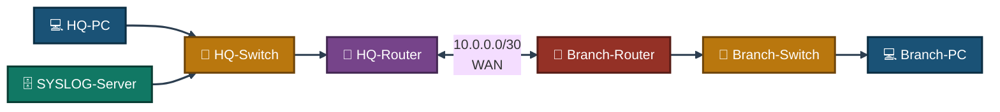
<p align="center"><em>The Syslog server lives on the HQ LAN, but both HQ-Router and Branch-Router — plus both switches — send their logs to it across the static-routed WAN link.</em></p>

---

<a id="syslog-acl-security-design"></a>
## 🔒 Syslog & ACL Security Design

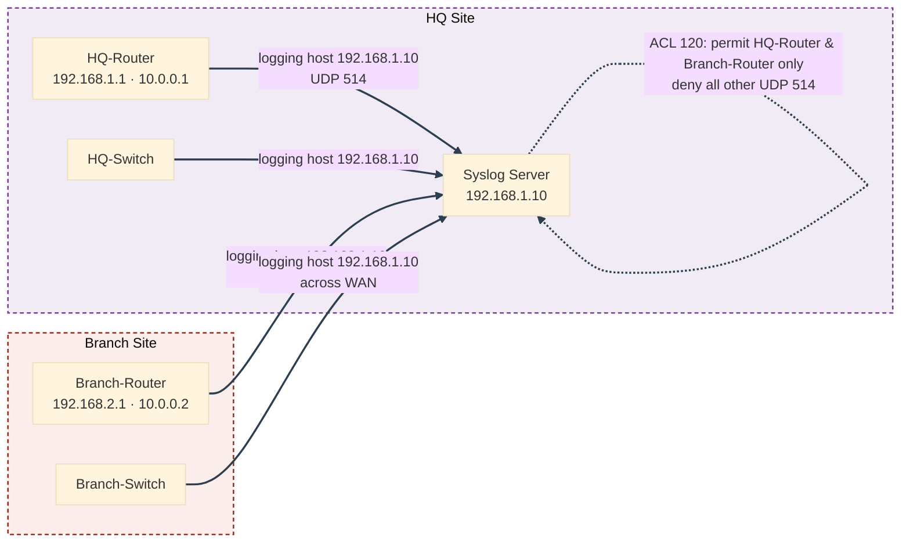
<p align="center"><em>Every device — including the two switches — sends logs to the same server, but ACL 120 on HQ-Router's inbound interface means only the two routers' legitimate addresses are actually allowed to reach UDP 514.</em></p>

---

<a id="ip-addressing-plan"></a>
## 🗂️ IP Addressing Plan

| Device | Interface | IP Address | Subnet Mask | Gateway |
|--------|-----------|------------|--------------|---------|
| HQ-Router | G0/0 | 192.168.1.1 | 255.255.255.0 | — |
| HQ-Router | G0/1 | 10.0.0.1 | 255.255.255.252 | — |
| Branch-Router | G0/0 | 192.168.2.1 | 255.255.255.0 | — |
| Branch-Router | G0/1 | 10.0.0.2 | 255.255.255.252 | — |
| HQ-PC | FastEthernet0 | 192.168.1.20 | 255.255.255.0 | 192.168.1.1 |
| Branch-PC | FastEthernet0 | 192.168.2.20 | 255.255.255.0 | 192.168.2.1 |
| SYSLOG-Server | FastEthernet0 | 192.168.1.10 | 255.255.255.0 | 192.168.1.1 |

---

<a id="module-1"></a>
## 🏗️ Module 1 — Build the Topology

**Objective:** Wire both routers, both switches, the Syslog server, and both PCs per the connections table above.

### Step 1 — Build Topology ✅

No CLI commands in this step — physical/logical wiring done in the Packet Tracer GUI (drag devices, connect cables per the table above).

<p align="center">
  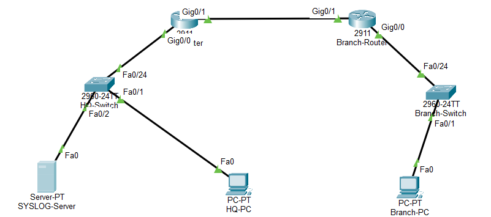<br>
  <em>Exhibit 1 — Full topology: HQ and Branch sites joined by the WAN link, Syslog server on the HQ LAN</em>
</p>

---

<a id="module-2"></a>
## ⚙️ Module 2 — Router IP Addressing

**Objective:** Address both routers' LAN and WAN-facing interfaces and bring them up.

### Step 2 — IP Addressing (Routers) ✅

```
HQ-Router(config)# interface g0/0
HQ-Router(config-if)# ip address 192.168.1.1 255.255.255.0
HQ-Router(config-if)# no shutdown
HQ-Router(config-if)# exit
HQ-Router(config)# interface g0/1
HQ-Router(config-if)# ip address 10.0.0.1 255.255.255.252
HQ-Router(config-if)# no shutdown
```
```
Branch-Router(config)# interface g0/0
Branch-Router(config-if)# ip address 192.168.2.1 255.255.255.0
Branch-Router(config-if)# no shutdown
Branch-Router(config-if)# exit
Branch-Router(config)# interface g0/1
Branch-Router(config-if)# ip address 10.0.0.2 255.255.255.252
Branch-Router(config-if)# no shutdown
```

<p align="center">
  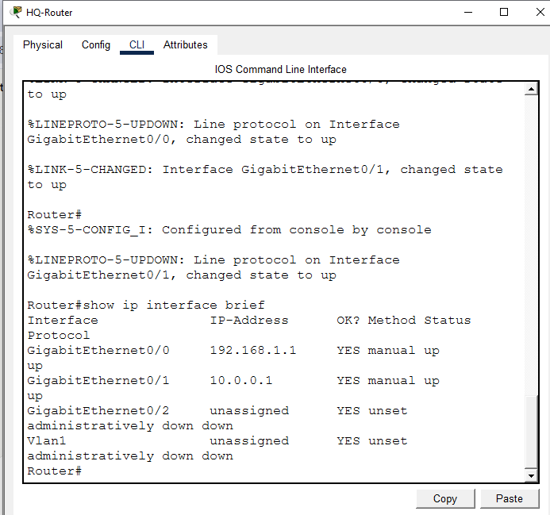<br>
  <em>Exhibit 2a — HQ-Router's LAN and WAN interfaces addressed and brought up</em>
</p>
<p align="center">
  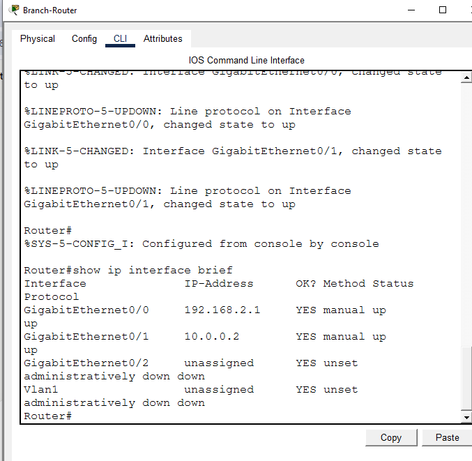<br>
  <em>Exhibit 2b — Branch-Router's LAN and WAN interfaces addressed and brought up</em>
</p>

---

<a id="module-3"></a>
## 💻 Module 3 — End Device IP Addressing

**Objective:** Set static IPs on HQ-PC, Branch-PC, and the Syslog server.

### Step 3 — IP Addressing (HQ-PC, Branch-PC, SYSLOG-Server) ✅

Set via Desktop → IP Configuration on each device:
```
HQ-PC: IP 192.168.1.20, Mask 255.255.255.0, Gateway 192.168.1.1
Branch-PC: IP 192.168.2.20, Mask 255.255.255.0, Gateway 192.168.2.1
SYSLOG-Server: IP 192.168.1.10, Mask 255.255.255.0, Gateway 192.168.1.1
```

<p align="center">
  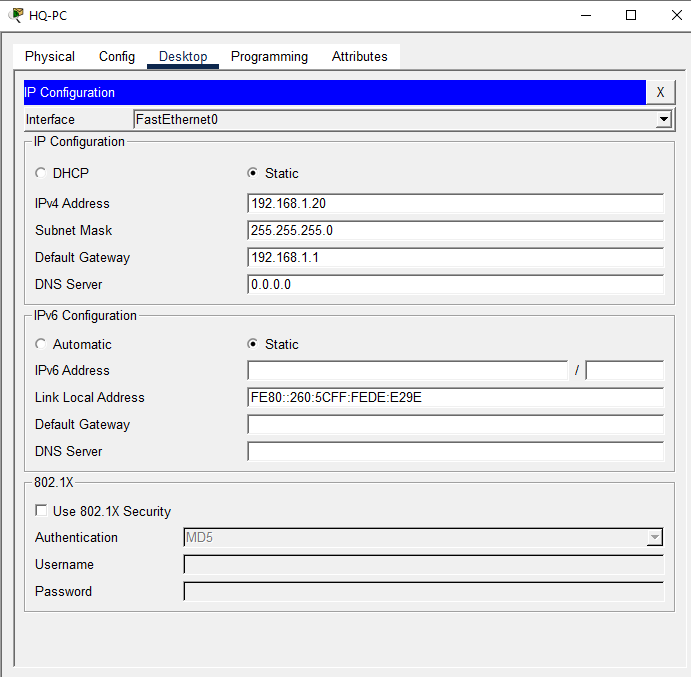<br>
  <em>Exhibit 3 — HQ-PC addressed per the IP addressing plan</em>
</p>

---

<a id="module-4"></a>
## 🧭 Module 4 — Static Routing (HQ ↔ Branch)

**Objective:** Add static routes so HQ and Branch, on different subnets, can reach each other across the WAN link.

### Step 4 — Static Routing ✅

```
HQ-Router(config)# ip route 192.168.2.0 255.255.255.0 10.0.0.2
Branch-Router(config)# ip route 192.168.1.0 255.255.255.0 10.0.0.1
```

<p align="center">
  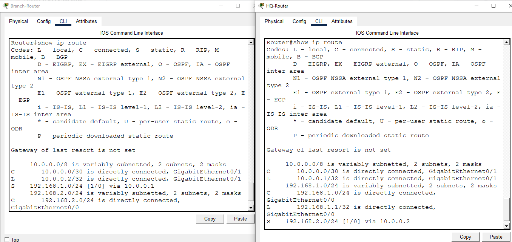<br>
  <em>Exhibit 4 — Static routes configured on both routers for cross-site reachability</em>
</p>

---

<a id="module-5"></a>
## 📶 Module 5 — Connectivity Test

**Objective:** Confirm HQ-PC can reach Branch-PC across the WAN link before configuring logging.

### Step 5 — Connectivity Test (HQ ↔ Branch) ✅

```
HQ-PC> ping 192.168.2.20
```

<p align="center">
  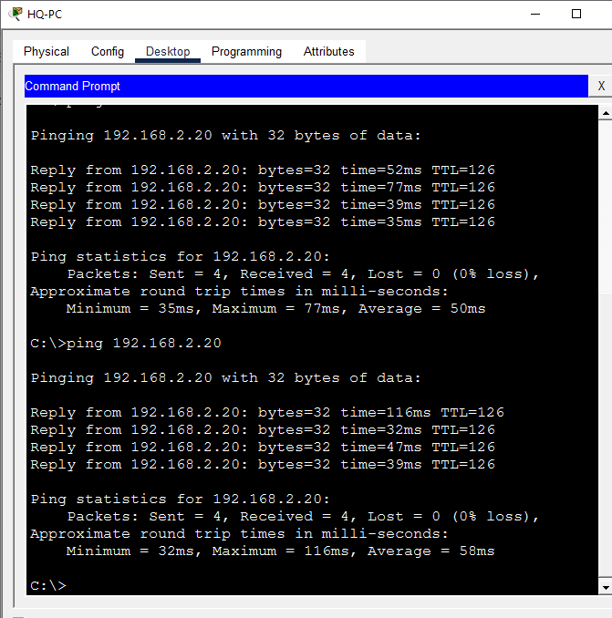<br>
  <em>Exhibit 5 — HQ-PC successfully pings Branch-PC across the static-routed WAN</em>
</p>

---

<a id="module-6"></a>
## 🟢 Module 6 — Enable Syslog Service

**Objective:** Turn on the Syslog server's listener so it can start receiving log messages.

### Step 6 — Enable Syslog Service on the Server ✅

```
SYSLOG-Server > Services tab > SYSLOG > Service: On
```

<p align="center">
  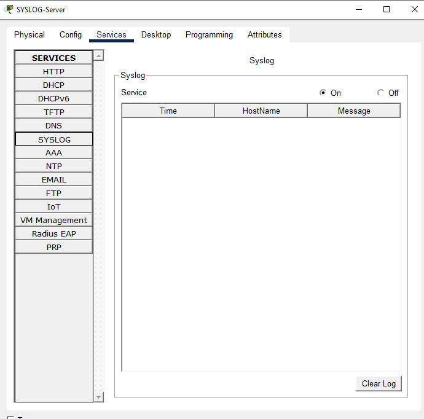<br>
  <em>Exhibit 6 — Syslog service enabled on the server</em>
</p>

---

<a id="module-7"></a>
## ⏱️ Module 7 — Enable Accurate Log Timestamps

**Objective:** Add datetime/msec timestamps to log messages so each entry can be traced to an exact time.

### Step 7 — Enable Accurate Log Timestamps ✅

```
HQ-Router(config)# service timestamps log datetime msec
Branch-Router(config)# service timestamps log datetime msec
```

<p align="center">
  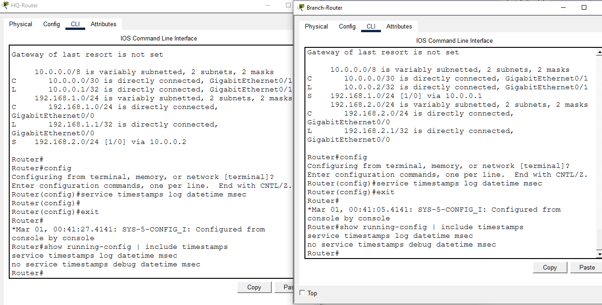<br>
  <em>Exhibit 7 — Timestamp service enabled on both routers</em>
</p>

---

<a id="module-8"></a>
## 📡 Module 8 — Point HQ-Router to the Syslog Server

**Objective:** Set the logging host and severity trap level on HQ-Router.

### Step 8 — Point HQ-Router to the Syslog Server ✅

```
HQ-Router(config)# logging host 192.168.1.10
HQ-Router(config)# logging trap debugging
```

<p align="center">
  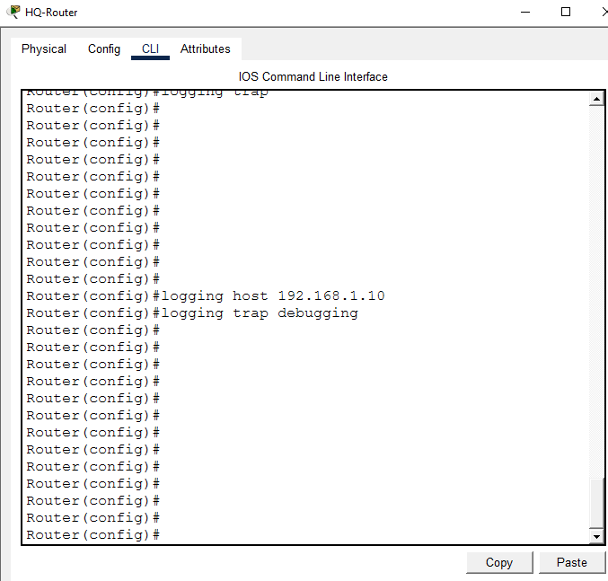<br>
  <em>Exhibit 8 — HQ-Router configured to send logs to the Syslog server</em>
</p>

---

<a id="module-9"></a>
## 📡 Module 9 — Point Branch-Router to the Syslog Server

**Objective:** Set the logging host and severity trap level on Branch-Router.

### Step 9 — Point Branch-Router to the Syslog Server ✅

```
Branch-Router(config)# logging host 192.168.1.10
Branch-Router(config)# logging trap debugging
```

<p align="center">
  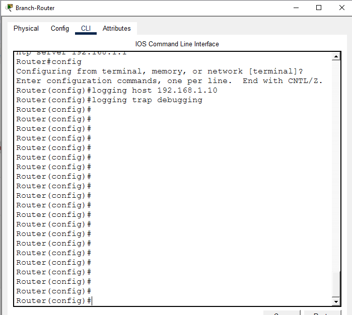<br>
  <em>Exhibit 9 — Branch-Router configured to send logs to the Syslog server across the WAN</em>
</p>

---

<a id="module-10"></a>
## 📡 Module 10 — Point Both Switches to the Syslog Server

**Objective:** Set the logging host and severity trap level on both access-layer switches.

### Step 10 — Point Both Switches to the Syslog Server ✅

```
HQ-Switch(config)# logging host 192.168.1.10
HQ-Switch(config)# logging trap debugging
Branch-Switch(config)# logging host 192.168.1.10
Branch-Switch(config)# logging trap debugging
```

<p align="center">
  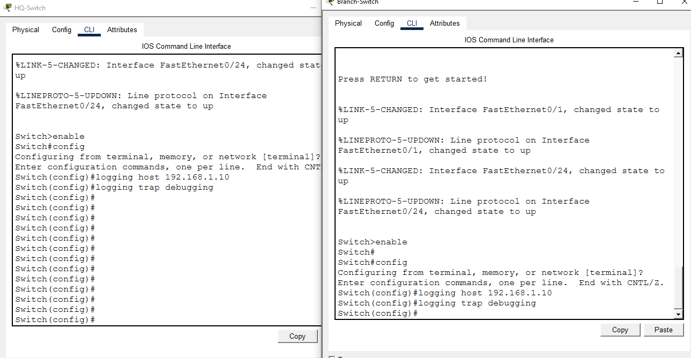<br>
  <em>Exhibit 10 — Both switches configured to send logs to the Syslog server</em>
</p>

---

<a id="module-11"></a>
## ✂️ Module 11 — Trigger a Real Log Event

**Objective:** Generate a genuine log message by flapping Branch-Router's LAN interface.

### Step 11 — Trigger a Real Log Event ✅

```
Branch-Router(config)# interface g0/0
Branch-Router(config-if)# shutdown
Branch-Router(config-if)# no shutdown
```

<p align="center">
  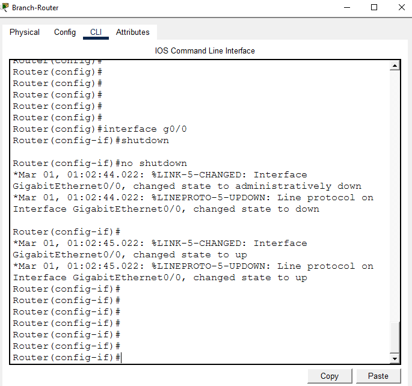<br>
  <em>Exhibit 11 — Branch-Router's LAN interface flapped to generate a real log event</em>
</p>

---

<a id="module-12"></a>
## 📥 Module 12 — Confirm the Log Reached the Server

**Objective:** Read the Syslog server's log table to confirm the Branch-sourced entry actually crossed the WAN.

### Step 12 — Confirm the Log Reached the Server (Cross-WAN Proof) ✅

```
SYSLOG-Server > Services > SYSLOG > log table
```

<p align="center">
  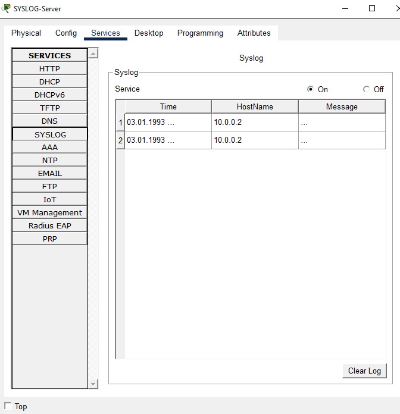<br>
  <em>Exhibit 12 — Server's log table shows the entry generated by Branch-Router's interface flap</em>
</p>

---

<a id="module-13"></a>
## 🔒 Module 13 — Restrict Syslog Traffic with an ACL

**Objective:** Harden the logging path so only HQ-Router and Branch-Router can send traffic to the server's UDP 514 port.

### Step 13 — Restrict Syslog Traffic with an ACL (Security Hardening) ✅

```
HQ-Router(config)# access-list 120 permit udp host 192.168.1.1 host 192.168.1.10 eq 514
HQ-Router(config)# access-list 120 permit udp host 10.0.0.1 host 192.168.1.10 eq 514
HQ-Router(config)# access-list 120 deny udp any host 192.168.1.10 eq 514
HQ-Router(config)# access-list 120 permit ip any any
HQ-Router(config)# interface g0/0
HQ-Router(config-if)# ip access-group 120 in
```

<p align="center">
  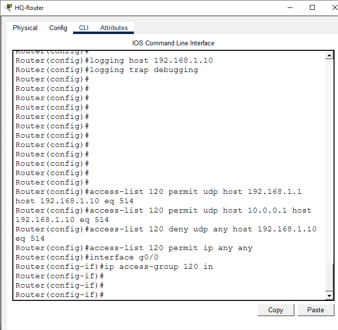<br>
  <em>Exhibit 13 — ACL 120 restricting UDP 514 access to the two authorized routers</em>
</p>

---

<a id="module-14"></a>
## ✅ Module 14 — Verify the ACL

**Objective:** Confirm the ACL's rules and hit counters are correct.

### Step 14 — Verify the ACL ✅

```
HQ-Router# show access-lists
```

<p align="center">
  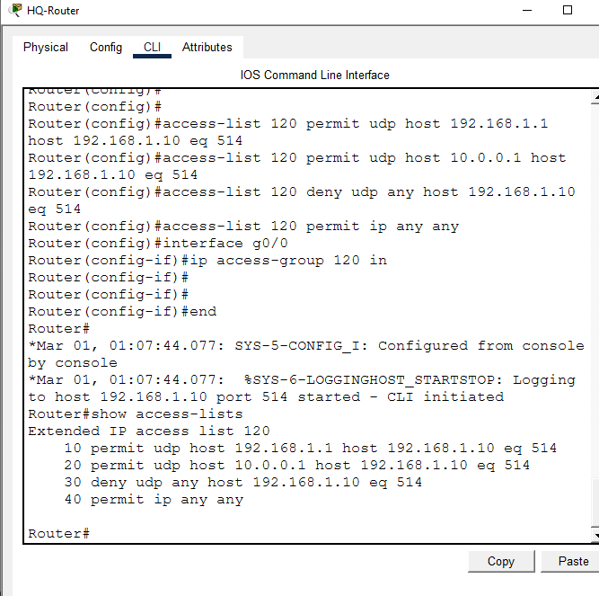<br>
  <em>Exhibit 14 — ACL 120's rules and match counters confirmed</em>
</p>

---

<a id="module-15"></a>
## 🧾 Module 15 — Final Verification

**Objective:** Confirm logging state and the running-config's logging-related lines.

### Step 15 — Final Verification ✅

```
HQ-Router# show logging
HQ-Router# show running-config | include logging
```

<p align="center">
  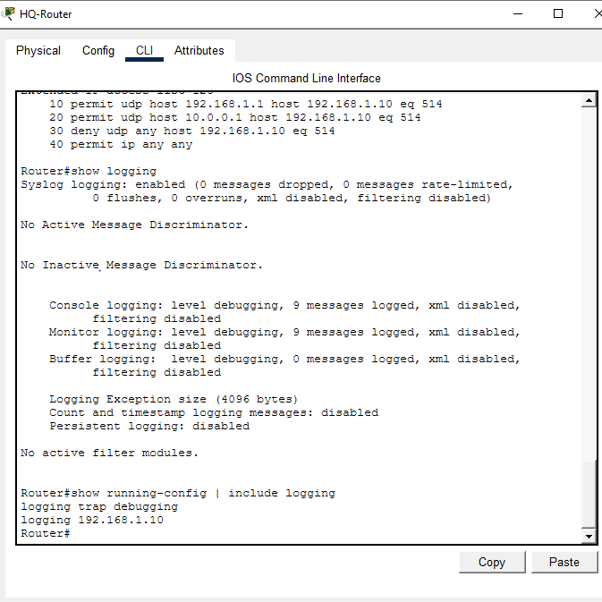<br>
  <em>Exhibit 15 — Logging configuration and buffer confirmed on HQ-Router</em>
</p>

---

<a id="module-16"></a>
## 💾 Module 16 — Save Configuration

**Objective:** Persist the running configuration on all four network devices.

### Step 16 — Save Configuration ✅

```
HQ-Router# copy running-config startup-config
Branch-Router# copy running-config startup-config
HQ-Switch# copy running-config startup-config
Branch-Switch# copy running-config startup-config
```

<p align="center">
  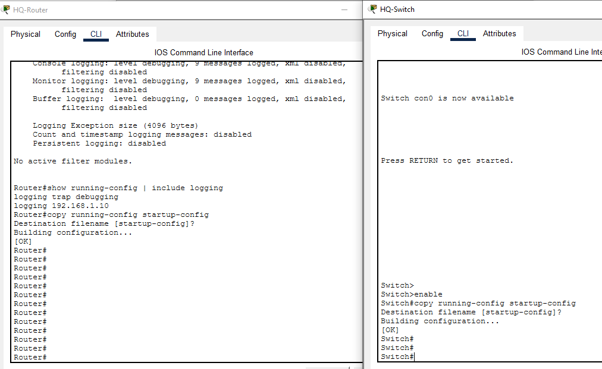<br>
  <em>Exhibit 16 — Running configuration saved on all four devices</em>
</p>

---

<a id="coverage-snapshot"></a>
## 🌟 Coverage Snapshot

| 🛡️ Layer | ✅ Status | 📌 Detail |
|---|---|---|
| Topology | Live | Both sites, both switches, Syslog server, and both PCs wired (Exhibit 1) |
| Router addressing | Live | Both routers' LAN and WAN interfaces addressed (Exhibits 2a–2b) |
| End device addressing | Live | HQ-PC, Branch-PC, and Syslog server addressed (Exhibit 3) |
| Static routing | Live | HQ and Branch routes exchanged (Exhibit 4) |
| Cross-site connectivity | Proven | HQ-PC to Branch-PC ping succeeds (Exhibit 5) |
| Syslog service | Live | Server's Syslog listener enabled (Exhibit 6) |
| Timestamping | Live | Datetime/msec timestamps enabled on both routers (Exhibit 7) |
| Router logging | Live | Both routers pointed at the Syslog server (Exhibits 8–9) |
| Switch logging | Live | Both switches pointed at the Syslog server (Exhibit 10) |
| Cross-WAN log delivery | Proven | A real Branch-sourced log event confirmed in the server's log table (Exhibits 11–12) |
| ACL hardening | Proven | UDP 514 access restricted to the two authorized routers, rules verified (Exhibits 13–14) |
| Final state & persistence | Live | Logging config confirmed, running-config saved on all devices (Exhibits 15–16) |

---

<a id="command-summary"></a>
## 📟 Command Summary

| Command | Purpose |
|---------|---------|
| `ip address` / `no shutdown` | Bring up an interface |
| `ip route` | Static route for inter-site reachability |
| `service timestamps log datetime msec` | Add accurate timestamps to log messages |
| `logging host` | Set the Syslog server's IP |
| `logging trap debugging` | Set the severity level of logs sent to the server |
| `interface g0/0` + `shutdown` / `no shutdown` | Generate a real log event for testing |
| `access-list 120 ...` | Restrict which devices can reach the Syslog server |
| `ip access-group 120 in` | Apply the ACL to an interface |
| `show access-lists` | Verify ACL rules and hit counters |
| `show logging` | View local log buffer and logging configuration |
| `copy running-config startup-config` | Save configuration |

---

<a id="challenges-fixes"></a>
## ⚠️ Challenges & Fixes

| ❌ Challenge | ✅ Solution |
|---|---|
| `logging trap informational` was rejected as invalid input on this router's IOS image | Ran `logging trap ?` to see supported keywords — this Packet Tracer image only supported `debugging`, so switched to `logging trap debugging` |
| Originally planned to include NTP time sync (`ntp master` / `ntp server`) between sites | Branch-Router consistently showed "unsynchronized, stratum 16, never updated" even with the command correctly applied — a known Packet Tracer NTP simulation limitation. Rather than fake a synced screenshot, the NTP step was dropped from the lab entirely |

---

<a id="scope-limitations"></a>
## 🚧 Scope & Limitations

- **Simulation only:** Built and verified in Cisco Packet Tracer, not on physical hardware.
- **No NTP synchronization:** Timestamps use each device's local clock, not a synchronized time source — dropped due to a Packet Tracer NTP simulation limitation, not a config error.
- **Single Syslog server, no redundancy:** All logs flow to one server with no secondary collector or failover path.
- **UDP transport only:** Syslog runs over its default UDP 514; a more secure syslog-over-TLS transport wasn't explored.
- **ACL applied at one point:** The hardening ACL is applied only on HQ-Router's inbound LAN interface, not replicated at the Branch site.

These limits are stated so the lab is read as a centralized-logging fundamentals exercise, not a production SIEM/log-management deployment.

---

<a id="what-i-learned"></a>
## 🧠 What I Learned

- **Centralizing logs from multiple devices and sites makes cross-site visibility possible** — without static routing between HQ and Branch, the Branch devices' logs would have nowhere to go.
- **A log message existing doesn't prove it reached the server** — the real proof is reading the server's own log table and finding the entry, which is why the interface-flap test was paired with a server-side check.
- **Timestamps matter for correlating events across sites**, even without full NTP sync — `service timestamps log datetime msec` at least makes each device's own log entries individually traceable.
- **Restricting who can write to a Syslog server is itself a security control** — without the ACL, any device on the network could send spoofed or injected log entries to the same server.

---

<a id="skills-demonstrated"></a>
## 🛠️ Skills Demonstrated

- Designing a two-site topology with a static-routed WAN link
- Centralizing logging from multiple routers and switches to one Syslog server
- Enabling accurate log timestamps for event traceability
- Generating and verifying a real cross-WAN log event end-to-end
- Hardening a logging service with an ACL restricted to authorized source addresses
- Diagnosing an unsupported IOS keyword and a Packet Tracer NTP simulation limitation
- Verifying ACL behavior with `show access-lists` hit counters

---

<a id="screenshot-index"></a>
## 🖼️ Screenshot Index

| # | File | Shows |
|:---:|---|---|
| 1 | `01-topology-overview.PNG` | Full topology after wiring |
| 2a | `02a-hq-router-ip.PNG` | HQ-Router interface addressing |
| 2b | `02b-branch-router-ip.PNG` | Branch-Router interface addressing |
| 3 | `3-hq-pc-ip-config.PNG` | HQ-PC IP configuration |
| 4 | `4-routing-config.PNG` | Static routes on both routers |
| 5 | `5-ping-test.PNG` | HQ-PC to Branch-PC ping success |
| 6 | `6-syslog-service-on.PNG` | Syslog service enabled on the server |
| 7 | `7-timestamp-config.PNG` | Timestamp service on both routers |
| 8 | `8-hq-router-logging.PNG` | HQ-Router logging host configuration |
| 9 | `9-branch-router-logging.PNG` | Branch-Router logging host configuration |
| 10 | `10-switch-logging.PNG` | Both switches' logging host configuration |
| 11 | `11-trigger-log-event.PNG` | Branch-Router interface flap |
| 12 | `12-syslog-server-log-received.PNG` | Server log table showing the Branch-sourced entry |
| 13 | `13-syslog-acl.PNG` | ACL 120 configuration |
| 14 | `14-acl-verify.PNG` | ACL rules and hit counters |
| 15 | `15-final-verification.PNG` | Logging state and running-config check |
| 16 | `16-save-all-configs.PNG` | Configuration saved on all four devices |

---

<a id="repo-structure"></a>
## 📁 Repo Structure

```text
11-enterprise-multisite-syslog-server/
|-- README.md
|-- syslog-multisite-logging-enterprise.pkt
`-- screenshots/
    |-- 01-topology-overview.PNG
    |-- 02a-hq-router-ip.PNG
    |-- 02b-branch-router-ip.PNG
    |-- 3-hq-pc-ip-config.PNG
    |-- 4-routing-config.PNG
    |-- 5-ping-test.PNG
    |-- 6-syslog-service-on.PNG
    |-- 7-timestamp-config.PNG
    |-- 8-hq-router-logging.PNG
    |-- 9-branch-router-logging.PNG
    |-- 10-switch-logging.PNG
    |-- 11-trigger-log-event.PNG
    |-- 12-syslog-server-log-received.PNG
    |-- 13-syslog-acl.PNG
    |-- 14-acl-verify.PNG
    |-- 15-final-verification.PNG
    `-- 16-save-all-configs.PNG
```

<div align="center">

🗄️ **[Configuring Syslog on Cisco IOS](https://www.cisco.com/c/en/us/support/docs/ip/simple-network-management-protocol-snmp/13617-21.html)** · 🔒 **[Access Control Lists Overview](https://www.cisco.com/c/en/us/support/docs/ip/access-lists/26448-ACLsamples.html)** · ⏱️ **[Understanding Cisco Log Timestamps](https://www.cisco.com/c/en/us/support/docs/dial-access/asynchronous-connections/15104-logtrouble.html)**

</div>
