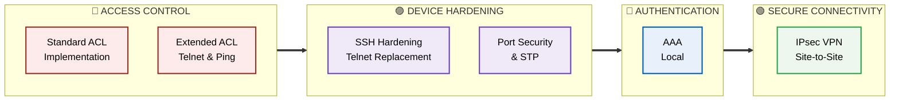
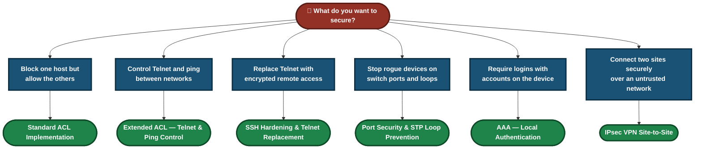
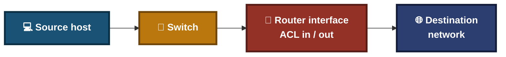
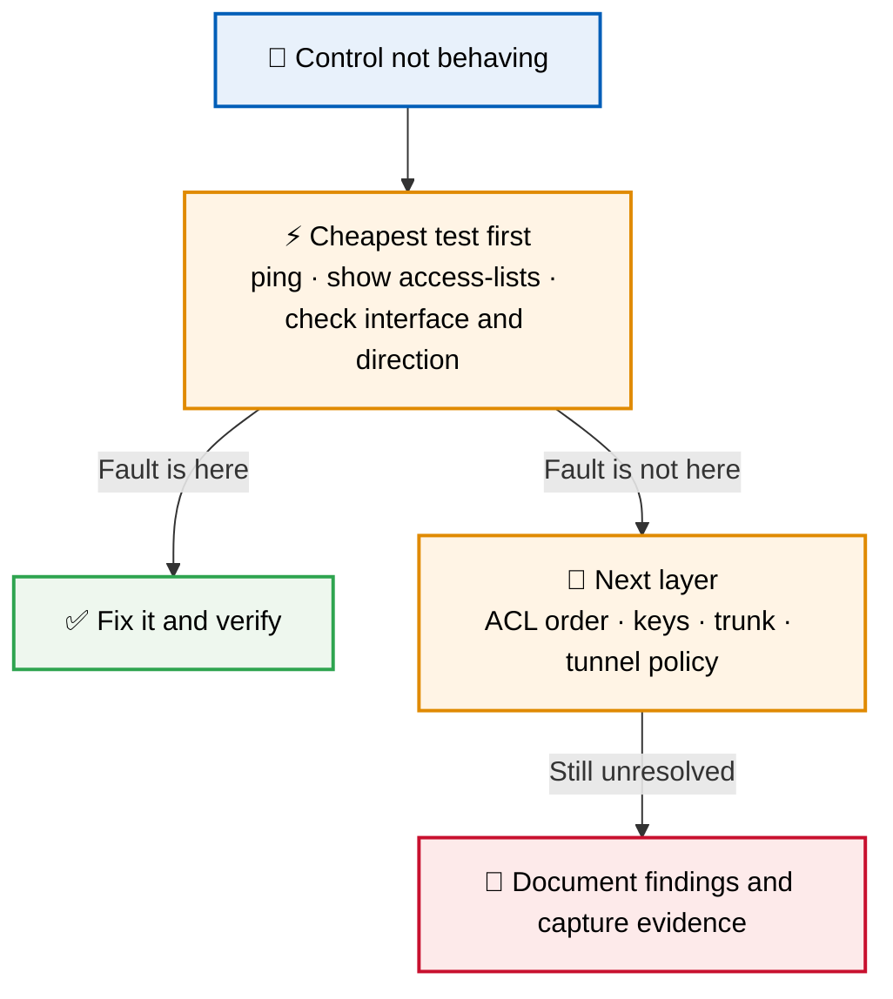
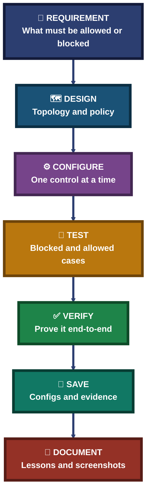

<div align="center">

# 🔐 Network Security Labs — Access Control, Hardening, Authentication & Secure Connectivity

**6 Labs · ACLs → Device Hardening → AAA → IPsec VPN · Cisco Packet Tracer**

Six hands-on Cisco network security labs, each documenting the topology, the configuration, the tests and the result — from the first design decision to the final verification.


Every lab follows one method: design the plan, configure one control at a time, test that it blocks what it should and allows what it should, and keep the evidence.

### [📂 Jump to the labs](#labs-index)

</div>

---

## 📑 Table of Contents

1. [At a Glance](#at-a-glance)
2. [About This Folder](#about)
3. [Tools & Technologies](#tools)
4. [The Lab Flow](#flow)
5. [Which Lab Do I Need?](#which-lab)
6. [Access Control (2 labs)](#access-control)
7. [Device Hardening (2 labs)](#hardening)
8. [Authentication (1 lab)](#authentication)
9. [Secure Connectivity (1 lab)](#connectivity)
10. [Coverage Snapshot](#coverage-snapshot)
11. [Security Method Pipeline](#pipeline)
12. [Verification, Not Assumption](#verification)
13. [Command & Setting Cheat Sheet](#cheat-sheet)
14. [Challenges & Fixes at a Glance](#problems-fixes)
15. [Scope & Limitations](#scope-limitations)
16. [What I Learned](#what-i-learned)
17. [Skills Demonstrated](#skills-demonstrated)
18. [Labs Index](#labs-index)
19. [Repo Structure](#repo-structure)

---

<a id="at-a-glance"></a>
## 📊 At a Glance

| 📄 Labs | 🧩 Topic Groups | 🛠 Main Tool | 📁 Each Lab Has |
|:---:|:---:|:---:|:---:|
| **6** | **4** | **Cisco Packet Tracer** | **README · screenshots** |

---

<a id="about"></a>
## 📖 About This Folder

This folder holds six network security labs. Each lab lives in its own folder with a README that documents the objective, tools, topology, step-by-step configuration, screenshots, commands used, challenges and lessons learned.

- **Access Control:** Standard and extended ACLs that permit or deny traffic by source, protocol and port.
- **Device Hardening:** Replacing Telnet with SSH, and protecting switch ports with port security, BPDU guard and PortFast.
- **Authentication:** Local AAA with usernames, passwords and privilege levels.
- **Secure Connectivity:** A site-to-site IPsec VPN with IKE phase 1 and 2, transform sets and crypto maps.

> [!NOTE]
> These are simulated labs built in Cisco Packet Tracer. Screenshots are inside each lab folder.

<div align="center">

### 🧩 Lab Workflow at a Glance

<table>
<tr>
<td align="center" valign="top" width="18%">

**🗺 Design**<br>
<sub>Topology and<br>security goal</sub>

</td>
<td align="center" valign="middle" width="5%">

**➜**

</td>
<td align="center" valign="top" width="20%">

**⚙️ Configure**<br>
<sub>One control<br>at a time</sub>

</td>
<td align="center" valign="middle" width="5%">

**➜**

</td>
<td align="center" valign="top" width="18%">

**🔎 Test**<br>
<sub>Blocked stays blocked,<br>allowed stays allowed</sub>

</td>
<td align="center" valign="middle" width="5%">

**➜**

</td>
<td align="center" valign="top" width="18%">

**✅ Verify**<br>
<sub>Prove the control<br>end-to-end</sub>

</td>
<td align="center" valign="middle" width="5%">

**➜**

</td>
<td align="center" valign="top" width="16%">

**📝 Document**<br>
<sub>Save configs<br>and evidence</sub>

</td>
</tr>
<tr>
<td colspan="9" align="center">


<br>
<sub>Cisco IOS show commands and simple client tests, all inside Packet Tracer</sub>

</td>
</tr>
</table>

</div>

---

<a id="tools"></a>
## 🛠️ Tools & Technologies

| Tool | Purpose |
|------|---------|
| Cisco Packet Tracer | Network simulation |
| Cisco routers / switches | Enforcement points for ACLs, SSH, port security and VPN |
| Standard & Extended ACLs | Permit or deny traffic by source, protocol and port |
| Named ACLs | Readable, editable rules in place of numbered lists |
| SSH v2 & RSA keys | Encrypted remote management in place of Telnet |
| VTY line hardening | Restricting how remote sessions can connect |
| Port Security, BPDU Guard, PortFast | Protecting switch ports and preventing loops |
| AAA (local) | Usernames, passwords and privilege levels on the device |
| IPsec VPN (IKE, transform sets, crypto maps) | Encrypted site-to-site tunnel |

---

<a id="flow"></a>
## ⏱️ The Lab Flow



<p align="center"><em>The groups show which topic each lab belongs to. Lab numbers are in the Labs Index.</em></p>

---

<a id="which-lab"></a>
## 🧭 Which Lab Do I Need?



---

<a id="access-control"></a>
## 🔴 Access Control (2 labs)

**Goal:** Decide exactly which traffic is allowed and which is denied, and prove it.

| Focus | What the Lab Covers | Folder |
|---|---|:---:|
| Standard ACL Implementation | A 3-router, 2-switch, 5-host topology (Branch-R1, Core-R2, HQ-R3). A standard ACL on Core-R2 denies Branch-PC1 by host IP while permitting Branch-PC0. Built first as numbered ACL 10, then migrated to a named ACL `BLOCK_PC1`, with the old ACL removed and the result re-verified. | [📁 Lab](./06-Standard_ACL_Implementation/) |
| Extended ACL — Telnet & Ping Control | Port-based filtering, traffic direction and named ACLs to control Telnet and ping. | [📁 Lab](./02-Extended_ACL_Telnet_Ping_Control/) |

### Where Traffic Gets Filtered



---

<a id="hardening"></a>
## 🟣 Device Hardening (2 labs)

**Goal:** Close the easy ways into a switch or router, and stop layer-2 problems before they spread.

| Focus | What the Lab Covers | Folder |
|---|---|:---:|
| SSH Hardening & Telnet Replacement | RSA keys, SSH v2 and VTY line hardening to replace Telnet. | [📁 Lab](./05-SSH_Hardening_Telnet_Replacement/) |
| Port Security & STP Loop Prevention | MAC filtering, sticky MAC, BPDU guard and PortFast. | [📁 Lab](./04-Port_Security_STP_Loop_Prevention/) |

---

<a id="authentication"></a>
## 🔵 Authentication (1 lab)

**Goal:** Make every login to a device tied to an account and a privilege level.

| Focus | What the Lab Covers | Folder |
|---|---|:---:|
| AAA — Local Authentication | Username and password accounts, privilege levels and local AAA. | [📁 Lab](./01-AAA_Local_Authentication/) |

### Where Access Is Controlled


---

<a id="connectivity"></a>
## 🟢 Secure Connectivity (1 lab)

**Goal:** Carry traffic between two sites over an untrusted network without exposing it.

| Focus | What the Lab Covers | Folder |
|---|---|:---:|
| IPsec VPN Site-to-Site | IKE phase 1 and 2, transform sets and crypto maps to build an encrypted tunnel between sites. | [📁 Lab](./03-IPsec_VPN_Site_to_Site/) |

### 🔍 Analyst Note — Why the Simple Test Comes First

Every lab checks the cheapest thing first. It rules out a whole group of causes in seconds.



---

<a id="coverage-snapshot"></a>
## 🌟 Coverage Snapshot

| 🛡️ Domain | 📌 Where It Appears | ✅ What Is Shown |
|---|---|---|
| Traffic Filtering | Standard ACL, Extended ACL labs | Permit and deny rules, wildcard masks, named ACLs, ports and direction |
| Secure Remote Management | SSH Hardening lab | RSA keys, SSH v2, VTY restrictions |
| Layer-2 Protection | Port Security & STP lab | Sticky MAC, BPDU guard, PortFast, loop prevention |
| Authentication | AAA Local lab | Local accounts and privilege levels |
| Encrypted Connectivity | IPsec VPN lab | IKE phases, transform sets, crypto maps |

---

<a id="pipeline"></a>
## 🧭 Security Method Pipeline

How every lab turns a security requirement into a verified control



---

<a id="verification"></a>
## ✅ Verification, Not Assumption

A recurring rule across the labs: a security control is not done until it has been tested in both directions — what it should block, and what it should still allow.

| Lab | Verification Step |
|---|---|
| Standard ACL Implementation | Branch-PC1 denied and Branch-PC0 permitted; after migrating from numbered ACL 10 to the named ACL `BLOCK_PC1` and removing the old ACL, the result was re-verified |
| All other labs | See the verification step in each lab's README |

---

<a id="cheat-sheet"></a>
## 🧾 Command & Setting Cheat Sheet

| Command | Purpose |
|---------|---------|
| `access-list <number> deny/permit host <ip>` | Numbered standard ACL entry |
| `ip access-list standard/extended <name>` | Create a named ACL |
| `ip access-group <name> in/out` | Apply an ACL to an interface |
| `show access-lists` | Check ACL rules and hit counters |
| `crypto key generate rsa` + `ip ssh version 2` | Generate keys and enable SSH v2 |
| `line vty 0 4` + `transport input ssh` | Allow only SSH on remote lines |
| `switchport port-security` + `switchport port-security mac-address sticky` | Limit and learn MAC addresses on a port |
| `spanning-tree bpduguard enable` / `spanning-tree portfast` | Protect edge ports and speed link-up |
| `username <name> privilege <level> secret <password>` + `aaa new-model` | Local accounts and AAA |
| `crypto isakmp policy` / `crypto map` | IKE phase 1 policy and VPN crypto map |
| `copy running-config startup-config` | Save configuration |

> Common IOS commands for these topics. Check the exact commands used in each lab against that lab's README.

---

<a id="problems-fixes"></a>
## ⚠️ Challenges & Fixes at a Glance

| ❌ Challenge | ✅ Solution |
|---|---|
| Moving a working numbered ACL to a named ACL without leaving stale rules behind | Built the named ACL `BLOCK_PC1`, removed the old numbered ACL 10, and re-verified that PC1 stayed blocked and PC0 stayed permitted |
| Other labs | See the Challenges & Fixes section in each lab's README |

---

<a id="scope-limitations"></a>
## 🚧 Scope & Limitations

- **Simulated networks:** Built in Cisco Packet Tracer, not on physical devices.
- **Evidence lives in the lab folders:** Screenshots are stored in each lab's folder.
- **Cisco syntax:** Commands shown are Cisco IOS. Other vendors use different syntax.
- **One design per lab:** Other valid designs for the same goal are not covered.
- **Not a production template:** Real networks need their own security review and change control.

These limits are stated so the labs are read as demonstrations, not as guaranteed designs.

---

<a id="what-i-learned"></a>
## 🧠 What I Learned

- **Test both directions.** A control that blocks the target is only half proven; the hosts that should still work must be checked too.
- **Clean up after a migration.** Moving from a numbered ACL to a named one means removing the old one and re-verifying.
- **Replace weak protocols, don't just add strong ones.** SSH is only a gain once Telnet is actually turned off.
- **Change one thing at a time and test layer by layer.** Otherwise the real cause stays unknown.
- **Save the evidence.** Configs, outputs and screenshots make each lab repeatable.

---

<a id="skills-demonstrated"></a>
## 🛠️ Skills Demonstrated

- Writing and applying standard and extended ACLs, including named ACLs
- Hardening remote management with SSH v2, RSA keys and VTY restrictions
- Protecting switch ports with port security, BPDU guard and PortFast
- Configuring local AAA with usernames and privilege levels
- Building a site-to-site IPsec VPN with IKE phases, transform sets and crypto maps
- Verifying security controls in both the blocked and allowed direction
- Documenting each lab with commands, screenshots and lessons

---

<a id="labs-index"></a>
## 📂 Labs Index

| Lab # | Lab | Group | Folder |
|:---:|---|:---:|---|
| 01 | AAA — Local Authentication | Authentication | [`01-AAA_Local_Authentication`](./01-AAA_Local_Authentication/) |
| 02 | Extended ACL — Telnet & Ping Control | Access Control | [`02-Extended_ACL_Telnet_Ping_Control`](./02-Extended_ACL_Telnet_Ping_Control/) |
| 03 | IPsec VPN Site-to-Site | Connectivity | [`03-IPsec_VPN_Site_to_Site`](./03-IPsec_VPN_Site_to_Site/) |
| 04 | Port Security & STP Loop Prevention | Hardening | [`04-Port_Security_STP_Loop_Prevention`](./04-Port_Security_STP_Loop_Prevention/) |
| 05 | SSH Hardening & Telnet Replacement | Hardening | [`05-SSH_Hardening_Telnet_Replacement`](./05-SSH_Hardening_Telnet_Replacement/) |
| 06 | Standard ACL Implementation | Access Control | [`06-Standard_ACL_Implementation`](./06-Standard_ACL_Implementation/) |

---

<a id="repo-structure"></a>
## 📁 Repo Structure

```text
Cisco-Networking-Lab-Portfolio/
|-- 01-Networking/
|-- 02-Network-Security/
|   |-- README.md
|   |-- 01-AAA_Local_Authentication/
|   |-- 02-Extended_ACL_Telnet_Ping_Control/
|   |-- 03-IPsec_VPN_Site_to_Site/
|   |-- 04-Port_Security_STP_Loop_Prevention/
|   |-- 05-SSH_Hardening_Telnet_Replacement/
|   `-- 06-Standard_ACL_Implementation/
|-- 03-IT-Support-Troubleshooting/
|-- LICENSE
`-- README.md
```

<div align="center">

🔐 **[What is an ACL](https://www.cloudflare.com/learning/access-management/what-is-an-access-control-list/)** · 🔑 **[What is SSH](https://www.cloudflare.com/learning/access-management/what-is-ssh/)** · 🌐 **[What is a VPN](https://www.cloudflare.com/learning/access-management/what-is-a-vpn/)**

[⬅️ Back to Portfolio Root](../README.md)

</div>
