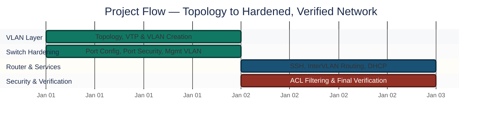
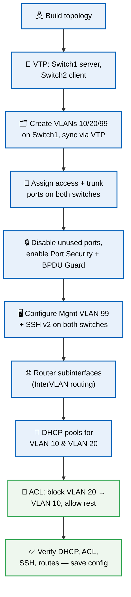

<div align="center">

# 🏢 Enterprise Network — VLAN Segmentation & Inter-VLAN Routing

**Project 10 of 10 — Foundational Projects**

Networking (Intermediate–Advanced)


A full two-switch enterprise network built from scratch: VLAN segmentation, VTP synchronization, Inter-VLAN routing via router subinterfaces, a dedicated Management VLAN, DHCP automation, SSH remote access, port security, BPDU Guard, and ACL-based traffic filtering — 21 steps, one lab.

> [!NOTE]
> This project builds directly on **Project 2** (Cisco Infrastructure & Secure Routing) — the same foundational router/switch/ACL setup, extended here with VLANs, VTP, and full security hardening across two switches.

</div>

---

## 📑 Table of Contents

1. [At a Glance](#at-a-glance)
2. [Project Background](#project-background)
3. [Environment & Topology](#environment-topology)
4. [VLAN Design](#vlan-design)
5. [Project Flow](#project-flow)
6. [Build Process](#build-process)
7. [Command Reference](#command-reference)
8. [Findings Summary](#findings-summary)
9. [Challenges & Fixes](#challenges-fixes)
10. [Scope & Limitations](#scope-limitations)
11. [Key Lesson](#key-lesson)
12. [Skills Demonstrated](#skills-demonstrated)
13. [Screenshot Index](#screenshot-index)
14. [Repo Structure](#repo-structure)

---

<a id="at-a-glance"></a>
## 📊 At a Glance

| 🧩 Steps | 🖼️ Screenshots | 🗂️ VLANs | 🔒 Security Layers |
|:---:|:---:|:---:|:---:|
| **21** | **21** | **3** | **5 (Port Security, BPDU Guard, SSH, ACL, VTP)** |

---

<a id="project-background"></a>
## 📖 Project Background

A complete enterprise network built in **Cisco Packet Tracer** across two switches and a router: VLANs, Inter-VLAN routing, VTP, a Management VLAN, DHCP, SSH, Port Security, ACLs, and general security hardening — configured end-to-end and verified at every stage, not just claimed working.

---

<a id="environment-topology"></a>
## 🖧 Environment & Topology

| Item | Value |
|---|---|
| **Simulation Tool** | Cisco Packet Tracer |
| **Router** | Cisco 2911 |
| **Switches** | 2× Cisco 2960 |
| **End Devices** | 4× PC + 1 Admin PC |
| **VTP Domain** | `LABNET` (v2) |

### Physical Connections

**PCs to Switches:**

| PC | Switch | Port |
|----|--------|------|
| PC0 | Switch1 | Fa0/1 |
| PC1 | Switch1 | Fa0/2 |
| PC2 | Switch2 | Fa0/1 |
| PC3 | Switch2 | Fa0/2 |
| Admin PC | Switch1 | Fa0/3 |

**Switch to Switch:**

| From | To | Cable |
|------|----|-------|
| Switch1 Fa0/24 | Switch2 Fa0/24 | Copper Cross-Over |

**Router to Switches:**

| Router Interface | Switch | Switch Port | Cable |
|-----------------|--------|-------------|-------|
| G0/0 | Switch1 | Fa0/23 | Copper Straight-Through |
| G0/1 | Switch2 | Fa0/23 | Copper Straight-Through |

---

<a id="vlan-design"></a>
## 🗂️ VLAN Design

| VLAN | Name | Network | Gateway |
|------|------|---------|---------|
| VLAN 10 | Sales | 192.168.10.0/24 | 192.168.10.1 |
| VLAN 20 | IT | 192.168.20.0/24 | 192.168.20.1 |
| VLAN 99 | Management | 192.168.99.0/24 | 192.168.99.1 |

### PC IP Configuration

| PC | VLAN | IP | Mask | Gateway |
|----|------|----|------|---------|
| PC0 | 10 | DHCP | auto | auto |
| PC1 | 20 | DHCP | auto | auto |
| PC2 | 10 | DHCP | auto | auto |
| PC3 | 20 | DHCP | auto | auto |
| Admin PC | 99 | 192.168.99.10 | 255.255.255.0 | 192.168.99.1 |

---

<a id="project-flow"></a>
## ⏱️ Project Flow


<p align="center"><em>Colors distinguish each build stage — all stages complete.</em></p>

---

<a id="build-process"></a>
## 🔵 Build Process



### Phase 1 — Build the Topology ✅
Set up all devices and connect cables exactly as shown in the topology tables above.

> No CLI commands in this step — this is a physical/logical wiring step done in the Packet Tracer GUI (drag devices, connect cables per the tables above).

<p align="center">
  <br>
  <em>Phase 1 — Full topology: router, 2 switches, 5 end devices</em>
</p>

### Phase 2 — Configure VTP on Switch1 (Server) ✅
Set Switch1 as VTP Server so it can push VLANs to Switch2 automatically.

```text
Switch1(config)# vtp mode server
Switch1(config)# vtp domain LABNET
Switch1(config)# vtp version 2
Switch1(config)# end
Switch1# show vtp status
```

<p align="center">
  <br>
  <em>Phase 2 — Switch1 configured as VTP server</em>
</p>

### Phase 3 — Configure VTP on Switch2 (Client) ✅
Set Switch2 as VTP Client so it receives VLANs from Switch1.

```text
Switch2(config)# vtp mode client
Switch2(config)# vtp domain LABNET
Switch2(config)# end
Switch2# show vtp status
```

<p align="center">
  <br>
  <em>Phase 3 — Switch2 configured as VTP client</em>
</p>

### Phase 4 — Create VLANs on Switch1 Only ✅
Create VLAN 10, 20, 99 on Switch1. Switch2 syncs automatically via VTP.

```text
Switch1(config)# vlan 10
Switch1(config-vlan)# name Sales
Switch1(config-vlan)# exit
Switch1(config)# vlan 20
Switch1(config-vlan)# name IT
Switch1(config-vlan)# exit
Switch1(config)# vlan 99
Switch1(config-vlan)# name Management
Switch1(config-vlan)# exit
```

<p align="center">
  <br>
  <em>Phase 4 — VLANs 10, 20, 99 created on Switch1</em>
</p>

### Phase 5 — Verify VLAN Sync ✅
Confirm VLANs appear on Switch2.

```text
Switch2# show vlan brief
Switch2# show vtp status
```

<p align="center">
  <br>
  <em>Phase 5 — VLANs confirmed synced to Switch2</em>
</p>

### Phase 6 — Configure Switch1 Ports ✅

```text
Switch1(config)# interface fa0/1
Switch1(config-if)# switchport mode access
Switch1(config-if)# switchport access vlan 10
Switch1(config-if)# exit
Switch1(config)# interface fa0/2
Switch1(config-if)# switchport mode access
Switch1(config-if)# switchport access vlan 20
Switch1(config-if)# exit
Switch1(config)# interface fa0/3
Switch1(config-if)# switchport mode access
Switch1(config-if)# switchport access vlan 99
Switch1(config-if)# exit
Switch1(config)# interface fa0/23
Switch1(config-if)# switchport mode trunk
Switch1(config-if)# switchport trunk allowed vlan 10,20,99
Switch1(config-if)# exit
Switch1(config)# interface fa0/24
Switch1(config-if)# switchport mode trunk
Switch1(config-if)# switchport trunk allowed vlan 10,20,99
```

<p align="center">
  <br>
  <em>Phase 6 — Access and trunk ports configured on Switch1</em>
</p>

### Phase 7 — Configure Switch2 Ports ✅

```text
Switch2(config)# interface fa0/1
Switch2(config-if)# switchport mode access
Switch2(config-if)# switchport access vlan 10
Switch2(config-if)# exit
Switch2(config)# interface fa0/2
Switch2(config-if)# switchport mode access
Switch2(config-if)# switchport access vlan 20
Switch2(config-if)# exit
Switch2(config)# interface fa0/23
Switch2(config-if)# switchport mode trunk
Switch2(config-if)# switchport trunk allowed vlan 10,20,99
Switch2(config-if)# exit
Switch2(config)# interface fa0/24
Switch2(config-if)# switchport mode trunk
Switch2(config-if)# switchport trunk allowed vlan 10,20,99
```

<p align="center">
  <br>
  <em>Phase 7 — Access and trunk ports configured on Switch2</em>
</p>

### Phase 8 — Unused Ports Security ✅
Disable unused ports.

```text
Switch1(config)# interface range fa0/4-22
Switch1(config-if-range)# shutdown
Switch1(config-if-range)# exit

Switch2(config)# interface range fa0/3-22
Switch2(config-if-range)# shutdown
```

<p align="center">
  <br>
  <em>Phase 8 — Unused switch ports shut down</em>
</p>

### Phase 9 — Port Security ✅
Enable port security on active access ports.

```text
Switch1(config)# interface fa0/1
Switch1(config-if)# switchport port-security
Switch1(config-if)# switchport port-security maximum 1
Switch1(config-if)# switchport port-security mac-address sticky
Switch1(config-if)# switchport port-security violation shutdown
Switch1(config-if)# spanning-tree portfast
Switch1(config-if)# spanning-tree bpduguard enable
Switch1(config-if)# exit
! Repeat the same block for Fa0/2 and Fa0/3 on Switch1,
! and for Fa0/1 and Fa0/2 on Switch2.
```

<p align="center">
  <br>
  <em>Phase 9 — Port Security + PortFast + BPDU Guard enabled</em>
</p>

### Phase 10 — Management VLAN ✅

```text
Switch1(config)# interface vlan 99
Switch1(config-if)# ip address 192.168.99.2 255.255.255.0
Switch1(config-if)# no shutdown
Switch1(config-if)# exit
Switch1(config)# ip default-gateway 192.168.99.1

Switch2(config)# interface vlan 99
Switch2(config-if)# ip address 192.168.99.3 255.255.255.0
Switch2(config-if)# no shutdown
Switch2(config-if)# exit
Switch2(config)# ip default-gateway 192.168.99.1
```

<p align="center">
  <br>
  <em>Phase 10 — Management VLAN SVI configured on both switches</em>
</p>

### Phase 11 — SSH on Switches ✅

```text
Switch1(config)# ip domain-name lab.local
Switch1(config)# crypto key generate rsa
   (key size: 1024)
Switch1(config)# username admin secret Cisco12345
Switch1(config)# line vty 0 15
Switch1(config-line)# login local
Switch1(config-line)# transport input ssh
Switch1(config-line)# exit
Switch1(config)# ip ssh version 2

! Repeat the same block on Switch2 (hostname Switch2 instead of Switch1).
```

<p align="center">
  <br>
  <em>Phase 11 — SSH v2 enabled on both switches</em>
</p>

### Phase 12 — Router Configuration ✅
Configure router subinterfaces for Inter-VLAN routing.

```text
Router(config)# interface g0/0
Router(config-if)# no shutdown
Router(config-if)# exit

Router(config)# interface g0/0.10
Router(config-subif)# encapsulation dot1Q 10
Router(config-subif)# ip address 192.168.10.1 255.255.255.0
Router(config-subif)# exit

Router(config)# interface g0/0.20
Router(config-subif)# encapsulation dot1Q 20
Router(config-subif)# ip address 192.168.20.1 255.255.255.0
Router(config-subif)# exit

Router(config)# interface g0/0.99
Router(config-subif)# encapsulation dot1Q 99
Router(config-subif)# ip address 192.168.99.1 255.255.255.0
Router(config-subif)# exit
```

<p align="center">
  <br>
  <em>Phase 12 — Router subinterfaces configured for VLANs 10, 20, 99</em>
</p>

### Phase 13 — DHCP Pools ✅

```text
Router(config)# ip dhcp excluded-address 192.168.10.1 192.168.10.10
Router(config)# ip dhcp excluded-address 192.168.20.1 192.168.20.10

Router(config)# ip dhcp pool SALES_VLAN10
Router(dhcp-config)# network 192.168.10.0 255.255.255.0
Router(dhcp-config)# default-router 192.168.10.1
Router(dhcp-config)# dns-server 8.8.8.8
Router(dhcp-config)# exit

Router(config)# ip dhcp pool IT_VLAN20
Router(dhcp-config)# network 192.168.20.0 255.255.255.0
Router(dhcp-config)# default-router 192.168.20.1
Router(dhcp-config)# dns-server 8.8.8.8
Router(dhcp-config)# exit
```

<p align="center">
  <br>
  <em>Phase 13 — DHCP pools created for VLAN 10 and VLAN 20</em>
</p>

### Phase 14 — PC DHCP ✅
Verify DHCP IP assignment.

```text
PC0> ipconfig /release
PC0> ipconfig /renew
PC0> ipconfig
```

<p align="center">
  <br>
  <em>Phase 14 — PC0 receives a DHCP-assigned IP</em>
</p>

### Phase 15 — DHCP Binding ✅
Confirm leases on the router.

```text
Router# show ip dhcp binding
```

<p align="center">
  <br>
  <em>Phase 15 — Active DHCP leases confirmed</em>
</p>

### Phase 16 — Pre-ACL Ping Test ✅
Test connectivity before applying the ACL.

```text
PC0> ping 192.168.20.1
PC1> ping 192.168.10.1
PC0> ping 192.168.99.10
```

<p align="center">
  <br>
  <em>Phase 16 — Full connectivity confirmed before ACL is applied</em>
</p>

### Phase 17 — ACL Configuration ✅
Deny VLAN 20 → VLAN 10 traffic; permit everything else.

```text
Router(config)# access-list 110 deny ip 192.168.20.0 0.0.0.255 192.168.10.0 0.0.0.255
Router(config)# access-list 110 permit ip any any

Router(config)# interface g0/0.10
Router(config-subif)# ip access-group 110 in
```

<p align="center">
  <br>
  <em>Phase 17 — ACL 110 applied inbound on VLAN 10 subinterface</em>
</p>

### Phase 18 — ACL Test ✅

```text
PC1> ping 192.168.10.1
   (Request timed out — VLAN 20 to VLAN 10 is blocked)

PC0> ping 192.168.20.1
   (Reply received — VLAN 10 to VLAN 20 is still permitted)
```

<p align="center">
  <br>
  <em>Phase 18 — ACL confirmed blocking VLAN 20 → VLAN 10 only</em>
</p>

### Phase 19 — SSH Test ✅
Test SSH remote access to switches.

```text
AdminPC> ssh -l admin 192.168.99.2
AdminPC> ssh -l admin 192.168.99.3
```

<p align="center">
  <br>
  <em>Phase 19 — SSH access confirmed to both switches from Admin PC</em>
</p>

### Phase 20 — Final Verification ✅

```text
Switch1# show vlan brief
Switch2# show vlan brief
Router# show ip interface brief
Router# show ip route
Router# show access-lists
```

<p align="center">
  <br>
  <em>Phase 20 — Full network state verified end-to-end</em>
</p>

### Phase 21 — Save Configuration ✅

```text
Switch1# copy running-config startup-config
Switch2# copy running-config startup-config
Router# copy running-config startup-config
```

<p align="center">
  <br>
  <em>Phase 21 — Running configuration saved on all three devices</em>
</p>

🎯 **Result:** A fully segmented, VTP-synced, Inter-VLAN-routed network with DHCP, SSH, port security, and ACL filtering — every stage verified, not just configured.

---

<a id="command-reference"></a>
## 📟 Command Reference

| Command | Purpose |
|---------|---------|
| `vtp mode server/client` | Set VTP role |
| `vtp domain` | Set VTP domain |
| `vlan 10` | Create VLAN |
| `switchport mode access/trunk` | Set port mode |
| `switchport access vlan 10` | Assign port to VLAN |
| `spanning-tree portfast` | Enable PortFast |
| `spanning-tree bpduguard enable` | Enable BPDU Guard |
| `switchport port-security` | Enable port security |
| `interface vlan 99` | Create management SVI |
| `ip default-gateway` | Set switch gateway |
| `crypto key generate rsa` | Generate SSH keys |
| `ip ssh version 2` | Enable SSH v2 |
| `encapsulation dot1Q` | Tag subinterface |
| `ip dhcp pool` | Create DHCP pool |
| `ip dhcp excluded-address` | Reserve IPs |
| `access-list 110 deny` | Create ACL rule |
| `ip access-group 110 in` | Apply ACL |
| `copy running-config startup-config` | Save config |

---

<a id="findings-summary"></a>
## 🌟 Findings Summary

| 🛡️ Layer | ✅ Status | 📌 Detail |
|---|---|---|
| VLAN sync (VTP) | Verified | VLANs 10/20/99 created once on Switch1, confirmed synced to Switch2 |
| Inter-VLAN routing | Verified | Router subinterfaces route between all 3 VLANs |
| DHCP | Verified | VLAN 10 & 20 clients auto-assigned via router DHCP pools |
| ACL | Verified | VLAN 20 → VLAN 10 blocked; all other traffic still passes |
| SSH | Verified | Remote access confirmed to both switches from Admin PC |

---

<a id="challenges-fixes"></a>
## ⚠️ Challenges & Fixes

| ❌ Challenge | ✅ Fix |
|-----------|----------|
| VLANs not syncing to Switch2 | Verified VTP domain name matched exactly on both switches |
| PCs not getting DHCP IP | Checked excluded address range and DHCP pool network match |
| SSH not connecting | Confirmed RSA key size 1024+ and SSH v2 enabled |
| ACL blocking wrong traffic | Reviewed wildcard masks and access-group direction (in/out) |
| Trunk port not passing VLANs | Verified allowed VLAN list on trunk interface |

---

<a id="scope-limitations"></a>
## 🚧 Scope & Limitations

- **Simulated environment only:** Built and verified in Cisco Packet Tracer, not on physical hardware.
- **Single ACL direction tested:** Only VLAN 20 → VLAN 10 traffic was explicitly denied; other inter-VLAN paths remain fully open by design (`permit any any`).
- **RSA key size:** Uses a 1024-bit SSH key for lab purposes — production environments should use 2048-bit or higher.

---

<a id="key-lesson"></a>
## 🧠 What I Learned

How to build a complete enterprise network with VLANs, VTP synchronization, Inter-VLAN routing, Management VLAN, DHCP automation, SSH remote access, Port Security, BPDU Guard, ACL traffic filtering and security hardening — all in one lab.

---

## 🌍 Real-World Application

This is the standard build pattern for a small-to-mid enterprise LAN: departments segmented into VLANs for both performance and security, a dedicated management plane isolated from user traffic, automated addressing via DHCP, and traffic-filtering rules enforced at the router rather than left to trust. Network engineers configure and verify exactly this stack — VTP, trunking, SVIs, ACLs, SSH hardening — as day-one infrastructure on real switches and routers.

---

<a id="skills-demonstrated"></a>
## 🛠️ Skills Demonstrated

- Designing and implementing VLAN segmentation across multiple switches
- Synchronizing VLAN databases with VTP (server/client roles)
- Configuring Inter-VLAN routing via router-on-a-stick subinterfaces
- Building a dedicated Management VLAN with SVI addressing
- Automating IP assignment per VLAN with DHCP pools and exclusions
- Hardening switch access with Port Security, PortFast, and BPDU Guard
- Enabling and testing SSH v2 remote management
- Writing and applying ACLs to filter inter-VLAN traffic selectively
- End-to-end verification: DHCP bindings, ACL behavior, SSH access, routing table

---

<a id="screenshot-index"></a>
## 🖼️ Screenshot Index

| # | File | Shows |
|:---:|---|---|
| 1 | `01-topology.PNG` | Full topology: router, 2 switches, 5 end devices |
| 2 | `02-vtp-server.png` | Switch1 configured as VTP server |
| 3 | `03-vtp-client.png` | Switch2 configured as VTP client |
| 4 | `04-vlans-created.png` | VLANs 10, 20, 99 created on Switch1 |
| 5 | `05-vtp-sync.png` | VLANs confirmed synced to Switch2 |
| 6 | `06-switch1-ports.png` | Access and trunk ports configured on Switch1 |
| 7 | `07-switch2-ports.png` | Access and trunk ports configured on Switch2 |
| 8 | `08-unused-ports.png` | Unused switch ports shut down |
| 9 | `09-port-security.png` | Port Security + PortFast + BPDU Guard enabled |
| 10 | `10-mgmt-vlan.png` | Management VLAN SVI configured on both switches |
| 11 | `11-ssh-switches.png` | SSH v2 enabled on both switches |
| 12 | `12-router-config.png` | Router subinterfaces configured for VLANs 10, 20, 99 |
| 13 | `13-dhcp-pools.png` | DHCP pools created for VLAN 10 and VLAN 20 |
| 14 | `14-pc-dhcp.png` | PC0 receives a DHCP-assigned IP |
| 15 | `15-dhcp-binding.png` | Active DHCP leases confirmed |
| 16 | `16-pre-acl-ping.png` | Full connectivity confirmed before ACL is applied |
| 17 | `17-acl-config.png` | ACL 110 applied inbound on VLAN 10 subinterface |
| 18 | `18-acl-test.png` | ACL confirmed blocking VLAN 20 → VLAN 10 only |
| 19 | `19-ssh-test.png` | SSH access confirmed to both switches from Admin PC |
| 20 | `20-final-verify.png` | Full network state verified end-to-end |
| 21 | `21-save-config.png` | Running configuration saved on all three devices |

> [!NOTE]
> Filenames above are kept exactly as sourced — Step 1's screenshot uses `.PNG` while the rest use lowercase `.png`. GitHub/Linux filesystems are case-sensitive, so confirm the real extensions in your repo match this list exactly before pushing (see the note under Repo Structure).

---

<a id="repo-structure"></a>
## 📁 Repo Structure

```text
1-Foundational-Projects/project-10-vlan-segmentation-intervlan-routing/
|-- README.md
|-- enterprise-network-vlan-intervlan-routing.pkt
`-- screenshots/
    |-- 01-topology.PNG
    |-- 02-vtp-server.png
    |-- 03-vtp-client.png
    |-- 04-vlans-created.png
    |-- 05-vtp-sync.png
    |-- 06-switch1-ports.png
    |-- 07-switch2-ports.png
    |-- 08-unused-ports.png
    |-- 09-port-security.png
    |-- 10-mgmt-vlan.png
    |-- 11-ssh-switches.png
    |-- 12-router-config.png
    |-- 13-dhcp-pools.png
    |-- 14-pc-dhcp.png
    |-- 15-dhcp-binding.png
    |-- 16-pre-acl-ping.png
    |-- 17-acl-config.png
    |-- 18-acl-test.png
    |-- 19-ssh-test.png
    |-- 20-final-verify.png
    `-- 21-save-config.png
```

<div align="center">

🏢 **[Cisco Packet Tracer](https://www.netacad.com/courses/packet-tracer)** · 🌐 **[Cisco VTP Guide](https://www.cisco.com/c/en/us/support/docs/lan-switching/vtp/98154-vtp-faq.html)**

</div>
