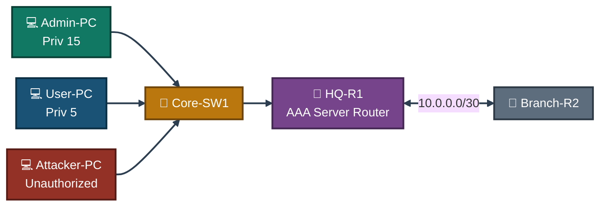
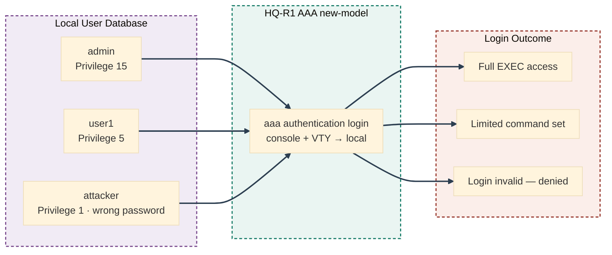
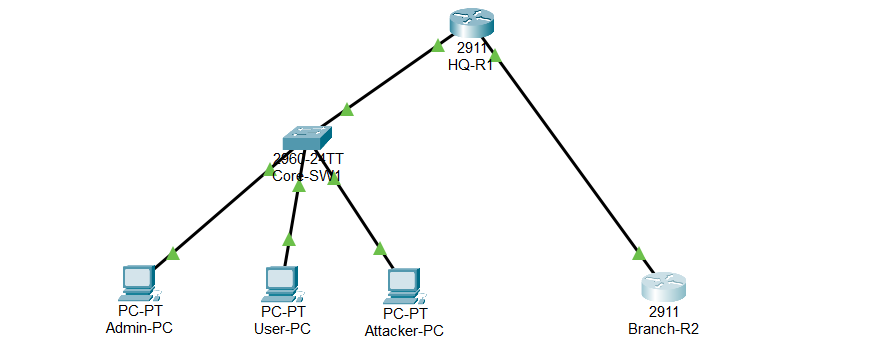
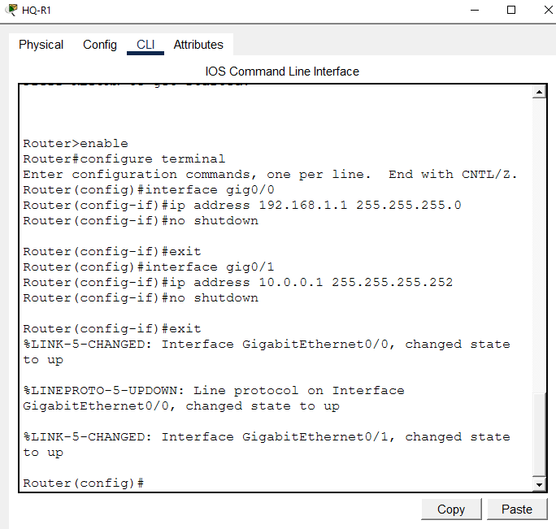
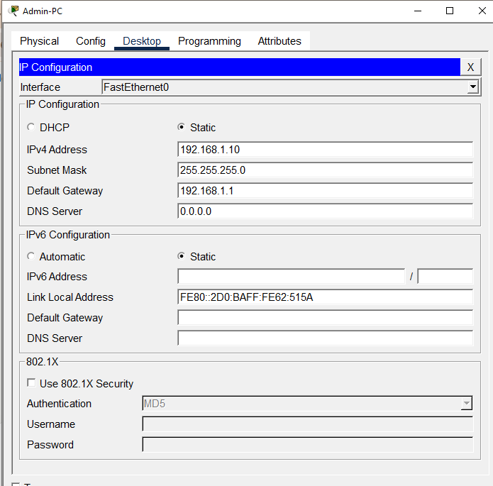
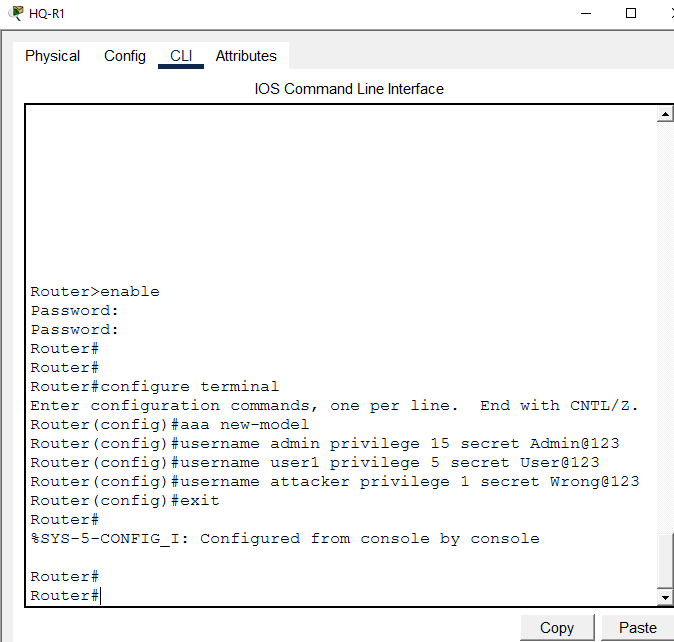
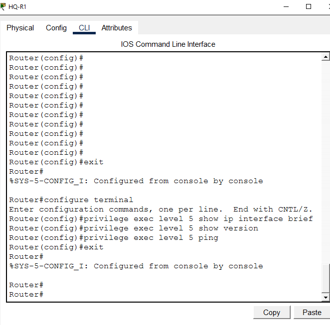
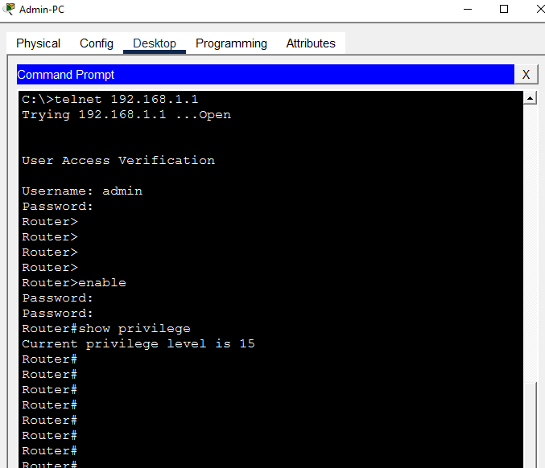
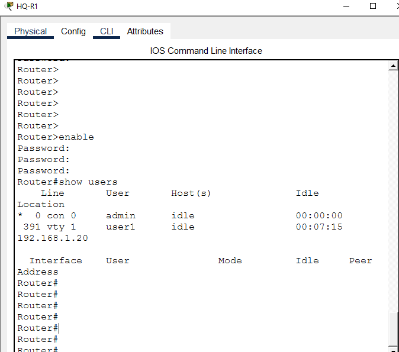

<div align="center">

# 🔑 AAA — Local Authentication

**Network Security Lab 01 — Cisco Networking Lab Portfolio**

Local AAA Authentication on a Cisco Router — User Database, Privilege Levels, Console/VTY Login, and a Verified Attacker Lockout (Cisco Packet Tracer)


A gateway router configured with a local AAA user database instead of a single shared password — three accounts at three different privilege levels, console and VTY lines both authenticating against that database, and a login banner on top. Verification goes past a config check: an admin, a limited user, and an attacker with the wrong password all attempt to log in, and only the two legitimate accounts get through.

</div>

---

## 📑 Table of Contents

1. [At a Glance](#at-a-glance)
2. [Project Background](#project-background)
3. [Tools & Technologies](#tools-technologies)
4. [Environment](#environment)
5. [Topology](#topology)
6. [AAA Authentication & Privilege Design](#aaa-authentication-privilege-design)
7. [IP Design](#ip-design)
8. [Simulated Issues](#simulated-issues)
9. [Module 1 — Build the Topology](#module-1)
10. [Module 2 — Configure HQ-R1](#module-2)
11. [Module 3 — Configure Branch-R2](#module-3)
12. [Module 4 — Configure PC IPs](#module-4)
13. [Module 5 — Configure Static Routing](#module-5)
14. [Module 6 — Pre-AAA Telnet Test](#module-6)
15. [Module 7 — Enable AAA and Create Local Users](#module-7)
16. [Module 8 — Configure AAA Authentication](#module-8)
17. [Module 9 — Configure Privilege Levels](#module-9)
18. [Module 10 — Admin Login Test](#module-10)
19. [Module 11 — User1 Login Test](#module-11)
20. [Module 12 — Attacker Login Fail](#module-12)
21. [Module 13 — Verify AAA Configuration](#module-13)
22. [Module 14 — Console Login Test](#module-14)
23. [Module 15 — Show Active Users](#module-15)
24. [Module 16 — Configure Login Banner](#module-16)
25. [Module 17 — Final AAA Verification](#module-17)
26. [Coverage Snapshot](#coverage-snapshot)
27. [Command Summary](#command-summary)
28. [Challenges & Fixes](#challenges-fixes)
29. [Scope & Limitations](#scope-limitations)
30. [What I Learned](#what-i-learned)
31. [Skills Demonstrated](#skills-demonstrated)
32. [Screenshot Index](#screenshot-index)
33. [Repo Structure](#repo-structure)

---

<a id="at-a-glance"></a>
## 📊 At a Glance

<div align="center">

| 🔑 AAA Framework | 🚪 Routers | 🔀 Switch | 🖥️ Hosts | 👤 Privilege Levels | 🖼️ Screenshots |
|:---:|:---:|:---:|:---:|:---:|:---:|
| **Local Auth** | **2** | **1** | **3** | **3 (1, 5, 15)** | **17** |

</div>

---

<a id="project-background"></a>
## 📖 Project Background

This lab replaces a single shared line password with a real local AAA framework: three named accounts — admin, user1, and attacker — each with their own privilege level, authenticating against HQ-R1's local username database on both the console and VTY lines. Verification is deliberately adversarial rather than just a config review — an admin logs in with full access, a limited user logs in at a reduced privilege level, and an attacker with the wrong password is confirmed locked out, all before the final config and active-session checks.

| Module | Focus |
|---|---|
| 🏗️ **Module 1 — Build the Topology** | Wire HQ-R1, Branch-R2, Core-SW1, and three PCs |
| ⚙️ **Module 2 — Configure HQ-R1** | Address the AAA server router's interfaces |
| 🌐 **Module 3 — Configure Branch-R2** | Address the branch router's interface |
| 💻 **Module 4 — Configure PC IPs** | Address Admin-PC, User-PC, and Attacker-PC |
| 🧭 **Module 5 — Static Routing** | Route between the HQ and Branch subnets |
| 🚫 **Module 6 — Pre-AAA Telnet Test** | Confirm the insecure, shared-password baseline |
| 🔑 **Module 7 — Enable AAA & Create Users** | Local database with three privilege levels |
| 🔐 **Module 8 — AAA Authentication** | Apply local authentication to console and VTY |
| 🎚️ **Module 9 — Privilege Levels** | Restrict which commands privilege 5 can run |
| ✅ **Module 10 — Admin Login Test** | Confirm full access at privilege 15 |
| 🔓 **Module 11 — User1 Login Test** | Confirm limited access at privilege 5 |
| ⛔ **Module 12 — Attacker Login Fail** | Confirm the wrong-password login is rejected |
| 📋 **Module 13 — Verify AAA Configuration** | Confirm AAA and username lines in the running-config |
| 🖥️ **Module 14 — Console Login Test** | Confirm console-line authentication and the banner |
| 👥 **Module 15 — Show Active Users** | Confirm both admin and user1 sessions are visible |
| 📜 **Module 16 — Configure Login Banner** | Add a legal warning banner on login |
| 🧾 **Module 17 — Final AAA Verification** | Confirm no locked accounts, full AAA config present |

> [!NOTE]
> This is a Packet Tracer simulation, not physical hardware. Privilege-level command restriction (Module 9) is a known Packet Tracer limitation — real IOS enforces privilege 5's command set correctly, where this simulator does not always do so.

---

<a id="tools-technologies"></a>
## 🛠️ Tools & Technologies

| Tool | Purpose |
|------|---------|
| 🖥️ Cisco Packet Tracer | Network topology simulation |
| 🚪 Router 2911 x2 | HQ-R1 (AAA server router), Branch-R2 |
| 🔀 Switch 2960 | Core LAN switching |
| 🔑 AAA new-model | Enable the AAA framework on the router |
| 🗂️ Local Username Database | Store usernames and passwords locally |
| 🎚️ Privilege Levels | Control access level per user (1–15) |
| 🔐 `aaa authentication login` | Define the login authentication method |
| 🔓 `aaa authorization exec` | Define the exec authorization method |
| 📜 `banner motd` | Login warning banner |
| 👥 `show users` | View active login sessions |
| 🔒 `show aaa local user lockout` | Check locked accounts |
| ☎️ Telnet | Remote access for login testing |

---

<a id="environment"></a>
## 🖧 Environment


**Devices**

| Device | Model | Role |
|--------|-------|------|
| HQ-R1 | Router 2911 | AAA Server Router |
| Branch-R2 | Router 2911 | Branch Router |
| Core-SW1 | Switch 2960 | Core LAN Switch |
| Admin-PC | PC | Full Admin Access (Privilege 15) |
| User-PC | PC | Limited User Access (Privilege 5) |
| Attacker-PC | PC | Unauthorized Access Attempt |

**Connections**

| From | Port | To | Port | Cable |
|------|------|----|------|-------|
| Admin-PC | Fa0 | Core-SW1 | Fa0/1 | Copper Straight-Through |
| User-PC | Fa0 | Core-SW1 | Fa0/2 | Copper Straight-Through |
| Attacker-PC | Fa0 | Core-SW1 | Fa0/3 | Copper Straight-Through |
| Core-SW1 | Fa0/24 | HQ-R1 | Gig0/0 | Copper Straight-Through |
| HQ-R1 | Gig0/1 | Branch-R2 | Gig0/0 | Copper Straight-Through |

---

<a id="topology"></a>
## 🗺️ Topology


<p align="center"><em>All three PCs sit on the same LAN and can all reach HQ-R1 — but only two of them hold valid credentials in its local AAA database.</em></p>

---

<a id="aaa-authentication-privilege-design"></a>
## 🔑 AAA Authentication & Privilege Design


<p align="center"><em>Every login attempt goes through the same AAA authentication method list — the difference in outcome comes entirely from which account, and which password, was presented.</em></p>

---

<a id="ip-design"></a>
## 🗂️ IP Design

| Device | Interface | IP Address | Subnet Mask | Gateway |
|--------|-----------|------------|-------------|---------|
| HQ-R1 | Gig0/0 | 192.168.1.1 | 255.255.255.0 | — |
| HQ-R1 | Gig0/1 | 10.0.0.1 | 255.255.255.252 | — |
| Branch-R2 | Gig0/0 | 10.0.0.2 | 255.255.255.252 | — |
| Admin-PC | Fa0 | 192.168.1.10 | 255.255.255.0 | 192.168.1.1 |
| User-PC | Fa0 | 192.168.1.20 | 255.255.255.0 | 192.168.1.1 |
| Attacker-PC | Fa0 | 192.168.1.30 | 255.255.255.0 | 192.168.1.1 |

---

<a id="simulated-issues"></a>
## 🐛 Simulated Issues

| # | Issue | Type |
|---|-------|------|
| 1 | No authentication — anyone can access the router | Missing AAA |
| 2 | Single shared password — no user tracking | No individual accounts |
| 3 | All users have the same access level | Missing privilege levels |
| 4 | Attacker attempts unauthorized login | Brute-force simulation |
| 5 | No login warning banner | Missing security notice |

---

<a id="module-1"></a>
## 🏗️ Module 1 — Build the Topology

**Objective:** Wire HQ-R1, Branch-R2, Core-SW1, and all three PCs per the connections table above.

### Step 1 — Build Topology ✅

No CLI commands — physical wiring done in the Packet Tracer GUI. Drag devices onto the canvas, connect cables per the topology table, and rename all devices per the naming convention above.

<p align="center">
  <br>
  <em>Exhibit 1 — Full topology: HQ-R1, Branch-R2, Core-SW1, and the three PCs wired and named</em>
</p>

---

<a id="module-2"></a>
## ⚙️ Module 2 — Configure HQ-R1

**Objective:** Address HQ-R1's LAN and WAN interfaces and bring them up.

### Step 2 — Configure HQ-R1 ✅

```
enable
configure terminal
interface gig0/0
ip address 192.168.1.1 255.255.255.0
no shutdown
exit
interface gig0/1
ip address 10.0.0.1 255.255.255.252
no shutdown
exit
```

<p align="center">
  <br>
  <em>Exhibit 2 — HQ-R1's LAN and WAN interfaces addressed and brought up</em>
</p>

---

<a id="module-3"></a>
## 🌐 Module 3 — Configure Branch-R2

**Objective:** Address Branch-R2's WAN-facing interface and bring it up.

### Step 3 — Configure Branch-R2 ✅

```
enable
configure terminal
interface gig0/0
ip address 10.0.0.2 255.255.255.252
no shutdown
exit
```

<p align="center">
  <br>
  <em>Exhibit 3 — Branch-R2's WAN interface addressed and brought up</em>
</p>

---

<a id="module-4"></a>
## 💻 Module 4 — Configure PC IPs

**Objective:** Address Admin-PC, User-PC, and Attacker-PC per the IP design.

### Step 4 — Configure PC IPs ✅

```
Admin-PC:    192.168.1.10 | Mask: 255.255.255.0 | GW: 192.168.1.1
User-PC:     192.168.1.20 | Mask: 255.255.255.0 | GW: 192.168.1.1
Attacker-PC: 192.168.1.30 | Mask: 255.255.255.0 | GW: 192.168.1.1
```

<p align="center">
  <br>
  <em>Exhibit 4 — All three PCs addressed per the IP design</em>
</p>

---

<a id="module-5"></a>
## 🧭 Module 5 — Configure Static Routing

**Objective:** Route between the HQ and Branch subnets so Telnet traffic from Admin-PC, User-PC, and Attacker-PC can reach HQ-R1 and back.

### Step 5 — Configure Static Routing ✅

```
HQ-R1:
ip route 0.0.0.0 0.0.0.0 10.0.0.2

Branch-R2:
ip route 192.168.1.0 255.255.255.0 10.0.0.1
```

<p align="center">
  <br>
  <em>Exhibit 5 — Static routes configured on both routers</em>
</p>

---

<a id="module-6"></a>
## 🚫 Module 6 — Pre-AAA Telnet Test

**Objective:** Establish the insecure baseline — a single shared VTY password with no individual user tracking — before AAA is configured.

### Step 6 — Pre-AAA Telnet Test (Insecure) ✅

```
enable
configure terminal
line vty 0 4
password cisco
login
exit
enable password cisco
exit

Admin-PC> telnet 192.168.1.1
Password: cisco
→ Connected — no individual user tracking ⚠️
```

<p align="center">
  <br>
  <em>Exhibit 6 — Telnet succeeds with a single shared password, before any AAA is configured</em>
</p>

---

<a id="module-7"></a>
## 🔑 Module 7 — Enable AAA and Create Local Users

**Objective:** Enable the AAA framework and create three named accounts at three different privilege levels.

### Step 7 — Enable AAA and Create Local Users ✅

```
enable
configure terminal
aaa new-model
username admin privilege 15 secret Admin@123
username user1 privilege 5 secret User@123
username attacker privilege 1 secret Wrong@123
exit

→ AAA framework enabled
→ admin: Full access (privilege 15)
→ user1: Limited access (privilege 5)
→ attacker: Minimal access (privilege 1)
→ All passwords encrypted with secret
```

<p align="center">
  <br>
  <em>Exhibit 7 — AAA enabled and three local accounts created with distinct privilege levels</em>
</p>

---

<a id="module-8"></a>
## 🔐 Module 8 — Configure AAA Authentication

**Objective:** Point both the console line and VTY lines at the local AAA database.

### Step 8 — Configure AAA Authentication ✅

```
enable
configure terminal
aaa authentication login default local
aaa authentication login CONSOLE local
line console 0
login authentication CONSOLE
exit
line vty 0 4
login authentication default
exit

→ Default login: use local database
→ Console: use local database
→ VTY lines: use default (local) authentication
```

<p align="center">
  <br>
  <em>Exhibit 8 — Console and VTY lines both authenticating against the local AAA database</em>
</p>

---

<a id="module-9"></a>
## 🎚️ Module 9 — Configure Privilege Levels

**Objective:** Restrict privilege level 5 to a limited command set.

### Step 9 — Configure Privilege Levels ✅

```
enable
configure terminal
privilege exec level 5 show ip interface brief
privilege exec level 5 show version
privilege exec level 5 ping
exit

→ Privilege 5 users can: show ip interface brief, show version, ping
→ Cannot access higher level commands
```

<p align="center">
  <br>
  <em>Exhibit 9 — Privilege level 5 restricted to a defined set of commands</em>
</p>

---

<a id="module-10"></a>
## ✅ Module 10 — Admin Login Test

**Objective:** Confirm the admin account logs in with full privilege 15 access.

### Step 10 — Admin Login Test (Full Access) ✅

```
Admin-PC> telnet 192.168.1.1
Username: admin
Password: Admin@123
→ Login successful ✅

Router# show privilege
→ Current privilege level is 15 ✅
→ Full administrative access confirmed
```

<p align="center">
  <br>
  <em>Exhibit 10 — Admin logs in and show privilege confirms level 15</em>
</p>

---

<a id="module-11"></a>
## 🔓 Module 11 — User1 Login Test

**Objective:** Confirm user1 logs in at the reduced privilege level 5.

### Step 11 — User1 Login Test (Limited Access) ✅

```
User-PC> telnet 192.168.1.1
Username: user1
Password: User@123
→ Login successful ✅
→ Router> prompt (limited access)

Router> show privilege
→ Current privilege level is 5
→ Note: Packet Tracer limitation — real IOS enforces privilege 5 correctly
```

<p align="center">
  <br>
  <em>Exhibit 11 — user1 logs in at privilege level 5, confirmed via show privilege</em>
</p>

---

<a id="module-12"></a>
## ⛔ Module 12 — Attacker Login Fail

**Objective:** Confirm a login attempt with the wrong password is rejected outright.

### Step 12 — Attacker Login Fail ✅

```
Attacker-PC> telnet 192.168.1.1
Username: attacker
Password: WrongPassword
→ % Login invalid ❌
→ Connection closed by foreign host
→ Unauthorized access blocked ✅
```

<p align="center">
  <br>
  <em>Exhibit 12 — Attacker's login is rejected and the connection is closed</em>
</p>

---

<a id="module-13"></a>
## 📋 Module 13 — Verify AAA Configuration

**Objective:** Confirm the AAA and username lines are present in the running-config, with passwords stored encrypted.

### Step 13 — Verify AAA Configuration ✅

```
show running-config | include aaa
→ aaa new-model
→ aaa authentication login CONSOLE local
→ aaa authentication login default local
→ aaa authorization exec default local

show running-config | include username
→ username admin privilege 15 secret 5 $1$...
→ username user1 privilege 5 secret 5 $1$...
→ username attacker secret 5 $1$...
→ All passwords encrypted ✅
```

<p align="center">
  <br>
  <em>Exhibit 13 — Running-config confirms AAA lines and encrypted user secrets</em>
</p>

---

<a id="module-14"></a>
## 🖥️ Module 14 — Console Login Test

**Objective:** Confirm console-line authentication and the login banner both function correctly.

### Step 14 — Console Login Test ✅

```
→ Logout from router console
→ Login with admin credentials

Username: admin
Password: Admin@123
→ Console authentication working ✅
→ Unauthorized Access is Prohibited! banner shown
```

<p align="center">
  <br>
  <em>Exhibit 14 — Console login prompts for AAA credentials and displays the banner</em>
</p>

---

<a id="module-15"></a>
## 👥 Module 15 — Show Active Users

**Objective:** Confirm both the console and VTY sessions are visible and correctly attributed to their logged-in users.

### Step 15 — Show Active Users ✅

```
show users

→ Line    User    Host(s)  Idle     Location
→ 0 con 0  admin  idle     00:00:00
→ 391 vty 1 user1 idle     00:07:15  192.168.1.20
→ Both admin (console) and user1 (VTY) sessions visible ✅
```

<p align="center">
  <br>
  <em>Exhibit 15 — Active console and VTY sessions listed with their usernames</em>
</p>

---

<a id="module-16"></a>
## 📜 Module 16 — Configure Login Banner

**Objective:** Add a legal warning banner shown on every login attempt.

### Step 16 — Configure Login Banner ✅

```
enable
configure terminal
banner motd # Unauthorized Access is Prohibited! #
exit

→ Banner appears on every login attempt
→ Legal warning for unauthorized users
→ "Unauthorized Access is Prohibited!" displayed ✅
```

<p align="center">
  <br>
  <em>Exhibit 16 — MOTD banner configured and displayed on login</em>
</p>

---

<a id="module-17"></a>
## 🧾 Module 17 — Final AAA Verification

**Objective:** Confirm there are no locked accounts and the full AAA configuration is present.

### Step 17 — Final AAA Verification ✅

```
show aaa local user lockout
→ No locked users (clean state)

show running-config | section aaa
→ aaa new-model
→ aaa authentication login CONSOLE local
→ aaa authentication login default local
→ aaa authorization exec default local
→ AAA fully configured and verified ✅
```

<p align="center">
  <br>
  <em>Exhibit 17 — No locked accounts, full AAA configuration confirmed present</em>
</p>

---

<a id="coverage-snapshot"></a>
## 🌟 Coverage Snapshot

| 🛡️ Layer | ✅ Status | 📌 Detail |
|---|---|---|
| Topology | Live | HQ-R1, Branch-R2, Core-SW1, and three PCs wired and named (Exhibit 1) |
| Router addressing | Live | HQ-R1 and Branch-R2 interfaces addressed (Exhibits 2–3) |
| PC addressing & routing | Live | All three PCs addressed, static routes exchanged (Exhibits 4–5) |
| Pre-AAA baseline | Proven | Shared-password Telnet works but tracks no individual user (Exhibit 6) |
| Local AAA users | Live | Three accounts created at privilege 15, 5, and 1 (Exhibit 7) |
| AAA authentication | Live | Console and VTY both authenticate against the local database (Exhibit 8) |
| Privilege restriction | Live | Privilege 5 limited to a defined command set (Exhibit 9) |
| Admin access | Proven | Full privilege 15 access confirmed via show privilege (Exhibit 10) |
| Limited user access | Proven | Privilege 5 login confirmed (Exhibit 11) |
| Attacker lockout | Proven | Wrong-password login rejected and connection closed (Exhibit 12) |
| Config verification | Proven | AAA and username lines confirmed in running-config, secrets encrypted (Exhibit 13) |
| Console login & banner | Proven | Console authenticates via AAA and displays the MOTD banner (Exhibit 14) |
| Active session visibility | Proven | Both admin and user1 sessions visible via show users (Exhibit 15) |
| Login banner | Live | MOTD banner configured (Exhibit 16) |
| Final verification | Proven | No locked accounts, full AAA config confirmed (Exhibit 17) |

---

<a id="command-summary"></a>
## 📟 Command Summary

| Command | Purpose |
|---------|---------|
| `aaa new-model` | Enable AAA framework on router |
| `username <name> privilege <level> secret <pass>` | Create local user with privilege level |
| `aaa authentication login default local` | Use local DB for default login authentication |
| `aaa authentication login CONSOLE local` | Use local DB for console authentication |
| `aaa authorization exec default local` | Use local DB for exec authorization |
| `line console 0` | Enter console line configuration |
| `login authentication <list>` | Apply AAA list to line |
| `privilege exec level <num> <command>` | Assign command to privilege level |
| `banner motd # <message> #` | Configure login warning banner |
| `show users` | View active login sessions |
| `show aaa local user lockout` | Check locked user accounts |
| `show running-config \| include aaa` | Filter AAA config from running config |
| `show running-config \| include username` | View all local usernames |
| `show privilege` | View current privilege level |

---

<a id="challenges-fixes"></a>
## ⚠️ Challenges & Fixes

| ❌ Challenge | ✅ Solution |
|---|---|
| Privilege level not enforcing in Packet Tracer | Known Packet Tracer limitation — real IOS enforces privilege levels correctly; documented in this README rather than misrepresented |
| `enable password` conflict with AAA | Used `enable secret Admin@123` to separate the enable password from AAA user passwords |
| Attacker could still attempt login multiple times | Normal behavior — in real IOS, `aaa local authentication attempts max-fail` locks the account after repeated failures |
| Console login not prompting for username | Added `login authentication CONSOLE` under `line console 0` to apply AAA to the console line |
| Passwords visible in `show running-config` | Used `secret` instead of `password` — passwords stored as an MD5 hash (`secret 5`) |

---

<a id="scope-limitations"></a>
## 🚧 Scope & Limitations

- **Simulation only:** Built and verified in Cisco Packet Tracer, not on physical hardware.
- **No account lockout enforcement:** `aaa local authentication attempts max-fail` wasn't configured, so repeated attacker attempts aren't automatically locked in this build.
- **Privilege-level command enforcement is partial:** Packet Tracer doesn't always restrict privilege 5's command set the way real IOS does — noted explicitly rather than glossed over.
- **Local authentication only:** No external AAA server (RADIUS/TACACS+) was configured — this lab demonstrates the local-database method specifically.
- **Single AAA server router:** HQ-R1 is the only device with local AAA configured; Branch-R2 and Core-SW1 don't authenticate against it.

These limits are stated so the lab is read as an AAA local-authentication fundamentals exercise, not a production access-control deployment.

---

<a id="what-i-learned"></a>
## 🧠 What I Learned

- **Individual accounts turn a login into something traceable.** A shared VTY password lets anyone in but tells you nothing about who — named accounts with AAA fix that, as `show users` confirms.
- **Privilege levels only matter if the platform actually enforces them.** Packet Tracer's partial enforcement was a useful reminder to verify behavior rather than assume the config alone proves the control works.
- **`secret` and `password` are not interchangeable.** Only `secret` stores a hashed value — using `password` for AAA-related lines would have left credentials readable in the running-config.
- **A failed login attempt is itself a security event worth checking**, not just an inconvenience — confirming the attacker's Telnet session actually closed was as important as confirming the admin's succeeded.

---

<a id="skills-demonstrated"></a>
## 🛠️ Skills Demonstrated

- Enabling the AAA framework and building a local username database with multiple privilege levels
- Applying AAA authentication to both console and VTY lines independently
- Restricting command availability by privilege level
- Testing authorized and unauthorized login attempts as adversarial verification, not just config review
- Reading `show users` and `show aaa local user lockout` to confirm real-time AAA state
- Diagnosing an enable-password/AAA conflict and a console authentication gap
- Documenting a platform limitation (privilege enforcement) honestly instead of misrepresenting results

---

<a id="screenshot-index"></a>
## 🖼️ Screenshot Index

| # | File | Shows |
|:---:|---|---|
| 1 | `01-topology.PNG` | Full topology after wiring |
| 2 | `02-hq-r1-config.PNG` | HQ-R1 interface configuration |
| 3 | `03-branch-r2-config.PNG` | Branch-R2 interface configuration |
| 4 | `04-pc-ip-config.PNG` | All three PCs addressed |
| 5 | `05-routing-config.PNG` | Static routes on both routers |
| 6 | `06-pre-aaa-telnet.PNG` | Pre-AAA shared-password Telnet |
| 7 | `07-aaa-users-config.PNG` | AAA enabled, three local users created |
| 8 | `08-aaa-authentication.PNG` | Console and VTY AAA authentication |
| 9 | `09-privilege-levels.PNG` | Privilege 5 command restrictions |
| 10 | `10-admin-login-test.PNG` | Admin full-access login |
| 11 | `11-user1-login-test.PNG` | user1 limited-access login |
| 12 | `12-attacker-login-fail.PNG` | Attacker login rejected |
| 13 | `13-aaa-config-verify.PNG` | AAA and username config verification |
| 14 | `14-console-login-test.PNG` | Console login and banner |
| 15 | `15-show-users.PNG` | Active session listing |
| 16 | `16-login-banner.PNG` | MOTD banner configuration |
| 17 | `17-final-aaa-verify.PNG` | Final lockout and config verification |

---

<a id="repo-structure"></a>
## 📁 Repo Structure

```text
02-Network-Security/01-AAA_Local_Authentication/
|-- README.md
|-- aaa-local-auth-lab.pkt
`-- screenshots/
    |-- 01-topology.PNG
    |-- 02-hq-r1-config.PNG
    |-- 03-branch-r2-config.PNG
    |-- 04-pc-ip-config.PNG
    |-- 05-routing-config.PNG
    |-- 06-pre-aaa-telnet.PNG
    |-- 07-aaa-users-config.PNG
    |-- 08-aaa-authentication.PNG
    |-- 09-privilege-levels.PNG
    |-- 10-admin-login-test.PNG
    |-- 11-user1-login-test.PNG
    |-- 12-attacker-login-fail.PNG
    |-- 13-aaa-config-verify.PNG
    |-- 14-console-login-test.PNG
    |-- 15-show-users.PNG
    |-- 16-login-banner.PNG
    `-- 17-final-aaa-verify.PNG
```

<div align="center">

🔑 **[Configuring AAA on Cisco IOS](https://www.cisco.com/c/en/us/support/docs/security-vpn/terminal-access-controller-access-control-system-tacacs-/10384-security.html)** · 🎚️ **[Understanding Privilege Levels](https://www.cisco.com/c/en/us/support/docs/security-vpn/terminal-access-controller-access-control-system-tacacs-/23449-141.html)** · 🔐 **[AAA Authentication Methods Overview](https://www.cisco.com/c/en/us/td/docs/ios-xml/ios/sec_usr_aaa/configuration/xe-16/sec-usr-aaa-xe-16-book/sec-cfg-authen.html)**

</div>
