<div align="center">

# ⛔ Extended ACL — Telnet & Ping Control

**Network Security Lab 02 — Cisco Networking Lab Portfolio**

Named Extended ACL Across a Three-Router Enterprise Network — Port-Based Telnet Filtering, Targeted ICMP Blocking, and Verified Match Counts (Cisco Packet Tracer)


A single named extended ACL on Branch-R1 doing two very different jobs at once — blocking one host's Telnet attempts by port 23, and blocking a second host's ping to one specific server, while a third host sails through untouched. Verification goes past a single blocked ping: every rule's match counter is read, and a full round of blocked-vs-permitted tests is run across all three Branch hosts before calling the lab done.

</div>

---

## 📑 Table of Contents

1. [At a Glance](#at-a-glance)
2. [Project Background](#project-background)
3. [Tools & Technologies](#tools-technologies)
4. [Environment](#environment)
5. [Topology](#topology)
6. [Extended ACL Traffic Control Design](#extended-acl-traffic-control-design)
7. [IP Design](#ip-design)
8. [Simulated Issues](#simulated-issues)
9. [Module 1 — Build the Topology](#module-1)
10. [Module 2 — Configure Branch-R1](#module-2)
11. [Module 3 — Configure Core-R2](#module-3)
12. [Module 4 — Configure HQ-R3](#module-4)
13. [Module 5 — Configure PC, Laptop and Server IPs](#module-5)
14. [Module 6 — Configure Static Routing](#module-6)
15. [Module 7 — Pre-ACL Ping Test](#module-7)
16. [Module 8 — Enable Telnet on HQ-R3](#module-8)
17. [Module 9 — Configure Extended Named ACL](#module-9)
18. [Module 10 — Apply ACL to Interface](#module-10)
19. [Module 11 — Verify ACL Configuration](#module-11)
20. [Module 12 — Test Telnet Blocked](#module-12)
21. [Module 13 — Test Ping Blocked](#module-13)
22. [Module 14 — Test Permitted Traffic](#module-14)
23. [Module 15 — Test Telnet Permitted](#module-15)
24. [Module 16 — Final ACL Verify with Match Counts](#module-16)
25. [Module 17 — Full Connectivity Final Test](#module-17)
26. [Coverage Snapshot](#coverage-snapshot)
27. [Command Summary](#command-summary)
28. [Challenges & Fixes](#challenges-fixes)
29. [Scope & Limitations](#scope-limitations)
30. [What I Learned](#what-i-learned)
31. [Skills Demonstrated](#skills-demonstrated)
32. [Screenshot Index](#screenshot-index)
33. [Repo Structure](#repo-structure)

---

<a id="at-a-glance"></a>
## 📊 At a Glance

<div align="center">

| ⛔ ACL Rules | 🚪 Routers | 🔀 Switches | 🖥️ Hosts | 🔌 Interface Direction | 🖼️ Screenshots |
|:---:|:---:|:---:|:---:|:---:|:---:|
| **3 (Telnet, ICMP, permit)** | **3** | **2** | **6** | **Inbound + Outbound** | **17** |

</div>

---

<a id="project-background"></a>
## 📖 Project Background

This lab builds one named extended ACL that does two unrelated jobs at once: it blocks Branch-Laptop's Telnet attempts to anywhere by matching TCP port 23, and it blocks Branch-PC0's ping specifically to HQ-Server — while Branch-PC1 keeps full, unrestricted access to both. Verification is deliberately granular — each rule's match counter in `show access-lists` is read individually, not just a pass/fail ping, to confirm each line is actually the one doing the work.

| Module | Focus |
|---|---|
| 🏗️ **Module 1 — Build the Topology** | Wire 3 routers, 2 switches, and 6 end devices |
| ⚙️ **Module 2 — Configure Branch-R1** | Address the ACL-enforcement gateway router |
| 🌐 **Module 3 — Configure Core-R2** | Address the middle transit router |
| 🏢 **Module 4 — Configure HQ-R3** | Address the HQ gateway router |
| 💻 **Module 5 — PC, Laptop & Server IPs** | Address all six Branch/HQ end devices |
| 🧭 **Module 6 — Static Routing** | Route across all three subnets |
| 📶 **Module 7 — Pre-ACL Ping Test** | Confirm full connectivity before any ACL exists |
| ☎️ **Module 8 — Enable Telnet on HQ-R3** | Stand up a Telnet target to later block |
| 📝 **Module 9 — Configure Extended Named ACL** | Write the Telnet-block and ping-block rules |
| 🔌 **Module 10 — Apply ACL to Interface** | Bind the ACL inbound on Branch-R1 |
| 📋 **Module 11 — Verify ACL Configuration** | Confirm rules and interface binding |
| ⛔ **Module 12 — Test Telnet Blocked** | Confirm Branch-Laptop's Telnet is rejected |
| 🚫 **Module 13 — Test Ping Blocked** | Confirm Branch-PC0's ping to the server fails |
| ✅ **Module 14 — Test Permitted Traffic** | Confirm Branch-PC1 is untouched |
| ✅ **Module 15 — Test Telnet Permitted** | Confirm Branch-PC1's Telnet still works |
| 🔢 **Module 16 — Final ACL Verify (Match Counts)** | Confirm every rule actually fired |
| 🧾 **Module 17 — Full Connectivity Final Test** | Run every blocked/permitted case together |

> [!NOTE]
> This is a Packet Tracer simulation, not physical hardware. A Telnet block in Packet Tracer can surface as either "connection refused" or a timeout — both outcomes mean the block succeeded; the simulator doesn't always render TCP resets the way real IOS does.

---

<a id="tools-technologies"></a>
## 🛠️ Tools & Technologies

| Tool | Purpose |
|------|---------|
| 🖥️ Cisco Packet Tracer | Network topology simulation |
| 🚪 Router 2911 x3 | Branch-R1, Core-R2, HQ-R3 |
| 🔀 Switch 2960 x2 | Branch-SW1, HQ-SW2 |
| ⛔ Extended ACL | Layer 3/4 traffic filtering by source IP, destination IP, and port |
| 📝 Named ACL | Human-readable ACL configuration |
| ☎️ Telnet | Remote access protocol — used as a block target |
| 🧭 Static Routing | Inter-network routing |
| 📶 `ping` | Connectivity testing |
| 🔢 `show access-lists` | ACL verification with match counts |

---

<a id="environment"></a>
## 🖧 Environment


**Devices**

| Device | Model | Role |
|--------|-------|------|
| Branch-R1 | Router 2911 | Branch Gateway (ACL applied here) |
| Core-R2 | Router 2911 | Core Router |
| HQ-R3 | Router 2911 | HQ Gateway (Telnet target) |
| Branch-SW1 | Switch 2960 | Branch LAN Switch |
| HQ-SW2 | Switch 2960 | HQ LAN Switch |
| Branch-PC0 | PC | Branch User (Ping to Server blocked) |
| Branch-PC1 | PC | Branch User (Fully permitted) |
| Branch-Laptop | Laptop | Branch Laptop (Telnet blocked) |
| HQ-PC2 | PC | HQ User |
| HQ-PC3 | PC | HQ User |
| HQ-Server | Server | HQ Server (target of ACL rules) |

**Connections**

| From | Port | To | Port | Cable |
|------|------|----|------|-------|
| Branch-PC0 | Fa0 | Branch-SW1 | Fa0/1 | Copper Straight-Through |
| Branch-PC1 | Fa0 | Branch-SW1 | Fa0/2 | Copper Straight-Through |
| Branch-Laptop | Fa0 | Branch-SW1 | Fa0/3 | Copper Straight-Through |
| Branch-SW1 | Fa0/24 | Branch-R1 | Gig0/0 | Copper Straight-Through |
| Branch-R1 | Gig0/1 | Core-R2 | Gig0/0 | Copper Straight-Through |
| Core-R2 | Gig0/1 | HQ-R3 | Gig0/0 | Copper Straight-Through |
| HQ-R3 | Gig0/1 | HQ-SW2 | Fa0/24 | Copper Straight-Through |
| HQ-SW2 | Fa0/1 | HQ-Server | Fa0 | Copper Straight-Through |
| HQ-SW2 | Fa0/2 | HQ-PC2 | Fa0 | Copper Straight-Through |
| HQ-SW2 | Fa0/3 | HQ-PC3 | Fa0 | Copper Straight-Through |

---

<a id="topology"></a>
## 🗺️ Topology

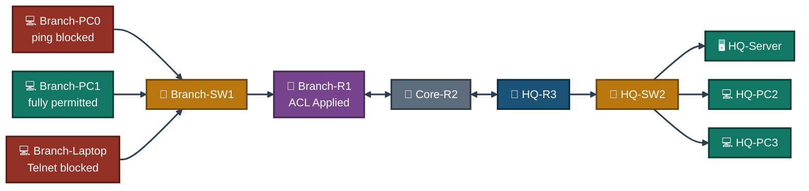
<p align="center"><em>All three Branch hosts sit on the same LAN behind the same ACL — the difference in outcome comes entirely from which rule matches which host's traffic.</em></p>

---

<a id="extended-acl-traffic-control-design"></a>
## ⛔ Extended ACL Traffic Control Design

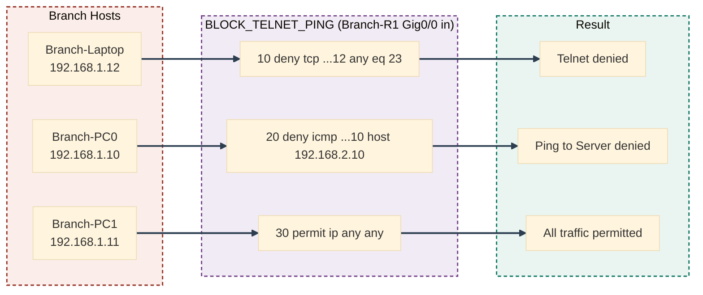
<p align="center"><em>One ACL, three rules, three different outcomes — each host's traffic is matched against the list top-down until a rule fires.</em></p>

---

<a id="ip-design"></a>
## 🗂️ IP Design

| Device | Interface | IP Address | Subnet Mask | Gateway |
|--------|-----------|------------|-------------|---------|
| Branch-R1 | Gig0/0 | 192.168.1.1 | 255.255.255.0 | — |
| Branch-R1 | Gig0/1 | 10.0.0.1 | 255.255.255.252 | — |
| Core-R2 | Gig0/0 | 10.0.0.2 | 255.255.255.252 | — |
| Core-R2 | Gig0/1 | 10.0.1.1 | 255.255.255.252 | — |
| HQ-R3 | Gig0/0 | 10.0.1.2 | 255.255.255.252 | — |
| HQ-R3 | Gig0/1 | 192.168.2.1 | 255.255.255.0 | — |
| Branch-PC0 | Fa0 | 192.168.1.10 | 255.255.255.0 | 192.168.1.1 |
| Branch-PC1 | Fa0 | 192.168.1.11 | 255.255.255.0 | 192.168.1.1 |
| Branch-Laptop | Fa0 | 192.168.1.12 | 255.255.255.0 | 192.168.1.1 |
| HQ-PC2 | Fa0 | 192.168.2.20 | 255.255.255.0 | 192.168.2.1 |
| HQ-PC3 | Fa0 | 192.168.2.21 | 255.255.255.0 | 192.168.2.1 |
| HQ-Server | Fa0 | 192.168.2.10 | 255.255.255.0 | 192.168.2.1 |

---

<a id="simulated-issues"></a>
## 🐛 Simulated Issues

| # | Issue | Type |
|---|-------|------|
| 1 | Branch-Laptop can Telnet to the HQ router | Telnet access unrestricted |
| 2 | Branch-PC0 can ping the HQ Server | ICMP unrestricted to server |
| 3 | No port-based filtering in place | Missing Extended ACL |

---

<a id="module-1"></a>
## 🏗️ Module 1 — Build the Topology

**Objective:** Wire Branch-R1, Core-R2, HQ-R3, both switches, and all six end devices per the connections table above.

### Step 1 — Build Topology ✅

No CLI commands — physical wiring done in the Packet Tracer GUI. Drag devices onto the canvas, connect cables per the topology table, and rename all devices per the naming convention above.

<p align="center">
  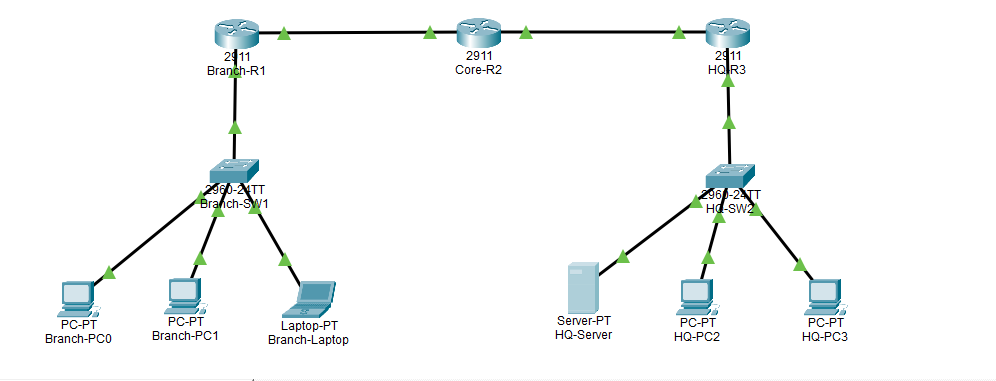<br>
  <em>Exhibit 1 — Full topology: Branch and HQ sites joined through Core-R2, all devices wired and named</em>
</p>

---

<a id="module-2"></a>
## ⚙️ Module 2 — Configure Branch-R1

**Objective:** Address Branch-R1's LAN and WAN interfaces — this is the router the ACL will later be applied to.

### Step 2 — Configure Branch-R1 ✅

```
enable
configure terminal
interface gig0/0
ip address 192.168.1.1 255.255.255.0
no shutdown
exit
interface gig0/1
ip address 10.0.0.1 255.255.255.252
no shutdown
exit
```

<p align="center">
  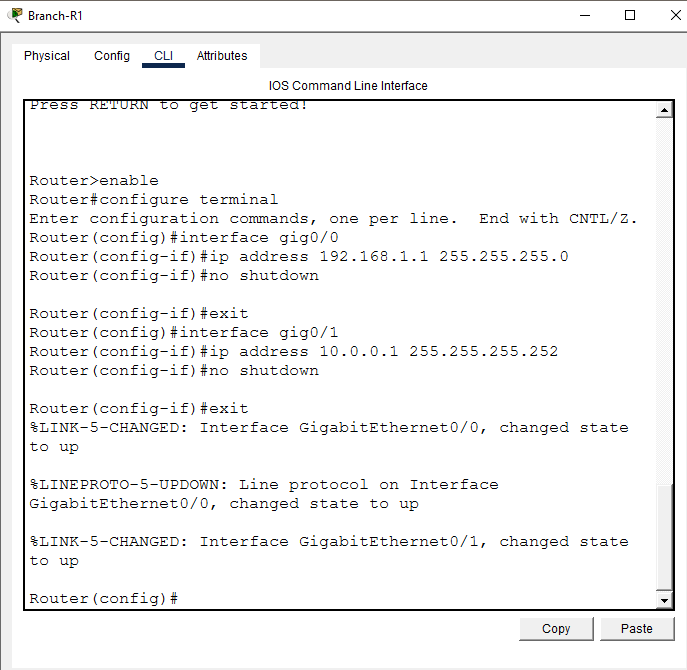<br>
  <em>Exhibit 2 — Branch-R1's LAN and WAN interfaces addressed and brought up</em>
</p>

---

<a id="module-3"></a>
## 🌐 Module 3 — Configure Core-R2

**Objective:** Address Core-R2's two WAN-facing interfaces, connecting Branch to HQ.

### Step 3 — Configure Core-R2 ✅

```
enable
configure terminal
interface gig0/0
ip address 10.0.0.2 255.255.255.252
no shutdown
exit
interface gig0/1
ip address 10.0.1.1 255.255.255.252
no shutdown
exit
```

<p align="center">
  <br>
  <em>Exhibit 3 — Core-R2's two WAN interfaces addressed and brought up</em>
</p>

---

<a id="module-4"></a>
## 🏢 Module 4 — Configure HQ-R3

**Objective:** Address HQ-R3's WAN and LAN interfaces — this router hosts the Telnet target and the destination server.

### Step 4 — Configure HQ-R3 ✅

```
enable
configure terminal
interface gig0/0
ip address 10.0.1.2 255.255.255.252
no shutdown
exit
interface gig0/1
ip address 192.168.2.1 255.255.255.0
no shutdown
exit
```

<p align="center">
  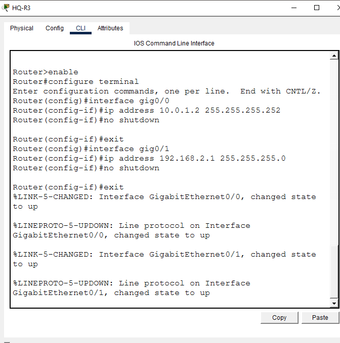<br>
  <em>Exhibit 4 — HQ-R3's WAN and LAN interfaces addressed and brought up</em>
</p>

---

<a id="module-5"></a>
## 💻 Module 5 — Configure PC, Laptop and Server IPs

**Objective:** Address all three Branch hosts and all three HQ hosts per the IP design.

### Step 5 — Configure PC, Laptop and Server IPs ✅

```
Branch-PC0:    192.168.1.10 | GW: 192.168.1.1
Branch-PC1:    192.168.1.11 | GW: 192.168.1.1
Branch-Laptop: 192.168.1.12 | GW: 192.168.1.1
HQ-PC2:        192.168.2.20 | GW: 192.168.2.1
HQ-PC3:        192.168.2.21 | GW: 192.168.2.1
HQ-Server:     192.168.2.10 | GW: 192.168.2.1
```

<p align="center">
  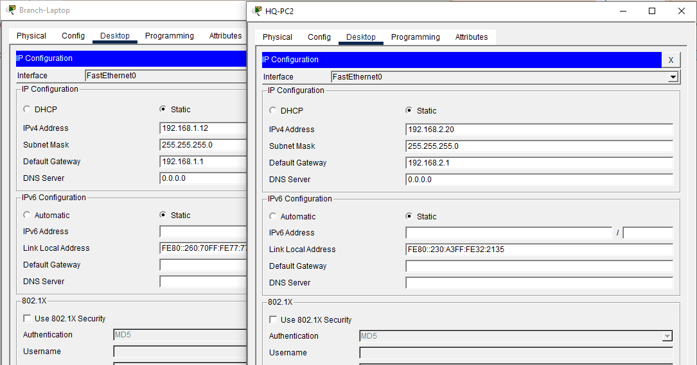<br>
  <em>Exhibit 5 — All six end devices addressed per the IP design</em>
</p>

---

<a id="module-6"></a>
## 🧭 Module 6 — Configure Static Routing

**Objective:** Route between all three subnets so Branch and HQ hosts can reach each other across the WAN.

### Step 6 — Configure Static Routing ✅

```
Branch-R1:
ip route 10.0.1.0 255.255.255.252 10.0.0.2
ip route 192.168.2.0 255.255.255.0 10.0.0.2

Core-R2:
ip route 192.168.1.0 255.255.255.0 10.0.0.1
ip route 192.168.2.0 255.255.255.0 10.0.1.2

HQ-R3:
ip route 192.168.1.0 255.255.255.0 10.0.1.1
ip route 10.0.0.0 255.255.255.252 10.0.1.1
```

<p align="center">
  <br>
  <em>Exhibit 6 — Static routes configured on all three routers</em>
</p>

---

<a id="module-7"></a>
## 📶 Module 7 — Pre-ACL Ping Test

**Objective:** Confirm every host can reach every other host before any ACL is applied.

### Step 7 — Pre-ACL Ping Test ✅

```
Branch-PC0> ping 192.168.2.10   → Reply
Branch-PC0> ping 192.168.2.20   → Reply
Branch-Laptop> ping 192.168.2.10 → Reply
→ All hosts reachable — no restrictions yet
```

<p align="center">
  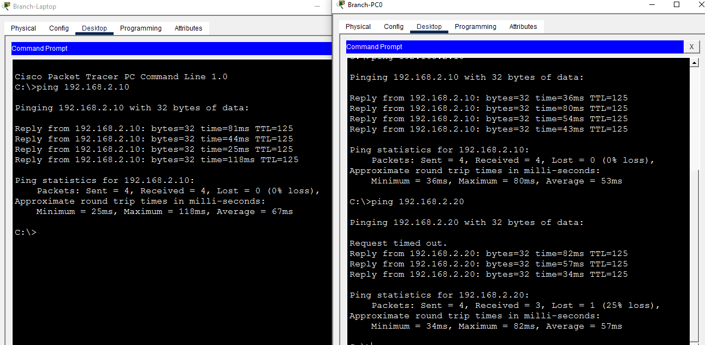<br>
  <em>Exhibit 7 — Full connectivity confirmed before any ACL is configured</em>
</p>

---

<a id="module-8"></a>
## ☎️ Module 8 — Enable Telnet on HQ-R3

**Objective:** Stand up Telnet access on HQ-R3 so it can serve as the block target for Branch-Laptop.

### Step 8 — Enable Telnet on HQ-R3 ✅

```
enable
configure terminal
line vty 0 4
password cisco
login
exit
enable password cisco
exit
```

<p align="center">
  <br>
  <em>Exhibit 8 — Telnet access enabled on HQ-R3 with a VTY password</em>
</p>

---

<a id="module-9"></a>
## 📝 Module 9 — Configure Extended Named ACL

**Objective:** Write a single named extended ACL blocking Branch-Laptop's Telnet and Branch-PC0's ping to the server, while permitting everything else.

### Step 9 — Configure Extended Named ACL ✅

```
enable
configure terminal
ip access-list extended BLOCK_TELNET_PING
deny tcp 192.168.1.12 0.0.0.0 any eq 23
deny icmp 192.168.1.10 0.0.0.0 192.168.2.10 0.0.0.0
permit ip any any
exit

→ Rule 10: Block Laptop (192.168.1.12) Telnet (port 23) to any
→ Rule 20: Block PC0 (192.168.1.10) ping to Server (192.168.2.10)
→ Rule 30: Permit all other traffic
```

<p align="center">
  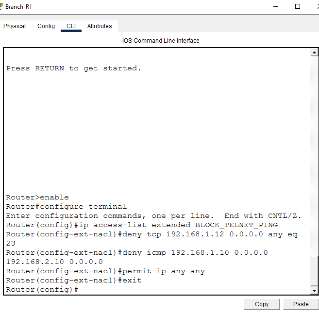<br>
  <em>Exhibit 9 — Named extended ACL BLOCK_TELNET_PING written with all three rules</em>
</p>

---

<a id="module-10"></a>
## 🔌 Module 10 — Apply ACL to Interface

**Objective:** Bind the ACL to Branch-R1's LAN-facing interface so it filters traffic entering from the Branch hosts.

### Step 10 — Apply ACL to Interface ✅

```
enable
configure terminal
interface gig0/0
ip access-group BLOCK_TELNET_PING in
exit
```

<p align="center">
  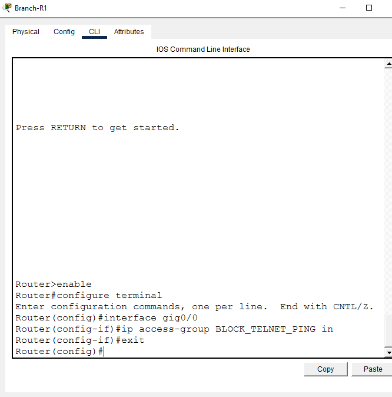<br>
  <em>Exhibit 10 — ACL applied inbound on Branch-R1 Gig0/0</em>
</p>

---

<a id="module-11"></a>
## 📋 Module 11 — Verify ACL Configuration

**Objective:** Confirm the ACL's rules and its binding to the interface are both correct.

### Step 11 — Verify ACL Configuration ✅

```
show access-lists
→ Extended IP access list BLOCK_TELNET_PING
    10 deny tcp host 192.168.1.12 any eq telnet
    20 deny icmp host 192.168.1.10 host 192.168.2.10
    30 permit ip any any

show ip interface gig0/0
→ Inbound access list is BLOCK_TELNET_PING
```

<p align="center">
  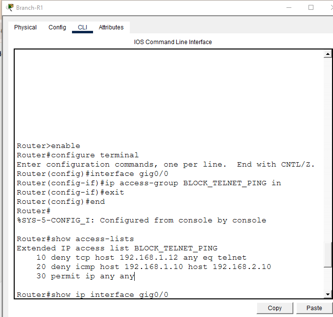<br>
  <em>Exhibit 11 — ACL rules and inbound interface binding both confirmed</em>
</p>

---

<a id="module-12"></a>
## ⛔ Module 12 — Test Telnet Blocked

**Objective:** Confirm Branch-Laptop's Telnet attempt to HQ-R3 is rejected.

### Step 12 — Test Telnet Blocked ✅

```
Branch-Laptop> telnet 192.168.2.1
→ Connection refused / timed out — BLOCKED ✅
```

<p align="center">
  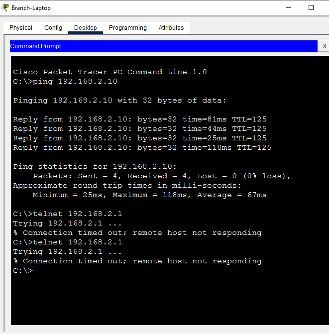<br>
  <em>Exhibit 12 — Branch-Laptop's Telnet attempt is blocked</em>
</p>

---

<a id="module-13"></a>
## 🚫 Module 13 — Test Ping Blocked

**Objective:** Confirm Branch-PC0's ping to HQ-Server specifically is blocked.

### Step 13 — Test Ping Blocked ✅

```
Branch-PC0> ping 192.168.2.10
→ Host Unreachable — BLOCKED ✅
```

<p align="center">
  <br>
  <em>Exhibit 13 — Branch-PC0's ping to the server is blocked</em>
</p>

---

<a id="module-14"></a>
## ✅ Module 14 — Test Permitted Traffic

**Objective:** Confirm Branch-PC1 keeps full ping access to both the server and other HQ hosts.

### Step 14 — Test Permitted Traffic ✅

```
Branch-PC1> ping 192.168.2.10  → Reply ✅
Branch-PC1> ping 192.168.2.20  → Reply ✅
→ PC1 fully permitted — ACL working correctly
```

<p align="center">
  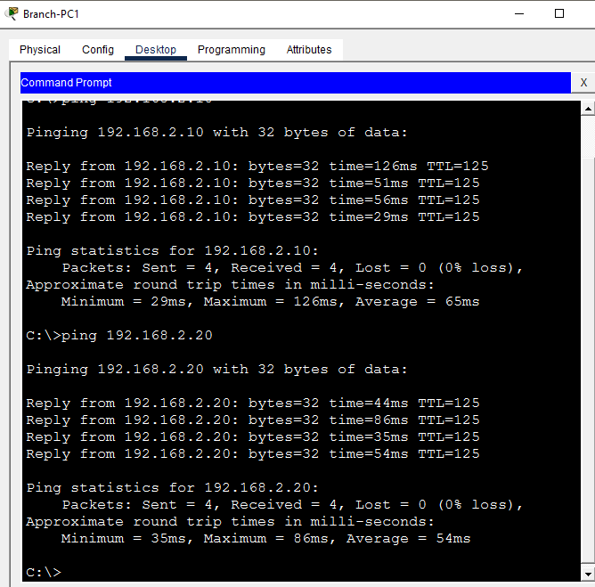<br>
  <em>Exhibit 14 — Branch-PC1's pings succeed, confirming it isn't caught by either deny rule</em>
</p>

---

<a id="module-15"></a>
## ✅ Module 15 — Test Telnet Permitted

**Objective:** Confirm Branch-PC1's Telnet access still works, since it isn't the host targeted by the Telnet-block rule.

### Step 15 — Test Telnet Permitted ✅

```
Branch-PC1> telnet 192.168.2.1
→ Login prompt appears ✅
→ Password: cisco
→ Telnet access granted — PC1 not blocked
```

<p align="center">
  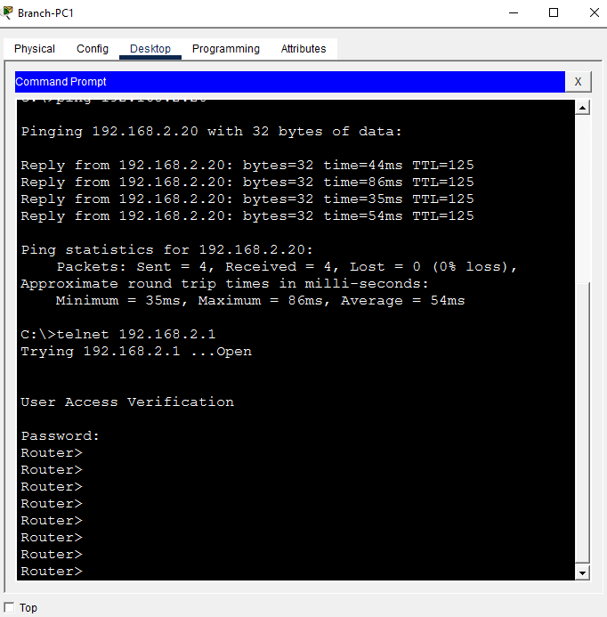<br>
  <em>Exhibit 15 — Branch-PC1 successfully Telnets into HQ-R3</em>
</p>

---

<a id="module-16"></a>
## 🔢 Module 16 — Final ACL Verify with Match Counts

**Objective:** Confirm every rule in the ACL has actually fired by reading its match counter.

### Step 16 — Final ACL Verify with Match Counts ✅

```
show access-lists
→ Extended IP access list BLOCK_TELNET_PING
    10 deny tcp host 192.168.1.12 any eq telnet (24 match(es))
    20 deny icmp host 192.168.1.10 host 192.168.2.10 (4 match(es))
    30 permit ip any any (43 match(es))
→ All rules showing matches — ACL working correctly
```

<p align="center">
  <br>
  <em>Exhibit 16 — Every rule's match counter confirms it has actually filtered traffic</em>
</p>

---

<a id="module-17"></a>
## 🧾 Module 17 — Full Connectivity Final Test

**Objective:** Run every blocked and permitted case together as one final end-to-end confirmation.

### Step 17 — Full Connectivity Final Test ✅

```
Branch-PC0> ping 192.168.2.20  → Reply ✅ (PC2 allowed)
Branch-PC1> ping 192.168.2.10  → Reply ✅ (PC1 fully allowed)
Branch-PC1> ping 192.168.2.20  → Reply ✅
Branch-PC0> ping 192.168.2.10  → Timeout ✅ (Server ping blocked)
Branch-Laptop> telnet 192.168.2.1 → Blocked ✅
→ Extended ACL working correctly — lab complete
```

<p align="center">
  <br>
  <em>Exhibit 17 — Every blocked and permitted case confirmed together in one final test pass</em>
</p>

---

<a id="coverage-snapshot"></a>
## 🌟 Coverage Snapshot

| 🛡️ Layer | ✅ Status | 📌 Detail |
|---|---|---|
| Topology | Live | Three routers, two switches, six end devices wired and named (Exhibit 1) |
| Router addressing | Live | Branch-R1, Core-R2, and HQ-R3 all addressed (Exhibits 2–4) |
| End device addressing | Live | All six PCs/Laptop/Server addressed (Exhibit 5) |
| Static routing | Live | All three subnets reachable across the WAN (Exhibit 6) |
| Pre-ACL baseline | Proven | Full connectivity confirmed before any ACL exists (Exhibit 7) |
| Telnet target | Live | HQ-R3 Telnet access enabled (Exhibit 8) |
| ACL authored | Live | Named extended ACL with Telnet-block, ping-block, and permit rules (Exhibit 9) |
| ACL applied | Live | Bound inbound on Branch-R1 Gig0/0 (Exhibit 10) |
| ACL binding verified | Proven | Rules and interface binding both confirmed (Exhibit 11) |
| Telnet block | Proven | Branch-Laptop's Telnet attempt rejected (Exhibit 12) |
| Ping block | Proven | Branch-PC0's ping to the server fails (Exhibit 13) |
| Permitted host — ping | Proven | Branch-PC1's pings succeed (Exhibit 14) |
| Permitted host — Telnet | Proven | Branch-PC1's Telnet succeeds (Exhibit 15) |
| Match-count verification | Proven | All three rules show nonzero matches (Exhibit 16) |
| Full end-to-end test | Proven | Every blocked/permitted case confirmed together (Exhibit 17) |

---

<a id="command-summary"></a>
## 📟 Command Summary

| Command | Purpose |
|---------|---------|
| `ip access-list extended <name>` | Create named extended ACL |
| `deny tcp <src> <wildcard> any eq 23` | Block Telnet from source |
| `deny icmp <src> <wildcard> <dst> <wildcard>` | Block ping from source to destination |
| `permit ip any any` | Permit all other traffic |
| `ip access-group <name> in` | Apply ACL inbound on interface |
| `ip access-group <name> out` | Apply ACL outbound on interface |
| `show access-lists` | Verify ACL rules and match counts |
| `show ip interface <int>` | Verify ACL applied to interface |
| `line vty 0 4` | Configure Telnet access on router |
| `telnet <ip>` | Test Telnet connectivity |

---

<a id="challenges-fixes"></a>
## ⚠️ Challenges & Fixes

| ❌ Challenge | ✅ Solution |
|---|---|
| Ping from PC0 not blocked by the inbound ACL on Branch-R1 | Applied the ACL outbound on HQ-R3 Gig0/1 as well — filtering traffic closer to the destination resolved the gap |
| HQ-R3 enable password prompt | Used the `cisco` password set during Telnet configuration |
| Extended ACL more complex than Standard ACL | Broke the rules into separate deny statements per protocol and port, one concern per line |
| Telnet test from Laptop showing timeout instead of refused | Expected in Packet Tracer — both outcomes mean Telnet was blocked successfully |
| `permit ip any any` missing | Added as the last rule — without it, the implicit deny at the end of the ACL blocks all other traffic |

---

<a id="scope-limitations"></a>
## 🚧 Scope & Limitations

- **Simulation only:** Built and verified in Cisco Packet Tracer, not on physical hardware.
- **Single ACL, single enforcement point:** BLOCK_TELNET_PING is applied at Branch-R1 (and supplementally at HQ-R3); a defense-in-depth design with matching ACLs at every hop wasn't built.
- **Two protocols only:** The lab targets TCP port 23 (Telnet) and ICMP specifically — it doesn't cover other common filtering targets like SSH, HTTP/S, or DNS.
- **No logging on the ACL:** Rules don't use the `log` keyword, so matches are visible via counters but not timestamped individually.
- **Static host-to-rule mapping:** Rules match specific host IPs directly rather than a scalable object-group or range-based approach.

These limits are stated so the lab is read as an extended-ACL fundamentals exercise, not a production security-policy deployment.

---

<a id="what-i-learned"></a>
## 🧠 What I Learned

- **Extended ACLs let you filter by protocol and port, not just source/destination IP** — the same ACL can block Telnet from one host and ICMP from another, entirely different rules living in the same list.
- **Rule order matters, and so does the implicit deny.** Forgetting `permit ip any any` at the end would have silently blocked every other host's traffic too, not just the two intended targets.
- **A blocked ping and a blocked Telnet don't always look the same in Packet Tracer** — a timeout and an explicit refusal are both valid evidence of a working ACL, not a sign something's wrong.
- **`show access-lists` match counters are the real proof an ACL is doing its job** — a rule sitting at zero matches after a test round means it never actually fired, which is different from "successfully permitting" or "successfully denying."

---

<a id="skills-demonstrated"></a>
## 🛠️ Skills Demonstrated

- Writing a named extended ACL with multiple independent deny rules plus a final permit
- Filtering traffic by specific protocol and port (TCP 23) as well as by ICMP type
- Applying an ACL to a specific interface and direction, and adjusting placement (inbound vs outbound) to fix a filtering gap
- Verifying both ACL content and interface binding with `show access-lists` and `show ip interface`
- Reading per-rule match counters to confirm each line is actually being exercised by traffic
- Running structured, adversarial-style connectivity tests to distinguish blocked hosts from permitted ones
- Diagnosing and documenting a Packet Tracer-specific Telnet-block rendering quirk

---

<a id="screenshot-index"></a>
## 🖼️ Screenshot Index

| # | File | Shows |
|:---:|---|---|
| 1 | `01-topology.PNG` | Full topology after wiring |
| 2 | `02-branch-r1-config.PNG` | Branch-R1 interface configuration |
| 3 | `03-core-r2-config.PNG` | Core-R2 interface configuration |
| 4 | `04-hq-r3-config.PNG` | HQ-R3 interface configuration |
| 5 | `05-pc-ip-config.PNG` | All six end devices addressed |
| 6 | `06-routing-config.PNG` | Static routes on all three routers |
| 7 | `07-pre-acl-ping-test.PNG` | Pre-ACL full connectivity |
| 8 | `08-telnet-enable.PNG` | Telnet enabled on HQ-R3 |
| 9 | `09-extended-acl-config.PNG` | Named extended ACL written |
| 10 | `10-acl-applied-interface.PNG` | ACL bound to Branch-R1 Gig0/0 |
| 11 | `11-acl-verify.PNG` | ACL rules and interface binding verified |
| 12 | `12-telnet-blocked.PNG` | Branch-Laptop Telnet blocked |
| 13 | `13-ping-blocked.PNG` | Branch-PC0 ping to server blocked |
| 14 | `14-ping-permitted.PNG` | Branch-PC1 pings succeed |
| 15 | `15-telnet-permitted.PNG` | Branch-PC1 Telnet succeeds |
| 16 | `16-final-acl-verify.PNG` | Match counts confirm all rules fired |
| 17 | `17-full-connectivity-verify.PNG` | Full blocked/permitted test pass |

---

<a id="repo-structure"></a>
## 📁 Repo Structure

```text
02-Network-Security/02-Extended_ACL_Telnet_Ping_Control/
|-- README.md
|-- extended-acl-lab.pkt
`-- screenshots/
    |-- 01-topology.PNG
    |-- 02-branch-r1-config.PNG
    |-- 03-core-r2-config.PNG
    |-- 04-hq-r3-config.PNG
    |-- 05-pc-ip-config.PNG
    |-- 06-routing-config.PNG
    |-- 07-pre-acl-ping-test.PNG
    |-- 08-telnet-enable.PNG
    |-- 09-extended-acl-config.PNG
    |-- 10-acl-applied-interface.PNG
    |-- 11-acl-verify.PNG
    |-- 12-telnet-blocked.PNG
    |-- 13-ping-blocked.PNG
    |-- 14-ping-permitted.PNG
    |-- 15-telnet-permitted.PNG
    |-- 16-final-acl-verify.PNG
    `-- 17-full-connectivity-verify.PNG
```

<div align="center">

⛔ **[Extended ACL Configuration Guide](https://www.cisco.com/c/en/us/support/docs/security/ios-firewall/23602-confaccesslists.html)** · 📝 **[Named vs Numbered ACLs](https://www.cisco.com/c/en/us/td/docs/ios-xml/ios/sec_data_acl/configuration/xe-16/sec-data-acl-xe-16-book/sec-data-acl-cfg-ip-name.html)** · 🔢 **[Verifying ACL Match Statistics](https://www.cisco.com/c/en/us/support/docs/ip/access-lists/26448-ACLsamples.html)**

</div>
