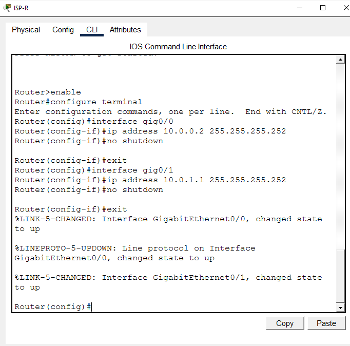
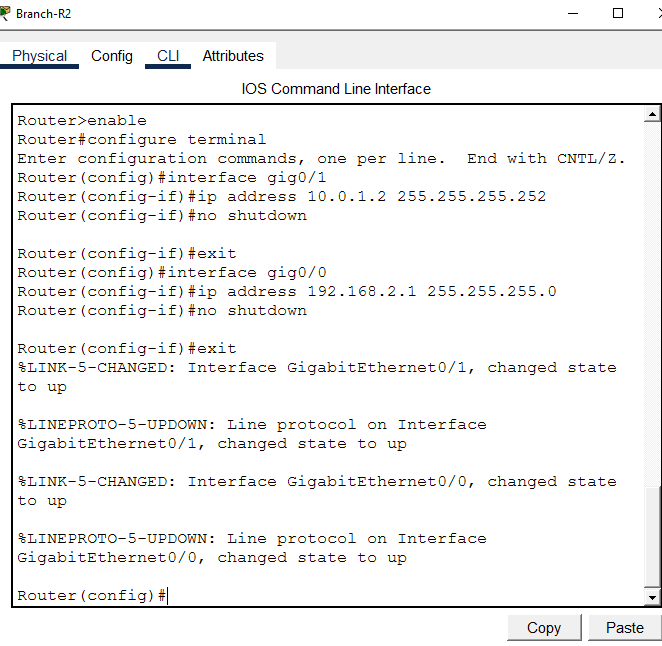
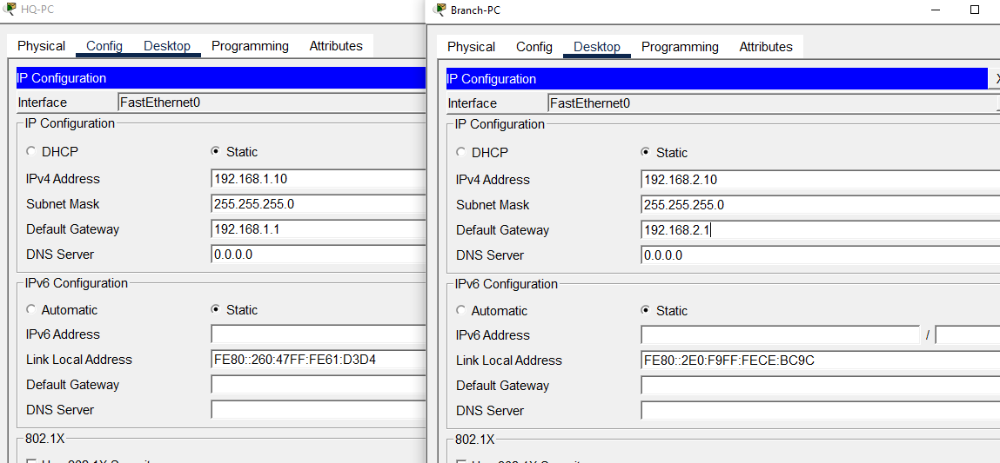
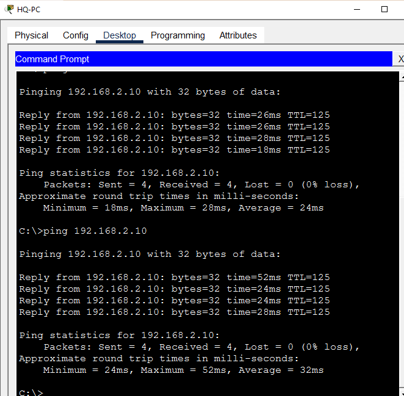
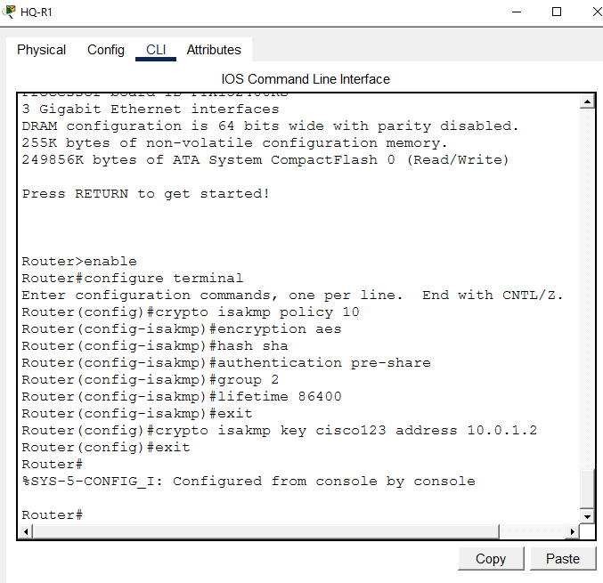
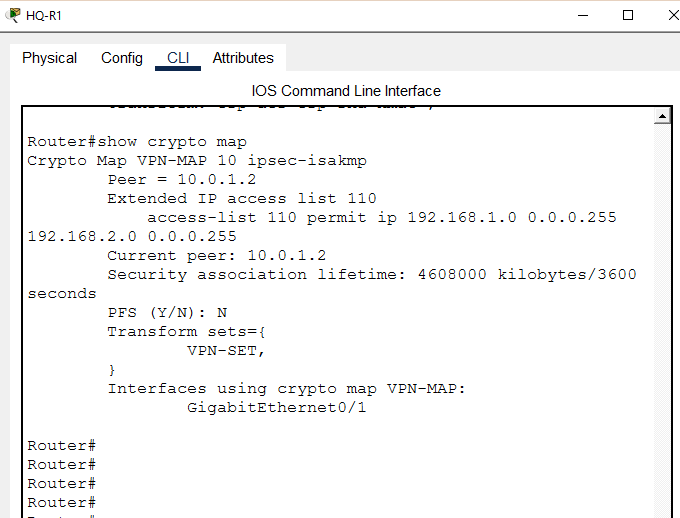
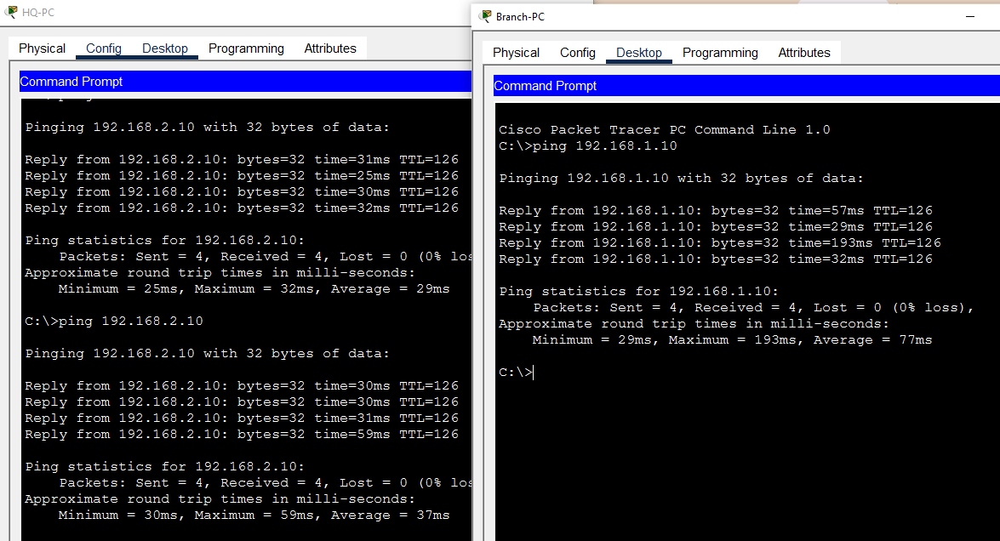

<div align="center">

# 🔐 IPsec VPN — Site-to-Site Tunnel

**Network Security Lab 03 — Cisco Networking Lab Portfolio**

Encrypted Site-to-Site IPsec Tunnel Between HQ and Branch Over a Public ISP — IKE Phase 1 ISAKMP Policy, IKE Phase 2 Transform Sets, Crypto Maps, and Verified Encrypted Packet Counts (Cisco Packet Tracer)


A full-mesh, two-peer IPsec VPN built across an HQ-ISP-Branch topology — HQ-R1 and Branch-R2 negotiate an IKE Phase 1 ISAKMP tunnel over a pre-shared key, then bring up an IKE Phase 2 IPsec SA to encrypt traffic between their LANs. ISP-R sits in the middle as an untrusted transit router that never sees the pre-VPN plaintext once the tunnel is live. Verification goes past a successful ping — both `show crypto isakmp sa` and `show crypto ipsec sa` are read to confirm the tunnel state and the actual encrypt/decrypt packet counts before calling the lab done.

</div>

---

## 📑 Table of Contents

1. [At a Glance](#at-a-glance)
2. [Project Background](#project-background)
3. [Tools & Technologies](#tools-technologies)
4. [Environment](#environment)
5. [Topology](#topology)
6. [IPsec VPN Tunnel Design](#ipsec-vpn-tunnel-design)
7. [IP Design](#ip-design)
8. [Simulated Issues](#simulated-issues)
9. [Module 1 — Build the Topology](#module-1)
10. [Module 2 — Configure HQ-R1](#module-2)
11. [Module 3 — Configure ISP-R](#module-3)
12. [Module 4 — Configure Branch-R2](#module-4)
13. [Module 5 — Configure PC IPs](#module-5)
14. [Module 6 — Configure Static Routing](#module-6)
15. [Module 7 — Pre-VPN Ping Test](#module-7)
16. [Module 8 — Configure IKE Phase 1 on HQ-R1](#module-8)
17. [Module 9 — Configure IPsec Transform Set on HQ-R1](#module-9)
18. [Module 10 — Configure Crypto Map on HQ-R1](#module-10)
19. [Module 11 — Configure IKE Phase 1 on Branch-R2](#module-11)
20. [Module 12 — Configure Transform Set & Crypto Map on Branch-R2](#module-12)
21. [Module 13 — Test VPN Tunnel](#module-13)
22. [Module 14 — Verify IKE Phase 1 SA](#module-14)
23. [Module 15 — Verify IPsec SA](#module-15)
24. [Module 16 — Verify Crypto Map](#module-16)
25. [Module 17 — Final VPN Connectivity Test](#module-17)
26. [Coverage Snapshot](#coverage-snapshot)
27. [Command Summary](#command-summary)
28. [Challenges & Fixes](#challenges-fixes)
29. [Scope & Limitations](#scope-limitations)
30. [What I Learned](#what-i-learned)
31. [Skills Demonstrated](#skills-demonstrated)
32. [Screenshot Index](#screenshot-index)
33. [Repo Structure](#repo-structure)

---

<a id="at-a-glance"></a>
## 📊 At a Glance

<div align="center">

| 🔐 VPN Peers | 🚪 Routers | 🔀 Switches | 🖥️ Hosts | 🔑 IKE Phases | 🖼️ Screenshots |
|:---:|:---:|:---:|:---:|:---:|:---:|
| **2 (HQ-R1 ↔ Branch-R2)** | **3** | **2** | **2** | **1 + 2 (ISAKMP + IPsec)** | **17** |

</div>

---

<a id="project-background"></a>
## 📖 Project Background

This lab builds a Site-to-Site IPsec VPN between HQ-R1 and Branch-R2, tunneled across ISP-R as an untrusted transit router. IKE Phase 1 establishes an authenticated ISAKMP session using a pre-shared key, AES encryption, SHA hashing, and Diffie-Hellman group 2. IKE Phase 2 then negotiates the actual IPsec SA using an ESP-AES/ESP-SHA-HMAC transform set, with a crypto map binding the peer, the transform set, and an ACL that defines which traffic is "interesting" enough to encrypt. Verification is deliberately granular — both the Phase 1 ISAKMP SA state and the Phase 2 encrypt/decrypt packet counters are read individually, not just a pass/fail ping, to confirm the tunnel is actually doing the work.

| Module | Focus |
|---|---|
| 🏗️ **Module 1 — Build the Topology** | Wire 3 routers, 2 switches, and 2 end devices |
| ⚙️ **Module 2 — Configure HQ-R1** | Address the HQ VPN endpoint router |
| 🌐 **Module 3 — Configure ISP-R** | Address the untrusted transit router |
| 🏢 **Module 4 — Configure Branch-R2** | Address the Branch VPN endpoint router |
| 💻 **Module 5 — Configure PC IPs** | Address the HQ and Branch end devices |
| 🧭 **Module 6 — Static Routing** | Route across all three subnets |
| 📶 **Module 7 — Pre-VPN Ping Test** | Confirm connectivity exists before any encryption |
| 🔑 **Module 8 — IKE Phase 1 on HQ-R1** | Enable the security license and configure ISAKMP policy |
| 📝 **Module 9 — IPsec Transform Set on HQ-R1** | Define the ESP-AES / ESP-SHA-HMAC transform set |
| 🗺️ **Module 10 — Crypto Map on HQ-R1** | Bind peer, transform set, and interesting-traffic ACL |
| 🔑 **Module 11 — IKE Phase 1 on Branch-R2** | Mirror the ISAKMP policy on the Branch side |
| 🗺️ **Module 12 — Transform Set & Crypto Map on Branch-R2** | Mirror Phase 2 config on the Branch side |
| 🔌 **Module 13 — Test VPN Tunnel** | Trigger tunnel negotiation with a ping |
| 📋 **Module 14 — Verify IKE Phase 1 SA** | Confirm the ISAKMP tunnel is ACTIVE |
| 🔢 **Module 15 — Verify IPsec SA** | Confirm actual encrypt/decrypt packet counts |
| 🗺️ **Module 16 — Verify Crypto Map** | Confirm peer, ACL, and interface binding |
| 🧾 **Module 17 — Final VPN Connectivity Test** | Confirm bidirectional encrypted traffic |

> [!NOTE]
> This is a Packet Tracer simulation, not physical hardware. The `securityk9` license must be enabled with `write memory` and a `reload` on **both** HQ-R1 and Branch-R2 before any `crypto` command becomes available — skipping the reload is the most common reason `crypto isakmp policy` silently fails.

---

<a id="tools-technologies"></a>
## 🛠️ Tools & Technologies

| Tool | Purpose |
|------|---------|
| 🖥️ Cisco Packet Tracer | Network topology simulation |
| 🚪 Router 2911 x3 | HQ-R1, ISP-R, Branch-R2 |
| 🔀 Switch 2960 x2 | HQ-SW1, Branch-SW2 |
| 🔐 IPsec | IP Security — VPN encryption protocol |
| 🔑 IKE Phase 1 (ISAKMP) | Authentication and key exchange |
| 🔒 IKE Phase 2 (IPsec SA) | Data encryption tunnel |
| 🔧 crypto isakmp policy | Define IKE Phase 1 parameters |
| 🔧 crypto ipsec transform-set | Define encryption and hashing algorithms |
| 🗺️ crypto map | Bind peer, transform set, and ACL together |
| 🧮 AES | Advanced Encryption Standard — data encryption |
| 🧮 SHA | Secure Hash Algorithm — data integrity |
| 🔑 Pre-shared key | Authentication method between VPN peers |
| 🔢 `show crypto isakmp sa` | Verify IKE Phase 1 tunnel status |
| 🔢 `show crypto ipsec sa` | Verify IKE Phase 2 encrypted packet counts |

---

<a id="environment"></a>
## 🖧 Environment


**Devices**

| Device | Model | Role |
|--------|-------|------|
| HQ-R1 | Router 2911 | HQ VPN Endpoint |
| ISP-R | Router 2911 | Untrusted Internet/ISP Transit Router |
| Branch-R2 | Router 2911 | Branch VPN Endpoint |
| HQ-SW1 | Switch 2960 | HQ LAN Switch |
| Branch-SW2 | Switch 2960 | Branch LAN Switch |
| HQ-PC | PC | HQ End User |
| Branch-PC | PC | Branch End User |

**Connections**

| From | Port | To | Port | Cable |
|------|------|----|------|-------|
| HQ-PC | Fa0 | HQ-SW1 | Fa0/1 | Copper Straight-Through |
| HQ-SW1 | Fa0/24 | HQ-R1 | Gig0/0 | Copper Straight-Through |
| HQ-R1 | Gig0/1 | ISP-R | Gig0/0 | Copper Straight-Through |
| ISP-R | Gig0/1 | Branch-R2 | Gig0/1 | Copper Straight-Through |
| Branch-R2 | Gig0/0 | Branch-SW2 | Fa0/24 | Copper Straight-Through |
| Branch-SW2 | Fa0/1 | Branch-PC | Fa0 | Copper Straight-Through |

---

<a id="topology"></a>
## 🗺️ Topology

```mermaid
%%{init: {'theme': 'base', 'themeVariables': {'fontSize': '14px'}, 'flowchart': {'nodeSpacing': 24, 'rankSpacing': 34, 'padding': 8}}}%%
flowchart LR
    PC1["💻 HQ-PC<br/>192.168.1.10"]:::ok --> SW1["🔀 HQ-SW1"]:::sw
    SW1 --> R1["🚪 HQ-R1<br/>VPN Endpoint"]:::vpn
    R1 <--> ISP["🚪 ISP-R<br/>Untrusted Transit"]:::isp
    ISP <--> R2["🚪 Branch-R2<br/>VPN Endpoint"]:::vpn
    R2 --> SW2["🔀 Branch-SW2"]:::sw
    SW2 --> PC2["💻 Branch-PC<br/>192.168.2.10"]:::ok
    classDef ok fill:#117864,stroke:#083D33,stroke-width:2px,color:#FFFFFF
    classDef sw fill:#B9770E,stroke:#6E4409,stroke-width:2px,color:#FFFFFF
    classDef vpn fill:#76448A,stroke:#432752,stroke-width:2px,color:#FFFFFF
    classDef isp fill:#943126,stroke:#571C16,stroke-width:2px,color:#FFFFFF
    linkStyle default stroke:#2C3E50,stroke-width:2px
```


<p align="center"><em>HQ-R1 and Branch-R2 are the only two devices that hold VPN configuration — ISP-R is a plain transit router that forwards encrypted packets without knowing what's inside them.</em></p>

---

<a id="ipsec-vpn-tunnel-design"></a>
## 🔐 IPsec VPN Tunnel Design

```mermaid
%%{init: {'theme': 'base', 'themeVariables': {'fontSize': '14px'}, 'flowchart': {'nodeSpacing': 40, 'rankSpacing': 50, 'padding': 10}}}%%
flowchart LR
    subgraph HQ["HQ-R1 (10.0.0.1)"]
        H1["ISAKMP Policy 10<br/>AES · SHA · pre-share · DH2"]
        H2["Transform Set VPN-SET<br/>esp-aes esp-sha-hmac"]
        H3["Crypto Map VPN-MAP<br/>peer 10.0.1.2 · ACL 110"]
    end
    subgraph TUNNEL["Encrypted Tunnel over ISP-R"]
        T1["ESP-encrypted traffic<br/>192.168.1.0/24 ↔ 192.168.2.0/24"]
    end
    subgraph BR["Branch-R2 (10.0.1.2)"]
        B1["ISAKMP Policy 10<br/>AES · SHA · pre-share · DH2"]
        B2["Transform Set VPN-SET<br/>esp-aes esp-sha-hmac"]
        B3["Crypto Map VPN-MAP<br/>peer 10.0.0.1 · ACL 110"]
    end
    H1 --> H2 --> H3 --> T1
    T1 --> B3 --> B2 --> B1
    style HQ fill:#F1EBF5,stroke:#76448A,stroke-width:1.5px,stroke-dasharray:4 3
    style TUNNEL fill:#EAF5F2,stroke:#117864,stroke-width:1.5px,stroke-dasharray:4 3
    style BR fill:#FBEEEA,stroke:#943126,stroke-width:1.5px,stroke-dasharray:4 3
    linkStyle default stroke:#2C3E50,stroke-width:2px
```


<p align="center"><em>Both endpoints run mirrored ISAKMP policies, transform sets, and crypto maps — only the peer IP and the direction of ACL 110 differ between the two sides.</em></p>

---

<a id="ip-design"></a>
## 🗂️ IP Design

| Device | Interface | IP Address | Subnet Mask | Gateway |
|--------|-----------|------------|-------------|---------|
| HQ-R1 | Gig0/0 | 192.168.1.1 | 255.255.255.0 | — |
| HQ-R1 | Gig0/1 | 10.0.0.1 | 255.255.255.252 | — |
| ISP-R | Gig0/0 | 10.0.0.2 | 255.255.255.252 | — |
| ISP-R | Gig0/1 | 10.0.1.1 | 255.255.255.252 | — |
| Branch-R2 | Gig0/1 | 10.0.1.2 | 255.255.255.252 | — |
| Branch-R2 | Gig0/0 | 192.168.2.1 | 255.255.255.0 | — |
| HQ-PC | Fa0 | 192.168.1.10 | 255.255.255.0 | 192.168.1.1 |
| Branch-PC | Fa0 | 192.168.2.10 | 255.255.255.0 | 192.168.2.1 |

---

<a id="simulated-issues"></a>
## 🐛 Simulated Issues

| # | Issue | Type |
|---|-------|------|
| 1 | Traffic between HQ and Branch travels unencrypted across the ISP | Insecure data transmission |
| 2 | No IKE/IPsec configuration exists on either endpoint | Missing IPsec VPN |
| 3 | `crypto` commands unavailable until the security license is enabled | Missing securityk9 license |

---

<a id="module-1"></a>
## 🏗️ Module 1 — Build the Topology

**Objective:** Wire HQ-R1, ISP-R, Branch-R2, both switches, and both end devices per the connections table above.

### Step 1 — Build Topology ✅

No CLI commands — physical wiring done in the Packet Tracer GUI. Drag devices onto the canvas, connect cables per the topology table, and rename all devices per the naming convention above.

<p align="center">
  <br>
  <em>Exhibit 1 — Full topology: HQ and Branch joined through ISP-R, all devices wired and named</em>
</p>

---

<a id="module-2"></a>
## ⚙️ Module 2 — Configure HQ-R1

**Objective:** Address HQ-R1's LAN and WAN interfaces — this router will later host one end of the VPN tunnel.

### Step 2 — Configure HQ-R1 ✅

```
enable
configure terminal
interface gig0/0
ip address 192.168.1.1 255.255.255.0
no shutdown
exit
interface gig0/1
ip address 10.0.0.1 255.255.255.252
no shutdown
exit
```

<p align="center">
  <br>
  <em>Exhibit 2 — HQ-R1's LAN and WAN interfaces addressed and brought up</em>
</p>

---

<a id="module-3"></a>
## 🌐 Module 3 — Configure ISP-R

**Objective:** Address ISP-R's two WAN-facing interfaces — this router carries traffic between sites but never joins the VPN.

### Step 3 — Configure ISP-R ✅

```
enable
configure terminal
interface gig0/0
ip address 10.0.0.2 255.255.255.252
no shutdown
exit
interface gig0/1
ip address 10.0.1.1 255.255.255.252
no shutdown
exit
```

<p align="center">
  <br>
  <em>Exhibit 3 — ISP-R's two WAN interfaces addressed and brought up</em>
</p>

---

<a id="module-4"></a>
## 🏢 Module 4 — Configure Branch-R2

**Objective:** Address Branch-R2's WAN and LAN interfaces — this router hosts the other end of the VPN tunnel.

### Step 4 — Configure Branch-R2 ✅

```
enable
configure terminal
interface gig0/1
ip address 10.0.1.2 255.255.255.252
no shutdown
exit
interface gig0/0
ip address 192.168.2.1 255.255.255.0
no shutdown
exit
```

<p align="center">
  <br>
  <em>Exhibit 4 — Branch-R2's WAN and LAN interfaces addressed and brought up</em>
</p>

---

<a id="module-5"></a>
## 💻 Module 5 — Configure PC IPs

**Objective:** Address the HQ and Branch end devices per the IP design.

### Step 5 — Configure PC IPs ✅

```
HQ-PC:     192.168.1.10 | Mask: 255.255.255.0 | GW: 192.168.1.1
Branch-PC: 192.168.2.10 | Mask: 255.255.255.0 | GW: 192.168.2.1
```

<p align="center">
  <br>
  <em>Exhibit 5 — Both end devices addressed per the IP design</em>
</p>

---

<a id="module-6"></a>
## 🧭 Module 6 — Configure Static Routing

**Objective:** Route between all three subnets so HQ and Branch hosts can reach each other across the ISP.

### Step 6 — Configure Static Routing ✅

```
HQ-R1:
ip route 0.0.0.0 0.0.0.0 10.0.0.2

ISP-R:
ip route 192.168.1.0 255.255.255.0 10.0.0.1
ip route 192.168.2.0 255.255.255.0 10.0.1.2

Branch-R2:
ip route 0.0.0.0 0.0.0.0 10.0.1.1
```

<p align="center">
  <br>
  <em>Exhibit 6 — Static routes configured on all three routers</em>
</p>

---

<a id="module-7"></a>
## 📶 Module 7 — Pre-VPN Ping Test

**Objective:** Confirm HQ and Branch can already reach each other — unencrypted — before any VPN configuration exists.

### Step 7 — Pre-VPN Ping Test ✅

```
HQ-PC> ping 192.168.2.10
→ Reply ✅ (unencrypted — no VPN yet)
```

<p align="center">
  <br>
  <em>Exhibit 7 — Baseline connectivity confirmed before any encryption is configured</em>
</p>

---

<a id="module-8"></a>
## 🔑 Module 8 — Configure IKE Phase 1 on HQ-R1

**Objective:** Enable the security license and configure the ISAKMP policy that authenticates the tunnel to Branch-R2.

### Step 8 — Configure IKE Phase 1 on HQ-R1 ✅

```
license boot module c2900 technology-package securityk9
→ yes → write memory → reload

enable
configure terminal
crypto isakmp policy 10
encryption aes
hash sha
authentication pre-share
group 2
lifetime 86400
exit
crypto isakmp key cisco123 address 10.0.1.2
exit
```

<p align="center">
  <br>
  <em>Exhibit 8 — IKE Phase 1 ISAKMP policy and pre-shared key configured on HQ-R1</em>
</p>

---

<a id="module-9"></a>
## 📝 Module 9 — Configure IPsec Transform Set on HQ-R1

**Objective:** Define the encryption and hashing algorithms IKE Phase 2 will use to build the data-encryption tunnel.

### Step 9 — Configure IPsec Transform Set on HQ-R1 ✅

```
enable
configure terminal
crypto ipsec transform-set VPN-SET esp-aes esp-sha-hmac
exit

→ Transform set VPN-SET created
→ Encryption: ESP-AES
→ Integrity: ESP-SHA-HMAC
```

<p align="center">
  <br>
  <em>Exhibit 9 — IPsec transform set VPN-SET defined on HQ-R1</em>
</p>

---

<a id="module-10"></a>
## 🗺️ Module 10 — Configure Crypto Map on HQ-R1

**Objective:** Bind the peer, the transform set, and the interesting-traffic ACL together, then apply the crypto map to the WAN interface.

### Step 10 — Configure Crypto Map on HQ-R1 ✅

```
enable
configure terminal
crypto map VPN-MAP 10 ipsec-isakmp
set peer 10.0.1.2
set transform-set VPN-SET
match address 110
exit
access-list 110 permit ip 192.168.1.0 0.0.0.255 192.168.2.0 0.0.0.255
interface gig0/1
crypto map VPN-MAP
exit

→ Crypto map applied to Gig0/1 (WAN interface)
→ ACL 110 defines interesting traffic
```

<p align="center">
  <br>
  <em>Exhibit 10 — Crypto map VPN-MAP built and bound to HQ-R1's WAN interface</em>
</p>

---

<a id="module-11"></a>
## 🔑 Module 11 — Configure IKE Phase 1 on Branch-R2

**Objective:** Mirror the ISAKMP policy on Branch-R2 so both peers authenticate on matching parameters.

### Step 11 — Configure IKE Phase 1 on Branch-R2 ✅

```
license boot module c2900 technology-package securityk9
→ yes → write memory → reload

enable
configure terminal
crypto isakmp policy 10
encryption aes
hash sha
authentication pre-share
group 2
lifetime 86400
exit
crypto isakmp key cisco123 address 10.0.0.1
exit
```

<p align="center">
  <br>
  <em>Exhibit 11 — Matching IKE Phase 1 ISAKMP policy configured on Branch-R2</em>
</p>

---

<a id="module-12"></a>
## 🗺️ Module 12 — Configure Transform Set & Crypto Map on Branch-R2

**Objective:** Mirror the Phase 2 transform set and crypto map on Branch-R2, with the ACL direction reversed and the peer pointed back at HQ-R1.

### Step 12 — Configure Transform Set & Crypto Map on Branch-R2 ✅

```
enable
configure terminal
crypto ipsec transform-set VPN-SET esp-aes esp-sha-hmac
exit
crypto map VPN-MAP 10 ipsec-isakmp
set peer 10.0.0.1
set transform-set VPN-SET
match address 110
exit
access-list 110 permit ip 192.168.2.0 0.0.0.255 192.168.1.0 0.0.0.255
interface gig0/1
crypto map VPN-MAP
exit
```

<p align="center">
  <br>
  <em>Exhibit 12 — Transform set and crypto map mirrored on Branch-R2</em>
</p>

---

<a id="module-13"></a>
## 🔌 Module 13 — Test VPN Tunnel

**Objective:** Trigger IKE negotiation by sending traffic that matches the interesting-traffic ACL.

### Step 13 — Test VPN Tunnel ✅

```
HQ-PC> ping 192.168.2.10
→ First ping may timeout (tunnel establishing)
→ Subsequent pings: Reply ✅
→ IPsec tunnel established!
```

<p align="center">
  <br>
  <em>Exhibit 13 — Ping traffic triggers IKE negotiation and the tunnel comes up</em>
</p>

---

<a id="module-14"></a>
## 📋 Module 14 — Verify IKE Phase 1 SA

**Objective:** Confirm the ISAKMP security association reached the ACTIVE, QM_IDLE state.

### Step 14 — Verify IKE Phase 1 SA ✅

```
show crypto isakmp sa

→ dst: 10.0.1.2  src: 10.0.0.1
→ State: QM_IDLE
→ Status: ACTIVE ✅
→ IKE Phase 1 tunnel active
```

<p align="center">
  <br>
  <em>Exhibit 14 — IKE Phase 1 ISAKMP SA confirmed active between HQ-R1 and Branch-R2</em>
</p>

---

<a id="module-15"></a>
## 🔢 Module 15 — Verify IPsec SA

**Objective:** Confirm the IKE Phase 2 tunnel is actually encrypting and decrypting packets, not just negotiated.

### Step 15 — Verify IPsec SA ✅

```
show crypto ipsec sa

→ interface: GigabitEthernet0/1
→ Crypto map: VPN-MAP
→ local:  192.168.1.0/255.255.255.0
→ remote: 192.168.2.0/255.255.255.0
→ pkts encaps: 11, encrypt: 11 ✅
→ pkts decaps: 10, decrypt: 10 ✅
→ Traffic successfully encrypted/decrypted
```

<p align="center">
  <br>
  <em>Exhibit 15 — Nonzero encrypt/decrypt packet counts confirm the tunnel is doing real work</em>
</p>

---

<a id="module-16"></a>
## 🗺️ Module 16 — Verify Crypto Map

**Objective:** Confirm the crypto map's peer, ACL, transform set, and interface binding are all correct.

### Step 16 — Verify Crypto Map ✅

```
show crypto map

→ Crypto Map VPN-MAP 10 ipsec-isakmp
→ Peer: 10.0.1.2
→ ACL 110: 192.168.1.0 → 192.168.2.0
→ Transform Set: VPN-SET
→ Interface: GigabitEthernet0/1 ✅
```

<p align="center">
  <br>
  <em>Exhibit 16 — Crypto map configuration and interface binding both confirmed on HQ-R1</em>
</p>

---

<a id="module-17"></a>
## 🧾 Module 17 — Final VPN Connectivity Test

**Objective:** Confirm the tunnel works bidirectionally as one final end-to-end check.

### Step 17 — Final VPN Connectivity Test ✅

```
HQ-PC> ping 192.168.2.10     → Reply ✅
Branch-PC> ping 192.168.1.10  → Reply ✅
→ Bidirectional encrypted VPN tunnel working ✅
→ IPsec VPN Site-to-Site complete!
```

<p align="center">
  <br>
  <em>Exhibit 17 — Bidirectional encrypted connectivity confirmed in one final test pass</em>
</p>

---

<a id="coverage-snapshot"></a>
## 🌟 Coverage Snapshot

| 🛡️ Layer | ✅ Status | 📌 Detail |
|---|---|---|
| Topology | Live | Three routers, two switches, two end devices wired and named (Exhibit 1) |
| Router addressing | Live | HQ-R1, ISP-R, and Branch-R2 all addressed (Exhibits 2–4) |
| End device addressing | Live | Both PCs addressed (Exhibit 5) |
| Static routing | Live | All three subnets reachable across the WAN (Exhibit 6) |
| Pre-VPN baseline | Proven | Unencrypted connectivity confirmed before any VPN exists (Exhibit 7) |
| IKE Phase 1 — HQ | Live | ISAKMP policy and pre-shared key configured on HQ-R1 (Exhibit 8) |
| IKE Phase 2 — HQ | Live | Transform set VPN-SET defined on HQ-R1 (Exhibit 9) |
| Crypto map — HQ | Live | Peer, transform set, and ACL bound and applied to Gig0/1 (Exhibit 10) |
| IKE Phase 1 — Branch | Live | Matching ISAKMP policy configured on Branch-R2 (Exhibit 11) |
| IKE Phase 2 — Branch | Live | Transform set and crypto map mirrored on Branch-R2 (Exhibit 12) |
| Tunnel negotiation | Proven | Ping traffic triggers IKE and the tunnel comes up (Exhibit 13) |
| Phase 1 SA verified | Proven | ISAKMP SA confirmed ACTIVE / QM_IDLE (Exhibit 14) |
| Phase 2 SA verified | Proven | Nonzero encrypt/decrypt packet counts confirmed (Exhibit 15) |
| Crypto map verified | Proven | Peer, ACL, transform set, and binding all confirmed (Exhibit 16) |
| Full end-to-end test | Proven | Bidirectional encrypted traffic confirmed (Exhibit 17) |

---

<a id="command-summary"></a>
## 📟 Command Summary

| Command | Purpose |
|---------|---------|
| `license boot module c2900 technology-package securityk9` | Enable security license |
| `crypto isakmp policy <num>` | Create IKE Phase 1 policy |
| `encryption aes` | Set AES encryption for IKE |
| `hash sha` | Set SHA hashing for integrity |
| `authentication pre-share` | Use pre-shared key authentication |
| `group 2` | Set Diffie-Hellman group 2 |
| `crypto isakmp key <key> address <peer-ip>` | Set pre-shared key for peer |
| `crypto ipsec transform-set <name> esp-aes esp-sha-hmac` | Define IPsec encryption |
| `crypto map <name> <num> ipsec-isakmp` | Create crypto map |
| `set peer <ip>` | Set VPN peer IP |
| `set transform-set <name>` | Bind transform set to crypto map |
| `match address <acl>` | Define interesting traffic ACL |
| `crypto map <name>` | Apply crypto map to interface |
| `show crypto isakmp sa` | Verify IKE Phase 1 tunnel |
| `show crypto ipsec sa` | Verify IKE Phase 2 encrypted packets |
| `show crypto map` | View crypto map configuration |

---

<a id="challenges-fixes"></a>
## ⚠️ Challenges & Fixes

| ❌ Challenge | ✅ Solution |
|---|---|
| `crypto isakmp` command not found | Security license not enabled — used `license boot module c2900 technology-package securityk9` then reloaded |
| License not taking effect after `yes` | Ran `write memory` then `reload` to apply the license |
| Commands typed outside `configure terminal` | Ensured all config commands were entered after `configure terminal` |
| First ping timing out after VPN config | Normal — the first ping triggers tunnel negotiation; subsequent pings succeed |
| Branch-R2 also needed the security license | Applied the same license procedure on Branch-R2 before configuring IPsec |

---

<a id="scope-limitations"></a>
## 🚧 Scope & Limitations

- **Simulation only:** Built and verified in Cisco Packet Tracer, not on physical hardware.
- **Single tunnel, two peers:** Only one Site-to-Site tunnel between HQ-R1 and Branch-R2 was built — no hub-and-spoke or multi-site mesh design.
- **Pre-shared key authentication only:** The lab uses `crypto isakmp key` with a shared secret rather than certificate-based (PKI) authentication.
- **No IKEv2 or GRE-over-IPsec:** The tunnel uses classic IKEv1 with a static crypto map, not IKEv2 or a routable GRE tunnel interface.
- **No logging on the interesting-traffic ACL:** ACL 110 doesn't use the `log` keyword, so matches are visible only via the IPsec SA packet counters, not individually timestamped.
- **Static host-to-subnet mapping:** The interesting-traffic ACL matches the two LAN subnets directly rather than a scalable object-group approach.

These limits are stated so the lab is read as a Site-to-Site IPsec fundamentals exercise, not a production VPN deployment.

---

<a id="what-i-learned"></a>
## 🧠 What I Learned

- **IPsec VPNs are built in two distinct phases, and each has its own SA to verify.** IKE Phase 1 (`show crypto isakmp sa`) only proves the peers authenticated each other — it says nothing about whether data is actually being encrypted.
- **The security license has to be enabled and the router reloaded before any `crypto` command exists.** A missing `crypto isakmp policy` command usually means the license step was skipped, not a typo.
- **The interesting-traffic ACL has to be a mirror image on each side.** HQ-R1's ACL permits 192.168.1.0/24 → 192.168.2.0/24; Branch-R2's ACL has to permit the same traffic in the reverse direction, or the SAs won't match.
- **`show crypto ipsec sa` packet counters are the real proof the tunnel is working.** A tunnel that's ACTIVE at Phase 1 but shows `encrypt: 0` at Phase 2 means traffic isn't actually flowing through it yet.

---

<a id="skills-demonstrated"></a>
## 🛠️ Skills Demonstrated

- Enabling the `securityk9` license and understanding why a `write memory` + `reload` cycle is required before `crypto` commands work
- Configuring an IKE Phase 1 ISAKMP policy with AES encryption, SHA hashing, pre-shared key authentication, and Diffie-Hellman group 2
- Configuring an IKE Phase 2 transform set with ESP-AES and ESP-SHA-HMAC
- Building and applying a crypto map that binds a peer, a transform set, and an interesting-traffic ACL to a WAN interface
- Mirroring VPN configuration correctly across two independent routers, including reversing ACL direction on the remote side
- Verifying both IKE Phase 1 SA state and IKE Phase 2 encrypt/decrypt packet counts, not just a successful ping
- Diagnosing a Packet Tracer-specific first-ping timeout during tunnel negotiation

---

<a id="screenshot-index"></a>
## 🖼️ Screenshot Index

| # | File | Shows |
|:---:|---|---|
| 1 | `01-topology.PNG` | Full topology after wiring |
| 2 | `02-hq-r1-config.PNG` | HQ-R1 interface configuration |
| 3 | `03-isp-r-config.PNG` | ISP-R interface configuration |
| 4 | `04-branch-r2-config.PNG` | Branch-R2 interface configuration |
| 5 | `05-pc-ip-config.PNG` | Both end devices addressed |
| 6 | `06-routing-config.PNG` | Static routes on all three routers |
| 7 | `07-pre-vpn-ping.PNG` | Pre-VPN unencrypted connectivity |
| 8 | `08-isakmp-policy-hq.PNG` | IKE Phase 1 policy on HQ-R1 |
| 9 | `09-ipsec-transform-hq.PNG` | IPsec transform set on HQ-R1 |
| 10 | `10-crypto-map-hq.PNG` | Crypto map applied on HQ-R1 |
| 11 | `11-isakmp-policy-branch.PNG` | IKE Phase 1 policy on Branch-R2 |
| 12 | `12-crypto-map-branch.PNG` | Transform set and crypto map on Branch-R2 |
| 13 | `13-vpn-tunnel-test.PNG` | Tunnel negotiation triggered by ping |
| 14 | `14-isakmp-sa-verify.PNG` | IKE Phase 1 SA confirmed active |
| 15 | `15-ipsec-sa-verify.PNG` | IKE Phase 2 encrypt/decrypt packet counts |
| 16 | `16-crypto-map-verify.PNG` | Crypto map configuration verified |
| 17 | `17-final-vpn-test.PNG` | Full bidirectional connectivity test pass |

---

<a id="repo-structure"></a>
## 📁 Repo Structure

```text
02-Network-Security/03-IPsec_VPN_Site_to_Site/
|-- README.md
|-- ipsec-vpn-lab.pkt
`-- screenshots/
    |-- 01-topology.PNG
    |-- 02-hq-r1-config.PNG
    |-- 03-isp-r-config.PNG
    |-- 04-branch-r2-config.PNG
    |-- 05-pc-ip-config.PNG
    |-- 06-routing-config.PNG
    |-- 07-pre-vpn-ping.PNG
    |-- 08-isakmp-policy-hq.PNG
    |-- 09-ipsec-transform-hq.PNG
    |-- 10-crypto-map-hq.PNG
    |-- 11-isakmp-policy-branch.PNG
    |-- 12-crypto-map-branch.PNG
    |-- 13-vpn-tunnel-test.PNG
    |-- 14-isakmp-sa-verify.PNG
    |-- 15-ipsec-sa-verify.PNG
    |-- 16-crypto-map-verify.PNG
    `-- 17-final-vpn-test.PNG
```

<div align="center">

🔐 **[IPsec VPN Configuration Guide](https://www.cisco.com/c/en/us/support/docs/security-vpn/ipsec-negotiation-ike-protocols/14106-how-vpn-works.html)** · 🔑 **[Configuring Site-to-Site IPsec VPN](https://www.cisco.com/c/en/us/support/docs/security/dynamic-multipoint-vpn-dmvpn/71462-isakmp-config.html)** · 🔢 **[Verifying IPsec SA Status](https://www.cisco.com/c/en/us/td/docs/ios-xml/ios/sec_conn_vpnips/configuration/xe-3s/sec-sec-for-vpns-w-ipsec-xe-3s-book/sec-cfg-vpn-availability.html)**

</div>
