<div align="center">

# 🛡️ Port Security & STP Loop Prevention

**Network Security Lab 04 — Cisco Networking Lab Portfolio**

Sticky MAC Port Security With Violation Shutdown, Paired With PortFast and BPDU Guard for STP Loop Prevention Across a Three-Switch Enterprise Network (Cisco Packet Tracer)


Four access ports across two switches locked down with sticky-learned MAC addresses, a maximum of one host per port, and violation shutdown as the enforcement action — paired with PortFast and BPDU Guard on the same ports to keep STP convergence fast and rogue switches out. Verification doesn't stop at "port went down" — a rogue device is physically moved onto an already-learned port to trigger a real violation, the err-disabled ports are recovered, and the Root Bridge state is re-confirmed before calling the lab done.

</div>

---

## 📑 Table of Contents

1. [At a Glance](#at-a-glance)
2. [Project Background](#project-background)
3. [Tools & Technologies](#tools-technologies)
4. [Environment](#environment)
5. [Topology](#topology)
6. [Port Security & STP Design](#port-security-stp-design)
7. [IP Design](#ip-design)
8. [Simulated Issues](#simulated-issues)
9. [Module 1 — Build the Topology](#module-1)
10. [Module 2 — Configure Core-R1](#module-2)
11. [Module 3 — Configure PC IPs](#module-3)
12. [Module 4 — Pre-Security Ping Test](#module-4)
13. [Module 5 — Verify STP Root Bridge](#module-5)
14. [Module 6 — Configure PortFast & BPDU Guard on Access-SW2](#module-6)
15. [Module 7 — Configure PortFast & BPDU Guard on Access-SW3](#module-7)
16. [Module 8 — Configure Port Security on Access-SW2](#module-8)
17. [Module 9 — Configure Port Security on Access-SW3](#module-9)
18. [Module 10 — Verify Port Security](#module-10)
19. [Module 11 — Verify Sticky MAC Addresses](#module-11)
20. [Module 12 — Simulate Port Security Violation](#module-12)
21. [Module 13 — Err-Disabled Port Recovery](#module-13)
22. [Module 14 — Port Security Final Verification](#module-14)
23. [Module 15 — BPDU Guard Verify](#module-15)
24. [Module 16 — STP Root Bridge Final Verify](#module-16)
25. [Module 17 — Full Connectivity Final Test](#module-17)
26. [Coverage Snapshot](#coverage-snapshot)
27. [Command Summary](#command-summary)
28. [Challenges & Fixes](#challenges-fixes)
29. [Scope & Limitations](#scope-limitations)
30. [What I Learned](#what-i-learned)
31. [Skills Demonstrated](#skills-demonstrated)
32. [Screenshot Index](#screenshot-index)
33. [Repo Structure](#repo-structure)

---

<a id="at-a-glance"></a>
## 📊 At a Glance

<div align="center">

| 🔒 Secured Ports | 🚪 Routers | 🔀 Switches | 🖥️ Hosts | 🛡️ Loop Prevention | 🖼️ Screenshots |
|:---:|:---:|:---:|:---:|:---:|:---:|
| **4 (Fa0/2, Fa0/3 on SW2 + SW3)** | **1** | **3** | **4** | **PortFast + BPDU Guard** | **17** |

</div>

---

<a id="project-background"></a>
## 📖 Project Background

This lab hardens the access layer of a three-switch topology on two fronts at once. Port security is applied to every end-user-facing port on Access-SW2 and Access-SW3 — sticky MAC learning, a maximum of one MAC per port, and violation shutdown as the enforcement action — so an unauthorized device physically moved onto a learned port gets the port shut down rather than let through. Independently, PortFast and BPDU Guard are applied to the same ports so legitimate hosts skip the STP listening/learning delay while a rogue switch plugged into an access port gets it shut down instead of joining the spanning tree. Root-SW1 is verified as the STP Root Bridge before and after hardening to confirm the topology stays loop-free throughout.

| Module | Focus |
|---|---|
| 🏗️ **Module 1 — Build the Topology** | Wire 1 router, 3 switches, and 4 end devices |
| ⚙️ **Module 2 — Configure Core-R1** | Address the default gateway router |
| 💻 **Module 3 — Configure PC IPs** | Address all four end devices |
| 📶 **Module 4 — Pre-Security Ping Test** | Confirm full connectivity before any hardening |
| 🌳 **Module 5 — Verify STP Root Bridge** | Confirm Root-SW1 holds the root role before changes |
| ⚡ **Module 6 — PortFast & BPDU Guard on SW2** | Harden HR and Finance access ports |
| ⚡ **Module 7 — PortFast & BPDU Guard on SW3** | Harden IT and Rogue-adjacent access ports |
| 🔐 **Module 8 — Port Security on SW2** | Sticky MAC, max 1, violation shutdown on SW2 |
| 🔐 **Module 9 — Port Security on SW3** | Sticky MAC, max 1, violation shutdown on SW3 |
| 📋 **Module 10 — Verify Port Security** | Confirm settings took on every secured port |
| 🔢 **Module 11 — Verify Sticky MAC Addresses** | Confirm MACs were learned and saved |
| 🚨 **Module 12 — Simulate Port Security Violation** | Move a rogue device onto a learned port |
| 🔁 **Module 13 — Err-Disabled Port Recovery** | Bring shut-down ports back into service |
| 📋 **Module 14 — Port Security Final Verification** | Re-confirm security state after recovery |
| 🛡️ **Module 15 — BPDU Guard Verify** | Confirm PortFast/BPDU Guard are still active |
| 🌳 **Module 16 — STP Root Bridge Final Verify** | Re-confirm Root-SW1 and loop-free topology |
| 🧾 **Module 17 — Full Connectivity Final Test** | Confirm authorized hosts still reach everything |

> [!NOTE]
> In this lab, a "violation" is simulated by physically disconnecting the authorized host from a port after its MAC has been sticky-learned, then connecting a different device to that same port. Simply changing a PC's MAC address in Packet Tracer without moving cables does not reliably trigger the violation counter.

---

<a id="tools-technologies"></a>
## 🛠️ Tools & Technologies

| Tool | Purpose |
|------|---------|
| 🖥️ Cisco Packet Tracer | Network topology simulation |
| 🚪 Router 2911 | Default gateway |
| 🔀 Switch 2960 x3 | Root-SW1, Access-SW2, Access-SW3 |
| 🔒 Port Security | MAC address-based port access control |
| 📌 Sticky MAC | Dynamically learn and save MAC addresses |
| 🚫 Violation Shutdown | Disable port on security violation |
| ⚡ PortFast | Skip STP listening/learning on access ports |
| 🛡️ BPDU Guard | Shut down port if a BPDU is received on a PortFast port |
| 🌳 Spanning Tree Protocol | Loop prevention in switched networks |
| 🔢 `show port-security` | Verify port security configuration |
| 🔢 `show spanning-tree` | Verify STP root bridge and port states |

---

<a id="environment"></a>
## 🖧 Environment


**Devices**

| Device | Model | Role |
|--------|-------|------|
| Core-R1 | Router 2911 | Default Gateway |
| Root-SW1 | Switch 2960 | STP Root Bridge |
| Access-SW2 | Switch 2960 | Access Layer Switch |
| Access-SW3 | Switch 2960 | Access Layer Switch |
| PC-HR | PC | HR Department User |
| PC-Finance | PC | Finance Department User |
| PC-IT | PC | IT Department User |
| PC-Rogue | PC | Unauthorized/Rogue Device |

**Connections**

| From | Port | To | Port | Cable |
|------|------|----|------|-------|
| Core-R1 | Gig0/0 | Root-SW1 | Gig0/1 | Copper Straight-Through |
| Root-SW1 | Fa0/1 | Access-SW2 | Fa0/1 | Copper Straight-Through |
| Root-SW1 | Fa0/2 | Access-SW3 | Fa0/1 | Copper Straight-Through |
| Access-SW2 | Fa0/2 | PC-HR | Fa0 | Copper Straight-Through |
| Access-SW2 | Fa0/3 | PC-Finance | Fa0 | Copper Straight-Through |
| Access-SW3 | Fa0/2 | PC-IT | Fa0 | Copper Straight-Through |
| Access-SW3 | Fa0/3 | PC-Rogue | Fa0 | Copper Straight-Through |

---

<a id="topology"></a>
## 🗺️ Topology

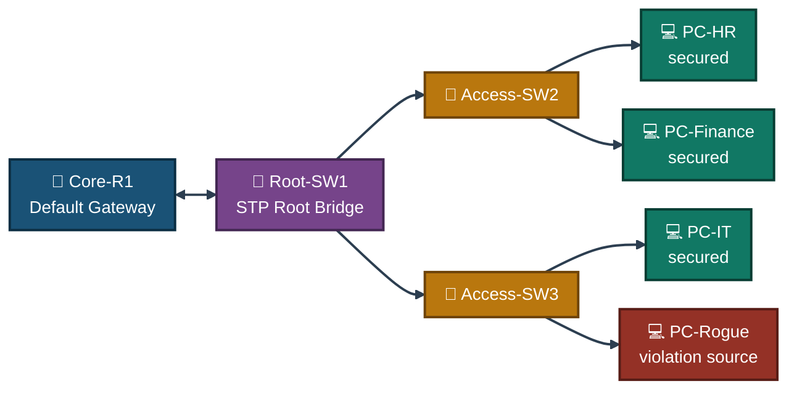
<p align="center"><em>Every access port on Access-SW2 and Access-SW3 runs the same port security and STP hardening — PC-Rogue is the device used to prove the violation path actually fires.</em></p>

---

<a id="port-security-stp-design"></a>
## 🛡️ Port Security & STP Design

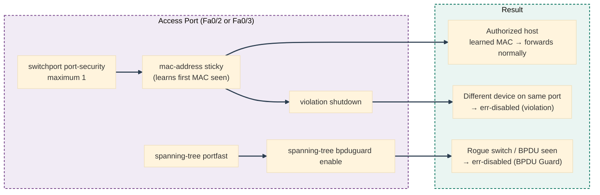
<p align="center"><em>Port security and STP hardening are independent features layered on the same port — one guards against an unauthorized host, the other against an unauthorized switch.</em></p>

---

<a id="ip-design"></a>
## 🗂️ IP Design

| Device | Interface | IP Address | Subnet Mask | Gateway |
|--------|-----------|------------|-------------|---------|
| Core-R1 | Gig0/0 | 192.168.1.1 | 255.255.255.0 | — |
| PC-HR | Fa0 | 192.168.1.10 | 255.255.255.0 | 192.168.1.1 |
| PC-Finance | Fa0 | 192.168.1.11 | 255.255.255.0 | 192.168.1.1 |
| PC-IT | Fa0 | 192.168.1.20 | 255.255.255.0 | 192.168.1.1 |
| PC-Rogue | Fa0 | 192.168.1.30 | 255.255.255.0 | 192.168.1.1 |

---

<a id="simulated-issues"></a>
## 🐛 Simulated Issues

| # | Issue | Type |
|---|-------|------|
| 1 | No port security — any device can connect to any port | Missing MAC filtering |
| 2 | Rogue device connects to an authorized port | Port security violation |
| 3 | Access ports not optimized for STP convergence | Missing PortFast |
| 4 | STP loop possible if a rogue switch is connected | Missing BPDU Guard |

---

<a id="module-1"></a>
## 🏗️ Module 1 — Build the Topology

**Objective:** Wire Core-R1, all three switches, and all four end devices per the connections table above.

### Step 1 — Build Topology ✅

No CLI commands — physical wiring done in the Packet Tracer GUI. Drag devices onto the canvas, connect cables per the topology table, and rename all devices per the naming convention above.

<p align="center">
  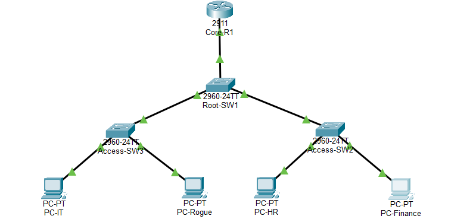<br>
  <em>Exhibit 1 — Full topology: Core-R1, Root-SW1, and two access switches wired and named</em>
</p>

---

<a id="module-2"></a>
## ⚙️ Module 2 — Configure Core-R1

**Objective:** Address Core-R1's LAN interface as the default gateway for all four subnets' worth of hosts.

### Step 2 — Configure Core-R1 ✅

```
enable
configure terminal
interface gig0/0
ip address 192.168.1.1 255.255.255.0
no shutdown
exit
```

<p align="center">
  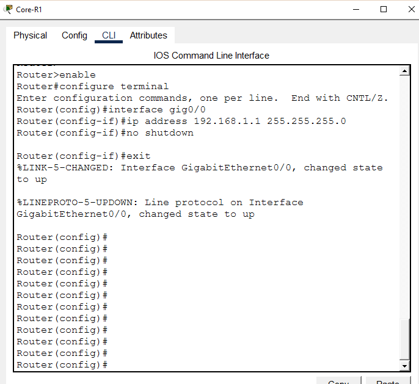<br>
  <em>Exhibit 2 — Core-R1's gateway interface addressed and brought up</em>
</p>

---

<a id="module-3"></a>
## 💻 Module 3 — Configure PC IPs

**Objective:** Address all four end devices per the IP design.

### Step 3 — Configure PC IPs ✅

```
PC-HR:      192.168.1.10 | Mask: 255.255.255.0 | GW: 192.168.1.1
PC-Finance: 192.168.1.11 | Mask: 255.255.255.0 | GW: 192.168.1.1
PC-IT:      192.168.1.20 | Mask: 255.255.255.0 | GW: 192.168.1.1
PC-Rogue:   192.168.1.30 | Mask: 255.255.255.0 | GW: 192.168.1.1
```

<p align="center">
  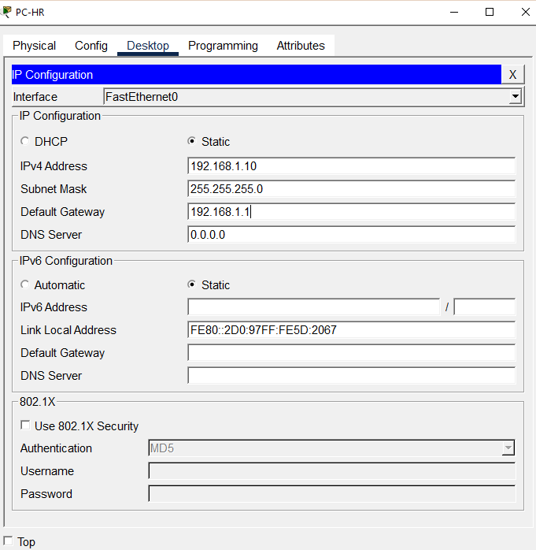<br>
  <em>Exhibit 3 — All four end devices addressed per the IP design</em>
</p>

---

<a id="module-4"></a>
## 📶 Module 4 — Pre-Security Ping Test

**Objective:** Confirm every host can reach every other host before any port security or STP hardening is applied.

### Step 4 — Pre-Security Ping Test ✅

```
PC-HR> ping 192.168.1.1   → Reply ✅
PC-HR> ping 192.168.1.20  → Reply ✅
PC-HR> ping 192.168.1.30  → Reply ✅
→ All hosts reachable — no security yet
```

<p align="center">
  <br>
  <em>Exhibit 4 — Full connectivity confirmed before any hardening is configured</em>
</p>

---

<a id="module-5"></a>
## 🌳 Module 5 — Verify STP Root Bridge

**Objective:** Confirm Root-SW1 holds the STP root role before any port hardening changes anything.

### Step 5 — Verify STP Root Bridge ✅

```
show spanning-tree

→ Root ID Priority: 32769
→ This bridge is the root
→ Fa0/1, Fa0/2, Gi0/1 — Designated Forwarding
→ Root Bridge confirmed ✅
```

<p align="center">
  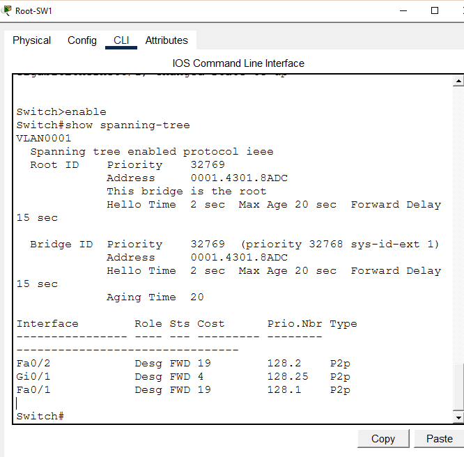<br>
  <em>Exhibit 5 — Root-SW1 confirmed as the STP Root Bridge with all ports forwarding</em>
</p>

---

<a id="module-6"></a>
## ⚡ Module 6 — Configure PortFast & BPDU Guard on Access-SW2

**Objective:** Skip STP's listening/learning delay on HR and Finance's access ports, and shut them down if a BPDU ever appears.

### Step 6 — Configure PortFast & BPDU Guard on Access-SW2 ✅

```
enable
configure terminal
interface fa0/2
spanning-tree portfast
spanning-tree bpduguard enable
exit
interface fa0/3
spanning-tree portfast
spanning-tree bpduguard enable
exit

→ PortFast: skips STP listening/learning — faster port up
→ BPDU Guard: shuts port if BPDU received (rogue switch protection)
```

<p align="center">
  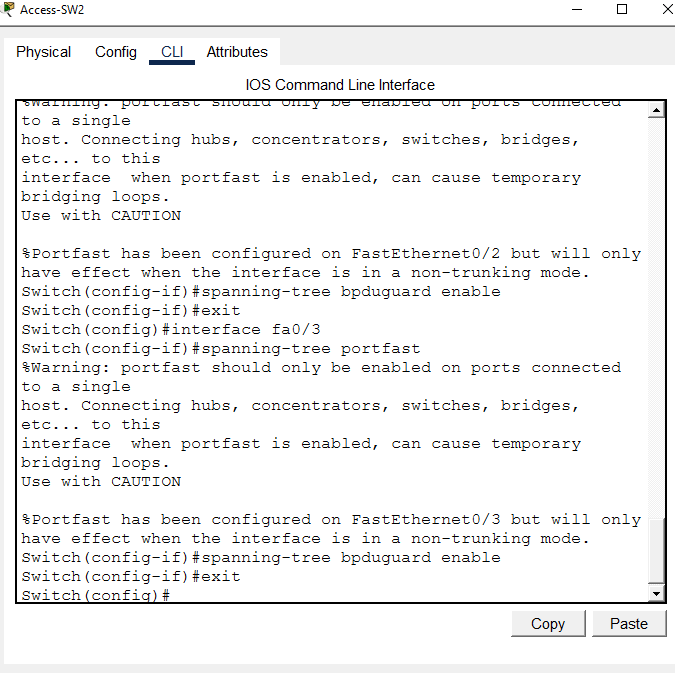<br>
  <em>Exhibit 6 — PortFast and BPDU Guard enabled on Access-SW2's Fa0/2 and Fa0/3</em>
</p>

---

<a id="module-7"></a>
## ⚡ Module 7 — Configure PortFast & BPDU Guard on Access-SW3

**Objective:** Apply the same STP hardening to Access-SW3's IT and Rogue-adjacent ports.

### Step 7 — Configure PortFast & BPDU Guard on Access-SW3 ✅

```
enable
configure terminal
interface fa0/2
spanning-tree portfast
spanning-tree bpduguard enable
exit
interface fa0/3
spanning-tree portfast
spanning-tree bpduguard enable
exit
```

<p align="center">
  <br>
  <em>Exhibit 7 — PortFast and BPDU Guard enabled on Access-SW3's Fa0/2 and Fa0/3</em>
</p>

---

<a id="module-8"></a>
## 🔐 Module 8 — Configure Port Security on Access-SW2

**Objective:** Lock HR and Finance's ports to one sticky-learned MAC each, with violation shutdown as the enforcement action.

### Step 8 — Configure Port Security on Access-SW2 ✅

```
enable
configure terminal
interface fa0/2
switchport mode access
switchport port-security
switchport port-security maximum 1
switchport port-security mac-address sticky
switchport port-security violation shutdown
exit
interface fa0/3
switchport mode access
switchport port-security
switchport port-security maximum 1
switchport port-security mac-address sticky
switchport port-security violation shutdown
exit

→ Maximum 1 MAC per port
→ Sticky MAC: dynamically learns and saves MAC
→ Violation: shutdown port on unauthorized device
```

<p align="center">
  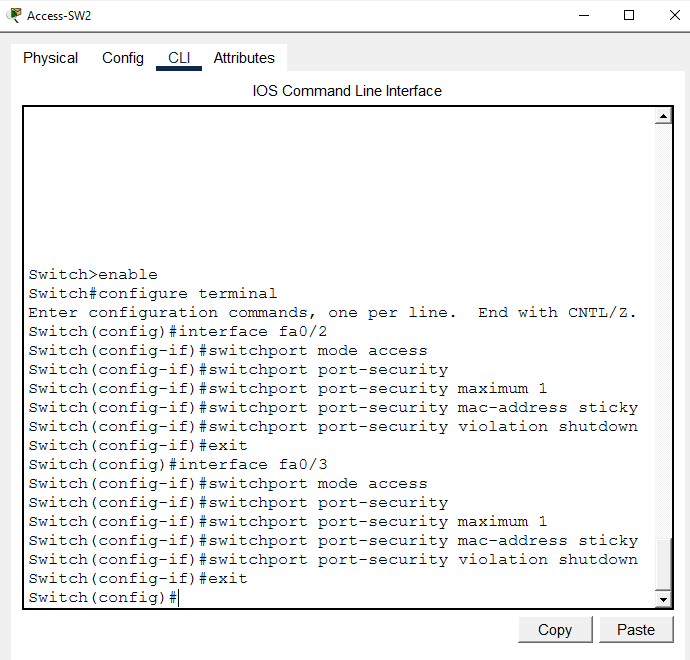<br>
  <em>Exhibit 8 — Port security with sticky MAC and violation shutdown configured on Access-SW2</em>
</p>

---

<a id="module-9"></a>
## 🔐 Module 9 — Configure Port Security on Access-SW3

**Objective:** Apply the same port security settings to Access-SW3's IT and Rogue-adjacent ports.

### Step 9 — Configure Port Security on Access-SW3 ✅

```
enable
configure terminal
interface fa0/2
switchport mode access
switchport port-security
switchport port-security maximum 1
switchport port-security mac-address sticky
switchport port-security violation shutdown
exit
interface fa0/3
switchport mode access
switchport port-security
switchport port-security maximum 1
switchport port-security mac-address sticky
switchport port-security violation shutdown
exit
```

<p align="center">
  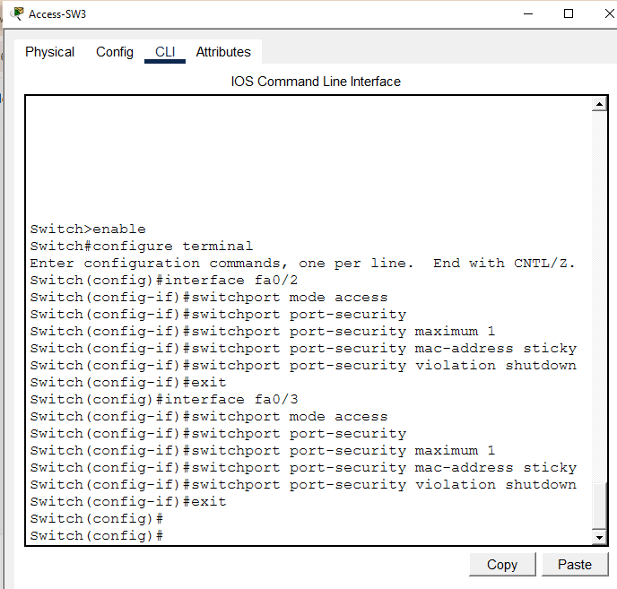<br>
  <em>Exhibit 9 — Port security with sticky MAC and violation shutdown configured on Access-SW3</em>
</p>

---

<a id="module-10"></a>
## 📋 Module 10 — Verify Port Security

**Objective:** Confirm port security is enabled, in sticky mode, with a max of 1 MAC and shutdown as the violation action, on every secured port.

### Step 10 — Verify Port Security ✅

```
show port-security interface fa0/2
show port-security interface fa0/3

→ Port Security: Enabled
→ Sticky MAC address learned
→ Violation Mode: Shutdown
→ Max MAC Addresses: 1
```

<p align="center">
  <br>
  <em>Exhibit 10 — Port security settings confirmed correct on both access switches</em>
</p>

---

<a id="module-11"></a>
## 🔢 Module 11 — Verify Sticky MAC Addresses

**Objective:** Confirm the sticky-learned MAC addresses were actually saved into the running configuration.

### Step 11 — Verify Sticky MAC Addresses ✅

```
show running-config | include sticky
show mac-address-table

→ Sticky MAC addresses saved in running config
→ MAC table shows learned addresses per port
```

<p align="center">
  <br>
  <em>Exhibit 11 — Sticky MAC addresses confirmed present in both the running config and the MAC table</em>
</p>

---

<a id="module-12"></a>
## 🚨 Module 12 — Simulate Port Security Violation

**Objective:** Prove the violation path actually fires by physically moving an unauthorized device onto a port that already learned a different MAC.

### Step 12 — Simulate Port Security Violation ✅

```
1. PC-IT pings to learn MAC on Fa0/2:
   ping 192.168.1.1 → Reply ✅

2. Disconnect PC-IT from Fa0/2
3. Connect PC-Rogue to Fa0/2 (unauthorized!)
4. PC-Rogue> ping 192.168.1.1 → Request timed out ❌

show port-security
→ Fa0/2  SecurityViolation: 1  Action: Shutdown ✅
→ Fa0/3  SecurityViolation: 1  Action: Shutdown ✅
→ Violation triggered — port security working!
```

<p align="center">
  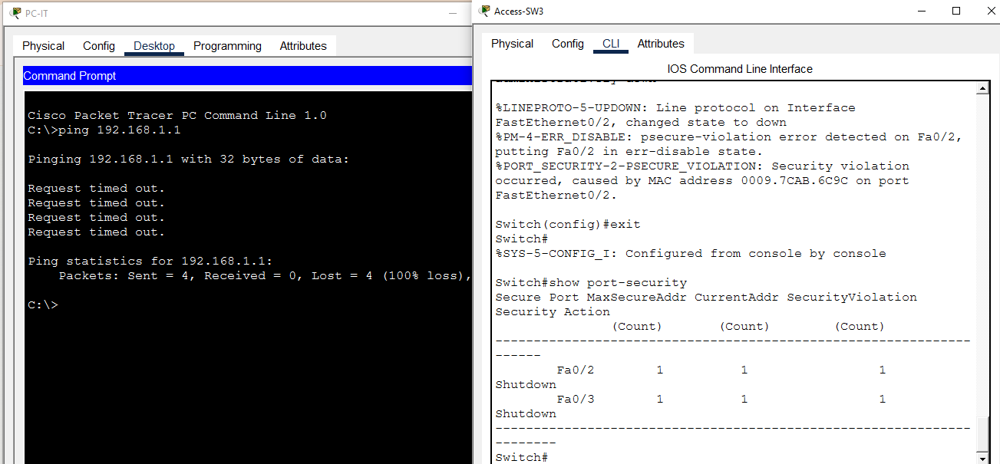<br>
  <em>Exhibit 12 — Port security violation triggered and both ports pushed into err-disabled state</em>
</p>

---

<a id="module-13"></a>
## 🔁 Module 13 — Err-Disabled Port Recovery

**Objective:** Bring the err-disabled ports back into service after the violation has been confirmed.

### Step 13 — Err-Disabled Port Recovery ✅

```
enable
configure terminal
interface fa0/2
shutdown
no shutdown
exit
interface fa0/3
shutdown
no shutdown
exit

→ Ports recovered from err-disabled state
→ Ready for authorized devices again
```

<p align="center">
  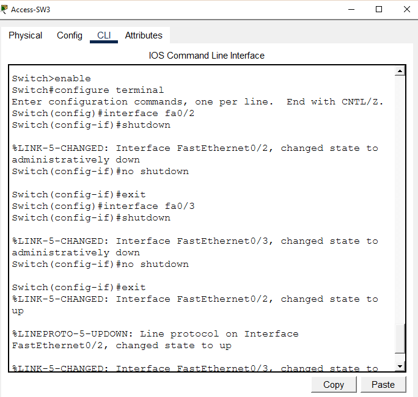<br>
  <em>Exhibit 13 — Err-disabled ports manually recovered with shutdown / no shutdown</em>
</p>

---

<a id="module-14"></a>
## 📋 Module 14 — Port Security Final Verification

**Objective:** Re-confirm port security state on every port after the violation-and-recovery cycle.

### Step 14 — Port Security Final Verification ✅

```
show port-security
show port-security address

→ All ports secure ✅
→ Sticky MAC addresses confirmed ✅
→ Security policy active on all access ports
```

<p align="center">
  <br>
  <em>Exhibit 14 — Port security confirmed still active and correct on every access port</em>
</p>

---

<a id="module-15"></a>
## 🛡️ Module 15 — BPDU Guard Verify

**Objective:** Confirm PortFast and BPDU Guard are still enabled on every access port after the recovery cycle.

### Step 15 — BPDU Guard Verify ✅

```
show spanning-tree interface fa0/2 detail
show spanning-tree interface fa0/3 detail

→ PortFast: Enabled ✅
→ BPDU Guard: Enabled ✅
→ Loop prevention active on all access ports
```

<p align="center">
  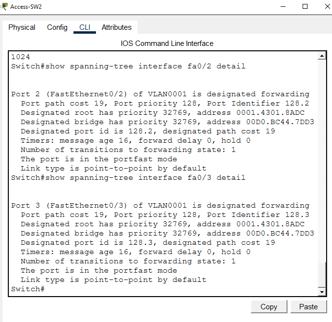<br>
  <em>Exhibit 15 — PortFast and BPDU Guard confirmed still active on both switches' access ports</em>
</p>

---

<a id="module-16"></a>
## 🌳 Module 16 — STP Root Bridge Final Verify

**Objective:** Re-confirm Root-SW1 is still the Root Bridge and the topology is loop-free after all hardening changes.

### Step 16 — STP Root Bridge Final Verify ✅

```
show spanning-tree

→ Root-SW1: This bridge is the root ✅
→ All ports Designated Forwarding ✅
→ STP topology stable and loop-free
```

<p align="center">
  <br>
  <em>Exhibit 16 — Root-SW1 confirmed root and the topology confirmed loop-free after hardening</em>
</p>

---

<a id="module-17"></a>
## 🧾 Module 17 — Full Connectivity Final Test

**Objective:** Confirm authorized hosts still reach the gateway and each other after every security and STP change.

### Step 17 — Full Connectivity Final Test ✅

```
PC-HR> ping 192.168.1.1   → Reply ✅
PC-HR> ping 192.168.1.20  → Reply ✅
PC-HR> ping 192.168.1.30  → Reply ✅
→ Network secure and fully operational ✅
→ Port Security + STP hardening complete
```

<p align="center">
  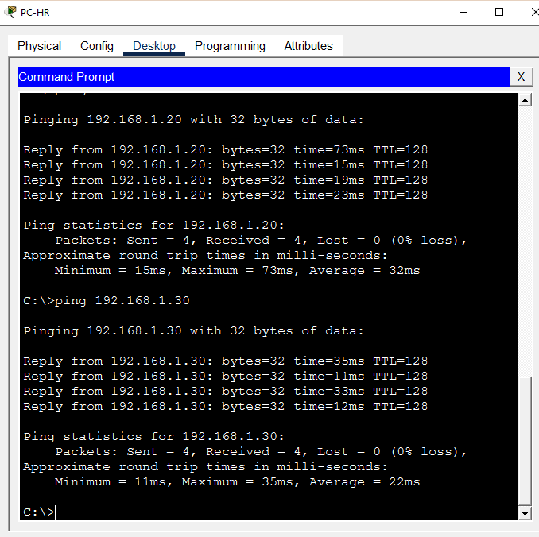<br>
  <em>Exhibit 17 — Full connectivity confirmed for authorized hosts after all hardening is in place</em>
</p>

---

<a id="coverage-snapshot"></a>
## 🌟 Coverage Snapshot

| 🛡️ Layer | ✅ Status | 📌 Detail |
|---|---|---|
| Topology | Live | One router, three switches, four end devices wired and named (Exhibit 1) |
| Router addressing | Live | Core-R1 addressed as the default gateway (Exhibit 2) |
| End device addressing | Live | All four PCs addressed (Exhibit 3) |
| Pre-hardening baseline | Proven | Full connectivity confirmed before any security is applied (Exhibit 4) |
| STP root — baseline | Proven | Root-SW1 confirmed as Root Bridge before hardening (Exhibit 5) |
| STP hardening — SW2 | Live | PortFast and BPDU Guard enabled on HR/Finance ports (Exhibit 6) |
| STP hardening — SW3 | Live | PortFast and BPDU Guard enabled on IT/Rogue ports (Exhibit 7) |
| Port security — SW2 | Live | Sticky MAC, max 1, violation shutdown configured (Exhibit 8) |
| Port security — SW3 | Live | Sticky MAC, max 1, violation shutdown configured (Exhibit 9) |
| Port security verified | Proven | Settings confirmed correct on every secured port (Exhibit 10) |
| Sticky MAC verified | Proven | Learned MACs confirmed in config and MAC table (Exhibit 11) |
| Violation simulated | Proven | Rogue device on a learned port triggers real shutdown (Exhibit 12) |
| Port recovery | Proven | Err-disabled ports manually recovered (Exhibit 13) |
| Post-recovery security check | Proven | Port security confirmed intact after recovery (Exhibit 14) |
| Post-recovery STP check | Proven | PortFast/BPDU Guard confirmed intact after recovery (Exhibit 15) |
| STP root — final | Proven | Root-SW1 and loop-free topology re-confirmed (Exhibit 16) |
| Full end-to-end test | Proven | Authorized hosts fully connected after hardening (Exhibit 17) |

---

<a id="command-summary"></a>
## 📟 Command Summary

| Command | Purpose |
|---------|---------|
| `switchport mode access` | Set port to access mode |
| `switchport port-security` | Enable port security on interface |
| `switchport port-security maximum 1` | Allow only 1 MAC address per port |
| `switchport port-security mac-address sticky` | Dynamically learn and save MAC |
| `switchport port-security violation shutdown` | Shutdown port on violation |
| `spanning-tree portfast` | Enable PortFast on access port |
| `spanning-tree bpduguard enable` | Enable BPDU Guard on access port |
| `show port-security` | View port security status and violations |
| `show port-security interface <int>` | Detailed port security per interface |
| `show port-security address` | View learned MAC addresses |
| `show spanning-tree` | View STP root bridge and port states |
| `show mac-address-table` | View MAC address table |
| `shutdown` / `no shutdown` | Recover err-disabled port |

---

<a id="challenges-fixes"></a>
## ⚠️ Challenges & Fixes

| ❌ Challenge | ✅ Solution |
|---|---|
| Changing PC-Rogue's MAC address didn't trigger a violation | Physically moved PC-Rogue onto the authorized port (Fa0/2) after PC-IT's MAC had already been sticky-learned |
| Port security violation count showing 0 initially | Reset sticky MAC with `no switchport port-security mac-address sticky` then re-learned it |
| Both Fa0/2 and Fa0/3 showed violations | Both ports had a sticky MAC already learned — connecting the wrong device to either one triggered a violation |
| Packet Tracer CLI text too small to read | Adjusted font size via Options → Preferences → Font |
| PortFast warning message on trunk ports | Applied PortFast only on access ports connected to end devices — never on uplink/trunk ports |

---

<a id="scope-limitations"></a>
## 🚧 Scope & Limitations

- **Simulation only:** Built and verified in Cisco Packet Tracer, not on physical hardware.
- **Manual violation trigger:** The violation was produced by physically moving cables between devices, not by MAC spoofing software — Packet Tracer doesn't reliably simulate spoofed source MACs on the same physical port.
- **Static max-MAC of 1 per port:** No scenario with multiple legitimate MACs per port (e.g. a port feeding a small hub or IP phone) was tested.
- **No dynamic error-disable recovery:** Ports were recovered manually with `shutdown` / `no shutdown` rather than configuring `errdisable recovery cause` with a timeout.
- **BPDU Guard only, no Root Guard:** The lab protects access ports from receiving BPDUs at all, but doesn't cover Root Guard, which would allow BPDUs while still refusing to let a downstream device become root.
- **Single VLAN:** All hosts sit on the same subnet/VLAN — no per-VLAN port security or trunk security scenarios were built.

These limits are stated so the lab is read as a port-security-and-STP-fundamentals exercise, not a full access-layer hardening deployment.

---

<a id="what-i-learned"></a>
## 🧠 What I Learned

- **Sticky MAC learning only locks in the *first* MAC it sees on a port.** Triggering a real violation means physically swapping the device on that port, not just changing an IP or relying on ARP — Packet Tracer needs a genuine new source MAC arriving on the wire.
- **Port security and BPDU Guard solve two different problems that happen to live on the same port.** One stops an unauthorized *host*; the other stops an unauthorized *switch* from ever joining the spanning tree.
- **`shutdown` / `no shutdown` is the manual escape hatch out of err-disabled state.** Without `errdisable recovery`, a port stays down until an administrator intervenes — which is a deliberate design choice, not a bug.
- **Verifying STP before *and* after hardening matters.** PortFast and BPDU Guard changes on access ports shouldn't affect the Root Bridge election, and re-checking `show spanning-tree` after the fact is what actually proves that.

---

<a id="skills-demonstrated"></a>
## 🛠️ Skills Demonstrated

- Configuring sticky MAC learning, maximum MAC limits, and violation shutdown mode with `switchport port-security`
- Enabling PortFast and BPDU Guard on access ports without applying them to trunk/uplink ports
- Verifying STP Root Bridge election and port states with `show spanning-tree`, before and after configuration changes
- Physically simulating a real port security violation rather than relying on a software-only trigger
- Recovering an err-disabled port with `shutdown` / `no shutdown` and confirming it returns to a secured, working state
- Reading `show port-security`, `show port-security address`, and `show mac-address-table` output to confirm configuration actually took effect
- Running a full pre- and post-hardening connectivity test to confirm security changes didn't break legitimate traffic

---

<a id="screenshot-index"></a>
## 🖼️ Screenshot Index

| # | File | Shows |
|:---:|---|---|
| 1 | `01-topology.PNG` | Full topology after wiring |
| 2 | `02-router-config.PNG` | Core-R1 gateway interface configuration |
| 3 | `03-pc-ip-config.PNG` | All four end devices addressed |
| 4 | `04-pre-security-ping.PNG` | Pre-hardening full connectivity |
| 5 | `05-stp-verify.PNG` | STP Root Bridge confirmed before hardening |
| 6 | `06-portfast-bpduguard.PNG` | PortFast/BPDU Guard on Access-SW2 |
| 7 | `07-sw3-portfast-bpduguard.PNG` | PortFast/BPDU Guard on Access-SW3 |
| 8 | `08-port-security-sw2.PNG` | Port security configured on Access-SW2 |
| 9 | `09-port-security-sw3.PNG` | Port security configured on Access-SW3 |
| 10 | `10-port-security-verify.PNG` | Port security settings verified |
| 11 | `11-sticky-mac-verify.PNG` | Sticky MAC addresses verified |
| 12 | `12-violation-simulate.PNG` | Port security violation triggered |
| 13 | `13-port-recovery.PNG` | Err-disabled ports recovered |
| 14 | `14-port-security-final.PNG` | Port security re-verified after recovery |
| 15 | `15-bpduguard-verify.PNG` | PortFast/BPDU Guard re-verified |
| 16 | `16-stp-root-verify.PNG` | STP Root Bridge re-verified |
| 17 | `17-full-connectivity.PNG` | Full connectivity final test pass |

---

<a id="repo-structure"></a>
## 📁 Repo Structure

```text
02-Network-Security/04-Port_Security_STP_Loop_Prevention/
|-- README.md
|-- port-security-stp-lab.pkt
`-- screenshots/
    |-- 01-topology.PNG
    |-- 02-router-config.PNG
    |-- 03-pc-ip-config.PNG
    |-- 04-pre-security-ping.PNG
    |-- 05-stp-verify.PNG
    |-- 06-portfast-bpduguard.PNG
    |-- 07-sw3-portfast-bpduguard.PNG
    |-- 08-port-security-sw2.PNG
    |-- 09-port-security-sw3.PNG
    |-- 10-port-security-verify.PNG
    |-- 11-sticky-mac-verify.PNG
    |-- 12-violation-simulate.PNG
    |-- 13-port-recovery.PNG
    |-- 14-port-security-final.PNG
    |-- 15-bpduguard-verify.PNG
    |-- 16-stp-root-verify.PNG
    `-- 17-full-connectivity.PNG
```

<div align="center">

🔒 **[Configuring Port Security](https://www.cisco.com/c/en/us/td/docs/switches/lan/catalyst2960/software/release/12-2_55_se/configuration/guide/scg_2960/swtrafc.html)** · 🌳 **[Understanding PortFast and BPDU Guard](https://www.cisco.com/c/en/us/support/docs/lan-switching/spanning-tree-protocol/10553-16.html)** · 🔢 **[Troubleshooting Err-Disabled Ports](https://www.cisco.com/c/en/us/support/docs/lan-switching/spanning-tree-protocol/69980-errdisable-recovery.html)**

</div>
