<div align="center">

# 🔑 SSH Hardening & Telnet Replacement

**Network Security Lab 05 — Cisco Networking Lab Portfolio**

Retiring Plaintext Telnet in Favor of SSH v2 Across a Two-Router Enterprise Network — RSA Key Generation, VTY Transport Restriction, Local Authentication, Password Encryption, and Verified Active SSH Sessions (Cisco Packet Tracer)


Both Core-R1 and Edge-R2 start out reachable over plaintext Telnet with a shared password, then get hardened in the same sequence — RSA keys generated, SSH v2 enabled, VTY lines locked to `transport input ssh`, local username authentication swapped in, and every plaintext password encrypted in the running config. Verification goes past "SSH connects" — Telnet is proven refused first, then the live SSH session's encryption cipher and Hmac are read directly out of `show ssh` before calling the lab done.

</div>

---

## 📑 Table of Contents

1. [At a Glance](#at-a-glance)
2. [Project Background](#project-background)
3. [Tools & Technologies](#tools-technologies)
4. [Environment](#environment)
5. [Topology](#topology)
6. [SSH Hardening Design](#ssh-hardening-design)
7. [IP Design](#ip-design)
8. [Simulated Issues](#simulated-issues)
9. [Module 1 — Build the Topology](#module-1)
10. [Module 2 — Configure Core-R1](#module-2)
11. [Module 3 — Configure Edge-R2](#module-3)
12. [Module 4 — Configure PC and Server IPs](#module-4)
13. [Module 5 — Configure Static Routing](#module-5)
14. [Module 6 — Configure Telnet (Insecure — Before Fix)](#module-6)
15. [Module 7 — Test Telnet Connection (Insecure)](#module-7)
16. [Module 8 — Configure SSH v2 on Core-R1](#module-8)
17. [Module 9 — Verify Telnet Disabled](#module-9)
18. [Module 10 — Test SSH Connection](#module-10)
19. [Module 11 — Verify SSH Version](#module-11)
20. [Module 12 — Configure SSH on Edge-R2](#module-12)
21. [Module 13 — Test SSH to Edge-R2](#module-13)
22. [Module 14 — VTY Line Hardening](#module-14)
23. [Module 15 — Verify Running Config](#module-15)
24. [Module 16 — Show Active SSH Sessions](#module-16)
25. [Module 17 — Final Verification](#module-17)
26. [Coverage Snapshot](#coverage-snapshot)
27. [Command Summary](#command-summary)
28. [Challenges & Fixes](#challenges-fixes)
29. [Scope & Limitations](#scope-limitations)
30. [What I Learned](#what-i-learned)
31. [Skills Demonstrated](#skills-demonstrated)
32. [Screenshot Index](#screenshot-index)
33. [Repo Structure](#repo-structure)

---

<a id="at-a-glance"></a>
## 📊 At a Glance

<div align="center">

| 🔐 Hardened Routers | 🚪 Routers | 🔀 Switches | 🖥️ Hosts | 🔑 Protocol | 🖼️ Screenshots |
|:---:|:---:|:---:|:---:|:---:|:---:|
| **2 (Core-R1, Edge-R2)** | **2** | **2** | **4** | **SSH v2 (Telnet retired)** | **17** |

</div>

---

<a id="project-background"></a>
## 📖 Project Background

This lab starts both routers wide open on Telnet with a shared plaintext password, then walks each one through the same hardening sequence: a domain name and RSA key pair so `crypto key generate rsa` has something to work with, `ip ssh version 2` to force the modern protocol version, a local username with a privilege level so authentication doesn't depend on a single shared secret, `transport input ssh` on the VTY lines so Telnet is refused outright, and `service password-encryption` plus an `exec-timeout` so nothing sits in the running config as plaintext or stays logged in indefinitely. Core-R1 is hardened and fully verified first as a template, then the identical sequence is repeated on Edge-R2 for a consistent security policy across both routers.

| Module | Focus |
|---|---|
| 🏗️ **Module 1 — Build the Topology** | Wire 2 routers, 2 switches, and 4 end devices |
| ⚙️ **Module 2 — Configure Core-R1** | Address the core router's LAN and WAN interfaces |
| 🌐 **Module 3 — Configure Edge-R2** | Address the edge router's WAN and LAN interfaces |
| 💻 **Module 4 — PC and Server IPs** | Address all four Admin/User end devices |
| 🧭 **Module 5 — Static Routing** | Route between the Admin and User subnets |
| ☎️ **Module 6 — Configure Telnet (Before Fix)** | Stand up insecure Telnet as the starting state |
| ⚠️ **Module 7 — Test Telnet Connection** | Confirm Telnet works and is plaintext |
| 🔑 **Module 8 — Configure SSH v2 on Core-R1** | Generate RSA keys and enable SSH-only access |
| 🚫 **Module 9 — Verify Telnet Disabled** | Confirm Telnet is refused after hardening |
| ✅ **Module 10 — Test SSH Connection** | Confirm SSH v2 works as the replacement |
| 📋 **Module 11 — Verify SSH Version** | Confirm SSH v2 and RSA keys via `show ip ssh` |
| 🔑 **Module 12 — Configure SSH on Edge-R2** | Repeat the same hardening on Edge-R2 |
| ✅ **Module 13 — Test SSH to Edge-R2** | Confirm SSH access to both routers |
| 🛡️ **Module 14 — VTY Line Hardening** | Add exec-timeout and password encryption |
| 📋 **Module 15 — Verify Running Config** | Confirm SSH config and encrypted passwords |
| 🔢 **Module 16 — Show Active SSH Sessions** | Read the live session's cipher and Hmac |
| 🧾 **Module 17 — Final Verification** | Confirm SSH version and active user sessions |

> [!NOTE]
> Packet Tracer reports SSH sessions as version **1.99**, not 2.0, even when `ip ssh version 2` is configured. 1.99 means the router is running in SSHv1/SSHv2 compatibility mode while actually negotiating SSHv2 — it's expected simulator behavior, not a misconfiguration.

---

<a id="tools-technologies"></a>
## 🛠️ Tools & Technologies

| Tool | Purpose |
|------|---------|
| 🖥️ Cisco Packet Tracer | Network topology simulation |
| 🚪 Router 2911 x2 | Core-R1, Edge-R2 |
| 🔀 Switch 2960 x2 | Admin-SW1, User-SW2 |
| ☎️ Telnet | Insecure remote access — replaced by SSH |
| 🔑 SSH v2 | Secure encrypted remote access protocol |
| 🔐 RSA Keys | Cryptographic key pair for SSH encryption |
| 🔧 `crypto key generate rsa` | RSA key generation command |
| 🔒 `service password-encryption` | Encrypt all plaintext passwords |
| 🔌 VTY Lines | Virtual terminal lines for remote access |
| 🔢 `show ssh` | Verify active SSH sessions |
| 🔢 `show ip ssh` | Verify SSH version and configuration |

---

<a id="environment"></a>
## 🖧 Environment


**Devices**

| Device | Model | Role |
|--------|-------|------|
| Core-R1 | Router 2911 | Core Router — SSH Server |
| Edge-R2 | Router 2911 | Edge Router — SSH Server |
| Admin-SW1 | Switch 2960 | Admin LAN Switch |
| User-SW2 | Switch 2960 | User LAN Switch |
| Admin-PC0 | PC | Admin workstation — SSH Client |
| Admin-PC1 | PC | Admin workstation — SSH Client |
| User-PC2 | PC | User workstation |
| Management-Server | Server | Management Server |

**Connections**

| From | Port | To | Port | Cable |
|------|------|----|------|-------|
| Admin-PC0 | Fa0 | Admin-SW1 | Fa0/1 | Copper Straight-Through |
| Admin-PC1 | Fa0 | Admin-SW1 | Fa0/2 | Copper Straight-Through |
| Admin-SW1 | Fa0/24 | Core-R1 | Gig0/0 | Copper Straight-Through |
| Core-R1 | Gig0/1 | Edge-R2 | Gig0/0 | Copper Straight-Through |
| Edge-R2 | Gig0/1 | User-SW2 | Fa0/24 | Copper Straight-Through |
| User-SW2 | Fa0/1 | Management-Server | Fa0 | Copper Straight-Through |
| User-SW2 | Fa0/2 | User-PC2 | Fa0 | Copper Straight-Through |

---

<a id="topology"></a>
## 🗺️ Topology

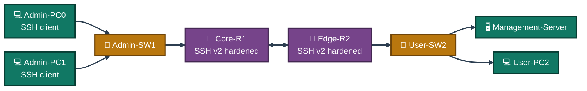
<p align="center"><em>Both Core-R1 and Edge-R2 hold identical SSH hardening — RSA keys, SSH-only VTY transport, local auth, and encrypted passwords — applied one router at a time and verified independently.</em></p>

---

<a id="ssh-hardening-design"></a>
## 🔑 SSH Hardening Design

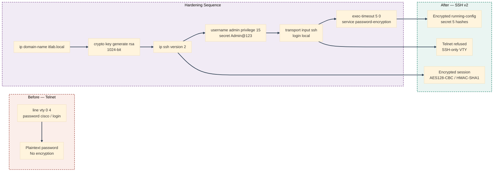
<p align="center"><em>Six commands take a router from a shared plaintext Telnet password to SSH-only access with per-user authentication and an encrypted running config.</em></p>

---

<a id="ip-design"></a>
## 🗂️ IP Design

| Device | Interface | IP Address | Subnet Mask | Gateway |
|--------|-----------|------------|-------------|---------|
| Core-R1 | Gig0/0 | 192.168.1.1 | 255.255.255.0 | — |
| Core-R1 | Gig0/1 | 10.0.0.1 | 255.255.255.252 | — |
| Edge-R2 | Gig0/0 | 10.0.0.2 | 255.255.255.252 | — |
| Edge-R2 | Gig0/1 | 192.168.2.1 | 255.255.255.0 | — |
| Admin-PC0 | Fa0 | 192.168.1.10 | 255.255.255.0 | 192.168.1.1 |
| Admin-PC1 | Fa0 | 192.168.1.11 | 255.255.255.0 | 192.168.1.1 |
| User-PC2 | Fa0 | 192.168.2.20 | 255.255.255.0 | 192.168.2.1 |
| Management-Server | Fa0 | 192.168.2.10 | 255.255.255.0 | 192.168.2.1 |

---

<a id="simulated-issues"></a>
## 🐛 Simulated Issues

| # | Issue | Type |
|---|-------|------|
| 1 | Telnet enabled — unencrypted remote access | Insecure protocol in use |
| 2 | No SSH configured — routers vulnerable | Missing SSH hardening |
| 3 | Passwords stored in plaintext | Missing password encryption |
| 4 | VTY lines accept all protocols | Missing transport input restriction |

---

<a id="module-1"></a>
## 🏗️ Module 1 — Build the Topology

**Objective:** Wire Core-R1, Edge-R2, both switches, and all four end devices per the connections table above.

### Step 1 — Build Topology ✅

No CLI commands — physical wiring done in the Packet Tracer GUI. Drag devices onto the canvas, connect cables per the topology table, and rename all devices per the naming convention above.

<p align="center">
  <br>
  <em>Exhibit 1 — Full topology: Admin and User sides joined through Core-R1 and Edge-R2, all devices wired and named</em>
</p>

---

<a id="module-2"></a>
## ⚙️ Module 2 — Configure Core-R1

**Objective:** Address Core-R1's LAN and WAN interfaces — this is the first router to be hardened with SSH.

### Step 2 — Configure Core-R1 ✅

```
enable
configure terminal
interface gig0/0
ip address 192.168.1.1 255.255.255.0
no shutdown
exit
interface gig0/1
ip address 10.0.0.1 255.255.255.252
no shutdown
exit
```

<p align="center">
  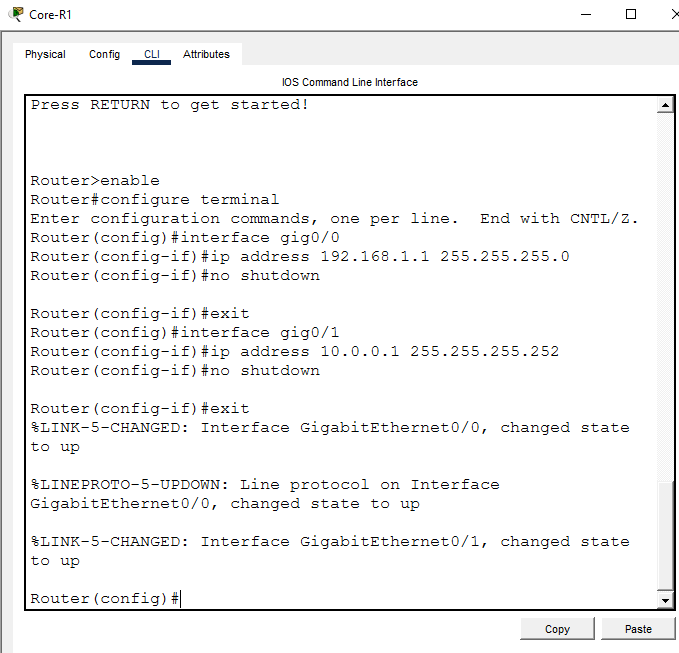<br>
  <em>Exhibit 2 — Core-R1's LAN and WAN interfaces addressed and brought up</em>
</p>

---

<a id="module-3"></a>
## 🌐 Module 3 — Configure Edge-R2

**Objective:** Address Edge-R2's WAN and LAN interfaces — this router receives the same hardening after Core-R1.

### Step 3 — Configure Edge-R2 ✅

```
enable
configure terminal
interface gig0/0
ip address 10.0.0.2 255.255.255.252
no shutdown
exit
interface gig0/1
ip address 192.168.2.1 255.255.255.0
no shutdown
exit
```

<p align="center">
  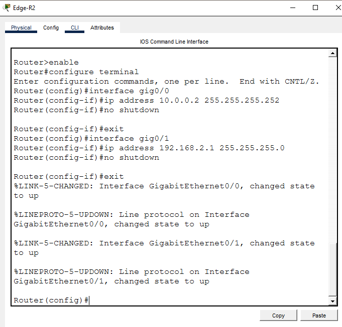<br>
  <em>Exhibit 3 — Edge-R2's WAN and LAN interfaces addressed and brought up</em>
</p>

---

<a id="module-4"></a>
## 💻 Module 4 — Configure PC and Server IPs

**Objective:** Address both Admin PCs, the User PC, and the Management Server.

### Step 4 — Configure PC and Server IPs ✅

```
Admin-PC0:         192.168.1.10 | GW: 192.168.1.1
Admin-PC1:         192.168.1.11 | GW: 192.168.1.1
User-PC2:          192.168.2.20 | GW: 192.168.2.1
Management-Server: 192.168.2.10 | GW: 192.168.2.1
```

<p align="center">
  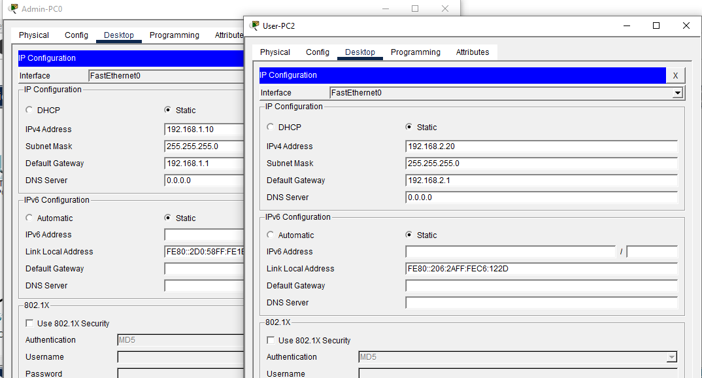<br>
  <em>Exhibit 4 — All four end devices addressed per the IP design</em>
</p>

---

<a id="module-5"></a>
## 🧭 Module 5 — Configure Static Routing

**Objective:** Route between the Admin and User subnets so both sides can reach each other and both routers.

### Step 5 — Configure Static Routing ✅

```
Core-R1:
ip route 192.168.2.0 255.255.255.0 10.0.0.2

Edge-R2:
ip route 192.168.1.0 255.255.255.0 10.0.0.1
```

<p align="center">
  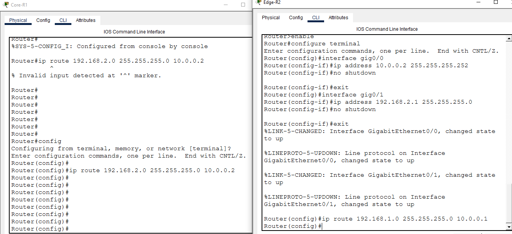<br>
  <em>Exhibit 5 — Static routes configured on both routers</em>
</p>

---

<a id="module-6"></a>
## ☎️ Module 6 — Configure Telnet (Insecure — Before Fix)

**Objective:** Stand up Telnet on Core-R1 with a shared plaintext password, as the deliberately insecure starting state.

### Step 6 — Configure Telnet (Insecure — Before Fix) ✅

```
enable
configure terminal
line vty 0 4
password cisco
login
exit
enable password cisco
exit

→ Telnet enabled — plaintext password
→ No encryption — insecure
```

<p align="center">
  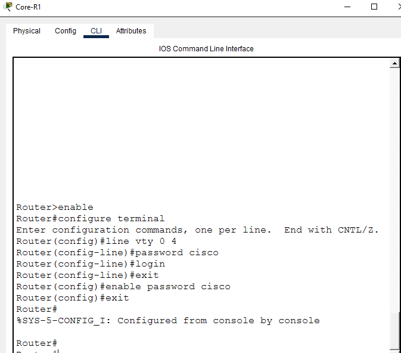<br>
  <em>Exhibit 6 — Insecure Telnet access configured on Core-R1 as the pre-hardening baseline</em>
</p>

---

<a id="module-7"></a>
## ⚠️ Module 7 — Test Telnet Connection (Insecure)

**Objective:** Confirm Telnet works and demonstrate that it's plaintext before any hardening is applied.

### Step 7 — Test Telnet Connection (Insecure) ✅

```
Admin-PC0> telnet 192.168.1.1
Password: cisco
→ Connected via Telnet — INSECURE ⚠️
→ All traffic sent in plaintext
→ Vulnerable to packet sniffing
```

<p align="center">
  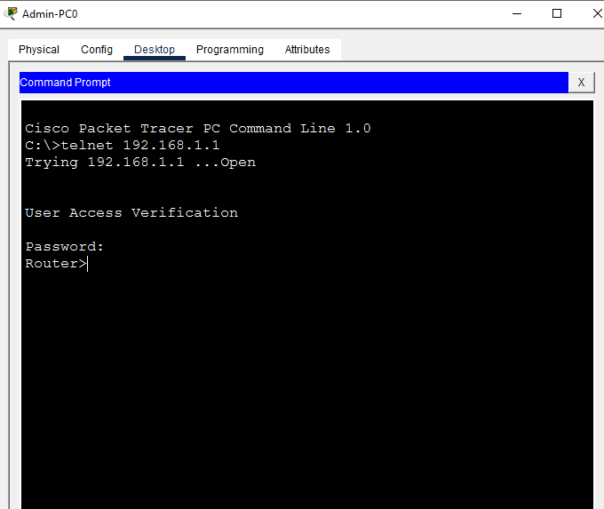<br>
  <em>Exhibit 7 — Insecure Telnet connection confirmed working before hardening</em>
</p>

---

<a id="module-8"></a>
## 🔑 Module 8 — Configure SSH v2 on Core-R1

**Objective:** Replace Telnet with SSH v2 — generate RSA keys, enable version 2, and restrict VTY transport to SSH only.

### Step 8 — Configure SSH v2 on Core-R1 ✅

```
enable
configure terminal
hostname Core-R1
ip domain-name itlab.local
crypto key generate rsa
→ Key size: 1024

ip ssh version 2
username admin privilege 15 secret Admin@123
line vty 0 4
transport input ssh
login local
exit

→ RSA 1024-bit keys generated
→ SSH v2 enabled
→ Telnet disabled — SSH only
→ Local username/password authentication
```

<p align="center">
  <br>
  <em>Exhibit 8 — RSA keys generated and SSH v2 configured on Core-R1, replacing Telnet</em>
</p>

---

<a id="module-9"></a>
## 🚫 Module 9 — Verify Telnet Disabled

**Objective:** Confirm Telnet is refused now that VTY transport is restricted to SSH.

### Step 9 — Verify Telnet Disabled ✅

```
Admin-PC0> telnet 192.168.1.1
→ Connection refused ❌
→ Telnet successfully disabled
→ Only SSH accepted on VTY lines
```

<p align="center">
  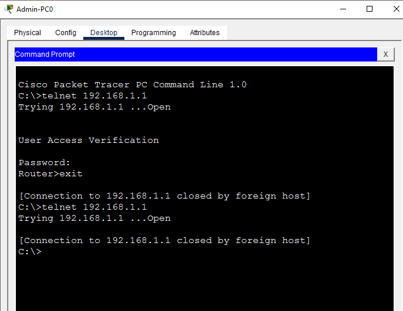<br>
  <em>Exhibit 9 — Telnet confirmed refused after restricting VTY transport to SSH</em>
</p>

---

<a id="module-10"></a>
## ✅ Module 10 — Test SSH Connection

**Objective:** Confirm SSH v2 works as the secure replacement for Telnet on Core-R1.

### Step 10 — Test SSH Connection ✅

```
Admin-PC0> ssh -l admin 192.168.1.1
Password: Admin@123
→ Connected via SSH v2 ✅
→ Encrypted session established
→ Secure remote access confirmed
```

<p align="center">
  <br>
  <em>Exhibit 10 — SSH v2 connection to Core-R1 confirmed working</em>
</p>

---

<a id="module-11"></a>
## 📋 Module 11 — Verify SSH Version

**Objective:** Confirm the SSH version and RSA key configuration on Core-R1.

### Step 11 — Verify SSH Version ✅

```
show ip ssh

→ SSH Enabled — version 2.0
→ Authentication timeout and retry limits shown
→ RSA key pair confirmed
```

<p align="center">
  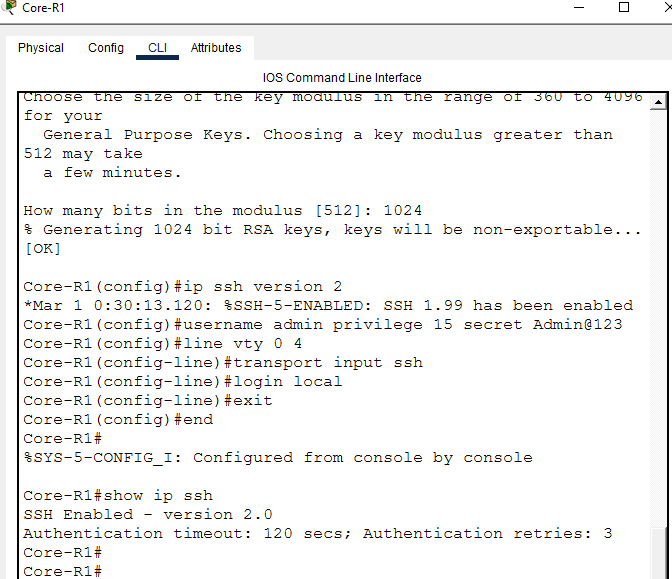<br>
  <em>Exhibit 11 — SSH version and RSA key pair confirmed via show ip ssh</em>
</p>

---

<a id="module-12"></a>
## 🔑 Module 12 — Configure SSH on Edge-R2

**Objective:** Apply the identical SSH hardening sequence to Edge-R2 for a consistent security policy across both routers.

### Step 12 — Configure SSH on Edge-R2 ✅

```
enable
configure terminal
hostname Edge-R2
ip domain-name itlab.local
crypto key generate rsa
→ Key size: 1024

ip ssh version 2
username admin privilege 15 secret Admin@123
line vty 0 4
transport input ssh
login local
exit
```

<p align="center">
  <br>
  <em>Exhibit 12 — RSA keys generated and SSH v2 configured on Edge-R2, mirroring Core-R1</em>
</p>

---

<a id="module-13"></a>
## ✅ Module 13 — Test SSH to Edge-R2

**Objective:** Confirm SSH access now works to both routers.

### Step 13 — Test SSH to Edge-R2 ✅

```
Admin-PC0> ssh -l admin 10.0.0.2
Password: Admin@123
→ Connected to Edge-R2 via SSH ✅
→ Secure access to both routers confirmed
```

<p align="center">
  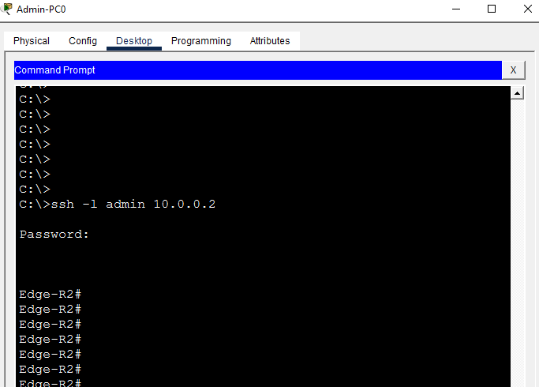<br>
  <em>Exhibit 13 — SSH v2 connection to Edge-R2 confirmed working</em>
</p>

---

<a id="module-14"></a>
## 🛡️ Module 14 — VTY Line Hardening

**Objective:** Add an idle session timeout and encrypt every plaintext password left in the configuration.

### Step 14 — VTY Line Hardening ✅

```
enable
configure terminal
line vty 0 4
exec-timeout 5 0
login local
transport input ssh
exit
service password-encryption
exit

→ Auto logout after 5 minutes idle
→ All passwords encrypted in running config
```

<p align="center">
  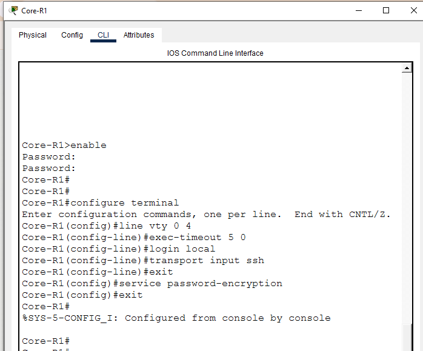<br>
  <em>Exhibit 14 — Exec timeout and password encryption applied on top of SSH-only access</em>
</p>

---

<a id="module-15"></a>
## 📋 Module 15 — Verify Running Config

**Objective:** Confirm SSH settings and encrypted passwords are actually present in the running configuration.

### Step 15 — Verify Running Config ✅

```
show running-config | include ssh
→ ip ssh version 2
→ transport input ssh

show running-config | include username
→ username admin privilege 15 secret 5 $1$mERr$kku/hiJPh.4Yp8Xor/4kz1
→ Password encrypted (secret 5) ✅
```

<p align="center">
  <br>
  <em>Exhibit 15 — SSH configuration and encrypted password hash confirmed in the running config</em>
</p>

---

<a id="module-16"></a>
## 🔢 Module 16 — Show Active SSH Sessions

**Objective:** Read the live session's negotiated encryption cipher and Hmac directly from the router.

### Step 16 — Show Active SSH Sessions ✅

```
show ssh

→ Connection Version Mode Encryption  Hmac       State           Username
→ 0          1.99    IN   aes128-cbc  hmac-sha1  Session Started admin
→ 0          1.99    OUT  aes128-cbc  hmac-sha1  Session Started admin
→ Encryption: aes128-cbc ✅
→ Active SSH session confirmed ✅
```

<p align="center">
  <br>
  <em>Exhibit 16 — Active SSH session's cipher and Hmac confirmed via show ssh</em>
</p>

---

<a id="module-17"></a>
## 🧾 Module 17 — Final Verification

**Objective:** Run one last check confirming SSH version and the active logged-in user session.

### Step 17 — Final Verification ✅

```
show ip ssh
→ SSH version 2.0 confirmed

show users
→ Active admin session shown
→ SSH hardening complete ✅
```

<p align="center">
  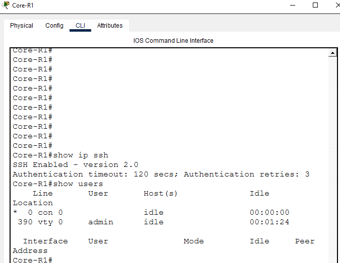<br>
  <em>Exhibit 17 — SSH version and active user session confirmed together as the final check</em>
</p>

---

<a id="coverage-snapshot"></a>
## 🌟 Coverage Snapshot

| 🛡️ Layer | ✅ Status | 📌 Detail |
|---|---|---|
| Topology | Live | Two routers, two switches, four end devices wired and named (Exhibit 1) |
| Router addressing | Live | Core-R1 and Edge-R2 both addressed (Exhibits 2–3) |
| End device addressing | Live | All four Admin/User devices addressed (Exhibit 4) |
| Static routing | Live | Both subnets reachable across the WAN (Exhibit 5) |
| Insecure baseline | Proven | Telnet configured and confirmed plaintext (Exhibits 6–7) |
| SSH hardening — Core-R1 | Live | RSA keys, SSH v2, and SSH-only transport configured (Exhibit 8) |
| Telnet retirement | Proven | Telnet confirmed refused after hardening (Exhibit 9) |
| SSH connectivity — Core-R1 | Proven | SSH v2 connection confirmed working (Exhibit 10) |
| SSH version verified | Proven | Version and RSA keys confirmed via show ip ssh (Exhibit 11) |
| SSH hardening — Edge-R2 | Live | Identical hardening mirrored on Edge-R2 (Exhibit 12) |
| SSH connectivity — Edge-R2 | Proven | SSH v2 connection to Edge-R2 confirmed (Exhibit 13) |
| VTY hardening | Live | Exec timeout and password encryption applied (Exhibit 14) |
| Config verified | Proven | SSH settings and encrypted password hash confirmed (Exhibit 15) |
| Active session verified | Proven | Live cipher and Hmac read from show ssh (Exhibit 16) |
| Full final check | Proven | SSH version and active user session confirmed together (Exhibit 17) |

---

<a id="command-summary"></a>
## 📟 Command Summary

| Command | Purpose |
|---------|---------|
| `ip domain-name <name>` | Set domain name (required for RSA keys) |
| `crypto key generate rsa` | Generate RSA key pair for SSH |
| `ip ssh version 2` | Enable SSH version 2 only |
| `username <name> privilege 15 secret <pass>` | Create local admin user |
| `transport input ssh` | Allow only SSH on VTY lines |
| `login local` | Use local username/password for VTY |
| `exec-timeout 5 0` | Auto logout after 5 minutes idle |
| `service password-encryption` | Encrypt all plaintext passwords |
| `show ip ssh` | Verify SSH version and status |
| `show ssh` | View active SSH sessions |
| `show running-config \| include ssh` | Filter SSH config from running config |
| `ssh -l <username> <ip>` | Connect via SSH from PC |
| `telnet <ip>` | Test Telnet (insecure — before fix) |

---

<a id="challenges-fixes"></a>
## ⚠️ Challenges & Fixes

| ❌ Challenge | ✅ Solution |
|---|---|
| `crypto key generate rsa` requires a domain name | Set `ip domain-name itlab.local` before generating keys |
| Telnet still working after SSH config | Added `transport input ssh` on the VTY lines to block Telnet |
| SSH session shows version 1.99 instead of 2.0 | Expected in Packet Tracer — 1.99 means SSHv2-compatible mode |
| Passwords visible in `show running-config` | Used `service password-encryption` to encrypt all passwords |
| RSA key size selection | Used 1024-bit — minimum recommended for SSH v2 in Packet Tracer |

---

<a id="scope-limitations"></a>
## 🚧 Scope & Limitations

- **Simulation only:** Built and verified in Cisco Packet Tracer, not on physical hardware.
- **1024-bit RSA keys:** Used because it's the minimum Packet Tracer supports; a production deployment would use 2048-bit or larger.
- **Local authentication only:** Users authenticate against a local `username`/`secret` pair — no AAA/RADIUS/TACACS+ centralized authentication was configured.
- **Single shared admin account:** Both routers use one `admin` username rather than per-technician accounts, so individual session accountability isn't demonstrated.
- **No SSH key-based login:** Authentication is password-based over an encrypted channel — public-key SSH authentication wasn't configured.
- **No ACL on VTY access:** Any host that can reach the router's management IP can attempt SSH; a `access-class` ACL restricting VTY access to specific admin subnets wasn't added.

These limits are stated so the lab is read as an SSH-hardening fundamentals exercise, not a production remote-access security deployment.

---

<a id="what-i-learned"></a>
## 🧠 What I Learned

- **`crypto key generate rsa` won't run without a hostname and domain name set first.** The RSA key's identity is built from `hostname.domain-name`, so both have to exist before the command will even prompt for a key size.
- **`transport input ssh` is what actually retires Telnet — enabling SSH alone doesn't disable it.** A router can have SSH fully configured and still accept Telnet on the same VTY lines until the transport is explicitly restricted.
- **`show ssh` proves encryption is actually happening, not just that a session opened.** Reading the negotiated cipher (`aes128-cbc`) and Hmac (`hmac-sha1`) off a live session is stronger evidence than a successful login prompt alone.
- **`service password-encryption` and a `secret` password are different layers.** `secret` already stores an MD5 hash; `service password-encryption` additionally masks any remaining `password`-style plaintext entries elsewhere in the config.

---

<a id="skills-demonstrated"></a>
## 🛠️ Skills Demonstrated

- Generating an RSA key pair and understanding its dependency on hostname and domain name
- Configuring SSH v2 with local username/privilege-level authentication as a Telnet replacement
- Restricting VTY line transport to SSH-only and proving Telnet is refused afterward
- Applying exec-timeout and global password encryption as defense-in-depth on top of SSH
- Reading `show ip ssh`, `show ssh`, and filtered `show running-config` output to verify configuration state, not just connectivity
- Repeating an identical hardening sequence across two routers for a consistent security policy
- Diagnosing a Packet Tracer-specific SSH version display quirk (1.99 vs. 2.0)

---

<a id="screenshot-index"></a>
## 🖼️ Screenshot Index

| # | File | Shows |
|:---:|---|---|
| 1 | `01-topology.PNG` | Full topology after wiring |
| 2 | `02-core-r1-config.PNG` | Core-R1 interface configuration |
| 3 | `03-edge-r2-config.PNG` | Edge-R2 interface configuration |
| 4 | `04-pc-ip-config.PNG` | All four end devices addressed |
| 5 | `05-routing-config.PNG` | Static routes on both routers |
| 6 | `06-telnet-config.PNG` | Insecure Telnet baseline configured |
| 7 | `07-telnet-test.PNG` | Insecure Telnet connection confirmed |
| 8 | `08-ssh-config.PNG` | SSH v2 configured on Core-R1 |
| 9 | `09-telnet-disabled.PNG` | Telnet confirmed refused |
| 10 | `10-ssh-test.PNG` | SSH v2 connection to Core-R1 confirmed |
| 11 | `11-ssh-version-verify.PNG` | SSH version and RSA keys verified |
| 12 | `12-edge-r2-ssh-config.PNG` | SSH v2 configured on Edge-R2 |
| 13 | `13-ssh-edge-r2-test.PNG` | SSH v2 connection to Edge-R2 confirmed |
| 14 | `14-vty-hardening.PNG` | Exec-timeout and password encryption applied |
| 15 | `15-running-config-verify.PNG` | SSH config and encrypted password verified |
| 16 | `16-show-ssh-sessions.PNG` | Active SSH session cipher and Hmac confirmed |
| 17 | `17-final-verification.PNG` | Final SSH version and user session check |

---

<a id="repo-structure"></a>
## 📁 Repo Structure

```text
02-Network-Security/05-SSH_Hardening_Telnet_Replacement/
|-- README.md
|-- ssh-hardening-lab.pkt
`-- screenshots/
    |-- 01-topology.PNG
    |-- 02-core-r1-config.PNG
    |-- 03-edge-r2-config.PNG
    |-- 04-pc-ip-config.PNG
    |-- 05-routing-config.PNG
    |-- 06-telnet-config.PNG
    |-- 07-telnet-test.PNG
    |-- 08-ssh-config.PNG
    |-- 09-telnet-disabled.PNG
    |-- 10-ssh-test.PNG
    |-- 11-ssh-version-verify.PNG
    |-- 12-edge-r2-ssh-config.PNG
    |-- 13-ssh-edge-r2-test.PNG
    |-- 14-vty-hardening.PNG
    |-- 15-running-config-verify.PNG
    |-- 16-show-ssh-sessions.PNG
    `-- 17-final-verification.PNG
```

<div align="center">

🔑 **[Configuring SSH on Cisco Routers](https://www.cisco.com/c/en/us/support/docs/security-vpn/secure-shell-ssh/4145-ssh.html)** · 🔐 **[SSH v1 vs SSH v2](https://www.cisco.com/c/en/us/td/docs/ios-xml/ios/sec_usr_ssh/configuration/xe-16/sec-usr-ssh-xe-16-book/sec-secure-shell-v2.html)** · 🔢 **[Verifying SSH Sessions](https://www.cisco.com/c/en/us/support/docs/security-vpn/secure-shell-ssh/19305-secure-shell-faq.html)**

</div>
