<div align="center">

# 🚧 Standard ACL Implementation

**Network Security Lab 06 — Cisco Networking Lab Portfolio**

Source-Based Traffic Filtering Across a Three-Router Enterprise Network — Numbered Standard ACL, Migration to a Named ACL, Wildcard-Mask Host Matching, and Verified Blocked/Permitted Connectivity (Cisco Packet Tracer)


A single-host deny rule on Core-R2 blocks Branch-PC1 from reaching the entire HQ network by source IP alone, while Branch-PC0 sits on the same LAN and keeps full access. The ACL is built first as numbered ACL 10, verified working, then deliberately rebuilt as a named ACL (`BLOCK_PC1`) with identical logic, the old numbered ACL removed, and the named ACL re-verified as the only one active — treating the numbered-to-named migration itself as something worth proving, not just describing.

</div>

---

## 📑 Table of Contents

1. [At a Glance](#at-a-glance)
2. [Project Background](#project-background)
3. [Tools & Technologies](#tools-technologies)
4. [Environment](#environment)
5. [Topology](#topology)
6. [Standard ACL Traffic Control Design](#standard-acl-traffic-control-design)
7. [IP Design](#ip-design)
8. [Simulated Issues](#simulated-issues)
9. [Module 1 — Build the Topology](#module-1)
10. [Module 2 — Configure Branch-R1](#module-2)
11. [Module 3 — Configure Core-R2](#module-3)
12. [Module 4 — Configure HQ-R3](#module-4)
13. [Module 5 — Configure PC and Server IPs](#module-5)
14. [Module 6 — Configure Static Routing](#module-6)
15. [Module 7 — Pre-ACL Ping Test](#module-7)
16. [Module 8 — Configure Standard Numbered ACL](#module-8)
17. [Module 9 — Apply ACL to Interface](#module-9)
18. [Module 10 — Verify ACL Configuration](#module-10)
19. [Module 11 — Test Blocked Traffic](#module-11)
20. [Module 12 — Test Permitted Traffic](#module-12)
21. [Module 13 — Configure Named ACL](#module-13)
22. [Module 14 — Verify Named ACL](#module-14)
23. [Module 15 — Remove Numbered ACL and Apply Named ACL](#module-15)
24. [Module 16 — Final ACL Verification](#module-16)
25. [Module 17 — Full Connectivity Final Test](#module-17)
26. [Coverage Snapshot](#coverage-snapshot)
27. [Command Summary](#command-summary)
28. [Challenges & Fixes](#challenges-fixes)
29. [Scope & Limitations](#scope-limitations)
30. [What I Learned](#what-i-learned)
31. [Skills Demonstrated](#skills-demonstrated)
32. [Screenshot Index](#screenshot-index)
33. [Repo Structure](#repo-structure)

---

<a id="at-a-glance"></a>
## 📊 At a Glance

<div align="center">

| ⛔ ACL Rules | 🚪 Routers | 🔀 Switches | 🖥️ Hosts | 🔌 Interface Direction | 🖼️ Screenshots |
|:---:|:---:|:---:|:---:|:---:|:---:|
| **2 (deny host, permit any)** | **3** | **2** | **5** | **Inbound** | **17** |

</div>

---

<a id="project-background"></a>
## 📖 Project Background

This lab filters traffic at Core-R2 based purely on source IP — Branch-PC1 (192.168.1.11) is denied by a wildcard-mask host match, and everything else is permitted. The ACL is built and verified twice: first as numbered ACL 10, confirmed working with real blocked/permitted ping tests, then rebuilt from scratch as a named ACL (`BLOCK_PC1`) with the exact same two rules. The numbered ACL is then explicitly removed and the named ACL applied in its place, with a final verification pass confirming only the named ACL remains active on the interface.

| Module | Focus |
|---|---|
| 🏗️ **Module 1 — Build the Topology** | Wire 3 routers, 2 switches, and 5 end devices |
| ⚙️ **Module 2 — Configure Branch-R1** | Address the Branch gateway router |
| 🌐 **Module 3 — Configure Core-R2** | Address the router the ACL will be applied to |
| 🏢 **Module 4 — Configure HQ-R3** | Address the HQ gateway router |
| 💻 **Module 5 — PC and Server IPs** | Address all five Branch/HQ end devices |
| 🧭 **Module 6 — Static Routing** | Route across all three subnets |
| 📶 **Module 7 — Pre-ACL Ping Test** | Confirm full connectivity before any ACL exists |
| 📝 **Module 8 — Configure Standard Numbered ACL** | Write ACL 10 denying Branch-PC1 |
| 🔌 **Module 9 — Apply ACL to Interface** | Bind ACL 10 inbound on Core-R2 Gig0/0 |
| 📋 **Module 10 — Verify ACL Configuration** | Confirm rules and interface binding |
| ⛔ **Module 11 — Test Blocked Traffic** | Confirm Branch-PC1 is denied |
| ✅ **Module 12 — Test Permitted Traffic** | Confirm Branch-PC0 is untouched |
| 📝 **Module 13 — Configure Named ACL** | Rebuild the same logic as BLOCK_PC1 |
| 📋 **Module 14 — Verify Named ACL** | Confirm the named ACL's rules |
| 🔁 **Module 15 — Remove Numbered ACL and Apply Named ACL** | Swap ACL 10 out for BLOCK_PC1 |
| 🔢 **Module 16 — Final ACL Verification** | Confirm only the named ACL is active |
| 🧾 **Module 17 — Full Connectivity Final Test** | Re-run every blocked/permitted case |

> [!NOTE]
> Standard ACLs filter by source IP only — they can't match destination, protocol, or port. That's why ACL 10 / BLOCK_PC1 has to be applied close to the destination side of the path (on Core-R2, filtering traffic as it arrives from Branch) rather than at HQ-R3, where a standard ACL would have no way to distinguish which HQ host Branch-PC1 was trying to reach.

---

<a id="tools-technologies"></a>
## 🛠️ Tools & Technologies

| Tool | Purpose |
|------|---------|
| 🖥️ Cisco Packet Tracer | Network topology simulation |
| 🚪 Router 2911 x3 | Branch-R1, Core-R2, HQ-R3 |
| 🔀 Switch 2960 x2 | Branch-SW1, HQ-SW2 |
| ⛔ Standard ACL | Layer 3 traffic filtering by source IP |
| 📝 Named ACL | Human-readable ACL configuration |
| 🎯 Wildcard Mask | ACL host/network matching |
| 🧭 Static Routing | Inter-network routing |
| 📶 `ping` | Connectivity testing |
| 🔢 `show access-lists` | ACL verification |

---

<a id="environment"></a>
## 🖧 Environment


**Devices**

| Device | Model | Role |
|--------|-------|------|
| Branch-R1 | Router 2911 | Branch Gateway |
| Core-R2 | Router 2911 | Core Router (ACL applied here) |
| HQ-R3 | Router 2911 | HQ Gateway |
| Branch-SW1 | Switch 2960 | Branch LAN Switch |
| HQ-SW2 | Switch 2960 | HQ LAN Switch |
| Branch-PC0 | PC | Branch User (Permitted) |
| Branch-PC1 | PC | Branch User (Blocked by ACL) |
| HQ-PC2 | PC | HQ User |
| HQ-PC3 | PC | HQ User |
| HQ-Server | Server | HQ Server |

**Connections**

| From | Port | To | Port | Cable |
|------|------|----|------|-------|
| Branch-PC0 | Fa0 | Branch-SW1 | Fa0/1 | Copper Straight-Through |
| Branch-PC1 | Fa0 | Branch-SW1 | Fa0/2 | Copper Straight-Through |
| Branch-SW1 | Fa0/24 | Branch-R1 | Gig0/0 | Copper Straight-Through |
| Branch-R1 | Gig0/1 | Core-R2 | Gig0/0 | Copper Straight-Through |
| Core-R2 | Gig0/1 | HQ-R3 | Gig0/0 | Copper Straight-Through |
| HQ-R3 | Gig0/1 | HQ-SW2 | Fa0/24 | Copper Straight-Through |
| HQ-SW2 | Fa0/1 | HQ-PC2 | Fa0 | Copper Straight-Through |
| HQ-SW2 | Fa0/2 | HQ-PC3 | Fa0 | Copper Straight-Through |
| HQ-SW2 | Fa0/3 | HQ-Server | Fa0 | Copper Straight-Through |

---

<a id="topology"></a>
## 🗺️ Topology

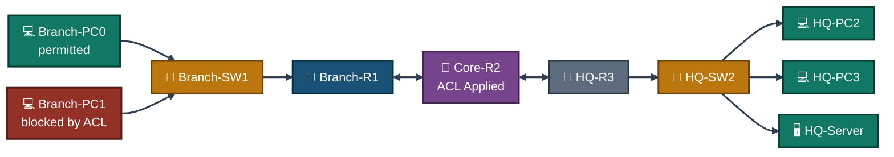
<p align="center"><em>Branch-PC0 and Branch-PC1 sit on the same LAN behind the same ACL — source IP alone is what separates "permitted" from "blocked" here.</em></p>

---

<a id="standard-acl-traffic-control-design"></a>
## ⛔ Standard ACL Traffic Control Design

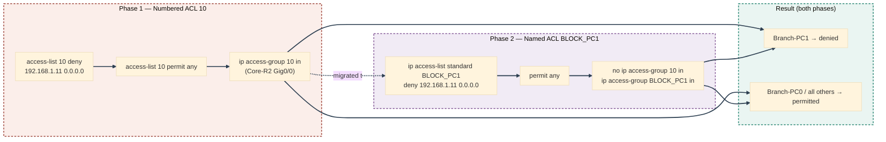
<p align="center"><em>Same two rules, same outcome — the numbered ACL is fully replaced by the named ACL rather than run alongside it.</em></p>

---

<a id="ip-design"></a>
## 🗂️ IP Design

| Device | Interface | IP Address | Subnet Mask | Gateway |
|--------|-----------|------------|-------------|---------|
| Branch-R1 | Gig0/0 | 192.168.1.1 | 255.255.255.0 | — |
| Branch-R1 | Gig0/1 | 10.0.0.1 | 255.255.255.252 | — |
| Core-R2 | Gig0/0 | 10.0.0.2 | 255.255.255.252 | — |
| Core-R2 | Gig0/1 | 10.0.1.1 | 255.255.255.252 | — |
| HQ-R3 | Gig0/0 | 10.0.1.2 | 255.255.255.252 | — |
| HQ-R3 | Gig0/1 | 192.168.2.1 | 255.255.255.0 | — |
| Branch-PC0 | Fa0 | 192.168.1.10 | 255.255.255.0 | 192.168.1.1 |
| Branch-PC1 | Fa0 | 192.168.1.11 | 255.255.255.0 | 192.168.1.1 |
| HQ-PC2 | Fa0 | 192.168.2.20 | 255.255.255.0 | 192.168.2.1 |
| HQ-PC3 | Fa0 | 192.168.2.21 | 255.255.255.0 | 192.168.2.1 |
| HQ-Server | Fa0 | 192.168.2.10 | 255.255.255.0 | 192.168.2.1 |

---

<a id="simulated-issues"></a>
## 🐛 Simulated Issues

| # | Issue | Type |
|---|-------|------|
| 1 | Branch-PC1 can reach HQ-Server without restriction | No ACL configured |
| 2 | All Branch traffic unrestricted to HQ network | Missing access control |
| 3 | Numbered ACL needs replacing with a named ACL | ACL management issue |

---

<a id="module-1"></a>
## 🏗️ Module 1 — Build the Topology

**Objective:** Wire Branch-R1, Core-R2, HQ-R3, both switches, and all five end devices per the connections table above.

### Step 1 — Build Topology ✅

No CLI commands — physical wiring done in the Packet Tracer GUI. Drag devices onto the canvas, connect cables per the topology table, and rename all devices: Branch-R1, Core-R2, HQ-R3, Branch-SW1, HQ-SW2, Branch-PC0, Branch-PC1, HQ-PC2, HQ-PC3, HQ-Server.

<p align="center">
  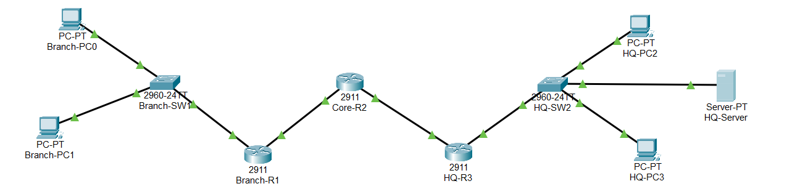<br>
  <em>Exhibit 1 — Full topology: Branch and HQ sites joined through Core-R2, all devices wired and named</em>
</p>

---

<a id="module-2"></a>
## ⚙️ Module 2 — Configure Branch-R1

**Objective:** Address Branch-R1's LAN and WAN interfaces.

### Step 2 — Configure Branch-R1 ✅

```
enable
configure terminal
interface gig0/0
ip address 192.168.1.1 255.255.255.0
no shutdown
exit
interface gig0/1
ip address 10.0.0.1 255.255.255.252
no shutdown
exit
```

<p align="center">
  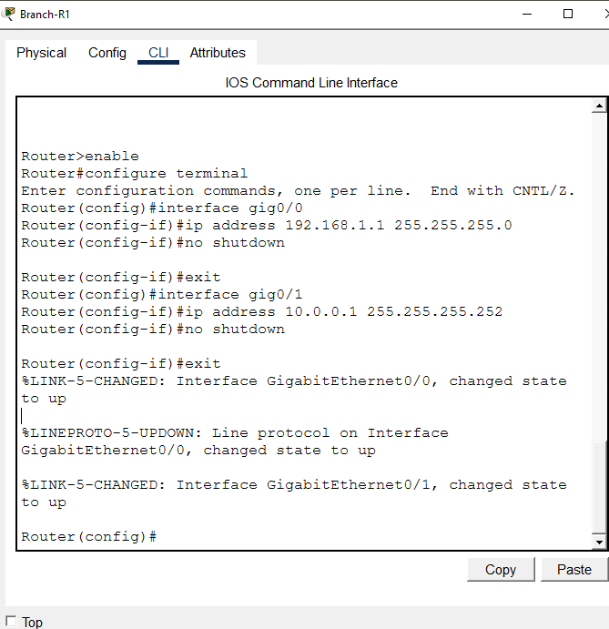<br>
  <em>Exhibit 2 — Branch-R1's LAN and WAN interfaces addressed and brought up</em>
</p>

---

<a id="module-3"></a>
## 🌐 Module 3 — Configure Core-R2

**Objective:** Address Core-R2's two WAN-facing interfaces — this is the router the ACL will later be applied to.

### Step 3 — Configure Core-R2 ✅

```
enable
configure terminal
interface gig0/0
ip address 10.0.0.2 255.255.255.252
no shutdown
exit
interface gig0/1
ip address 10.0.1.1 255.255.255.252
no shutdown
exit
```

<p align="center">
  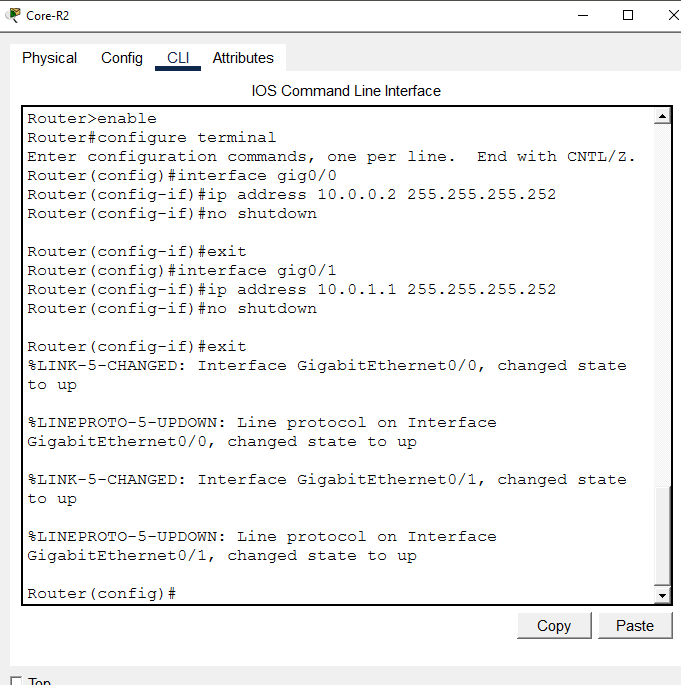<br>
  <em>Exhibit 3 — Core-R2's two WAN interfaces addressed and brought up</em>
</p>

---

<a id="module-4"></a>
## 🏢 Module 4 — Configure HQ-R3

**Objective:** Address HQ-R3's WAN and LAN interfaces.

### Step 4 — Configure HQ-R3 ✅

```
enable
configure terminal
interface gig0/0
ip address 10.0.1.2 255.255.255.252
no shutdown
exit
interface gig0/1
ip address 192.168.2.1 255.255.255.0
no shutdown
exit
```

<p align="center">
  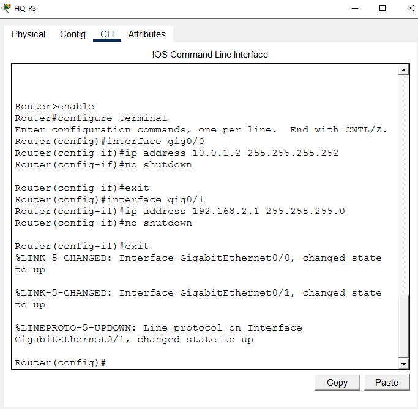<br>
  <em>Exhibit 4 — HQ-R3's WAN and LAN interfaces addressed and brought up</em>
</p>

---

<a id="module-5"></a>
## 💻 Module 5 — Configure PC and Server IPs

**Objective:** Address all three Branch/HQ hosts and the HQ server per the IP design.

### Step 5 — Configure PC and Server IPs ✅

```
Branch-PC0 → Desktop → IP Configuration → Static
→ IP: 192.168.1.10 | Mask: 255.255.255.0 | GW: 192.168.1.1

Branch-PC1 → Desktop → IP Configuration → Static
→ IP: 192.168.1.11 | Mask: 255.255.255.0 | GW: 192.168.1.1

HQ-PC2 → Desktop → IP Configuration → Static
→ IP: 192.168.2.20 | Mask: 255.255.255.0 | GW: 192.168.2.1

HQ-PC3 → Desktop → IP Configuration → Static
→ IP: 192.168.2.21 | Mask: 255.255.255.0 | GW: 192.168.2.1

HQ-Server → Desktop → IP Configuration → Static
→ IP: 192.168.2.10 | Mask: 255.255.255.0 | GW: 192.168.2.1
```

<p align="center">
  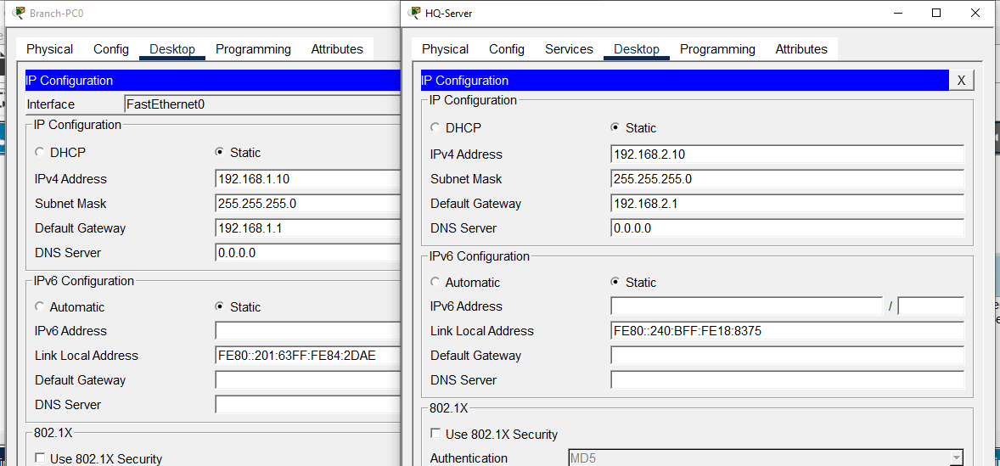<br>
  <em>Exhibit 5 — All five end devices addressed per the IP design</em>
</p>

---

<a id="module-6"></a>
## 🧭 Module 6 — Configure Static Routing

**Objective:** Route between all three subnets so Branch and HQ hosts can reach each other across the WAN.

### Step 6 — Configure Static Routing ✅

```
Branch-R1:
ip route 10.0.1.0 255.255.255.252 10.0.0.2
ip route 192.168.2.0 255.255.255.0 10.0.0.2

Core-R2:
ip route 192.168.1.0 255.255.255.0 10.0.0.1
ip route 192.168.2.0 255.255.255.0 10.0.1.2

HQ-R3:
ip route 192.168.1.0 255.255.255.0 10.0.1.1
ip route 10.0.0.0 255.255.255.252 10.0.1.1
```

<p align="center">
  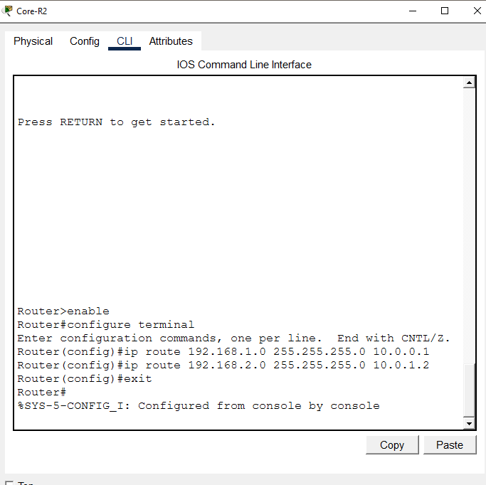<br>
  <em>Exhibit 6 — Static routes configured on all three routers</em>
</p>

---

<a id="module-7"></a>
## 📶 Module 7 — Pre-ACL Ping Test

**Objective:** Confirm every host can reach every other host before any ACL is applied.

### Step 7 — Pre-ACL Ping Test ✅

```
Branch-PC0> ping 192.168.2.10  → Reply
Branch-PC0> ping 192.168.2.20  → Reply
Branch-PC0> ping 192.168.2.21  → Reply
Branch-PC1> ping 192.168.2.10  → Reply (will be blocked after ACL)

→ All hosts reachable — no restrictions yet
```

<p align="center">
  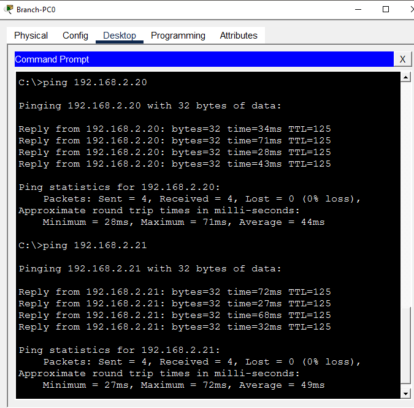<br>
  <em>Exhibit 7 — Full connectivity confirmed before any ACL is configured</em>
</p>

---

<a id="module-8"></a>
## 📝 Module 8 — Configure Standard Numbered ACL

**Objective:** Write a standard numbered ACL on Core-R2 denying Branch-PC1 by host, permitting everything else.

### Step 8 — Configure Standard Numbered ACL ✅

```
enable
configure terminal
access-list 10 deny 192.168.1.11 0.0.0.0
access-list 10 permit any
exit

→ ACL 10: deny host 192.168.1.11
→ ACL 10: permit any
```

<p align="center">
  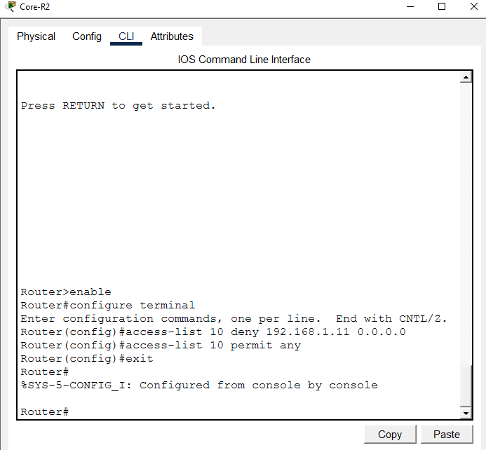<br>
  <em>Exhibit 8 — Standard numbered ACL 10 written with a deny-host and permit-any rule</em>
</p>

---

<a id="module-9"></a>
## 🔌 Module 9 — Apply ACL to Interface

**Objective:** Bind ACL 10 to Core-R2's interface facing Branch, so it filters incoming Branch traffic.

### Step 9 — Apply ACL to Interface ✅

```
enable
configure terminal
interface gig0/0
ip access-group 10 in
exit

→ ACL 10 applied inbound on Gig0/0
→ All traffic from Branch filtered through ACL
```

<p align="center">
  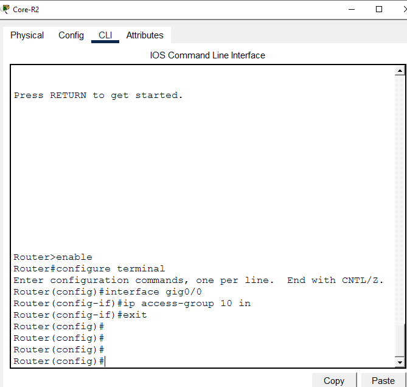<br>
  <em>Exhibit 9 — ACL 10 applied inbound on Core-R2 Gig0/0</em>
</p>

---

<a id="module-10"></a>
## 📋 Module 10 — Verify ACL Configuration

**Objective:** Confirm the ACL's rules and its binding to the interface are both correct.

### Step 10 — Verify ACL Configuration ✅

```
show access-lists
→ Standard IP access list 10
    10 deny host 192.168.1.11
    20 permit any

show ip interface gig0/0
→ Inbound access list is 10
```

<p align="center">
  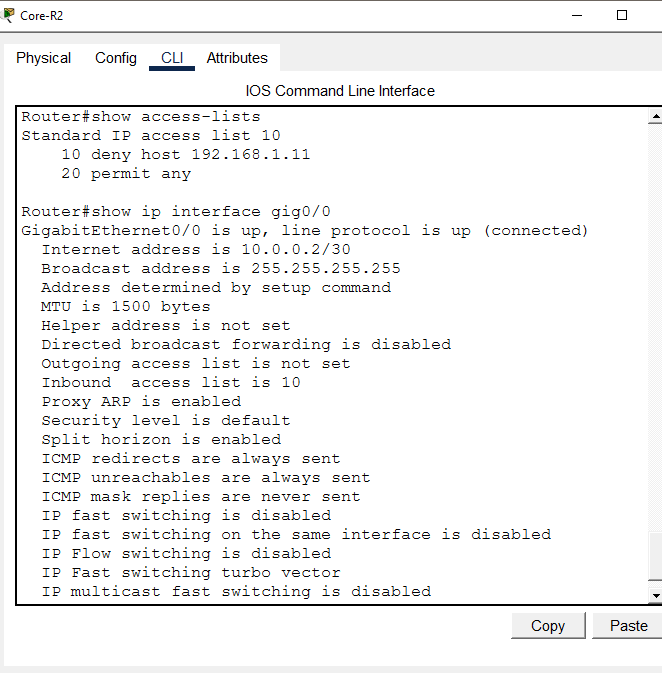<br>
  <em>Exhibit 10 — ACL rules and inbound interface binding both confirmed</em>
</p>

---

<a id="module-11"></a>
## ⛔ Module 11 — Test Blocked Traffic

**Objective:** Confirm Branch-PC1 is blocked from reaching the HQ network.

### Step 11 — Test Blocked Traffic ✅

```
Branch-PC1> ping 192.168.2.10
→ Request timed out — BLOCKED by ACL ✅

Branch-PC1> ping 192.168.2.20
→ Request timed out — BLOCKED by ACL ✅
```

<p align="center">
  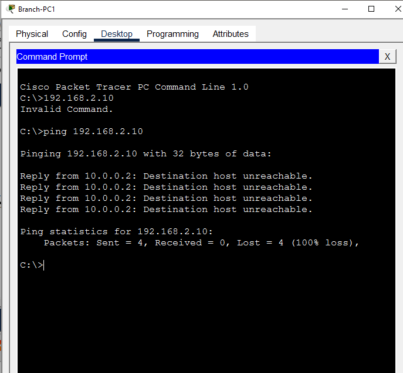<br>
  <em>Exhibit 11 — Branch-PC1's pings to HQ hosts confirmed blocked</em>
</p>

---

<a id="module-12"></a>
## ✅ Module 12 — Test Permitted Traffic

**Objective:** Confirm Branch-PC0 keeps full access to the HQ network.

### Step 12 — Test Permitted Traffic ✅

```
Branch-PC0> ping 192.168.2.10  → Reply ✅
Branch-PC0> ping 192.168.2.20  → Reply ✅

→ PC0 traffic permitted — ACL working correctly
```

<p align="center">
  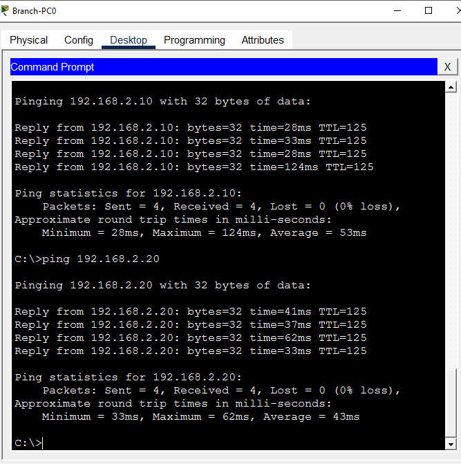<br>
  <em>Exhibit 12 — Branch-PC0's pings succeed, confirming it isn't caught by the deny rule</em>
</p>

---

<a id="module-13"></a>
## 📝 Module 13 — Configure Named ACL

**Objective:** Rebuild the exact same filtering logic as a named ACL for better manageability.

### Step 13 — Configure Named ACL ✅

```
enable
configure terminal
ip access-list standard BLOCK_PC1
deny 192.168.1.11 0.0.0.0
permit any
exit

→ Named ACL BLOCK_PC1 created
→ Same rules as numbered ACL 10
```

<p align="center">
  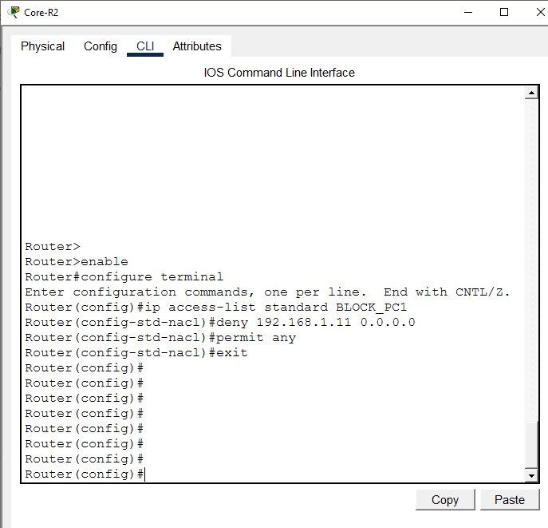<br>
  <em>Exhibit 13 — Named ACL BLOCK_PC1 written with identical logic to ACL 10</em>
</p>

---

<a id="module-14"></a>
## 📋 Module 14 — Verify Named ACL

**Objective:** Confirm the named ACL's rules are correct before switching over to it.

### Step 14 — Verify Named ACL ✅

```
show access-lists

→ Standard IP access list BLOCK_PC1
    10 deny host 192.168.1.11
    20 permit any
→ Named ACL confirmed
```

<p align="center">
  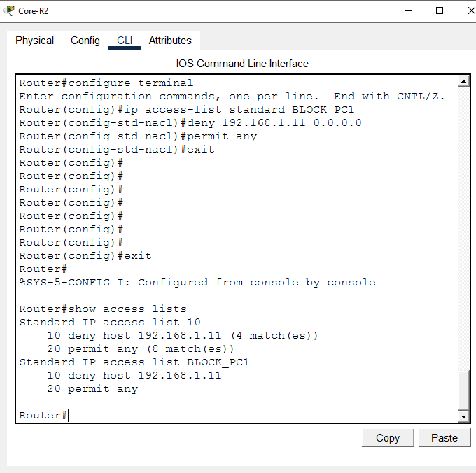<br>
  <em>Exhibit 14 — Named ACL BLOCK_PC1 confirmed correct before being applied</em>
</p>

---

<a id="module-15"></a>
## 🔁 Module 15 — Remove Numbered ACL and Apply Named ACL

**Objective:** Retire ACL 10 and put BLOCK_PC1 in its place on the same interface.

### Step 15 — Remove Numbered ACL and Apply Named ACL ✅

```
enable
configure terminal
interface gig0/0
no ip access-group 10 in
exit
no access-list 10
interface gig0/0
ip access-group BLOCK_PC1 in
exit

→ ACL 10 removed
→ BLOCK_PC1 applied inbound on Gig0/0
```

<p align="center">
  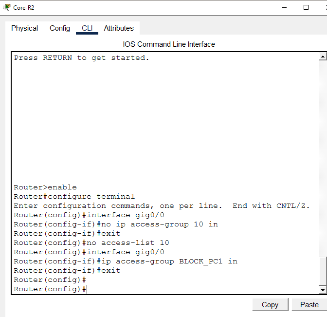<br>
  <em>Exhibit 15 — Numbered ACL 10 removed and named ACL BLOCK_PC1 applied in its place</em>
</p>

---

<a id="module-16"></a>
## 🔢 Module 16 — Final ACL Verification

**Objective:** Confirm only the named ACL is active on the interface, with the numbered ACL fully gone.

### Step 16 — Final ACL Verification ✅

```
show access-lists
→ Standard IP access list BLOCK_PC1
    10 deny host 192.168.1.11
    20 permit any

show ip interface gig0/0
→ Inbound access list is BLOCK_PC1
→ Numbered ACL 10 removed ✅
```

<p align="center">
  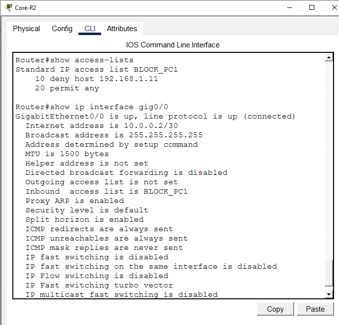<br>
  <em>Exhibit 16 — BLOCK_PC1 confirmed as the only active ACL on the interface</em>
</p>

---

<a id="module-17"></a>
## 🧾 Module 17 — Full Connectivity Final Test

**Objective:** Re-run every blocked and permitted case together against the named ACL as one final confirmation.

### Step 17 — Full Connectivity Final Test ✅

```
Branch-PC0> ping 192.168.2.10  → Reply ✅ (permitted)
Branch-PC0> ping 192.168.2.20  → Reply ✅ (permitted)
Branch-PC1> ping 192.168.2.10  → Timeout ✅ (blocked)

→ ACL working correctly — lab complete
```

<p align="center">
  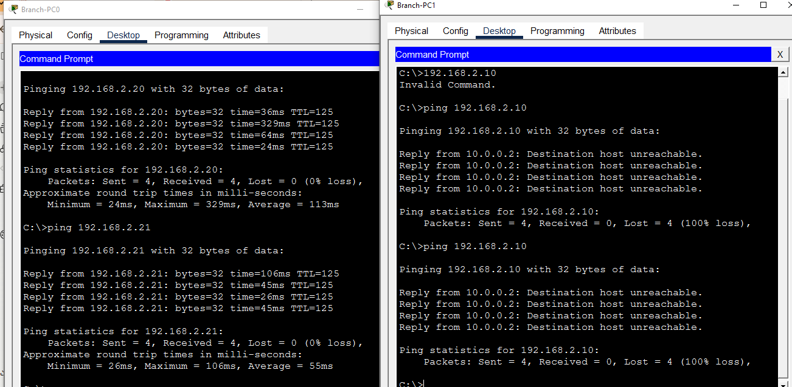<br>
  <em>Exhibit 17 — Every blocked and permitted case confirmed together under the named ACL</em>
</p>

---

<a id="coverage-snapshot"></a>
## 🌟 Coverage Snapshot

| 🛡️ Layer | ✅ Status | 📌 Detail |
|---|---|---|
| Topology | Live | Three routers, two switches, five end devices wired and named (Exhibit 1) |
| Router addressing | Live | Branch-R1, Core-R2, and HQ-R3 all addressed (Exhibits 2–4) |
| End device addressing | Live | All five end devices addressed (Exhibit 5) |
| Static routing | Live | All three subnets reachable across the WAN (Exhibit 6) |
| Pre-ACL baseline | Proven | Full connectivity confirmed before any ACL exists (Exhibit 7) |
| Numbered ACL authored | Live | ACL 10 written with deny-host and permit-any (Exhibit 8) |
| Numbered ACL applied | Live | Bound inbound on Core-R2 Gig0/0 (Exhibit 9) |
| Numbered ACL verified | Proven | Rules and interface binding both confirmed (Exhibit 10) |
| Blocked host confirmed | Proven | Branch-PC1's pings to HQ fail (Exhibit 11) |
| Permitted host confirmed | Proven | Branch-PC0's pings to HQ succeed (Exhibit 12) |
| Named ACL authored | Live | BLOCK_PC1 written with identical logic (Exhibit 13) |
| Named ACL verified | Proven | BLOCK_PC1's rules confirmed correct (Exhibit 14) |
| Migration performed | Live | ACL 10 removed, BLOCK_PC1 applied in its place (Exhibit 15) |
| Migration verified | Proven | Only BLOCK_PC1 active on the interface (Exhibit 16) |
| Full end-to-end test | Proven | Every blocked/permitted case re-confirmed together (Exhibit 17) |

---

<a id="command-summary"></a>
## 📟 Command Summary

| Command | Purpose |
|---------|---------|
| `access-list <num> deny <ip> <wildcard>` | Create numbered standard ACL deny rule |
| `access-list <num> permit any` | Permit all other traffic |
| `ip access-list standard <name>` | Create named standard ACL |
| `ip access-group <acl> in/out` | Apply ACL to interface |
| `no ip access-group <acl> in` | Remove ACL from interface |
| `no access-list <num>` | Delete numbered ACL |
| `show access-lists` | Verify ACL configuration and rule order |
| `show ip interface <int>` | Verify ACL applied to interface |
| `ip route <network> <mask> <next-hop>` | Configure static route |
| `ping <ip>` | Test connectivity |

---

<a id="challenges-fixes"></a>
## ⚠️ Challenges & Fixes

| ❌ Challenge | ✅ Solution |
|---|---|
| HQ-PC3 ping not replying initially | Verified the routing table on HQ-R3 — static routes confirmed correct, PC3's IP and gateway rechecked |
| Numbered ACL hard to manage | Replaced with named ACL BLOCK_PC1 for better readability and manageability |
| ACL applied in the wrong direction | Applied inbound on Core-R2 Gig0/0 — filters traffic coming FROM the Branch network |
| Old ACL conflicting with the new named ACL | Removed numbered ACL 10 with `no access-list 10` before applying the named ACL |
| `permit any` missing from the ACL | Added `permit any` after the deny rule — without it, the implicit deny at the end of the ACL blocks all other traffic |

---

<a id="scope-limitations"></a>
## 🚧 Scope & Limitations

- **Simulation only:** Built and verified in Cisco Packet Tracer, not on physical hardware.
- **Standard ACL only:** Filters by source IP alone — no protocol, port, or destination-based filtering, which is why the ACL had to sit on Core-R2 rather than closer to HQ.
- **Single blocked host:** Only Branch-PC1 is denied; no subnet-wide or range-based deny rules were tested.
- **No logging on the ACL:** Rules don't use the `log` keyword, so matches are visible only through `show access-lists` hit counts, not individually timestamped.
- **One enforcement point:** The ACL is applied only at Core-R2 — no defense-in-depth with matching ACLs at Branch-R1 or HQ-R3.

These limits are stated so the lab is read as a standard-ACL fundamentals exercise, not a production access-control deployment.

---

<a id="what-i-learned"></a>
## 🧠 What I Learned

- **Standard ACLs can only match source IP — nothing else.** That constraint is exactly why this ACL had to live on Core-R2, filtering traffic on its way out toward HQ, rather than on HQ-R3 where it couldn't distinguish which HQ host was being targeted.
- **Migrating a numbered ACL to a named ACL isn't just a naming exercise.** The old ACL has to be explicitly removed from the interface and deleted before the named version can be bound, or both configurations can coexist in confusing ways.
- **The implicit deny at the end of every ACL is silent and total.** Forgetting `permit any` after the deny-host rule would have blocked every other host's traffic too, not just Branch-PC1's.
- **`show access-lists` and `show ip interface` answer two different questions.** One confirms the rules exist and in what order; the other confirms the ACL is actually bound to the interface and direction you intended.

---

<a id="skills-demonstrated"></a>
## 🛠️ Skills Demonstrated

- Writing a standard numbered ACL with a host-specific deny rule and a final permit-any
- Understanding why standard ACLs must be placed close to the destination side of a path
- Applying an ACL to a specific interface and direction, and verifying that binding independently of the rule content
- Migrating a numbered ACL to a named ACL with identical logic, including safely removing the old ACL first
- Running structured blocked-vs-permitted connectivity tests to distinguish denied hosts from permitted ones
- Diagnosing a routing issue by checking the routing table rather than assuming the ACL was at fault

---

<a id="screenshot-index"></a>
## 🖼️ Screenshot Index

| # | File | Shows |
|:---:|---|---|
| 1 | `01-topology.PNG` | Full topology after wiring |
| 2 | `02-branch-r1-config.PNG` | Branch-R1 interface configuration |
| 3 | `03-core-r2-config.PNG` | Core-R2 interface configuration |
| 4 | `04-hq-r3-config.PNG` | HQ-R3 interface configuration |
| 5 | `05-pc-ip-config.PNG` | All five end devices addressed |
| 6 | `06-routing-config.PNG` | Static routes on all three routers |
| 7 | `07-pre-acl-ping-test.PNG` | Pre-ACL full connectivity |
| 8 | `08-standard-acl-config.PNG` | Numbered ACL 10 written |
| 9 | `09-acl-applied-interface.PNG` | ACL 10 bound to Core-R2 Gig0/0 |
| 10 | `10-acl-verify.PNG` | ACL rules and interface binding verified |
| 11 | `11-ping-blocked.PNG` | Branch-PC1 blocked from HQ |
| 12 | `12-ping-permitted.PNG` | Branch-PC0 permitted to HQ |
| 13 | `13-named-acl-config.PNG` | Named ACL BLOCK_PC1 written |
| 14 | `14-named-acl-verify.PNG` | Named ACL rules verified |
| 15 | `15-acl-removed-retest.PNG` | Numbered ACL removed, named ACL applied |
| 16 | `16-final-acl-applied.PNG` | Named ACL confirmed as the only active ACL |
| 17 | `17-full-connectivity-verify.PNG` | Full blocked/permitted test pass |

---

<a id="repo-structure"></a>
## 📁 Repo Structure

```text
02-Network-Security/06-Standard_ACL_Implementation/
|-- README.md
|-- standard-acl-lab.pkt
`-- screenshots/
    |-- 01-topology.PNG
    |-- 02-branch-r1-config.PNG
    |-- 03-core-r2-config.PNG
    |-- 04-hq-r3-config.PNG
    |-- 05-pc-ip-config.PNG
    |-- 06-routing-config.PNG
    |-- 07-pre-acl-ping-test.PNG
    |-- 08-standard-acl-config.PNG
    |-- 09-acl-applied-interface.PNG
    |-- 10-acl-verify.PNG
    |-- 11-ping-blocked.PNG
    |-- 12-ping-permitted.PNG
    |-- 13-named-acl-config.PNG
    |-- 14-named-acl-verify.PNG
    |-- 15-acl-removed-retest.PNG
    |-- 16-final-acl-applied.PNG
    `-- 17-full-connectivity-verify.PNG
```

<div align="center">

⛔ **[Configuring Standard ACLs](https://www.cisco.com/c/en/us/support/docs/ip/access-lists/26448-ACLsamples.html)** · 📝 **[Named vs Numbered ACLs](https://www.cisco.com/c/en/us/td/docs/ios-xml/ios/sec_data_acl/configuration/xe-16/sec-data-acl-xe-16-book/sec-data-acl-cfg-ip-name.html)** · 🎯 **[Understanding Wildcard Masks](https://www.cisco.com/c/en/us/support/docs/ip/access-lists/13959-wildcard-mask-sample.html)**

</div>
