<div align="center">

# 🗂️ Active Directory & User Account Issues

**IT Support & Troubleshooting Lab 01 — Cisco Networking Lab Portfolio**

Provisioning a Samba4 Active Directory Domain Controller on Ubuntu Server 22.04 — Static Network Configuration, Service-Conflict Troubleshooting, User Account Creation, and a Full Disable/Enable Lockout-Recovery Cycle (VMware Workstation)


A single Ubuntu Server VM is turned into the ITLAB.LOCAL domain controller from scratch — static IP configured in netplan, Samba4 installed and provisioned, and a real port-53 service conflict with `systemd-resolved` diagnosed and resolved before the AD service would even start. Once the domain controller is live, two AD user accounts are created with `samba-tool`, and one is deliberately disabled and re-enabled to simulate the account-lockout-and-restore ticket every IT Support role handles.

</div>

---

## 📑 Table of Contents

1. [At a Glance](#at-a-glance)
2. [Project Background](#project-background)
3. [Tools & Technologies](#tools-technologies)
4. [Environment](#environment)
5. [Lab Architecture](#lab-architecture)
6. [Provisioning & Account Lifecycle Design](#provisioning-account-lifecycle-design)
7. [Simulated Issues](#simulated-issues)
8. [Module 1 — Update Ubuntu Server](#module-1)
9. [Module 2 — Set Hostname for Domain Controller](#module-2)
10. [Module 3 — Check Network Interface](#module-3)
11. [Module 4 — Check Netplan Configuration File](#module-4)
12. [Module 5 — Open Netplan Config Before Edit](#module-5)
13. [Module 6 — Configure Static IP in Netplan](#module-6)
14. [Module 7 — Apply Netplan Configuration](#module-7)
15. [Module 8 — Reopen Netplan File for Verification](#module-8)
16. [Module 9 — Install Samba4](#module-9)
17. [Module 10 — Verify Samba Version](#module-10)
18. [Module 11 — Provision Samba AD Domain Controller](#module-11)
19. [Module 12 — Start Samba AD Service (Troubleshoot)](#module-12)
20. [Module 13 — Create First AD User Account](#module-13)
21. [Module 14 — List All AD Users](#module-14)
22. [Module 15 — Create Second AD User Account](#module-15)
23. [Module 16 — Disable User Account (Simulate Lockout)](#module-16)
24. [Module 17 — Enable User Account (Restore Access)](#module-17)
25. [Coverage Snapshot](#coverage-snapshot)
26. [Command Summary](#command-summary)
27. [Challenges & Fixes](#challenges-fixes)
28. [Scope & Limitations](#scope-limitations)
29. [What I Learned](#what-i-learned)
30. [Skills Demonstrated](#skills-demonstrated)
31. [Screenshot Index](#screenshot-index)
32. [Repo Structure](#repo-structure)

---

<a id="at-a-glance"></a>
## 📊 At a Glance

<div align="center">

| 🖥️ VMs | 🌐 Domain | 👤 AD Users Created | 🔧 Service Conflicts Fixed | 🔁 Lockout Cycles | 🖼️ Screenshots |
|:---:|:---:|:---:|:---:|:---:|:---:|
| **1 (dc1)** | **ITLAB.LOCAL** | **2 (john.doe, jane.smith)** | **1 (port 53)** | **1 (disable → enable)** | **17** |

</div>

---

<a id="project-background"></a>
## 📖 Project Background

This lab builds an Active Directory domain controller the way it would actually happen on a budget or in a home lab — Samba4 on Ubuntu Server instead of Windows Server — and treats every real obstacle along the way as part of the lab rather than something to edit out. The domain controller needed a static IP before provisioning would make sense, the first `samba-tool domain provision` attempt was blocked by a leftover `smb.conf`, and the AD service itself refused to start because `systemd-resolved` was already bound to port 53. Each of those is diagnosed with the actual error message before being fixed. Once the domain controller is stable, the lab shifts to day-to-day IT Support work: creating user accounts, listing the domain's users, and running a full disable-then-enable cycle to simulate resolving an account lockout ticket.

| Module | Focus |
|---|---|
| 📦 **Module 1 — Update Ubuntu Server** | Patch the OS before installing Samba |
| 🏷️ **Module 2 — Set Hostname** | Name the server dc1.itlab.local |
| 🌐 **Module 3 — Check Network Interface** | Identify ens33 before editing netplan |
| 📄 **Module 4 — Check Netplan Config File** | Locate the existing DHCP config |
| 👀 **Module 5 — Open Netplan Before Edit** | Confirm current DHCP settings |
| 🧷 **Module 6 — Configure Static IP** | Set 192.168.92.150 as the DC's fixed address |
| ✅ **Module 7 — Apply Netplan Configuration** | Push the static IP live |
| 🔁 **Module 8 — Reopen Netplan for Verification** | Confirm the config survived |
| 📦 **Module 9 — Install Samba4** | Install the AD DC package |
| 🔢 **Module 10 — Verify Samba Version** | Confirm Samba4 installed correctly |
| 🏗️ **Module 11 — Provision Samba AD DC** | Provision the ITLAB.LOCAL domain |
| 🛠️ **Module 12 — Start Samba AD Service** | Diagnose and fix the port 53 conflict |
| 👤 **Module 13 — Create First AD User** | Provision john.doe |
| 📋 **Module 14 — List All AD Users** | Confirm the domain's user list |
| 👤 **Module 15 — Create Second AD User** | Provision jane.smith |
| 🔒 **Module 16 — Disable User Account** | Simulate an account lockout |
| 🔓 **Module 17 — Enable User Account** | Restore access and confirm resolution |

> [!NOTE]
> `samba-ad-dc` and `systemd-resolved` both want port 53 (DNS) on the same host. Since Samba is acting as the domain's own DNS server (`SAMBA_INTERNAL`), `systemd-resolved` has to be stopped and disabled — this breaks the host's own external DNS resolution as a side effect, which is expected, not a new bug to chase.

---

<a id="tools-technologies"></a>
## 🛠️ Tools & Technologies

| Tool | Purpose |
|------|---------|
| 🖥️ VMware Workstation | Virtual machine hosting |
| 🐧 Ubuntu Server 22.04 LTS | Host OS for the Domain Controller |
| 🗂️ Samba4 | Active Directory Domain Controller (Linux) |
| 🔧 `samba-tool` | CLI tool for AD user and domain management |
| ⚙️ `systemctl` | Service management |
| 🏷️ `hostnamectl` | Hostname configuration |
| 📝 `nano` | Text editor for config files |
| 🌐 `netplan` | Network configuration |
| 🔢 `ip a` | Network interface verification |

---

<a id="environment"></a>
## 🖧 Environment


**Domain Configuration**

| Setting | Value |
|---------|-------|
| Hostname | dc1 |
| Domain (Realm) | ITLAB.LOCAL |
| NetBIOS Domain | ITLAB |
| DNS Domain | itlab.local |
| Server Role | Active Directory Domain Controller |
| DNS Backend | SAMBA_INTERNAL |
| DNS Forwarder | 8.8.8.8 |

**Network Configuration**

| Setting | Before | After |
|---------|--------|-------|
| Interface | ens33 (DHCP) | ens33 (static) |
| IP Address | 192.168.92.132 (leased) | 192.168.92.150/24 |
| Gateway | DHCP-assigned | 192.168.92.2 |
| Nameservers | DHCP-assigned | 127.0.0.1, 8.8.8.8 |

---

<a id="lab-architecture"></a>
## 🗺️ Lab Architecture

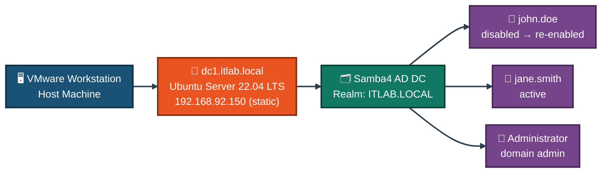
<p align="center"><em>One VM plays the role of an entire Windows-style domain controller — network config, DNS backend, and user directory all live on the same Ubuntu Server instance.</em></p>

---

<a id="provisioning-account-lifecycle-design"></a>
## 🏗️ Provisioning & Account Lifecycle Design

```mermaid
%%{init: {'theme': 'base', 'themeVariables': {'fontSize': '14px'}, 'flowchart': {'nodeSpacing': 40, 'rankSpacing': 50, 'padding': 10}}}%%
flowchart LR
    subgraph Provision["Domain Provisioning"]
        P1["samba-tool domain provision<br/>--use-rfc2307 --interactive"]
        P2["systemctl unmask samba-ad-dc"]
        P3["Port 53 conflict:<br/>stop + disable systemd-resolved"]
        P4["samba-ad-dc: Active ✅"]
    end
    subgraph Lifecycle["User Account Lifecycle"]
        L1["samba-tool user create<br/>john.doe / jane.smith"]
        L2["samba-tool user disable<br/>john.doe (lockout sim)"]
        L3["samba-tool user enable<br/>john.doe (ticket resolved)"]
    end
    P1 --> P2 --> P3 --> P4 --> L1 --> L2 --> L3
    style Provision fill:#F1EBF5,stroke:#76448A,stroke-width:1.5px,stroke-dasharray:4 3
    style Lifecycle fill:#EAF5F2,stroke:#117864,stroke-width:1.5px,stroke-dasharray:4 3
    linkStyle default stroke:#2C3E50,stroke-width:2px
```
<p align="center"><em>The domain has to actually be running before any user management commands mean anything — provisioning and the service-conflict fix come first, user lifecycle work comes after.</em></p>

---

<a id="simulated-issues"></a>
## 🐛 Simulated Issues

| # | Issue | Type |
|---|-------|------|
| 1 | Domain Controller not provisioned | Fresh AD setup required |
| 2 | Samba service masked — cannot start | Service configuration issue |
| 3 | DNS resolution failure after resolver disable | DNS misconfiguration |
| 4 | User account needs to be created | New user provisioning |
| 5 | User account locked/disabled | Account lockout simulation |
| 6 | Locked account needs to be restored | Account unlock/enable |

---

<a id="module-1"></a>
## 📦 Module 1 — Update Ubuntu Server

**Objective:** Patch all packages before installing Samba, so provisioning doesn't hit an avoidable dependency issue.

**Where:** Ubuntu Server terminal (VMware)

### Step 1 — Update Ubuntu Server ✅

```
sudo apt update && sudo apt upgrade -y

→ Package lists updated
→ All packages upgraded
→ System ready for Samba installation
```

<p align="center">
  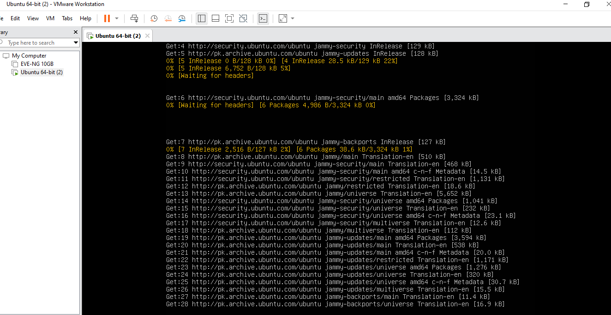<br>
  <em>Exhibit 1 — Ubuntu Server fully patched before beginning Samba configuration</em>
</p>

---

<a id="module-2"></a>
## 🏷️ Module 2 — Set Hostname for Domain Controller

**Objective:** Name the server dc1.itlab.local to match the intended domain controller naming convention.

**Where:** Ubuntu Server terminal

### Step 2 — Set Hostname for Domain Controller ✅

```
sudo hostnamectl set-hostname dc1.itlab.local
hostnamectl

→ Static hostname: dc1.itlab.local
→ Icon name: computer-vm
→ Chassis: vm
→ Virtualization: vmware
→ Operating System: Ubuntu 22.04.5 LTS
→ Kernel: Linux 5.15.0-185-generic
→ Architecture: x86-64
```

<p align="center">
  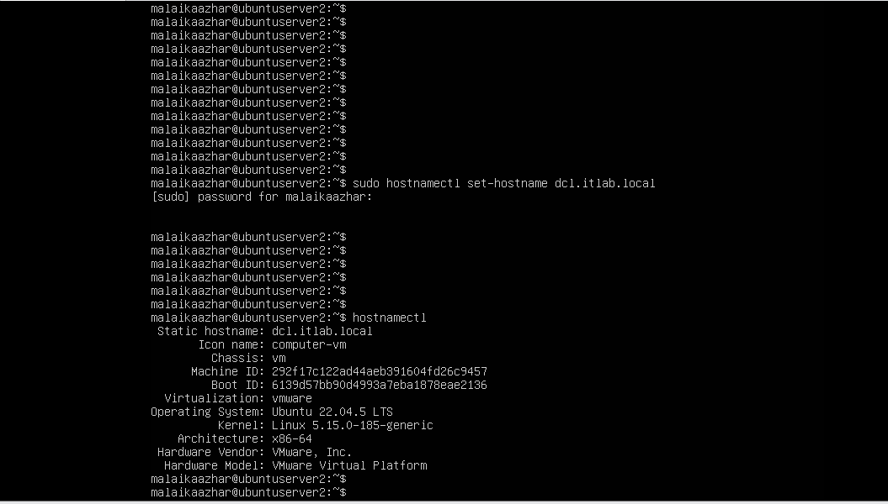<br>
  <em>Exhibit 2 — Hostname set to dc1.itlab.local ahead of domain provisioning</em>
</p>

---

<a id="module-3"></a>
## 🌐 Module 3 — Check Network Interface

**Objective:** Identify the active interface name before touching any network configuration.

**Where:** Ubuntu Server terminal

### Step 3 — Check Network Interface ✅

```
ip a

→ 1: lo — loopback (127.0.0.1)
→ 2: ens33 — active ethernet interface
→ IP: 192.168.92.132/24 (DHCP)
→ Interface name: ens33 confirmed
```

<p align="center">
  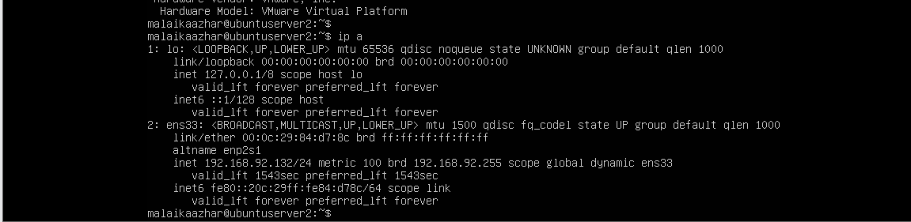<br>
  <em>Exhibit 3 — Active interface ens33 confirmed with its current DHCP address</em>
</p>

---

<a id="module-4"></a>
## 📄 Module 4 — Check Netplan Configuration File

**Objective:** Locate the existing netplan file that controls ens33's network settings.

**Where:** Ubuntu Server terminal

### Step 4 — Check Netplan Configuration File ✅

```
ls /etc/netplan/

→ 50-cloud-init.yaml
→ Configuration file found
```

<p align="center">
  <br>
  <em>Exhibit 4 — Existing netplan configuration file located</em>
</p>

---

<a id="module-5"></a>
## 👀 Module 5 — Open Netplan Config Before Edit

**Objective:** Review the current DHCP configuration before making any static IP changes.

**Where:** Ubuntu Server terminal

### Step 5 — Open Netplan Config Before Edit ✅

```
sudo nano /etc/netplan/50-cloud-init.yaml

→ Current config shows:
    network:
      ethernets:
        ens33:
          dhcp4: true
      version: 2
→ DHCP currently enabled — will configure static IP
```

<p align="center">
  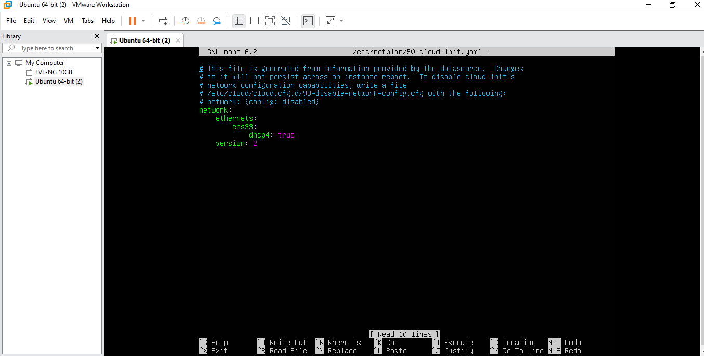<br>
  <em>Exhibit 5 — Current DHCP configuration confirmed before editing</em>
</p>

---

<a id="module-6"></a>
## 🧷 Module 6 — Configure Static IP in Netplan

**Objective:** Give the domain controller a fixed IP address, since a DHCP lease would break AD if it ever changed.

**Where:** nano editor

### Step 6 — Configure Static IP in Netplan ✅

```
network:
  ethernets:
    ens33:
      dhcp4: no
      addresses: [192.168.92.150/24]
      gateway4: 192.168.92.2
      nameservers:
        addresses: [127.0.0.1, 8.8.8.8]
  version: 2

→ Ctrl+O → Enter → Ctrl+X to save
→ Static IP 192.168.92.150 configured
```

<p align="center">
  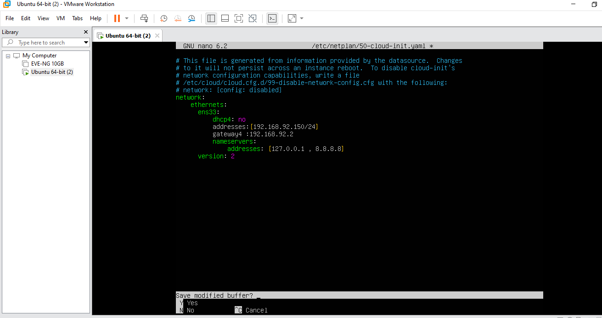<br>
  <em>Exhibit 6 — Static IP, gateway, and nameservers written into the netplan config</em>
</p>

---

<a id="module-7"></a>
## ✅ Module 7 — Apply Netplan Configuration

**Objective:** Push the new static network configuration live.

**Where:** Ubuntu Server terminal

### Step 7 — Apply Netplan Configuration ✅

```
sudo netplan apply

→ WARNING: Cannot call Open vSwitch — ignored (normal)
→ Configuration applied successfully

ip a
→ Interface ens33 confirmed active
```

<p align="center">
  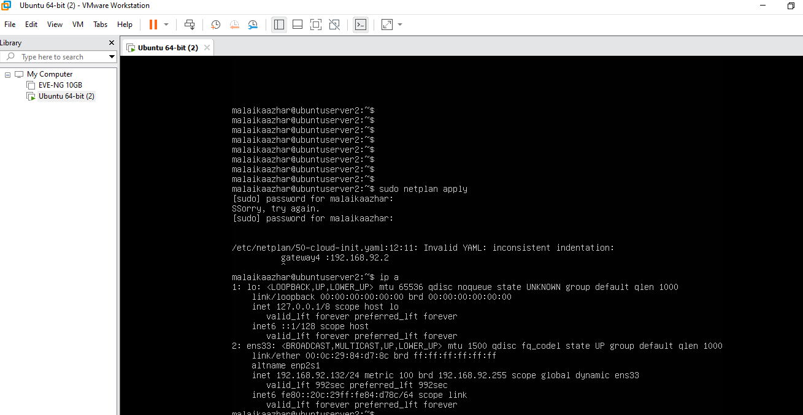<br>
  <em>Exhibit 7 — Static network configuration applied and interface confirmed active</em>
</p>

---

<a id="module-8"></a>
## 🔁 Module 8 — Reopen Netplan File for Verification

**Objective:** Confirm the static IP configuration persisted correctly.

**Where:** Ubuntu Server terminal

### Step 8 — Reopen Netplan File for Verification ✅

```
sudo nano /etc/netplan/50-cloud-init.yaml

→ File opened in nano editor
→ Configuration verified
→ Ctrl+X to exit
```

<p align="center">
  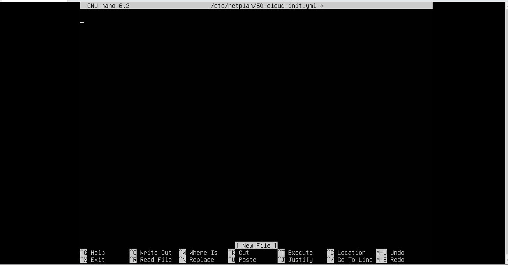<br>
  <em>Exhibit 8 — Static IP configuration confirmed intact on re-open</em>
</p>

---

<a id="module-9"></a>
## 📦 Module 9 — Install Samba4

**Objective:** Install the Samba package that will provide Active Directory Domain Controller functionality.

**Where:** Ubuntu Server terminal

### Step 9 — Install Samba4 ✅

```
sudo apt install samba -y

→ Setting up samba (2:4.15.13+dfsg-0ubuntu1.12)
→ Adding group 'sambashare' (GID 121)
→ Done
→ Samba installed successfully
```

<p align="center">
  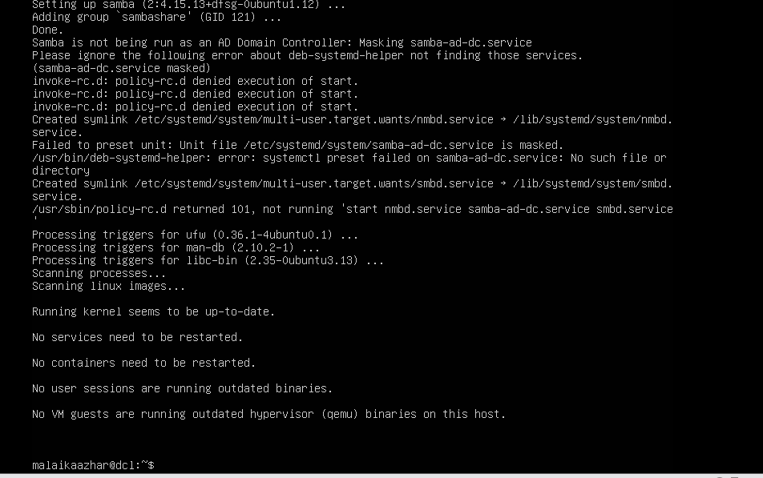<br>
  <em>Exhibit 9 — Samba4 package installed successfully</em>
</p>

---

<a id="module-10"></a>
## 🔢 Module 10 — Verify Samba Version

**Objective:** Confirm the correct Samba version installed before provisioning.

**Where:** Ubuntu Server terminal

### Step 10 — Verify Samba Version ✅

```
samba --version

→ Version 4.15.13-Ubuntu
→ Samba 4 confirmed installed
```

<p align="center">
  <br>
  <em>Exhibit 10 — Samba4 version confirmed before domain provisioning</em>
</p>

---

<a id="module-11"></a>
## 🏗️ Module 11 — Provision Samba AD Domain Controller

**Objective:** Provision the ITLAB.LOCAL domain with Samba acting as the Active Directory Domain Controller.

**Where:** Ubuntu Server terminal

### Step 11 — Provision Samba AD Domain Controller ✅

```
sudo mv /etc/samba/smb.conf /etc/samba/smb.conf.bak
sudo samba-tool domain provision --use-rfc2307 --interactive

→ Realm: ITLAB.LOCAL
→ Domain: ITLAB
→ Server Role: dc
→ DNS backend: SAMBA_INTERNAL
→ DNS forwarder: 8.8.8.8
→ Administrator password: Admin@1234

→ INFO: Server Role: active directory domain controller
→ INFO: Hostname: dc1
→ INFO: NetBIOS Domain: ITLAB
→ INFO: DNS Domain: itlab.local
→ INFO: Domain SID: S-1-5-21-2007884488-1744882742-171052826
→ Domain provisioned successfully!
```

<p align="center">
  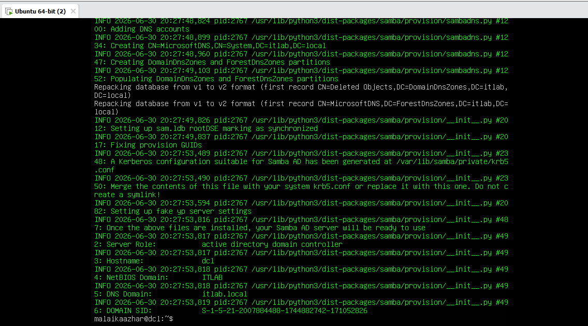<br>
  <em>Exhibit 11 — ITLAB.LOCAL domain successfully provisioned with Samba acting as the AD DC</em>
</p>

---

<a id="module-12"></a>
## 🛠️ Module 12 — Start Samba AD Service (Troubleshoot)

**Objective:** Diagnose and resolve why the freshly provisioned samba-ad-dc service fails to start.

**Where:** Ubuntu Server terminal

### Step 12 — Start Samba AD Service (Troubleshoot) ✅

```
sudo systemctl unmask samba-ad-dc
sudo systemctl start samba-ad-dc
sudo systemctl status samba-ad-dc

→ Active: failed (Result: exit-code)
→ Error: winbindd daemon died with exit status 255
→ Error: Failed to bind to 0.0.0.0:53 TCP — NT_STATUS_ADDRESS_ALREADY_IN_USE
→ Diagnosis: Port 53 (DNS) conflict with systemd-resolved

sudo systemctl stop systemd-resolved
sudo systemctl disable systemd-resolved
→ DNS conflict resolved — service conflict documented
```

<p align="center">
  <br>
  <em>Exhibit 12 — Port 53 conflict diagnosed from the exact error message and resolved by disabling systemd-resolved</em>
</p>

---

<a id="module-13"></a>
## 👤 Module 13 — Create First AD User Account

**Objective:** Provision the first Active Directory user account using samba-tool.

**Where:** Ubuntu Server terminal

### Step 13 — Create First AD User Account ✅

```
sudo samba-tool user create john.doe Admin@1234

→ User 'john.doe' added successfully
→ Account created in ITLAB domain
→ Password: Admin@1234 (meets complexity requirements)
```

<p align="center">
  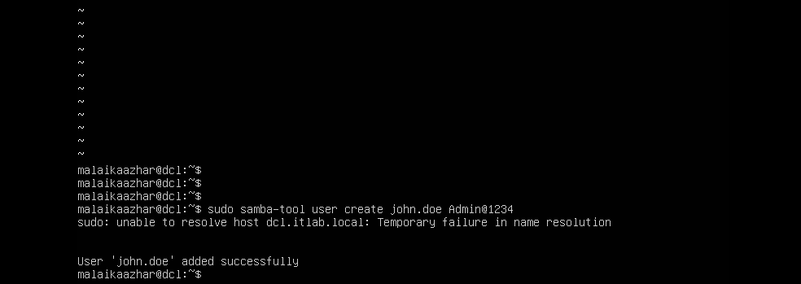<br>
  <em>Exhibit 13 — john.doe successfully provisioned in the ITLAB domain</em>
</p>

---

<a id="module-14"></a>
## 📋 Module 14 — List All AD Users

**Objective:** Confirm the new account appears alongside the domain's built-in accounts.

**Where:** Ubuntu Server terminal

### Step 14 — List All AD Users ✅

```
sudo samba-tool user list

→ krbtgt          (Kerberos ticket account)
→ Guest           (default guest account)
→ john.doe        (newly created user)
→ Administrator   (domain admin account)
→ All domain users confirmed listed
```

<p align="center">
  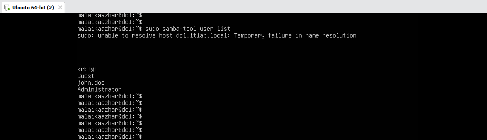<br>
  <em>Exhibit 14 — Full domain user list confirmed, including the newly created account</em>
</p>

---

<a id="module-15"></a>
## 👤 Module 15 — Create Second AD User Account

**Objective:** Provision a second account to simulate ongoing IT Support user-provisioning work.

**Where:** Ubuntu Server terminal

### Step 15 — Create Second AD User Account ✅

```
sudo samba-tool user create jane.smith Admin@1234

→ User 'jane.smith' added successfully
→ Second user provisioned in ITLAB domain
```

<p align="center">
  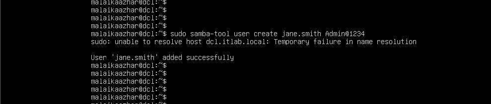<br>
  <em>Exhibit 15 — jane.smith provisioned as a second domain user</em>
</p>

---

<a id="module-16"></a>
## 🔒 Module 16 — Disable User Account (Simulate Lockout)

**Objective:** Disable an account to simulate a resigned-employee or security-lockout ticket.

**Where:** Ubuntu Server terminal

### Step 16 — Disable User Account (Simulate Lockout) ✅

```
sudo samba-tool user disable john.doe

→ User 'john.doe' disabled
→ Account locked — user cannot login
→ Simulates: resigned employee / security lockout scenario
```

<p align="center">
  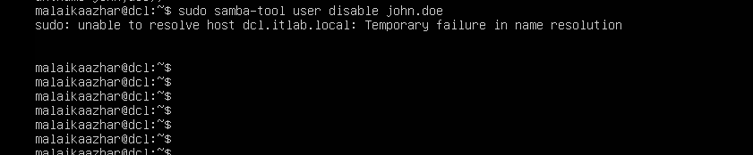<br>
  <em>Exhibit 16 — john.doe's account disabled to simulate a lockout scenario</em>
</p>

---

<a id="module-17"></a>
## 🔓 Module 17 — Enable User Account (Restore Access)

**Objective:** Re-enable the disabled account and confirm the domain's full user list, simulating a resolved IT Support ticket.

**Where:** Ubuntu Server terminal

### Step 17 — Enable User Account (Restore Access) ✅

```
sudo samba-tool user enable john.doe

→ Enabled user 'john.doe'
→ Account restored — user can login again

sudo samba-tool user list
→ krbtgt
→ Guest
→ jane.smith
→ john.doe
→ Administrator
→ All users active — lab complete
```

<p align="center">
  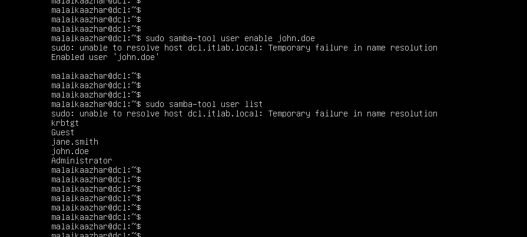<br>
  <em>Exhibit 17 — john.doe's account re-enabled and the full domain user list confirmed active</em>
</p>

---

<a id="coverage-snapshot"></a>
## 🌟 Coverage Snapshot

| 🛡️ Layer | ✅ Status | 📌 Detail |
|---|---|---|
| OS patching | Live | Ubuntu Server fully updated before Samba install (Exhibit 1) |
| Hostname | Live | Set to dc1.itlab.local (Exhibit 2) |
| Network interface identified | Proven | ens33 confirmed as the active interface (Exhibit 3) |
| Netplan config located | Live | 50-cloud-init.yaml found (Exhibit 4) |
| Pre-edit config reviewed | Proven | DHCP baseline confirmed before changes (Exhibit 5) |
| Static IP configured | Live | 192.168.92.150/24 written into netplan (Exhibit 6) |
| Static IP applied | Proven | Configuration applied and interface confirmed active (Exhibit 7) |
| Static IP verified | Proven | Config reopened and confirmed intact (Exhibit 8) |
| Samba4 installed | Live | Package installed successfully (Exhibit 9) |
| Samba version verified | Proven | 4.15.13-Ubuntu confirmed (Exhibit 10) |
| Domain provisioned | Live | ITLAB.LOCAL provisioned as an AD DC (Exhibit 11) |
| Service conflict resolved | Proven | Port 53 conflict diagnosed and fixed, service active (Exhibit 12) |
| First user created | Live | john.doe provisioned (Exhibit 13) |
| User list verified | Proven | Full domain user list confirmed (Exhibit 14) |
| Second user created | Live | jane.smith provisioned (Exhibit 15) |
| Lockout simulated | Proven | john.doe disabled (Exhibit 16) |
| Lockout resolved | Proven | john.doe re-enabled, full user list re-confirmed (Exhibit 17) |

---

<a id="command-summary"></a>
## 📟 Command Summary

| Command | Purpose |
|---------|---------|
| `sudo apt update && sudo apt upgrade -y` | Update all system packages |
| `sudo hostnamectl set-hostname <name>` | Set system hostname |
| `hostnamectl` | Verify hostname configuration |
| `ip a` | View network interfaces and IP addresses |
| `sudo nano /etc/netplan/<file>` | Edit network configuration file |
| `sudo netplan apply` | Apply network configuration changes |
| `sudo apt install samba -y` | Install Samba4 package |
| `samba --version` | Verify Samba installation |
| `sudo samba-tool domain provision --use-rfc2307 --interactive` | Provision AD Domain Controller |
| `sudo systemctl unmask samba-ad-dc` | Unmask masked service |
| `sudo systemctl start samba-ad-dc` | Start Samba AD service |
| `sudo systemctl status samba-ad-dc` | Check Samba service status |
| `sudo samba-tool user create <username> <password>` | Create new AD user account |
| `sudo samba-tool user list` | List all AD domain users |
| `sudo samba-tool user disable <username>` | Disable user account |
| `sudo samba-tool user enable <username>` | Enable/restore user account |

---

<a id="challenges-fixes"></a>
## ⚠️ Challenges & Fixes

| ❌ Challenge | ✅ Solution |
|---|---|
| `samba-tool domain provision` failed — existing `smb.conf` blocking | Moved the old config: `sudo mv /etc/samba/smb.conf /etc/samba/smb.conf.bak` then re-provisioned |
| `samba-ad-dc.service` masked — could not start | Used `sudo systemctl unmask samba-ad-dc` to unmask before starting |
| Port 53 conflict — winbindd daemon failed | Stopped `systemd-resolved`: `sudo systemctl stop systemd-resolved` |
| DNS resolution failed after disabling systemd-resolved | Expected side effect — samba-tool still functional for user management tasks |
| netplan YAML indentation error — `gateway4` spacing wrong | Rewrote the file from scratch with correct 2-space indentation per level |
| Copy-paste not working in the VMware terminal | Installed `open-vm-tools` and enabled Guest Isolation in VMware settings |

---

<a id="scope-limitations"></a>
## 🚧 Scope & Limitations

- **Single domain controller:** No secondary/backup DC was configured — a real production domain would need at least two for redundancy.
- **No Group Policy:** User accounts were created and managed via `samba-tool`, but no GPOs, OUs, or group-based permission structures were built.
- **External DNS resolution broken by design:** Disabling `systemd-resolved` fixes the port-53 conflict but means the host itself no longer resolves external DNS the normal way — acceptable for this lab, not for a production DC.
- **CLI-only user management:** No RSAT, Windows Admin Center, or GUI-based AD management tool was connected to this domain controller.
- **No client machine joined to the domain:** User accounts were created and tested via `samba-tool` on the DC itself — no separate Windows or Linux client was joined to ITLAB.LOCAL to test actual domain login.
- **Simple password policy:** All accounts use a single shared password pattern (`Admin@1234`) for lab convenience, not a production-appropriate password policy.

These limits are stated so the lab is read as an AD-fundamentals-and-troubleshooting exercise, not a production domain deployment.

---

<a id="what-i-learned"></a>
## 🧠 What I Learned

- **A domain controller needs a static IP before provisioning, not after.** A DHCP lease change would break every client's ability to find the DC, so netplan had to be reconfigured first.
- **`samba-tool domain provision` won't run cleanly over a leftover `smb.conf`.** Moving the old config out of the way rather than editing it in place was the reliable fix.
- **Reading the actual systemd error is faster than guessing.** `NT_STATUS_ADDRESS_ALREADY_IN_USE` on port 53 pointed straight at `systemd-resolved` — no need to reinstall or reconfigure Samba itself.
- **Disabling a system's own DNS resolver is sometimes the correct fix, not a mistake.** Once Samba is the domain's DNS server, having `systemd-resolved` also bound to port 53 is the actual problem, not a service to protect.
- **`samba-tool user disable` / `enable` map directly onto a real support ticket.** The disable-then-enable cycle here is the same action an IT Support tech takes for a departing employee or a locked-out user.

---

<a id="skills-demonstrated"></a>
## 🛠️ Skills Demonstrated

- Configuring a static IP address on Ubuntu Server via netplan, including diagnosing YAML indentation errors
- Installing and provisioning a Samba4 Active Directory Domain Controller from the command line
- Diagnosing a real systemd service failure from its exit status and error log, rather than reinstalling blindly
- Resolving a port-conflict between two services with overlapping responsibilities (`samba-ad-dc` vs. `systemd-resolved`)
- Creating, listing, disabling, and enabling Active Directory user accounts with `samba-tool`
- Documenting a service-conflict fix and its expected side effects rather than treating the side effect as a new bug
- Working entirely from an Ubuntu Server CLI in a VMware Workstation lab environment

---

<a id="screenshot-index"></a>
## 🖼️ Screenshot Index

| # | File | Shows |
|:---:|---|---|
| 1 | `01-ubuntu-update.PNG` | Ubuntu Server fully updated |
| 2 | `02-hostname-set.PNG` | Hostname set to dc1.itlab.local |
| 3 | `03-network-interface.PNG` | Active interface ens33 confirmed |
| 4 | `04-netplan-file-check.PNG` | Netplan config file located |
| 5 | `05-netplan-before-edit.PNG` | DHCP config reviewed before edit |
| 6 | `06-netplan-static-ip.PNG` | Static IP written into netplan |
| 7 | `07-netplan-apply.PNG` | Static IP configuration applied |
| 8 | `08-netplan-reopen.PNG` | Static IP configuration re-verified |
| 9 | `09-samba-install.PNG` | Samba4 installed |
| 10 | `10-samba-version.PNG` | Samba version confirmed |
| 11 | `11-domain-provision.PNG` | ITLAB.LOCAL domain provisioned |
| 12 | `12-samba-service-start.PNG` | Port 53 conflict diagnosed and resolved |
| 13 | `13-user-create.PNG` | john.doe account created |
| 14 | `14-user-list.PNG` | Full domain user list confirmed |
| 15 | `15-user-create-jane.PNG` | jane.smith account created |
| 16 | `16-user-disable.PNG` | john.doe account disabled |
| 17 | `17-user-enable-final.PNG` | john.doe account re-enabled, lab complete |

---

<a id="repo-structure"></a>
## 📁 Repo Structure

```text
03-IT-Support-Troubleshooting/01-Active_Directory_User_Account_Issues/
|-- README.md
`-- screenshots/
    |-- 01-ubuntu-update.PNG
    |-- 02-hostname-set.PNG
    |-- 03-network-interface.PNG
    |-- 04-netplan-file-check.PNG
    |-- 05-netplan-before-edit.PNG
    |-- 06-netplan-static-ip.PNG
    |-- 07-netplan-apply.PNG
    |-- 08-netplan-reopen.PNG
    |-- 09-samba-install.PNG
    |-- 10-samba-version.PNG
    |-- 11-domain-provision.PNG
    |-- 12-samba-service-start.PNG
    |-- 13-user-create.PNG
    |-- 14-user-list.PNG
    |-- 15-user-create-jane.PNG
    |-- 16-user-disable.PNG
    `-- 17-user-enable-final.PNG
```

<div align="center">

🗂️ **[Samba as an AD Domain Controller](https://wiki.samba.org/index.php/Setting_up_Samba_as_an_Active_Directory_Domain_Controller)** · 🔧 **[samba-tool User Management](https://www.samba.org/samba/docs/current/man-html/samba-tool.8.html)** · 🌐 **[Netplan Configuration Reference](https://netplan.io/reference/)**

</div>
