<div align="center">

# 🔍 DNS Troubleshooting & Resolution

**IT Support & Troubleshooting Lab 02 — Cisco Networking Lab Portfolio**

A Real DNS Resolution Fault Diagnosed and Fixed on Physical Hardware — `ping` vs. `nslookup` Divergence, DNS Cache Flush, and Manual Public DNS Configuration (Windows 10, No VM, No Packet Tracer)


This lab was run live on a physical HP 255 G5 laptop, not a simulator or VM — and it's documented exactly as it happened, including the point where the scripted lab plan didn't match reality. The real fault wasn't a dead DNS server: `ping google.com` succeeded while `nslookup google.com` timed out on a direct query to the router's DNS relay, pointing at a stale local resolver cache rather than an actual outage. Flushing the DNS cache fixed it, confirmed by re-running both commands together — with a manual switch to public DNS (8.8.8.8 / 1.1.1.1) added afterward purely as extra practice, not because it was required.

</div>

---

## 📑 Table of Contents

1. [At a Glance](#at-a-glance)
2. [Project Background](#project-background)
3. [Tools & Technologies](#tools-technologies)
4. [Environment](#environment)
5. [Diagnostic Flow](#diagnostic-flow)
6. [Issues Identified](#issues-identified)
7. [Module 1 — Confirm Baseline Connectivity](#module-1)
8. [Module 2 — Test Domain Resolution](#module-2)
9. [Module 3 — Check Current DNS Configuration](#module-3)
10. [Module 4 — Query DNS Directly with nslookup](#module-4)
11. [Module 5 — Flush DNS Cache](#module-5)
12. [Module 6 — Re-test After Flush](#module-6)
13. [Module 7 — Manually Set a Public DNS Server](#module-7)
14. [Module 8 — Verify Resolution with New DNS](#module-8)
15. [Module 9 — Reverse DNS Lookup](#module-9)
16. [Module 10 — Document Resolution Response Time](#module-10)
17. [Coverage Snapshot](#coverage-snapshot)
18. [Command Summary](#command-summary)
19. [Challenges & Fixes](#challenges-fixes)
20. [Scope & Limitations](#scope-limitations)
21. [What I Learned](#what-i-learned)
22. [Skills Demonstrated](#skills-demonstrated)
23. [Screenshot Index](#screenshot-index)
24. [Repo Structure](#repo-structure)

---

<a id="at-a-glance"></a>
## 📊 At a Glance

<div align="center">

| 💻 Devices | 🔧 Diagnostic Commands | 🐛 Root Cause | 🩹 Fix Applied | 🖼️ Screenshots |
|:---:|:---:|:---:|:---:|:---:|
| **1 (HP 255 G5, real hardware)** | **6** | **Stale local DNS cache** | **`ipconfig /flushdns`** | **10** |

</div>

---

<a id="project-background"></a>
## 📖 Project Background

This lab set out to stage a DNS failure and walk through fixing it, but the real machine didn't cooperate with the script — `ping google.com` resolved fine on the first try, which is documented as-is rather than forced into failing. The actual fault only showed up one layer deeper: `nslookup google.com`, which queries the DNS server directly with no cache fallback, timed out against the router's DNS relay (192.168.100.1) even while cached/system resolution through `ping` kept working. That divergence between `ping` and `nslookup` is the real diagnostic signal in this lab. A DNS cache flush turned out to be the actual fix, confirmed by re-running both commands together. Manually pointing the adapter at public DNS (8.8.8.8 / 1.1.1.1) came after the fix was already confirmed, purely as additional practice.

| Module | Focus |
|---|---|
| 📶 **Module 1 — Confirm Baseline Connectivity** | Rule out a Layer 3 problem before touching DNS |
| 🌐 **Module 2 — Test Domain Resolution** | Attempt the staged failure — documented as it actually occurred |
| 📋 **Module 3 — Check Current DNS Configuration** | Confirm which DNS server the adapter is actually using |
| 🔎 **Module 4 — Query DNS Directly with nslookup** | Find the real fault — a direct query timeout |
| 🧹 **Module 5 — Flush DNS Cache** | Clear the local resolver cache |
| ✅ **Module 6 — Re-test After Flush** | Confirm the fix with both `ping` and `nslookup` |
| 🌍 **Module 7 — Manually Set a Public DNS Server** | Extra practice — not required for the fix |
| 🔁 **Module 8 — Verify Resolution with New DNS** | Confirm resolution still works on public DNS |
| ↩️ **Module 9 — Reverse DNS Lookup** | Practice a reverse lookup against a known IP |
| ⏱️ **Module 10 — Document Resolution Response Time** | Capture resolution timing as a final data point |

> [!NOTE]
> Step 2 of this lab was originally planned to fail as a staged scenario. On the real machine, DNS was already healthy at that point and the ping succeeded. That result is documented exactly as it happened rather than edited to match the original plan — the actual fault surfaced two steps later, in Module 4.

---

<a id="tools-technologies"></a>
## 🛠️ Tools & Technologies

| Tool | Purpose |
|------|---------|
| 🖥️ Command Prompt (cmd.exe) | Run all diagnostic commands |
| 🔎 `nslookup` | Query DNS servers directly, test resolution |
| 📋 `ipconfig` | View/flush DNS cache, check adapter DNS settings |
| 📶 `ping` | Confirm connectivity before and after DNS changes |
| 🌐 Windows Network Settings | Manually set a public DNS server |

---

<a id="environment"></a>
## 🖧 Environment


**Device**

| Setting | Value |
|---------|-------|
| Machine | HP 255 G5 (real hardware, no VM) |
| OS | Windows 10 Pro 64-bit |
| Wi-Fi Adapter | Intel(R) Dual Band Wireless-AC 3165 |
| Default Gateway | 192.168.100.1 (home router) |

**DNS Configuration**

| Setting | Before | After |
|---------|--------|-------|
| DNS Server | 192.168.100.1 (router relay) | 8.8.8.8 (preferred), 1.1.1.1 (alternate) |
| IPv4 Address | 192.168.100.50 | 192.168.100.50 (unchanged) |
| Resolver Cache | Stale (caused the fault) | Flushed and rebuilt |

No topology diagram is used in this lab — everything happens on this one machine's local network stack, not across multiple devices.

---

<a id="diagnostic-flow"></a>
## 🔎 Diagnostic Flow

```mermaid
%%{init: {'theme': 'base', 'themeVariables': {'fontSize': '14px'}, 'flowchart': {'nodeSpacing': 30, 'rankSpacing': 40, 'padding': 8}}}%%
flowchart LR
    S1["ping 8.8.8.8<br/>Layer 3 OK"]:::ok --> S2["ping google.com<br/>resolved (unexpected)"]:::ok
    S2 --> S3["ipconfig /all<br/>DNS = 192.168.100.1"]:::info
    S3 --> S4["nslookup google.com<br/>Request timed out"]:::fault
    S4 --> S5["ipconfig /flushdns"]:::fix
    S5 --> S6["ping + nslookup retest<br/>Both succeed"]:::ok
    S6 --> S7["Manual DNS: 8.8.8.8 / 1.1.1.1<br/>extra practice only"]:::extra
    classDef ok fill:#117864,stroke:#083D33,stroke-width:2px,color:#FFFFFF
    classDef info fill:#1A5276,stroke:#0B2E43,stroke-width:2px,color:#FFFFFF
    classDef fault fill:#943126,stroke:#571C16,stroke-width:2px,color:#FFFFFF
    classDef fix fill:#76448A,stroke:#432752,stroke-width:2px,color:#FFFFFF
    classDef extra fill:#B9770E,stroke:#6E4409,stroke-width:2px,color:#FFFFFF
    linkStyle default stroke:#2C3E50,stroke-width:2px
```
<p align="center"><em>The fault only appears at the nslookup step — ping alone couldn't have caught it, since ping was quietly succeeding off cached resolver data the whole time.</em></p>

---

<a id="issues-identified"></a>
## 🐛 Issues Identified

| # | Issue | Type |
|---|-------|------|
| 1 | `nslookup google.com` timed out despite `ping google.com` succeeding | Direct DNS query failure, masked by cached resolution |
| 2 | Local DNS resolver cache was stale/corrupted | Root cause of the nslookup timeout |
| 3 | Router's DNS relay (192.168.100.1) is the only configured DNS server | Single point of DNS failure — no secondary/public DNS configured |

---

<a id="module-1"></a>
## 📶 Module 1 — Confirm Baseline Connectivity

**Objective:** Rule out a Layer 3 connectivity problem before investigating DNS.

### Step 1 — Confirm Baseline Connectivity ✅

```
ping 8.8.8.8

→ Successful reply
→ Confirms working Layer 3 connectivity before testing DNS
```

<p align="center">
  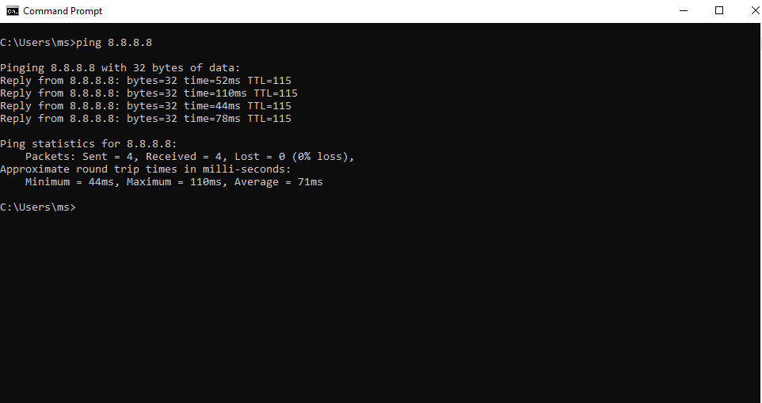<br>
  <em>Exhibit 1 — Baseline connectivity confirmed by pinging a known public IP directly</em>
</p>

---

<a id="module-2"></a>
## 🌐 Module 2 — Test Domain Resolution

**Objective:** Attempt domain resolution as the lab's originally staged failure point.

### Step 2 — Test Domain Resolution ✅

```
ping google.com

→ Successful — domain resolved and replied normally
```

> [!NOTE]
> The original lab plan expected this step to fail as a staged scenario. In this real run, DNS was already healthy at this point, so it succeeded. This is documented as-is rather than forcing a fake failure.

<p align="center">
  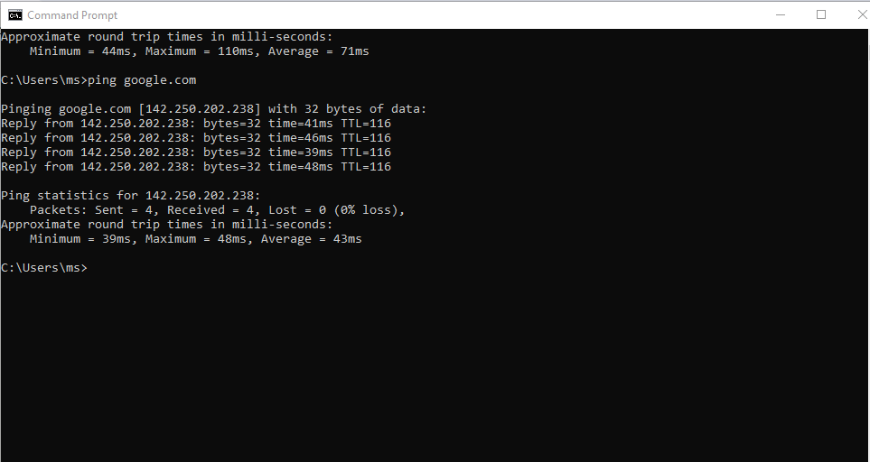<br>
  <em>Exhibit 2 — Domain resolution succeeded, contrary to the originally planned staged failure</em>
</p>

---

<a id="module-3"></a>
## 📋 Module 3 — Check Current DNS Configuration

**Objective:** Confirm which DNS server the adapter is actually configured to use.

### Step 3 — Check Current DNS Configuration ✅

```
ipconfig /all

→ Active Wi-Fi adapter DNS Servers = 192.168.100.1 (home router acting as DNS relay)
→ Default Gateway: 192.168.100.1
→ IPv4 Address: 192.168.100.50
```

<p align="center">
  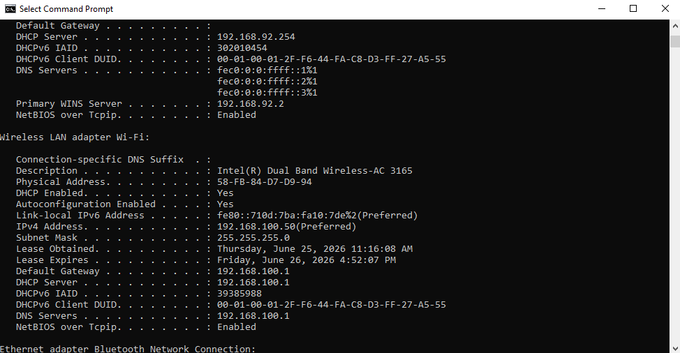<br>
  <em>Exhibit 3 — Current DNS configuration confirmed: the router itself is acting as the DNS relay</em>
</p>

---

<a id="module-4"></a>
## 🔎 Module 4 — Query DNS Directly with nslookup

**Objective:** Bypass any cached resolution and query the DNS server directly to find the real fault.

### Step 4 — Query DNS Directly with nslookup ✅

```
nslookup google.com

→ Request timed out ❌
```

This is the real fault found in this lab. `ping` worked using cached/system resolver data, but a direct query to the DNS server (192.168.100.1) timed out — indicating the router's DNS relay was not responding to direct queries at that moment.

<p align="center">
  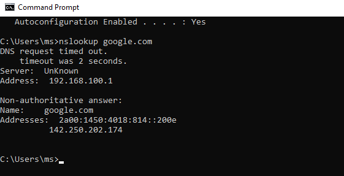<br>
  <em>Exhibit 4 — nslookup times out against the router's DNS relay, exposing the fault ping couldn't catch</em>
</p>

---

<a id="module-5"></a>
## 🧹 Module 5 — Flush DNS Cache

**Objective:** Clear the local resolver cache as the first and simplest fix to try.

### Step 5 — Flush DNS Cache ✅

```
ipconfig /flushdns

→ Successfully flushed the DNS Resolver Cache
```

<p align="center">
  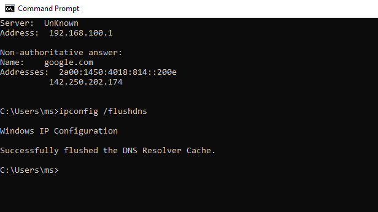<br>
  <em>Exhibit 5 — Local DNS resolver cache flushed</em>
</p>

---

<a id="module-6"></a>
## ✅ Module 6 — Re-test After Flush

**Objective:** Confirm the fix actually worked using both `ping` and `nslookup` together.

### Step 6 — Re-test After Flush ✅

```
ping google.com
nslookup google.com

→ ping: replied successfully
→ nslookup: returned a resolved IP address with no timeout
→ Fixed — the flush resolved the issue
```

Confirms the DNS Server timeout in Module 4 was caused by stale/corrupted local cache, not a router or ISP fault.

<p align="center">
  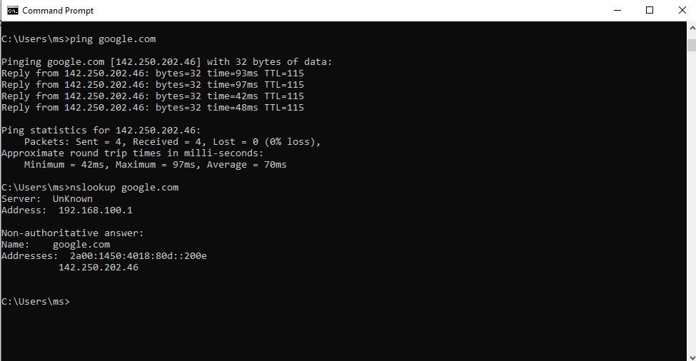<br>
  <em>Exhibit 6 — Both ping and nslookup succeed after the cache flush, confirming the fix</em>
</p>

---

<a id="module-7"></a>
## 🌍 Module 7 — Manually Set a Public DNS Server

**Objective:** Practice manual DNS configuration as an additional exercise — the fault was already resolved by Module 6.

### Step 7 — Manually Set a Public DNS Server ✅

```
Control Panel > Network Connections > Wi-Fi > Properties >
Internet Protocol Version 4 (TCP/IPv4) > Properties >
Use the following DNS server addresses:

Preferred DNS: 8.8.8.8
Alternate DNS: 1.1.1.1
```

<p align="center">
  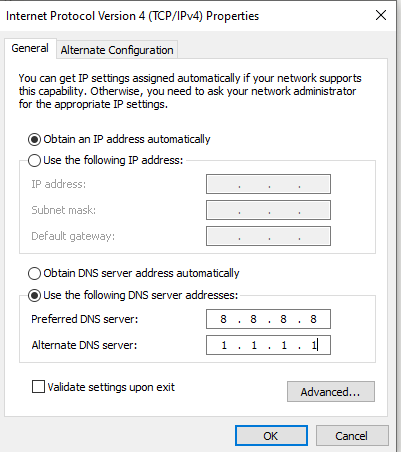<br>
  <em>Exhibit 7 — Adapter manually pointed at Google Public DNS and Cloudflare as an extra exercise</em>
</p>

---

<a id="module-8"></a>
## 🔁 Module 8 — Verify Resolution with New DNS

**Objective:** Confirm resolution still works correctly after switching to public DNS.

### Step 8 — Verify Resolution with New DNS ✅

```
ipconfig /flushdns
nslookup google.com
ping google.com

→ Resolution worked correctly using Google Public DNS (8.8.8.8) instead of the router's relay
```

<p align="center">
  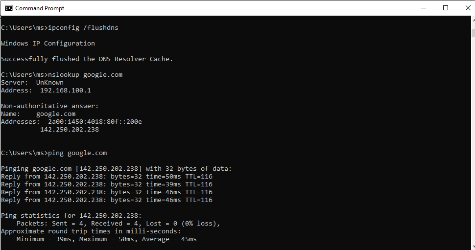<br>
  <em>Exhibit 8 — Resolution confirmed working through the newly configured public DNS server</em>
</p>

---

<a id="module-9"></a>
## ↩️ Module 9 — Reverse DNS Lookup

**Objective:** Practice a reverse DNS lookup against a known public IP.

### Step 9 — Reverse DNS Lookup ✅

```
nslookup 8.8.8.8

→ Verified reverse lookup behavior against a known public DNS IP
```

<p align="center">
  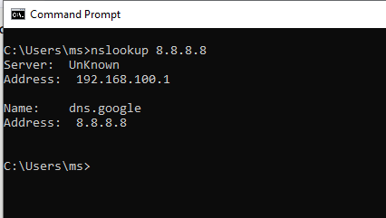<br>
  <em>Exhibit 9 — Reverse DNS lookup confirmed against Google's public DNS IP</em>
</p>

---

<a id="module-10"></a>
## ⏱️ Module 10 — Document Resolution Response Time

**Objective:** Capture resolution timing as a final data point confirming stable performance after the DNS change.

### Step 10 — Document Resolution Response Time ✅

```
nslookup google.com

→ Response time captured in nslookup output
→ Confirms consistent resolution after the DNS change
```

<p align="center">
  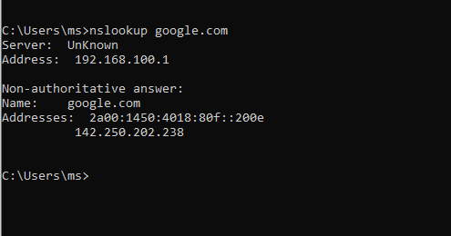<br>
  <em>Exhibit 10 — Resolution response time documented as the final verification step</em>
</p>

---

<a id="coverage-snapshot"></a>
## 🌟 Coverage Snapshot

| 🛡️ Layer | ✅ Status | 📌 Detail |
|---|---|---|
| Baseline connectivity | Proven | Layer 3 connectivity confirmed via direct IP ping (Exhibit 1) |
| Domain resolution — initial | Documented | Resolved successfully, contrary to the original staged plan (Exhibit 2) |
| DNS configuration reviewed | Proven | Router confirmed as the configured DNS relay (Exhibit 3) |
| Real fault identified | Proven | nslookup direct query timeout found and isolated (Exhibit 4) |
| Fix applied | Live | DNS resolver cache flushed (Exhibit 5) |
| Fix verified | Proven | ping and nslookup both succeed after the flush (Exhibit 6) |
| Public DNS configured | Live | Adapter manually pointed at 8.8.8.8 / 1.1.1.1 (Exhibit 7) |
| Public DNS verified | Proven | Resolution confirmed working on the new DNS servers (Exhibit 8) |
| Reverse lookup practiced | Proven | Reverse DNS lookup confirmed against 8.8.8.8 (Exhibit 9) |
| Resolution timing documented | Proven | Response time captured as a final data point (Exhibit 10) |

---

<a id="command-summary"></a>
## 📟 Command Summary

| Command | Purpose |
|---------|---------|
| `ping <IP>` | Test Layer 3 connectivity, rule out network issues |
| `ping <domain>` | Test if a domain resolves and responds |
| `ipconfig /all` | View current DNS server configuration |
| `nslookup <domain>` | Query the DNS server directly, bypassing local cache |
| `ipconfig /flushdns` | Clear the local DNS resolver cache |
| `nslookup <IP>` | Reverse DNS lookup (IP → hostname) |

---

<a id="challenges-fixes"></a>
## ⚠️ Challenges & Fixes

| ❌ Challenge | ✅ Solution |
|---|---|
| `ping google.com` worked but `nslookup google.com` timed out | Identified this as a direct-query failure to the DNS server, separate from cached resolution |
| Router's DNS relay (192.168.100.1) not responding to nslookup | Ran `ipconfig /flushdns` — this resolved the issue, confirming it was a local cache fault, not a router/ISP fault |
| Needed to verify the fix held after the cache flush | Re-ran both `ping` and `nslookup` together to confirm consistent resolution |
| Wanted additional practice beyond the fix | Manually configured public DNS (8.8.8.8 / 1.1.1.1) as an extra exercise, even though it wasn't required to solve the original fault |

---

<a id="scope-limitations"></a>
## 🚧 Scope & Limitations

- **Single device, single network:** Performed on one Windows 10 machine on one home network — not tested across multiple OSes, adapters, or network configurations.
- **Root cause inferred, not exhaustively proven:** The fix (cache flush) resolving the issue strongly suggests a stale cache was the cause, but the router's DNS relay itself was never independently tested during the fault window to rule out a brief router-side hiccup.
- **No packet capture:** The lab relies on `ping`/`nslookup`/`ipconfig` output alone — no Wireshark or packet-level capture was used to confirm what was actually happening on the wire during the timeout.
- **Home network, not enterprise:** No DHCP-assigned enterprise DNS, no Group Policy-pushed DNS settings, and no domain environment — this is a home-router DNS relay scenario.
- **No IPv6 DNS behavior examined:** All testing was IPv4 (`ping`, `nslookup` against IPv4 addresses); IPv6 DNS resolution wasn't part of this lab.

These limits are stated so the lab is read as a real, honestly-documented troubleshooting exercise, not a fully controlled or exhaustive DNS diagnostic.

---

<a id="what-i-learned"></a>
## 🧠 What I Learned

- **`ping <domain>` and `nslookup <domain>` can disagree, and that disagreement is itself diagnostic information.** `ping` can succeed off cached or system resolver data even when a direct query to the DNS server would time out — `nslookup` is the tool that actually tests the DNS server itself.
- **A DNS Server timeout doesn't always mean the DNS server is down.** In this case, flushing the local cache fixed it, which means the fault was on the client side, not the router or ISP.
- **Real troubleshooting doesn't always match the plan, and that's worth documenting rather than hiding.** The lab was scripted to fail at Module 2; it didn't, and the real fault only appeared two steps later. Recording that honestly is more useful than editing the results to fit the original script.
- **Manually configuring public DNS (Google/Cloudflare) is a separate skill from fixing a cache fault** — useful to know, but it wasn't what solved this particular issue.

---

<a id="skills-demonstrated"></a>
## 🛠️ Skills Demonstrated

- Using `ping` to isolate Layer 3 connectivity issues from DNS issues
- Using `nslookup` to bypass cached resolution and test a DNS server directly
- Reading `ipconfig /all` output to identify the actual DNS server in use
- Diagnosing a cache-related fault and confirming the fix with a repeatable before/after test
- Manually configuring a public DNS server on a Windows 10 network adapter
- Performing and interpreting a reverse DNS lookup
- Documenting real troubleshooting results as they actually occurred, including a deviation from the original lab plan

---

<a id="screenshot-index"></a>
## 🖼️ Screenshot Index

| # | File | Shows |
|:---:|---|---|
| 1 | `01-baseline-ping.PNG` | Baseline Layer 3 connectivity confirmed |
| 2 | `02-dns-ping-success.PNG` | Domain ping succeeded (unplanned) |
| 3 | `03-dns-config.PNG` | Current DNS configuration reviewed |
| 4 | `04-nslookup-test.PNG` | nslookup timeout — the real fault |
| 5 | `05-flush-dns.PNG` | DNS cache flushed |
| 6 | `06-retest-flush.PNG` | Fix confirmed via ping and nslookup |
| 7 | `07-manual-dns.PNG` | Public DNS manually configured |
| 8 | `08-verify-new-dns.PNG` | Resolution verified on public DNS |
| 9 | `09-reverse-lookup.PNG` | Reverse DNS lookup confirmed |
| 10 | `10-resolution-time.PNG` | Resolution response time documented |

---

<a id="repo-structure"></a>
## 📁 Repo Structure

```text
03-IT-Support-Troubleshooting/02-DNS_Troubleshooting_Resolution/
|-- README.md
`-- screenshots/
    |-- 01-baseline-ping.PNG
    |-- 02-dns-ping-success.PNG
    |-- 03-dns-config.PNG
    |-- 04-nslookup-test.PNG
    |-- 05-flush-dns.PNG
    |-- 06-retest-flush.PNG
    |-- 07-manual-dns.PNG
    |-- 08-verify-new-dns.PNG
    |-- 09-reverse-lookup.PNG
    `-- 10-resolution-time.PNG
```

<div align="center">

🔍 **[nslookup Command Reference](https://learn.microsoft.com/en-us/windows-server/administration/windows-commands/nslookup)** · 🧹 **[Understanding ipconfig /flushdns](https://learn.microsoft.com/en-us/windows-server/administration/windows-commands/ipconfig)** · 🌐 **[Public DNS: Google & Cloudflare](https://developers.google.com/speed/public-dns/docs/using)**

</div>
