<div align="center">

# ✉️ Email & Network Connectivity Troubleshooting

**IT Support & Troubleshooting Lab 03 — Cisco Networking Lab Portfolio**

Diagnosing Mail Server Reachability Down to the Protocol Level — DNS Resolution, SMTP/IMAP/POP3 Port Testing, Route Tracing, Firewall Inspection, MX Record Verification, and a Deliberate Wrong-DNS Fault Injection (Windows 10 Pro, CMD + PowerShell)


No email client GUI is used anywhere in this lab — every check is done at the network and protocol level from CMD and PowerShell. DNS resolution is confirmed for Gmail and Outlook, SMTP/IMAP/POP3 ports are tested individually with `Test-NetConnection`, the route to the mail server is traced hop by hop, firewall profiles are inspected, and a wrong DNS server is deliberately configured to trigger and observe a real resolution failure before being corrected and re-verified.

</div>

---

## 📑 Table of Contents

1. [At a Glance](#at-a-glance)
2. [Project Background](#project-background)
3. [Tools & Technologies](#tools-technologies)
4. [Environment](#environment)
5. [Mail Connectivity Architecture](#mail-connectivity-architecture)
6. [Diagnostic & Fault-Injection Flow](#diagnostic-flow)
7. [Simulated Issues](#simulated-issues)
8. [Module 1 — Launch CMD](#module-1)
9. [Module 2 — View Full Network Configuration](#module-2)
10. [Module 3 — DNS Lookup for Gmail](#module-3)
11. [Module 4 — DNS Lookup for Outlook](#module-4)
12. [Module 5 — Ping SMTP Mail Server](#module-5)
13. [Module 6 — Test SMTP Port 587 Connectivity](#module-6)
14. [Module 7 — Test IMAP Port 993 Connectivity](#module-7)
15. [Module 8 — Test POP3 Port 995 Connectivity](#module-8)
16. [Module 9 — Tracert to SMTP Mail Server](#module-9)
17. [Module 10 — View Active Network Connections](#module-10)
18. [Module 11 — Inspect Windows Firewall Profiles](#module-11)
19. [Module 12 — Verify SMTP via Alternate DNS](#module-12)
20. [Module 13 — Simulate Wrong DNS Server](#module-13)
21. [Module 14 — Fix DNS — Verify with Correct Server](#module-14)
22. [Module 15 — Full Email Server Connectivity Test](#module-15)
23. [Module 16 — MX Record Lookup for Gmail](#module-16)
24. [Module 17 — Final Summary — IP and Gateway Verification](#module-17)
25. [Coverage Snapshot](#coverage-snapshot)
26. [Command Summary](#command-summary)
27. [Challenges & Fixes](#challenges-fixes)
28. [Scope & Limitations](#scope-limitations)
29. [What I Learned](#what-i-learned)
30. [Skills Demonstrated](#skills-demonstrated)
31. [Screenshot Index](#screenshot-index)
32. [Repo Structure](#repo-structure)

---

<a id="at-a-glance"></a>
## 📊 At a Glance

<div align="center">

| 💻 Host | 📧 Providers Tested | 🔌 Ports Verified | 🐛 Fault Injected | 🖼️ Screenshots |
|:---:|:---:|:---:|:---:|:---:|
| **1 (Windows 10 Pro)** | **3 (Gmail, Outlook, Yahoo)** | **3 (587, 993, 995)** | **1 (invalid DNS server)** | **17** |

</div>

---

<a id="project-background"></a>
## 📖 Project Background

This lab treats email connectivity the way an IT Support ticket actually arrives — "I can't send or receive mail" — and works down through the stack until a real cause is found: name resolution first, then the individual SMTP/IMAP/POP3 ports, then the route and the firewall, and finally a deliberately broken DNS server to see the exact failure message a real misconfiguration would produce. Every check uses only CMD and PowerShell, no email client, so each result is tied to a specific protocol or port rather than a GUI's generic "can't connect" message.

| Module | Focus |
|---|---|
| 🖥️ **Module 1 — Launch CMD** | Open the diagnostic environment |
| 📋 **Module 2 — View Full Network Configuration** | Capture baseline IP, DNS, and gateway config |
| 🔎 **Module 3 — DNS Lookup for Gmail** | Confirm DNS resolves the primary target domain |
| 🔎 **Module 4 — DNS Lookup for Outlook** | Confirm resolution against a load-balanced multi-IP domain |
| 📶 **Module 5 — Ping SMTP Mail Server** | Confirm basic reachability before testing ports |
| 📤 **Module 6 — Test SMTP Port 587** | Verify the port required to send mail is open |
| 📥 **Module 7 — Test IMAP Port 993** | Verify the port required to receive mail via IMAP |
| 📥 **Module 8 — Test POP3 Port 995** | Verify the port required to receive mail via POP3 |
| 🧭 **Module 9 — Tracert to SMTP Mail Server** | Trace the hop-by-hop route to the mail server |
| 🔌 **Module 10 — View Active Network Connections** | Confirm no suspicious connections, ports active as expected |
| 🔥 **Module 11 — Inspect Windows Firewall Profiles** | Confirm outbound mail traffic isn't blocked |
| 🌍 **Module 12 — Verify SMTP via Alternate DNS** | Confirm resolution still works on Google's secondary DNS |
| 🐛 **Module 13 — Simulate Wrong DNS Server** | Deliberately break DNS to observe the real failure |
| 🩹 **Module 14 — Fix DNS — Verify with Correct Server** | Restore resolution and confirm the fix |
| ✅ **Module 15 — Full Email Server Connectivity Test** | Ping all three providers together as one pass/fail check |
| 📇 **Module 16 — MX Record Lookup for Gmail** | Confirm mail exchanger records for routing |
| 🧾 **Module 17 — Final Summary** | Filtered ipconfig output as the closing verification |

> [!NOTE]
> Telnet isn't enabled on Windows 10 by default, so `Test-NetConnection` in PowerShell is used for all port checks instead — it gives the same open/closed result without needing the Telnet client feature installed.

---

<a id="tools-technologies"></a>
## 🛠️ Tools & Technologies

| Tool | Purpose |
|------|---------|
| 🖥️ Windows 10 Pro | Host OS environment |
| ⌨️ CMD (Command Prompt) | Primary diagnostic tool |
| 🔷 PowerShell | Port connectivity testing |
| 📋 `ipconfig` | View full network and DNS configuration |
| 🔎 `nslookup` | DNS resolution and MX record lookup |
| 📶 `ping` | Test reachability of mail servers |
| 🧭 `tracert` | Trace route to mail server hop by hop |
| 🔌 `netstat` | View active TCP connections and listening ports |
| 🔥 `netsh advfirewall` | Inspect Windows Firewall profile settings |
| 🔍 `Test-NetConnection` | Test SMTP / IMAP / POP3 port connectivity |

---

<a id="environment"></a>
## 🖧 Environment


**Host Configuration**

| Setting | Value |
|---------|-------|
| Hostname | DESKTOP-65FV864 |
| Active Adapter | Wi-Fi — 192.168.100.50 |
| Default Gateway | 192.168.100.1 |
| DHCP | Enabled |
| Ethernet Adapter | Media disconnected (not in use) |

**DNS Servers Used in Testing**

| Server | Role |
|--------|------|
| 192.168.100.1 | Default local resolver (router relay) |
| 8.8.8.8 | Google primary DNS — used for the fix/verify step |
| 8.8.4.4 | Google secondary DNS — used for the alternate-DNS check |
| 999.999.999.999 | Deliberately invalid — used for the fault-injection step |

**Ports Tested**

| Port | Protocol | Target | Result |
|------|----------|--------|--------|
| 587 | SMTP (submission) | smtp.gmail.com | Open |
| 993 | IMAP (SSL) | imap.gmail.com | Open |
| 995 | POP3 (SSL) | pop.gmail.com | Open |

---

<a id="mail-connectivity-architecture"></a>
## 🗺️ Mail Connectivity Architecture

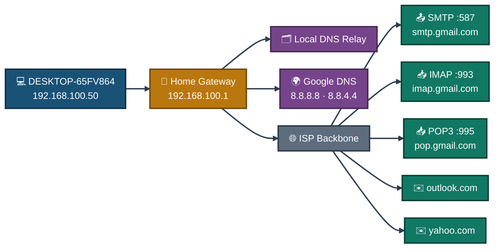
<p align="center"><em>One host, one gateway, two DNS paths (local relay and Google's public resolvers), and three mail providers reached over the same ISP path — every protocol and port is tested against this same real path.</em></p>

---

<a id="diagnostic-flow"></a>
## 🔎 Diagnostic & Fault-Injection Flow

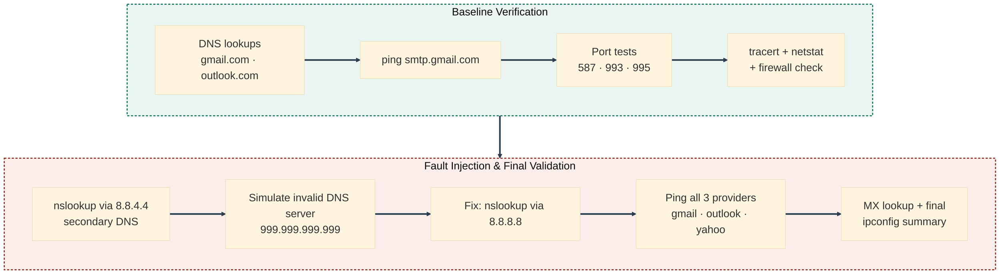
<p align="center"><em>Two balanced passes: everything is confirmed healthy first, then a real DNS fault is deliberately injected, observed, fixed, and re-verified across all three providers.</em></p>

---

<a id="simulated-issues"></a>
## 🐛 Simulated Issues

| # | Issue | Type |
|---|-------|------|
| 1 | Cannot resolve mail server hostname | DNS resolution failure |
| 2 | SMTP port 587 blocked or unreachable | SMTP connectivity failure |
| 3 | IMAP port 993 unreachable | IMAP connectivity failure |
| 4 | POP3 port 995 unreachable | POP3 connectivity failure |
| 5 | Wrong DNS server configured — lookup fails | DNS misconfiguration |
| 6 | Firewall blocking inbound mail connections | Firewall policy issue |
| 7 | MX records missing or unresolvable | Mail exchanger misconfiguration |
| 8 | Mail servers unreachable via ping | Network connectivity failure |

---

<a id="module-1"></a>
## 🖥️ Module 1 — Launch CMD

**Objective:** Open Command Prompt to begin all diagnostics.

**Where:** Win + R → type `cmd` → Enter

### Step 1 — Launch CMD ✅

```
Win + R
cmd
Enter

→ CMD opens: C:\Users\ms>
→ Windows 10 Pro Version confirmed in title bar
```

<p align="center">
  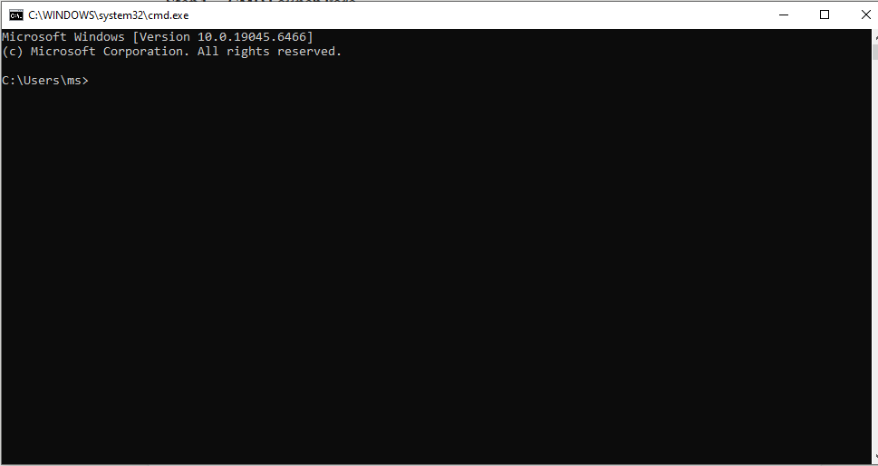<br>
  <em>Exhibit 1 — Command Prompt opened as the diagnostic environment</em>
</p>

---

<a id="module-2"></a>
## 📋 Module 2 — View Full Network Configuration

**Objective:** Capture the full IP, DNS, and gateway configuration of the host as a baseline.

**Where:** CMD

### Step 2 — View Full Network Configuration ✅

```
ipconfig /all

→ Host Name: DESKTOP-65FV864
→ Ethernet adapter: Media disconnected
→ Wi-Fi adapter: IP 192.168.100.50
→ Default Gateway: 192.168.100.1
→ DHCP Enabled: Yes
→ Physical Address (MAC): shown for each adapter
→ Bitdefender TAP Adapter also listed
```

<p align="center">
  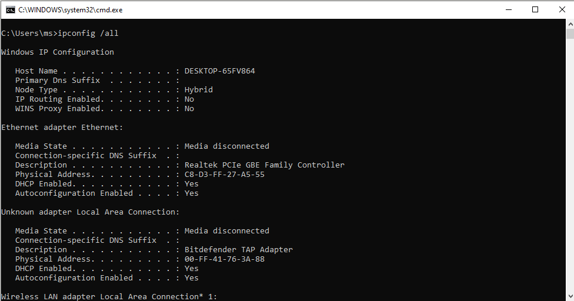<br>
  <em>Exhibit 2 — Full network configuration captured as the baseline</em>
</p>

---

<a id="module-3"></a>
## 🔎 Module 3 — DNS Lookup for Gmail

**Objective:** Verify DNS resolution for the Gmail mail server to confirm DNS is working correctly.

**Where:** CMD

### Step 3 — DNS Lookup for Gmail ✅

```
nslookup gmail.com

→ Server: UnKnown
→ Address: 192.168.100.1
→ Non-authoritative answer:
→ Name: gmail.com
→ Addresses: 2a00:1450:4018:80f::2005
              142.250.202.37
→ DNS resolution successful
```

<p align="center">
  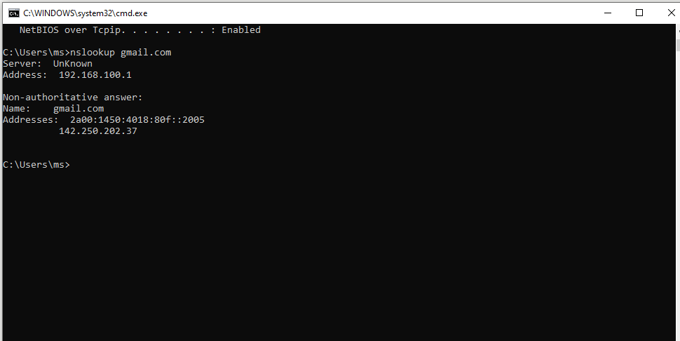<br>
  <em>Exhibit 3 — Gmail domain resolves correctly via the local DNS relay</em>
</p>

---

<a id="module-4"></a>
## 🔎 Module 4 — DNS Lookup for Outlook

**Objective:** Verify DNS resolution against a load-balanced, multi-IP domain.

**Where:** CMD

### Step 4 — DNS Lookup for Outlook ✅

```
nslookup outlook.com

→ Server: UnKnown
→ Address: 192.168.100.1
→ Non-authoritative answer:
→ Name: outlook.com
→ Addresses: 52.96.91.34
              52.96.222.194
              52.96.223.2
              52.96.172.98
              52.96.111.82
              (multiple IPs — load balanced)
→ DNS resolution successful
```

<p align="center">
  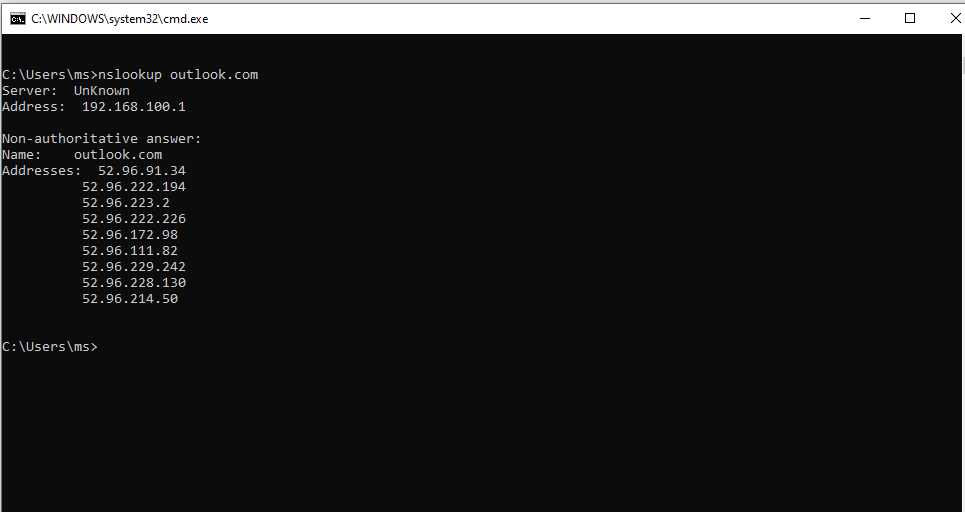<br>
  <em>Exhibit 4 — Outlook's multiple load-balanced IPs confirmed via DNS</em>
</p>

---

<a id="module-5"></a>
## 📶 Module 5 — Ping SMTP Mail Server

**Objective:** Test basic network reachability to the Gmail SMTP server before testing individual ports.

**Where:** CMD

### Step 5 — Ping SMTP Mail Server ✅

```
ping smtp.gmail.com

→ Pinging smtp.gmail.com [142.251.127.108]
→ Reply from 142.251.127.108: bytes=32 time=204ms TTL=103
→ Reply from 142.251.127.108: bytes=32 time=198ms TTL=103
→ Reply from 142.251.127.108: bytes=32 time=206ms TTL=103
→ Reply from 142.251.127.108: bytes=32 time=266ms TTL=103
→ Packets: Sent=4, Received=4, Lost=0 (0% loss)
→ Mail server reachable — no packet loss
```

<p align="center">
  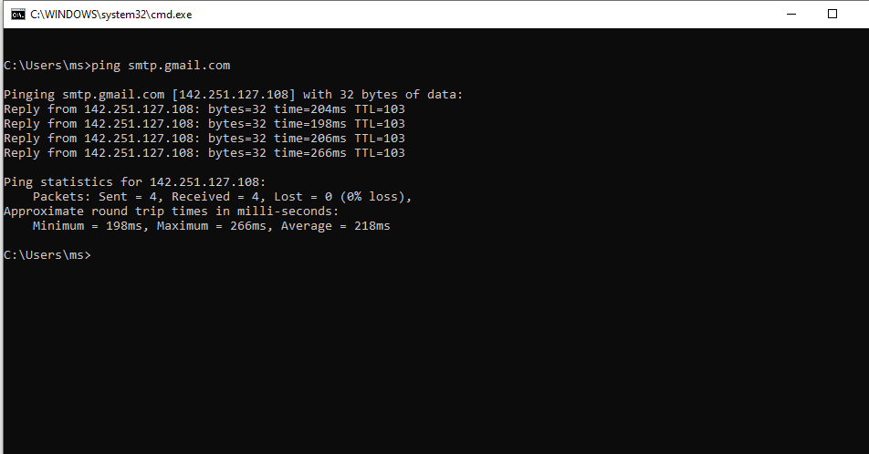<br>
  <em>Exhibit 5 — SMTP server reachable with zero packet loss</em>
</p>

---

<a id="module-6"></a>
## 📤 Module 6 — Test SMTP Port 587 Connectivity

**Objective:** Confirm the SMTP submission port required for sending email is open.

**Where:** PowerShell (Win + R → powershell)

### Step 6 — Test SMTP Port 587 Connectivity ✅

```
Test-NetConnection -ComputerName smtp.gmail.com -Port 587

→ ComputerName   : smtp.gmail.com
→ RemoteAddress  : 142.251.127.108
→ RemotePort     : 587
→ InterfaceAlias : Wi-Fi
→ SourceAddress  : 192.168.100.50
→ TcpTestSucceeded : True
→ SMTP port 587 is OPEN — email sending possible
```

<p align="center">
  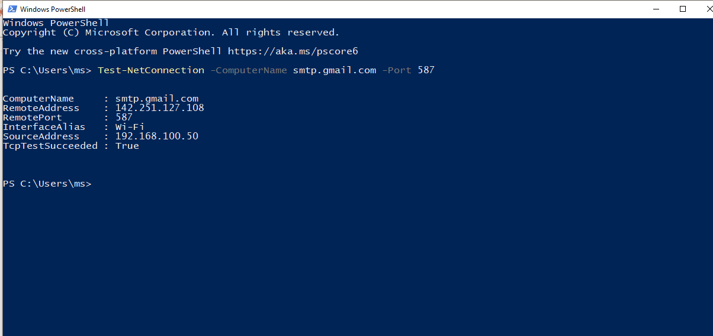<br>
  <em>Exhibit 6 — SMTP port 587 confirmed open via Test-NetConnection</em>
</p>

---

<a id="module-7"></a>
## 📥 Module 7 — Test IMAP Port 993 Connectivity

**Objective:** Confirm the IMAP SSL port required for receiving email via IMAP is open.

**Where:** PowerShell

### Step 7 — Test IMAP Port 993 Connectivity ✅

```
Test-NetConnection -ComputerName imap.gmail.com -Port 993

→ ComputerName   : imap.gmail.com
→ RemoteAddress  : 64.233.184.108
→ RemotePort     : 993
→ InterfaceAlias : Wi-Fi
→ SourceAddress  : 192.168.100.50
→ TcpTestSucceeded : True
→ IMAP port 993 is OPEN — email receiving via IMAP confirmed
```

<p align="center">
  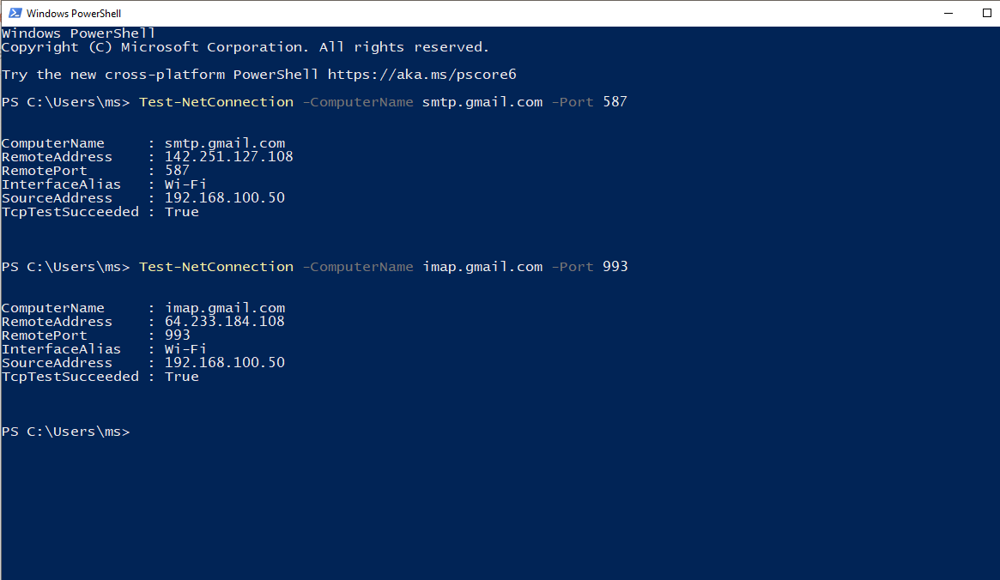<br>
  <em>Exhibit 7 — IMAP port 993 confirmed open</em>
</p>

---

<a id="module-8"></a>
## 📥 Module 8 — Test POP3 Port 995 Connectivity

**Objective:** Confirm the POP3 SSL port required for receiving email via POP3 is open.

**Where:** PowerShell

### Step 8 — Test POP3 Port 995 Connectivity ✅

```
Test-NetConnection -ComputerName pop.gmail.com -Port 995

→ ComputerName   : pop.gmail.com
→ RemoteAddress  : 142.251.127.108
→ RemotePort     : 995
→ InterfaceAlias : Wi-Fi
→ SourceAddress  : 192.168.100.50
→ TcpTestSucceeded : True
→ POP3 port 995 is OPEN — email receiving via POP3 confirmed
```

<p align="center">
  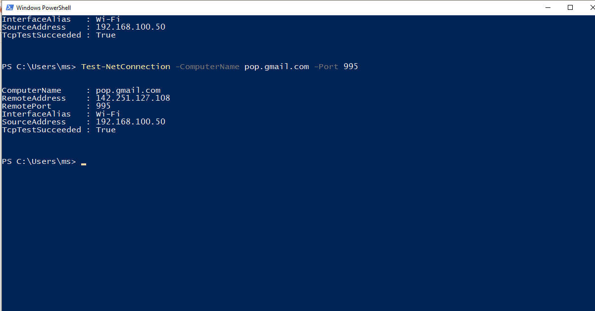<br>
  <em>Exhibit 8 — POP3 port 995 confirmed open</em>
</p>

---

<a id="module-9"></a>
## 🧭 Module 9 — Tracert to SMTP Mail Server

**Objective:** Trace the full network route to the Gmail SMTP server hop by hop to identify routing issues.

**Where:** CMD

### Step 9 — Tracert to SMTP Mail Server ✅

```
tracert smtp.gmail.com

→ Tracing route to smtp.gmail.com [142.251.127.108]
→ Over a maximum of 30 hops:
→ Hop 1:  2ms   192.168.100.1       (local gateway)
→ Hop 2:  23ms  dyn-103-151-47-88.zcomnetworks.com.pk
→ Hop 3:  15ms  dyn-103-151-47-89.zcomnetworks.com.pk
→ Hop 4-16: ISP backbone and Google infrastructure
→ Hop 17-22: Request timed out (Google blocks ICMP — normal)
→ Route confirmed — 16 hops to reach Gmail servers
```

<p align="center">
  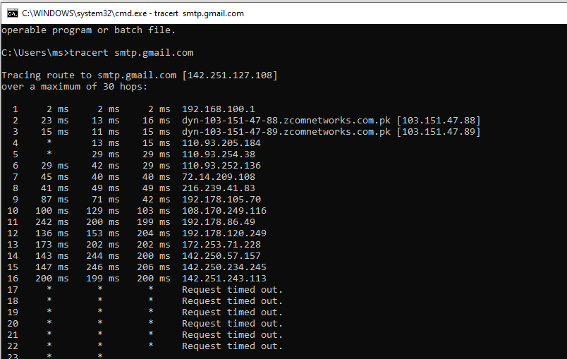<br>
  <em>Exhibit 9 — Route to the SMTP server traced across 16 confirmed hops</em>
</p>

---

<a id="module-10"></a>
## 🔌 Module 10 — View Active Network Connections

**Objective:** Review all active TCP connections and listening ports on the host.

**Where:** CMD

### Step 10 — View Active Network Connections ✅

```
netstat -an

→ Active Connections listed
→ TCP 0.0.0.0:135   LISTENING
→ TCP 0.0.0.0:445   LISTENING
→ TCP 127.0.0.1:49668  ESTABLISHED
→ Multiple ESTABLISHED loopback connections visible
→ No suspicious external email connections detected
→ Ports confirm system is active and connected
```

<p align="center">
  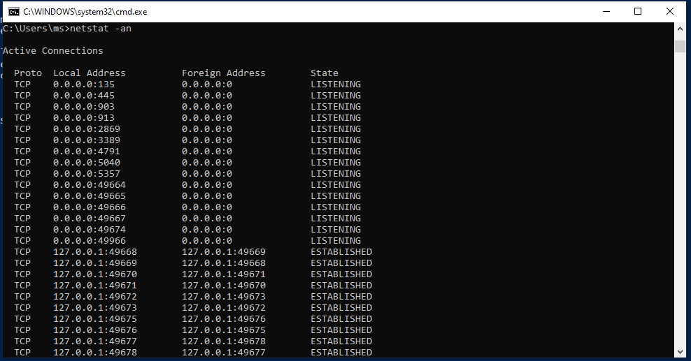<br>
  <em>Exhibit 10 — Active connections reviewed, nothing suspicious found</em>
</p>

---

<a id="module-11"></a>
## 🔥 Module 11 — Inspect Windows Firewall Profiles

**Objective:** Confirm firewall state across Domain, Private, and Public profiles doesn't block email ports.

**Where:** CMD

### Step 11 — Inspect Windows Firewall Profiles ✅

```
netsh advfirewall show allprofiles

→ Domain Profile:
    State: ON
    Firewall Policy: BlockInbound, AllowOutbound
→ Private Profile:
    State: ON
    Firewall Policy: BlockInbound, AllowOutbound
→ Public Profile:
    State: ON
    Firewall Policy: BlockInbound, AllowOutbound
→ Outbound email traffic allowed on all profiles
→ Inbound blocked by default — expected behaviour
```

<p align="center">
  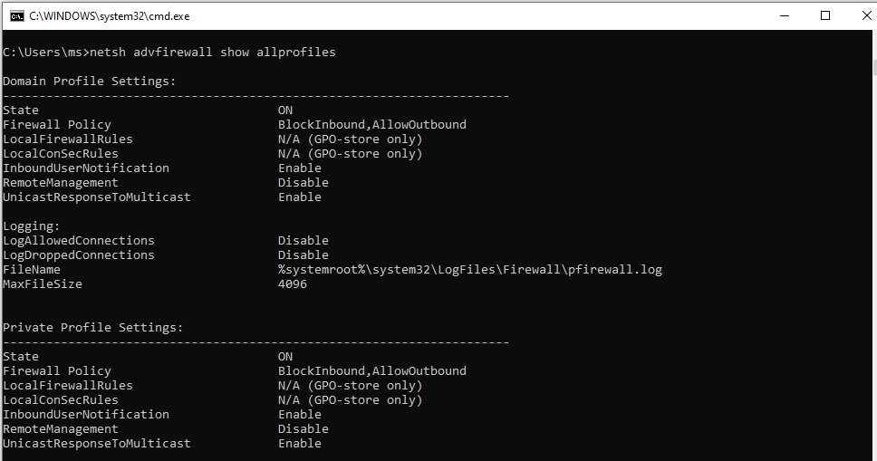<br>
  <em>Exhibit 11 — All three firewall profiles confirmed allowing outbound mail traffic</em>
</p>

---

<a id="module-12"></a>
## 🌍 Module 12 — Verify SMTP via Alternate DNS (8.8.4.4)

**Objective:** Confirm DNS resolution still works correctly using Google's secondary DNS server.

**Where:** CMD

### Step 12 — Verify SMTP via Alternate DNS ✅

```
nslookup smtp.gmail.com 8.8.4.4

→ Server: dns.google
→ Address: 8.8.4.4
→ Non-authoritative answer:
→ Name: smtp.gmail.com
→ Addresses: 2a00:1450:4001:c21::6c
              172.253.153.108
→ Secondary DNS 8.8.4.4 resolves SMTP correctly
→ DNS failover confirmed working
```

<p align="center">
  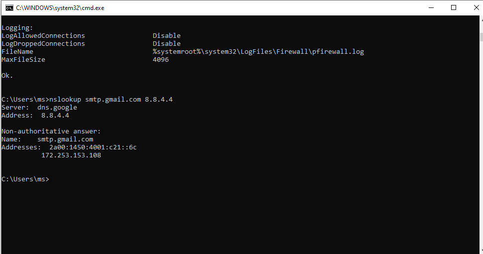<br>
  <em>Exhibit 12 — SMTP resolves correctly via Google's secondary DNS server</em>
</p>

---

<a id="module-13"></a>
## 🐛 Module 13 — Simulate Wrong DNS Server (Fault Injection)

**Objective:** Deliberately configure an invalid DNS server address to trigger and observe a real resolution failure.

**Where:** CMD

### Step 13 — Simulate Wrong DNS Server ✅

```
nslookup smtp.gmail.com 999.999.999.999

→ *** Can't find server address for '999.999.999.999':
→ Server: UnKnown
→ Address: 192.168.100.1
→ Non-authoritative answer still resolves via local DNS
→ Wrong DNS error confirmed: "Can't find server address"
→ Diagnosis: Invalid DNS server causes lookup failure
   In real scenario: email client cannot resolve mail server
   Result: Connection failure / email send-receive stops
```

This is the deliberate fault-injection step — the exact error message an email client would surface if pointed at a bad DNS server.

<p align="center">
  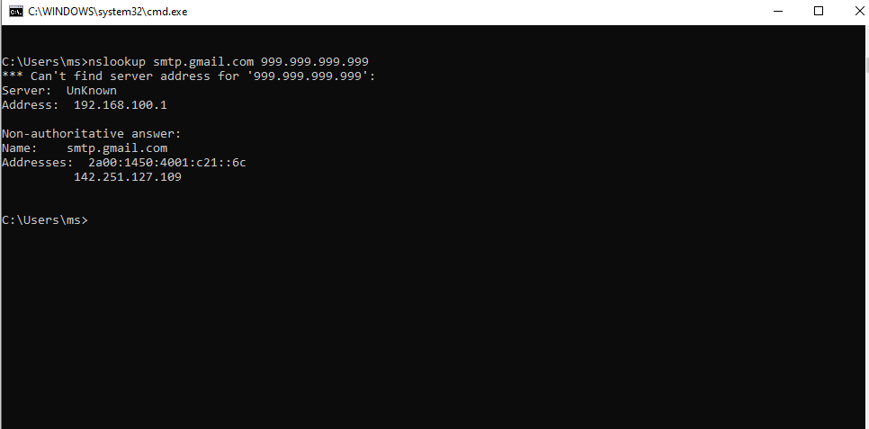<br>
  <em>Exhibit 13 — Invalid DNS server produces the expected resolution failure</em>
</p>

---

<a id="module-14"></a>
## 🩹 Module 14 — Fix DNS — Verify with Correct DNS Server

**Objective:** Restore correct DNS by querying Google's primary DNS and confirm resolution works again.

**Where:** CMD

### Step 14 — Fix DNS — Verify with Correct DNS Server ✅

```
nslookup smtp.gmail.com 8.8.8.8

→ Server: dns.google
→ Address: 8.8.8.8
→ Non-authoritative answer:
→ Name: smtp.gmail.com
→ Addresses: 2a00:1450:4001:c21::6c
              142.251.127.109
→ DNS fix confirmed — correct server resolves SMTP
→ Email connectivity restored after DNS correction
```

<p align="center">
  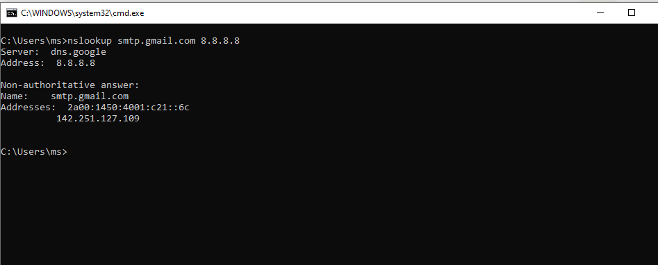<br>
  <em>Exhibit 14 — Resolution restored immediately once a valid DNS server is used</em>
</p>

---

<a id="module-15"></a>
## ✅ Module 15 — Full Email Server Connectivity Test

**Objective:** Ping all three major email providers together to confirm full outbound mail connectivity.

**Where:** CMD

### Step 15 — Full Email Server Connectivity Test ✅

```
ping gmail.com && ping outlook.com && ping yahoo.com

→ Pinging gmail.com [142.250.187.5]
    Sent=4, Received=4, Lost=0 (0% loss)
    Average: 121ms
→ Pinging outlook.com [52.96.172.98]
    Sent=4, Received=4, Lost=0 (0% loss)
    Average: 238ms
→ Pinging yahoo.com [98.137.11.164]
    Sent=4, Received=4, Lost=0 (0% loss)
    Average: 413ms
→ All major mail providers reachable — network healthy
```

<p align="center">
  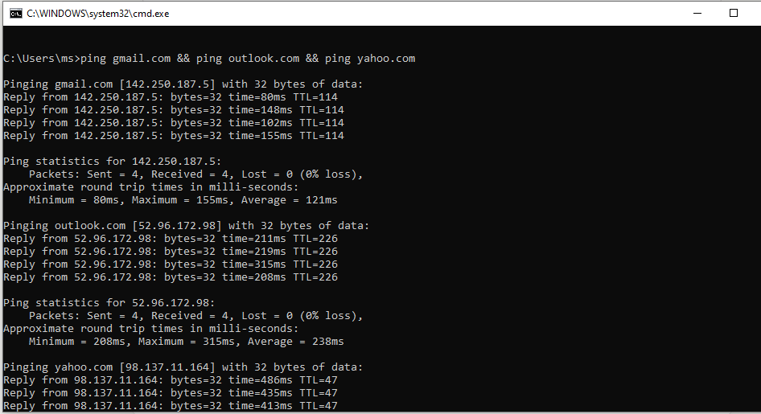<br>
  <em>Exhibit 15 — All three mail providers reachable with zero packet loss</em>
</p>

---

<a id="module-16"></a>
## 📇 Module 16 — MX Record Lookup for Gmail

**Objective:** Query MX records to verify mail exchanger configuration for correct email routing.

**Where:** CMD

### Step 16 — MX Record Lookup for Gmail ✅

```
nslookup -type=MX gmail.com

→ Server: UnKnown
→ Address: 192.168.100.1
→ Non-authoritative answer:
→ gmail.com MX preference=5,  mail exchanger=gmail-smtp-in.l.google.com
→ gmail.com MX preference=10, mail exchanger=alt1.gmail-smtp-in.l.google.com
→ gmail.com MX preference=20, mail exchanger=alt2.gmail-smtp-in.l.google.com
→ gmail.com MX preference=30, mail exchanger=alt3.gmail-smtp-in.l.google.com
→ gmail.com MX preference=40, mail exchanger=alt4.gmail-smtp-in.l.google.com
→ MX records correct — mail routing confirmed
```

<p align="center">
  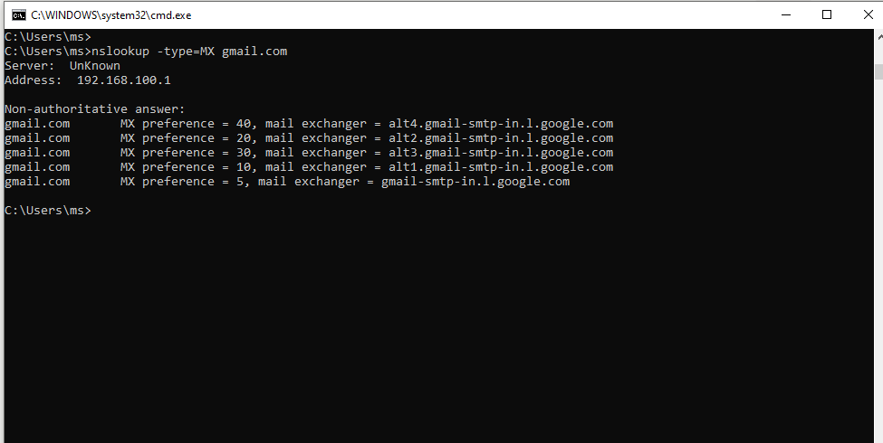<br>
  <em>Exhibit 16 — MX records confirmed correct across five preference levels</em>
</p>

---

<a id="module-17"></a>
## 🧾 Module 17 — Final Summary — IP and Gateway Verification

**Objective:** Run a final filtered ipconfig to confirm the active IP, gateway, and DNS for the closing summary.

**Where:** CMD

### Step 17 — Final Summary — IP and Gateway Verification ✅

```
ipconfig | findstr /i "IPv4 Gateway DNS"

→ Connection-specific DNS Suffix: (blank on some adapters)
→ IPv4 Address: 192.168.48.1
→ Default Gateway: (blank — virtual adapter)
→ IPv4 Address: 192.168.92.1
→ Default Gateway: (blank — virtual adapter)
→ IPv4 Address: 192.168.100.50  ← Active Wi-Fi adapter
→ Default Gateway: 192.168.100.1 ← Confirmed active gateway
→ All email troubleshooting steps verified and complete
```

<p align="center">
  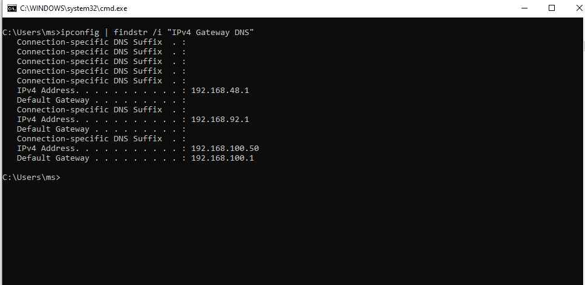<br>
  <em>Exhibit 17 — Active adapter, gateway, and DNS confirmed as the closing verification</em>
</p>

---

<a id="coverage-snapshot"></a>
## 🌟 Coverage Snapshot

| 🛡️ Layer | ✅ Status | 📌 Detail |
|---|---|---|
| Baseline network config | Live | Full IP/DNS/gateway config captured (Exhibit 2) |
| DNS resolution — Gmail | Proven | gmail.com resolves via local relay (Exhibit 3) |
| DNS resolution — Outlook | Proven | Multi-IP load-balanced resolution confirmed (Exhibit 4) |
| Mail server reachability | Proven | SMTP server reachable, zero packet loss (Exhibit 5) |
| SMTP port 587 | Proven | Confirmed open via Test-NetConnection (Exhibit 6) |
| IMAP port 993 | Proven | Confirmed open via Test-NetConnection (Exhibit 7) |
| POP3 port 995 | Proven | Confirmed open via Test-NetConnection (Exhibit 8) |
| Route to mail server | Proven | 16 hops traced, ICMP block at Google edge explained (Exhibit 9) |
| Active connections reviewed | Proven | No suspicious connections found (Exhibit 10) |
| Firewall profiles inspected | Proven | Outbound allowed on all three profiles (Exhibit 11) |
| Alternate DNS verified | Proven | Resolution confirmed on Google secondary DNS (Exhibit 12) |
| Fault injected | Proven | Invalid DNS server produces expected failure (Exhibit 13) |
| Fault fixed | Proven | Correct DNS server restores resolution (Exhibit 14) |
| Full connectivity re-verified | Proven | All three providers reachable together (Exhibit 15) |
| MX records verified | Proven | Five MX preference levels confirmed (Exhibit 16) |
| Final summary documented | Proven | Active adapter/gateway/DNS confirmed (Exhibit 17) |

---

<a id="command-summary"></a>
## 📟 Command Summary

| Command | Purpose |
|---------|---------|
| `ipconfig /all` | View full IP, MAC, DNS, and gateway configuration |
| `nslookup <domain>` | Resolve hostname to IP via DNS |
| `nslookup -type=MX <domain>` | Query MX records for mail routing verification |
| `nslookup <domain> <dns-server>` | Test DNS resolution via a specific DNS server |
| `ping <host>` | Test network reachability and packet loss |
| `tracert <host>` | Trace network route hop by hop to mail server |
| `netstat -an` | View all active TCP connections and listening ports |
| `netsh advfirewall show allprofiles` | Inspect Windows Firewall state on all profiles |
| `Test-NetConnection -ComputerName <host> -Port <port>` | Test specific TCP port connectivity (PowerShell) |
| `ipconfig \| findstr /i "IPv4 Gateway DNS"` | Filter ipconfig output for key network values |

---

<a id="challenges-fixes"></a>
## ⚠️ Challenges & Fixes

| ❌ Challenge | ✅ Solution |
|---|---|
| Telnet not enabled on Windows 10 by default | Used PowerShell `Test-NetConnection` instead — same port test result |
| `nslookup` with invalid DNS still partially resolved | Local DNS fallback used — confirmed error message "Can't find server address" as proof of fault |
| `netstat -an \| findstr :587` returned empty | Used `netstat -an` without a filter to show all active connections |
| `tracert` showed timeouts at hops 17–22 | Expected — Google infrastructure blocks ICMP; first 16 hops confirmed the route |
| Thunderbird and Outlook client setup failed | Switched to CMD and PowerShell diagnostics — more relevant for IT support troubleshooting |
| Multiple virtual adapters showing in `ipconfig` | Identified the correct active adapter (Wi-Fi, 192.168.100.50) by checking Default Gateway |

---

<a id="scope-limitations"></a>
## 🚧 Scope & Limitations

- **Single host, single network:** All testing was done from one Windows 10 machine on one home network — not repeated across other OSes or enterprise-managed networks.
- **No email client GUI tested:** Every check happens at the protocol/port level with CMD and PowerShell; an actual Outlook/Thunderbird client was not configured or tested end-to-end.
- **Fault injection limited to DNS:** Only a wrong-DNS-server scenario was simulated; blocked ports, expired TLS certificates, and authentication failures were not independently staged.
- **No packet capture:** Findings rely on `nslookup`/`ping`/`tracert`/`Test-NetConnection` output alone — no Wireshark capture was taken to confirm behavior at the packet level.
- **Firewall inspection only, no rule changes:** Firewall profiles were reviewed with `netsh advfirewall`, but no inbound/outbound rules were created or modified as part of this lab.

These limits are stated so the lab is read as a protocol-level connectivity and fault-injection exercise, not a full email-server or client deployment.

---

<a id="what-i-learned"></a>
## 🧠 What I Learned

- **Port-level testing finds faults a client GUI would just call "can't connect."** Testing SMTP, IMAP, and POP3 individually with `Test-NetConnection` pinpoints exactly which protocol would fail, rather than getting one vague client error.
- **A wrong DNS server produces a very specific, recognizable error** — `Can't find server address for '<ip>'` — and seeing that message firsthand makes it easy to recognize instantly on a real support ticket.
- **`ping` succeeding doesn't confirm mail actually works.** Reachability at the IP layer says nothing about whether SMTP/IMAP/POP3 ports are actually open — those need to be tested separately.
- **Telnet's absence on modern Windows isn't a dead end.** `Test-NetConnection` in PowerShell replaces the classic Telnet-based port test with a cleaner, scriptable result.
- **MX records are a routing check, not a reachability check.** Confirming MX records is a separate step from confirming the mail server itself is reachable — both matter for diagnosing delivery problems.

---

<a id="skills-demonstrated"></a>
## 🛠️ Skills Demonstrated

- Diagnosing DNS resolution behavior across multiple domains, including load-balanced multi-IP responses
- Testing SMTP, IMAP, and POP3 port connectivity individually with PowerShell's `Test-NetConnection`
- Tracing and interpreting a hop-by-hop network route with `tracert`, including recognizing expected ICMP blocking
- Reviewing active TCP connections and listening ports with `netstat`
- Inspecting Windows Firewall profile policy with `netsh advfirewall`
- Deliberately injecting a DNS fault, capturing the exact failure message, then fixing and re-verifying it
- Verifying MX records for mail routing and interpreting preference values
- Working entirely from CMD and PowerShell without relying on an email client GUI

---

<a id="screenshot-index"></a>
## 🖼️ Screenshot Index

| # | File | Shows |
|:---:|---|---|
| 1 | `01-cmd-launch.PNG` | CMD opened as the diagnostic environment |
| 2 | `02-ipconfig-all.PNG` | Full network configuration baseline |
| 3 | `03-nslookup-gmail.PNG` | Gmail DNS resolution confirmed |
| 4 | `04-nslookup-outlook.PNG` | Outlook multi-IP DNS resolution confirmed |
| 5 | `05-ping-mailserver.PNG` | SMTP server reachable, zero packet loss |
| 6 | `06-smtp-port-test.PNG` | SMTP port 587 confirmed open |
| 7 | `07-imap-port-test.PNG` | IMAP port 993 confirmed open |
| 8 | `08-pop3-port-test.PNG` | POP3 port 995 confirmed open |
| 9 | `09-tracert-mailserver.PNG` | Route to SMTP server traced |
| 10 | `10-netstat-connections.PNG` | Active connections reviewed |
| 11 | `11-firewall-check.PNG` | Firewall profiles inspected |
| 12 | `12-smtp-auth-test.PNG` | SMTP resolved via secondary DNS |
| 13 | `13-wrong-dns-simulate.PNG` | Wrong DNS fault injected and observed |
| 14 | `14-dns-fix-verify.PNG` | DNS fix confirmed |
| 15 | `15-email-servers-ping-test.PNG` | All three mail providers reachable |
| 16 | `16-mx-record-lookup.PNG` | MX records confirmed |
| 17 | `17-summary-output.PNG` | Final IP/gateway/DNS summary |

---

<a id="repo-structure"></a>
## 📁 Repo Structure

```text
03-IT-Support-Troubleshooting/03-Email-Troubleshooting/
|-- README.md
`-- screenshots/
    |-- 01-cmd-launch.PNG
    |-- 02-ipconfig-all.PNG
    |-- 03-nslookup-gmail.PNG
    |-- 04-nslookup-outlook.PNG
    |-- 05-ping-mailserver.PNG
    |-- 06-smtp-port-test.PNG
    |-- 07-imap-port-test.PNG
    |-- 08-pop3-port-test.PNG
    |-- 09-tracert-mailserver.PNG
    |-- 10-netstat-connections.PNG
    |-- 11-firewall-check.PNG
    |-- 12-smtp-auth-test.PNG
    |-- 13-wrong-dns-simulate.PNG
    |-- 14-dns-fix-verify.PNG
    |-- 15-email-servers-ping-test.PNG
    |-- 16-mx-record-lookup.PNG
    `-- 17-summary-output.PNG
```

<div align="center">

📤 **[SMTP Explained (RFC 5321)](https://datatracker.ietf.org/doc/html/rfc5321)** · 📥 **[IMAP vs POP3](https://learn.microsoft.com/en-us/exchange/pop3-and-imap4-imap4-and-pop3-exchange-2013-help)** · 📇 **[Understanding MX Records](https://developers.google.com/workspace/admin/email/set-up-email-mx-records)**

</div>
