<div align="center">

# 🌐 Gateway & IP Conflict Resolution

**IT Support & Troubleshooting Lab 04 — Cisco Networking Lab Portfolio**

Three Layer 3 Host Faults Staged and Fixed on One LAN — APIPA from an Unreachable DHCP Server, a Duplicate Static IP Caught with ARP, and a Missing Default Gateway Diagnosed and Restored (Cisco Packet Tracer + Windows CMD)


One router, one switch, and four PCs are used to stage three of the most common Layer 3 host-configuration failures one after another: a PC falling back to APIPA when the DHCP server (the router) goes unreachable, two PCs deliberately given the same static IP and caught through ARP table inconsistency rather than by ping alone, and a PC left without a default gateway to reproduce the classic "LAN works, internet doesn't" symptom. Each fault is diagnosed with the actual command output before being fixed and re-verified.

</div>

---

## 📑 Table of Contents

1. [At a Glance](#at-a-glance)
2. [Project Background](#project-background)
3. [Tools & Technologies](#tools-technologies)
4. [Topology](#topology)
5. [IP Design](#ip-design)
6. [Fault & Fix Flow](#fault-fix-flow)
7. [Simulated Issues](#simulated-issues)
8. [Module 1 — Build the Topology](#module-1)
9. [Module 2 — Configure Router as Gateway & DHCP Server](#module-2)
10. [Module 3 — Verify PC0 and PC1 Get DHCP IPs](#module-3)
11. [Module 4 — Simulate APIPA](#module-4)
12. [Module 5 — Diagnose APIPA Issue](#module-5)
13. [Module 6 — Fix APIPA Issue](#module-6)
14. [Module 7 — Simulate Duplicate IP Conflict](#module-7)
15. [Module 8 — Observe Duplicate IP Symptoms](#module-8)
16. [Module 9 — Diagnose Duplicate IP with ARP](#module-9)
17. [Module 10 — Fix Duplicate IP Conflict](#module-10)
18. [Module 11 — Simulate Missing Default Gateway](#module-11)
19. [Module 12 — Diagnose Missing Default Gateway](#module-12)
20. [Module 13 — Fix Missing Default Gateway](#module-13)
21. [Module 14 — Verify ARP Table is Clean](#module-14)
22. [Module 15 — Full Connectivity Test](#module-15)
23. [Module 16 — Router Verification](#module-16)
24. [Module 17 — Save Configuration](#module-17)
25. [Coverage Snapshot](#coverage-snapshot)
26. [Command Summary](#command-summary)
27. [Challenges & Fixes](#challenges-fixes)
28. [Scope & Limitations](#scope-limitations)
29. [What I Learned](#what-i-learned)
30. [Skills Demonstrated](#skills-demonstrated)
31. [Screenshot Index](#screenshot-index)
32. [Repo Structure](#repo-structure)

---

<a id="at-a-glance"></a>
## 📊 At a Glance

<div align="center">

| 🚪 Routers | 🔀 Switches | 🖥️ PCs | 🐛 Faults Staged | 🩹 Fixes Verified | 🖼️ Screenshots |
|:---:|:---:|:---:|:---:|:---:|:---:|
| **1** | **1** | **4** | **3 (APIPA, Duplicate IP, Missing Gateway)** | **3** | **17** |

</div>

---

<a id="project-background"></a>
## 📖 Project Background

This lab builds one flat LAN and then breaks it three different ways, one host-configuration fault at a time, rather than testing them all at once. First the router's DHCP service is made unreachable to force a PC into APIPA fallback. Once that's fixed, two PCs are deliberately given the identical static IP so the conflict has to be caught through ARP table inconsistency, not just a failed ping. Once that's resolved, a PC is left without a default gateway to reproduce the classic symptom where local traffic works fine but nothing routes out. Each fault is diagnosed from real command output — `ipconfig /all`, `arp -a`, `ping` — before being fixed and re-verified.

| Module | Focus |
|---|---|
| 🏗️ **Module 1 — Build the Topology** | Wire the router, switch, and four PCs |
| ⚙️ **Module 2 — Configure Router as Gateway & DHCP** | Stand up the LAN's addressing service |
| ✅ **Module 3 — Verify DHCP Works** | Confirm PC0 and PC1 lease IPs correctly |
| 🐛 **Module 4 — Simulate APIPA** | Shut down the router interface to break DHCP |
| 🔎 **Module 5 — Diagnose APIPA Issue** | Confirm the fallback address and gateway loss |
| 🩹 **Module 6 — Fix APIPA Issue** | Bring the interface back up and renew |
| 🐛 **Module 7 — Simulate Duplicate IP Conflict** | Assign the same static IP to two PCs |
| 👀 **Module 8 — Observe Duplicate IP Symptoms** | Watch the unpredictable connectivity behavior |
| 🔎 **Module 9 — Diagnose Duplicate IP with ARP** | Catch the conflict via MAC address flipping |
| 🩹 **Module 10 — Fix Duplicate IP Conflict** | Reassign a unique IP |
| 🐛 **Module 11 — Simulate Missing Default Gateway** | Leave the gateway field blank |
| 🔎 **Module 12 — Diagnose Missing Default Gateway** | Confirm LAN works, WAN doesn't |
| 🩹 **Module 13 — Fix Missing Default Gateway** | Restore gateway via DHCP |
| 🧹 **Module 14 — Verify ARP Table is Clean** | Confirm no MAC flipping remains anywhere |
| 🧾 **Module 15 — Full Connectivity Test** | Ping every host to confirm overall health |
| 📋 **Module 16 — Router Verification** | Confirm interfaces, ARP, and DHCP bindings |
| 💾 **Module 17 — Save Configuration** | Persist the final working config |

> [!NOTE]
> Packet Tracer shows a released/failed DHCP client as `0.0.0.0` rather than a real `169.254.x.x` APIPA address. Both indicate the same underlying fault — the DHCP server was unreachable — so this is documented as expected simulator behavior, not a separate bug.

---

<a id="tools-technologies"></a>
## 🛠️ Tools & Technologies

| Tool | Purpose |
|------|---------|
| 🖥️ Cisco Packet Tracer | Network topology simulation |
| 🚪 Router 2911 | Default gateway, DHCP server |
| 🔀 Switch 2960 | LAN switching |
| ⌨️ Windows CMD | Host-side diagnostics |
| 📋 `ipconfig` | View and release/renew IP configuration |
| 📶 `ping` | Test connectivity and isolate failures |
| 🔎 `arp -a` | View the ARP table for duplicate IP detection |
| 🔁 DHCP | Automatic IP assignment |
| 🧷 Static IP | Manual IP configuration for conflict simulation |

---

<a id="topology"></a>
## 🗺️ Topology

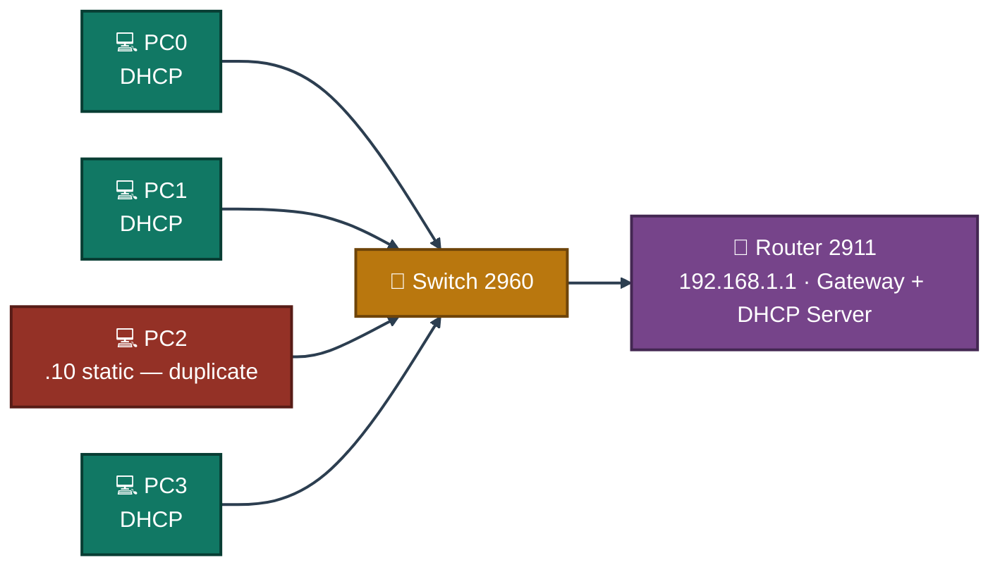
<p align="center"><em>Four PCs on one switch behind one router — PC2 starts with the static IP that later collides with PC3's, everything else leases from DHCP.</em></p>

---

<a id="ip-design"></a>
## 🗂️ IP Design

| Device | IP Address | Mask | Gateway |
|--------|-----------|------|---------|
| Router G0/0 | 192.168.1.1 | 255.255.255.0 | — |
| PC0 | DHCP | auto | 192.168.1.1 |
| PC1 | DHCP | auto | 192.168.1.1 |
| PC2 | 192.168.1.10 (static — duplicate) | 255.255.255.0 | 192.168.1.1 |
| PC3 | DHCP | auto | 192.168.1.1 |

**Physical Connections**

| Device | Switch Port | Cable |
|--------|-------------|-------|
| PC0 | Fa0/1 | Copper Straight-Through |
| PC1 | Fa0/2 | Copper Straight-Through |
| PC2 | Fa0/3 | Copper Straight-Through |
| PC3 | Fa0/4 | Copper Straight-Through |
| Router G0/0 | Fa0/24 | Copper Straight-Through |

---

<a id="fault-fix-flow"></a>
## 🔧 Fault & Fix Flow

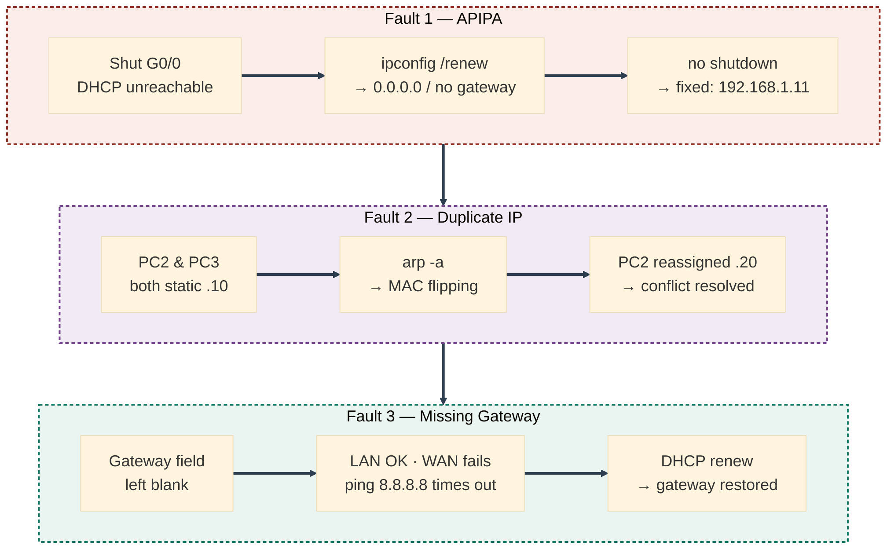
<p align="center"><em>Three faults, staged and fixed one at a time on the same LAN — each row is diagnosed with real command output before moving to the next.</em></p>

---

<a id="simulated-issues"></a>
## 🐛 Simulated Issues

| # | Issue | Type |
|---|-------|------|
| 1 | PC gets 0.0.0.0 / DHCP request failed | APIPA — DHCP unreachable |
| 2 | Two PCs share same IP 192.168.1.10 | Duplicate IP conflict |
| 3 | PC can reach LAN but not internet | Missing default gateway |
| 4 | ARP table shows duplicate MAC mapping | ARP conflict from duplicate IP |

---

<a id="module-1"></a>
## 🏗️ Module 1 — Build the Topology

**Objective:** Wire the router, switch, and four PCs per the topology and connections tables above.

### Step 1 — Build the Topology ✅

```
No CLI commands in this step — physical wiring done in Packet Tracer GUI.
Drag devices onto canvas and connect cables per the topology table above.
```

<p align="center">
  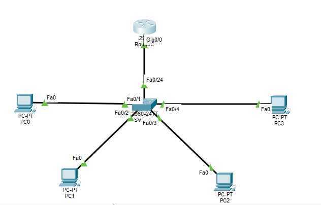<br>
  <em>Exhibit 1 — Router, switch, and four PCs wired and ready</em>
</p>

---

<a id="module-2"></a>
## ⚙️ Module 2 — Configure Router as Gateway & DHCP Server

**Objective:** Set up the router's LAN interface and DHCP pool so hosts can lease addresses automatically.

### Step 2 — Configure Router as Gateway & DHCP Server ✅

```
enable
configure terminal
interface g0/0
ip address 192.168.1.1 255.255.255.0
no shutdown
exit
ip dhcp excluded-address 192.168.1.1 192.168.1.10
ip dhcp pool LAN
network 192.168.1.0 255.255.255.0
default-router 192.168.1.1
dns-server 8.8.8.8
exit
show ip interface brief
show ip dhcp pool
```

<p align="center">
  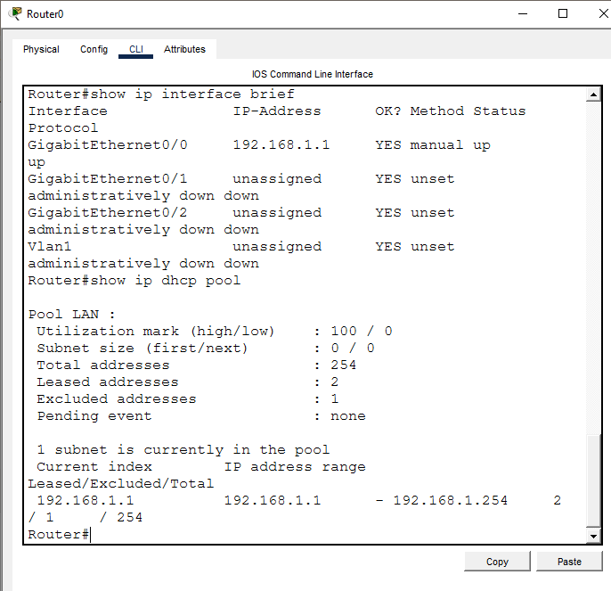<br>
  <em>Exhibit 2 — Router configured as both the gateway and the DHCP server for the LAN</em>
</p>

---

<a id="module-3"></a>
## ✅ Module 3 — Verify PC0 and PC1 Get DHCP IPs

**Objective:** Confirm DHCP is working correctly before introducing any faults.

### Step 3 — Verify PC0 and PC1 Get DHCP IPs ✅

```
PC0 → Desktop → IP Configuration → DHCP
PC1 → Desktop → IP Configuration → DHCP

PC0> ipconfig /renew
PC0> ipconfig
```

<p align="center">
  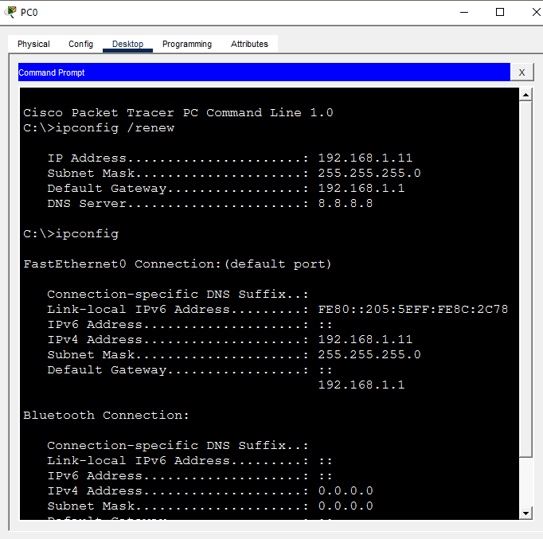<br>
  <em>Exhibit 3 — Both PCs confirmed leasing valid DHCP addresses before any fault is introduced</em>
</p>

---

<a id="module-4"></a>
## 🐛 Module 4 — Simulate APIPA (Shutdown Router Interface)

**Objective:** Make the DHCP server unreachable so a PC falls back to APIPA.

### Step 4 — Simulate APIPA ✅

```
enable
configure terminal
interface g0/0
shutdown
exit

PC0> ipconfig /release
PC0> ipconfig /renew
PC0> ipconfig

→ Result: IP 0.0.0.0 — DHCP request failed
   (Packet Tracer shows 0.0.0.0 instead of 169.254.x.x
    but both mean the same — DHCP server unreachable)
```

<p align="center">
  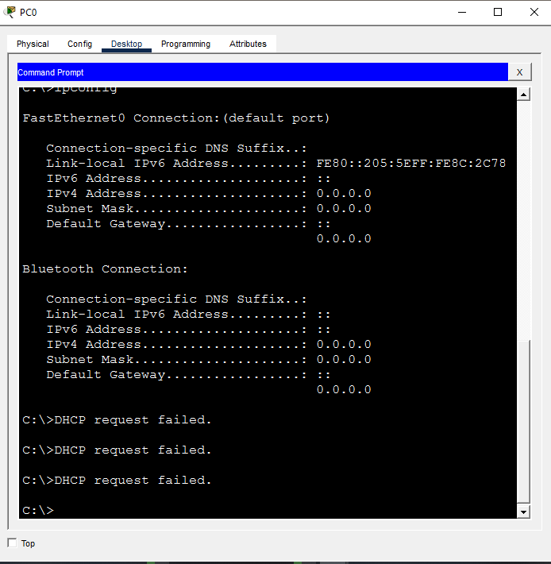<br>
  <em>Exhibit 4 — PC0 fails to lease an address once the router's DHCP service goes unreachable</em>
</p>

---

<a id="module-5"></a>
## 🔎 Module 5 — Diagnose APIPA Issue

**Objective:** Confirm exactly why the PC failed to get a valid IP.

### Step 5 — Diagnose APIPA Issue ✅

```
PC0> ipconfig /all
→ Autoconfiguration IPv4 Address: 169.254.x.x
→ Default Gateway: blank
→ DHCP request failed

PC0> ping 192.168.1.1
→ Request timed out — gateway unreachable
```

<p align="center">
  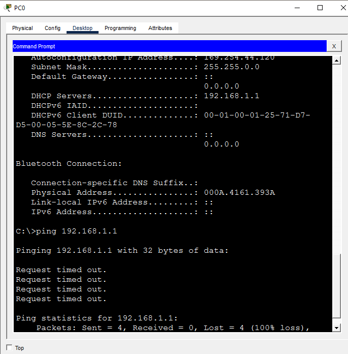<br>
  <em>Exhibit 5 — Missing gateway and failed DHCP request confirmed as the cause</em>
</p>

---

<a id="module-6"></a>
## 🩹 Module 6 — Fix APIPA Issue

**Objective:** Restore the router interface and renew the lease.

### Step 6 — Fix APIPA Issue ✅

```
enable
configure terminal
interface g0/0
no shutdown
exit

PC0> ipconfig /release
PC0> ipconfig /renew
PC0> ipconfig

→ IP: 192.168.1.11
→ Mask: 255.255.255.0
→ Gateway: 192.168.1.1
```

<p align="center">
  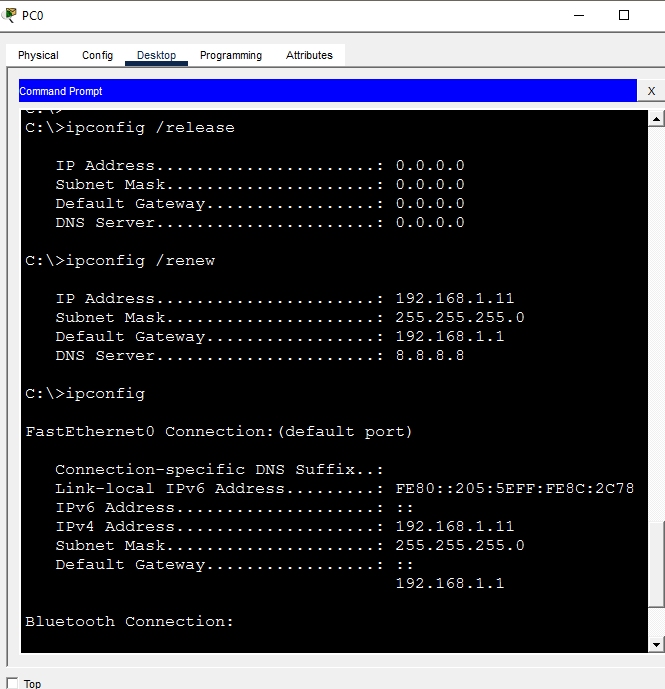<br>
  <em>Exhibit 6 — PC0 leases a valid address again once the interface is brought back up</em>
</p>

---

<a id="module-7"></a>
## 🐛 Module 7 — Simulate Duplicate IP Conflict

**Objective:** Manually assign the same static IP to two different PCs.

### Step 7 — Simulate Duplicate IP Conflict ✅

```
PC2 → Desktop → IP Configuration → Static
→ IP Address: 192.168.1.10
→ Subnet Mask: 255.255.255.0
→ Default Gateway: 192.168.1.1

PC3 → Desktop → IP Configuration → Static
→ IP Address: 192.168.1.10  ← same as PC2
→ Subnet Mask: 255.255.255.0
→ Default Gateway: 192.168.1.1

→ Packet Tracer shows warning:
  "This address is already used in the network"
  "Another device has attempted to use this IP address"
```

<p align="center">
  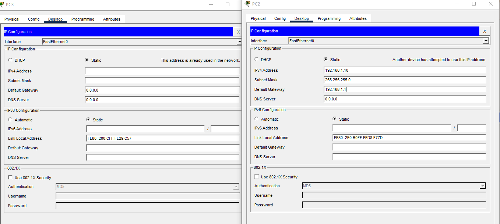<br>
  <em>Exhibit 7 — Packet Tracer's own conflict warning confirms the duplicate IP the moment it's assigned</em>
</p>

---

<a id="module-8"></a>
## 👀 Module 8 — Observe Duplicate IP Symptoms

**Objective:** Test connectivity to see how the duplicate IP actually affects the network.

### Step 8 — Observe Duplicate IP Symptoms ✅

```
PC2> ping 192.168.1.1
PC1> ping 192.168.1.1

→ Both PCs active on network with same IP
→ Unpredictable behaviour — one PC may lose connectivity
```

<p align="center">
  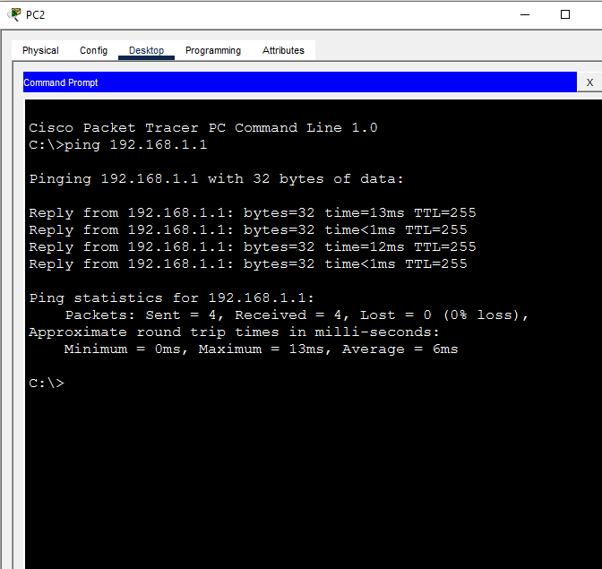<br>
  <em>Exhibit 8a — PC2's connectivity under the duplicate IP condition</em>
</p>
<p align="center">
  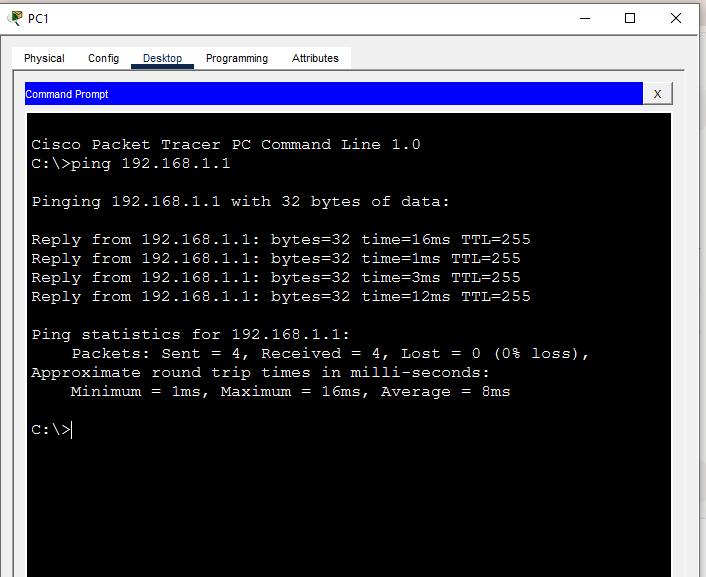<br>
  <em>Exhibit 8b — PC1's connectivity affected by the same conflict</em>
</p>

---

<a id="module-9"></a>
## 🔎 Module 9 — Diagnose Duplicate IP with ARP

**Objective:** Use the ARP table, not just ping, to actually catch the duplicate IP conflict.

### Step 9 — Diagnose Duplicate IP with ARP ✅

```
PC0> ping 192.168.1.10
PC0> arp -a
→ 192.168.1.10 mapped to a MAC address
→ Running multiple times shows MAC flipping — duplicate IP sign

Router:
show ip arp
→ 192.168.1.10 showing with one MAC
→ Both PC2 and PC3 claiming same IP
```

<p align="center">
  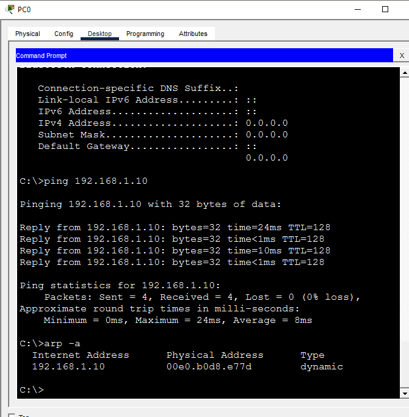<br>
  <em>Exhibit 9a — Flipping MAC address for the same IP, seen from a PC's ARP table</em>
</p>
<p align="center">
  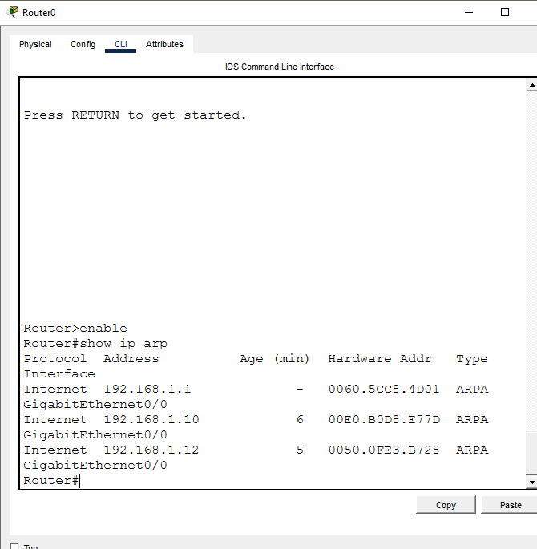<br>
  <em>Exhibit 9b — The router's own ARP table confirming the same conflict</em>
</p>

---

<a id="module-10"></a>
## 🩹 Module 10 — Fix Duplicate IP Conflict

**Objective:** Assign a unique IP to resolve the conflict.

### Step 10 — Fix Duplicate IP Conflict ✅

```
PC2 → Desktop → IP Configuration → Static
→ IP Address: 192.168.1.20
→ Subnet Mask: 255.255.255.0
→ Default Gateway: 192.168.1.1

PC2> ping 192.168.1.1
→ Clean consistent replies — conflict resolved
```

<p align="center">
  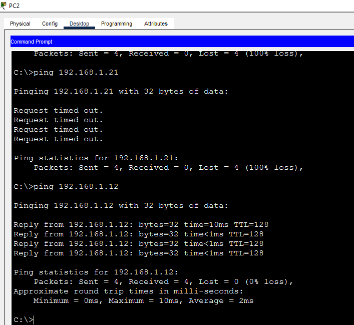<br>
  <em>Exhibit 10 — PC2 reassigned a unique IP, conflict fully resolved</em>
</p>

---

<a id="module-11"></a>
## 🐛 Module 11 — Simulate Missing Default Gateway

**Objective:** Remove the default gateway from a PC to reproduce the classic misconfiguration.

### Step 11 — Simulate Missing Default Gateway ✅

```
PC0 → Desktop → IP Configuration → Static
→ IP Address: 192.168.1.100
→ Subnet Mask: 255.255.255.0
→ Default Gateway: (blank)

PC0> ping 192.168.1.1   → Reply (same subnet — works)
PC0> ping 8.8.8.8       → Request timed out (no gateway to route out)

→ Classic missing gateway symptom:
  LAN works fine but cannot reach outside network
```

<p align="center">
  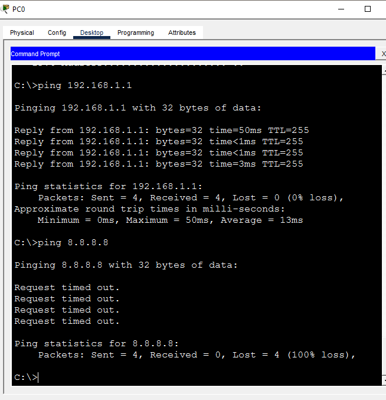<br>
  <em>Exhibit 11 — LAN traffic still works while anything outside the subnet fails</em>
</p>

---

<a id="module-12"></a>
## 🔎 Module 12 — Diagnose Missing Default Gateway

**Objective:** Confirm the gateway is genuinely missing using `ipconfig /all`.

### Step 12 — Diagnose Missing Default Gateway ✅

```
PC0> ipconfig /all

→ IPv4 Address: 192.168.1.100
→ Default Gateway: 0.0.0.0 (blank)
→ ping 8.8.8.8 → Destination host unreachable

→ Diagnosis: No gateway configured — PC cannot route
  traffic outside the local subnet
```

<p align="center">
  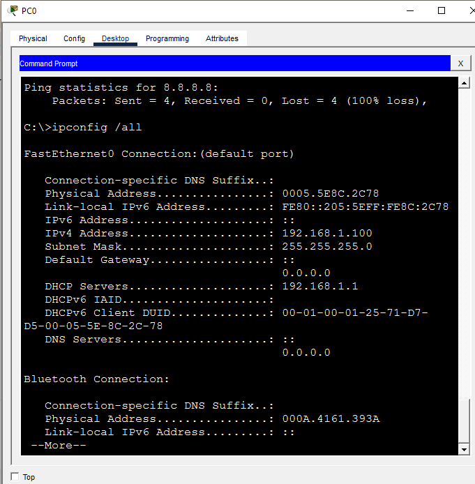<br>
  <em>Exhibit 12 — Blank default gateway confirmed as the root cause</em>
</p>

---

<a id="module-13"></a>
## 🩹 Module 13 — Fix Missing Default Gateway

**Objective:** Restore the correct gateway on the affected PC.

### Step 13 — Fix Missing Default Gateway ✅

```
PC0 → Desktop → IP Configuration → DHCP
→ ipconfig /renew
→ Receives: IP 192.168.1.11, Gateway 192.168.1.1

PC0> ping 192.168.1.1   → Reply
PC0> ping 8.8.8.8       → Destination host unreachable
   (expected — Packet Tracer has no real internet)
   But gateway is now correctly configured
```

<p align="center">
  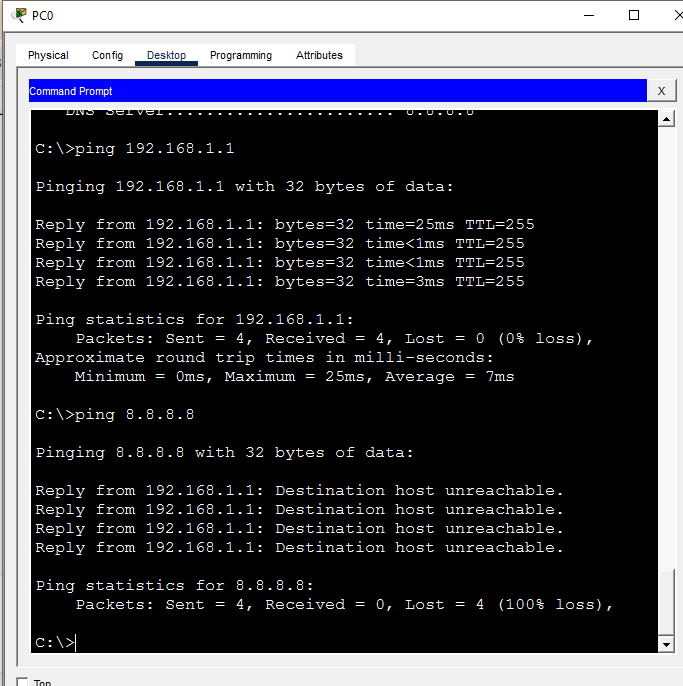<br>
  <em>Exhibit 13 — Gateway restored via DHCP; LAN connectivity confirmed working correctly</em>
</p>

---

<a id="module-14"></a>
## 🧹 Module 14 — Verify ARP Table is Clean

**Objective:** After fixing all three faults, confirm the ARP table shows correct, unique MAC mappings.

### Step 14 — Verify ARP Table is Clean ✅

```
PC0> arp -a

→ Each IP maps to exactly ONE unique MAC address
→ No flipping MACs = no duplicate IP conflict remaining
```

<p align="center">
  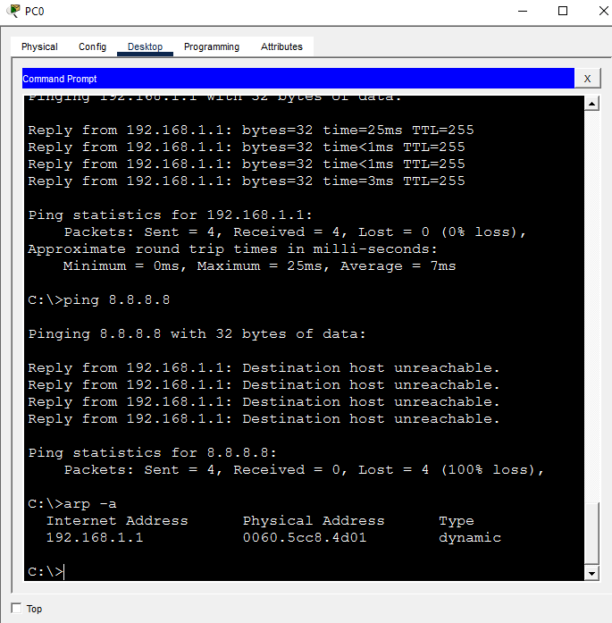<br>
  <em>Exhibit 14 — ARP table fully clean, confirming every fault has actually been resolved</em>
</p>

---

<a id="module-15"></a>
## 🧾 Module 15 — Full Connectivity Test

**Objective:** Ping all devices together to confirm overall network health.

### Step 15 — Full Connectivity Test ✅

```
PC0> ping 192.168.1.10   → Reply (PC2)
PC0> ping 192.168.1.12   → Reply (PC3)
```

<p align="center">
  <br>
  <em>Exhibit 15 — Every host reachable, confirming the LAN is fully healthy after all three fixes</em>
</p>

---

<a id="module-16"></a>
## 📋 Module 16 — Router Verification

**Objective:** Run final verification commands on the router to confirm everything is in order.

### Step 16 — Router Verification ✅

```
show ip interface brief
→ G0/0: 192.168.1.1 up/up

show ip arp
→ All PCs listed with unique MACs

show ip dhcp binding
→ Active leases confirmed for DHCP clients
```

<p align="center">
  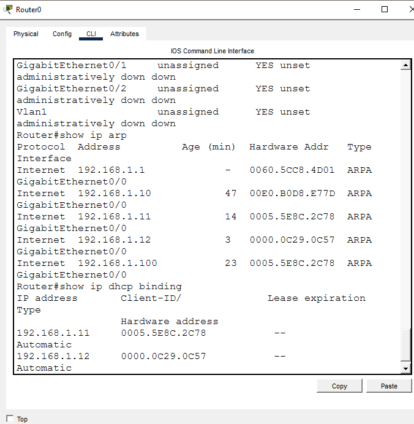<br>
  <em>Exhibit 16 — Router-side verification confirms interface status, ARP entries, and DHCP bindings</em>
</p>

---

<a id="module-17"></a>
## 💾 Module 17 — Save Configuration

**Objective:** Persist the router's final working configuration.

### Step 17 — Save Configuration ✅

```
copy running-config startup-config
```

<p align="center">
  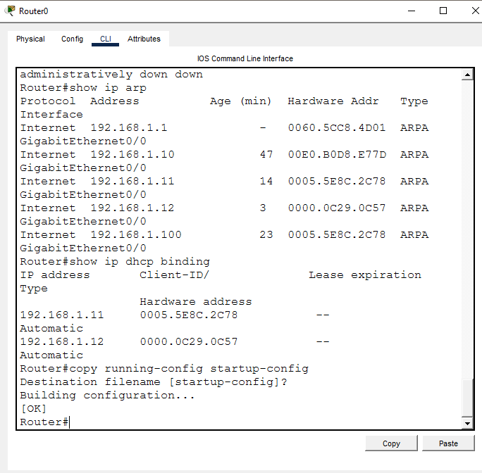<br>
  <em>Exhibit 17 — Final configuration saved to startup-config</em>
</p>

---

<a id="coverage-snapshot"></a>
## 🌟 Coverage Snapshot

| 🛡️ Layer | ✅ Status | 📌 Detail |
|---|---|---|
| Topology | Live | Router, switch, and four PCs wired (Exhibit 1) |
| DHCP service | Live | Router configured as gateway and DHCP server (Exhibit 2) |
| DHCP baseline | Proven | PC0 and PC1 confirmed leasing addresses (Exhibit 3) |
| APIPA fault staged | Live | Router interface shut down, DHCP unreachable (Exhibit 4) |
| APIPA diagnosed | Proven | Missing gateway and failed request confirmed (Exhibit 5) |
| APIPA fixed | Proven | Interface restored, valid lease renewed (Exhibit 6) |
| Duplicate IP staged | Live | PC2 and PC3 both assigned .10 (Exhibit 7) |
| Duplicate IP symptoms observed | Proven | Unpredictable connectivity confirmed on both PCs (Exhibit 8) |
| Duplicate IP diagnosed | Proven | MAC flipping caught via ARP on PC and router (Exhibit 9) |
| Duplicate IP fixed | Proven | PC2 reassigned a unique IP (Exhibit 10) |
| Missing gateway staged | Live | Gateway field left blank on PC0 (Exhibit 11) |
| Missing gateway diagnosed | Proven | Blank gateway confirmed via ipconfig /all (Exhibit 12) |
| Missing gateway fixed | Proven | Gateway restored via DHCP renewal (Exhibit 13) |
| ARP table re-verified | Proven | Clean, unique MAC mappings confirmed (Exhibit 14) |
| Full connectivity re-tested | Proven | All hosts reachable together (Exhibit 15) |
| Router-side verification | Proven | Interfaces, ARP, and DHCP bindings all confirmed (Exhibit 16) |
| Configuration saved | Live | Running-config saved to startup-config (Exhibit 17) |

---

<a id="command-summary"></a>
## 📟 Command Summary

| Command | Purpose |
|---------|---------|
| `ipconfig /all` | View full IP config including gateway and mask |
| `ipconfig /release` | Release current DHCP lease |
| `ipconfig /renew` | Request new IP from DHCP server |
| `ping <ip>` | Test connectivity to a host or gateway |
| `arp -a` | View ARP table — detect duplicate IPs |
| `show ip interface brief` | Verify router interface status and IPs |
| `show ip arp` | View router ARP table |
| `show ip dhcp binding` | View active DHCP leases |
| `show ip dhcp pool` | View DHCP pool configuration |
| `ip dhcp excluded-address` | Reserve IPs from DHCP pool |
| `ip dhcp pool` | Create DHCP pool on router |
| `default-router` | Set gateway in DHCP pool |
| `no shutdown` | Bring up router interface |
| `copy running-config startup-config` | Save configuration |

---

<a id="challenges-fixes"></a>
## ⚠️ Challenges & Fixes

| ❌ Challenge | ✅ Solution |
|---|---|
| Packet Tracer shows 0.0.0.0 instead of 169.254.x.x for APIPA | Expected Packet Tracer behaviour — the DHCP request failed message confirms the same underlying issue |
| Packet Tracer blocks an obviously invalid gateway entry | Simulated a missing gateway by leaving the field blank — same real-world effect as a wrong gateway |
| Duplicate IP hard to detect by ping alone | Used `arp -a` to spot MAC address flipping, plus the router's `show ip arp` to confirm from the other side |
| PC3 blocked from using the same IP as PC2 | Packet Tracer's own conflict warning was used directly as proof of the duplicate IP |
| ARP table still showing old entries after the fix | Re-pinged all hosts to repopulate the ARP table with fresh, correct entries |

---

<a id="scope-limitations"></a>
## 🚧 Scope & Limitations

- **Simulation only:** Built and verified in Cisco Packet Tracer, not on physical hardware.
- **Single subnet:** All four PCs sit on one flat LAN — no VLANs, no inter-VLAN routing, no multi-subnet DHCP relay scenario.
- **Faults staged sequentially, not concurrently:** Each of the three faults was introduced, diagnosed, and fixed one at a time rather than all together, to keep cause and effect clearly attributable.
- **No real internet in Packet Tracer:** `ping 8.8.8.8` always times out in the simulator regardless of gateway correctness — the gateway fix is verified by LAN reachability and configuration state, not by actual internet access.
- **No DHCP snooping or dynamic ARP inspection configured:** The router does not actively prevent duplicate IP assignment; the conflict is caught through manual diagnostics, not automatic mitigation.

These limits are stated so the lab is read as a host-configuration-fault fundamentals exercise, not a production LAN hardening exercise.

---

<a id="what-i-learned"></a>
## 🧠 What I Learned

- **APIPA showing as 0.0.0.0 vs. 169.254.x.x doesn't change the diagnosis.** Both mean the same thing — the DHCP server was unreachable — and a simulator's exact fallback address shouldn't be mistaken for a different fault.
- **Ping alone can't catch a duplicate IP.** Two hosts can both "work" intermittently; `arp -a` and the router's own ARP table are what actually expose the MAC address flipping that proves the conflict.
- **A missing default gateway has a very specific signature:** local subnet traffic works perfectly while anything outside it times out — that split is the diagnostic clue, not a general "network is down" symptom.
- **Fixing a fault doesn't mean the ARP table is automatically clean.** Stale entries can persist until traffic is re-generated, so re-pinging after a fix is part of actually confirming it.
- **Staging faults one at a time keeps root-cause analysis honest.** Introducing all three problems together would have made it much harder to say confidently which symptom belonged to which cause.

---

<a id="skills-demonstrated"></a>
## 🛠️ Skills Demonstrated

- Configuring a router as both a LAN gateway and a DHCP server, including excluded addresses
- Diagnosing APIPA/DHCP failures using `ipconfig /all` and interpreting a blank gateway
- Detecting a duplicate IP conflict through ARP table inconsistency rather than by ping alone
- Diagnosing a missing default gateway by isolating LAN-only vs. WAN connectivity
- Reading and correlating `show ip arp` and `show ip dhcp binding` output on the router side
- Structuring a multi-fault lab so each root cause is diagnosed and fixed independently
- Saving and persisting router configuration with `copy running-config startup-config`

---

<a id="screenshot-index"></a>
## 🖼️ Screenshot Index

| # | File | Shows |
|:---:|---|---|
| 1 | `01-topology.PNG` | Full topology wired |
| 2 | `02-router-dhcp-config.PNG` | Router configured as gateway and DHCP server |
| 3 | `03-dhcp-working.PNG` | DHCP baseline confirmed on PC0/PC1 |
| 4 | `04-apipa-address.PNG` | APIPA fault staged — DHCP unreachable |
| 5 | `05-apipa-diagnosis.PNG` | APIPA cause diagnosed |
| 6 | `06-apipa-fixed.PNG` | APIPA fault fixed |
| 7 | `07-duplicate-ip-setup.PNG` | Duplicate IP staged, Packet Tracer warning shown |
| 8 | `08-duplicate-ip-symptoms.PNG` / `-2.PNG` | Duplicate IP symptoms on PC2 and PC1 |
| 9 | `09-arp-duplicate-detection.PNG` / `-2.PNG` | Duplicate IP caught via ARP on PC and router |
| 10 | `10-duplicate-ip-fixed.PNG` | Duplicate IP fault fixed |
| 11 | `11-wrong-gateway-setup.PNG` | Missing gateway staged |
| 12 | `12-wrong-gateway-diagnosis.PNG` | Missing gateway diagnosed |
| 13 | `13-gateway-fixed.PNG` | Missing gateway fault fixed |
| 14 | `14-arp-table-clean.PNG` | ARP table confirmed clean after all fixes |
| 15 | `15-full-connectivity-test_.PNG` | Full connectivity test passed |
| 16 | `16-router-verification.PNG` | Router-side final verification |
| 17 | `17-final-save.PNG` | Configuration saved |

---

<a id="repo-structure"></a>
## 📁 Repo Structure

```text
03-IT-Support-Troubleshooting/04-Gateway_IP_Conflict_Resolution/
|-- README.md
|-- gateway-ip-conflict-resolution.pkt
`-- screenshots/
    |-- 01-topology.PNG
    |-- 02-router-dhcp-config.PNG
    |-- 03-dhcp-working.PNG
    |-- 04-apipa-address.PNG
    |-- 05-apipa-diagnosis.PNG
    |-- 06-apipa-fixed.PNG
    |-- 07-duplicate-ip-setup.PNG
    |-- 08-duplicate-ip-symptoms.PNG
    |-- 08-duplicate-ip-symptoms-2.PNG
    |-- 09-arp-duplicate-detection.PNG
    |-- 09-arp-duplicate-detection-2.PNG
    |-- 10-duplicate-ip-fixed.PNG
    |-- 11-wrong-gateway-setup.PNG
    |-- 12-wrong-gateway-diagnosis.PNG
    |-- 13-gateway-fixed.PNG
    |-- 14-arp-table-clean.PNG
    |-- 15-full-connectivity-test_.PNG
    |-- 16-router-verification.PNG
    `-- 17-final-save.PNG
```

<div align="center">

🌐 **[Understanding APIPA](https://learn.microsoft.com/en-us/troubleshoot/windows-server/networking/automatic-private-ip-addressing)** · 🔎 **[How ARP Works](https://www.cisco.com/c/en/us/support/docs/ip/address-resolution-protocol-arp/13718-5.html)** · 🚪 **[Default Gateway Basics](https://www.cisco.com/c/en/us/support/docs/ip/dynamic-address-allocation-resolution/13711-33.html)**

</div>
