<div align="center">

# 📶 LAN & Wi-Fi Connectivity Diagnostics

**IT Support & Troubleshooting Lab 05 — Cisco Networking Lab Portfolio**

Full LAN and Wireless Health Check on a Personal PC — IP Configuration, ARP Cache, DNS Resolution, Path Tracing, DHCP Renewal, and SSID/Channel Interference Analysis (Windows CMD, No Simulator)


Ten diagnostics run end-to-end on a real personal Windows PC, no network simulator involved. The lab starts at the IP layer — full configuration, ARP cache, DNS resolution, reachability, and path tracing — then moves into DHCP lease behavior, and finishes with a wireless-specific check most wired-focused labs skip entirely: current SSID and channel, nearby-network channel interference, and a saved-profile audit.

</div>

---

## 📑 Table of Contents

1. [At a Glance](#at-a-glance)
2. [Project Background](#project-background)
3. [Tools & Technologies](#tools-technologies)
4. [Environment](#environment)
5. [Local Network Path](#local-network-path)
6. [Diagnostic Flow](#diagnostic-flow)
7. [Module 1 — IP Baseline Check](#module-1)
8. [Module 2 — ARP Cache Check](#module-2)
9. [Module 3 — DNS Resolution Test](#module-3)
10. [Module 4 — Ping Connectivity Test](#module-4)
11. [Module 5 — Tracert Path Analysis](#module-5)
12. [Module 6 — DHCP Release & Renew](#module-6)
13. [Module 7 — Final Verification](#module-7)
14. [Module 8 — Current SSID & Channel Check](#module-8)
15. [Module 9 — Channel Interference Check](#module-9)
16. [Module 10 — Saved Wi-Fi Profiles](#module-10)
17. [Coverage Snapshot](#coverage-snapshot)
18. [Command Summary](#command-summary)
19. [Challenges & Fixes](#challenges-fixes)
20. [Scope & Limitations](#scope-limitations)
21. [What I Learned](#what-i-learned)
22. [Skills Demonstrated](#skills-demonstrated)
23. [Screenshot Index](#screenshot-index)
24. [Repo Structure](#repo-structure)

---

<a id="at-a-glance"></a>
## 📊 At a Glance

<div align="center">

| 💻 Devices | 🔧 Diagnostic Commands | 📡 Layers Checked | 🛜 Wireless Checks | 🖼️ Screenshots |
|:---:|:---:|:---:|:---:|:---:|
| **1 (personal Wi-Fi PC)** | **9** | **IP · DNS · Routing · DHCP · Wireless** | **3 (SSID, channels, profiles)** | **10** |

</div>

---

<a id="project-background"></a>
## 📖 Project Background

This lab runs a full connectivity health check the way an IT Support tech actually would on a real reported issue — starting at IP configuration, then ARP, then DNS, then reachability and path tracing, then DHCP lease behavior. What sets it apart from a purely wired lab is the last three steps: current SSID and channel, nearby-network channel overlap, and a saved-profile audit — the wireless-specific checks that explain slowdowns and drops a wired-only diagnostic would never catch. Everything here runs on one personal PC with no simulator, so every result is the machine's real, current network state.

| Module | Focus |
|---|---|
| 📋 **Module 1 — IP Baseline Check** | Capture full IP configuration before diagnosing anything |
| 🔎 **Module 2 — ARP Cache Check** | Confirm IP-to-MAC mappings and the gateway's MAC |
| 🌐 **Module 3 — DNS Resolution Test** | Confirm hostnames resolve through the configured DNS server |
| 📶 **Module 4 — Ping Connectivity Test** | Confirm basic reachability with zero packet loss |
| 🧭 **Module 5 — Tracert Path Analysis** | Trace the hop-by-hop path to an external destination |
| 🔁 **Module 6 — DHCP Release & Renew** | Confirm the DHCP server actually responds |
| ✅ **Module 7 — Final Verification** | Confirm the lease was retained correctly after renewal |
| 🛜 **Module 8 — Current SSID & Channel Check** | Identify the connected SSID, channel, and signal strength |
| 📡 **Module 9 — Channel Interference Check** | Check nearby networks for overlapping channels |
| 🗂️ **Module 10 — Saved Wi-Fi Profiles** | Audit previously saved wireless networks |

> [!NOTE]
> Ethernet and the VMware virtual adapters (VMnet1, VMnet8) report "media disconnected" throughout this lab. That's expected — only the Wi-Fi adapter is active for this machine, so those adapters are correctly idle, not a fault.

---

<a id="tools-technologies"></a>
## 🛠️ Tools & Technologies

| Tool | Purpose |
|------|---------|
| ⌨️ Command Prompt (cmd.exe) | Native Windows network diagnostics |
| 📋 `ipconfig` | View/release/renew IP configuration |
| 🔎 `arp` | View ARP cache (IP-to-MAC mappings) |
| 🌐 `nslookup` | DNS resolution testing |
| 📶 `ping` | Basic reachability test |
| 🧭 `tracert` | Path/hop trace to a destination |
| 🛜 `netsh wlan` | Wireless SSID, channel, and profile diagnostics |

---

<a id="environment"></a>
## 🖧 Environment


| Item | Detail |
|------|--------|
| Device | Personal Windows PC |
| Connection Type | Wi-Fi |
| Gateway | 192.168.100.1 |
| Wi-Fi IP | 192.168.100.50 |
| Other Adapters | VMnet1 (192.168.48.1), VMnet8 (192.168.92.1) — VMware virtual adapters, expected/inactive for this lab |

---

<a id="local-network-path"></a>
## 🗺️ Local Network Path

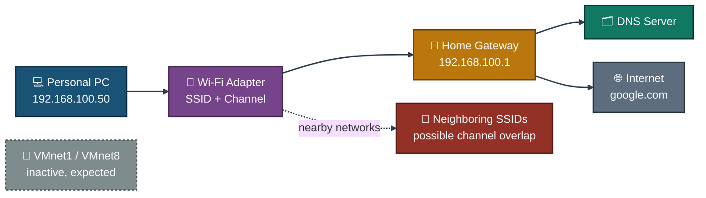
<p align="center"><em>The active path is PC → Wi-Fi → gateway → DNS/internet; the VMware adapters sit idle by design, and nearby SSIDs are checked separately for channel overlap rather than being part of the active path.</em></p>

---

<a id="diagnostic-flow"></a>
## 🔎 Diagnostic Flow


<p align="center"><em>One continuous path from first check to last: the IP/DNS/routing checks feed a health decision point, then flow into the DHCP cycle and the wireless-specific checks that finish the diagnostic.</em></p>

---

<a id="module-1"></a>
## 📋 Module 1 — IP Baseline Check

**Objective:** Capture full IP configuration before running any further diagnostics.

### Step 1 — IP Baseline Check ✅

```
ipconfig /all

→ Confirms IP address, subnet mask, default gateway,
  DNS servers, and MAC address for each adapter
```

<p align="center">
  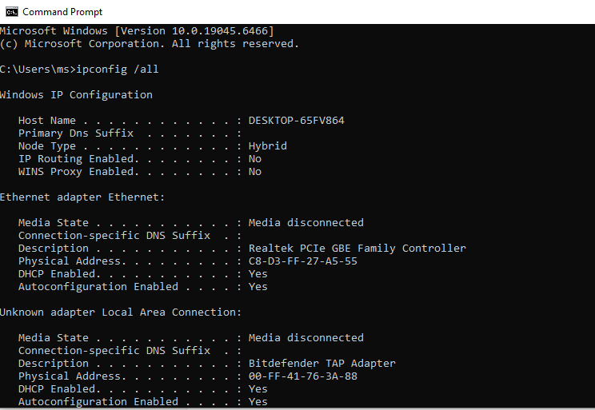<br>
  <em>Exhibit 1 — Full IP configuration captured as the diagnostic baseline</em>
</p>

---

<a id="module-2"></a>
## 🔎 Module 2 — ARP Cache Check

**Objective:** View IP-to-MAC address mappings on the local network.

### Step 2 — ARP Cache Check ✅

```
arp -a

→ Used to detect duplicate IP/MAC conflicts
  and confirm the gateway's MAC address
```

<p align="center">
  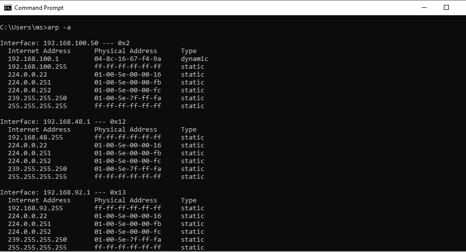<br>
  <em>Exhibit 2 — ARP cache reviewed, gateway MAC address confirmed</em>
</p>

---

<a id="module-3"></a>
## 🌐 Module 3 — DNS Resolution Test

**Objective:** Verify that hostnames resolve correctly through the configured DNS server.

### Step 3 — DNS Resolution Test ✅

```
nslookup google.com

→ Confirms DNS server address and the
  resolved IP for the queried domain
```

<p align="center">
  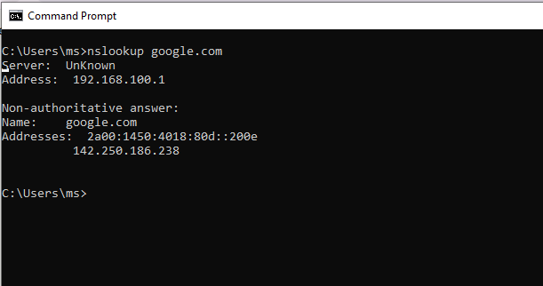<br>
  <em>Exhibit 3 — DNS resolution confirmed working correctly</em>
</p>

---

<a id="module-4"></a>
## 📶 Module 4 — Ping Connectivity Test

**Objective:** Test basic reachability and packet loss to an external host.

### Step 4 — Ping Connectivity Test ✅

```
ping google.com

→ Result: 0% packet loss — connection is healthy
```

<p align="center">
  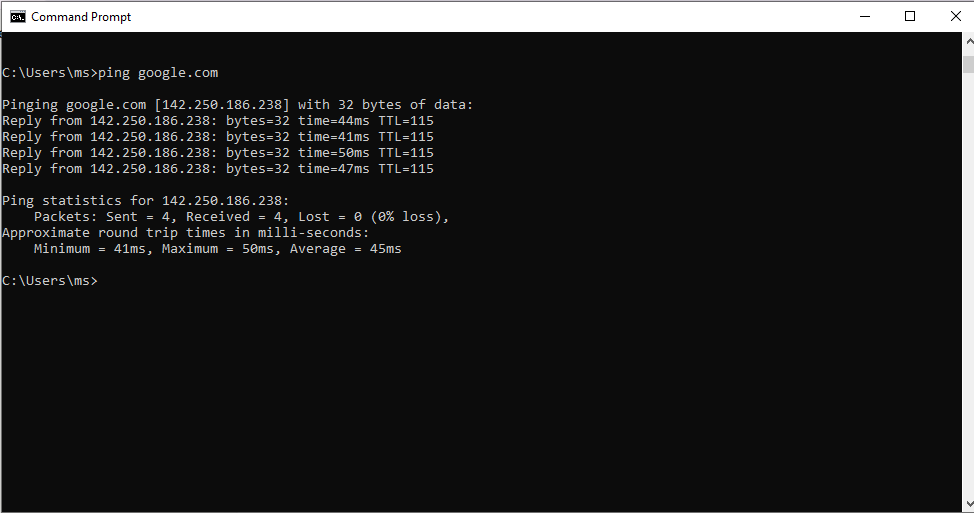<br>
  <em>Exhibit 4 — Zero packet loss confirms healthy basic connectivity</em>
</p>

---

<a id="module-5"></a>
## 🧭 Module 5 — Tracert Path Analysis

**Objective:** Trace the hop-by-hop path traffic takes to reach an external destination.

### Step 5 — Tracert Path Analysis ✅

```
tracert google.com

→ Shows each router hop (including local gateway 192.168.100.1)
  and latency per hop
```

<p align="center">
  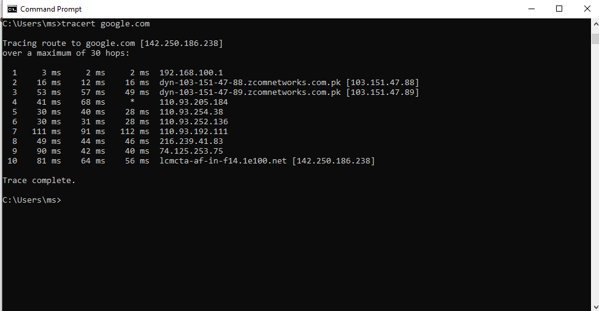<br>
  <em>Exhibit 5 — Full hop-by-hop path to the destination traced and reviewed</em>
</p>

---

<a id="module-6"></a>
## 🔁 Module 6 — DHCP Release & Renew

**Objective:** Release and renew the DHCP-assigned IP address to confirm DHCP server responsiveness.

### Step 6 — DHCP Release & Renew ✅

```
ipconfig /release
ipconfig /renew

Note: inactive adapters (Ethernet, VMware adapters) report
"media disconnected" — expected, since only Wi-Fi is active.
```

<p align="center">
  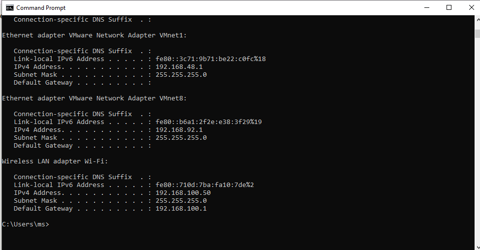<br>
  <em>Exhibit 6 — DHCP lease released and renewed successfully on the active Wi-Fi adapter</em>
</p>

---

<a id="module-7"></a>
## ✅ Module 7 — Final Verification

**Objective:** Re-check full IP configuration after renewal to confirm the lease was retained correctly.

### Step 7 — Final Verification ✅

```
ipconfig /all

→ Result: Wi-Fi adapter retained IP 192.168.100.50
  after renewal — DHCP server functioning correctly
```

<p align="center">
  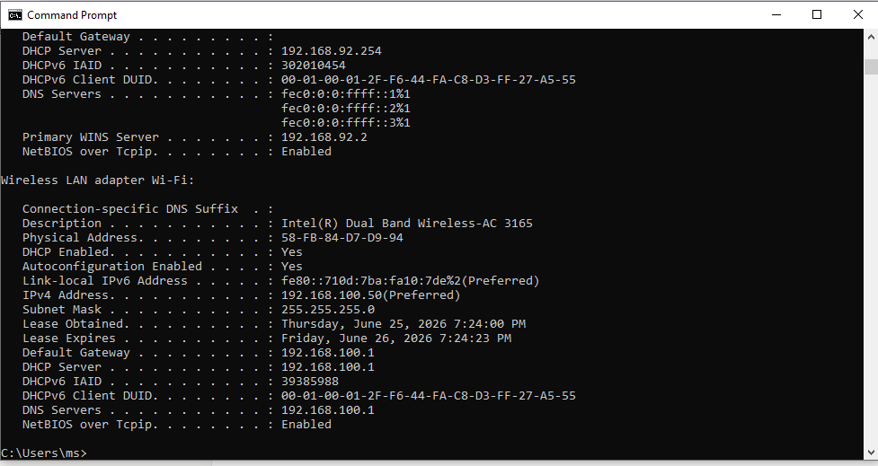<br>
  <em>Exhibit 7 — Same IP retained after renewal, confirming the DHCP server responded correctly</em>
</p>

---

<a id="module-8"></a>
## 🛜 Module 8 — Current SSID & Channel Check

**Objective:** Identify the currently connected SSID, signal strength, and Wi-Fi channel.

### Step 8 — Current SSID & Channel Check ✅

```
netsh wlan show interfaces

→ Shows connected SSID, BSSID, authentication type,
  channel number, and signal percentage
```

<p align="center">
  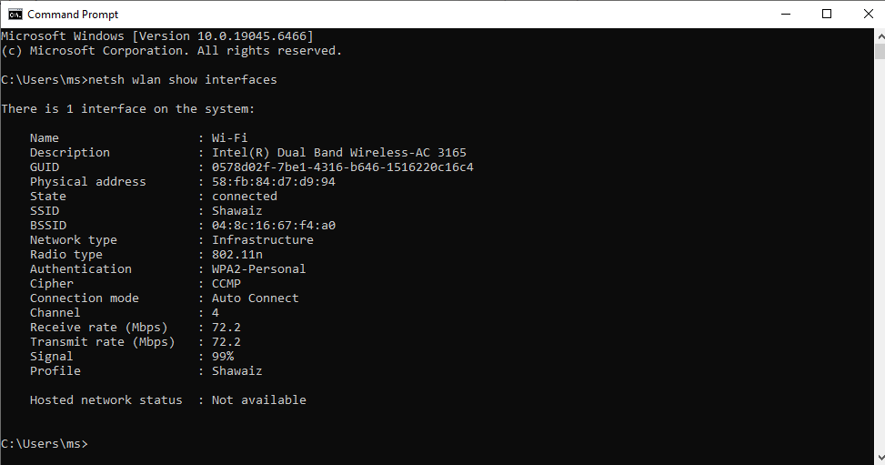<br>
  <em>Exhibit 8 — Current SSID, channel, and signal strength confirmed</em>
</p>

---

<a id="module-9"></a>
## 📡 Module 9 — Channel Interference Check

**Objective:** List nearby wireless networks and the channels they broadcast on.

### Step 9 — Channel Interference Check ✅

```
netsh wlan show networks mode=bssid

→ If multiple nearby networks share the same or overlapping
  channel as the current connection, this indicates channel
  interference — a common cause of Wi-Fi slowdowns and drops
```

<p align="center">
  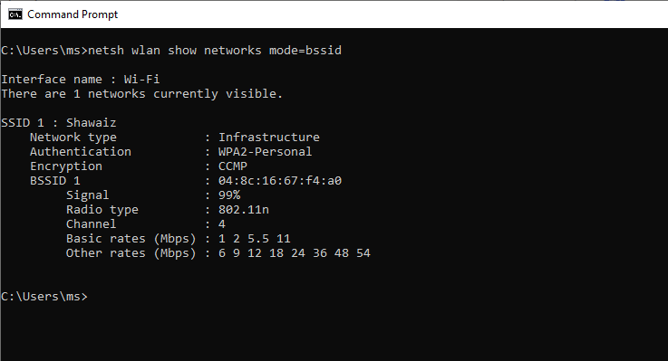<br>
  <em>Exhibit 9 — Nearby networks and their channels reviewed for overlap</em>
</p>

---

<a id="module-10"></a>
## 🗂️ Module 10 — Saved Wi-Fi Profiles

**Objective:** List all Wi-Fi networks previously saved on this PC.

### Step 10 — Saved Wi-Fi Profiles ✅

```
netsh wlan show profiles

→ Useful for auditing which networks a device has connected
  to and removing stale/unused profiles
```

<p align="center">
  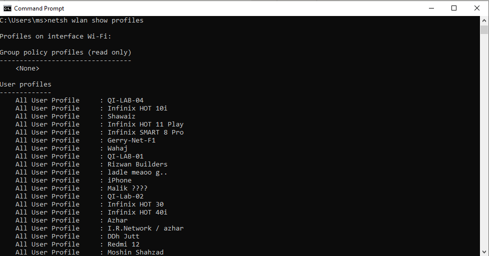<br>
  <em>Exhibit 10 — Saved Wi-Fi profiles audited as the final step</em>
</p>

---

<a id="coverage-snapshot"></a>
## 🌟 Coverage Snapshot

| 🛡️ Layer | ✅ Status | 📌 Detail |
|---|---|---|
| IP configuration baseline | Live | Full adapter config captured (Exhibit 1) |
| ARP cache reviewed | Proven | Gateway MAC confirmed, no conflicts (Exhibit 2) |
| DNS resolution | Proven | google.com resolves correctly (Exhibit 3) |
| Basic reachability | Proven | Zero packet loss confirmed (Exhibit 4) |
| Path tracing | Proven | Full hop-by-hop route reviewed (Exhibit 5) |
| DHCP release/renew | Proven | Lease successfully released and renewed (Exhibit 6) |
| DHCP lease retained | Proven | Same IP confirmed after renewal (Exhibit 7) |
| Current SSID/channel | Proven | Connected network and channel identified (Exhibit 8) |
| Channel interference | Proven | Nearby networks and overlap reviewed (Exhibit 9) |
| Saved profiles audited | Proven | Wi-Fi profile history reviewed (Exhibit 10) |

---

<a id="command-summary"></a>
## 📟 Command Summary

| Command | Purpose |
|---------|---------|
| `ipconfig /all` | View full IP, MAC, gateway, DNS config |
| `arp -a` | View ARP cache (IP-to-MAC mappings) |
| `nslookup` | Test DNS resolution |
| `ping` | Test basic reachability |
| `tracert` | Trace path/hops to a destination |
| `ipconfig /release` / `/renew` | Drop and re-request DHCP lease |
| `netsh wlan show interfaces` | View current SSID, channel, signal |
| `netsh wlan show networks mode=bssid` | View nearby SSIDs and their channels |
| `netsh wlan show profiles` | View saved Wi-Fi profiles |

---

<a id="challenges-fixes"></a>
## ⚠️ Challenges & Fixes

| ❌ Challenge | ✅ Solution |
|---|---|
| `/release` showed "media disconnected" errors | Confirmed these were inactive adapters (Ethernet, VMware virtual adapters); the active connection was Wi-Fi, which worked correctly |
| Confusion on which window to run commands in | Clarified all commands run in the same Command Prompt session, one after another |
| Lab title required SSID/channel diagnostics not yet covered | Added `netsh wlan` commands (Steps 8–10) to capture SSID, channel, and interference data |
| Verifying DHCP actually worked | Compared IP before and after `/renew` — confirmed the same IP was retained, proving the DHCP server responded correctly |

---

<a id="scope-limitations"></a>
## 🚧 Scope & Limitations

- **Single device, single network:** Performed on one personal Windows PC on one home Wi-Fi network — not repeated across other adapters, OSes, or enterprise wireless controllers.
- **No packet capture:** Findings rely on `ipconfig`/`arp`/`nslookup`/`ping`/`tracert`/`netsh wlan` output alone — no Wireshark or spectrum analyzer was used to independently confirm interference.
- **Channel interference inferred, not measured:** Overlapping channels from nearby SSIDs are identified, but actual throughput or retry-rate impact wasn't separately benchmarked.
- **No enterprise Wi-Fi (802.1X/RADIUS) tested:** This is a home-network wireless scenario; enterprise authentication and controller-based diagnostics are out of scope.
- **VMware virtual adapters not exercised:** VMnet1 and VMnet8 are confirmed inactive but weren't independently tested with an actual VM workload.

These limits are stated so the lab is read as a personal-PC LAN/Wi-Fi diagnostic exercise, not an enterprise wireless site survey.

---

<a id="what-i-learned"></a>
## 🧠 What I Learned

- **A full connectivity check has a natural order:** IP configuration first, then ARP, then DNS, then reachability and path — each layer rules out a category of fault before moving to the next.
- **DHCP renewal returning the same IP is itself a useful confirmation**, not just a no-op — it proves the DHCP server is actually responding and the lease is healthy, not just assumed to be.
- **Wireless problems often aren't visible from wired-style diagnostics at all.** SSID, channel, and nearby-network overlap only show up in `netsh wlan` output, which a purely `ipconfig`/`ping`-based check would never surface.
- **"Media disconnected" on an adapter isn't automatically a fault** — confirming which adapter is actually supposed to be active (Wi-Fi here) is part of correctly reading the output, not something to chase as a problem.
- **Saved Wi-Fi profiles are worth auditing periodically** — stale or duplicate profiles can cause a device to prefer the wrong network without any obvious symptom.

---

<a id="skills-demonstrated"></a>
## 🛠️ Skills Demonstrated

- Reading full `ipconfig /all` output to establish an IP-layer baseline
- Using `arp -a` to confirm IP-to-MAC mappings and rule out conflicts
- Testing and confirming DNS resolution with `nslookup`
- Verifying reachability and packet loss with `ping`
- Tracing and interpreting a hop-by-hop path with `tracert`
- Validating DHCP server responsiveness through a release/renew/verify cycle
- Diagnosing wireless-specific issues — SSID, channel, and channel interference — with `netsh wlan`
- Auditing saved Wi-Fi profiles for stale or unnecessary entries

---

<a id="screenshot-index"></a>
## 🖼️ Screenshot Index

| # | File | Shows |
|:---:|---|---|
| 1 | `01-ipconfig-baseline.PNG` | Full IP configuration baseline |
| 2 | `02-arp-cache.PNG` | ARP cache reviewed |
| 3 | `03-nslookup.PNG` | DNS resolution confirmed |
| 4 | `04-ping-test.PNG` | Ping test — zero packet loss |
| 5 | `05-tracert.PNG` | Path traced hop by hop |
| 6 | `06-dhcp-release-renew.PNG` | DHCP release and renew |
| 7 | `07-final-verify.PNG` | Lease retained after renewal |
| 8 | `08-ssid-current.PNG` | Current SSID and channel |
| 9 | `09-channel-interference.PNG` | Nearby networks and channel overlap |
| 10 | `10-wifi-profiles.PNG` | Saved Wi-Fi profiles audited |

---

<a id="repo-structure"></a>
## 📁 Repo Structure

```text
03-IT-Support-Troubleshooting/05-LAN-WiFi-Connectivity-Diagnostics/
|-- README.md
`-- screenshots/
    |-- 01-ipconfig-baseline.PNG
    |-- 02-arp-cache.PNG
    |-- 03-nslookup.PNG
    |-- 04-ping-test.PNG
    |-- 05-tracert.PNG
    |-- 06-dhcp-release-renew.PNG
    |-- 07-final-verify.PNG
    |-- 08-ssid-current.PNG
    |-- 09-channel-interference.PNG
    `-- 10-wifi-profiles.PNG
```

<div align="center">

📶 **[netsh wlan Command Reference](https://learn.microsoft.com/en-us/windows-server/administration/windows-commands/netsh-wlan)** · 🔎 **[Understanding ARP](https://www.cisco.com/c/en/us/support/docs/ip/address-resolution-protocol-arp/13718-5.html)** · 📡 **[Wi-Fi Channel Overlap Explained](https://www.metageek.com/training/resources/why-channels-1-6-11/)**

</div>
