<div align="center">

# 🖨️ Printer & Network Print Troubleshooting

**IT Support & Troubleshooting Lab 06 — Cisco Networking Lab Portfolio**

Spooler Failures, Stuck Queues, Driver & Port Inspection, Offline Simulation, and Event-Log Diagnosis on Windows 10 Pro — Print Spooler Service Control, PowerShell Printer Management, and Print Troubleshooter (No Physical Printer Required)


Seventeen steps run end-to-end on Windows 10 Pro with no physical printer involved — every fault is staged on virtual printers instead. The lab covers the full printer troubleshooting stack an IT tech actually touches: the Print Spooler service itself, a stuck print queue, driver and port inspection through PowerShell, the built-in printer troubleshooter, PrintService event logs, and a deliberately staged offline-printer scenario.

</div>

---

## 📑 Table of Contents

1. [At a Glance](#at-a-glance)
2. [Project Background](#project-background)
3. [Tools & Technologies](#tools-technologies)
4. [Lab Environment](#lab-environment)
5. [Print Stack Overview](#print-stack-overview)
6. [Simulated Issues](#simulated-issues)
7. [Troubleshooting Flow](#troubleshooting-flow)
8. [Module 1 — Check Printer Status in Settings](#module-1)
9. [Module 2 — Check Print Spooler Service Status](#module-2)
10. [Module 3 — Stop Print Spooler Service](#module-3)
11. [Module 4 — Clear Print Queue](#module-4)
12. [Module 5 — Restart Print Spooler Service](#module-5)
13. [Module 6 — View Print Queue via PowerShell](#module-6)
14. [Module 7 — List Installed Printers via PowerShell](#module-7)
15. [Module 8 — Check Printer Driver Details](#module-8)
16. [Module 9 — Add a Virtual Test Printer](#module-9)
17. [Module 10 — Check Printer Port Configuration](#module-10)
18. [Module 11 — Run Printer Troubleshooter](#module-11)
19. [Module 12 — Check Printer Events in Event Viewer](#module-12)
20. [Module 13 — Enable PrintService Operational Log](#module-13)
21. [Module 14 — Simulate Printer Offline](#module-14)
22. [Module 15 — Diagnose Offline Printer via PowerShell](#module-15)
23. [Module 16 — Fix Offline Printer & Final Cleanup](#module-16)
24. [Module 17 — Final Verification](#module-17)
25. [Coverage Snapshot](#coverage-snapshot)
26. [Command Summary](#command-summary)
27. [Challenges & Fixes](#challenges-fixes)
28. [Scope & Limitations](#scope-limitations)
29. [What I Learned](#what-i-learned)
30. [Skills Demonstrated](#skills-demonstrated)
31. [Screenshot Index](#screenshot-index)
32. [Repo Structure](#repo-structure)

---

<a id="at-a-glance"></a>
## 📊 At a Glance

<div align="center">

| 🖥️ Machines | 🖨️ Printers Managed | 🐛 Faults Staged | 🔧 Tools Used | 🖼️ Screenshots |
|:---:|:---:|:---:|:---:|:---:|
| **1 (Windows 10 Pro)** | **5 (4 built-in + 1 virtual test)** | **3 (spooler down, stuck queue, offline)** | **4 (CMD, PowerShell, Event Viewer, Print Management)** | **17** |

</div>

---

<a id="project-background"></a>
## 📖 Project Background

This lab works through printer troubleshooting the way it actually shows up on a helpdesk ticket — starting by checking whether the printer or the Print Spooler service itself is the problem, then working outward: queue, drivers, ports, the built-in troubleshooter, event logs, and finally a staged offline-printer scenario. No physical printer is used; a virtual `Test-Printer` is added specifically so offline behavior, driver inspection, and default-printer detection can all be exercised safely and repeatably.

| Module Group | Focus |
|---|---|
| 🔍 **Baseline (Modules 1–2)** | Confirm printer and spooler status before touching anything |
| 🔁 **Spooler Cycle (Modules 3–5)** | Stop the spooler, clear the queue, restart it |
| 💻 **PowerShell Inspection (Modules 6–8)** | Inspect jobs, installed printers, and driver details |
| 🧩 **Setup & Ports (Modules 9–10)** | Add a virtual test printer, inspect port configuration |
| 🩺 **Diagnostics (Modules 11–13)** | Run the printer troubleshooter, review and enable event logs |
| 📴 **Offline Fault (Modules 14–16)** | Stage, diagnose, and fix a simulated offline printer |
| ✅ **Verification (Module 17)** | Confirm every component is healthy at the end |

> [!NOTE]
> No physical printer is required anywhere in this lab. `Microsoft Print to PDF` is reused as the driver for the virtual `Test-Printer`, which is what makes the offline simulation and troubleshooter steps possible without hardware.

---

<a id="tools-technologies"></a>
## 🛠️ Tools & Technologies

| Tool | Purpose |
|------|---------|
| 🪟 Windows 10 Pro | Lab environment (Version 22H2) |
| ⌨️ CMD (Admin) | Spooler service control, queue clearing |
| 💻 PowerShell (Admin) | Printer management, driver inspection, port config |
| 📜 Event Viewer | PrintService event log analysis |
| 🖨️ Printers & Scanners Settings | GUI printer management |
| 📋 Print Queue | Job management and offline simulation |
| `Get-Printer` | List and inspect installed printers |
| `Get-PrinterDriver` | Driver version and path inspection |
| `Get-PrinterPort` | Port configuration inspection |

---

<a id="lab-environment"></a>
## 🖧 Lab Environment


**Requirements**

| Item | Detail |
|------|--------|
| OS | Windows 10 Pro (Version 22H2) |
| Account | Administrator |
| Physical Printer | Not required — virtual printers only |

**Installed Printers**

| Printer | Driver | Port |
|---------|--------|------|
| Fax | Microsoft Shared Fax Driver | SHRFAX: |
| Microsoft Print to PDF | Microsoft Print To PDF | PORTPROMPT: |
| Microsoft XPS Document Writer | Microsoft XPS Document Writer v4 | PORTPROMPT: |
| OneNote for Windows 10 | Microsoft Software Printer Driver | OneNote port |
| Test-Printer *(added in lab)* | Microsoft Print to PDF | PORTPROMPT: |

---

<a id="print-stack-overview"></a>
## 🗺️ Print Stack Overview

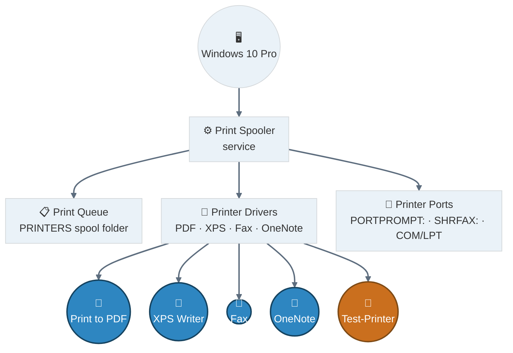
<p align="center"><em>One Windows machine, one Spooler service sitting at the center of everything — queue, drivers, and ports all hang off it, and the five printers (four real, one test) all sit downstream of the drivers.</em></p>

---

<a id="simulated-issues"></a>
## 🐛 Simulated Issues

| # | Issue | Type |
|---|-------|------|
| 1 | Print Spooler service stopped | Service failure |
| 2 | Stuck print jobs in queue | Queue corruption |
| 3 | Printer set to offline | Printer offline simulation |
| 4 | Test-Printer not set as default | Troubleshooter detection |
| 5 | Access denied on spooler stop | Non-admin CMD permissions |

---

<a id="troubleshooting-flow"></a>
## 🔧 Troubleshooting Flow

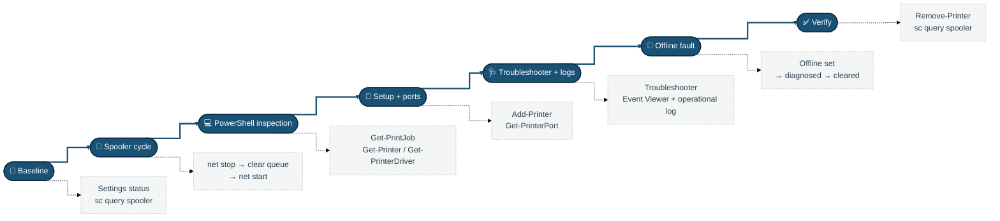
<p align="center"><em>Seven phases in a single left-to-right pass — each solid box is a phase, each dashed note below it is what actually ran during that phase.</em></p>

---

<a id="module-1"></a>
## 🔍 Module 1 — Check Printer Status in Settings

**Objective:** Review all installed printers and their current status.

### Step 1 — Check Printer Status in Settings ✅

```
Win + I → Devices → Printers & Scanners

→ Installed printers:
   Fax
   Microsoft Print to PDF
   Microsoft XPS Document Writer
   OneNote for Windows 10

→ Check for any printer showing "Offline" status
→ "Let Windows manage my default printer" is enabled
```

<p align="center">
  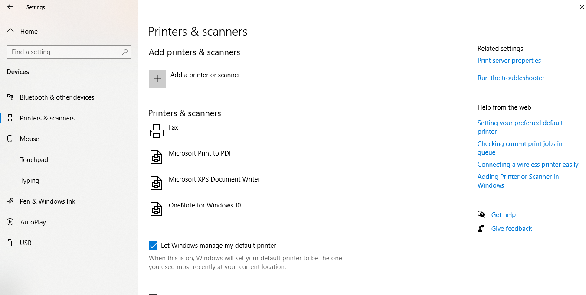<br>
  <em>Exhibit 1 — All installed printers confirmed with no offline status before diagnostics begin</em>
</p>

---

<a id="module-2"></a>
## 🔍 Module 2 — Check Print Spooler Service Status

**Objective:** Verify the Print Spooler service is running.

### Step 2 — Check Print Spooler Service Status ✅

```
sc query spooler

→ SERVICE_NAME: spooler
→ STATE: 4 RUNNING ✅
→ TYPE: WIN32_OWN_PROCESS (interactive)
```

<p align="center">
  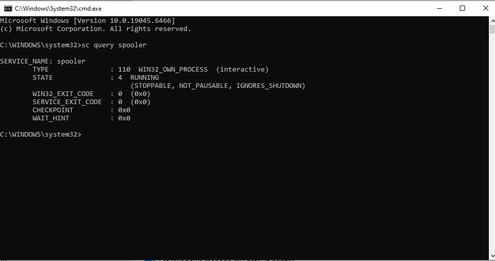<br>
  <em>Exhibit 2 — Print Spooler confirmed running before any fault is staged</em>
</p>

---

<a id="module-3"></a>
## 🔁 Module 3 — Stop Print Spooler Service

**Objective:** Stop the spooler to prepare for queue clearing and cache maintenance.

### Step 3 — Stop Print Spooler Service ✅

```
net stop spooler

→ Stopping will also stop dependent service: Fax
→ Do you want to continue? Y
→ Note: "System error 5 — Access is denied" appears if CMD
  is not running as Administrator
→ Run CMD as Administrator to avoid this error
```

<p align="center">
  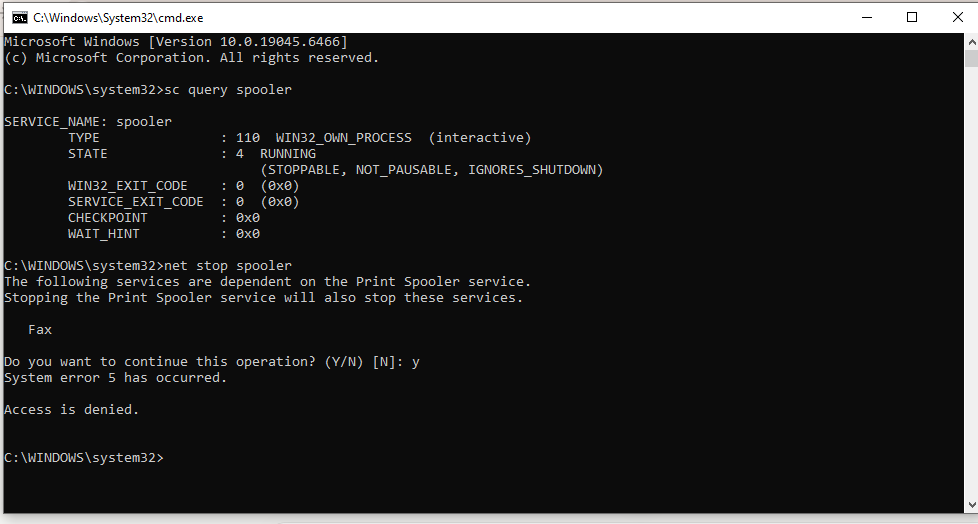<br>
  <em>Exhibit 3 — Spooler and its dependent Fax service stopped cleanly under an admin CMD session</em>
</p>

---

<a id="module-4"></a>
## 🔁 Module 4 — Clear Print Queue

**Objective:** Delete all stuck print jobs from the spooler queue folder.

### Step 4 — Clear Print Queue (Stuck Jobs) ✅

```
del /Q /F /S "%systemroot%\System32\spool\PRINTERS\*.*"

→ "Could Not Find" = print queue already empty ✅
→ If files existed — they would be deleted silently
→ This clears corrupted or stuck jobs that prevent printing
```

<p align="center">
  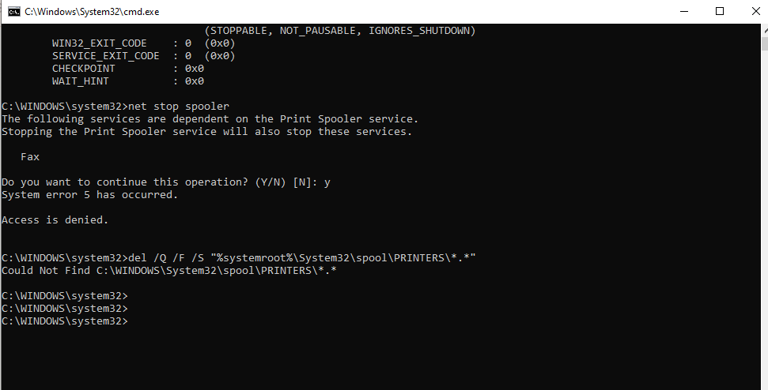<br>
  <em>Exhibit 4 — Spool folder cleared while the service is stopped, preventing file-lock conflicts</em>
</p>

---

<a id="module-5"></a>
## 🔁 Module 5 — Restart Print Spooler Service

**Objective:** Restart the spooler service after clearing the queue.

### Step 5 — Restart Print Spooler Service ✅

```
net start spooler

→ "The requested service has already been started" =
  spooler was auto-restarted by Windows (expected behaviour)
→ Confirm with: sc query spooler → STATE: 4 RUNNING ✅
```

<p align="center">
  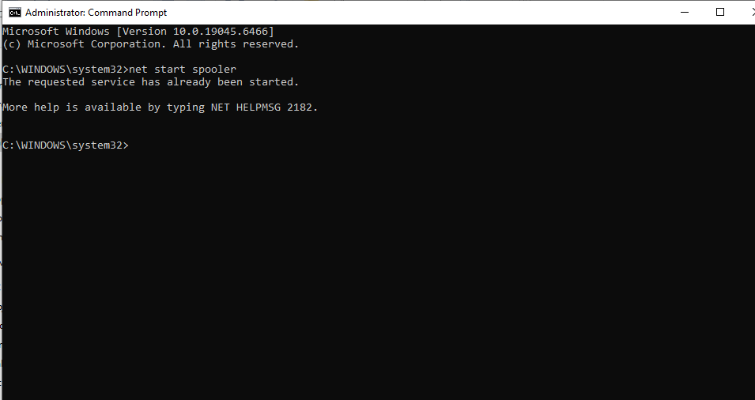<br>
  <em>Exhibit 5 — Spooler confirmed running again after the stop-clear-restart cycle</em>
</p>

---

<a id="module-6"></a>
## 💻 Module 6 — View Print Queue via PowerShell

**Objective:** Check for active or stuck print jobs via PowerShell.

### Step 6 — View Print Queue via PowerShell ✅

```powershell
Get-PrintJob -PrinterName "*"

→ Error: "The specified server does not exist, or the server
  or printer name is invalid. Names may not contain ',' or '\'"
→ This error occurs because wildcard "*" is not supported
  for PrinterName parameter
→ Use specific printer name instead:
  Get-PrintJob -PrinterName "Microsoft Print to PDF"
→ Empty output = no pending jobs ✅
```

<p align="center">
  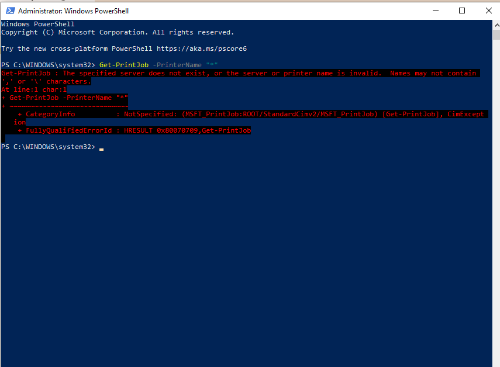<br>
  <em>Exhibit 6 — Wildcard limitation identified and worked around with an explicit printer name</em>
</p>

---

<a id="module-7"></a>
## 💻 Module 7 — List Installed Printers via PowerShell

**Objective:** Get the full list of printers with driver and port information.

### Step 7 — List All Installed Printers via PowerShell ✅

```powershell
Get-Printer | Select Name, DriverName, PortName, PrinterStatus

→ OneNote for Windows 10   — Microsoft Software Printer Driver
→ Microsoft XPS Document Writer — XPS Document Writer v4
→ Microsoft Print to PDF   — Microsoft Print To PDF
→ Fax                      — Microsoft Shared Fax Driver
```

<p align="center">
  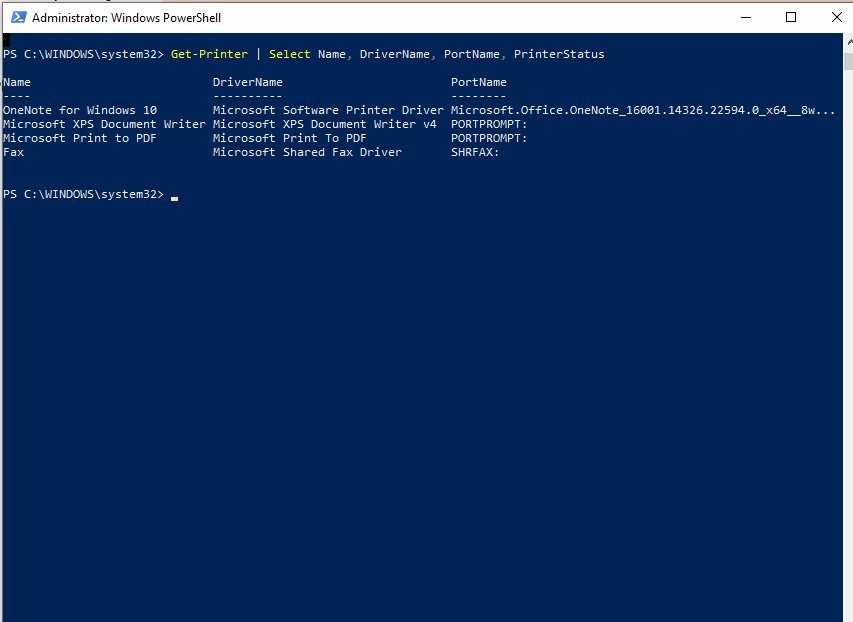<br>
  <em>Exhibit 7 — Full printer inventory confirmed with driver and port fields</em>
</p>

---

<a id="module-8"></a>
## 💻 Module 8 — Check Printer Driver Details

**Objective:** Inspect installed printer drivers, versions, and INF file paths.

### Step 8 — Check Printer Driver Details ✅

```powershell
Get-PrinterDriver | Select Name, MajorVersion, InfPath

→ Microsoft XPS Document Writer v4   — Version 4
→ Microsoft Software Printer Driver  — Version 4
→ Microsoft Print To PDF             — Version 4
→ Microsoft Shared Fax Driver        — Version 3
→ Microsoft enhanced Point and Print — Version 3 (x2)
```

<p align="center">
  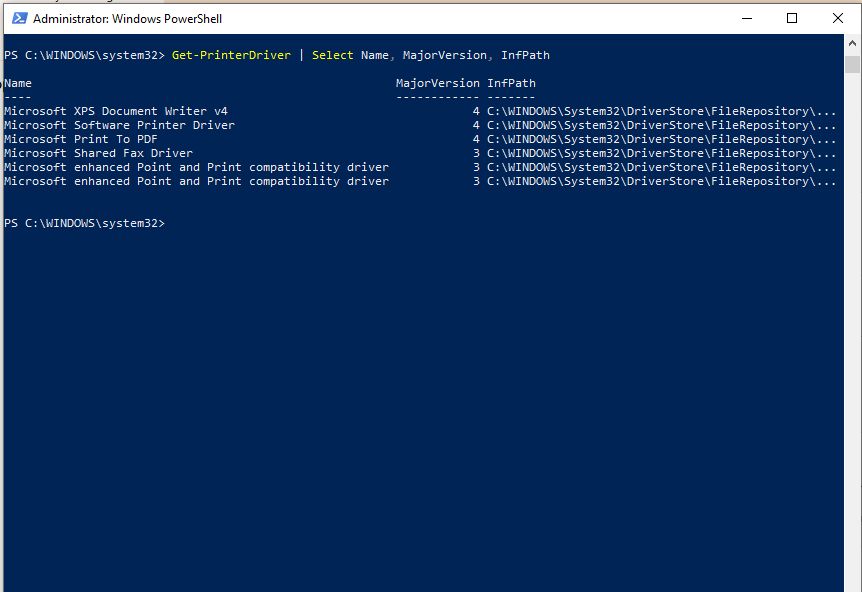<br>
  <em>Exhibit 8 — Driver versions and INF paths reviewed for every installed printer</em>
</p>

---

<a id="module-9"></a>
## 🧩 Module 9 — Add a Virtual Test Printer

**Objective:** Add a virtual printer for testing troubleshooting scenarios.

### Step 9 — Add a Virtual Test Printer ✅

```powershell
Add-Printer -Name "Test-Printer" -DriverName "Microsoft Print to PDF" -PortName "PORTPROMPT:"

→ No output = successfully added ✅
→ PowerShell Add-Printer completes silently on success

→ Verify in Settings → Printers & Scanners → Test-Printer now visible
```

<p align="center">
  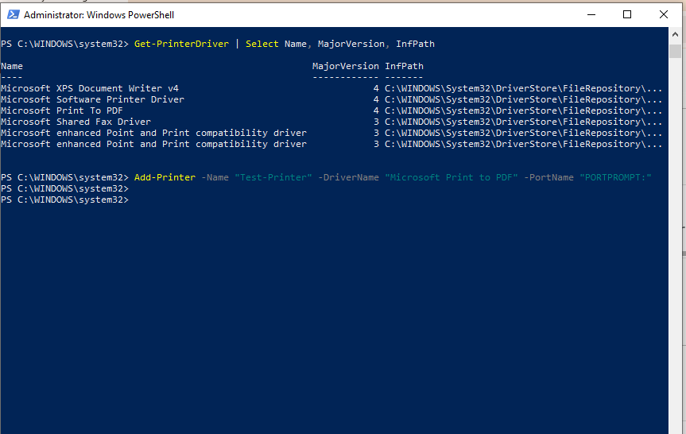<br>
  <em>Exhibit 9 — Test-Printer added, reusing the existing PDF driver and prompt port</em>
</p>

---

<a id="module-10"></a>
## 🧩 Module 10 — Check Printer Port Configuration

**Objective:** View all printer port configurations on the system.

### Step 10 — Check Printer Port Configuration ✅

```powershell
Get-PrinterPort | Select Name, Description, PortMonitor

→ COM1, COM2, COM3, COM4  — Serial ports
→ FILE:                    — Print to file port
→ LPT1, LPT2, LPT3        — Parallel ports
→ PORTPROMPT:              — Interactive prompt port
→ SHRFAX:                  — Fax shared port
→ OneNote port             — OneNote dedicated port
```

<p align="center">
  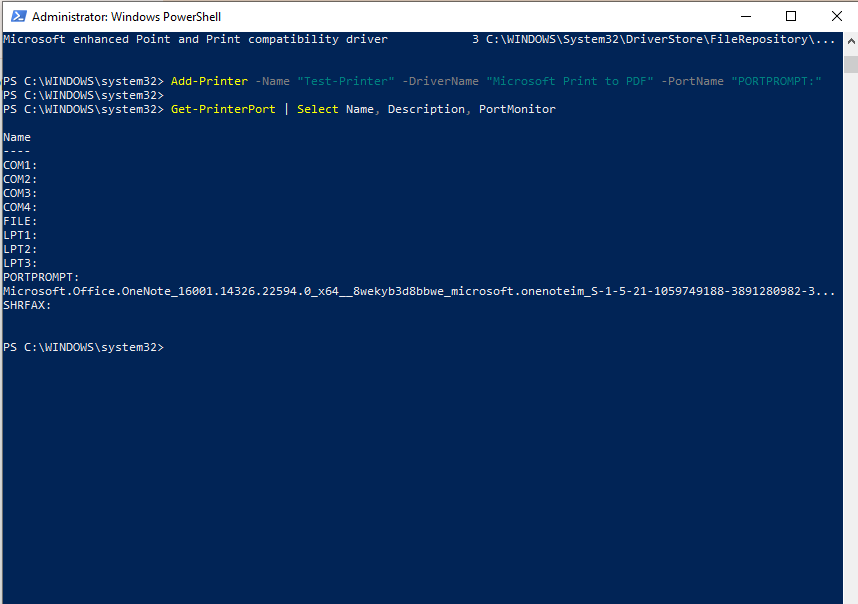<br>
  <em>Exhibit 10 — Every port on the system enumerated, including the one Test-Printer uses</em>
</p>

---

<a id="module-11"></a>
## 🩺 Module 11 — Run Printer Troubleshooter

**Objective:** Use the built-in printer troubleshooter to auto-detect issues.

### Step 11 — Run Printer Troubleshooter ✅

```
Win + I → Update & Security → Troubleshoot
→ Additional troubleshooters → Printer → Run the troubleshooter
→ Select: Test-Printer

→ Problem found:
  "Test-Printer is not the default printer" → Fixed ✅
→ Troubleshooter automatically sets Test-Printer as default
```

<p align="center">
  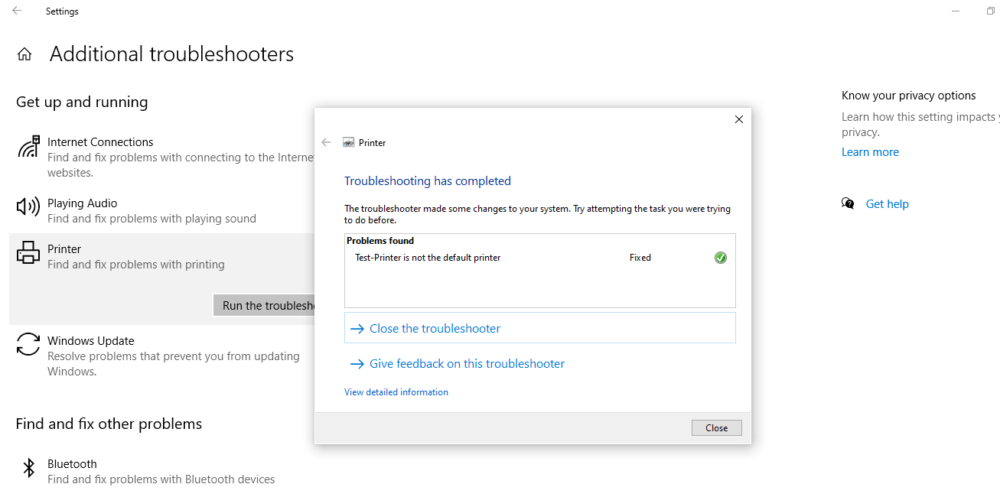<br>
  <em>Exhibit 11 — Built-in troubleshooter flags and auto-fixes the default-printer issue</em>
</p>

---

<a id="module-12"></a>
## 🩺 Module 12 — Check Printer Events in Event Viewer

**Objective:** Filter Event Viewer to show only PrintService events.

### Step 12 — Check Printer Events in Event Viewer ✅

```
Win + R → eventvwr.msc → Enter
→ Windows Logs → System
→ Right-click System → Filter Current Log
→ Event sources: PrintService
→ Click OK

→ Shows all printer installation, job, and error events
```

<p align="center">
  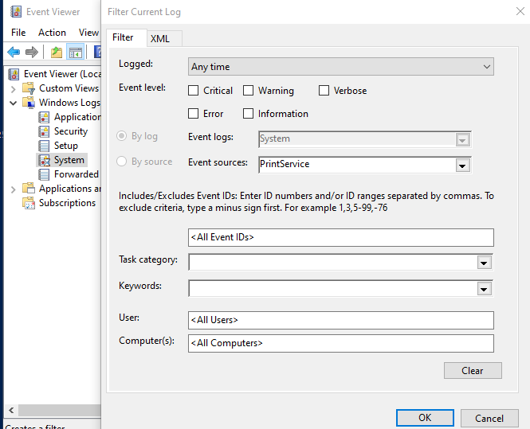<br>
  <em>Exhibit 12 — System log filtered down to PrintService-only events</em>
</p>

---

<a id="module-13"></a>
## 🩺 Module 13 — Enable PrintService Operational Log

**Objective:** Enable the detailed operational log for printer diagnostics.

### Step 13 — Enable PrintService Operational Log ✅

```
Event Viewer → Applications and Services Logs
→ Microsoft → Windows → PrintService
→ Operational → Right-click → Enable Log

→ Now captures detailed print job events:
  Document printed, job submitted, job deleted, errors
```

<p align="center">
  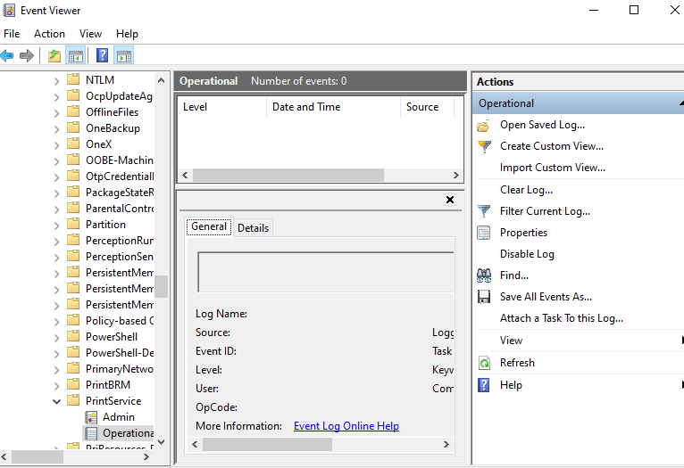<br>
  <em>Exhibit 13 — Operational log enabled for granular, job-level print event capture</em>
</p>

---

<a id="module-14"></a>
## 📴 Module 14 — Simulate Printer Offline

**Objective:** Set Test-Printer to offline to simulate a common IT issue.

### Step 14 — Simulate Printer Offline ✅

```
Settings → Printers & Scanners → Test-Printer → Open queue
→ Printer menu → Use Printer Offline → click

→ Test-Printer now shows "Offline" in Printers & Scanners ✅
→ Queue title bar shows: "Test-Printer - Use Printer Offline"
```

<p align="center">
  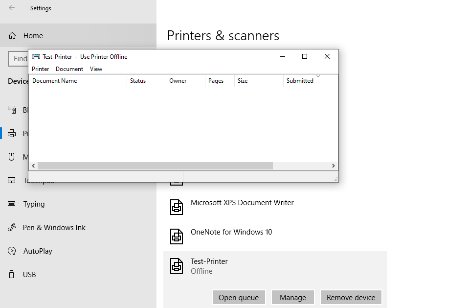<br>
  <em>Exhibit 14 — Offline fault staged on Test-Printer via its print queue</em>
</p>

---

<a id="module-15"></a>
## 📴 Module 15 — Diagnose Offline Printer via PowerShell

**Objective:** Confirm offline status via PowerShell.

### Step 15 — Diagnose Offline Printer via PowerShell ✅

```powershell
Get-Printer | Select Name, PrinterStatus, WorkOffline

→ Test-Printer      Normal   (WorkOffline column blank = offline set via queue)
→ OneNote           Normal
→ Microsoft XPS     Normal
→ Microsoft PDF     Normal
→ Fax               Normal

→ Note: WorkOffline property may not reflect GUI offline state
  in all Windows versions — use queue title bar as confirmation
```

<p align="center">
  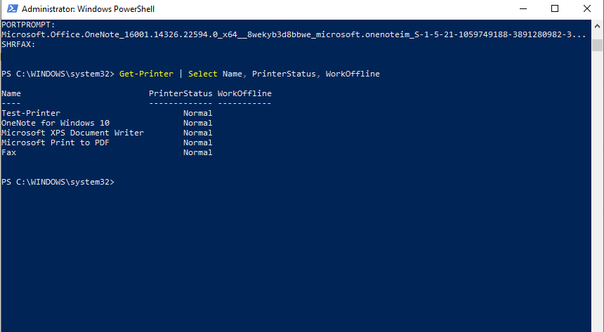<br>
  <em>Exhibit 15 — PowerShell's WorkOffline field cross-checked against the queue title bar</em>
</p>

---

<a id="module-16"></a>
## 📴 Module 16 — Fix Offline Printer & Final Cleanup

**Objective:** Bring the printer back online and remove the test printer.

### Step 16 — Fix Offline Printer & Final Cleanup ✅

```
Settings → Printers & Scanners → Test-Printer → Open queue
→ Printer menu → Use Printer Offline → uncheck ✅

PowerShell:
Get-Printer | Select Name, PrinterStatus, WorkOffline
→ All printers: Normal ✅

Remove-Printer -Name "Test-Printer"
Get-Printer | Select Name, PrinterStatus
→ Test-Printer removed — 4 printers remain ✅

sc query spooler
→ STATE: 4 RUNNING ✅
```

<p align="center">
  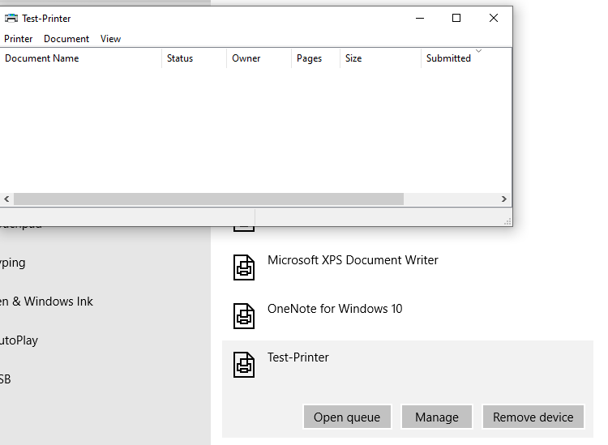<br>
  <em>Exhibit 16 — Offline flag cleared, Test-Printer removed, spooler confirmed still healthy</em>
</p>

---

<a id="module-17"></a>
## ✅ Module 17 — Final Verification

**Objective:** Confirm all printer components are healthy after lab completion.

### Step 17 — Final Verification ✅

```powershell
Get-Printer | Select Name, PrinterStatus, WorkOffline
→ All printers: Normal, WorkOffline blank ✅

Remove-Printer -Name "Test-Printer"
→ Test-Printer successfully removed

Get-Printer | Select Name, PrinterStatus
→ 4 printers remaining — all Normal ✅

sc query spooler
→ STATE: 4 RUNNING ✅
```

<p align="center">
  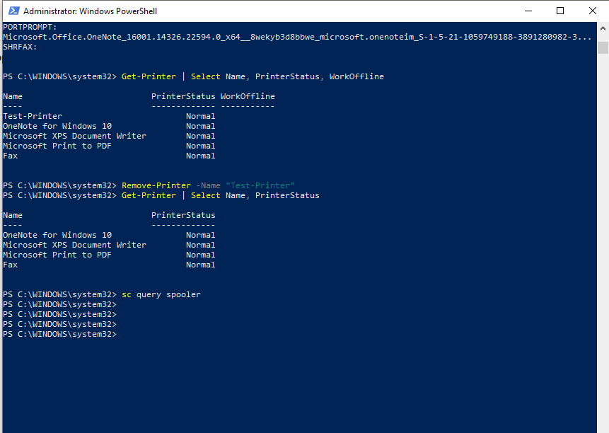<br>
  <em>Exhibit 17 — Full stack re-verified: printers normal, test printer gone, spooler running</em>
</p>

---

<a id="coverage-snapshot"></a>
## 🌟 Coverage Snapshot

| 🛡️ Layer | ✅ Status | 📌 Detail |
|---|---|---|
| Printer status baseline | Live | All installed printers reviewed, none offline (Exhibit 1) |
| Spooler status confirmed | Proven | Service running before any fault staged (Exhibit 2) |
| Spooler stopped | Live | Fault staged, admin-permission requirement surfaced (Exhibit 3) |
| Print queue cleared | Proven | Spool folder cleared while service stopped (Exhibit 4) |
| Spooler restarted | Proven | Service confirmed running again (Exhibit 5) |
| Print queue inspected via PowerShell | Proven | Wildcard limitation identified and worked around (Exhibit 6) |
| Installed printers enumerated | Proven | Full inventory with driver/port fields (Exhibit 7) |
| Printer drivers inspected | Proven | Versions and INF paths reviewed (Exhibit 8) |
| Virtual test printer added | Live | Test-Printer created for safe fault staging (Exhibit 9) |
| Printer ports enumerated | Proven | All system ports reviewed (Exhibit 10) |
| Troubleshooter run | Proven | Default-printer issue auto-detected and fixed (Exhibit 11) |
| PrintService events reviewed | Proven | System log filtered to PrintService (Exhibit 12) |
| Operational log enabled | Proven | Granular job-level logging turned on (Exhibit 13) |
| Offline fault staged | Live | Test-Printer set offline via queue (Exhibit 14) |
| Offline fault diagnosed | Proven | PowerShell and queue title bar cross-checked (Exhibit 15) |
| Offline fault fixed | Proven | Offline cleared, Test-Printer removed (Exhibit 16) |
| Final verification | Proven | All printers normal, spooler running (Exhibit 17) |

---

<a id="command-summary"></a>
## 📟 Command Summary

| Command | Purpose |
|---------|---------|
| `sc query spooler` | Check Print Spooler service status |
| `net stop spooler` | Stop Print Spooler service |
| `net start spooler` | Start Print Spooler service |
| `del /Q /F /S "%systemroot%\System32\spool\PRINTERS\*.*"` | Clear stuck print jobs |
| `Get-Printer` | List all installed printers |
| `Get-PrinterDriver` | List printer drivers with version info |
| `Get-PrinterPort` | List all printer port configurations |
| `Get-PrintJob -PrinterName "<name>"` | View print jobs for a specific printer |
| `Add-Printer` | Add a new printer |
| `Remove-Printer -Name "<name>"` | Remove a printer |
| `eventvwr.msc` | Open Event Viewer |

---

<a id="challenges-fixes"></a>
## ⚠️ Challenges & Fixes

| ❌ Challenge | ✅ Solution |
|---|---|
| `net stop spooler` — Access is denied | CMD was not running as Administrator — relaunched as admin |
| Queue folder not found on cache clear | Queue was already empty — "Could not find" is expected in this case |
| `Get-PrintJob` with wildcard `*` threw an error | Used a specific printer name instead of the wildcard |
| Printer offline option greyed out on some printers | Used the Test-Printer virtual printer, which supports offline simulation |
| `WorkOffline` property not reflecting offline state | Confirmed via the queue title bar "Use Printer Offline" as the primary indicator |
| Troubleshooter found "not default printer" issue | Fixed automatically by the troubleshooter — documented as a real IT scenario |

---

<a id="scope-limitations"></a>
## 🚧 Scope & Limitations

- **No physical printer used:** every printer in this lab is virtual (PDF, XPS, Fax, OneNote, and the added Test-Printer) — no real print job ever leaves the machine.
- **Single machine:** all diagnostics ran on one Windows 10 Pro install, not across a print-server or domain-managed fleet.
- **`WorkOffline` property is unreliable as sole evidence:** this lab notes it doesn't always reflect GUI offline state, so the queue title bar was used as the actual confirmation — a real environment might need a different verification method entirely.
- **No network printer or print-server scenario:** shared/network printers, print server queues, and driver deployment via Group Policy are out of scope.
- **Event Viewer reviewed manually:** no automated log parsing or alerting was set up — findings came from manually filtering and reading PrintService events.

These limits are stated so the lab is read as a local Windows print-stack troubleshooting exercise, not a print-server or enterprise fleet management exercise.

---

<a id="what-i-learned"></a>
## 🧠 What I Learned

- **The Print Spooler is the center of the whole stack.** Queue, drivers, and ports all sit downstream of it — when printing breaks, checking the spooler service first rules out or confirms the biggest category of fault immediately.
- **Clearing a stuck queue only works cleanly with the spooler stopped.** Deleting spool files while the service is running risks file locks and inconsistent state.
- **PowerShell printer cmdlets have sharp edges worth documenting**, like `Get-PrintJob` rejecting a wildcard `PrinterName` — the error message itself is the diagnostic clue.
- **A property not matching the GUI isn't automatically a bug.** `WorkOffline` staying blank while the printer visibly shows offline in its queue is a case where the GUI, not the cmdlet output, is the source of truth.
- **The built-in troubleshooter catches configuration issues, not just hardware ones** — "not the default printer" is a real, common ticket category it resolves automatically.
- **Enabling the PrintService operational log turns a vague "printing isn't working" ticket into something traceable** at the individual job level.

---

<a id="skills-demonstrated"></a>
## 🛠️ Skills Demonstrated

- Diagnosing and cycling the Print Spooler service (`sc query`, `net stop`, `net start`)
- Clearing a corrupted or stuck print queue safely with the service stopped
- Inspecting installed printers, drivers, and ports through PowerShell cmdlets
- Adding and removing a printer via `Add-Printer` / `Remove-Printer`
- Using the built-in Windows printer troubleshooter to auto-detect configuration issues
- Filtering and reading PrintService events in Event Viewer, including enabling the operational log
- Staging, diagnosing, and resolving a simulated offline-printer fault
- Cross-checking PowerShell output against GUI state when the two disagree

---

<a id="screenshot-index"></a>
## 🖼️ Screenshot Index

| # | File | Shows |
|:---:|---|---|
| 1 | `01-printer-status.PNG` | Installed printer status baseline |
| 2 | `02-spooler-status.PNG` | Spooler service confirmed running |
| 3 | `03-spooler-stopped.PNG` | Spooler and Fax stopped |
| 4 | `04-clear-print-queue.PNG` | Print queue cleared |
| 5 | `05-spooler-started.PNG` | Spooler restarted |
| 6 | `06-print-queue-powershell.PNG` | Print queue checked via PowerShell |
| 7 | `07-list-printers.PNG` | All installed printers listed |
| 8 | `08-printer-drivers.PNG` | Printer driver details reviewed |
| 9 | `09-add-printer.PNG` | Test-Printer added |
| 10 | `10-printer-ports.PNG` | Printer ports enumerated |
| 11 | `11-printer-troubleshooter.PNG` | Troubleshooter fixes default-printer issue |
| 12 | `12-printer-event-logs.PNG` | PrintService events filtered |
| 13 | `13-printer-operational-log.PNG` | Operational log enabled |
| 14 | `14-printer-offline.PNG` | Offline fault staged |
| 15 | `15-diagnose-offline.PNG` | Offline fault diagnosed |
| 16 | `16-fix-offline.PNG` | Offline fault fixed, Test-Printer removed |
| 17 | `17-final-verifications.PNG` | Final verification of full stack |

---

<a id="repo-structure"></a>
## 📁 Repo Structure

```text
03-IT-Support-Troubleshooting/06-Printer-Network-Print-Troubleshooting/
|-- README.md
`-- screenshots/
    |-- 01-printer-status.PNG
    |-- 02-spooler-status.PNG
    |-- 03-spooler-stopped.PNG
    |-- 04-clear-print-queue.PNG
    |-- 05-spooler-started.PNG
    |-- 06-print-queue-powershell.PNG
    |-- 07-list-printers.PNG
    |-- 08-printer-drivers.PNG
    |-- 09-add-printer.PNG
    |-- 10-printer-ports.PNG
    |-- 11-printer-troubleshooter.PNG
    |-- 12-printer-event-logs.PNG
    |-- 13-printer-operational-log.PNG
    |-- 14-printer-offline.PNG
    |-- 15-diagnose-offline.PNG
    |-- 16-fix-offline.PNG
    `-- 17-final-verifications.PNG
```

<div align="center">

🖨️ **[Print Spooler Service Overview](https://learn.microsoft.com/en-us/troubleshoot/windows-client/printing/print-spooler-service-overview)** · 💻 **[PowerShell PrintManagement Module](https://learn.microsoft.com/en-us/powershell/module/printmanagement/)** · 📜 **[Event Viewer Basics](https://learn.microsoft.com/en-us/windows/win32/wes/getting-started-with-event-logging)**

</div>
