<div align="center">

# 🖥️ Remote Desktop & VPN Troubleshooting

**IT Support & Troubleshooting Lab 07 — Cisco Networking Lab Portfolio**

Six RDP Failure Points Staged and Fixed on One Windows Machine — Firewall Blocking, Service Failure, Registry-Level Disable, Group Policy Restriction, and Wrong-IP/Session Errors (CMD, PowerShell, Registry Editor, Group Policy Editor, Event Viewer)


Twenty steps run end-to-end on a single Windows 10 Pro machine, working through Remote Desktop failures at every layer that can cause one: a disabled RDP setting, wrong-IP and console-session connection errors, a firewall rule silently blocking port 3389, a stopped TermService, a registry key forcing RDP off, and a Group Policy connection restriction. Each fault is staged, diagnosed with real command output, and fixed before moving to the next.

</div>

---

## 📑 Table of Contents

1. [At a Glance](#at-a-glance)
2. [Project Background](#project-background)
3. [Tools & Technologies](#tools-technologies)
4. [Lab Environment](#lab-environment)
5. [RDP Access Path](#rdp-access-path)
6. [Simulated Issues](#simulated-issues)
7. [Fault Coverage Map](#fault-coverage-map)
8. [Module 1 — Enable Remote Desktop](#module-1)
9. [Module 2 — Verify RDP Port 3389 is Listening](#module-2)
10. [Module 3 — Check IP Address for RDP Connection](#module-3)
11. [Module 4 — Simulate RDP Console Session Error](#module-4)
12. [Module 5 — Simulate RDP Connection to Invalid IP](#module-5)
13. [Module 6 — Check Windows Firewall RDP Rule](#module-6)
14. [Module 7 — Simulate Firewall Blocking RDP](#module-7)
15. [Module 8 — Diagnose Firewall Blocking RDP](#module-8)
16. [Module 9 — Fix Firewall (Remove Block Rule)](#module-9)
17. [Module 10 — Check RDP Event Logs](#module-10)
18. [Module 11 — Check RDP Service Status](#module-11)
19. [Module 12 — Simulate RDP Service Stopped](#module-12)
20. [Module 13 — Fix RDP Service (Restart)](#module-13)
21. [Module 14 — Check RDP Registry Setting](#module-14)
22. [Module 15 — Simulate RDP Disabled via Registry](#module-15)
23. [Module 16 — Fix RDP Registry Setting](#module-16)
24. [Module 17 — Check RDP Policy via Group Policy Editor](#module-17)
25. [Module 18 — Final RDP Verification via CMD](#module-18)
26. [Module 19 — PowerShell RDP Troubleshooting](#module-19)
27. [Module 20 — Final Verification & Summary](#module-20)
28. [Coverage Snapshot](#coverage-snapshot)
29. [Command Summary](#command-summary)
30. [Challenges & Fixes](#challenges-fixes)
31. [Scope & Limitations](#scope-limitations)
32. [What I Learned](#what-i-learned)
33. [Skills Demonstrated](#skills-demonstrated)
34. [Screenshot Index](#screenshot-index)
35. [Repo Structure](#repo-structure)

---

<a id="at-a-glance"></a>
## 📊 At a Glance

<div align="center">

| 🖥️ Machines | 🐛 Faults Staged | 🩹 Fixes Verified | 🔧 Tools Used | 🖼️ Screenshots |
|:---:|:---:|:---:|:---:|:---:|
| **1 (Windows 10 Pro)** | **6 (session, IP, firewall, service, registry, GPO)** | **4** | **5 (CMD, PowerShell, Registry, GPO, Event Viewer)** | **20** |

</div>

---

<a id="project-background"></a>
## 📖 Project Background

This lab treats "RDP isn't working" as a ticket with six possible root causes instead of one, and works through them in the order a tech actually would: is RDP even enabled, is the port reachable, is the firewall in the way, is the service running, is the registry forcing it off, and is Group Policy restricting it. Two connection errors (wrong IP, existing console session) are staged first since they're the most common first-contact symptoms, then each deeper layer — firewall, service, registry, GPO — is broken and repaired one at a time with real command output at every step.

| Module Group | Focus |
|---|---|
| ⚙️ **Enable & Baseline (Modules 1–3)** | Turn RDP on, confirm the port is listening, confirm the IP to connect to |
| 🔌 **Connection Errors (Modules 4–5)** | Reproduce the console-session and wrong-IP errors users actually hit |
| 🧱 **Firewall (Modules 6–9)** | Confirm the allow rule, stage a block rule, diagnose it, remove it |
| 📜 **Event Logs (Module 10)** | Read RDP session events straight from Event Viewer |
| 🔁 **Service (Modules 11–13)** | Confirm, stop, and restart the TermService |
| 🗝️ **Registry (Modules 14–16)** | Confirm, disable, and restore `fDenyTSConnections` |
| 🏛️ **Group Policy (Module 17)** | Confirm the GPO connection policy allows RDP |
| ✅ **Verification (Modules 18–20)** | Re-check everything via CMD and PowerShell together |

> [!NOTE]
> `mstsc /v:192.168.1.999` is used deliberately as an obviously invalid host to force the "can't find the computer" error on demand, and the console-session error in Module 4 is a normal side effect of RDP'ing into a machine that's already logged in physically — not a fault in itself.

---

<a id="tools-technologies"></a>
## 🛠️ Tools & Technologies

| Tool | Purpose |
|------|---------|
| 🪟 Windows 10 Pro | Lab environment (Version 22H2 or later) |
| ⌨️ CMD (Admin) | RDP port verification, service control, firewall rules |
| 💻 PowerShell (Admin) | Registry queries, service status, firewall rule inspection |
| 📜 Event Viewer | RDP session event logs |
| 🏛️ Group Policy Editor (`gpedit.msc`) | RDP connection policy configuration |
| 🗝️ Registry Editor | `fDenyTSConnections` value — RDP enable/disable |
| 🔎 `netstat` | Port 3389 listening verification |
| 🧱 `netsh advfirewall` | Firewall rule management |
| 🔧 `sc` / `net` | Windows service control |

---

<a id="lab-environment"></a>
## 🖧 Lab Environment


| Item | Detail |
|------|--------|
| OS | Windows 10 Pro (Version 22H2 or later) |
| Account | Administrator |
| Extra Hardware/VM | Not required |
| RDP Port | 3389 |
| Wi-Fi IP | 192.168.100.50 |
| Gateway | 192.168.100.1 |

---

<a id="rdp-access-path"></a>
## 🗺️ RDP Access Path

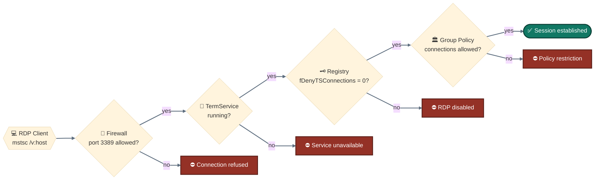
<p align="center"><em>Four gates stand between an RDP client and a working session — firewall, service, registry, and Group Policy — and this lab stages a failure at each one before restoring it.</em></p>

---

<a id="simulated-issues"></a>
## 🐛 Simulated Issues

| # | Issue | Type |
|---|-------|------|
| 1 | RDP disabled on system | System Properties misconfiguration |
| 2 | Wrong IP / unreachable host | Connection to invalid address |
| 3 | Firewall blocking port 3389 | Custom block rule on RDP port |
| 4 | RDP service stopped | TermService not running |
| 5 | RDP disabled via Registry | fDenyTSConnections = 1 |
| 6 | Group Policy restricting RDP | GPO connection policy |

---

<a id="fault-coverage-map"></a>
## 🔧 Fault Coverage Map

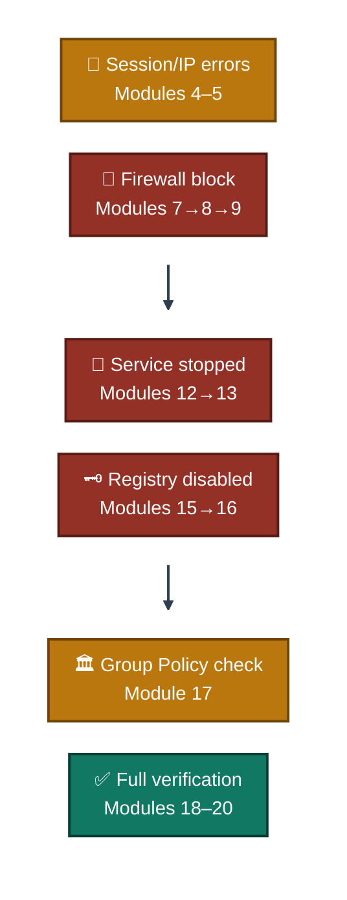
<p align="center"><em>Six fault points laid out as a grid rather than one long chain — orange blocks are reproduced-and-explained errors, red blocks are full stage→diagnose→fix cycles, teal is the closing verification pass.</em></p>

---

<a id="module-1"></a>
## ⚙️ Module 1 — Enable Remote Desktop

**Objective:** Enable RDP via System Properties.

### Step 1 — Enable Remote Desktop on Windows ✅

```
Win + R → sysdm.cpl → Enter
→ Remote tab
→ Select: "Allow remote connections to this computer"
→ Apply → OK
```

<p align="center">
  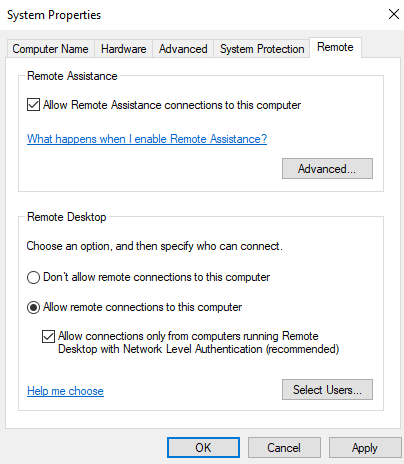<br>
  <em>Exhibit 1 — Remote Desktop enabled via System Properties</em>
</p>

---

<a id="module-2"></a>
## ⚙️ Module 2 — Verify RDP Port 3389 is Listening

**Objective:** Confirm RDP port is active and listening.

### Step 2 — Verify RDP Port 3389 is Listening ✅

```
netstat -an | find "3389"

→ TCP  0.0.0.0:3389   LISTENING
→ TCP  [::]:3389      LISTENING
```

<p align="center">
  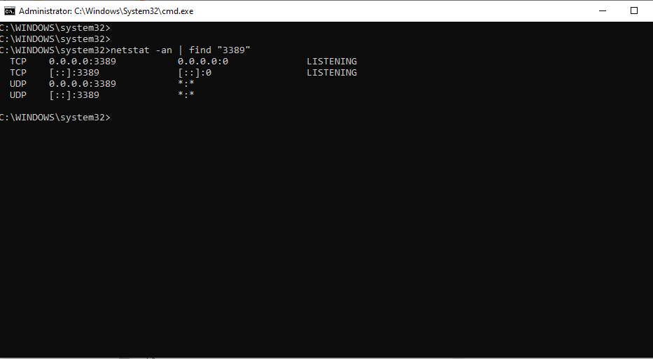<br>
  <em>Exhibit 2 — Port 3389 confirmed listening on both IPv4 and IPv6</em>
</p>

---

<a id="module-3"></a>
## ⚙️ Module 3 — Check IP Address for RDP Connection

**Objective:** Identify the machine IP to use for RDP connections.

### Step 3 — Check IP Address for RDP Connection ✅

```
ipconfig

→ Wi-Fi IPv4 Address: 192.168.100.50
→ Subnet Mask: 255.255.255.0
→ Default Gateway: 192.168.100.1
```

<p align="center">
  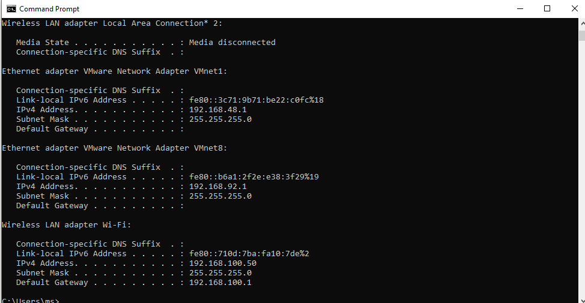<br>
  <em>Exhibit 3 — Target IP confirmed before attempting any RDP connection</em>
</p>

---

<a id="module-4"></a>
## 🔌 Module 4 — Simulate RDP Console Session Error

**Objective:** Attempt an RDP connection to a machine already in an active console session.

### Step 4 — Simulate RDP Console Session Error ✅

```
mstsc /v:192.168.100.50

→ Error: "Your computer could not connect to another console
  session on the remote computer because you already have
  a console session in progress."

→ This is a common IT Support error when a user is already
  logged into the machine physically
```

<p align="center">
  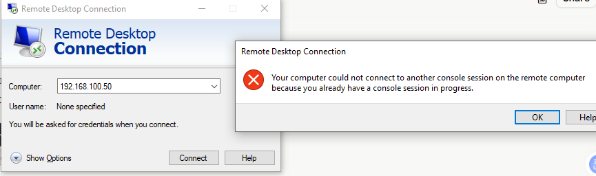<br>
  <em>Exhibit 4 — Console-session conflict reproduced on a machine already logged in locally</em>
</p>

---

<a id="module-5"></a>
## 🔌 Module 5 — Simulate RDP Connection to Invalid IP

**Objective:** Test an RDP connection to a non-existent host to simulate a wrong-IP error.

### Step 5 — Simulate RDP Connection to Invalid IP ✅

```
mstsc /v:192.168.1.999

→ Error: "Remote Desktop can't find the computer 192.168.1.999.
  This might mean that 192.168.1.999 does not belong to the
  specified network. Verify the computer name and domain."

→ Common cause: wrong IP entered, typo, or host offline
```

<p align="center">
  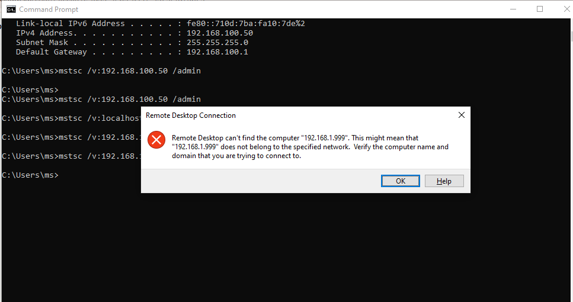<br>
  <em>Exhibit 5 — Invalid-host error reproduced on demand with a deliberately malformed IP</em>
</p>

---

<a id="module-6"></a>
## 🧱 Module 6 — Check Windows Firewall RDP Rule

**Objective:** Verify the Windows Firewall allow rule for RDP port 3389.

### Step 6 — Check Windows Firewall RDP Rule ✅

```
netsh advfirewall firewall show rule name="Remote Desktop - User Mode (TCP-In)"

→ Rule Name: Remote Desktop - User Mode (TCP-In)
→ Enabled: Yes
→ Action: Allow
→ LocalPort: 3389
→ Profiles: Domain, Private, Public
```

<p align="center">
  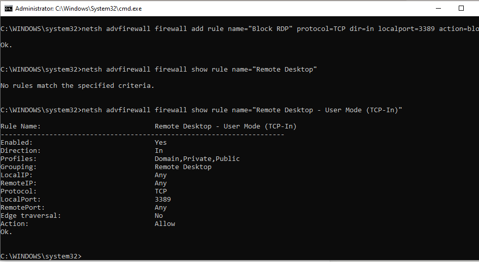<br>
  <em>Exhibit 6 — Built-in allow rule for RDP confirmed healthy before any fault is staged</em>
</p>

---

<a id="module-7"></a>
## 🧱 Module 7 — Simulate Firewall Blocking RDP

**Objective:** Add a custom block rule on port 3389 to simulate firewall blocking RDP.

### Step 7 — Simulate Firewall Blocking RDP ✅

```
netsh advfirewall firewall add rule name="Block RDP" protocol=TCP dir=in localport=3389 action=block
```

<p align="center">
  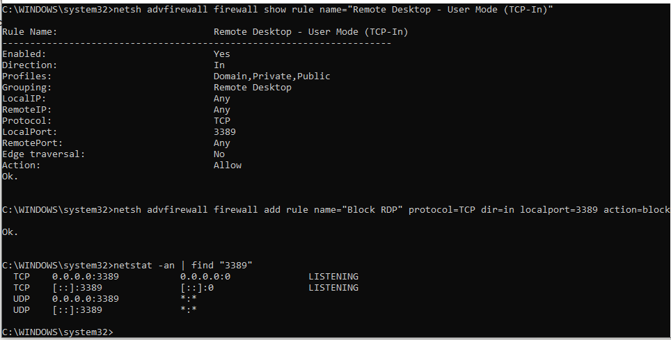<br>
  <em>Exhibit 7 — Custom block rule added on port 3389, overriding the default allow behavior</em>
</p>

---

<a id="module-8"></a>
## 🧱 Module 8 — Diagnose Firewall Blocking RDP

**Objective:** Confirm the block rule is active and identify it as the cause.

### Step 8 — Diagnose Firewall Blocking RDP ✅

```
netsh advfirewall firewall show rule name="Block RDP"

→ Rule Name: Block RDP
→ Enabled: Yes
→ Action: Block   ← this is blocking RDP
→ LocalPort: 3389
```

<p align="center">
  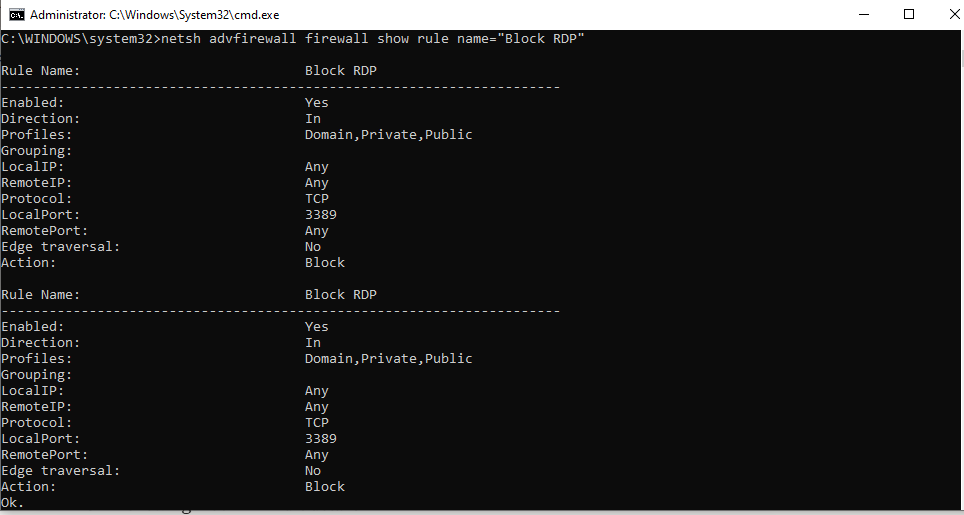<br>
  <em>Exhibit 8 — Block rule confirmed as the root cause via its own rule details</em>
</p>

---

<a id="module-9"></a>
## 🧱 Module 9 — Fix Firewall (Remove Block Rule)

**Objective:** Delete the block rule to restore RDP connectivity.

### Step 9 — Fix Firewall — Remove Block Rule ✅

```
netsh advfirewall firewall delete rule name="Block RDP"

→ Verify:
netsh advfirewall firewall show rule name="Block RDP"
→ No rules match the specified criteria ✅
```

<p align="center">
  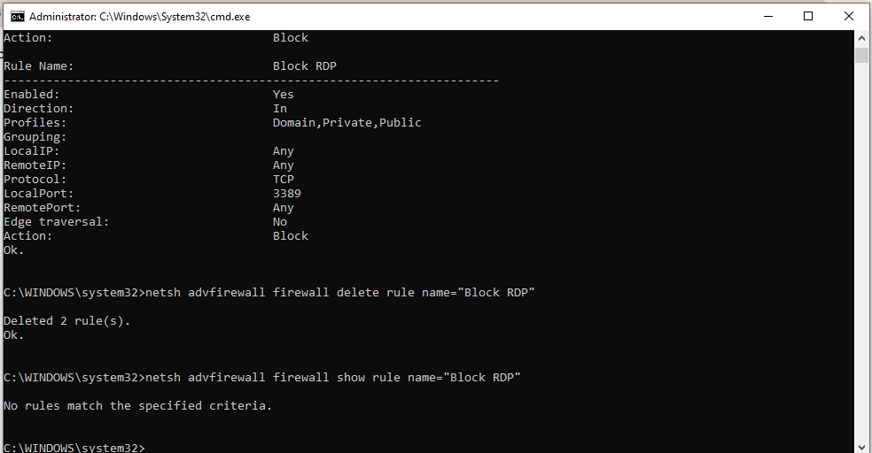<br>
  <em>Exhibit 9 — Block rule removed and confirmed gone, restoring the default allow behavior</em>
</p>

---

<a id="module-10"></a>
## 📜 Module 10 — Check RDP Event Logs

**Objective:** Review RDP session events in Event Viewer.

### Step 10 — Check RDP Event Logs ✅

```
Win + R → eventvwr.msc → Enter
→ Applications and Services Logs
→ Microsoft → Windows
→ TerminalServices-LocalSessionManager
→ Operational

Event IDs to look for:
→ Event 21 — Session logon succeeded
→ Event 22 — Shell start notification
→ Event 23 — Session logoff
→ Event 25 — Session reconnected
→ Event 40 — Session disconnected
```

<p align="center">
  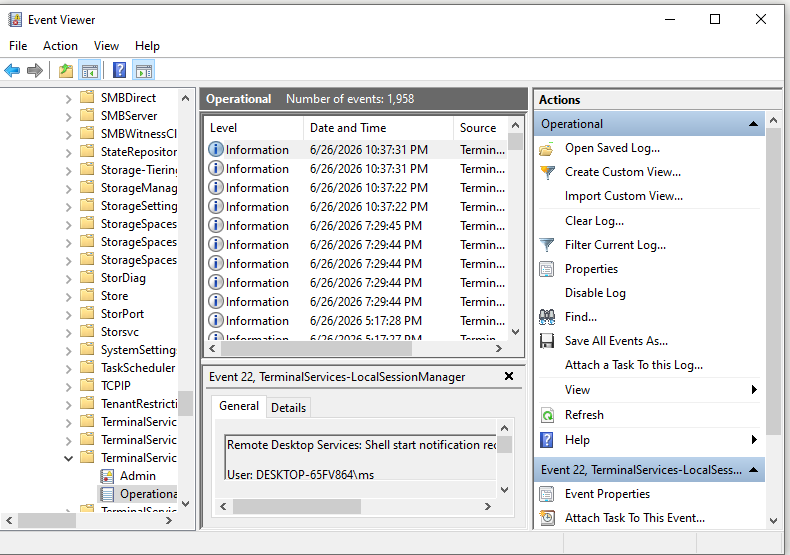<br>
  <em>Exhibit 10 — Session lifecycle events reviewed directly from the Terminal Services log</em>
</p>

---

<a id="module-11"></a>
## 🔁 Module 11 — Check RDP Service Status

**Objective:** Verify the Remote Desktop service (TermService) is running.

### Step 11 — Check RDP Service Status ✅

```
sc query TermService

→ SERVICE_NAME: TermService
→ STATE: 4 RUNNING ✅
```

<p align="center">
  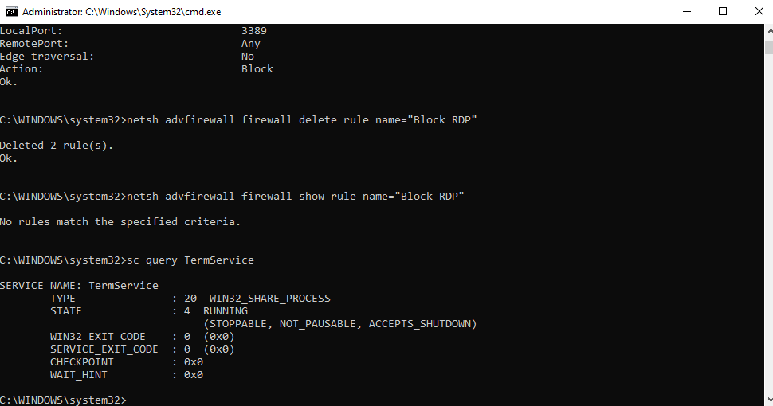<br>
  <em>Exhibit 11 — TermService confirmed running before the service fault is staged</em>
</p>

---

<a id="module-12"></a>
## 🔁 Module 12 — Simulate RDP Service Stopped

**Objective:** Stop the TermService to simulate RDP service failure.

### Step 12 — Simulate RDP Service Stopped ✅

```
net stop TermService
→ Y (confirm)

sc query TermService
→ STATE: 1 STOPPED ← RDP service down
```

<p align="center">
  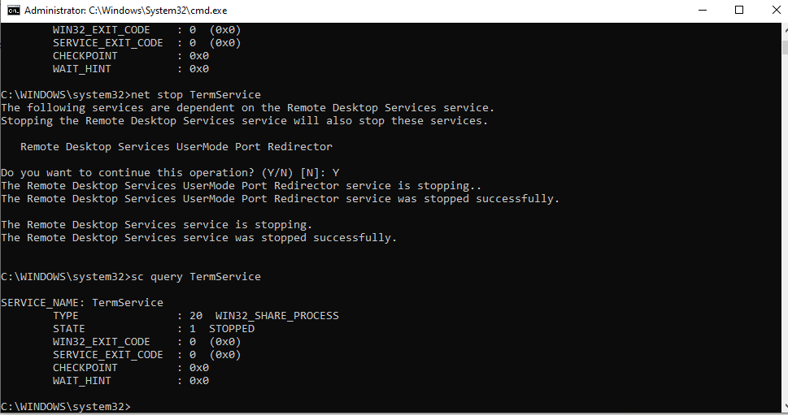<br>
  <em>Exhibit 12 — TermService stopped, reproducing a full RDP service outage</em>
</p>

---

<a id="module-13"></a>
## 🔁 Module 13 — Fix RDP Service (Restart)

**Objective:** Start the TermService again to restore RDP.

### Step 13 — Fix RDP Service — Restart ✅

```
net start TermService

sc query TermService
→ STATE: 4 RUNNING ✅
```

<p align="center">
  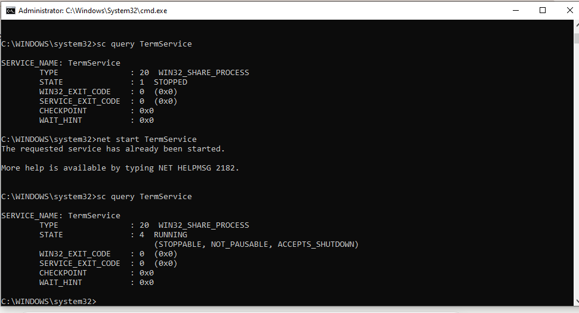<br>
  <em>Exhibit 13 — TermService restarted and confirmed running again</em>
</p>

---

<a id="module-14"></a>
## 🗝️ Module 14 — Check RDP Registry Setting

**Objective:** Verify the `fDenyTSConnections` registry value that controls RDP enable/disable.

### Step 14 — Check RDP Registry Setting ✅

```
reg query "HKLM\SYSTEM\CurrentControlSet\Control\Terminal Server" /v fDenyTSConnections

→ fDenyTSConnections = 0x0 ← RDP enabled ✅
→ If value = 0x1 → RDP disabled via registry
```

<p align="center">
  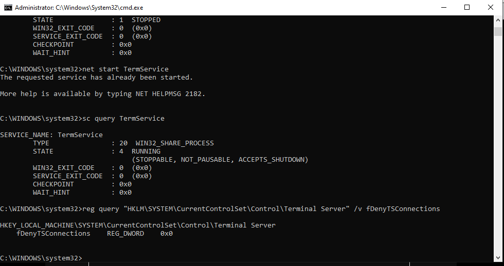<br>
  <em>Exhibit 14 — Registry confirmed enabling RDP before the registry fault is staged</em>
</p>

---

<a id="module-15"></a>
## 🗝️ Module 15 — Simulate RDP Disabled via Registry

**Objective:** Set `fDenyTSConnections` to 1 to disable RDP via registry.

### Step 15 — Simulate RDP Disabled via Registry ✅

```
reg add "HKLM\SYSTEM\CurrentControlSet\Control\Terminal Server" /v fDenyTSConnections /t REG_DWORD /d 1 /f

→ Verify:
reg query "HKLM\SYSTEM\CurrentControlSet\Control\Terminal Server" /v fDenyTSConnections
→ fDenyTSConnections = 0x1 ← RDP disabled
```

<p align="center">
  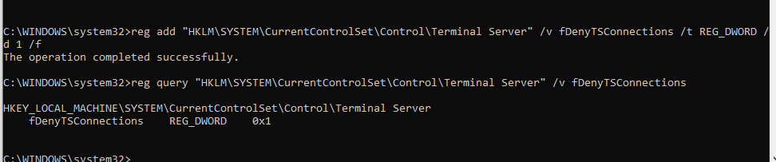<br>
  <em>Exhibit 15 — Registry key flipped to disable RDP at the OS level</em>
</p>

---

<a id="module-16"></a>
## 🗝️ Module 16 — Fix RDP Registry Setting

**Objective:** Restore `fDenyTSConnections` to 0 to re-enable RDP.

### Step 16 — Fix RDP Registry Setting ✅

```
reg add "HKLM\SYSTEM\CurrentControlSet\Control\Terminal Server" /v fDenyTSConnections /t REG_DWORD /d 0 /f

→ Verify:
reg query "HKLM\SYSTEM\CurrentControlSet\Control\Terminal Server" /v fDenyTSConnections
→ fDenyTSConnections = 0x0 ← RDP enabled ✅
```

<p align="center">
  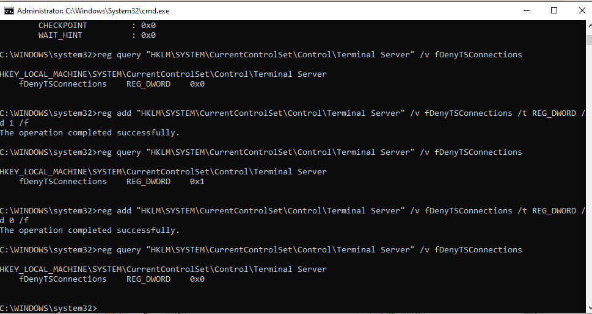<br>
  <em>Exhibit 16 — Registry key restored, re-enabling RDP</em>
</p>

---

<a id="module-17"></a>
## 🏛️ Module 17 — Check RDP Policy via Group Policy Editor

**Objective:** Verify Group Policy settings for Remote Desktop connections.

### Step 17 — Check RDP Policy via Group Policy Editor ✅

```
Win + R → gpedit.msc → Enter
→ Computer Configuration
→ Administrative Templates
→ Windows Components
→ Remote Desktop Services
→ Remote Desktop Session Host
→ Connections

→ "Allow users to connect remotely using Remote Desktop Services"
   → Set to: Enabled ✅
→ "Limit number of connections"
   → Not Configured
```

<p align="center">
  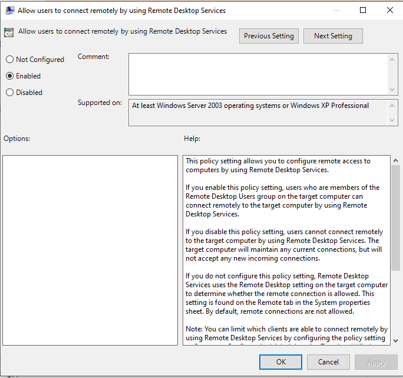<br>
  <em>Exhibit 17 — Group Policy confirmed allowing RDP connections, with no connection limit configured</em>
</p>

---

<a id="module-18"></a>
## ✅ Module 18 — Final RDP Verification via CMD

**Objective:** Run all verification commands together to confirm RDP is fully operational.

### Step 18 — Final RDP Verification via CMD ✅

```
netstat -an | find "3389"
→ LISTENING ✅

netsh advfirewall firewall show rule name="Block RDP"
→ No rules match ✅

sc query TermService
→ STATE: 4 RUNNING ✅
```

<p align="center">
  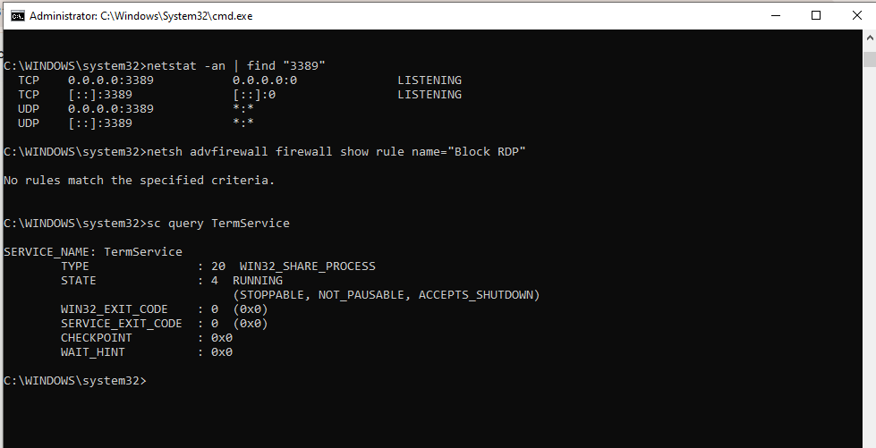<br>
  <em>Exhibit 18 — Port, firewall, and service all confirmed healthy together via CMD</em>
</p>

---

<a id="module-19"></a>
## ✅ Module 19 — PowerShell RDP Troubleshooting

**Objective:** Use PowerShell to verify RDP status, service, and firewall rules.

### Step 19 — PowerShell RDP Troubleshooting ✅

```powershell
# Check RDP registry status
Get-ItemProperty "HKLM:\SYSTEM\CurrentControlSet\Control\Terminal Server" -Name fDenyTSConnections

# Check RDP service
Get-Service TermService | Select Name, Status, StartType

# Check firewall RDP rules
Get-NetFirewallRule | Where-Object {$_.DisplayName -like "*Remote Desktop*"} | Select DisplayName, Enabled, Action
```

<p align="center">
  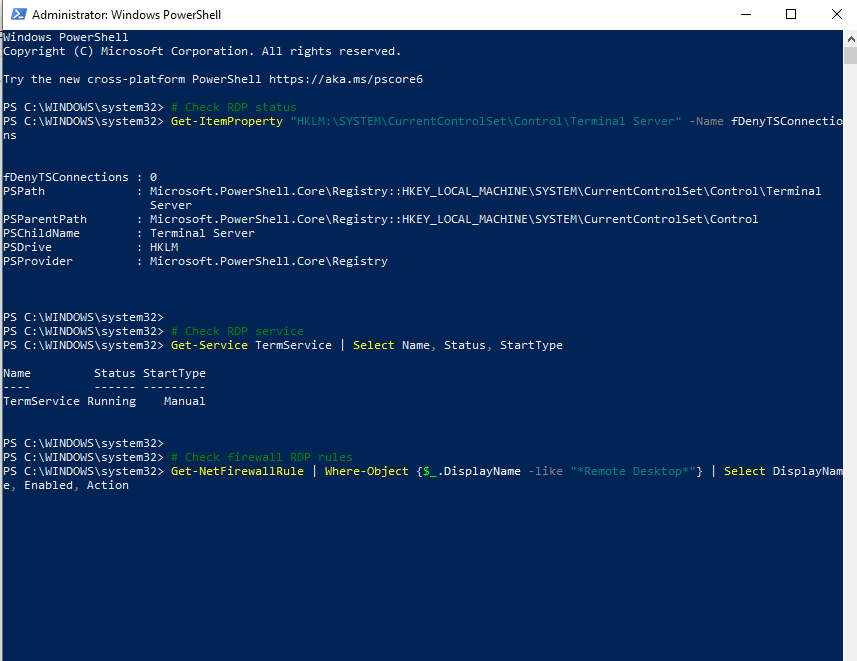<br>
  <em>Exhibit 19 — Registry, service, and firewall state cross-checked together in PowerShell</em>
</p>

---

<a id="module-20"></a>
## ✅ Module 20 — Final Verification & Summary

**Objective:** Confirm all RDP components are healthy.

### Step 20 — Final Verification & Summary ✅

```
netstat -an | find "3389"
→ 0.0.0.0:3389 LISTENING ✅

sc query TermService
→ STATE: 4 RUNNING ✅

reg query "HKLM\SYSTEM\CurrentControlSet\Control\Terminal Server" /v fDenyTSConnections
→ fDenyTSConnections = 0x0 ✅
```

<p align="center">
  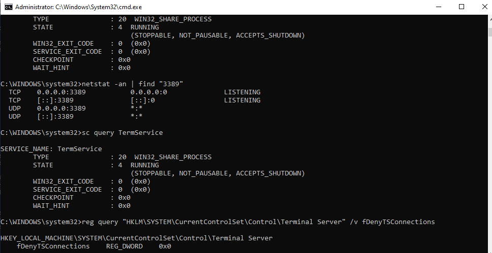<br>
  <em>Exhibit 20 — Port, service, and registry state all confirmed healthy at lab close</em>
</p>

---

<a id="coverage-snapshot"></a>
## 🌟 Coverage Snapshot

| 🛡️ Layer | ✅ Status | 📌 Detail |
|---|---|---|
| RDP enabled | Live | Enabled via System Properties (Exhibit 1) |
| Port 3389 baseline | Proven | Confirmed listening on IPv4 and IPv6 (Exhibit 2) |
| Target IP confirmed | Proven | Connection IP identified via ipconfig (Exhibit 3) |
| Console session error reproduced | Proven | Existing-session conflict demonstrated (Exhibit 4) |
| Invalid IP error reproduced | Proven | Unreachable-host error demonstrated (Exhibit 5) |
| Firewall allow rule confirmed | Proven | Default RDP rule verified healthy (Exhibit 6) |
| Firewall block staged | Live | Custom block rule added on port 3389 (Exhibit 7) |
| Firewall block diagnosed | Proven | Block rule identified as root cause (Exhibit 8) |
| Firewall block fixed | Proven | Block rule deleted and confirmed gone (Exhibit 9) |
| RDP event logs reviewed | Proven | Session lifecycle events read from Event Viewer (Exhibit 10) |
| Service baseline confirmed | Proven | TermService running before fault staged (Exhibit 11) |
| Service failure staged | Live | TermService stopped (Exhibit 12) |
| Service failure fixed | Proven | TermService restarted and confirmed running (Exhibit 13) |
| Registry baseline confirmed | Proven | fDenyTSConnections confirmed 0x0 (Exhibit 14) |
| Registry fault staged | Live | fDenyTSConnections set to 0x1 (Exhibit 15) |
| Registry fault fixed | Proven | fDenyTSConnections restored to 0x0 (Exhibit 16) |
| Group Policy checked | Proven | Connections policy confirmed allowing RDP (Exhibit 17) |
| CMD verification pass | Proven | Port, firewall, service confirmed together (Exhibit 18) |
| PowerShell verification pass | Proven | Registry, service, firewall cross-checked (Exhibit 19) |
| Final verification | Proven | All components confirmed healthy at close (Exhibit 20) |

---

<a id="command-summary"></a>
## 📟 Command Summary

| Command | Purpose |
|---------|---------|
| `netstat -an \| find "3389"` | Verify RDP port 3389 is listening |
| `sc query TermService` | Check RDP service status |
| `net stop TermService` | Stop RDP service |
| `net start TermService` | Start RDP service |
| `netsh advfirewall firewall show rule` | View firewall rules |
| `netsh advfirewall firewall add rule` | Add firewall rule |
| `netsh advfirewall firewall delete rule` | Delete firewall rule |
| `reg query` | Query registry value |
| `reg add` | Add or modify registry value |
| `mstsc /v:<ip>` | Connect via RDP |
| `mstsc /v:<ip> /admin` | Connect via RDP, bypassing console session |
| `gpedit.msc` | Open Group Policy Editor |
| `eventvwr.msc` | Open Event Viewer |
| `Get-Service TermService` | PowerShell — check RDP service |
| `Get-NetFirewallRule` | PowerShell — list firewall rules |

---

<a id="challenges-fixes"></a>
## ⚠️ Challenges & Fixes

| ❌ Challenge | ✅ Solution |
|---|---|
| RDP console session conflict error | Used the `/admin` flag to bypass — identified as an existing-session issue, not a fault |
| Wrong IP RDP error | Verified the correct IP via `ipconfig` before attempting the connection |
| Firewall blocking RDP silently | Used `netsh` to list rules — found the custom `Block RDP` rule on port 3389 |
| TermService stopped — RDP unavailable | Used `sc query` to diagnose, `net start` to restore the service |
| RDP disabled via registry | Queried `fDenyTSConnections` — found value `0x1`, corrected to `0x0` |
| Group Policy restricting connections | Checked the `gpedit.msc` Connections folder — confirmed "Allow remote connections" was enabled |

---

<a id="scope-limitations"></a>
## 🚧 Scope & Limitations

- **Single machine, no domain:** all checks ran locally via `gpedit.msc`; no Active Directory-based GPO push or domain controller was involved.
- **No VPN component actually configured:** despite the lab title, this run focuses on local RDP failure points — VPN tunnel setup and VPN-specific failures (split tunneling, IPSec/PPTP negotiation, client profiles) are out of scope here.
- **Faults staged sequentially:** each of the six issues was introduced, diagnosed, and fixed one at a time so cause and effect stay clearly attributable.
- **No actual remote host used for the successful case:** the console-session and wrong-IP errors were reproduced against the local machine and a deliberately invalid address, not a second physical or virtual host.
- **Registry and Group Policy edits are local-only:** no centrally managed policy or registry deployment (SCCM, Intune, Group Policy push) was tested.

These limits are stated so the lab is read as a local Windows RDP fundamentals exercise, not a full VPN or domain-managed remote access deployment.

---

<a id="what-i-learned"></a>
## 🧠 What I Learned

- **RDP failures cluster into a small number of layers**, and checking them in order — enabled, reachable, firewall, service, registry, policy — turns a vague "can't connect" ticket into a fast elimination process.
- **A console-session error isn't a bug to fix**, it's expected behavior when the target machine already has an active local logon — recognizing that saves time that would otherwise go into chasing a non-issue.
- **A firewall block can look identical to a stopped service from the client side.** Only checking the actual rule set (`netsh advfirewall firewall show rule`) tells you which one you're actually dealing with.
- **The registry and Group Policy can both independently disable RDP**, and they don't always agree with what System Properties shows — `fDenyTSConnections` is the actual source of truth at the OS level.
- **Verifying with two tools instead of one (CMD and PowerShell) catches gaps** — a rule or service state that looks fine in one view can reveal more detail in the other, like `Get-NetFirewallRule` surfacing every RDP-named rule instead of one specific one.

---

<a id="skills-demonstrated"></a>
## 🛠️ Skills Demonstrated

- Enabling and verifying Remote Desktop through System Properties and `netstat`
- Reproducing and correctly interpreting common RDP client errors (console session, invalid host)
- Managing Windows Firewall rules with `netsh advfirewall` — inspecting, adding, and deleting
- Reading RDP session lifecycle events in Event Viewer (`TerminalServices-LocalSessionManager`)
- Diagnosing and restoring the `TermService` Windows service
- Querying and modifying the `fDenyTSConnections` registry value safely
- Verifying Remote Desktop policy through the Group Policy Editor
- Cross-verifying system state using both CMD and PowerShell

---

<a id="screenshot-index"></a>
## 🖼️ Screenshot Index

| # | File | Shows |
|:---:|---|---|
| 1 | `01-enable-rdp.PNG` | RDP enabled via System Properties |
| 2 | `02-rdp-port-verify.PNG` | Port 3389 confirmed listening |
| 3 | `03-ipconfig-rdp.PNG` | Target IP confirmed |
| 4 | `04-rdp-console-error.PNG` | Console session error reproduced |
| 5 | `05-rdp-connection-failed.PNG` | Invalid IP error reproduced |
| 6 | `06-firewall-rdp-rule.PNG` | Default firewall allow rule confirmed |
| 7 | `07-firewall-block-rdp.PNG` | Custom block rule staged |
| 8 | `08-firewall-diagnose.PNG` | Block rule diagnosed as cause |
| 9 | `09-firewall-fix.PNG` | Block rule removed |
| 10 | `10-rdp-event-logs.PNG` | RDP session events reviewed |
| 11 | `11-rdp-service-status.PNG` | TermService confirmed running |
| 12 | `12-rdp-service-stopped.PNG` | TermService stopped |
| 13 | `13-rdp-service-fixed.PNG` | TermService restarted |
| 14 | `14-rdp-registry.PNG` | Registry confirmed RDP enabled |
| 15 | `15-rdp-registry-disabled.PNG` | Registry fault staged |
| 16 | `16-rdp-registry-fixed.PNG` | Registry fault fixed |
| 17 | `17-rdp-group-policy.PNG` | Group Policy confirmed allowing RDP |
| 18 | `18-final-rdp-verify.PNG` | CMD verification pass |
| 19 | `19-powershell-rdp.PNG` | PowerShell verification pass |
| 20 | `20-final-verification.PNG` | Final full-stack verification |

---

<a id="repo-structure"></a>
## 📁 Repo Structure

```text
03-IT-Support-Troubleshooting/07-Remote-Desktop-VPN-Troubleshooting/
|-- README.md
`-- screenshots/
    |-- 01-enable-rdp.PNG
    |-- 02-rdp-port-verify.PNG
    |-- 03-ipconfig-rdp.PNG
    |-- 04-rdp-console-error.PNG
    |-- 05-rdp-connection-failed.PNG
    |-- 06-firewall-rdp-rule.PNG
    |-- 07-firewall-block-rdp.PNG
    |-- 08-firewall-diagnose.PNG
    |-- 09-firewall-fix.PNG
    |-- 10-rdp-event-logs.PNG
    |-- 11-rdp-service-status.PNG
    |-- 12-rdp-service-stopped.PNG
    |-- 13-rdp-service-fixed.PNG
    |-- 14-rdp-registry.PNG
    |-- 15-rdp-registry-disabled.PNG
    |-- 16-rdp-registry-fixed.PNG
    |-- 17-rdp-group-policy.PNG
    |-- 18-final-rdp-verify.PNG
    |-- 19-powershell-rdp.PNG
    `-- 20-final-verification.PNG
```

<div align="center">

🖥️ **[RDP Overview](https://learn.microsoft.com/en-us/windows-server/remote/remote-desktop-services/welcome-to-rds)** · 🧱 **[netsh advfirewall Reference](https://learn.microsoft.com/en-us/windows-server/networking/technologies/netsh/netsh-advfirewall-firewall-control-firewall-behavior)** · 🗝️ **[fDenyTSConnections Documentation](https://learn.microsoft.com/en-us/windows/win32/termserv/fdenytsconnections)**

</div>
