<div align="center">

# 🩺 System Diagnostics & Desktop Support

**IT Support & Troubleshooting Lab 08 — Cisco Networking Lab Portfolio**

High CPU/RAM Usage, Driver Failures, Application Crashes, Corrupted System Files, and BSOD Analysis on Windows 10/11 — Task Manager, Event Viewer, Device Manager, Reliability Monitor, SFC/DISM, and Minidump Analysis


Twenty steps run end-to-end on a Windows 10/11 machine, working outward from the symptom a user actually reports — "it's slow," "this app keeps crashing," "the screen went blue" — into the specific subsystem responsible: CPU/RAM load, startup bloat, driver faults, corrupted system files, memory or disk failure, and BSOD stop codes. Every diagnostic uses tools built into Windows — no third-party utilities.

</div>

---

## 📑 Table of Contents

1. [At a Glance](#at-a-glance)
2. [Project Background](#project-background)
3. [Tools & Technologies](#tools-technologies)
4. [Lab Environment](#lab-environment)
5. [Diagnostic Toolkit Map](#diagnostic-toolkit-map)
6. [Simulated Issues](#simulated-issues)
7. [Escalation Path](#escalation-path)
8. [Module 1 — Check Resource Usage in Task Manager](#module-1)
9. [Module 2 — Identify High CPU Process](#module-2)
10. [Module 3 — Check Startup Programs](#module-3)
11. [Module 4 — Resource Monitor Deep Analysis](#module-4)
12. [Module 5 — Open Event Viewer](#module-5)
13. [Module 6 — Filter Critical & Error Events](#module-6)
14. [Module 7 — Investigate a Specific Event ID](#module-7)
15. [Module 8 — Check Reliability Monitor](#module-8)
16. [Module 9 — Find Driver Issues in Device Manager](#module-9)
17. [Module 10 — Fix a Driver Issue](#module-10)
18. [Module 11 — Check Driver Details via PowerShell](#module-11)
19. [Module 12 — Run System File Checker (SFC)](#module-12)
20. [Module 13 — Run DISM to Repair Windows Image](#module-13)
21. [Module 14 — Investigate Application Crash](#module-14)
22. [Module 15 — Check Memory for Errors](#module-15)
23. [Module 16 — Check Disk Health](#module-16)
24. [Module 17 — Review BSOD Information](#module-17)
25. [Module 18 — Enable & Read Minidump Files](#module-18)
26. [Module 19 — Generate a System Health Report](#module-19)
27. [Module 20 — Final Verification & Documentation](#module-20)
28. [Coverage Snapshot](#coverage-snapshot)
29. [Command Summary](#command-summary)
30. [Challenges & Fixes](#challenges-fixes)
31. [Scope & Limitations](#scope-limitations)
32. [What I Learned](#what-i-learned)
33. [Skills Demonstrated](#skills-demonstrated)
34. [Screenshot Index](#screenshot-index)
35. [Repo Structure](#repo-structure)

---

<a id="at-a-glance"></a>
## 📊 At a Glance

<div align="center">

| 🖥️ Machines | 🐛 Fault Categories | 🔧 Diagnostic Tools | 🩹 Repairs Run | 🖼️ Screenshots |
|:---:|:---:|:---:|:---:|:---:|
| **1 (Windows 10/11)** | **5 (CPU/RAM, driver, app crash, BSOD, file corruption)** | **8** | **SFC, DISM, driver fix** | **21** |

</div>

---

<a id="project-background"></a>
## 📖 Project Background

This lab starts where a real desktop-support ticket starts — a vague symptom — and narrows it down using Windows' own tools rather than guessing. "PC is slow" leads into Task Manager and Resource Monitor; "an app keeps crashing" leads into Event Viewer's Application log and a specific Event ID; "the screen went blue" leads into the System log's Critical events and, if needed, minidump analysis in WinDbg. Corrupted system files get their own path through SFC and, when that's not enough, DISM. Every fault category ends with the same discipline: identify the exact cause before touching anything, then verify the fix actually worked.

| Module Group | Focus |
|---|---|
| 📈 **Resource Baseline (Modules 1–4)** | Task Manager, high-CPU process ID, startup bloat, Resource Monitor deep-dive |
| 📜 **Event & Reliability Review (Modules 5–8)** | Event Viewer, critical/error filtering, Event ID lookup, Reliability Monitor timeline |
| 🔌 **Driver Diagnostics (Modules 9–11)** | Device Manager fault icons, driver update/rollback/reinstall, PowerShell driver audit |
| 🧰 **System File & Image Repair (Modules 12–13)** | `sfc /scannow`, then `DISM /RestoreHealth` if SFC can't finish the job |
| 💥 **App Crash & Hardware Checks (Modules 14–16)** | Application Error Event ID 1000, memory diagnostic, disk health |
| 🟦 **BSOD Analysis (Modules 17–18)** | Stop code lookup in Event Viewer, minidump capture and WinDbg analysis |
| ✅ **Reporting & Verification (Modules 19–20)** | Full system diagnostics report, final cross-tool health check |

> [!NOTE]
> No fault in this lab is destructively staged — every "issue" is investigated on whatever state the machine is actually in (existing driver warnings, real event log entries, real SFC/DISM output) rather than artificially broken first. This mirrors how desktop support actually works: you diagnose the system as you find it.

---

<a id="tools-technologies"></a>
## 🛠️ Tools & Technologies

| Tool | Purpose |
|------|---------|
| 📊 Task Manager | Monitor CPU, RAM, disk, and process usage |
| 📜 Event Viewer | View system, application, and security logs |
| 🔌 Device Manager | Identify and fix driver issues |
| 🔍 Resource Monitor | Deep-dive process and resource analysis |
| 📈 Reliability Monitor | Timeline of system errors and crashes |
| ⚙️ System Configuration (`msconfig`) | Manage startup and boot options |
| ⌨️ CMD / PowerShell | Command-line diagnostics and repairs |
| 🧰 SFC / DISM | System file and image repair |

---

<a id="lab-environment"></a>
## 🖧 Lab Environment


| Item | Detail |
|------|--------|
| OS | Windows 10 or 11 |
| Device | Physical PC or VM |
| Internet Access | Optional — only needed for driver downloads and DISM's online repair source |

---

<a id="diagnostic-toolkit-map"></a>
## 🗺️ Diagnostic Toolkit Map

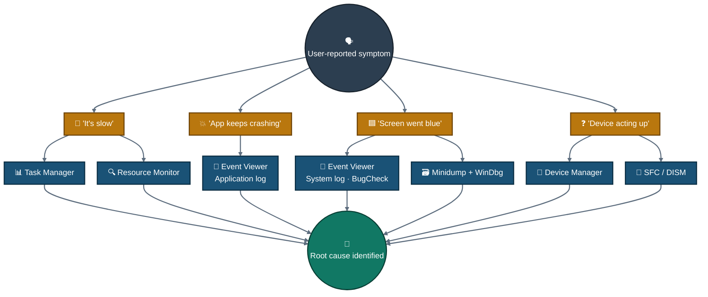
<p align="center"><em>One reported symptom fans out into the tool that actually diagnoses it — several symptoms share tools, and every path converges back on identifying a root cause before any fix is applied.</em></p>

---

<a id="simulated-issues"></a>
## 🐛 Simulated Issues

| # | Issue | Type |
|---|-------|------|
| 1 | PC running very slow | High CPU / RAM usage |
| 2 | Unknown device in Device Manager | Missing/corrupt driver |
| 3 | Application crash on startup | OS / app error |
| 4 | Blue Screen of Death (BSOD) entry in logs | Critical system error |
| 5 | Corrupted system files | Windows image integrity |

---

<a id="escalation-path"></a>
## 🔧 Escalation Path

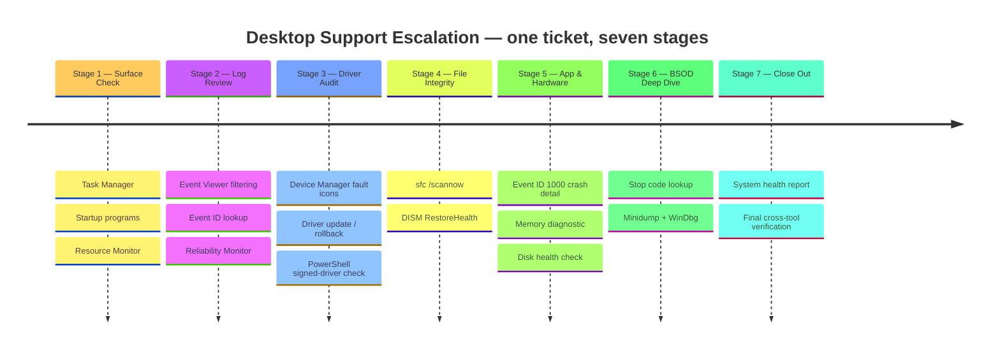
<p align="center"><em>A Mermaid timeline instead of a flowchart — seven escalation stages read left to right, each one listing the specific checks that belong to it.</em></p>

---

<a id="module-1"></a>
## 📈 Module 1 — Check Resource Usage in Task Manager

**Objective:** Open Task Manager to identify what is consuming system resources.

### Step 1 — Open Task Manager & Check Resource Usage ✅

```
Right-click Taskbar → Task Manager
  OR
Press: Ctrl + Shift + Esc

→ Click "More details" if compact view shows
→ Go to: Performance tab → observe CPU, Memory, Disk, Network usage
→ Go to: Processes tab → sort by CPU or Memory (click column header)
→ Identify any process using abnormally high resources
```

<p align="center">
  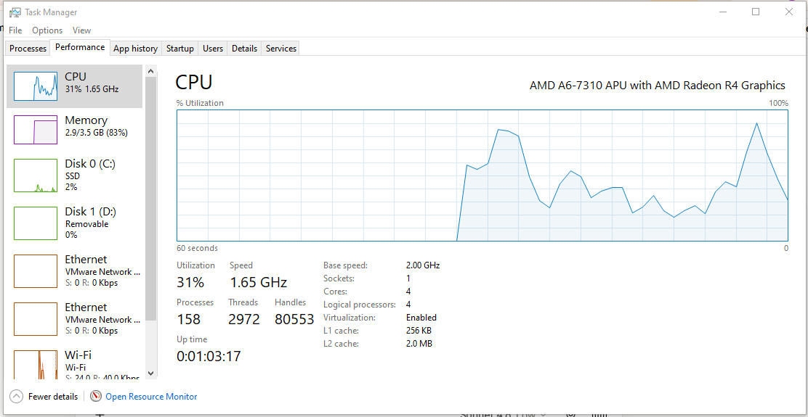<br>
  <em>Exhibit 1 — System-wide CPU, memory, disk, and network usage reviewed as the diagnostic baseline</em>
</p>

---

<a id="module-2"></a>
## 📈 Module 2 — Identify High CPU Process

**Objective:** Find which process is causing high CPU usage.

### Step 2 — Identify High CPU Process ✅

```
Task Manager → Processes tab
→ Click "CPU" column header to sort descending
→ Look for process at top consuming high %
→ Right-click suspicious process → "Open file location"
→ Right-click suspicious process → "Search online" (to verify if legit)
→ If malicious or unnecessary: Right-click → "End Task"
```

<p align="center">
  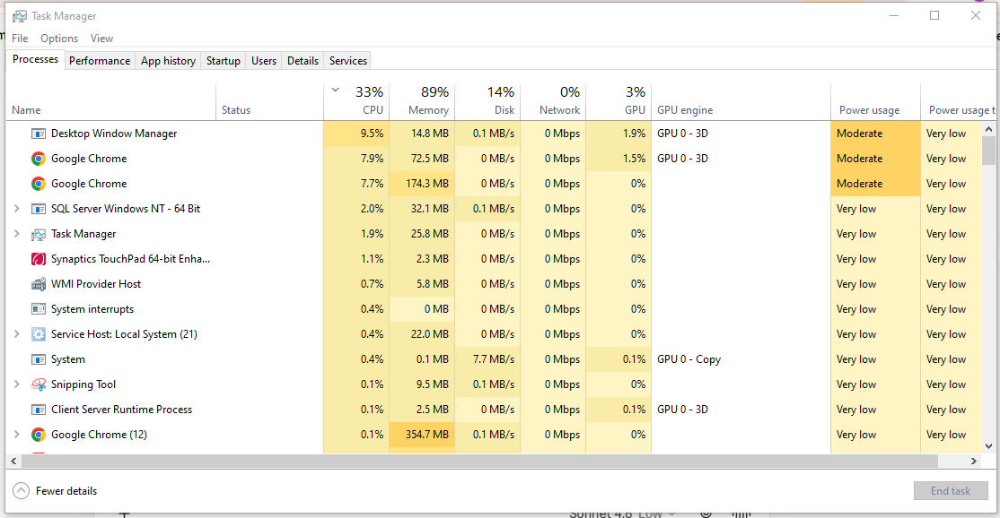<br>
  <em>Exhibit 2 — Top CPU consumer isolated and verified before deciding whether to end it</em>
</p>

---

<a id="module-3"></a>
## 📈 Module 3 — Check Startup Programs

**Objective:** Disable unnecessary startup programs that slow boot time.

### Step 3 — Check Startup Programs ✅

```
Task Manager → Startup tab
→ Review list of programs set to run at startup
→ Check "Startup impact" column (High / Medium / Low)
→ Right-click any unnecessary high-impact program → Disable

  OR via System Configuration:
  Win + R → type: msconfig → Enter
  → Startup tab → Open Task Manager (links to same view)
```

<p align="center">
  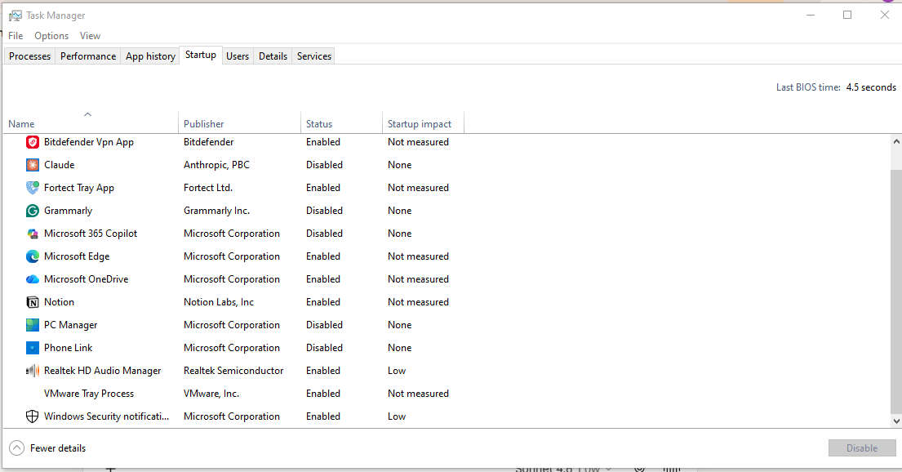<br>
  <em>Exhibit 3 — Startup impact reviewed and unnecessary high-impact entries identified</em>
</p>

---

<a id="module-4"></a>
## 📈 Module 4 — Resource Monitor Deep Analysis

**Objective:** Use Resource Monitor for a more detailed view of resource consumption.

### Step 4 — Open Resource Monitor for Deep Analysis ✅

```
Task Manager → Performance tab → "Open Resource Monitor" (bottom link)
  OR
Win + R → type: resmon → Enter

→ CPU tab: shows per-process CPU threads and handles
→ Memory tab: shows Working Set, Commit, and Shareable per process
→ Disk tab: shows read/write per process and file being accessed
→ Network tab: shows active connections per process
```

<p align="center">
  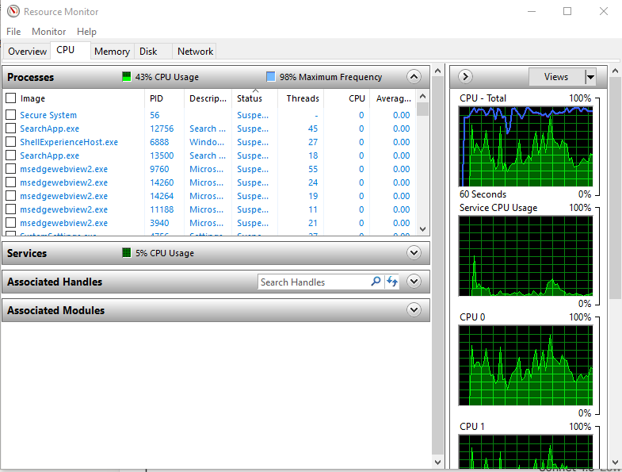<br>
  <em>Exhibit 4 — Per-process CPU, memory, disk, and network detail reviewed beyond what Task Manager shows</em>
</p>

---

<a id="module-5"></a>
## 📜 Module 5 — Open Event Viewer

**Objective:** Open Event Viewer to check system and application logs for errors.

### Step 5 — Open Event Viewer ✅

```
Win + R → type: eventvwr.msc → Enter
  OR
Right-click Start → Event Viewer

→ Expand: Windows Logs
   → Application  (app crashes, errors)
   → System       (driver failures, OS errors)
   → Security     (login events, audit logs)
```

<p align="center">
  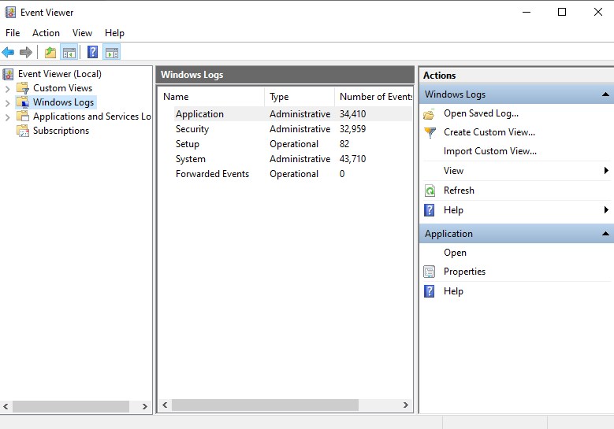<br>
  <em>Exhibit 5 — Event Viewer opened and the three core Windows Logs reviewed</em>
</p>

---

<a id="module-6"></a>
## 📜 Module 6 — Filter Critical & Error Events

**Objective:** Filter logs to find only critical errors — ignore informational noise.

### Step 6 — Filter Critical & Error Events ✅

```
Event Viewer → Windows Logs → System
→ Right-click "System" → Filter Current Log
→ Event level: check ✅ Critical  ✅ Error
→ Click OK

→ Review filtered list
→ Click any event to read:
   - Event ID
   - Source
   - Description
   - Date/Time
```

<p align="center">
  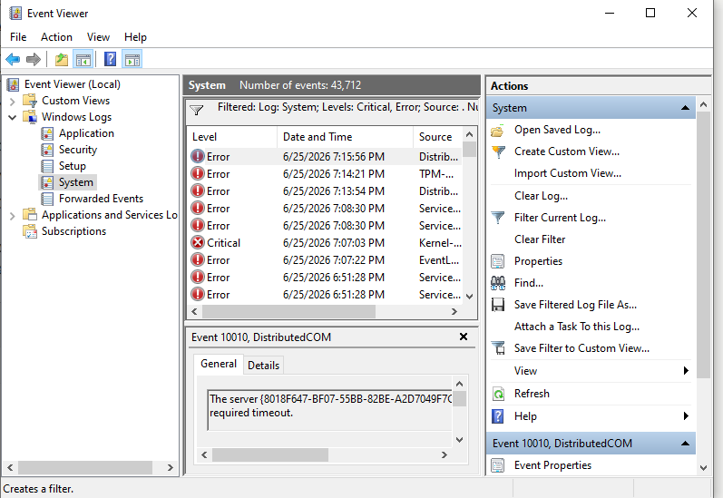<br>
  <em>Exhibit 6 — System log filtered to Critical and Error levels only, cutting out informational noise</em>
</p>

---

<a id="module-7"></a>
## 📜 Module 7 — Investigate a Specific Event ID

**Objective:** Understand what a specific Event ID means.

### Step 7 — Investigate a Specific Event ID ✅

```
Example — Common Event IDs:
| Event ID | Meaning |
|----------|---------|
| 41        | Kernel-Power — unexpected shutdown / BSOD |
| 6008      | Unexpected shutdown |
| 1000      | Application crash (App Error) |
| 7034      | Service crashed unexpectedly |
| 10016     | DCOM permission error |

→ Note the Event ID from the log
→ Right-click event → "Attach Task to This Event" (to alert on recurrence)
  OR search: "Event ID XXXX" online for KB articles
```

<p align="center">
  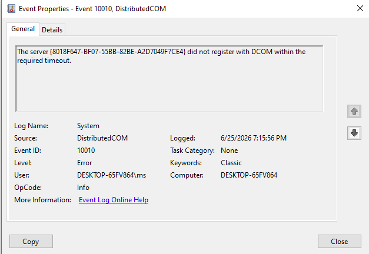<br>
  <em>Exhibit 7 — A specific Event ID looked up and matched against its known meaning</em>
</p>

---

<a id="module-8"></a>
## 📜 Module 8 — Check Reliability Monitor

**Objective:** Reliability Monitor shows a visual timeline of crashes, errors, and installs.

### Step 8 — Check Reliability Monitor ✅

```
Win + R → type: perfmon /rel → Enter
  OR
Control Panel → Security and Maintenance → Reliability Monitor

→ View the stability index graph (1–10 scale)
→ Click any red X (Critical) or yellow triangle (Warning) on the timeline
→ Bottom pane shows: problem signature, date, application involved
→ Click "View technical details" for full crash info
→ Click "Check for solution" to query Microsoft KB
```

<p align="center">
  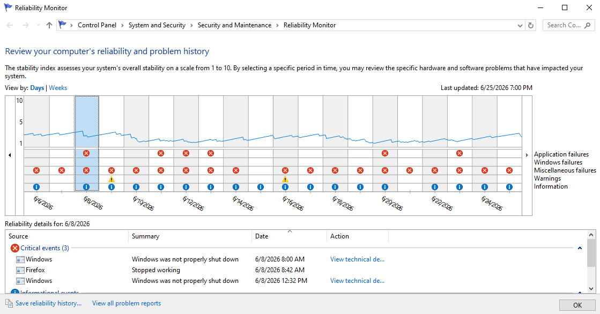<br>
  <em>Exhibit 8 — Stability index timeline reviewed for a visual history of crashes and installs</em>
</p>

---

<a id="module-9"></a>
## 🔌 Module 9 — Find Driver Issues in Device Manager

**Objective:** Identify devices with missing, corrupted, or outdated drivers.

### Step 9 — Open Device Manager & Find Driver Issues ✅

```
Win + X → Device Manager
  OR
Win + R → type: devmgmt.msc → Enter

→ Look for devices with:
   ⚠️  Yellow triangle  = driver error / missing driver
   ❌  Red X            = device disabled
   ❓  Unknown device   = no driver installed

→ Click "View" menu → "Show hidden devices" (reveals ghost devices)
→ Expand any category to inspect individual devices
```

<p align="center">
  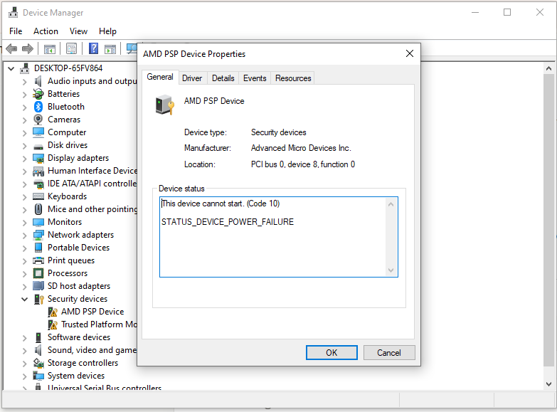<br>
  <em>Exhibit 9 — Device tree reviewed for fault icons, including hidden/ghost devices</em>
</p>

---

<a id="module-10"></a>
## 🔌 Module 10 — Fix a Driver Issue

**Objective:** Update, roll back, or reinstall a faulty driver.

### Step 10 — Fix a Driver Issue ✅

```
Device Manager → Right-click the problematic device

Option A — Update Driver:
→ "Update driver" → "Search automatically for drivers"
→ If not found: "Browse my computer" → point to downloaded .inf file

Option B — Roll Back Driver (if issue started after update):
→ Right-click device → Properties → Driver tab
→ "Roll Back Driver" (grayed out if no previous version)

Option C — Uninstall & Reinstall:
→ Right-click device → "Uninstall device"
→ Check: "Delete the driver software for this device"
→ Action menu → "Scan for hardware changes" (reinstalls fresh)
```

<p align="center">
  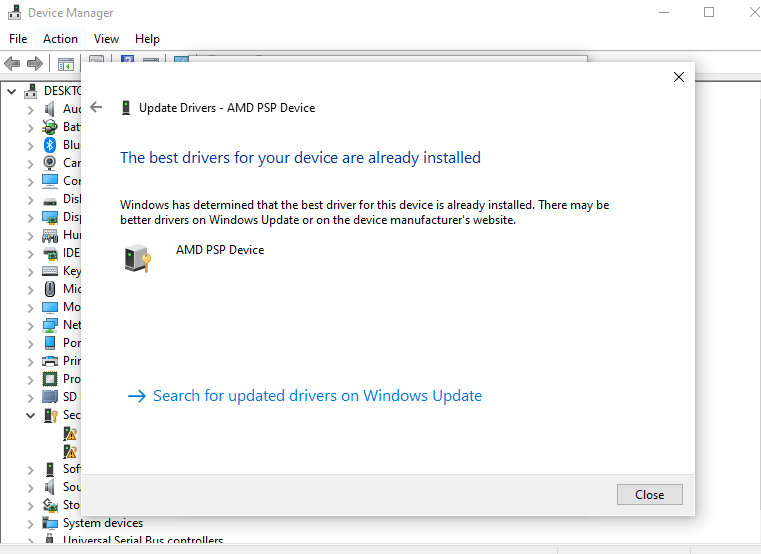<br>
  <em>Exhibit 10 — Three driver repair paths available depending on how the fault developed</em>
</p>

---

<a id="module-11"></a>
## 🔌 Module 11 — Check Driver Details via PowerShell

**Objective:** List all installed drivers and spot unsigned or problematic ones.

### Step 11 — Check Driver Details via PowerShell ✅

```powershell
# List all installed drivers
Get-WmiObject Win32_PnPSignedDriver | Select DeviceName, DriverVersion, Manufacturer | Format-Table

# Check for unsigned drivers specifically
Get-WmiObject Win32_PnPSignedDriver | Where-Object {$_.IsSigned -eq $false} | Select DeviceName, Manufacturer

# Check driver version for a specific device (e.g. display)
Get-WmiObject Win32_PnPSignedDriver | Where-Object {$_.DeviceName -like "*Display*"} | Select DeviceName, DriverVersion
```

<p align="center">
  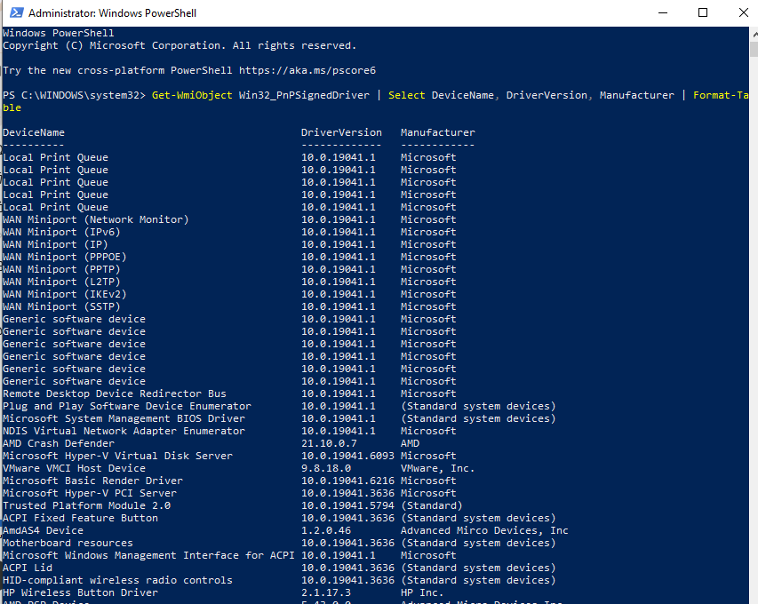<br>
  <em>Exhibit 11 — Full driver inventory cross-checked for unsigned entries via PowerShell</em>
</p>

---

<a id="module-12"></a>
## 🧰 Module 12 — Run System File Checker (SFC)

**Objective:** Scan and repair corrupted Windows system files.

### Step 12 — Run System File Checker (SFC) ✅

```
Open CMD as Administrator:
  Win + S → type: cmd → Right-click → "Run as administrator"

Run SFC:
  sfc /scannow

→ Wait for scan to complete (5–10 minutes)
→ Possible results:
   ✅ "Windows Resource Protection did not find any integrity violations."
   🔧 "Windows Resource Protection found corrupt files and successfully repaired them."
   ❌ "Windows Resource Protection found corrupt files but was unable to fix some of them."
      → If this: run DISM next (Step 13)
```

<p align="center">
  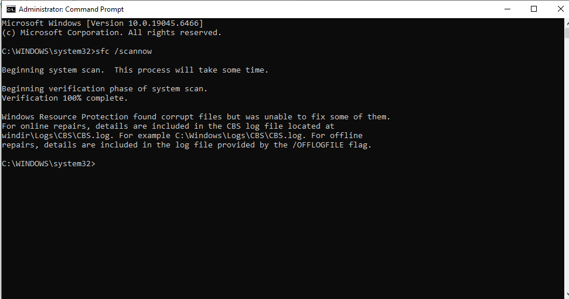<br>
  <em>Exhibit 12 — System file integrity scanned and repaired where possible</em>
</p>

---

<a id="module-13"></a>
## 🧰 Module 13 — Run DISM to Repair Windows Image

**Objective:** If SFC couldn't fix files, use DISM to repair the Windows component store.

### Step 13 — Run DISM to Repair Windows Image ✅

```
CMD (Administrator):

# Step 1 — Check image health
DISM /Online /Cleanup-Image /CheckHealth

# Step 2 — Scan for corruption
DISM /Online /Cleanup-Image /ScanHealth

# Step 3 — Repair the image (downloads from Windows Update)
DISM /Online /Cleanup-Image /RestoreHealth

→ After DISM completes, run SFC again:
sfc /scannow
```

<p align="center">
  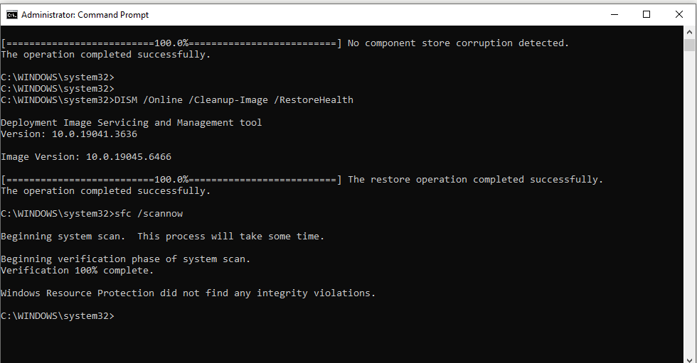<br>
  <em>Exhibit 13 — Windows component store checked, scanned, and repaired via DISM</em>
</p>

---

<a id="module-14"></a>
## 💥 Module 14 — Investigate Application Crash

**Objective:** Find the root cause of a specific application that keeps crashing.

### Step 14 — Investigate Application Crash ✅

```
Event Viewer → Windows Logs → Application
→ Filter: Level = Error
→ Source = "Application Error"
→ Look for Event ID 1000

→ Read the details:
   - Faulting application name (which app crashed)
   - Faulting module name (which DLL/component caused it)
   - Exception code (e.g. 0xc0000005 = Access Violation)

Common exception codes:
| Code       | Meaning |
|------------|---------|
| 0xc0000005 | Access violation (memory issue) |
| 0xc000007b | Wrong architecture (32-bit vs 64-bit DLL mismatch) |
| 0xe0434352 | .NET CLR crash |
| 0x80000003 | Breakpoint hit (debug code left in release) |
```

<p align="center">
  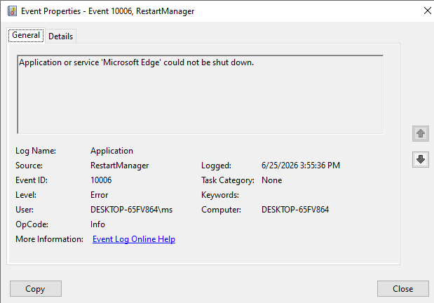<br>
  <em>Exhibit 14 — Faulting application, module, and exception code identified from Event ID 1000</em>
</p>

---

<a id="module-15"></a>
## 💥 Module 15 — Check Memory for Errors

**Objective:** Run Windows Memory Diagnostic to test RAM for faults.

### Step 15 — Check Memory for Errors ✅

```
Win + R → type: mdsched.exe → Enter
→ "Restart now and check for problems"
→ PC reboots and runs memory test automatically
→ After reboot, results appear in:
   Event Viewer → Windows Logs → System
   → Source: MemoryDiagnostics-Results
   → Event ID: 1201 (pass) or 1101 (fail / errors found)

  OR in CMD:
  wevtutil qe System "/q:*[System[Provider[@Name='Microsoft-Windows-MemoryDiagnostics-Results']]]" /f:text /c:1
```

<p align="center">
  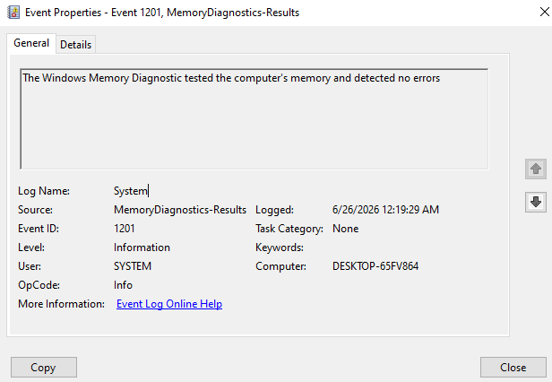<br>
  <em>Exhibit 15 — RAM tested via the built-in memory diagnostic, with results read back from Event Viewer</em>
</p>

---

<a id="module-16"></a>
## 💥 Module 16 — Check Disk Health

**Objective:** Verify disk health to rule out storage as the cause of errors.

### Step 16 — Check Disk Health ✅

```
CMD (Administrator):

# Check disk for errors (requires reboot for system drive)
chkdsk C: /f /r

# Check SMART status via WMIC
wmic diskdrive get status, model, size

# PowerShell — detailed disk info
Get-PhysicalDisk | Select FriendlyName, HealthStatus, OperationalStatus, Size

→ HealthStatus should show: Healthy
→ If "Warning" or "Unhealthy" → back up data immediately and replace drive
```

<p align="center">
  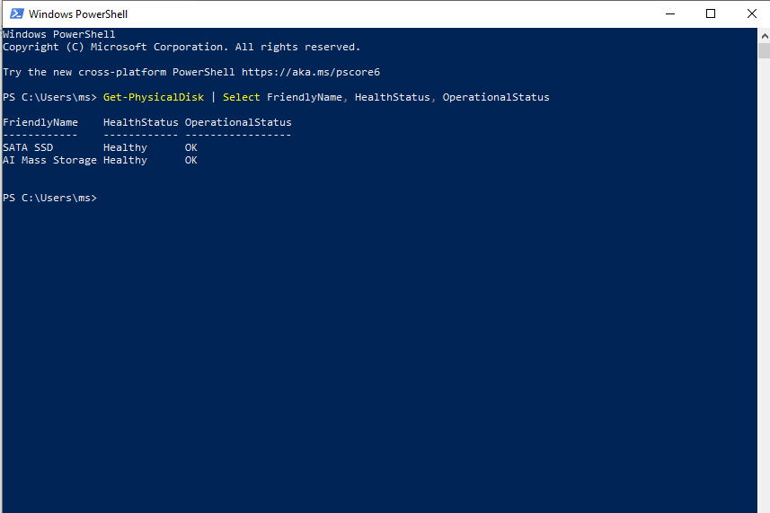<br>
  <em>Exhibit 16 — Disk checked for errors and SMART health status confirmed via both CMD and PowerShell</em>
</p>

---

<a id="module-17"></a>
## 🟦 Module 17 — Review BSOD Information

**Objective:** Find BSOD details from Event Viewer and analyse the stop code.

### Step 17 — Review BSOD (Blue Screen) Information ✅

```
Event Viewer → Windows Logs → System
→ Filter: Level = Critical
→ Source = "BugCheck" or "Kernel-Power"
→ Event ID 41 = unexpected shutdown / power failure BSOD

Read the stop code from the event description:
   e.g. "0x0000007E" = SYSTEM_THREAD_EXCEPTION_NOT_HANDLED

Common BSOD stop codes:
| Stop Code | Cause |
|-----------|-------|
| 0x0000007E | Driver or system file exception |
| 0x0000000A | IRQL_NOT_LESS_OR_EQUAL — driver bug |
| 0x0000001E | KMODE_EXCEPTION_NOT_HANDLED |
| 0x00000050 | PAGE_FAULT_IN_NONPAGED_AREA — bad RAM/driver |
| 0x000000EF | CRITICAL_PROCESS_DIED |

→ Search stop code + driver name on Microsoft Learn or KB
```

<p align="center">
  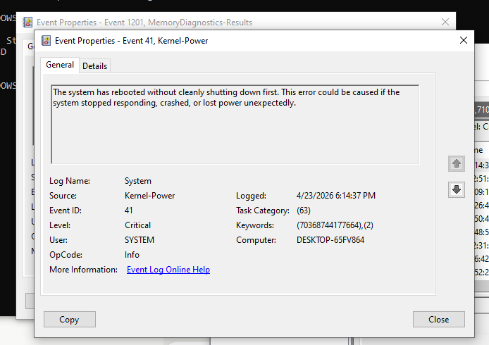<br>
  <em>Exhibit 17 — BSOD stop code located in the System log and matched against its known cause</em>
</p>

---

<a id="module-18"></a>
## 🟦 Module 18 — Enable & Read Minidump Files

**Objective:** Configure Windows to save crash dump files for deeper BSOD analysis.

### Step 18 — Enable & Read Minidump Files ✅

```
Win + R → type: sysdm.cpl → Enter
→ Advanced tab → Startup and Recovery → Settings
→ Under "Write debugging information":
   Select: "Small memory dump (256 KB)"
   Dump file: %SystemRoot%\Minidump

After a BSOD occurs, dump file appears at:
   C:\Windows\Minidump\

→ Open dump file with WinDbg (Windows Debugger):
   windbg -z C:\Windows\Minidump\<filename>.dmp
   → Type: !analyze -v
   → Look for: "Probably caused by" line
```

<p align="center">
  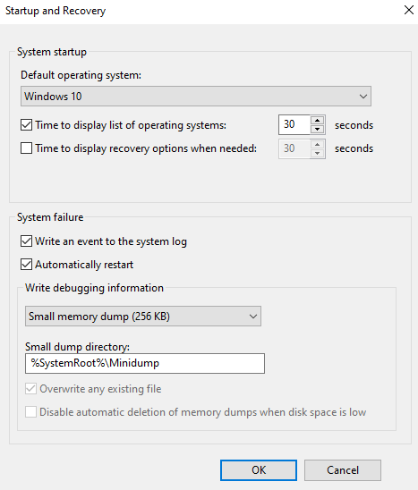<br>
  <em>Exhibit 18 — Minidump collection enabled and a dump analyzed with WinDbg's `!analyze -v`</em>
</p>

---

<a id="module-19"></a>
## ✅ Module 19 — Generate a System Health Report

**Objective:** Use Performance Monitor to generate a full system diagnostics report.

### Step 19 — Generate a System Health Report ✅

```
CMD (Administrator):

# Generate System Diagnostics report
perfmon /report

→ Windows collects data for 60 seconds automatically
→ Report opens in Performance Monitor browser
→ Review sections:
   - Warnings (yellow) and Errors (red)
   - Software Configuration
   - Hardware Configuration
   - CPU, Network, Disk, Memory analysis
   - Top processes by resource usage

  OR manually:
  Performance Monitor → Reports → System → System Diagnostics
```

<p align="center">
  <br>
  <em>Exhibit 19a — System Diagnostics report generated via Performance Monitor</em>
</p>
<p align="center">
  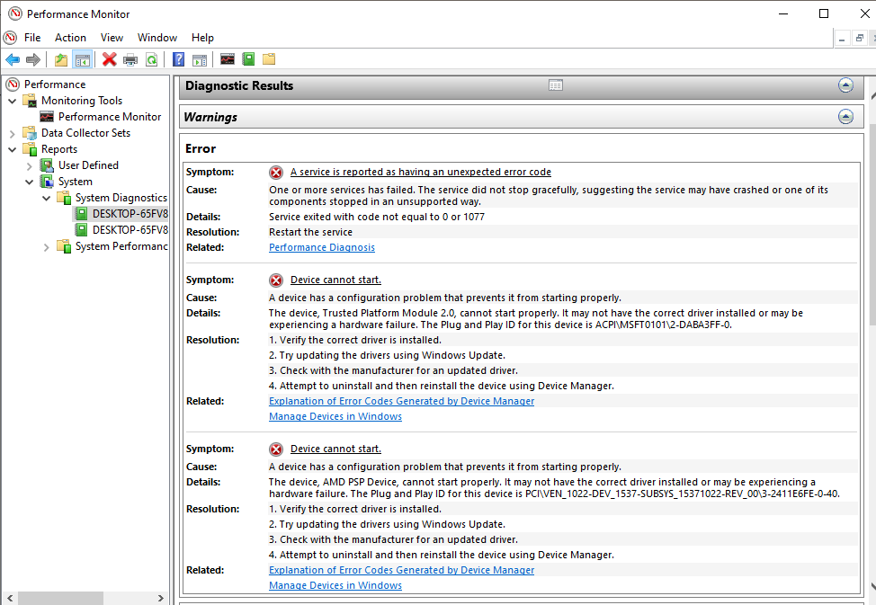<br>
  <em>Exhibit 19b — Full report reviewed across software, hardware, CPU, disk, and memory sections</em>
</p>

---

<a id="module-20"></a>
## ✅ Module 20 — Final Verification & Documentation

**Objective:** Confirm the system is healthy after all fixes.

### Step 20 — Final Verification & Documentation ✅

```
# Verify SFC clean
sfc /scannow

# Confirm no critical events in last 24hrs
Get-EventLog -LogName System -EntryType Error,Warning -Newest 20

# Check uptime
systeminfo | find "System Boot Time"

# Confirm disk health
wmic diskdrive get status

# Confirm no unsigned drivers
Get-WmiObject Win32_PnPSignedDriver | Where-Object {$_.IsSigned -eq $false}
```

<p align="center">
  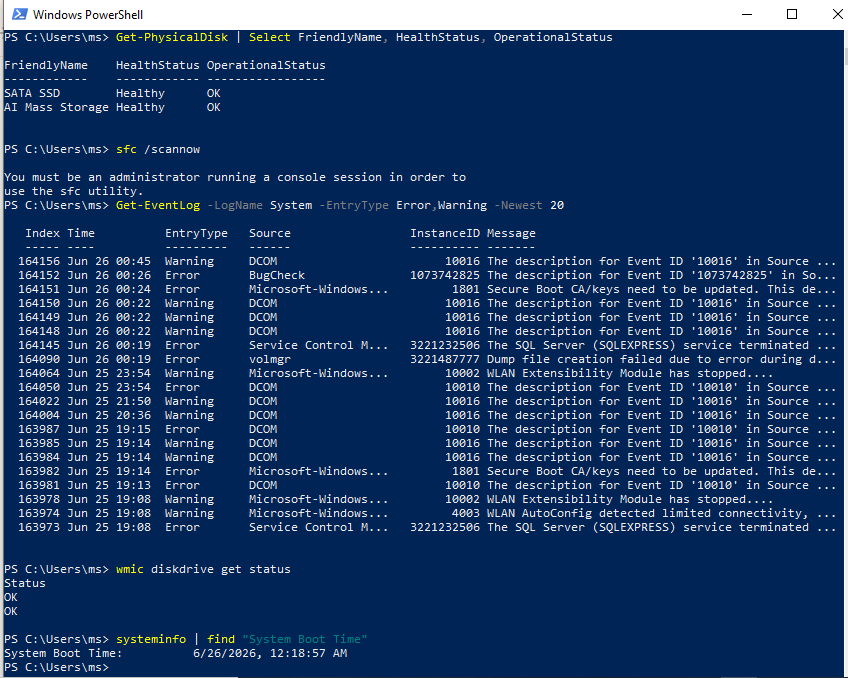<br>
  <em>Exhibit 20 — System files, event logs, uptime, disk, and drivers all confirmed healthy at close</em>
</p>

---

<a id="coverage-snapshot"></a>
## 🌟 Coverage Snapshot

| 🛡️ Layer | ✅ Status | 📌 Detail |
|---|---|---|
| Resource usage baseline | Live | CPU/memory/disk/network reviewed in Task Manager (Exhibit 1) |
| High-CPU process identified | Proven | Top consumer isolated and verified (Exhibit 2) |
| Startup impact reviewed | Proven | High-impact startup entries identified (Exhibit 3) |
| Resource Monitor deep-dive | Proven | Per-process detail reviewed across 4 tabs (Exhibit 4) |
| Event Viewer opened | Live | Application/System/Security logs reviewed (Exhibit 5) |
| Critical/Error events filtered | Proven | Log noise cut out via level filter (Exhibit 6) |
| Event ID investigated | Proven | Specific Event ID matched to known meaning (Exhibit 7) |
| Reliability timeline reviewed | Proven | Stability index and crash history reviewed (Exhibit 8) |
| Driver faults located | Live | Device Manager fault icons reviewed, hidden devices shown (Exhibit 9) |
| Driver fix applied | Proven | Update/rollback/reinstall paths demonstrated (Exhibit 10) |
| Driver signing audited | Proven | Unsigned drivers checked via PowerShell (Exhibit 11) |
| System files scanned | Proven | `sfc /scannow` run and result interpreted (Exhibit 12) |
| Windows image repaired | Proven | DISM CheckHealth → ScanHealth → RestoreHealth (Exhibit 13) |
| App crash root-caused | Proven | Event ID 1000 faulting module and exception code read (Exhibit 14) |
| Memory tested | Proven | Windows Memory Diagnostic run and results read (Exhibit 15) |
| Disk health confirmed | Proven | `chkdsk`, WMIC, and PowerShell disk checks cross-verified (Exhibit 16) |
| BSOD stop code identified | Proven | Critical System event matched to a known stop code (Exhibit 17) |
| Minidump analysis enabled | Proven | Small memory dump configured and analyzed in WinDbg (Exhibit 18) |
| System health report generated | Proven | Full Performance Monitor diagnostics reviewed (Exhibit 19) |
| Final verification | Proven | SFC, logs, uptime, disk, drivers all confirmed healthy (Exhibit 20) |

---

<a id="command-summary"></a>
## 📟 Command Summary

| Command / Tool | Purpose |
|----------------|---------|
| `Ctrl + Shift + Esc` | Open Task Manager |
| `eventvwr.msc` | Open Event Viewer |
| `devmgmt.msc` | Open Device Manager |
| `resmon` | Open Resource Monitor |
| `perfmon /rel` | Open Reliability Monitor |
| `perfmon /report` | Generate System Health Report |
| `msconfig` | Open System Configuration |
| `mdsched.exe` | Windows Memory Diagnostic |
| `sfc /scannow` | Scan and repair system files |
| `DISM /Online /Cleanup-Image /RestoreHealth` | Repair Windows image |
| `chkdsk C: /f /r` | Check and repair disk |
| `wmic diskdrive get status` | Check SMART disk status |
| `sysdm.cpl` | System Properties (minidump config) |
| `Get-WmiObject Win32_PnPSignedDriver` | List all drivers via PowerShell |
| `Get-EventLog -LogName System -EntryType Error` | Query event log via PowerShell |

---

<a id="challenges-fixes"></a>
## ⚠️ Challenges & Fixes

| ❌ Challenge | ✅ Solution |
|---|---|
| Event Viewer flooded with informational logs | Used Filter Current Log → selected only Critical and Error levels |
| SFC found corrupt files but couldn't repair | Ran `DISM /RestoreHealth` first, then re-ran SFC |
| Device Manager showed unknown device | Used "Show hidden devices" and matched Hardware ID online to find the correct driver |
| Application crash had no obvious cause | Cross-referenced Event ID 1000's faulting module with the driver list in Device Manager |
| BSOD stop code unclear | Enabled small memory dump, used `!analyze -v` in WinDbg to pinpoint the faulting driver |

---

<a id="scope-limitations"></a>
## 🚧 Scope & Limitations

- **No faults artificially staged:** unlike the spooler, firewall, and registry labs, this lab diagnoses the machine's actual real-time state rather than deliberately breaking something first — results will vary machine to machine.
- **Single device:** performed on one Windows 10/11 PC or VM, not across a fleet or with centralized monitoring (SCCM, Intune, a SIEM).
- **DISM's `/RestoreHealth` depends on internet access:** without it, DISM needs a local Windows image source (ISO or `/Source:` mount) that this lab doesn't cover.
- **WinDbg analysis is manual and surface-level:** `!analyze -v` output was read for the "Probably caused by" line only — deeper kernel debugging (stack walking, symbol resolution issues) is out of scope.
- **No hardware replacement performed:** disk and memory diagnostics stop at detection — actual RAM or drive replacement based on a failed result isn't part of this lab.

These limits are stated so the lab is read as a Windows desktop-support diagnostic fundamentals exercise, not a fleet-wide monitoring or hardware-repair exercise.

---

<a id="what-i-learned"></a>
## 🧠 What I Learned

- **A vague symptom always maps to a specific tool** — "slow" means Task Manager and Resource Monitor, "crashing" means Event Viewer's Application log, "blue screen" means the System log and, if needed, a minidump. Knowing the mapping saves time on every ticket.
- **SFC and DISM aren't interchangeable — they're sequential.** SFC fixes individual corrupted files; DISM repairs the underlying component store SFC pulls good copies from. When SFC alone can't finish, it's almost always because DISM needs to run first.
- **A property or icon showing a problem is a starting point, not the diagnosis.** A yellow triangle in Device Manager or a red X in Reliability Monitor tells you where to look, not what's actually wrong — that still takes reading the driver details, the event description, or the stop code.
- **Exception codes and stop codes are lookup keys, not verdicts.** `0xc0000005` or `0x0000007E` narrow the problem down to a category (memory access, driver exception) — the faulting module or driver name next to it is what actually identifies the culprit.
- **Verification has to touch every layer that was checked**, not just the one that seemed to be the problem — the final step re-runs SFC, checks the event log, uptime, disk, and drivers together specifically so nothing regresses silently.

---

<a id="skills-demonstrated"></a>
## 🛠️ Skills Demonstrated

- Diagnosing high CPU/RAM usage with Task Manager and Resource Monitor
- Reducing startup bloat via the Startup tab and `msconfig`
- Filtering and reading Windows Event Viewer logs by level, source, and Event ID
- Reading a Reliability Monitor timeline to correlate crashes with installs or updates
- Diagnosing and repairing driver issues through Device Manager and PowerShell
- Repairing corrupted system files and Windows images with `sfc` and `DISM`
- Root-causing application crashes via Event ID 1000 detail
- Testing memory and disk health with built-in diagnostics
- Identifying BSOD stop codes and performing minidump analysis in WinDbg
- Generating and interpreting a full Performance Monitor system diagnostics report

---

<a id="screenshot-index"></a>
## 🖼️ Screenshot Index

| # | File | Shows |
|:---:|---|---|
| 1 | `01-task-manager-performance.PNG` | Resource usage baseline |
| 2 | `02-high-cpu-process.PNG` | High-CPU process identified |
| 3 | `03-startup-programs.PNG` | Startup impact reviewed |
| 4 | `04-resource-monitor.PNG` | Resource Monitor deep-dive |
| 5 | `05-event-viewer.PNG` | Event Viewer opened |
| 6 | `06-filter-events.PNG` | Critical/Error events filtered |
| 7 | `07-event-id-detail.PNG` | Specific Event ID investigated |
| 8 | `08-reliability-monitor.PNG` | Reliability timeline reviewed |
| 9 | `09-device-manager.PNG` | Driver faults located |
| 10 | `10-driver-fix.PNG` | Driver fix applied |
| 11 | `11-powershell-drivers.PNG` | Driver signing audited via PowerShell |
| 12 | `12-sfc-scan.PNG` | System files scanned via SFC |
| 13 | `13-dism-repair.PNG` | Windows image repaired via DISM |
| 14 | `14-app-crash-event.PNG` | Application crash root-caused |
| 15 | `15-memory-diagnostic.PNG` | Memory tested |
| 16 | `16-disk-health.PNG` | Disk health confirmed |
| 17 | `17-bsod-event.PNG` | BSOD stop code identified |
| 18 | `18-minidump-settings.PNG` | Minidump analysis enabled |
| 19 | `19-system-health-report.PNG` / `-result.PNG` | System health report generated and reviewed |
| 20 | `20-final-verification.PNG` | Final full-stack verification |

---

<a id="repo-structure"></a>
## 📁 Repo Structure

```text
03-IT-Support-Troubleshooting/08-System-Diagnostics-Desktop-Support/
|-- README.md
`-- screenshots/
    |-- 01-task-manager-performance.PNG
    |-- 02-high-cpu-process.PNG
    |-- 03-startup-programs.PNG
    |-- 04-resource-monitor.PNG
    |-- 05-event-viewer.PNG
    |-- 06-filter-events.PNG
    |-- 07-event-id-detail.PNG
    |-- 08-reliability-monitor.PNG
    |-- 09-device-manager.PNG
    |-- 10-driver-fix.PNG
    |-- 11-powershell-drivers.PNG
    |-- 12-sfc-scan.PNG
    |-- 13-dism-repair.PNG
    |-- 14-app-crash-event.PNG
    |-- 15-memory-diagnostic.PNG
    |-- 16-disk-health.PNG
    |-- 17-bsod-event.PNG
    |-- 18-minidump-settings.PNG
    |-- 19-system-health-report.PNG
    |-- 19-system-health-report-result.PNG
    `-- 20-final-verification.PNG
```

<div align="center">

🩺 **[Reliability Monitor Overview](https://learn.microsoft.com/en-us/windows/client-management/monitor-application-usage)** · 🧰 **[SFC and DISM Reference](https://learn.microsoft.com/en-us/windows-server/administration/windows-commands/dism)** · 🟦 **[Bug Check Code Reference](https://learn.microsoft.com/en-us/windows-hardware/drivers/debugger/bug-check-code-reference2)**

</div>
