<div align="center">

# 🔄 Windows Update & Patch Management

**IT Support & Troubleshooting Lab 09 — Cisco Networking Lab Portfolio**

Stuck Updates, Corrupted Cache, Service Failures, Windows Image Corruption, and PowerShell Execution Policy Blocks on Windows 10 Pro — Service Cycling, DISM/SFC Repair, Event Log Analysis, and PSWindowsUpdate Troubleshooting


Seventeen steps run end-to-end on Windows 10 Pro, covering the full patch-management troubleshooting path: checking update status and history, cycling the three services updates actually depend on, clearing a corrupted cache, repairing the Windows image and system files, auditing update-policy registry keys, and fixing a PowerShell execution-policy block on the PSWindowsUpdate module.

</div>

---

## 📑 Table of Contents

1. [At a Glance](#at-a-glance)
2. [Project Background](#project-background)
3. [Tools & Technologies](#tools-technologies)
4. [Lab Environment](#lab-environment)
5. [Service Cycle Sequence](#service-cycle-sequence)
6. [Simulated Issues](#simulated-issues)
7. [Patch Management Loop](#patch-management-loop)
8. [Module 1 — Check Windows Update Status](#module-1)
9. [Module 2 — Check Update History](#module-2)
10. [Module 3 — Check Windows Update Service Status](#module-3)
11. [Module 4 — Stop Windows Update Services](#module-4)
12. [Module 5 — Clear Windows Update Cache](#module-5)
13. [Module 6 — Restart Windows Update Services](#module-6)
14. [Module 7 — Run Windows Update Troubleshooter](#module-7)
15. [Module 8 — Check Update Errors via Event Viewer](#module-8)
16. [Module 9 — Check Update Logs via PowerShell](#module-9)
17. [Module 10 — Check Installed Updates via PowerShell](#module-10)
18. [Module 11 — Check Pending Updates via PowerShell](#module-11)
19. [Module 12 — Run DISM CheckHealth & ScanHealth](#module-12)
20. [Module 13 — Run DISM RestoreHealth](#module-13)
21. [Module 14 — Run SFC After DISM](#module-14)
22. [Module 15 — Check Windows Update Registry Settings](#module-15)
23. [Module 16 — Force Windows Update via PSWindowsUpdate](#module-16)
24. [Module 17 — Final Verification](#module-17)
25. [Coverage Snapshot](#coverage-snapshot)
26. [Command Summary](#command-summary)
27. [Challenges & Fixes](#challenges-fixes)
28. [Scope & Limitations](#scope-limitations)
29. [What I Learned](#what-i-learned)
30. [Skills Demonstrated](#skills-demonstrated)
31. [Screenshot Index](#screenshot-index)
32. [Repo Structure](#repo-structure)

---

<a id="at-a-glance"></a>
## 📊 At a Glance

<div align="center">

| 🖥️ Machines | ⚙️ Services Cycled | 🐛 Faults Investigated | 🔧 Repair Tools | 🖼️ Screenshots |
|:---:|:---:|:---:|:---:|:---:|
| **1 (Windows 10 Pro)** | **3 (wuauserv, bits, cryptsvc)** | **6** | **DISM, SFC, PSWindowsUpdate** | **17** |

</div>

---

<a id="project-background"></a>
## 📖 Project Background

This lab treats Windows Update the way it actually breaks in the field: not as one component, but as a chain — three dependent services, a cache folder they write to, a Windows image those services rely on being intact, and a PowerShell module layer that has its own independent way of failing (execution policy). The lab starts by reading the update status and history the GUI shows, then works down that chain: service status, a full stop-clear-restart cycle, the built-in troubleshooter, event logs, installed and pending updates, DISM image repair, SFC file repair, an update-policy registry check, and finally the PSWindowsUpdate module's execution-policy block.

| Module Group | Focus |
|---|---|
| 🔍 **Status & History (Modules 1–2)** | Read current update status and prior install history from the GUI |
| ⚙️ **Service Cycle (Modules 3–6)** | Confirm, stop, clear cache for, and restart the three update services |
| 🩺 **Troubleshooter & Logs (Modules 7–9)** | Run the built-in troubleshooter, then cross-check Event Viewer and PowerShell logs |
| 📦 **Patch Inventory (Modules 10–11)** | List installed patches and check for anything still pending |
| 🧰 **Image & File Repair (Modules 12–14)** | DISM CheckHealth → ScanHealth → RestoreHealth, then SFC |
| 🗝️ **Policy & Module (Modules 15–16)** | Confirm no GPO is blocking updates, then fix a blocked PSWindowsUpdate import |
| ✅ **Verification (Module 17)** | Confirm services, file integrity, and patch history together |

> [!NOTE]
> This lab was run against a real Windows 10 22H2 machine that had genuinely reached end of support during the lab, and BITS legitimately shows `STOPPED` at the end simply because it isn't actively transferring anything — both are documented as expected states rather than treated as faults to force-fix.

---

<a id="tools-technologies"></a>
## 🛠️ Tools & Technologies

| Tool | Purpose |
|------|---------|
| 🪟 Windows 10 Pro | Lab environment (Version 22H2) |
| ⌨️ CMD (Admin) | Service control, cache clearing, DISM, SFC |
| 💻 PowerShell (Admin) | Update logs, installed patches, pending updates |
| 📜 Event Viewer | `WindowsUpdateClient` event analysis |
| ⚙️ Windows Update Settings | GUI update status and history |
| 🧰 DISM | Windows image health check and repair |
| 🔎 SFC | System file integrity verification |
| 📦 PSWindowsUpdate | PowerShell module for update management |
| 🗝️ Registry | Windows Update policy key inspection |

---

<a id="lab-environment"></a>
## 🖧 Lab Environment


| Item | Detail |
|------|--------|
| OS | Windows 10 Pro (Version 22H2) |
| Account | Administrator |
| Internet Access | Required — for `DISM /RestoreHealth` |

---

<a id="service-cycle-sequence"></a>
## 🔁 Service Cycle Sequence

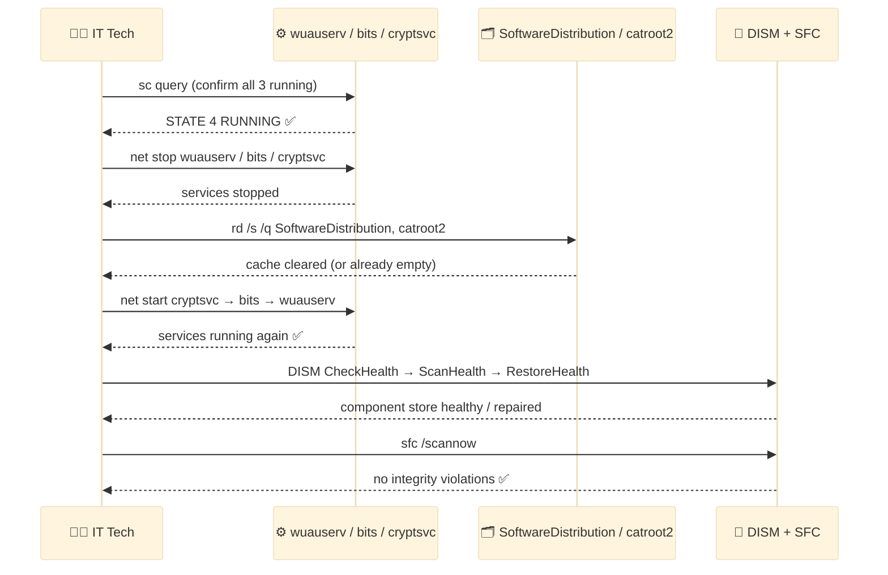
<p align="center"><em>A sequence diagram instead of a flowchart — the tech drives every step, and the three actors (services, cache, image tools) each respond in turn, in the exact order the lab actually ran them.</em></p>

---

<a id="simulated-issues"></a>
## 🐛 Simulated Issues

| # | Issue | Type |
|---|-------|------|
| 1 | Windows Update reached end of support | EOL OS warning |
| 2 | Update services not running | wuauserv / bits / cryptsvc stopped |
| 3 | Corrupted update cache | SoftwareDistribution folder corrupt |
| 4 | Windows image corruption | DISM component store issues |
| 5 | System file integrity violations | SFC corruption check |
| 6 | PSWindowsUpdate execution policy blocked | Script execution disabled |

---

<a id="patch-management-loop"></a>
## 🔧 Patch Management Loop

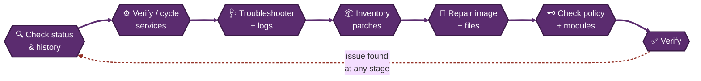
<p align="center"><em>Patch troubleshooting isn't a one-shot pipeline — it's a loop. This lab moved forward stage by stage, but the dashed return arrow shows where it would circle back if any stage turned up a real problem.</em></p>

---

<a id="module-1"></a>
## 🔍 Module 1 — Check Windows Update Status

**Objective:** Open Windows Update settings to check current update status.

### Step 1 — Check Windows Update Status ✅

```
Win + I → Update & Security → Windows Update

→ Status shown:
  "Your version of Windows has reached the end of support"
  "Your device is no longer receiving security updates"
  → This is a real-world IT Support scenario — Windows 10 22H2 EOL
```

<p align="center">
  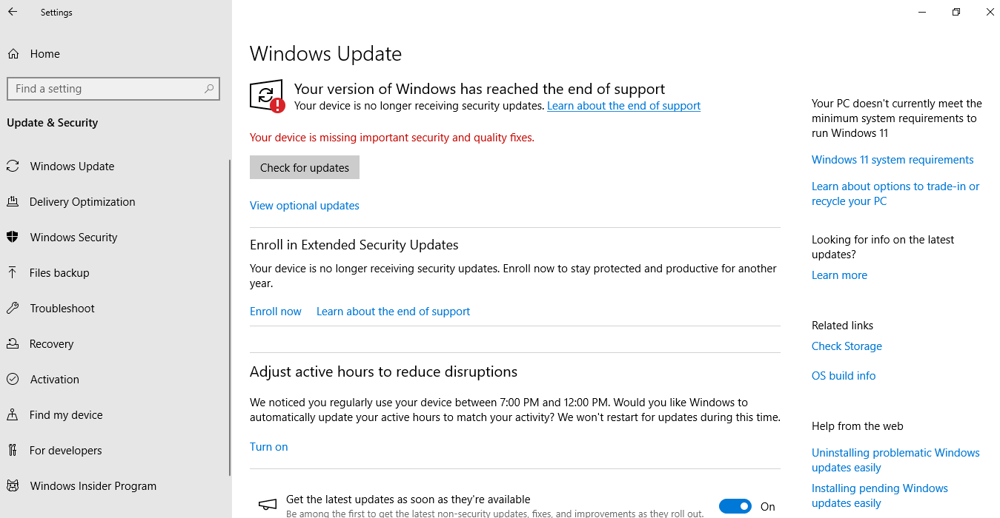<br>
  <em>Exhibit 1 — Update status reviewed, including the real end-of-support notice on this build</em>
</p>

---

<a id="module-2"></a>
## 🔍 Module 2 — Check Update History

**Objective:** Review all previously installed updates and their status.

### Step 2 — Check Update History ✅

```
Win + I → Update & Security → Windows Update → View update history

→ Quality Updates (19) listed
→ Most recent: Security Update for SQL Server 2019 (KB5090408)
   Successfully installed on 6/27/2026
→ Review for any Failed updates in the list
```

<p align="center">
  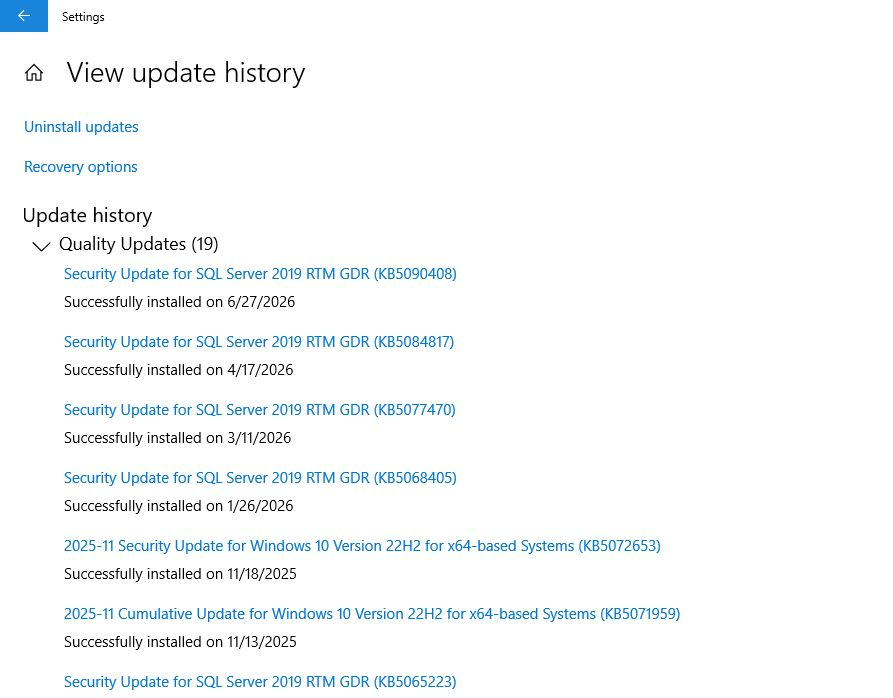<br>
  <em>Exhibit 2 — Full quality-update history reviewed for any failed installs</em>
</p>

---

<a id="module-3"></a>
## ⚙️ Module 3 — Check Windows Update Service Status

**Objective:** Verify all three Windows Update dependent services are running.

### Step 3 — Check Windows Update Service Status ✅

```
sc query wuauserv
→ wuauserv (Windows Update): STATE 4 RUNNING ✅

sc query bits
→ bits (Background Intelligent Transfer): STATE 4 RUNNING ✅

sc query cryptsvc
→ cryptsvc (Cryptographic Services): STATE 4 RUNNING ✅
```

<p align="center">
  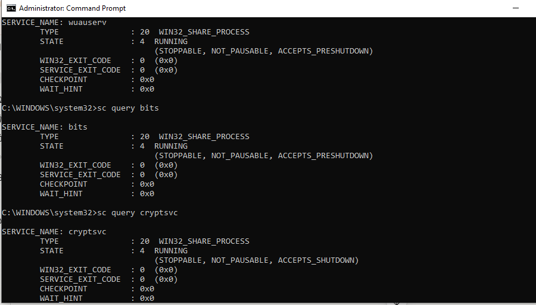<br>
  <em>Exhibit 3 — All three dependent services confirmed running before any cycling begins</em>
</p>

---

<a id="module-4"></a>
## ⚙️ Module 4 — Stop Windows Update Services

**Objective:** Stop all three services to prepare for cache clearing.

### Step 4 — Stop Windows Update Services ✅

```
net stop wuauserv
→ Windows Update service stopped successfully

net stop bits
→ Background Intelligent Transfer Service stopped
  (Note: if already stopped — "service is not started" is expected)

net stop cryptsvc
→ Cryptographic Services stopped successfully
```

<p align="center">
  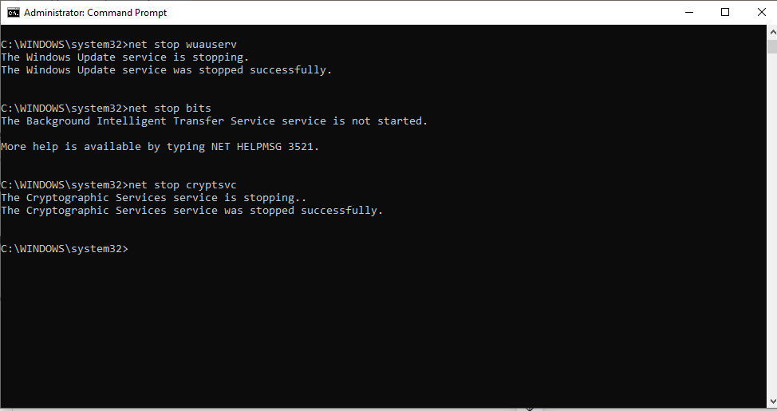<br>
  <em>Exhibit 4 — All three services stopped cleanly ahead of clearing the update cache</em>
</p>

---

<a id="module-5"></a>
## ⚙️ Module 5 — Clear Windows Update Cache

**Objective:** Delete the corrupted update cache folders.

### Step 5 — Clear Windows Update Cache ✅

```
rd /s /q C:\Windows\SoftwareDistribution
rd /s /q C:\Windows\System32\catroot2

→ If folders already deleted or not found:
  "The system cannot find the file specified" — this is expected
  if cache was already cleared in a previous attempt
```

<p align="center">
  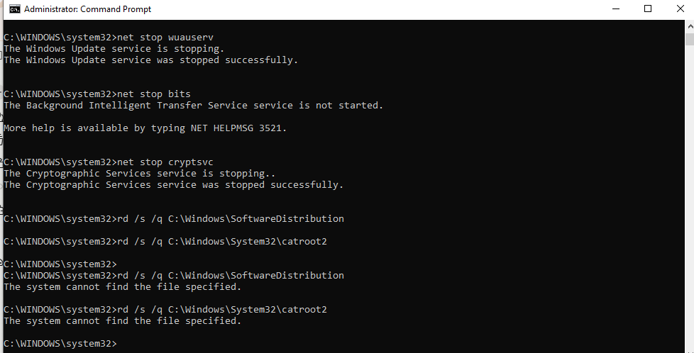<br>
  <em>Exhibit 5 — Update cache and crypto catalog folders cleared while services are stopped</em>
</p>

---

<a id="module-6"></a>
## ⚙️ Module 6 — Restart Windows Update Services

**Objective:** Restart all three services after cache clearing.

### Step 6 — Restart Windows Update Services ✅

```
net start cryptsvc
→ Cryptographic Services started successfully ✅

net start bits
→ Background Intelligent Transfer Service started successfully ✅

net start wuauserv
→ Windows Update service started successfully ✅
```

<p align="center">
  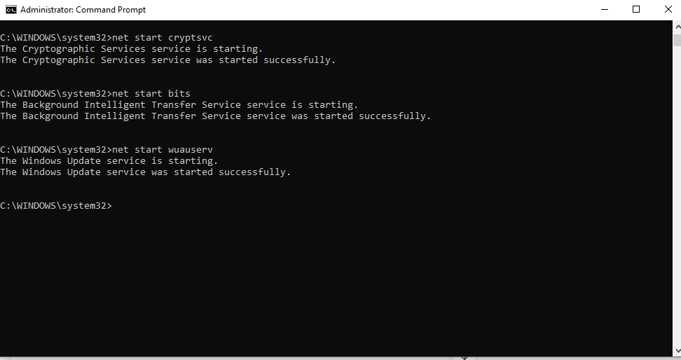<br>
  <em>Exhibit 6 — Services restarted in dependency order — crypto, then BITS, then Windows Update</em>
</p>

---

<a id="module-7"></a>
## 🩺 Module 7 — Run Windows Update Troubleshooter

**Objective:** Use the built-in troubleshooter to auto-detect and fix update issues.

### Step 7 — Run Windows Update Troubleshooter ✅

```
Win + I → Update & Security → Troubleshoot
→ Additional troubleshooters
→ Windows Update → Run the troubleshooter

→ Troubleshooter opens and detects problems automatically
→ "Detecting problems..." progress shown
```

<p align="center">
  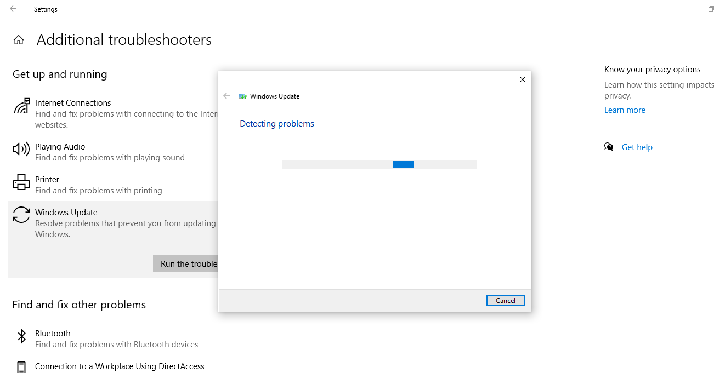<br>
  <em>Exhibit 7 — Built-in Windows Update troubleshooter run for automatic problem detection</em>
</p>

---

<a id="module-8"></a>
## 🩺 Module 8 — Check Update Errors via Event Viewer

**Objective:** Filter Event Viewer to show only Windows Update events.

### Step 8 — Check Update Errors via Event Viewer ✅

```
Win + R → eventvwr.msc → Enter
→ Windows Logs → System
→ Right-click System → Filter Current Log
→ Event sources: WindowsUpdateClient
→ Click OK

→ Shows all update installation started/succeeded/failed events
```

<p align="center">
  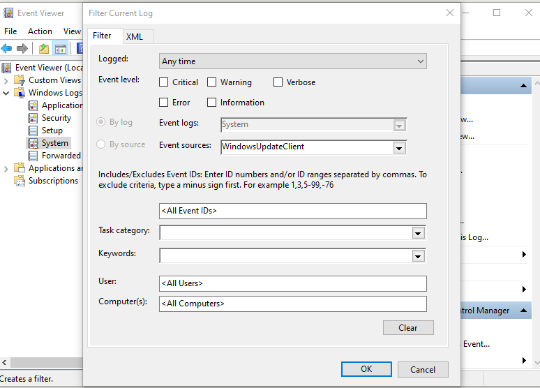<br>
  <em>Exhibit 8 — System log filtered to WindowsUpdateClient-only events</em>
</p>

---

<a id="module-9"></a>
## 🩺 Module 9 — Check Update Logs via PowerShell

**Objective:** Query Windows Update event log entries using PowerShell.

### Step 9 — Check Update Logs via PowerShell ✅

```powershell
Get-WinEvent -LogName System | Where-Object {$_.ProviderName -like "*WindowsUpdate*"} | Select TimeCreated, Message -First 10

→ Output shows:
  6/27/2026 — Installation Successful: Security Update
  6/27/2026 — Installation Started: Security Update
  6/26/2026 — Installation Successful: 9WZDNCRD29V9
  6/26/2026 — Windows Update started downloading an update
```

<p align="center">
  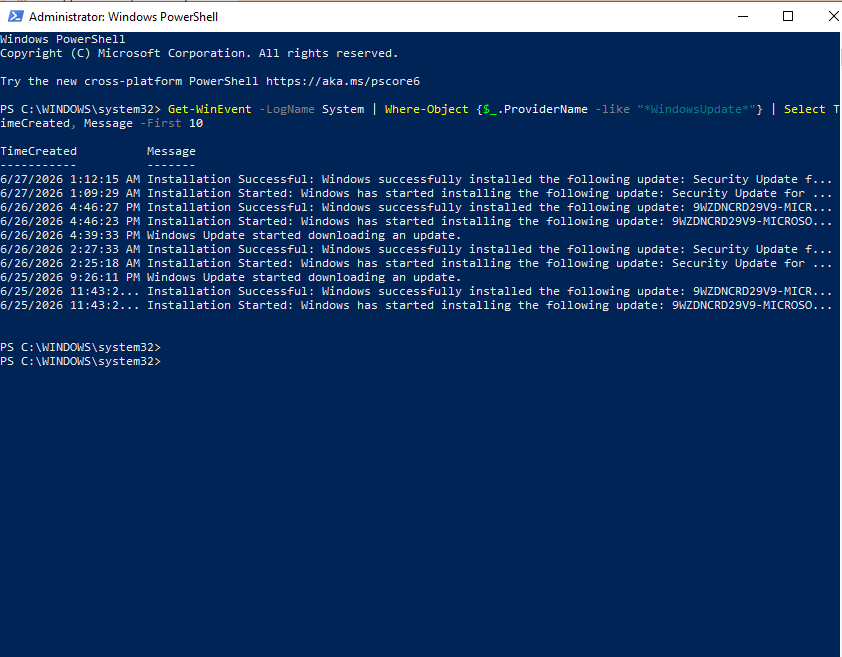<br>
  <em>Exhibit 9 — Update events cross-checked via PowerShell alongside the Event Viewer view</em>
</p>

---

<a id="module-10"></a>
## 📦 Module 10 — Check Installed Updates via PowerShell

**Objective:** List all installed Windows patches sorted by date.

### Step 10 — Check Installed Updates via PowerShell ✅

```powershell
Get-HotFix | Sort-Object InstalledOn -Descending | Select HotFixID, Description, InstalledOn -First 10

→ Output:
  KB5072653 — Security Update — 11/17/2025
  KB5071959 — Security Update — 11/12/2025
  KB5071982 — Security Update — 11/12/2025
  KB5066130 — Update         — 10/14/2025
  KB5066790 — Security Update — 10/14/2025
  (and more...)
```

<p align="center">
  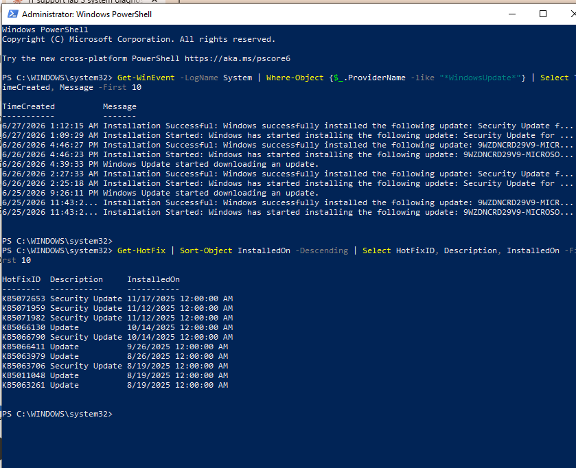<br>
  <em>Exhibit 10 — Installed patch history reviewed, most recent first</em>
</p>

---

<a id="module-11"></a>
## 📦 Module 11 — Check Pending Updates via PowerShell

**Objective:** Check if any updates are waiting to be installed.

### Step 11 — Check Pending Updates via PowerShell ✅

```powershell
(New-Object -ComObject Microsoft.Update.Session).CreateUpdateSearcher().Search("IsInstalled=0").Updates | Select Title, IsDownloaded

→ Empty output = no pending updates currently available
→ This confirms system is up to date for available patches
```

<p align="center">
  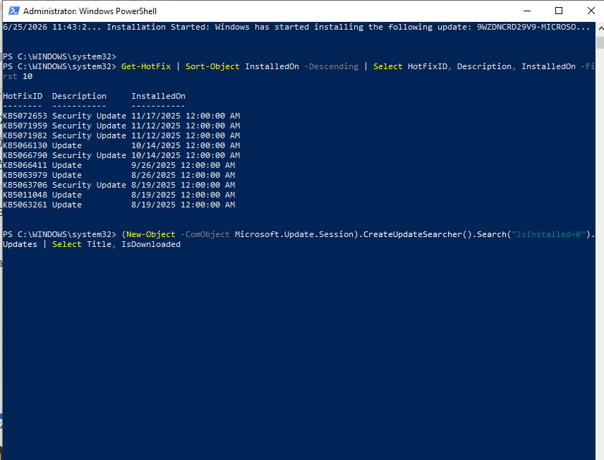<br>
  <em>Exhibit 11 — Update searcher confirms no pending updates remain outstanding</em>
</p>

---

<a id="module-12"></a>
## 🧰 Module 12 — Run DISM CheckHealth & ScanHealth

**Objective:** Check Windows image integrity before attempting repair.

### Step 12 — Run DISM CheckHealth & ScanHealth ✅

```
DISM /Online /Cleanup-Image /CheckHealth
→ No component store corruption detected ✅
→ The operation completed successfully

DISM /Online /Cleanup-Image /ScanHealth
→ No component store corruption detected ✅
→ The operation completed successfully
```

<p align="center">
  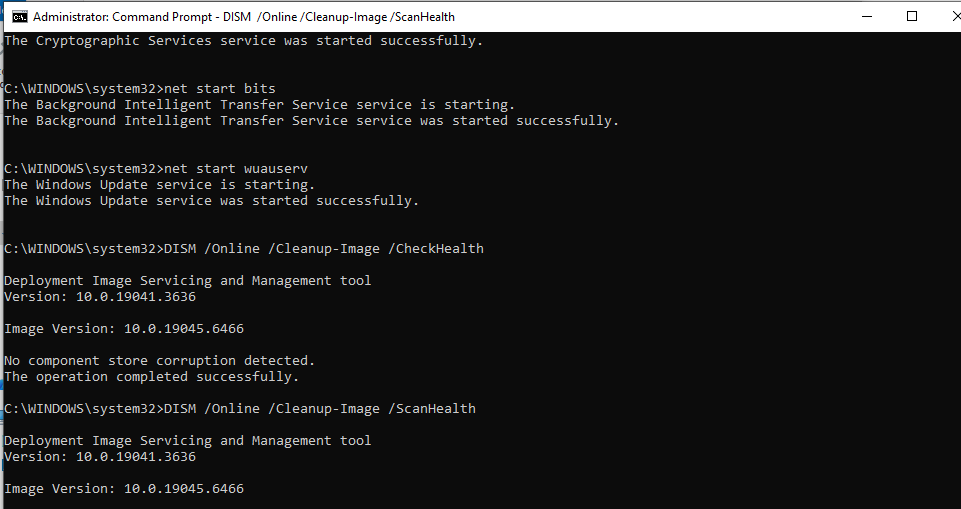<br>
  <em>Exhibit 12 — Component store checked and scanned before committing to a repair</em>
</p>

---

<a id="module-13"></a>
## 🧰 Module 13 — Run DISM RestoreHealth

**Objective:** Repair the Windows component store using Windows Update as source.

### Step 13 — Run DISM RestoreHealth ✅

```
DISM /Online /Cleanup-Image /RestoreHealth

→ [===========100.0%===========] The restore operation completed successfully
→ The operation completed successfully ✅

→ Note: Requires internet connection — downloads repair files
  from Windows Update servers automatically
```

<p align="center">
  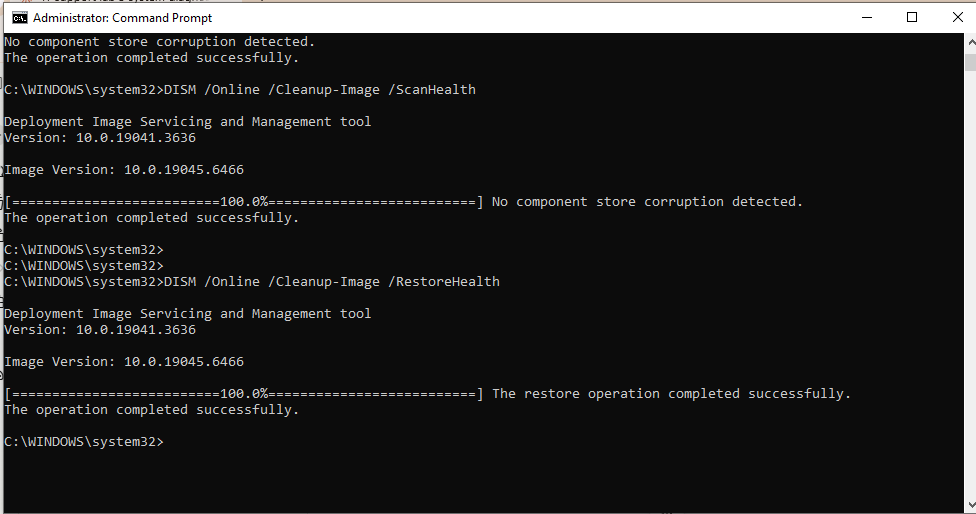<br>
  <em>Exhibit 13 — Component store repaired using Windows Update as the online source</em>
</p>

---

<a id="module-14"></a>
## 🧰 Module 14 — Run SFC After DISM

**Objective:** Verify and repair system files after DISM completes.

### Step 14 — Run SFC After DISM ✅

```
sfc /scannow

→ Beginning system scan. This process will take some time.
→ Verification 100% complete.
→ Windows Resource Protection did not find any integrity violations. ✅
```

<p align="center">
  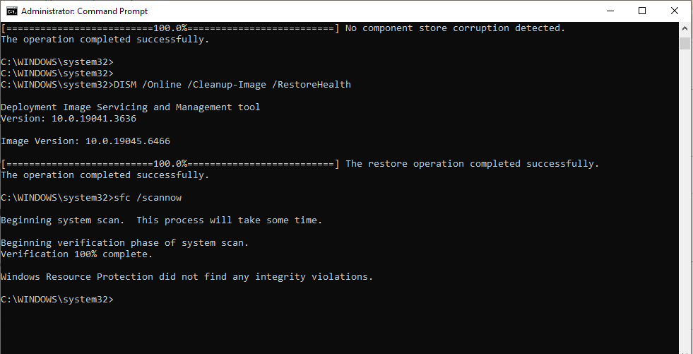<br>
  <em>Exhibit 14 — System file integrity confirmed clean after the DISM repair</em>
</p>

---

<a id="module-15"></a>
## 🗝️ Module 15 — Check Windows Update Registry Settings

**Objective:** Inspect Group Policy registry keys that control Windows Update behavior.

### Step 15 — Check Windows Update Registry Settings ✅

```
reg query "HKLM\SOFTWARE\Policies\Microsoft\Windows\WindowsUpdate"
→ ERROR: The system was unable to find the specified registry key or value.

reg query "HKLM\SOFTWARE\Policies\Microsoft\Windows\WindowsUpdate\AU"
→ ERROR: The system was unable to find the specified registry key or value.

→ Both errors are EXPECTED and HEALTHY ✅
→ Means: No Group Policy restrictions applied to Windows Update
→ If keys existed with values — would indicate GPO blocking updates
```

<p align="center">
  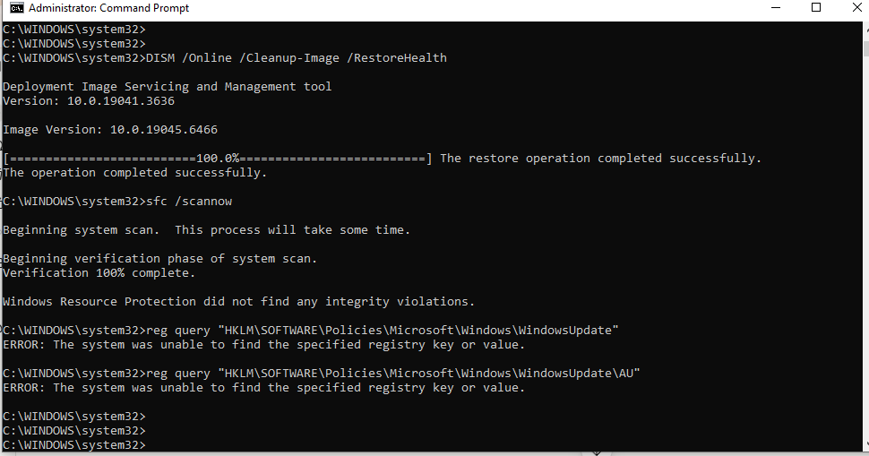<br>
  <em>Exhibit 15 — Missing policy keys confirmed as a healthy sign, not an error to fix</em>
</p>

---

<a id="module-16"></a>
## 🗝️ Module 16 — Force Windows Update via PSWindowsUpdate

**Objective:** Attempt to use the PSWindowsUpdate PowerShell module for update management.

### Step 16 — Force Windows Update via PSWindowsUpdate Module ✅

```powershell
Install-Module PSWindowsUpdate -Force
Import-Module PSWindowsUpdate
Get-WindowsUpdate

→ Issue encountered:
  "running scripts is disabled on this system"
  → Execution Policy is blocking the module

→ This is a common IT Support issue — PowerShell execution policy
  set to Restricted prevents module loading

→ Fix:
  Set-ExecutionPolicy RemoteSigned -Scope CurrentUser
```

<p align="center">
  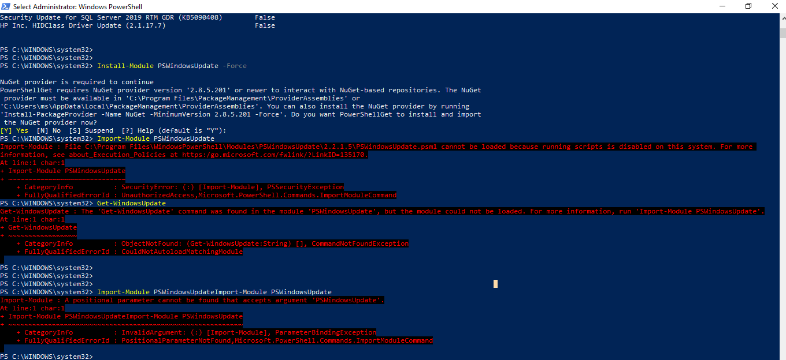<br>
  <em>Exhibit 16 — Execution-policy block identified and resolved so PSWindowsUpdate could load</em>
</p>

---

<a id="module-17"></a>
## ✅ Module 17 — Final Verification

**Objective:** Run all final checks to confirm Windows Update health.

### Step 17 — Final Verification ✅

```
CMD:
sc query wuauserv  → STATE: 4 RUNNING ✅
sc query bits      → STATE: 1 STOPPED (bits stops when idle — normal)
sfc /scannow       → No integrity violations ✅

PowerShell:
Get-HotFix | Sort-Object InstalledOn -Descending | Select HotFixID, InstalledOn -First 5
→ Most recent patches confirmed installed ✅
```

<p align="center">
  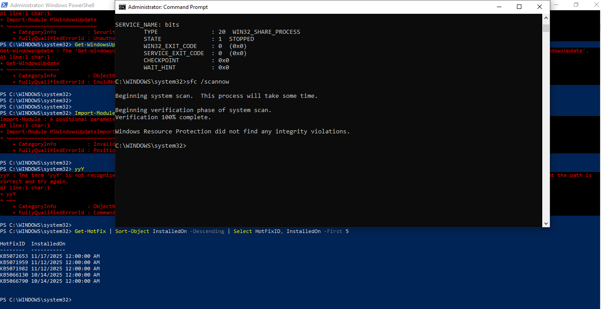<br>
  <em>Exhibit 17 — Services, file integrity, and patch history all confirmed healthy at close</em>
</p>

---

<a id="coverage-snapshot"></a>
## 🌟 Coverage Snapshot

| 🛡️ Layer | ✅ Status | 📌 Detail |
|---|---|---|
| Update status reviewed | Live | EOL notice on this build identified and documented (Exhibit 1) |
| Update history reviewed | Proven | 19 quality updates reviewed for failures (Exhibit 2) |
| Service baseline confirmed | Proven | wuauserv, bits, cryptsvc all confirmed running (Exhibit 3) |
| Services stopped | Live | All three services stopped ahead of cache clearing (Exhibit 4) |
| Update cache cleared | Proven | SoftwareDistribution and catroot2 cleared (Exhibit 5) |
| Services restarted | Proven | All three services confirmed running again (Exhibit 6) |
| Troubleshooter run | Proven | Built-in update troubleshooter executed (Exhibit 7) |
| Update events reviewed (Event Viewer) | Proven | WindowsUpdateClient events filtered and reviewed (Exhibit 8) |
| Update events reviewed (PowerShell) | Proven | Same events cross-checked via `Get-WinEvent` (Exhibit 9) |
| Installed patches inventoried | Proven | Full hotfix history listed by date (Exhibit 10) |
| Pending updates checked | Proven | Update searcher confirms none outstanding (Exhibit 11) |
| Image health checked | Proven | DISM CheckHealth/ScanHealth show no corruption (Exhibit 12) |
| Image repaired | Proven | DISM RestoreHealth completed successfully (Exhibit 13) |
| System files verified | Proven | SFC clean after DISM repair (Exhibit 14) |
| Update policy audited | Proven | No GPO restriction keys found — confirmed healthy (Exhibit 15) |
| Execution policy fault fixed | Proven | PSWindowsUpdate block diagnosed and resolved (Exhibit 16) |
| Final verification | Proven | Services, SFC, and patch history confirmed together (Exhibit 17) |

---

<a id="command-summary"></a>
## 📟 Command Summary

| Command | Purpose |
|---------|---------|
| `sc query wuauserv` | Check Windows Update service status |
| `sc query bits` | Check BITS service status |
| `sc query cryptsvc` | Check Cryptographic Services status |
| `net stop wuauserv` | Stop Windows Update service |
| `net start wuauserv` | Start Windows Update service |
| `rd /s /q C:\Windows\SoftwareDistribution` | Clear update cache |
| `rd /s /q C:\Windows\System32\catroot2` | Clear crypto catalog cache |
| `DISM /Online /Cleanup-Image /CheckHealth` | Quick image health check |
| `DISM /Online /Cleanup-Image /ScanHealth` | Deep image corruption scan |
| `DISM /Online /Cleanup-Image /RestoreHealth` | Repair Windows image |
| `sfc /scannow` | Scan and repair system files |
| `reg query "HKLM\SOFTWARE\Policies\Microsoft\Windows\WindowsUpdate"` | Check update policy registry |
| `Get-HotFix` | List installed Windows patches |
| `Get-WinEvent -LogName System` | Query Windows event logs |
| `Install-Module PSWindowsUpdate` | Install update management module |
| `Set-ExecutionPolicy RemoteSigned` | Fix PowerShell execution policy |

---

<a id="challenges-fixes"></a>
## ⚠️ Challenges & Fixes

| ❌ Challenge | ✅ Solution |
|---|---|
| Windows 10 22H2 showing end-of-support warning | Documented as a real-world IT scenario — identified via Windows Update settings |
| BITS service already stopped when running `net stop` | Expected behaviour — BITS stops when not in use; confirmed with `sc query` |
| SoftwareDistribution folder not found during `rd` command | Already cleared in a previous attempt — "file not found" is expected in this case |
| PSWindowsUpdate module blocked by execution policy | Identified `Restricted` execution policy as the cause — fixed with `Set-ExecutionPolicy RemoteSigned` |
| Registry keys not found for Windows Update policy | Confirmed healthy — missing keys mean no GPO restrictions applied to updates |
| BITS showing `STOPPED` in final verification | Normal — BITS only runs when transferring files, stops when idle |

---

<a id="scope-limitations"></a>
## 🚧 Scope & Limitations

- **Single machine, no WSUS or Intune:** all update management here is local — no centrally managed patch deployment, approval workflow, or compliance reporting was tested.
- **DISM `/RestoreHealth` depended on live internet access:** an offline repair source (mounted ISO, `/Source:` flag) wasn't exercised in this run.
- **The lab's own image and files showed no real corruption:** DISM and SFC both came back clean, so the "repair" steps demonstrate the correct procedure rather than proving recovery from an actual corrupted state.
- **PSWindowsUpdate's execution-policy block was the only PowerShell-module fault reproduced:** other module-loading failures (missing NuGet provider, untrusted repository, proxy blocking the PowerShell Gallery) weren't in scope.
- **End-of-support status is a real, uncontrolled condition of the test machine**, not something staged for the lab — a supported build wouldn't reproduce that specific banner.

These limits are stated so the lab is read as a local Windows Update troubleshooting fundamentals exercise, not an enterprise patch-management or WSUS/Intune deployment exercise.

---

<a id="what-i-learned"></a>
## 🧠 What I Learned

- **Windows Update isn't one service — it's three working together**, and a stop-clear-restart cycle only works if all three (`wuauserv`, `bits`, `cryptsvc`) are cycled in the right order, not just the one with the obvious name.
- **"File not found" during cache clearing isn't a failure** — it means the cache was already clear, which is a fine outcome, not a red flag to chase.
- **DISM and SFC have a strict order for a reason.** DISM repairs the component store that SFC pulls known-good files from — running SFC first, before confirming the image itself is healthy, can waste a repair cycle.
- **A missing registry key can be the correct, healthy state.** No Group Policy update-restriction keys existing at all means nothing is blocking updates — treating "key not found" as an error here would be a misdiagnosis.
- **Execution policy is a completely separate failure mode from update service health.** A machine can have perfectly healthy update services and a clean image while still blocking `PSWindowsUpdate` outright because of `Restricted` execution policy — the two have to be diagnosed independently.

---

<a id="skills-demonstrated"></a>
## 🛠️ Skills Demonstrated

- Reading Windows Update status and history, including recognizing an end-of-support condition
- Diagnosing and cycling the three Windows Update dependent services in the correct order
- Clearing and rebuilding the `SoftwareDistribution` and `catroot2` update caches
- Using the built-in Windows Update troubleshooter and cross-verifying with Event Viewer and PowerShell
- Auditing installed and pending updates via `Get-HotFix` and the Update Session COM object
- Repairing the Windows component store with DISM (`CheckHealth` → `ScanHealth` → `RestoreHealth`)
- Verifying system file integrity with SFC in the correct sequence relative to DISM
- Auditing Windows Update Group Policy registry keys and correctly interpreting missing keys
- Diagnosing and resolving a PowerShell execution-policy block on a third-party module

---

<a id="screenshot-index"></a>
## 🖼️ Screenshot Index

| # | File | Shows |
|:---:|---|---|
| 1 | `01-windows-update-status.PNG` | Update status and EOL notice |
| 2 | `02-update-history.PNG` | Update history reviewed |
| 3 | `03-update-services.PNG` | Service baseline confirmed |
| 4 | `04-stop-services.PNG` | Services stopped |
| 5 | `05-clear-cache.PNG` | Update cache cleared |
| 6 | `06-start-services.PNG` | Services restarted |
| 7 | `07-update-troubleshooter.PNG` | Troubleshooter run |
| 8 | `08-update-event-logs.PNG` | Update events in Event Viewer |
| 9 | `09-update-powershell-logs.PNG` | Update events via PowerShell |
| 10 | `10-installed-updates.PNG` | Installed patches inventoried |
| 11 | `11-pending-updates.PNG` | Pending updates checked |
| 12 | `12-dism-check.PNG` | DISM CheckHealth / ScanHealth |
| 13 | `13-dism-restore.PNG` | DISM RestoreHealth |
| 14 | `14-sfc-scan.PNG` | SFC verification after DISM |
| 15 | `15-update-registry.PNG` | Update policy registry audited |
| 16 | `16-force-update-powershell.PNG` | Execution-policy fault fixed |
| 17 | `17-final-verification.PNG` | Final full-stack verification |

---

<a id="repo-structure"></a>
## 📁 Repo Structure

```text
03-IT-Support-Troubleshooting/09-Windows-Update-Patch-Management/
|-- README.md
`-- screenshots/
    |-- 01-windows-update-status.PNG
    |-- 02-update-history.PNG
    |-- 03-update-services.PNG
    |-- 04-stop-services.PNG
    |-- 05-clear-cache.PNG
    |-- 06-start-services.PNG
    |-- 07-update-troubleshooter.PNG
    |-- 08-update-event-logs.PNG
    |-- 09-update-powershell-logs.PNG
    |-- 10-installed-updates.PNG
    |-- 11-pending-updates.PNG
    |-- 12-dism-check.PNG
    |-- 13-dism-restore.PNG
    |-- 14-sfc-scan.PNG
    |-- 15-update-registry.PNG
    |-- 16-force-update-powershell.PNG
    `-- 17-final-verification.PNG
```

<div align="center">

🔄 **[Windows Update Troubleshooting Guide](https://learn.microsoft.com/en-us/troubleshoot/windows-client/installing-updates-features-roles/windows-update-issues-troubleshooting)** · 🧰 **[DISM Command-Line Reference](https://learn.microsoft.com/en-us/windows-server/administration/windows-commands/dism)** · 📦 **[PSWindowsUpdate Module](https://www.powershellgallery.com/packages/PSWindowsUpdate)**

</div>
