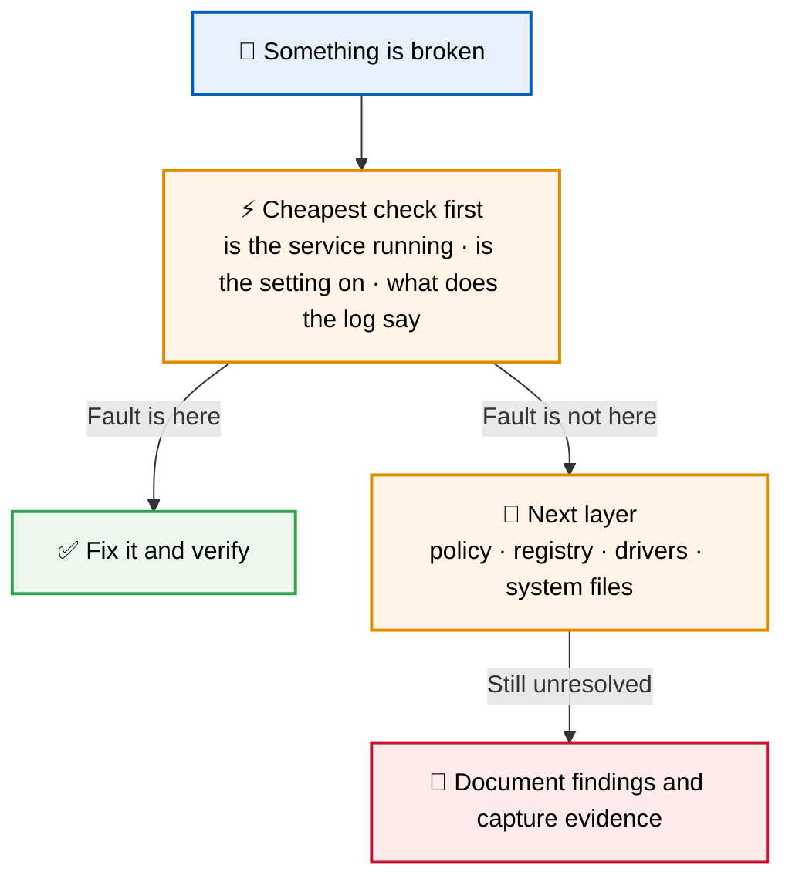
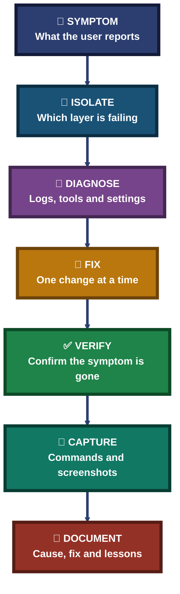

<div align="center">

# 🖥️ IT Support & Troubleshooting Labs — Accounts, Network, Services & Windows Systems

**9 Labs · Identity → Network → Services → Windows Systems · Real-World IT Support Scenarios**

Nine hands-on IT support labs, each documenting the symptom, the diagnosis, the fix and the verification — from the first ticket-style problem to the final confirmed resolution.


Every lab follows one method: capture the symptom, isolate the layer, fix one thing at a time, verify the fix, and keep the evidence.

### [📂 Jump to the labs](#labs-index)

</div>

---

## 📑 Table of Contents

1. [At a Glance](#at-a-glance)
2. [About This Folder](#about)
3. [Tools & Technologies](#tools)
4. [The Lab Flow](#flow)
5. [Which Lab Do I Need?](#which-lab)
6. [Identity & Accounts (1 lab)](#identity)
7. [Network Connectivity (3 labs)](#network)
8. [Messaging & Print Services (2 labs)](#services)
9. [Windows Systems & Remote Access (3 labs)](#windows)
10. [Coverage Snapshot](#coverage-snapshot)
11. [Troubleshooting Method Pipeline](#pipeline)
12. [Verification, Not Assumption](#verification)
13. [Command & Tool Cheat Sheet](#cheat-sheet)
14. [Challenges & Fixes at a Glance](#problems-fixes)
15. [Scope & Limitations](#scope-limitations)
16. [What I Learned](#what-i-learned)
17. [Skills Demonstrated](#skills-demonstrated)
18. [Labs Index](#labs-index)
19. [Repo Structure](#repo-structure)

---

<a id="at-a-glance"></a>
## 📊 At a Glance

| 📄 Labs | 🧩 Topic Groups | 🛠 Main Tools | 📁 Each Lab Has |
|:---:|:---:|:---:|:---:|
| **9** | **4** | **Built-in Windows tools & command line** | **README · screenshots** |

---

<a id="about"></a>
## 📖 About This Folder

This folder holds nine IT support and troubleshooting labs. Each lab lives in its own folder with a README that documents the scenario, tools, step-by-step diagnosis, screenshots, commands used, challenges and lessons learned.

- **Identity & Accounts:** Provisioning a domain and creating, disabling and enabling user accounts.
- **Network Connectivity:** DNS resolution, IP and gateway conflicts, and LAN and Wi-Fi diagnostics.
- **Messaging & Print Services:** Mail delivery problems and network printing faults.
- **Windows Systems & Remote Access:** Remote Desktop and VPN faults, system performance and crash diagnostics, and Windows Update repair.

> [!NOTE]
> Labs 07, 08 and 09 were worked on a single Windows machine using built-in tools only. Screenshots are inside each lab folder.

<div align="center">

### 🧩 Lab Workflow at a Glance

<table>
<tr>
<td align="center" valign="top" width="18%">

**🎫 Symptom**<br>
<sub>What the user<br>reports</sub>

</td>
<td align="center" valign="middle" width="5%">

**➜**

</td>
<td align="center" valign="top" width="20%">

**🔎 Isolate**<br>
<sub>Find the layer<br>that is failing</sub>

</td>
<td align="center" valign="middle" width="5%">

**➜**

</td>
<td align="center" valign="top" width="18%">

**🔧 Fix**<br>
<sub>One change<br>at a time</sub>

</td>
<td align="center" valign="middle" width="5%">

**➜**

</td>
<td align="center" valign="top" width="18%">

**✅ Verify**<br>
<sub>Confirm the<br>symptom is gone</sub>

</td>
<td align="center" valign="middle" width="5%">

**➜**

</td>
<td align="center" valign="top" width="16%">

**📝 Document**<br>
<sub>Commands and<br>evidence</sub>

</td>
</tr>
<tr>
<td colspan="9" align="center">


<br>
<sub>Built-in Windows and command-line tools, no paid software</sub>

</td>
</tr>
</table>

</div>

---

<a id="tools"></a>
## 🛠️ Tools & Technologies

| Tool | Purpose |
|------|---------|
| Samba4 Active Directory | Domain provisioning and user account management |
| `ipconfig`, `arp`, `ping` | Checking addressing, neighbours and reachability |
| `nslookup`, `dig` | Forward and reverse DNS lookups |
| Mail port and DNS MX testing | Diagnosing SMTP, IMAP and POP3 delivery |
| Print spooler & printer settings | Fixing print failures and network printer configuration |
| Event Viewer, Task Manager, Resource Monitor, Reliability Monitor | Finding what failed and when |
| Device Manager & PowerShell driver audit | Diagnosing driver faults |
| SFC & DISM | Repairing corrupted system files and the component store |
| Registry Editor & Group Policy Editor | Finding and changing settings that block a feature |
| Windows Update services (`wuauserv`, `bits`, `cryptsvc`) | Resetting a stuck update pipeline |
| WinDbg | Reading minidumps after a crash |

---

<a id="flow"></a>
## ⏱️ The Lab Flow

```mermaid
flowchart LR
    subgraph G1["🟣 IDENTITY & ACCOUNTS"]
        direction TB
        A1["Active Directory<br/>User Accounts"]
    end
    subgraph G2["🔵 NETWORK CONNECTIVITY"]
        direction TB
        B1["DNS<br/>Resolution"]
        B2["Gateway &<br/>IP Conflict"]
        B3["LAN & Wi-Fi<br/>Diagnostics"]
    end
    subgraph G3["🟠 MESSAGING & PRINT"]
        direction TB
        C1["Email<br/>Troubleshooting"]
        C2["Printer & Network<br/>Printing"]
    end
    subgraph G4["🟢 WINDOWS SYSTEMS"]
        direction TB
        D1["Remote Desktop<br/>& VPN"]
        D2["System<br/>Diagnostics"]
        D3["Windows Update<br/>& Patching"]
    end
    G1 ==> G2 ==> G3 ==> G4

    classDef id fill:#f0eaf8,stroke:#6f42c1,stroke-width:2px,color:#000
    classDef nw fill:#e8f1fb,stroke:#005EB8,stroke-width:2px,color:#000
    classDef sv fill:#fff4e5,stroke:#e08a00,stroke-width:2px,color:#000
    classDef ws fill:#eef7ee,stroke:#2ea44f,stroke-width:2px,color:#000
    class A1 id
    class B1,B2,B3 nw
    class C1,C2 sv
    class D1,D2,D3 ws
```



<p align="center"><em>The groups show which topic each lab belongs to. Lab numbers are in the Labs Index.</em></p>

---

<a id="which-lab"></a>
## 🧭 Which Lab Do I Need?

```mermaid
flowchart TD
    Start(["🎯 What is the user reporting?"]):::start
    Start --> A["Account locked, disabled<br/>or missing in the domain"]:::q
    Start --> B["Websites or names<br/>will not resolve"]:::q
    Start --> C["Duplicate IP or wrong<br/>gateway, no connectivity"]:::q
    Start --> D["Wired or wireless<br/>connection is unreliable"]:::q
    Start --> E["Email will not send<br/>or receive"]:::q
    Start --> F["Printer offline or<br/>jobs stuck"]:::q
    Start --> G["Cannot connect over<br/>Remote Desktop or VPN"]:::q
    Start --> H["PC is slow, crashing<br/>or blue-screening"]:::q
    Start --> I["Windows Update fails<br/>or will not install"]:::q
    A --> S1(["Active Directory & User Accounts"]):::s
    B --> S2(["DNS Troubleshooting"]):::s
    C --> S3(["Gateway & IP Conflict"]):::s
    D --> S4(["LAN & Wi-Fi Diagnostics"]):::s
    E --> S5(["Email Troubleshooting"]):::s
    F --> S6(["Printer & Network Print"]):::s
    G --> S7(["Remote Desktop & VPN"]):::s
    H --> S8(["System Diagnostics"]):::s
    I --> S9(["Windows Update & Patching"]):::s

    classDef start fill:#943126,stroke:#571C16,stroke-width:3px,color:#FFFFFF,font-weight:bold
    classDef q fill:#1A5276,stroke:#0B2E43,stroke-width:3px,color:#FFFFFF,font-weight:bold
    classDef s fill:#1E8449,stroke:#0E4A28,stroke-width:3px,color:#FFFFFF,font-weight:bold
```



---

<a id="identity"></a>
## 🟣 Identity & Accounts (1 lab)

**Goal:** Stand up a domain and manage the accounts inside it.

| Focus | What the Lab Covers | Folder |
|---|---|:---:|
| Active Directory & User Account Issues | Provisioning a domain with Samba4 AD, then creating, disabling and enabling user accounts. | [📁 Lab](./01-Active-Directory-User-Account-Issues/) |

---

<a id="network"></a>
## 🔵 Network Connectivity (3 labs)

**Goal:** Work out which layer is failing — name resolution, addressing or the physical and wireless link — and fix it.

| Focus | What the Lab Covers | Folder |
|---|---|:---:|
| DNS Troubleshooting & Resolution | Forward and reverse lookups with `nslookup` and `dig`, and clearing the DNS cache. | [📁 Lab](./02-DNS_Troubleshooting_Resolution/) |
| Gateway & IP Conflict Resolution | APIPA addressing, duplicate IPs and default gateway misconfiguration. | [📁 Lab](./04-Gateway_IP_Conflict_Resolution/) |
| LAN & Wi-Fi Connectivity Diagnostics | `ipconfig` and `arp` checks, SSID problems and channel interference. | [📁 Lab](./05-LAN-WiFi-Connectivity-Diagnostics/) |

### Where Connectivity Can Break


---

<a id="services"></a>
## 🟠 Messaging & Print Services (2 labs)

**Goal:** Get mail flowing and documents printing again.

| Focus | What the Lab Covers | Folder |
|---|---|:---:|
| Email Troubleshooting | SMTP, IMAP and POP3 delivery issues, DNS MX record problems and mail port testing. | [📁 Lab](./03-Email-Troubleshooting/) |
| Printer & Network Print Troubleshooting | Print spooler failures, driver conflicts and network printer configuration across subnets. | [📁 Lab](./06-Printer_Network_Print_Troubleshooting/) |

---

<a id="windows"></a>
## 🟢 Windows Systems & Remote Access (3 labs)

**Goal:** Diagnose and repair a Windows machine using only the tools Windows already ships with.

| Focus | What the Lab Covers | Folder |
|---|---|:---:|
| Remote Desktop & VPN Troubleshooting | 20 modules on one Windows 10 Pro machine. Six RDP faults staged and fixed: console-session error, wrong-IP error, firewall block, stopped `TermService`, registry `fDenyTSConnections` disable and a Group Policy restriction. Tools: CMD, PowerShell, Registry Editor, Group Policy Editor and Event Viewer. 20 screenshots. | [📁 Lab](./07-Remote_Desktop_VPN_Troubleshooting/) |
| System Diagnostics & Desktop Support | 20 modules on Windows 10/11 across five fault categories: high CPU/RAM, driver issues, app crashes, BSOD and corrupted system files. Diagnosed with Task Manager, Resource Monitor, Event Viewer, Reliability Monitor, Device Manager, a PowerShell driver audit, SFC/DISM, memory and disk diagnostics, and WinDbg minidump analysis. No faults were artificially staged. 21 screenshots. | [📁 Lab](./08-System_Diagnostics_Desktop_Support/) |
| Windows Update & Patch Management | 17 modules on Windows 10 Pro 22H2. Cycled `wuauserv`, `bits` and `cryptsvc`, cleared the `SoftwareDistribution` and `catroot2` caches, ran DISM CheckHealth, ScanHealth and RestoreHealth plus SFC, audited the Windows Update policy registry keys, and fixed a PSWindowsUpdate execution-policy block. 17 screenshots. | [📁 Lab](./09-Windows_Update_Patch_Management/) |

### 🔍 Analyst Note — Why the Simple Check Comes First

Every lab starts with the cheapest check before deeper repair. It rules out a whole group of causes in seconds.



---

<a id="coverage-snapshot"></a>
## 🌟 Coverage Snapshot

| 🛡️ Domain | 📌 Where It Appears | ✅ What Is Shown |
|---|---|---|
| Identity & Accounts | Active Directory lab | Domain provisioning, create / disable / enable users |
| Name Resolution | DNS lab | Forward and reverse lookups, cache flush |
| IP Addressing | Gateway & IP Conflict lab | APIPA, duplicate IPs, gateway misconfiguration |
| Link Diagnostics | LAN & Wi-Fi lab | `ipconfig`, `arp`, SSID and channel issues |
| Mail | Email lab | SMTP, IMAP, POP3, MX records, port testing |
| Printing | Printer lab | Spooler, drivers, network printer setup |
| Remote Access | Remote Desktop & VPN lab | Six staged RDP faults and their fixes |
| Performance & Crashes | System Diagnostics lab | CPU/RAM, drivers, app crashes, BSOD, minidump analysis |
| Patching | Windows Update lab | Service reset, cache clear, DISM, SFC, policy audit |

---

<a id="pipeline"></a>
## 🧭 Troubleshooting Method Pipeline

How every lab turns a user complaint into a verified fix



---

<a id="verification"></a>
## ✅ Verification, Not Assumption

A recurring rule across the labs: a fix is not done until the original symptom has been re-tested and is gone.

| Lab | How It Was Handled |
|---|---|
| Remote Desktop & VPN | Six faults staged one at a time, each diagnosed with the right tool and fixed |
| System Diagnostics | Real machine state diagnosed as found; nothing was artificially staged, so findings reflect genuine conditions |
| Windows Update | Update services, caches and system files repaired step by step, with the policy registry audited and an execution-policy block resolved |
| All other labs | See the verification step in each lab's README |

---

<a id="cheat-sheet"></a>
## 🧾 Command & Tool Cheat Sheet

| Command / Tool | Purpose |
|---------|---------|
| `ipconfig /all` · `/release` · `/renew` · `/flushdns` | Inspect and refresh addressing and the DNS cache |
| `arp -a` | See which IP maps to which MAC on the local network |
| `nslookup <name>` · `dig <name>` | Test name resolution |
| `Test-NetConnection <host> -Port <port>` | Test whether a port is reachable |
| `Get-Service TermService` · `Start-Service TermService` | Check and start the Remote Desktop service |
| `reg query "HKLM\SYSTEM\CurrentControlSet\Control\Terminal Server" /v fDenyTSConnections` | Check whether RDP is disabled in the registry |
| `gpresult /r` | See which Group Policies apply |
| `net stop wuauserv` · `bits` · `cryptsvc` (then start again) | Cycle the Windows Update services |
| `DISM /Online /Cleanup-Image /CheckHealth` · `/ScanHealth` · `/RestoreHealth` | Check and repair the Windows component store |
| `sfc /scannow` | Scan and repair protected system files |
| Event Viewer · Reliability Monitor | Find what failed and when |

> Common commands for these topics. Check the exact commands used in each lab against that lab's README.

---

<a id="problems-fixes"></a>
## ⚠️ Challenges & Fixes at a Glance

| ❌ Challenge | ✅ Solution |
|---|---|
| RDP failing for several different reasons on one machine | Staged and fixed each fault separately — console-session error, wrong IP, firewall block, stopped `TermService`, `fDenyTSConnections` and Group Policy — using the matching tool for each |
| Windows Update tooling blocked by an execution-policy setting | Diagnosed the PSWindowsUpdate execution-policy block and resolved it before continuing the repair |
| Diagnosing a real machine with no staged faults | Worked from actual Event Viewer, Reliability Monitor and minidump evidence rather than a scripted problem |
| Other labs | See the Challenges & Fixes section in each lab's README |

---

<a id="scope-limitations"></a>
## 🚧 Scope & Limitations

- **Lab environments, not production:** Labs were run on personal or lab machines, not a live company network.
- **Built-in tools:** The Windows labs rely on tools Windows already includes, so results depend on the OS version noted in each lab.
- **Samba4, not Windows Server:** The Active Directory lab uses Samba4 AD, so some behaviour differs from a Windows Server domain controller.
- **Evidence lives in the lab folders:** Screenshots are stored in each lab's folder.
- **One scenario per lab:** Other causes of the same symptom are not covered.

These limits are stated so the labs are read as demonstrations, not as guaranteed procedures for every environment.

---

<a id="what-i-learned"></a>
## 🧠 What I Learned

- **Isolate the layer before fixing anything.** Link, address, name resolution and service are different problems with different fixes.
- **One fault can hide behind another.** Six separate things can each stop Remote Desktop, so fixing one and re-testing shows what is left.
- **Real evidence beats a guess.** Event Viewer, Reliability Monitor and minidumps show what actually happened.
- **Built-in tools go a long way.** SFC, DISM, Event Viewer and the command line covered most of these faults.
- **Save the evidence.** Commands, outputs and screenshots make each lab repeatable.

---

<a id="skills-demonstrated"></a>
## 🛠️ Skills Demonstrated

- Provisioning a domain and managing user accounts in Active Directory
- Diagnosing DNS, IP addressing, gateway and Wi-Fi faults with command-line tools
- Troubleshooting SMTP, IMAP and POP3 mail delivery and MX record problems
- Fixing print spooler failures, driver conflicts and network printer setup
- Troubleshooting Remote Desktop and VPN faults across firewall, service, registry and policy layers
- Diagnosing performance problems, driver faults, app crashes and BSODs with Windows diagnostic tools and WinDbg
- Repairing Windows Update with service resets, cache clearing, DISM and SFC
- Documenting each lab with commands, screenshots and lessons

---

<a id="labs-index"></a>
## 📂 Labs Index

| Lab # | Lab | Group | Folder |
|:---:|---|:---:|---|
| 01 | Active Directory & User Account Issues | Identity | [`01-Active-Directory-User-Account-Issues`](./01-Active-Directory-User-Account-Issues/) |
| 02 | DNS Troubleshooting & Resolution | Network | [`02-DNS_Troubleshooting_Resolution`](./02-DNS_Troubleshooting_Resolution/) |
| 03 | Email Troubleshooting | Services | [`03-Email-Troubleshooting`](./03-Email-Troubleshooting/) |
| 04 | Gateway & IP Conflict Resolution | Network | [`04-Gateway_IP_Conflict_Resolution`](./04-Gateway_IP_Conflict_Resolution/) |
| 05 | LAN & Wi-Fi Connectivity Diagnostics | Network | [`05-LAN-WiFi-Connectivity-Diagnostics`](./05-LAN-WiFi-Connectivity-Diagnostics/) |
| 06 | Printer & Network Print Troubleshooting | Services | [`06-Printer_Network_Print_Troubleshooting`](./06-Printer_Network_Print_Troubleshooting/) |
| 07 | Remote Desktop & VPN Troubleshooting | Windows | [`07-Remote_Desktop_VPN_Troubleshooting`](./07-Remote_Desktop_VPN_Troubleshooting/) |
| 08 | System Diagnostics & Desktop Support | Windows | [`08-System_Diagnostics_Desktop_Support`](./08-System_Diagnostics_Desktop_Support/) |
| 09 | Windows Update & Patch Management | Windows | [`09-Windows_Update_Patch_Management`](./09-Windows_Update_Patch_Management/) |

---

<a id="repo-structure"></a>
## 📁 Repo Structure

```text
Cisco-Networking-Lab-Portfolio/
|-- 01-Networking/
|-- 02-Network-Security/
|-- 03-IT-Support-Troubleshooting/
|   |-- README.md
|   |-- 01-Active-Directory-User-Account-Issues/
|   |-- 02-DNS_Troubleshooting_Resolution/
|   |-- 03-Email-Troubleshooting/
|   |-- 04-Gateway_IP_Conflict_Resolution/
|   |-- 05-LAN-WiFi-Connectivity-Diagnostics/
|   |-- 06-Printer_Network_Print_Troubleshooting/
|   |-- 07-Remote_Desktop_VPN_Troubleshooting/
|   |-- 08-System_Diagnostics_Desktop_Support/
|   `-- 09-Windows_Update_Patch_Management/
|-- LICENSE
`-- README.md
```

<div align="center">

🌐 **[What is DNS](https://www.cloudflare.com/learning/dns/what-is-dns/)** · 📶 **[What is DHCP](https://www.cloudflare.com/learning/network-layer/what-is-dhcp/)** · 🪟 **[Windows Commands](https://learn.microsoft.com/windows-server/administration/windows-commands/windows-commands)**

[⬅️ Back to Portfolio Root](../README.md)

</div>
