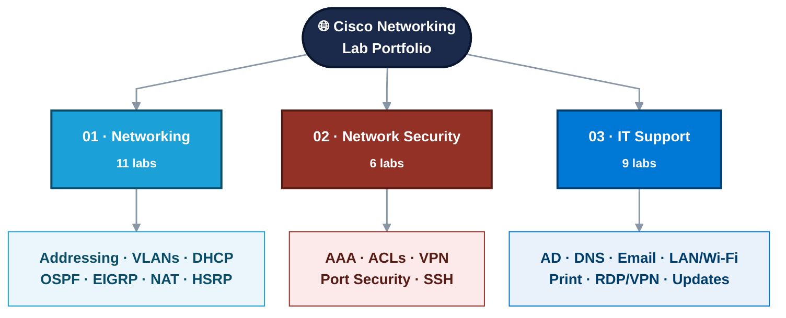
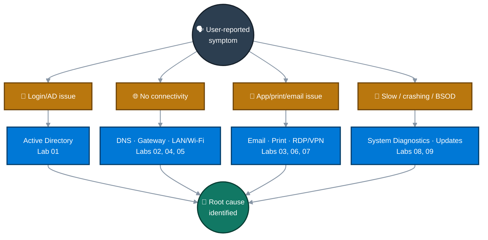

<div align="center">

# 🌐 Cisco Networking Lab Portfolio

A hands-on collection of Cisco Packet Tracer and Windows troubleshooting labs, organized into three tracks — core networking, network security, and IT support/troubleshooting. Every lab documents the topology, the configuration, the verification, and the gaps, not just the happy path.

<sub>by <a href="https://github.com/malaika-azhar">@malaika-azhar</a></sub>

<br>


</div>

---

## 📑 Table of Contents

1. [At a Glance](#at-a-glance)
2. [Portfolio Architecture](#architecture)
3. [The Method](#method)
4. [Tools & Technologies](#tools)
5. [01 — Networking](#01-networking)
6. [02 — Network Security](#02-security)
7. [03 — IT Support & Troubleshooting](#03-support)
8. [Skills Demonstrated](#skills)
9. [Repo Structure](#repo-structure)

---

<a id="at-a-glance"></a>
## 📊 At a Glance

<div align="center">

| 🌐 Networking | 🔒 Network Security | 🖥️ IT Support | 📁 Total Labs |
|:---:|:---:|:---:|:---:|
| **11 Labs** | **6 Labs** | **9 Labs** | **26** |

</div>

---

<a id="architecture"></a>
## 🏗️ Portfolio Architecture



---

<a id="method"></a>
## 🧭 The Method


---

<a id="tools"></a>
## 🛠️ Tools & Technologies

| Category | Tools |
|---|---|
| Simulation | Cisco Packet Tracer |
| Hardware modeled | Router 2911, Switch 2960 |
| OS | Windows 10/11 Pro |
| Command-line | CMD, PowerShell |
| System internals | Registry Editor, Group Policy Editor, Event Viewer, WinDbg |
| Switching | VLANs, 802.1Q trunking, VTP, port security, STP loop prevention |
| Routing | OSPF (single & multi-area), EIGRP, RIP, static, redistribution, NAT/PAT, HSRP |
| Security | AAA, standard & extended ACLs, SSH hardening, IPsec site-to-site VPN |
| IT Support | Active Directory, DNS, DHCP, email, RDP/VPN, print services, SFC/DISM, minidump analysis |

---

<a id="01-networking"></a>
## 🌐 01 — Networking


| # | Lab | Focus | Status |
|:---:|---|---|:---:|
| 01 | [Enterprise IP Addressing, VLSM & CIDR](./01-Networking/01-Enterprise-ip-addressing-vlsm-cidr) | 172.16.0.0/20 split via VLSM across 3 buildings + 3 WAN links, OSPF Area 0 | ✅ |
| 02 | [DHCP Multi-VLAN Deployment](./01-Networking/02-DHCP-multi-vlan-deployment) | 3 VLANs, Router-on-a-Stick, per-VLAN DHCP pools | ✅ |
| 03 | [VLAN & Inter-VLAN Routing](./01-Networking/03-Enterprise-network-vlan-intervlan-routing) | VTP sync, InterVLAN routing, SSH, port security, ACL | 🔄 |
| 04 | [VLAN/InterVLAN Troubleshooting](./01-Networking/04-Enterprise-network-troubleshooting-vlan-intervlan-routing) | Diagnosing VLAN/InterVLAN routing faults | ⏳ |
| 05 | [OSPF, EIGRP, RIP, Static Routing](./01-Networking/05-Routing-protocols-ospf-eigrp-rip-static) | Multi-protocol routing comparison | ⏳ |
| 06 | [OSPF Single-Area Routing](./01-Networking/06-Enterprise-network-ospf-single-area-routing-lab) | Single-area OSPF deployment | ⏳ |
| 07 | [Multi-Area OSPF](./01-Networking/07-Multi-area-ospf-lab) | Multi-area OSPF design and summarization | ⏳ |
| 08 | [OSPF/EIGRP Redistribution](./01-Networking/08-OSPF-eigrp-redistribution) | Redistributing routes between OSPF and EIGRP | ⏳ |
| 09 | [NAT/PAT Translation](./01-Networking/09-NAT-pat-address-translation) | NAT and PAT configuration | ⏳ |
| 10 | [HSRP Redundancy & Failover](./01-Networking/10-HSRP-redundancy-failover) | First-hop redundancy | ⏳ |
| 11 | [Syslog Multisite Logging](./01-Networking/11-Syslog-multisite-logging-enterprise) | Centralized logging across an enterprise topology | ⏳ |

---

<a id="02-security"></a>
## 🔒 02 — Network Security


| # | Lab | Focus | Status |
|:---:|---|---|:---:|
| 01 | [AAA Local Authentication](./02-Network-Security/01-AAA_Local_Authentication) | Local AAA authentication | ⏳ |
| 02 | [Extended ACL — Telnet/Ping](./02-Network-Security/02-Extended_ACL_Telnet_Ping_Control) | Extended ACLs controlling Telnet and ICMP | ⏳ |
| 03 | [IPsec VPN Site-to-Site](./02-Network-Security/03-IPsec_VPN_Site_to_Site) | Site-to-site IPsec VPN tunnel | ⏳ |
| 04 | [Port Security & STP Loop Prevention](./02-Network-Security/04-Port_Security_STP_Loop_Prevention) | Port security plus STP loop prevention | ⏳ |
| 05 | [SSH Hardening](./02-Network-Security/05-SSH_Hardening_Telnet_Replacement) | Replacing Telnet with SSH v2 | ⏳ |
| 06 | [Standard ACL Implementation](./02-Network-Security/06-Standard_ACL_Implementation) | Numbered → named ACL, host-based deny/permit | ✅ |

---

<a id="03-support"></a>
## 🖥️ 03 — IT Support & Troubleshooting



| # | Lab | Focus | Status |
|:---:|---|---|:---:|
| 01 | [AD User Account Issues](./03-IT-Support-Troubleshooting/01-Active-Directory-User-Account-Issues) | Diagnosing AD account/login problems | ⏳ |
| 02 | [DNS Troubleshooting](./03-IT-Support-Troubleshooting/02-DNS_Troubleshooting_Resolution) | DNS resolution failure diagnosis | ⏳ |
| 03 | [Email Troubleshooting](./03-IT-Support-Troubleshooting/03-Email-Troubleshooting) | Email client/server issue diagnosis | ⏳ |
| 04 | [Gateway IP Conflict Resolution](./03-IT-Support-Troubleshooting/04-Gateway_IP_Conflict_Resolution) | Resolving duplicate gateway IPs | ⏳ |
| 05 | [LAN/Wi-Fi Diagnostics](./03-IT-Support-Troubleshooting/05-LAN-WiFi-Connectivity-Diagnostics) | Wired and wireless connectivity troubleshooting | ⏳ |
| 06 | [Printer & Network Print Troubleshooting](./03-IT-Support-Troubleshooting/06-Printer_Network_Print_Troubleshooting) | Network print failure diagnosis | ⏳ |
| 07 | [Remote Desktop & VPN Troubleshooting](./03-IT-Support-Troubleshooting/07-Remote_Desktop_VPN_Troubleshooting) | 6 RDP faults staged/fixed — firewall, service, registry, GPO | ✅ |
| 08 | [System Diagnostics & Desktop Support](./03-IT-Support-Troubleshooting/08-System_Diagnostics_Desktop_Support) | High CPU/RAM, driver faults, app crashes, BSOD, SFC/DISM | ✅ |
| 09 | [Windows Update & Patch Management](./03-IT-Support-Troubleshooting/09-Windows_Update_Patch_Management) | Service repair, DISM/SFC, PSWindowsUpdate fix | ✅ |

---

<a id="skills"></a>
## 🧠 Skills Demonstrated

VLSM/CIDR addressing · VLANs & trunking · Inter-VLAN routing · OSPF/EIGRP/RIP · NAT/PAT · HSRP · AAA & ACLs · SSH hardening · Site-to-site IPsec VPN · Active Directory & DNS troubleshooting · Windows service/registry/GPO repair · SFC/DISM image repair · BSOD & minidump analysis · CMD & PowerShell verification

---

<a id="repo-structure"></a>
## 📁 Repo Structure

```
Cisco-Networking-Lab-Portfolio/
├── 01-Networking/                   (11 labs)
├── 02-Network-Security/             (6 labs)
└── 03-IT-Support-Troubleshooting/   (9 labs)
```
