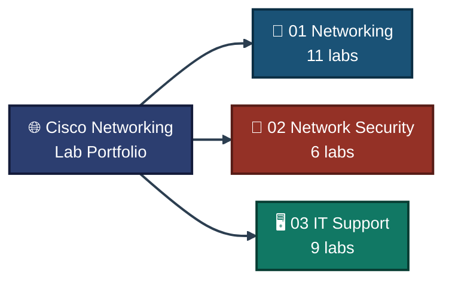
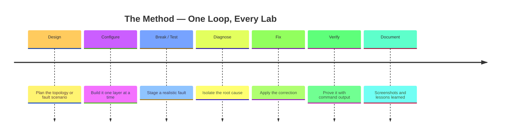
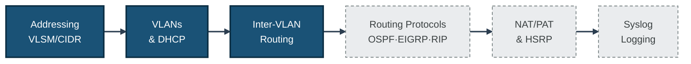
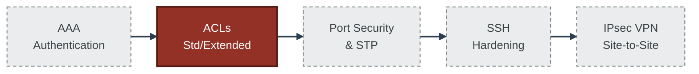
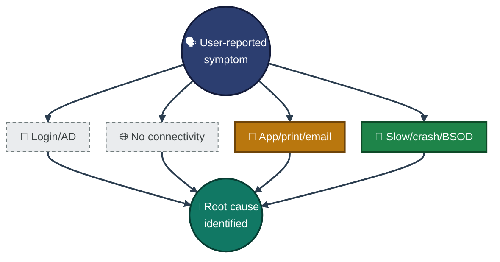
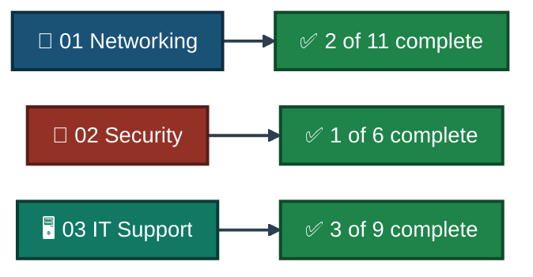

<div align="center">

# 🌐 Cisco Networking Lab Portfolio

**malaika-azhar**

A hands-on collection of Cisco Packet Tracer and Windows troubleshooting labs, organized into three tracks — core networking, network security, and IT support/troubleshooting. Every lab documents the topology, the configuration, the verification, and the gaps, not just the happy path.


</div>

---

## 📑 Table of Contents

1. [At a Glance](#at-a-glance)
2. [About This Portfolio](#about)
3. [Portfolio Structure](#portfolio-structure)
4. [The Method](#method)
5. [Tools & Technologies](#tools-technologies)
6. [01 — Networking](#01-networking)
7. [02 — Network Security](#02-network-security)
8. [03 — IT Support & Troubleshooting](#03-it-support)
9. [Coverage Snapshot](#coverage-snapshot)
10. [Skills Demonstrated](#skills-demonstrated)
11. [Repo Structure](#repo-structure)

---

<a id="at-a-glance"></a>
## 📊 At a Glance

| 🌐 Networking | 🔒 Network Security | 🖥️ IT Support | 📁 Total Labs |
|:---:|:---:|:---:|:---:|
| **11** | **6** | **9** | **26** |

---

<a id="about"></a>
## 📖 About This Portfolio

This repo is split into three tracks that build on each other:

- **01 — Networking:** core routing, switching, and enterprise addressing fundamentals
- **02 — Network Security:** hardening those same networks — ACLs, AAA, VPNs, port security
- **03 — IT Support & Troubleshooting:** Windows-side helpdesk scenarios — diagnosing and fixing real fault conditions

Each completed lab has its own folder and its own full README — topology, step-by-step configuration, verification, challenges, and a screenshot index.

---

<a id="portfolio-structure"></a>
## 🗺️ Portfolio Structure


<p align="center"><em>Three tracks under one portfolio — each folder holds its own set of fully documented labs.</em></p>

---

<a id="method"></a>
## 🧭 The Method

How a lab goes from a blank topology to a documented, proven result


<p align="center"><em>Every lab in this portfolio follows this same loop, so the evidence trail is consistent no matter the topic.</em></p>

---

<a id="tools-technologies"></a>
## 🛠️ Tools & Technologies

| Category | Tools |
|---|---|
| 🖥️ Simulation | Cisco Packet Tracer |
| 🚪 Hardware modeled | Router 2911, Switch 2960 |
| 🪟 OS | Windows 10/11 Pro |
| ⌨️ Command-line | CMD, PowerShell |
| 🗝️ System internals | Registry Editor, Group Policy Editor, Event Viewer, WinDbg |
| 🔀 Switching | VLANs, 802.1Q trunking, VTP, port security, STP loop prevention |
| 🔵 Routing | OSPF (single & multi-area), EIGRP, RIP, static, redistribution, NAT/PAT, HSRP |
| 🔒 Security | AAA, standard & extended ACLs, SSH hardening, IPsec site-to-site VPN |
| 🖧 IT Support | Active Directory, DNS, DHCP, email, RDP/VPN, print services, SFC/DISM, minidump analysis |

---

<a id="01-networking"></a>
## 🔷 01 — Networking



| # | Lab | Focus | Status |
|:---:|---|---|:---:|
| 01 | [Enterprise IP Addressing, VLSM & CIDR](./01-Networking/01-Enterprise-ip-addressing-vlsm-cidr) | 172.16.0.0/20 split via VLSM across 3 buildings + 3 WAN links, OSPF Area 0 | ✅ Complete |
| 02 | [DHCP Multi-VLAN Deployment](./01-Networking/02-DHCP-multi-vlan-deployment) | 3 VLANs, Router-on-a-Stick, per-VLAN DHCP pools | ✅ Complete |
| 03 | [VLAN & Inter-VLAN Routing](./01-Networking/03-Enterprise-network-vlan-intervlan-routing) | VTP sync, InterVLAN routing, SSH, port security, ACL | 🔄 In Progress |
| 04 | [VLAN/InterVLAN Troubleshooting](./01-Networking/04-Enterprise-network-troubleshooting-vlan-intervlan-routing) | Diagnosing VLAN/InterVLAN routing faults | ⏳ Planned |
| 05 | [OSPF, EIGRP, RIP, Static Routing](./01-Networking/05-Routing-protocols-ospf-eigrp-rip-static) | Multi-protocol routing comparison | ⏳ Planned |
| 06 | [OSPF Single-Area Routing](./01-Networking/06-Enterprise-network-ospf-single-area-routing-lab) | Single-area OSPF deployment | ⏳ Planned |
| 07 | [Multi-Area OSPF](./01-Networking/07-Multi-area-ospf-lab) | Multi-area OSPF design and summarization | ⏳ Planned |
| 08 | [OSPF/EIGRP Redistribution](./01-Networking/08-OSPF-eigrp-redistribution) | Redistributing routes between OSPF and EIGRP | ⏳ Planned |
| 09 | [NAT/PAT Translation](./01-Networking/09-NAT-pat-address-translation) | NAT and PAT configuration | ⏳ Planned |
| 10 | [HSRP Redundancy & Failover](./01-Networking/10-HSRP-redundancy-failover) | First-hop redundancy | ⏳ Planned |
| 11 | [Syslog Multisite Logging](./01-Networking/11-Syslog-multisite-logging-enterprise) | Centralized logging across an enterprise topology | ⏳ Planned |

---

<a id="02-network-security"></a>
## 🔺 02 — Network Security



| # | Lab | Focus | Status |
|:---:|---|---|:---:|
| 01 | [AAA Local Authentication](./02-Network-Security/01-AAA_Local_Authentication) | Local AAA authentication | ⏳ Planned |
| 02 | [Extended ACL — Telnet/Ping](./02-Network-Security/02-Extended_ACL_Telnet_Ping_Control) | Extended ACLs controlling Telnet and ICMP | ⏳ Planned |
| 03 | [IPsec VPN Site-to-Site](./02-Network-Security/03-IPsec_VPN_Site_to_Site) | Site-to-site IPsec VPN tunnel | ⏳ Planned |
| 04 | [Port Security & STP Loop Prevention](./02-Network-Security/04-Port_Security_STP_Loop_Prevention) | Port security plus STP loop prevention | ⏳ Planned |
| 05 | [SSH Hardening](./02-Network-Security/05-SSH_Hardening_Telnet_Replacement) | Replacing Telnet with SSH v2 | ⏳ Planned |
| 06 | [Standard ACL Implementation](./02-Network-Security/06-Standard_ACL_Implementation) | Numbered → named ACL, host-based deny/permit | ✅ Complete |

---

<a id="03-it-support"></a>
## 🖥️ 03 — IT Support & Troubleshooting



| # | Lab | Focus | Status |
|:---:|---|---|:---:|
| 01 | [AD User Account Issues](./03-IT-Support-Troubleshooting/01-Active-Directory-User-Account-Issues) | Diagnosing AD account/login problems | ⏳ Planned |
| 02 | [DNS Troubleshooting](./03-IT-Support-Troubleshooting/02-DNS_Troubleshooting_Resolution) | DNS resolution failure diagnosis | ⏳ Planned |
| 03 | [Email Troubleshooting](./03-IT-Support-Troubleshooting/03-Email-Troubleshooting) | Email client/server issue diagnosis | ⏳ Planned |
| 04 | [Gateway IP Conflict Resolution](./03-IT-Support-Troubleshooting/04-Gateway_IP_Conflict_Resolution) | Resolving duplicate gateway IPs | ⏳ Planned |
| 05 | [LAN/Wi-Fi Diagnostics](./03-IT-Support-Troubleshooting/05-LAN-WiFi-Connectivity-Diagnostics) | Wired and wireless connectivity troubleshooting | ⏳ Planned |
| 06 | [Printer & Network Print Troubleshooting](./03-IT-Support-Troubleshooting/06-Printer_Network_Print_Troubleshooting) | Network print failure diagnosis | ⏳ Planned |
| 07 | [Remote Desktop & VPN Troubleshooting](./03-IT-Support-Troubleshooting/07-Remote_Desktop_VPN_Troubleshooting) | 6 RDP faults staged/fixed — firewall, service, registry, GPO | ✅ Complete |
| 08 | [System Diagnostics & Desktop Support](./03-IT-Support-Troubleshooting/08-System_Diagnostics_Desktop_Support) | High CPU/RAM, driver faults, app crashes, BSOD, SFC/DISM | ✅ Complete |
| 09 | [Windows Update & Patch Management](./03-IT-Support-Troubleshooting/09-Windows_Update_Patch_Management) | Service repair, DISM/SFC, PSWindowsUpdate fix | ✅ Complete |

---

<a id="coverage-snapshot"></a>
## 🌟 Coverage Snapshot



---

<a id="skills-demonstrated"></a>
## 🧠 Skills Demonstrated Across the Portfolio

- Enterprise IP addressing, subnetting, VLSM and CIDR optimization
- VLAN segmentation, 802.1Q trunking, VTP, Router-on-a-Stick and native inter-VLAN routing
- OSPF (single- and multi-area), EIGRP, RIP, static routing, and route redistribution
- NAT/PAT translation and HSRP first-hop redundancy
- AAA authentication, standard & extended ACLs, SSH hardening, port security, STP loop prevention
- Site-to-site IPsec VPN configuration
- Active Directory & DNS troubleshooting, Windows service/registry/GPO repair
- SFC/DISM image repair, BSOD and minidump analysis
- Firewall rule inspection and management via `netsh advfirewall`
- Cross-verification of system state using both CMD and PowerShell

---

<a id="repo-structure"></a>
## 📁 Repo Structure

```text
Cisco-Networking-Lab-Portfolio/
|-- README.md
|-- LICENSE
|-- 01-Networking/                   (11 labs)
|-- 02-Network-Security/             (6 labs)
`-- 03-IT-Support-Troubleshooting/   (9 labs)
```

<div align="center">

📶 **[Cisco Packet Tracer](https://www.netacad.com/courses/packet-tracer)** · 🪟 **[Windows Server Docs](https://learn.microsoft.com/en-us/windows-server/)** · 🔀 **[OSPF Overview](https://www.cloudflare.com/learning/network-layer/what-is-ospf/)**

</div>
